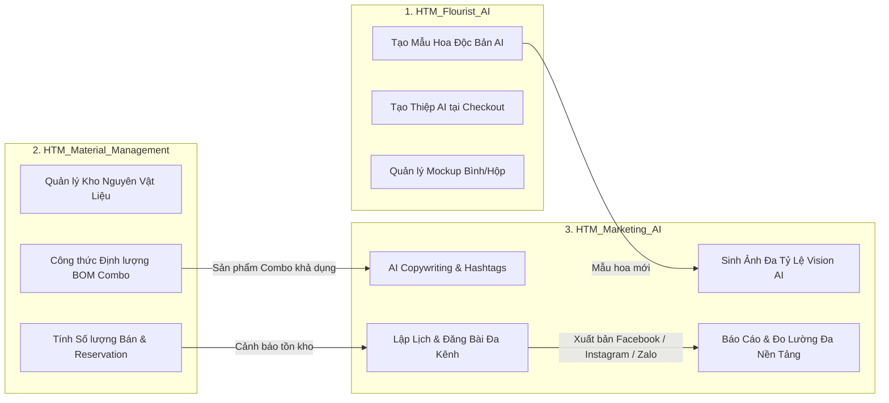

# Hệ Thống Hoa Theo Mùa — Kho Tài Liệu Đặc Tả (Document-First Repository)

Chào mừng bạn đến với kho lưu trữ tài liệu đặc tả yêu cầu nghiệp vụ (**User Stories**), thiết kế kỹ thuật (**Technical Design Documents - TDD**), từ điển dữ liệu (**Data Dictionary**) và kịch bản kiểm thử (**Unit Test Suite**) cho toàn bộ hệ sinh thái số **Hoa Theo Mùa**.

Kho lưu trữ áp dụng triệt để phương pháp tiếp cận **Document-First** (Tài liệu đi trước mã nguồn), đảm bảo toàn bộ luồng nghiệp vụ, giao diện, API Contract, và kịch bản kiểm thử BDD (Behavior-Driven Development) được chuẩn hóa và phê duyệt trước khi triển khai lập trình.

---

## 🏢 1. Danh Mục 3 Phân Hệ Dự Án

Hệ sinh thái **Hoa Theo Mùa** được chia tách thành 3 phân hệ dự án độc lập tương ứng với hệ thống quản lý công việc:

| # | Mã dự án (Key) | Tên phân hệ | Thư mục tài liệu | Mô tả phạm vi phân hệ |
| :-: | :--- | :--- | :--- | :--- |
| **1** | `hoa-theo-mua-ai-customize` | **HTM_Flourist_AI** | [`hoa-theo-mua-ai-flourist/`](file:///d:/VNZ/document-first-brief/hoa-theo-mua-ai-flourist/README.md) | **Cá nhân hóa mua sắm bằng AI**: Tạo mẫu phối hoa độc bản theo prompt, tạo thiệp AI tại checkout (`gõ máy` / `calligraphy`), thiệp handmade, quản lý mockup và quy tắc giá thiệp. |
| **2** | `hoa-theo-mua-ai-marketing` | **HTM_Marketing_AI** | [`hoa-theo-mua-ai-marketing/`](file:///d:/VNZ/document-first-brief/hoa-theo-mua-ai-marketing/README.md) | **Marketing & Truyền thông AI**: Tự động sinh caption & hashtag bằng AI, viết lại nội dung theo từng nền tảng, sinh ảnh đa tỷ lệ (1:1, 4:5, 9:16, 16:9, 2:1), lên lịch & tự động đăng bài đa kênh, thu thập báo cáo đa nền tảng (XLSX). |
| **3** | `hoa-theo-mua-material-management` | **HTM_Material_Management** | [`hoa-theo-mua-material-management/`](file:///d:/VNZ/document-first-brief/hoa-theo-mua-material-management/README.md) | **Quản lý Vật liệu & Định lượng Combo**: Bóc tách nguyên vật liệu thô (hoa cành, hoa phụ, phụ kiện), thiết lập công thức BOM cho Combo hoa, tính toán số lượng khả dụng có thể bán (AvailableForSale) theo thời gian thực và quản lý vòng đời giữ hàng (Reservation). |

---

## 🌐 2. Kiến Trúc Tương Tác Giữa Các Phân Hệ



---

## 📂 3. Cấu Trúc Thư Mục Tổng Thể Kho Lưu Trữ

```text
document-first-brief/
├── .gitignore                                     # Quy tắc bỏ qua tệp tạm & mã nguồn trích xuất
├── README.md                                      # Cổng tra cứu tổng quan toàn hệ thống (File hiện tại)
│
├── hoa-theo-mua-ai-flourist/                      # [Dự án 1] HTM_Flourist_AI
│   ├── README.md                                  # Tài liệu tổng quan phân hệ Flourist AI
│   ├── BusinessRules/                             # Quy tắc nghiệp vụ (Quota, AI Retry, Calligraphy rules)
│   ├── ConfirmedDoc/                              # Hợp đồng API & tài liệu kỹ thuật đã chốt
│   ├── Context/                                   # Sơ đồ CSDL, Data Dictionary, Ngữ cảnh nghiệp vụ
│   │   ├── AI_CUSTOMIZE_DB.dbdiagram              # Sơ đồ CSDL AI Customize
│   │   ├── AI_DB_Data_Dictionary.md               # Từ điển dữ liệu toàn diện
│   │   ├── AI_DB_Diagram.md                       # Sơ đồ ERD dạng Markdown
│   │   ├── AI_Flower_Context.md                   # Ngữ cảnh tạo hoa AI
│   │   ├── AI_Card_Context.md                     # Ngữ cảnh tạo thiệp AI tại Checkout
│   │   └── AI_Mockup_Context.md                   # Ngữ cảnh quản lý Mockup
│   ├── UserStory/                                 # 17 User Stories (US-003, US-030 -> US-048)
│   └── TDD/                                       # 12 TDDs (TDD-030 -> TDD-062, TDD-017, COVERAGE.md)
│
├── hoa-theo-mua-ai-marketing/                     # [Dự án 2] HTM_Marketing_AI
│   ├── README.md                                  # Tài liệu tổng quan phân hệ Marketing AI
│   ├── BusinessRules/                             # 76 Quy tắc nghiệp vụ (BR-001 -> BR-079)
│   ├── ConfirmedDoc/                              # Hợp đồng API
│   ├── Context/                                   # Sơ đồ CSDL (generated_posts, post_histories)
│   │   ├── Marketing_AI_Context.md                # Kiến trúc dữ liệu và liên kết đa hình
│   │   ├── Marketing_AI_DB.dbdiagram              # Sơ đồ CSDL định dạng DBML (dbdiagram.io)
│   │   └── Marketing_AI_DB_Diagram.md             # Sơ đồ ERD (Mermaid) và đặc tả chi tiết 10 Entities EF Core
│   ├── UserStory/                                 # 19 User Stories (STORY-002 -> STORY-025)
│   │   ├── 02-ScheduleAndAutoPublishPosts.md      # STORY-002: Lên lịch và tự động đăng bài
│   │   ├── 03-AutoGenerateMultiRatioImagesFromCore.md # STORY-003: Tự động sinh ảnh đa tỷ lệ
│   │   ├── 04-ViewSystemPromptsListAndDetail.md   # STORY-004: Xem danh sách và chi tiết System Prompt
│   │   ├── 05-UpdateSystemPrompt.md               # STORY-005: Sửa System Prompt & Quản lý phiên bản
│   │   ├── 06-DeleteSystemPrompt.md               # STORY-006: Xóa System Prompt
│   │   ├── 12-SearchSystemPrompts.md              # STORY-012: Tìm kiếm System Prompt
│   │   ├── 13-FilterSystemPrompts.md              # STORY-013: Lọc System Prompt theo trạng thái
│   │   ├── 14-ViewAutoPublishSchedules.md         # STORY-014: Xem danh sách và chi tiết lịch đăng
│   │   ├── 15-DeleteAutoPublishSchedule.md        # STORY-015: Xóa lịch đăng bài tự động & hủy Cron Job
│   │   ├── 16-UpdateAutoPublishSchedule.md        # STORY-016: Sửa thông tin lịch đăng bài tự động
│   │   ├── 17-AutoGenerateContentAndHashtags.md   # STORY-017: Tự động viết content và hashtag bằng AI
│   │   ├── 18-ViewSavedContentListAndDetail.md    # STORY-018: Xem danh sách và chi tiết content đã lưu
│   │   ├── 19-DeleteSavedContent.md               # STORY-019: Xóa an toàn content đã lưu lại
│   │   ├── 20-UpdateSavedContent.md               # STORY-020: Sửa content và hashtag đã lưu
│   │   ├── 21-ViewSavedImagesListAndDetail.md     # STORY-021: Xem danh sách và chi tiết ảnh đã lưu
│   │   ├── 22-DeleteSavedImage.md                 # STORY-022: Xóa ảnh đã lưu & Cascade Delete biến thể con
│   │   ├── 23-UpdateSavedImageInfo.md             # STORY-023: Sửa metadata ảnh (tên, mô tả, thẻ tags)
│   │   ├── 24-RewriteContentByPlatform.md         # STORY-024: Tự động viết lại nội dung theo từng nền tảng
│   │   └── 25-CollectAndManagePlatformReports.md  # STORY-025: Thu thập & quản lý báo cáo đa nền tảng (XLSX)
│   ├── TDD/                                       # Thiết kế kỹ thuật
│   └── UnitTest/                                  # Kịch bản kiểm thử
│
└── hoa-theo-mua-material-management/              # [Dự án 3] HTM_Material_Management
    ├── README.md                                  # Tài liệu tổng quan phân hệ Quản lý Vật liệu
    ├── BusinessRules/                             # BR-013, BR-014, BR-018, BR-019
    ├── ConfirmedDoc/                              # DanhSach_API.md, HTM_MATERIAL_API.md
    ├── Context/                                   # Ngữ cảnh kiến trúc vật liệu
    ├── UserStory/                                 # 13 User Stories (US-002, US-006 -> US-019)
    ├── TDD/                                       # TDD-010, TDD-011, DiagramUS002, DiagramUS006
    ├── UnitTest/                                  # 11 Test Cases chuẩn hóa Form Web
    └── Code/                                      # Mã nguồn trích xuất phục vụ kiểm thử (Product.cs)
```

---

## 📑 4. Danh Mục Chi Tiết Theo Từng Phân Hệ

### 4.1. Phân hệ `HTM_Flourist_AI` (`hoa-theo-mua-ai-flourist`)
* **Tổng quan:** [`hoa-theo-mua-ai-flourist/README.md`](file:///d:/VNZ/document-first-brief/hoa-theo-mua-ai-flourist/README.md)
* **Tài liệu kiến trúc cốt lõi:**
  - [`AI_CUSTOMIZE_DB.dbdiagram`](file:///d:/VNZ/document-first-brief/hoa-theo-mua-ai-flourist/Context/AI_CUSTOMIZE_DB.dbdiagram) — Sơ đồ CSDL AI Customize
  - [`AI_DB_Data_Dictionary.md`](file:///d:/VNZ/document-first-brief/hoa-theo-mua-ai-flourist/Context/AI_DB_Data_Dictionary.md) — Từ điển dữ liệu toàn diện & giải thích nghiệp vụ
  - [`AI_Flower_Context.md`](file:///d:/VNZ/document-first-brief/hoa-theo-mua-ai-flourist/Context/AI_Flower_Context.md) — Ngữ cảnh tạo hoa AI
  - [`AI_Card_Context.md`](file:///d:/VNZ/document-first-brief/hoa-theo-mua-ai-flourist/Context/AI_Card_Context.md) — Ngữ cảnh tạo thiệp AI tại Checkout
  - [`AI_Mockup_Context.md`](file:///d:/VNZ/document-first-brief/hoa-theo-mua-ai-flourist/Context/AI_Mockup_Context.md) — Ngữ cảnh quản lý Mockup
* **TDD & Unit Test Suite (121 Test Cases — [`COVERAGE.md`](file:///d:/VNZ/document-first-brief/hoa-theo-mua-ai-flourist/TDD/COVERAGE.md)):**
  - [`TDD-030`](file:///d:/VNZ/document-first-brief/hoa-theo-mua-ai-flourist/TDD/TDD-030/TDD-030_tao-yeu-cau-va-mau-hoa-ai.md): Tạo mẫu hoa AI (18 UTs)
  - [`TDD-035`](file:///d:/VNZ/document-first-brief/hoa-theo-mua-ai-flourist/TDD/TDD-035/TDD-035_tao-thep-thiet-ke-ai.md): Tạo thiệp thiết kế AI (19 UTs)
  - [`TDD-036`](file:///d:/VNZ/document-first-brief/hoa-theo-mua-ai-flourist/TDD/TDD-036/TDD-036_tao-lai-thep-tu-lich-su.md): Tạo lại thiệp từ lịch sử (12 UTs)
  - [`TDD-017`](file:///d:/VNZ/document-first-brief/hoa-theo-mua-ai-flourist/TDD/TDD-017/TDD-017-chon-va-tao-thiep-handmade.md): Chọn và tạo thiệp handmade
  - [`TDD-050`](file:///d:/VNZ/document-first-brief/hoa-theo-mua-ai-flourist/TDD/TDD-050/TDD-050_lay-danh-sach-mockup.md) $\rightarrow$ [`TDD-053`](file:///d:/VNZ/document-first-brief/hoa-theo-mua-ai-flourist/TDD/TDD-053/TDD-053_xoa-mockup.md): Quản lý Mockup (37 UTs)
  - [`TDD-054`](file:///d:/VNZ/document-first-brief/hoa-theo-mua-ai-flourist/TDD/TDD-054/TDD-054_lay-danh-sach-card-configs.md) $\rightarrow$ [`TDD-062`](file:///d:/VNZ/document-first-brief/hoa-theo-mua-ai-flourist/TDD/TDD-062/TDD-062_cap-nhat-card-config.md): Quản lý Card Configs (35 UTs)

---

### 4.2. Phân hệ `HTM_Marketing_AI` (`hoa-theo-mua-ai-marketing`)
* **Tổng quan:** [`hoa-theo-mua-ai-marketing/README.md`](file:///d:/VNZ/document-first-brief/hoa-theo-mua-ai-marketing/README.md)
* **Quy tắc nghiệp vụ (76 Business Rules):** Danh mục 76 quy tắc chuẩn hóa độc lập (chi tiết tại [Ma trận Business Rules](file:///d:/VNZ/document-first-brief/hoa-theo-mua-ai-marketing/README.md#-5-ma-trận-76-quy-tắc-nghiệp-vụ-business-rules-matrix)).
* **Đặc tả yêu cầu (19 User Stories):**
  - [`02-ScheduleAndAutoPublishPosts.md`](file:///d:/VNZ/document-first-brief/hoa-theo-mua-ai-marketing/UserStory/02-ScheduleAndAutoPublishPosts.md): **STORY-002** — Lên lịch và tự động đăng bài đa nền tảng.
  - [`03-AutoGenerateMultiRatioImagesFromCore.md`](file:///d:/VNZ/document-first-brief/hoa-theo-mua-ai-marketing/UserStory/03-AutoGenerateMultiRatioImagesFromCore.md): **STORY-003** — Tự động sinh ảnh đa tỷ lệ từ ảnh core (1:1, 4:5, 9:16, 16:9, 2:1).
  - [`04-ViewSystemPromptsListAndDetail.md`](file:///d:/VNZ/document-first-brief/hoa-theo-mua-ai-marketing/UserStory/04-ViewSystemPromptsListAndDetail.md): **STORY-004** — Xem danh sách và chi tiết System Prompt.
  - [`05-UpdateSystemPrompt.md`](file:///d:/VNZ/document-first-brief/hoa-theo-mua-ai-marketing/UserStory/05-UpdateSystemPrompt.md): **STORY-005** — Sửa System Prompt & Quản lý lịch sử phiên bản.
  - [`06-DeleteSystemPrompt.md`](file:///d:/VNZ/document-first-brief/hoa-theo-mua-ai-marketing/UserStory/06-DeleteSystemPrompt.md): **STORY-006** — Xóa System Prompt không còn sử dụng.
  - [`12-SearchSystemPrompts.md`](file:///d:/VNZ/document-first-brief/hoa-theo-mua-ai-marketing/UserStory/12-SearchSystemPrompts.md): **STORY-012** — Tìm kiếm nhanh System Prompt theo tên/mã.
  - [`13-FilterSystemPrompts.md`](file:///d:/VNZ/document-first-brief/hoa-theo-mua-ai-marketing/UserStory/13-FilterSystemPrompts.md): **STORY-013** — Lọc System Prompt theo trạng thái kích hoạt.
  - [`14-ViewAutoPublishSchedules.md`](file:///d:/VNZ/document-first-brief/hoa-theo-mua-ai-marketing/UserStory/14-ViewAutoPublishSchedules.md): **STORY-014** — Xem danh sách và chi tiết lịch đăng bài tự động.
  - [`15-DeleteAutoPublishSchedule.md`](file:///d:/VNZ/document-first-brief/hoa-theo-mua-ai-marketing/UserStory/15-DeleteAutoPublishSchedule.md): **STORY-015** — Xóa lịch đăng bài tự động & hủy Cron Job.
  - [`16-UpdateAutoPublishSchedule.md`](file:///d:/VNZ/document-first-brief/hoa-theo-mua-ai-marketing/UserStory/16-UpdateAutoPublishSchedule.md): **STORY-016** — Chỉnh sửa lịch đăng bài tự động và tái cấu hình Job.
  - [`17-AutoGenerateContentAndHashtags.md`](file:///d:/VNZ/document-first-brief/hoa-theo-mua-ai-marketing/UserStory/17-AutoGenerateContentAndHashtags.md): **STORY-017** — Tự động viết bài viết và hashtag chuẩn bằng AI.
  - [`18-ViewSavedContentListAndDetail.md`](file:///d:/VNZ/document-first-brief/hoa-theo-mua-ai-marketing/UserStory/18-ViewSavedContentListAndDetail.md): **STORY-018** — Xem danh sách, tìm kiếm và chi tiết content đã lưu.
  - [`19-DeleteSavedContent.md`](file:///d:/VNZ/document-first-brief/hoa-theo-mua-ai-marketing/UserStory/19-DeleteSavedContent.md): **STORY-019** — Xóa an toàn content đã lưu trong giao dịch ACID.
  - [`20-UpdateSavedContent.md`](file:///d:/VNZ/document-first-brief/hoa-theo-mua-ai-marketing/UserStory/20-UpdateSavedContent.md): **STORY-020** — Sửa content và hashtag đã lưu; kiểm soát đồng thời.
  - [`21-ViewSavedImagesListAndDetail.md`](file:///d:/VNZ/document-first-brief/hoa-theo-mua-ai-marketing/UserStory/21-ViewSavedImagesListAndDetail.md): **STORY-021** — Xem danh sách lưới, tìm kiếm theo tên/ID/thẻ tags và xem chi tiết ảnh.
  - [`22-DeleteSavedImage.md`](file:///d:/VNZ/document-first-brief/hoa-theo-mua-ai-marketing/UserStory/22-DeleteSavedImage.md): **STORY-022** — Xóa ảnh đã lưu và Cascade Delete các biến thể con theo tỷ lệ.
  - [`23-UpdateSavedImageInfo.md`](file:///d:/VNZ/document-first-brief/hoa-theo-mua-ai-marketing/UserStory/23-UpdateSavedImageInfo.md): **STORY-023** — Cập nhật metadata của ảnh (tên ảnh, mô tả, thẻ tags).
  - [`24-RewriteContentByPlatform.md`](file:///d:/VNZ/document-first-brief/hoa-theo-mua-ai-marketing/UserStory/24-RewriteContentByPlatform.md): **STORY-024** — Tự động viết lại nội dung theo từng nền tảng (Facebook, Instagram, Zalo OA).
  - [`25-CollectAndManagePlatformReports.md`](file:///d:/VNZ/document-first-brief/hoa-theo-mua-ai-marketing/UserStory/25-CollectAndManagePlatformReports.md): **STORY-025** — Thu thập và quản lý báo cáo từ các nền tảng (XLSX).
* **Tài liệu kiến trúc & CSDL:**
  - [`Marketing_AI_Context.md`](file:///d:/VNZ/document-first-brief/hoa-theo-mua-ai-marketing/Context/Marketing_AI_Context.md) — Kiến trúc dữ liệu `generated_posts`, `post_histories` và liên kết đa hình với `client_histories`.
  - [`Marketing_AI_DB.dbdiagram`](file:///d:/VNZ/document-first-brief/hoa-theo-mua-ai-marketing/Context/Marketing_AI_DB.dbdiagram) — Sơ đồ CSDL định dạng DBML chuẩn cho dbdiagram.io.
  - [`Marketing_AI_DB_Diagram.md`](file:///d:/VNZ/document-first-brief/hoa-theo-mua-ai-marketing/Context/Marketing_AI_DB_Diagram.md) — Sơ đồ ERD (Mermaid) và đặc tả chi tiết 10 Entities EF Core.

---

### 4.3. Phân hệ `HTM_Material_Management` (`hoa-theo-mua-material-management`)
* **Tổng quan:** [`hoa-theo-mua-material-management/README.md`](file:///d:/VNZ/document-first-brief/hoa-theo-mua-material-management/README.md)
* **Quy tắc nghiệp vụ (Business Rules):**
  - [`BR-013.md`](file:///d:/VNZ/document-first-brief/hoa-theo-mua-material-management/BusinessRules/BR-013.md): Giữ dòng tham chiếu vật liệu ngừng kinh doanh.
  - [`BR-014.md`](file:///d:/VNZ/document-first-brief/hoa-theo-mua-material-management/BusinessRules/BR-014.md): Thứ tự hiển thị theo vai trò.
  - [`BR-018.md`](file:///d:/VNZ/document-first-brief/hoa-theo-mua-material-management/BusinessRules/BR-018.md): Hoa phụ không giới hạn khả năng bán.
  - [`BR-019.md`](file:///d:/VNZ/document-first-brief/hoa-theo-mua-material-management/BusinessRules/BR-019.md): Combo không đủ điều kiện thì số lượng bán bằng 0.
* **Tài liệu API đã chốt:**
  - [`DanhSach_API.md`](file:///d:/VNZ/document-first-brief/hoa-theo-mua-material-management/ConfirmedDoc/DanhSach_API.md): Tổng hợp danh sách API và xử lý Service.
  - [`HTM_MATERIAL_API.md`](file:///d:/VNZ/document-first-brief/hoa-theo-mua-material-management/ConfirmedDoc/HTM_MATERIAL_API.md): Đặc tả request/response chi tiết của API Material.
* **Thiết kế kỹ thuật (TDD):**
  - [`TDD-010.md`](file:///d:/VNZ/document-first-brief/hoa-theo-mua-material-management/TDD/TDD-010.md): Tìm kiếm & lọc sản phẩm có nhãn vật liệu (`GET /api/v2/products`).
  - [`TDD-011.md`](file:///d:/VNZ/document-first-brief/hoa-theo-mua-material-management/TDD/TDD-011.md): Xem công thức định lượng combo hoa (`GET /api/v1/products/{id}/combo-specification`).
  - [`DiagramUS002.md`](file:///d:/VNZ/document-first-brief/hoa-theo-mua-material-management/TDD/DiagramUS002.md): Sequence Diagram tìm kiếm & lọc vật liệu.
  - [`DiagramUS006.md`](file:///d:/VNZ/document-first-brief/hoa-theo-mua-material-management/TDD/DiagramUS006.md): Sequence Diagram xem công thức combo hoa.
* **Kịch bản kiểm thử (UnitTest):**
  - [`All_TestCase_Templates.md`](file:///d:/VNZ/document-first-brief/hoa-theo-mua-material-management/UnitTest/All_TestCase_Templates.md): 11 kịch bản kiểm thử chuẩn hóa form web.

---

## 🛠 5. Hướng Dẫn Đóng Góp & Quy Chuẩn Tài Liệu

1. **Tuân thủ phân vùng thư mục**: Truy cập trực tiếp vào phân hệ cần làm việc ([`hoa-theo-mua-ai-flourist/`](file:///d:/VNZ/document-first-brief/hoa-theo-mua-ai-flourist/), [`hoa-theo-mua-ai-marketing/`](file:///d:/VNZ/document-first-brief/hoa-theo-mua-ai-marketing/), hoặc [`hoa-theo-mua-material-management/`](file:///d:/VNZ/document-first-brief/hoa-theo-mua-material-management/)). Không tạo file rời ngoài phạm vi 3 phân hệ.
2. **Quy chuẩn Document-First**: Mọi tính năng phát triển phải có User Story theo mẫu [`template-US.md`](file:///d:/VNZ/document-first-brief/template-US.md), kèm Business Rules [`template-BR.md`](file:///d:/VNZ/document-first-brief/template-BR.md), thiết kế kỹ thuật [`template-TDD.md`](file:///d:/VNZ/document-first-brief/template-TDD.md) và kịch bản Unit Test [`template-UnitTest.md`](file:///d:/VNZ/document-first-brief/template-UnitTest.md).
3. **Bảo toàn tính liên kết**: Sử dụng markdown links tuyệt đối chuẩn GitHub (`file:///...`) để bảo đảm khả năng điều hướng tức thì trong IDE và tài liệu số.
