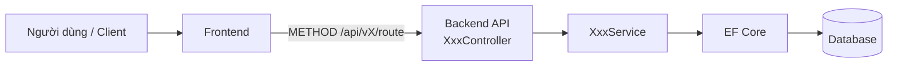
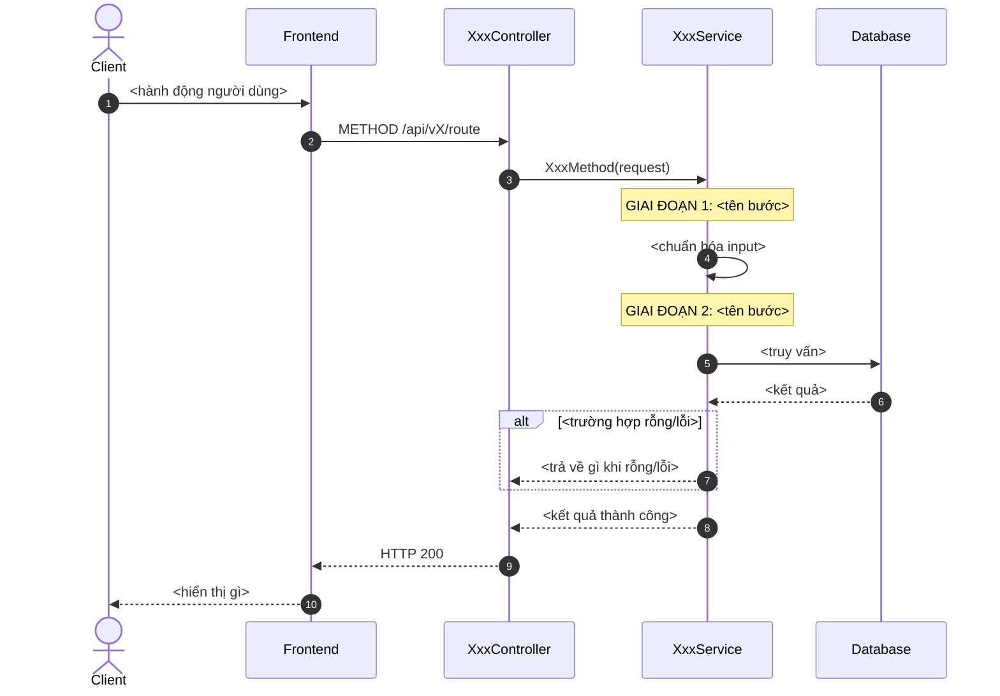
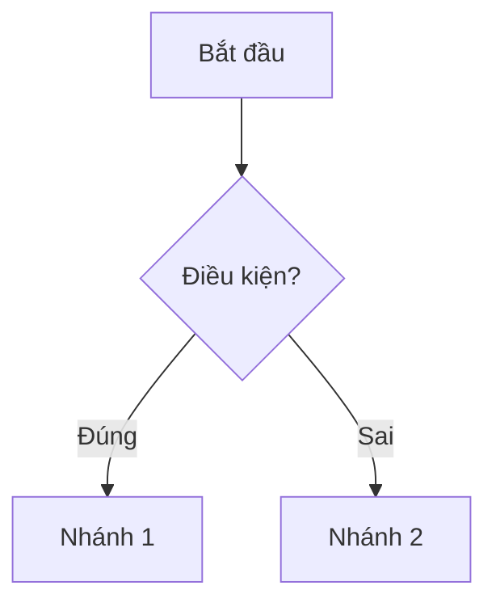
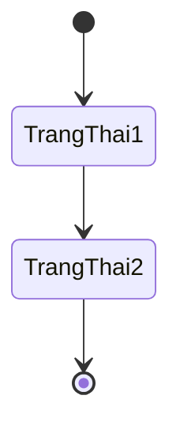
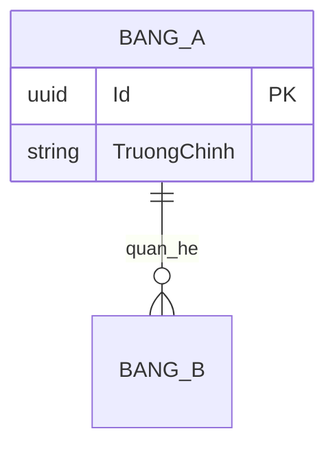

# TDD Writer — Viết Technical Design Document sau khi code xong

## Skill này dùng để làm gì

Đội của user dùng 2 loại tài liệu cố định, đi kèm nhau:

1. **TDD** (1 mẫu 4 bước) ghi lại **bối cảnh, kiến trúc, API contract, và tham chiếu**
   của một hàm/API sau khi đã code xong.
2. **UT — Unit Test Case** (1 mẫu ngắn hơn) ghi lại **từng kịch bản kiểm thử cụ thể**
   cho hàm/API đó — mỗi TDD thường có **nhiều** UT đi kèm, mỗi UT test 1 nhánh
   logic/1 edge case. Mã UT luôn gắn với mã TDD cha theo dạng `UT-XXX-NN` (XXX = số
   TDD, NN = số thứ tự UT trong TDD đó, bắt đầu từ 01), ví dụ TDD-004 sẽ có
   UT-004-01, UT-004-02, UT-004-03...

Mục đích chung: để người đọc sau (dev khác, hoặc chính user vài tháng sau) hiểu được
tính năng làm gì, luồng hoạt động ra sao, và **đã được test những trường hợp nào**,
mà không phải đọc lại toàn bộ code.

Khi được yêu cầu viết/cập nhật TDD hoặc UT, agent **không tự bịa cấu trúc riêng** —
luôn dùng đúng khung mẫu ở "Phần 1" (TDD) hoặc "Phần 2" (UT) bên dưới, và điền dựa
trên code/API thật đã viết (đọc controller, service, DTO, migration... để lấy thông
tin chính xác thay vì đoán).

## Quy trình

1. **Xác định phạm vi tài liệu hóa**: 1 endpoint, 1 service method, hay 1 tính năng
   gồm nhiều endpoint liên quan? Đặt tên tính năng và mã tài liệu (`TDD-XXX`, số tăng
   dần theo tài liệu TDD gần nhất trong repo, tìm bằng cách grep các file `TDD-*.md`
   đã có nếu tồn tại).
2. **Đọc code liên quan** trước khi điền: controller (route, method), service (logic,
   business rules, các nhánh điều kiện), DTO/model (field), migration/entity (quan hệ
   dữ liệu), và test nếu có (case cần cover).
3. **Điền lần lượt 4 bước** theo đúng thứ tự trong Template TDD (Phần 1) — không bỏ
   trống các field bắt buộc (Author, Owner, Mã tài liệu, Endpoint, Request/Response
   mẫu). Các mục optional (Activity Diagram, State Diagram, API Contract bên ngoài)
   chỉ điền khi thực sự áp dụng — xem ghi chú "optional" ở từng mục.
4. **Diagram viết bằng Mermaid**, đặt trong code block ```mermaid``` để render được
   trực tiếp trên GitHub/GitLab/Notion.
5. **Viết các UT (Unit Test Case) đi kèm** theo Template UT (Phần 2) — soát lại từng
   ví dụ Request/Response, từng dòng "Mã lỗi" ở Bước 3 API và từng Business Rule ở
   Bước 1 của TDD vừa viết, mỗi mục quan trọng nên có ít nhất 1 UT tương ứng để xác
   nhận hành vi. Đánh số UT tăng dần: UT-XXX-01, UT-XXX-02...
6. **Lưu file**:
   - TDD: `TDD-XXX-ten-tinh-nang-kebab-case.md`, đặt trong `docs/tdd/` của repo.
   - UT: `UT-XXX-NN-ten-kich-ban-kebab-case.md`, đặt cùng cấp hoặc trong thư mục con
     `docs/tdd/ut/` (nếu chưa rõ, hỏi user muốn lưu ở đâu).
7. Nếu hàm/API này **tham chiếu tới hoặc bị tham chiếu bởi** một TDD khác đã tồn tại
   trong `docs/tdd/`, cập nhật chéo phần "Tham chiếu" ở cả hai file TDD, và đảm bảo
   TEST_LINKS của các UT trỏ đúng tới User Story/TDD liên quan.

## Phần 1 — Template TDD (copy toàn bộ khối dưới đây và điền vào)

````markdown
# TDD-XXX: <Tên tính năng>

## Thông tin tài liệu
- **Tiêu đề**: <câu mô tả 1 dòng, ví dụ "Lấy danh sách sản phẩm kèm số lượng bán khả dụng">
- **Ghi chú**: <1-3 câu giải thích chức năng này để làm gì, khi nào được gọi>

## Metadata quản trị tài liệu
| Trường | Giá trị |
|---|---|
| Mã tài liệu | TDD-XXX |
| Phiên bản | v0.1 |
| Author | <tên người code> |
| Reviewer | <tên người review, để trống nếu chưa có> |
| Approver | Chưa chỉ định |
| Owner | <tên người chịu trách nhiệm chức năng> |
| Cập nhật gần nhất | YYYY-MM-DD |

---

## BƯỚC 1 — Thông tin & Bối cảnh

### Thông tin tài liệu
- **Mã tài liệu**: TDD-XXX
- **Tính năng**: <tên tính năng, khác Tiêu đề ở trên — đây là tên ngắn dùng để tra cứu>
- **Tác giả**: <tự động lấy từ author code / git blame nếu có>
- **Người review**: 
- **Phiên bản**: v0
- **Cập nhật (YYYY-MM-DD)**: 
- **Story liên quan**: (US-xxx, STORY-xxx — mã ticket/backlog liên quan, nếu có)
  - 

### Business Rules
<liệt kê các quy tắc nghiệp vụ mà logic phải tuân theo — lấy trực tiếp từ code
validate/if-else trong service, không diễn giải lại khác đi>
- 

### Bối cảnh & Mục tiêu

**Vấn đề**
> <Vấn đề nghiệp vụ/kỹ thuật mà hàm/API này giải quyết là gì? Vì sao cần viết nó?
> Nêu rõ độ phức tạp hoặc điểm dễ sai nếu có, ví dụ: "SellableQuantity không phải
> Stock gốc mà phải tính dựa trên vật liệu CORE".>

**Mục tiêu**
<liệt kê từng gạch đầu dòng — mỗi dòng là 1 kết quả cụ thể, đo được, tương ứng 1:1
với 1 đoạn logic trong code>
- 

**Ngoài phạm vi** (Out of scope)
<những gì CỐ Ý không xử lý ở hàm/API này, để tránh hiểu nhầm — ví dụ: "Không tính
thành phần SUPPORT vào SellableQuantity", "Không xử lý variant con">
- 

---

## BƯỚC 2 — Kiến trúc & Sơ đồ

### Kiến trúc tổng quan (Architecture)
**Tiêu đề**: <ví dụ "Trình tự gọi API lấy sản phẩm này">
**Mô tả**: <mô tả bằng văn xuôi các thành phần tham gia và cách chúng ghép với nhau,
từ Frontend/Controller → Service → tầng tính toán (nếu có) → EF Core → DB>


**Ghi chú**: <thành phần nào KHÔNG có trong sơ đồ nhưng vẫn ảnh hưởng, ví dụ cache,
message queue, background job>

### Sequence Diagram
**Tiêu đề**: <ví dụ "Trình tự kiểm tra, tính toán và trả kết quả">
**Mô tả**: <luồng nhiều bên gọi qua lại theo thời gian>


**Ghi chú**: 

### Activity Diagram (optional — chỉ điền nếu logic có nhiều nhánh điều kiện phức tạp)
**Tiêu đề**: 
**Mô tả**: 


### State Diagram (optional — chỉ điền nếu entity chính có vòng đời trạng thái)
**Tiêu đề**: 
**Mô tả**: 


### Mô hình dữ liệu (Data Model / ERD)
**Tiêu đề**: 
**Mô tả**: <bảng nào liên quan, quan hệ ra sao — lấy từ entity/migration thật>


---

## BƯỚC 3 — API

### API Contract nội bộ

#### Endpoint #1
- **Method**: GET / POST / PUT / DELETE
- **Endpoint**: `/api/vX/...`
- **Tên endpoint**: <tên gợi nhớ, ví dụ "Danh sách hỗn hợp — sản phẩm thường + combo">
- **Mô tả**: <1 câu — endpoint này trả về gì>

**Ví dụ 1 — <happy path>** — HTTP `200`

Request:
```
GET /api/vX/route?param1=...&param2=...
```
Response:
```json
{
  "value": { "items": [ /* ... */ ] }
}
```
Error: <để trống nếu không có>

**Ví dụ 2 — <trường hợp rỗng>** — HTTP `200`

Request:
```
GET /api/vX/route?param1=...
```
Response:
```json
{ "value": { "items": [], "totalCount": 0 } }
```

**Ví dụ 3 — <edge case đặc biệt, ví dụ hết hàng / thiếu dữ liệu>** — HTTP `200`

Request:
```

```
Response:
```json

```

<thêm bao nhiêu ví dụ tùy vào số nhánh logic thật sự có trong code — mỗi nhánh
if/else quan trọng nên có 1 ví dụ tương ứng>

#### Mã lỗi
| Code | HTTP | Khi nào xảy ra |
|---|---|---|
| <ví dụ: "Không có công thức"> | 200/4xx | <điều kiện field, ví dụ SellableQuantity = 0, StockStatus = null, UnavailableReason = "no_formula"> |

### API Contract bên ngoài (optional — chỉ điền nếu hàm/API này gọi ra service/API của
bên thứ ba, ví dụ Nhanh.vn, cổng thanh toán, đối tác vận chuyển)
- **Endpoints sử dụng**: <method + URL của bên ngoài>
- **Field quan trọng**: <field nào từ response đối tác được dùng, ánh xạ sang field nội bộ>
- **Xử lý lỗi từ đối tác**: <mã lỗi/response bất thường của đối tác và cách mình xử lý>
- **Quirks / cạm bẫy**: <hành vi lạ, undocumented, rate limit, timezone khác... của bên đối tác mà dev sau cần biết trước>

---

## BƯỚC 4 — Tham chiếu

> Chú thích: 🔴 Tham chiếu đến (tài liệu này đọc/phụ thuộc) · ⚫ Trỏ vào tài liệu này
> (tài liệu khác phụ thuộc vào tài liệu này) · ⋯ Bị ảnh hưởng (thay đổi ở đây có thể
> làm tài liệu kia sai theo)

### 🔴 Tham chiếu đến
<liệt kê mã TDD/tài liệu khác mà chức năng này phụ thuộc vào, ví dụ dùng chung 1
service, 1 bảng dữ liệu>
- 

### ⚫ Trỏ vào tài liệu này
<TDD/tài liệu nào khác gọi tới hoặc dựa vào chức năng được mô tả ở đây>
- 

### ⋯ Bị ảnh hưởng
<nếu sửa logic ở đây thì chức năng/tài liệu nào khác có nguy cơ bị ảnh hưởng theo,
nên nhắc reviewer kiểm tra lại>
- 
````

## Hướng dẫn chọn loại sơ đồ Mermaid

| Mục | Loại Mermaid | Dùng khi |
|---|---|---|
| Kiến trúc tổng quan | `flowchart LR` | Muốn thấy các thành phần hệ thống ghép với nhau (Controller → Service → DB) |
| Sequence Diagram | `sequenceDiagram` | Muốn thấy **thứ tự theo thời gian** các lệnh gọi qua lại giữa nhiều bên — luôn nên có `autonumber` và các `Note over` đánh dấu từng giai đoạn xử lý trong service |
| Activity Diagram | `flowchart TD` (dùng `{}` cho điều kiện) | Logic có nhiều nhánh rẽ (if/else, switch) cần trực quan hóa |
| State Diagram | `stateDiagram-v2` | Entity chính có vòng đời nhiều trạng thái (draft → confirmed → shipped...) |
| Data Model | `erDiagram` | Cần thể hiện bảng và khóa quan hệ (PK/FK) giữa các entity |

## Nguyên tắc điền nội dung TDD (quan trọng)

- **Lấy sự thật từ code, không suy đoán.** Field, tên biến, response mẫu phải khớp
  chính xác với DTO/model thật trong code — copy tên field, không đổi tên "cho đẹp".
- **Mỗi nhánh logic quan trọng (if/else, switch-case) nên có ít nhất 1 ví dụ
  Request/Response tương ứng** trong "API Contract nội bộ" — đây là cách nhanh nhất
  để người đọc sau hiểu hết các trường hợp mà không cần đọc code.
- **"Mã lỗi" không nhất thiết là HTTP error** — trong mẫu gốc, các trạng thái đặc biệt
  (không có công thức, hết hàng...) vẫn trả HTTP 200 nhưng field `UnavailableReason`
  khác nhau. Ghi đúng theo cách hệ thống thật sự trả về, không mặc định là 4xx/5xx.
  Nếu hệ thống có dùng HTTP status lỗi thật (400/404/500...) thì ghi đúng status đó.
- **Business Rules ở Bước 1 khác Business Rules ẩn trong code**: chỉ liệt kê rule nào
  ảnh hưởng đến hành vi API (ví dụ công thức tính toán, điều kiện lọc), không liệt kê
  chi tiết implementation không cần thiết cho người đọc.
- **Bỏ trống có kiểm soát**: nếu 1 mục không áp dụng (ví dụ API không gọi bên ngoài),
  ghi rõ "Không áp dụng" thay vì xóa hẳn mục — giữ cấu trúc đồng nhất giữa các TDD để
  dễ tra cứu sau này.

---

## Phần 2 — Template Unit Test Case (UT)

Mỗi TDD (`TDD-XXX`) đi kèm **nhiều** UT, mỗi UT là 1 file/section riêng, mã theo dạng
`UT-XXX-NN` (NN bắt đầu từ `01`, tăng dần). Copy khối dưới đây cho **từng kịch bản
kiểm thử** — không gộp nhiều kịch bản vào 1 UT.

````markdown
# UT-XXX-NN: <Tên kịch bản kiểm thử, ví dụ "Combo Cha có biến thể lấy MIN variant">

## Thông tin tài liệu
- **Tiêu đề (bắt buộc)**: <trùng với tên kịch bản ở trên>
- **Ghi chú**: <ghi chú thêm nếu cần, có thể để trống>

## Metadata quản trị tài liệu
- **Mã tài liệu**: UT-XXX-NN
- **Phiên bản**: v0.1
- **Author (bắt buộc)**: <tên người viết test>
- **Reviewer**: <để trống nếu chưa có>
- **Approver**: Chưa chỉ định
- **Owner (bắt buộc)**: <người chịu trách nhiệm>
- **Cập nhật gần nhất**: YYYY-MM-DD

## Đơn vị kiểm thử
- **Module (bắt buộc)**: <tên module, ví dụ "PRODUCT - Lấy danh sách sản phẩm">
- **Unit under test (bắt buộc)**: <Class.Method thật trong code, ví dụ ProductService.GetProductsV2>
- **Loại**: Happy | Branch | Boundary | Error | Quirk | Determinism
- **Precondition / Mock setup**:
  <mô tả chi tiết dữ liệu giả lập cần có trước khi chạy — liệt kê từng entity, field
  quan trọng, và quan hệ giữa chúng. Viết đủ để người khác dựng lại data y hệt, ví dụ:
  "parent-001 (ProductType="Sản Phẩm", ParentProductId=null); variant-001
  (ProductType="Combo", ParentProductId="parent-001") có ComboSpecification:
  mat-001 (Stock=100), Quantity=2 → max=50">
- **Input**:
  ```
  METHOD /api/vX/route?param=...
  ```
- **Expected output (bắt buộc)**:
  ```
  HTTP <status>
  <mô tả CHÍNH XÁC field nào = giá trị gì, kèm lý do ra giá trị đó — ví dụ:
  "SellableQuantity = 20 (min của variant con: 20 vs 50)". Nếu có điều kiện loại trừ
  (item nào KHÔNG xuất hiện và vì sao) thì ghi rõ luôn.>
  ```

## Phân loại và trách nhiệm
- **Suite**: SMOKE | REGRESSION | FULL
- **Priority**: P0 | P1 | P2 | P3
- **Owner**: <người chịu trách nhiệm test case — có thể trùng Owner ở Metadata>
- **Rationale (bắt buộc)**: <1 câu — test case này xác nhận đúng hành vi/quy tắc
  nghiệp vụ nào, ví dụ "Xác nhận cha combo có biến thể trả về MIN(SellableQuantity
  của các variant con)">

## TEST_LINKS
<Mỗi requirement/Business Rule mà UT này xác nhận viết thành 1 khối riêng bên dưới —
không gộp chung vào bảng — để copy từng khối lên form link tương ứng. Mã phải trỏ
đúng section cụ thể (AC-xx), không ghi chung chung "liên quan TDD-XXX".>

**Link 1**
- **Loại**: User Story
- **Mã**: STORY-xxx
- **Section**: AC-xx
- **Ghi chú**: 

**Link 2**
- **Loại**: TDD
- **Mã**: TDD-XXX
- **Section**: AC-xx
- **Ghi chú**: 

<thêm Link 3, 4... nếu UT này còn xác nhận thêm requirement/Business Rule khác>
````

### Ý nghĩa các "Loại" kiểm thử

| Loại | Khi nào dùng |
|---|---|
| Happy | Kịch bản chuẩn — input hợp lệ, đi đúng luồng chính, kết quả đúng như thiết kế |
| Branch | Test 1 nhánh rẽ cụ thể trong logic (if/else, switch-case) khác với luồng Happy |
| Boundary | Test giá trị biên — 0, rỗng, max, min, ngay ngưỡng chuyển trạng thái |
| Error | Input sai / thiếu / hệ thống gặp lỗi — xác nhận hệ thống trả đúng mã lỗi/HTTP status |
| Quirk | Hành vi đặc biệt, dễ hiểu nhầm, hoặc cạm bẫy đã biết của hệ thống (đã ghi ở
"Quirks / cạm bẫy" trong TDD) |
| Determinism | Xác nhận kết quả ổn định, lặp lại được — ví dụ thứ tự sort không đổi giữa
các lần gọi, không phụ thuộc thời điểm chạy |

### Nguyên tắc viết UT (quan trọng)

- **1 UT = 1 kịch bản duy nhất.** Không nhét nhiều assertion không liên quan vào
  chung 1 UT — nếu thấy Expected output cần "và" nhiều điều không cùng mục đích, tách
  thành nhiều UT.
- **Map UT với chính TDD cha**: mỗi ví dụ Request/Response và mỗi dòng "Mã lỗi" ở
  Bước 3 (API) của TDD nên có ít nhất 1 UT tương ứng; mỗi Business Rule quan trọng ở
  Bước 1 cũng nên có 1 UT xác nhận. Nếu TDD có N ví dụ/mã lỗi mà chỉ viết ít hơn N UT,
  cần hỏi lại user xem có bỏ sót kịch bản nào không.
- **Precondition / Mock setup phải tái lập được** — ghi rõ ID, field, quan hệ dữ liệu
  đủ để một dev khác (hoặc chính agent ở phiên làm việc khác) dựng lại được mock/data
  y hệt mà không cần đoán.
- **Expected output ghi cả lý do**, không chỉ giá trị — ví dụ không chỉ ghi
  "SellableQuantity = 20" mà ghi thêm "(min của variant con: 20 vs 50)" để người đọc
  hiểu ngay công thức được áp dụng đúng.
- **TEST_LINKS luôn trỏ về đúng TDD cha** (`TDD-XXX`) và User Story liên quan, kèm
  section cụ thể (AC-xx) — đây là cách để về sau, khi 1 Business Rule trong TDD thay
  đổi, có thể tìm ngay các UT nào cần chạy lại/sửa lại.
- **Suite/Priority phản ánh mức độ quan trọng**: luồng chính/rule cốt lõi → SMOKE +
  P1; các nhánh phụ, boundary hiếm gặp → REGRESSION/FULL + P2-P3.