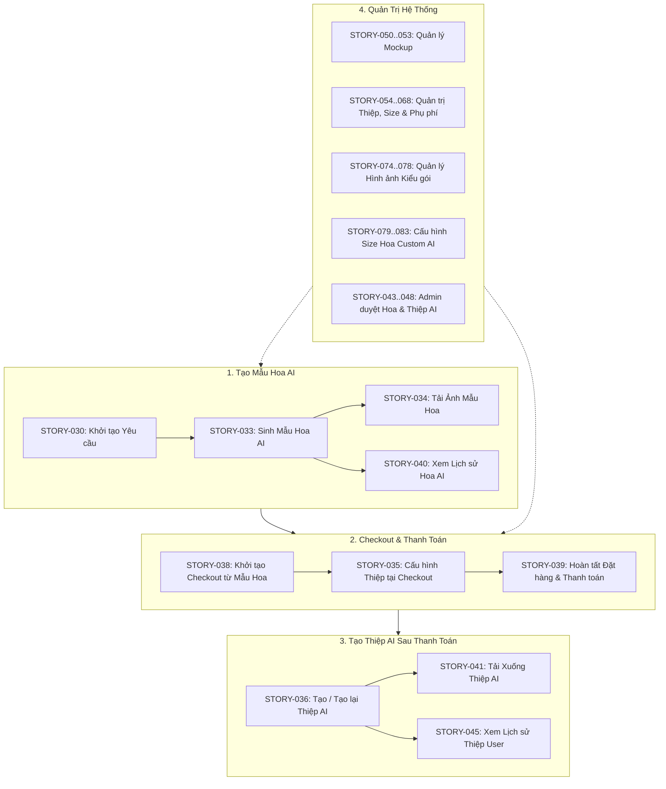

# HTM_AI_Customize — Phân hệ Thiết kế Hoa & Thiệp AI (`hoa-theo-mua-ai-customize`)

> **Mã dự án (Key)**: `hoa-theo-mua-ai-customize`  
> **Tên phân hệ**: `HTM_AI_Customize` (Cá nhân hóa Mua sắm Hoa & Thiệp AI)  
> **Thương hiệu**: Hoa Theo Mùa  
> **Phương pháp tiếp cận**: Document-First System Specification (BDD Acceptance Criteria)  
> **Trạng thái**: Hợp nhất hoàn chỉnh từ `hoa-theo-mua-ai-flourist` & chuẩn hóa đồng bộ  

---

## 📖 1. Tổng quan & Tầm nhìn Phân hệ

**HTM_AI_Customize** là phân hệ AI cá nhân hóa trải nghiệm mua sắm hoa tươi độc bản và quà tặng cao cấp:
1. **Tạo mẫu hoa độc bản với AI**: Khách hàng cung cấp mô tả mong muốn, chọn combo nguồn, cấu hình size combo, kiểu bó, mockup bình/hộp, giấy gói và ruy băng. AI sinh ảnh phối hoa độc bản với cơ chế quản lý quota, retry tự động và snapshot tham chiếu đơn hàng.
2. **Cấu hình thiệp tại Checkout**: Khách hàng chọn Thiệp Miễn phí hoặc Thiệp Custom (`In` / `Viết tay`). Hệ thống tính giá, đếm từ và snapshot giá mà không gọi AI tại bước thanh toán.
3. **Tạo thiệp AI sau thanh toán**: Khách hàng tạo thiệp và tạo lại thiệp AI sau khi đơn hàng đã được thanh toán thành công, bảo đảm số từ không vượt quá mức đã thanh toán.
4. **Quản trị Mockup, Kiểu gói & Cấu hình Size**: Quản trị viên quản lý danh mục mockup bình/hộp hoa, hình ảnh kiểu gói (wrapping styles), cấu hình size hoa custom AI, kích thước thiệp, mẫu thiệp và bảng phụ phí viết tay.

---

## 🌐 2. Luồng Nghiệp Vụ Cốt Lõi



---

## 📂 3. Cấu trúc Thư mục Phân hệ

```text
hoa-theo-mua-ai-customize/
├── README.md                              # Cổng thông tin tổng quan phân hệ (File hiện tại)
├── BusinessRules/                         # 213 Quy tắc nghiệp vụ chuẩn hóa (BR-020 -> BR-273)
│   └── README.md                          # Danh mục & Ma trận phân loại 213 Business Rules
├── ConfirmedDoc/                          # Hợp đồng API & tài liệu kỹ thuật đã chốt
├── Context/                               # Sơ đồ CSDL, Từ điển dữ liệu & Kiến trúc
│   ├── AI_CUSTOMIZE_DB.dbdiagram          # Sơ đồ CSDL AI Customize (DBML)
│   ├── AI_DB_Data_Dictionary.md           # Từ điển dữ liệu & giải thích chi tiết các bảng
│   ├── AI_DB_Diagram.md                   # Sơ đồ quan hệ thực thể (ERD) dạng Markdown
│   ├── AI_Flower_Context.md               # Ngữ cảnh nghiệp vụ Tạo mẫu hoa AI
│   ├── AI_Card_Context.md                 # Ngữ cảnh nghiệp vụ Tạo thiệp AI tại Checkout
│   └── AI_Mockup_Context.md               # Ngữ cảnh nghiệp vụ Quản lý Mockup
├── SystemTest/                            # 32 Bộ System Test Suites chuẩn hóa
│   └── README.md                          # Danh mục 32 System Test Suites & Ma trận kiểm thử
├── UserStory/                             # 45+ Tài liệu User Stories đặc tả BDD
│   └── README.md                          # Danh mục toàn bộ User Stories & Hướng dẫn nghiệp vụ
├── TDD/                                   # 26 Tài liệu Thiết kế Kỹ thuật (TDD & COVERAGE.md)
│   ├── README.md                          # Danh mục 26 Technical Design Documents
│   └── COVERAGE.md                        # Ma trận bao phủ TDD & Unit Test
└── UnitTest/                              # 157 Kịch bản kiểm thử đơn vị độc lập (Unit Tests)
    └── README.md                          # Danh mục 157 Unit Test Cases (12 nhóm nghiệp vụ)
```

---

## 📑 4. Danh Mục User Stories Tiêu Biểu

| Mã Story | Nhóm tính năng | TDD liên quan | File đặc tả chi tiết |
| :--- | :--- | :--- | :--- |
| **STORY-003** | Duyệt sản phẩm | — | [`03-ViewCombos.md`](file:///d:/VNZ/document-first-brief/hoa-theo-mua-ai-customize/UserStory/03-ViewCombos.md) |
| **STORY-030** | Khởi tạo yêu cầu | [TDD-016](file:///d:/VNZ/document-first-brief/hoa-theo-mua-ai-customize/TDD/TDD-016-tao-yeu-cau-va-mau-hoa-ai.md) / [TDD-030](file:///d:/VNZ/document-first-brief/hoa-theo-mua-ai-customize/TDD/TDD-030_tao-yeu-cau-va-mau-hoa-ai.md) | [`STORY-030-khoi-tao-mau-hoa.md`](file:///d:/VNZ/document-first-brief/hoa-theo-mua-ai-customize/UserStory/STORY-030-khoi-tao-mau-hoa.md) |
| **STORY-033** | Sinh ảnh AI | [TDD-016](file:///d:/VNZ/document-first-brief/hoa-theo-mua-ai-customize/TDD/TDD-016-tao-yeu-cau-va-mau-hoa-ai.md) / [TDD-030](file:///d:/VNZ/document-first-brief/hoa-theo-mua-ai-customize/TDD/TDD-030_tao-yeu-cau-va-mau-hoa-ai.md) | [`STORY-033-tao-mau-hoa-bang-AI.md`](file:///d:/VNZ/document-first-brief/hoa-theo-mua-ai-customize/UserStory/STORY-033-tao-mau-hoa-bang-AI.md) |
| **STORY-034** | Tải ảnh | — | [`STORY-034-Tai-anh-mau-hoa-sau-khi-AI-tao.md`](file:///d:/VNZ/document-first-brief/hoa-theo-mua-ai-customize/UserStory/STORY-034-Tai-anh-mau-hoa-sau-khi-AI-tao.md) |
| **STORY-035** | Cấu hình thiệp | [TDD-006](file:///d:/VNZ/document-first-brief/hoa-theo-mua-ai-customize/TDD/TDD-006-tao-thiep-thiet-ke-ai.md) / [TDD-035](file:///d:/VNZ/document-first-brief/hoa-theo-mua-ai-customize/TDD/TDD-035_tao-thep-thiet-ke-ai.md) | [`STORY-035-Tao-thiep-ca-nhan-hoa-bang-AI-tai-Checkout.md`](file:///d:/VNZ/document-first-brief/hoa-theo-mua-ai-customize/UserStory/STORY-035-Tao-thiep-ca-nhan-hoa-bang-AI-tai-Checkout.md) |
| **STORY-036** | Tạo lại thiệp | [TDD-007](file:///d:/VNZ/document-first-brief/hoa-theo-mua-ai-customize/TDD/TDD-007-tao-lai-thiep-tu-lich-su.md) / [TDD-036](file:///d:/VNZ/document-first-brief/hoa-theo-mua-ai-customize/TDD/TDD-036_tao-lai-thep-tu-lich-su.md) | [`STORY-036-Tao-lai-thiep-ca-nhan-hoa-bang-AI.md`](file:///d:/VNZ/document-first-brief/hoa-theo-mua-ai-customize/UserStory/STORY-036-Tao-lai-thiep-ca-nhan-hoa-bang-AI.md) |
| **STORY-038** | Checkout | — | [`STORY-038-Khoi-tao-Checkout-tu-mau-hoa.md`](file:///d:/VNZ/document-first-brief/hoa-theo-mua-ai-customize/UserStory/STORY-038-Khoi-tao-Checkout-tu-mau-hoa.md) |
| **STORY-039** | Thanh toán | — | [`STORY-039-Hoan-tat-Checkout-tao-va-thanh-toan-Orde.md`](file:///d:/VNZ/document-first-brief/hoa-theo-mua-ai-customize/UserStory/STORY-039-Hoan-tat-Checkout-tao-va-thanh-toan-Orde.md) |
| **STORY-040** | Lịch sử hoa AI | — | [`STORY-040-Xem-lich-su-cac mau-hoa -Custom-AI-da-tao.md`](file:///d:/VNZ/document-first-brief/hoa-theo-mua-ai-customize/UserStory/STORY-040-Xem-lich-su-cac%20mau-hoa%20-Custom-AI-da-tao.md) |
| **STORY-041** | Tải ảnh thiệp | — | [`STORY-041-Tai-xuong-thiep-da-tao.md`](file:///d:/VNZ/document-first-brief/hoa-theo-mua-ai-customize/UserStory/STORY-041-Tai-xuong-thiep-da-tao.md) |
| **STORY-042** | Chọn thiệp cũ | — | [`STORY-042-Chon-thiep-tu-History-cho-Checkout.md`](file:///d:/VNZ/document-first-brief/hoa-theo-mua-ai-customize/UserStory/STORY-042-Chon-thiep-tu-History-cho-Checkout.md) |
| **STORY-043** | Admin xem thiệp | — | [`STORY-043-Admin-xem-chi-tiet-thiep-AI.md`](file:///d:/VNZ/document-first-brief/hoa-theo-mua-ai-customize/UserStory/STORY-043-Admin-xem-chi-tiet-thiep-AI.md) |
| **STORY-044** | Admin DS thiệp | — | [`STORY-044-Admin-xem-danh-sach-thiep-AI.md`](file:///d:/VNZ/document-first-brief/hoa-theo-mua-ai-customize/UserStory/STORY-044-Admin-xem-danh-sach-thiep-AI.md) |
| **STORY-045** | DS thiệp User | — | [`STORY-045-Xem lịch su-cac-thiep-da-tao.md`](file:///d:/VNZ/document-first-brief/hoa-theo-mua-ai-customize/UserStory/STORY-045-Xem%20l%E1%BB%8Bch%20su-cac-thiep-da-tao.md) |
| **STORY-046** | Admin tải thiệp | — | [`STORY-046-admin-tai-xuong-thiep-ai.md`](file:///d:/VNZ/document-first-brief/hoa-theo-mua-ai-customize/UserStory/STORY-046-admin-tai-xuong-thiep-ai.md) |
| **STORY-047** | Admin DS hoa AI | — | [`STORY-047-admin-xem-danh-sach-mau-hoa-custom-ai.md`](file:///d:/VNZ/document-first-brief/hoa-theo-mua-ai-customize/UserStory/STORY-047-admin-xem-danh-sach-mau-hoa-custom-ai.md) |
| **STORY-048** | Admin chi tiết hoa | — | [`STORY-048-admin-xem-chi-tiet-mau-hoa-custom-ai.md`](file:///d:/VNZ/document-first-brief/hoa-theo-mua-ai-customize/UserStory/STORY-048-admin-xem-chi-tiet-mau-hoa-custom-ai.md) |
| **STORY-050 -> 053** | Quản lý Mockup | [TDD-012](file:///d:/VNZ/document-first-brief/hoa-theo-mua-ai-customize/TDD/TDD-012-lay-danh-sach-mockup.md) -> [TDD-015](file:///d:/VNZ/document-first-brief/hoa-theo-mua-ai-customize/TDD/TDD-015-xoa-mockup.md) | [`STORY-050`](file:///d:/VNZ/document-first-brief/hoa-theo-mua-ai-customize/UserStory/STORY-050-admin-xem-danh-sach-mockup.md) -> [`STORY-053`](file:///d:/VNZ/document-first-brief/hoa-theo-mua-ai-customize/UserStory/STORY-053-admin-xoa-mockup.md) |
| **STORY-054 -> 068** | Quản trị Thiệp & Phụ phí | [TDD-008](file:///d:/VNZ/document-first-brief/hoa-theo-mua-ai-customize/TDD/TDD-008-lay-danh-sach-card-configs.md) -> [TDD-011](file:///d:/VNZ/document-first-brief/hoa-theo-mua-ai-customize/TDD/TDD-011-xoa-card-config.md) | Kích thước thiệp, Mẫu thiệp & Phụ phí viết tay |
| **STORY-074 -> 078** | Quản trị Kiểu gói | — | [`STORY-074`](file:///d:/VNZ/document-first-brief/hoa-theo-mua-ai-customize/UserStory/STORY-074-admin-xem-danh-sach-hinh-anh-kieu-goi.md) -> [`STORY-078`](file:///d:/VNZ/document-first-brief/hoa-theo-mua-ai-customize/UserStory/STORY-078-admin-cap-nhat-trang-thai-hinh-anh-kieu-goi.md) |
| **STORY-079 -> 083** | Cấu hình Size hoa | — | [`STORY-079`](file:///d:/VNZ/document-first-brief/hoa-theo-mua-ai-customize/UserStory/STORY-079-admin-xem-danh-sach-cau-hinh-size-hoa-custom-ai.md) -> [`STORY-083`](file:///d:/VNZ/document-first-brief/hoa-theo-mua-ai-customize/UserStory/STORY-083-admin-cap-nhat-trang-thai-cau-hinh-size-hoa-custom-ai.md) |

Chi tiết toàn bộ User Stories xem tại [`UserStory/README.md`](file:///d:/VNZ/document-first-brief/hoa-theo-mua-ai-customize/UserStory/README.md).

---

## 🛡 5. Quy Tắc Nghiệp Vụ & Kiểm Thử

- **213 Business Rules**: Chuẩn hóa từ BR-020 đến BR-273, kiểm soát chặt chẽ quota, retry AI, tính giá thiệp, giới hạn từ, cấu hình kiểu gói và phân quyền. Chi tiết tại [`BusinessRules/README.md`](file:///d:/VNZ/document-first-brief/hoa-theo-mua-ai-customize/BusinessRules/README.md).
- **32 System Test Suites**: Bao phủ toàn bộ các luồng kiểm thử hệ thống từ STORY-030 đến STORY-068. Chi tiết tại [`SystemTest/README.md`](file:///d:/VNZ/document-first-brief/hoa-theo-mua-ai-customize/SystemTest/README.md).
- **157 Unit Test Cases**: Phân chia thành 12 nhóm kiểm thử đơn vị, liên kết trực tiếp tới 26 TDDs. Chi tiết tại [`UnitTest/README.md`](file:///d:/VNZ/document-first-brief/hoa-theo-mua-ai-customize/UnitTest/README.md) và [`TDD/COVERAGE.md`](file:///d:/VNZ/document-first-brief/hoa-theo-mua-ai-customize/TDD/COVERAGE.md).
