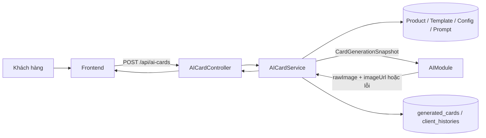
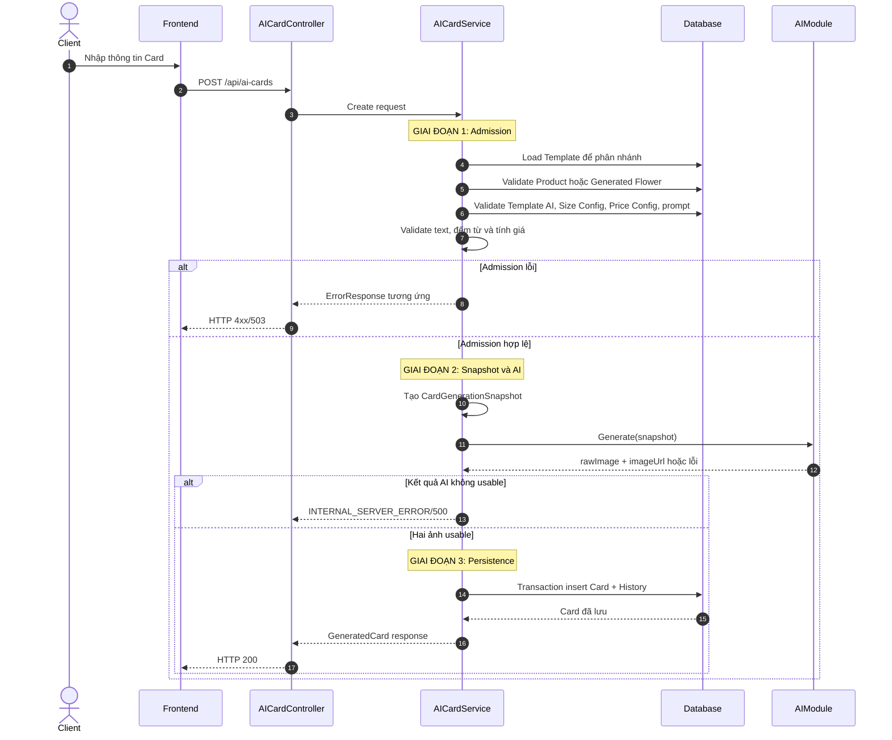
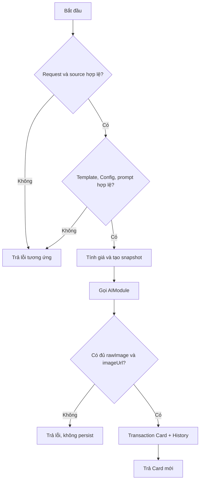
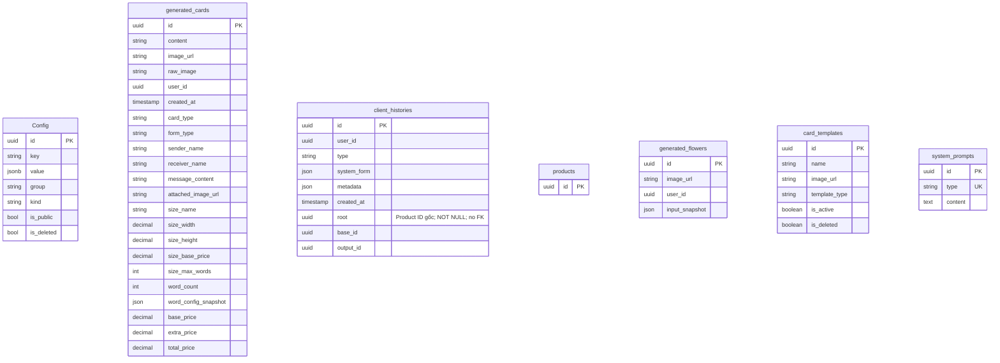

# TDD-006: Tạo thiệp thiết kế AI

## Thông tin tài liệu
- **Tiêu đề**: Tạo thiệp AI từ Product hoặc Generated Flower
- **Ghi chú**: API nhận thông tin cá nhân hóa, xác thực nguồn/Template/Card Config, tính giá, gọi `AIModule` một lần ở góc nhìn service và chỉ lưu Card/History khi nhận đủ hai ảnh hợp lệ. Các chính sách vận hành bên trong lời gọi AI được mô tả tại `AI_Card_Context.md`, không thuộc TDD này.

## Metadata quản trị tài liệu
| Trường | Giá trị |
|---|---|
| Mã tài liệu | TDD-006 |
| Phiên bản | v1.3 |
| Author | Nguyễn Tùng Dương |
| Reviewer | Tân Trần |
| Approver | Chưa chỉ định |
| Owner | Nguyễn Tùng Dương |
| Cập nhật gần nhất | 2026-09-09 |

---

## BƯỚC 1 — Thông tin & Bối cảnh

### Thông tin tài liệu
- **Mã tài liệu**: TDD-006
- **Tính năng**: Tạo thiệp thiết kế AI
- **Tác giả**: Nguyễn Tùng Dương
- **Người review**: Tân Trần
- **Phiên bản**: v1.3
- **Cập nhật (YYYY-MM-DD)**: 2026-09-09
- **Story liên quan**:
  - STORY-035

### Business Rules
- **BR-006-01**: Endpoint yêu cầu khách hàng đã đăng nhập; Template được load trước để phân nhánh. `templateType=ai` đi theo TDD-006, `templateType=handmade` chuyển sang TDD-021 trong cùng endpoint.
- **BR-006-02**: Request phải truyền đúng một nguồn: `productId` hoặc `generatedFlowerId`.
- **BR-006-03**: Product source dùng đúng ID Product/variant được chọn và validate theo thứ tự `PRODUCT_NOT_FOUND` → `PRODUCT_DELETED` → `PRODUCT_INACTIVE` → `PRODUCT_OUT_OF_STOCK`; `no_formula|no_core` trả `PRODUCT_NOT_SELLABLE`; lỗi tính tồn kho trả `PRODUCT_AVAILABILITY_UNAVAILABLE`.
- **BR-006-04**: Generated Flower source phải tồn tại, thuộc user hiện tại và có ảnh usable. Khác owner được che bằng `GENERATED_FLOWER_NOT_FOUND`; thiếu ảnh trả `GENERATED_FLOWER_INPUT_INVALID`. Sau đó service bắt buộc tìm Flower History `type="flower"`, `output_id=generatedFlowerId` để xác định Product ID gốc; không revalidate trạng thái Product/Mockup gốc.
- **BR-006-05**: History Card mới luôn có `root` UUID khác `Guid.Empty`. Nguồn Product có `root=baseId=productId`; nguồn Generated Flower có `baseId=generatedFlowerId` và `root=base_id` của Flower History tương ứng. Thiếu Flower History, thiếu Product ID gốc hoặc lineage không nhất quán trả `SOURCE_PRODUCT_PROVENANCE_INVALID/409`; không dùng metadata để đoán và không tiếp tục quota/snapshot/AI.
- **BR-006-06**: Template AI validate `CARD_TEMPLATE_NOT_FOUND` → `CARD_TEMPLATE_DELETED` → `CARD_TEMPLATE_INACTIVE`.
- **BR-006-07**: Singleton `card_config.sizes` phải tồn tại, chưa xóa, public, không ambiguous và đúng wrapper/schema. `items` bắt buộc có đúng một Size chung; service tự lấy phần tử này, không nhận key chọn Size từ request.
- **BR-006-08**: `formType` chỉ nhận `go_may` hoặc `calligraphy`. Gõ máy có `extraPrice=0` và `wordConfigSnapshot=null`.
- **BR-006-09**: Calligraphy phải load singleton `card_config.prices`, validate trạng thái/schema, đếm từ và chọn rule duy nhất thỏa `min_words <= wordCount <= max_words`; không có rule trả `CALLIGRAPHY_PRICE_RULE_NOT_FOUND`.
- **BR-006-10**: `senderName` và `receiverName` không quá 20 từ; `messageContent` không quá 100 từ và không vượt `size.max_words`; ảnh đính kèm nếu có phải thỏa validation URL/upload của Card.
- **BR-006-11**: Giá được tính `basePrice=size.base_price`, `extraPrice=rule.extra_price` cho calligraphy hoặc 0 cho gõ máy, `totalPrice=basePrice+extraPrice`.
- **BR-006-12**: Prompt type `card` hiện hành phải tồn tại và có content usable; nếu không trả `SYSTEM_PROMPT_INVALID`.
- **BR-006-13**: Nếu có nhiều Config active/chưa xóa cho cùng exact `(group,key)`, trả `CARD_CONFIG_AMBIGUOUS`, không chọn ngẫu nhiên.
- **BR-006-14**: Trước khi gọi AI, service tạo `CardGenerationSnapshot` gồm source, Template, Size chung, Calligraphy rule nếu có, pricing, input người dùng, ảnh nguồn/reference, prompt và `validatedAt` UTC. Dependency không được tải lại sau khi snapshot hình thành.
- **BR-006-15**: Service gọi `AIModule` bằng snapshot và chỉ quan tâm kết quả cuối cùng `{rawImage,imageUrl}` hoặc lỗi. Cơ chế bảo vệ/lặp nội bộ của lời gọi AI không thuộc trách nhiệm của service này.
- **BR-006-16**: Thành công đòi hỏi cả `rawImage` và `imageUrl` hợp lệ. Thiếu một ảnh, upload lỗi hoặc persistence lỗi thì không tạo Card/History hoàn chỉnh.
- **BR-006-17**: Transaction thành công tạo `generated_cards(card_type=ai)` và `client_histories(type=card)`; `outputId=generated_cards.id`, `baseId=productId` hoặc `generatedFlowerId` đúng nguồn trực tiếp, còn `root` luôn là Product ID gốc đã resolve.
- **BR-006-18**: Card lưu snapshot Size/price: `sizeName`, `sizeWidth`, `sizeHeight`, `sizeBasePrice`, `sizeMaxWords`, `wordCount`, `wordConfigSnapshot`, `basePrice`, `extraPrice`, `totalPrice`.
- **BR-006-19**: History không có column input. `metadata` lưu provenance và định danh Template/Config không trùng dữ liệu Card; `systemForm` lưu `{type,content}` của prompt, không lưu prompt ID. `root` là cột nội bộ, không được đưa vào response API và không có FK/navigation/cascade trong database.
- **BR-006-20**: Card chỉ được đưa vào Checkout/Order bởi flow riêng; Create Card không tự tạo Order.

### Bối cảnh & Mục tiêu

**Vấn đề**
> Khách hàng cần tạo thiệp AI từ bó hoa thường hoặc bó hoa AI, cá nhân hóa nội dung và biết giá được tính từ Card Config. Service nghiệp vụ cần tập trung vào admission, snapshot, pricing và persistence thay vì chi tiết vận hành của lời gọi AI.

**Mục tiêu**
- Xác thực request, nguồn, Template, Size/Price Config và prompt.
- Tính và snapshot giá một cách xác định.
- Gọi `AIModule` bằng snapshot đầy đủ.
- Lưu đồng thời Card mới và History khi có đủ hai ảnh.
- Không ghi quan hệ nguồn trực tiếp trên `generated_cards`; lineage nằm trong History.

**Ngoài phạm vi** (Out of scope)
- Cách `AIModule` làm việc với nhà cung cấp AI.
- Tạo Order/Checkout tự động.
- Flow HandMade; xem TDD-021.

---

## BƯỚC 2 — Kiến trúc & Sơ đồ

### Kiến trúc tổng quan (Architecture)
**Tiêu đề**: Luồng tạo Card AI
**Mô tả**: Frontend gọi API; AICardService validate dữ liệu và tạo snapshot, gửi snapshot sang AIModule, sau đó lưu Card/History từ kết quả trả về.


**Ghi chú**: TDD chỉ xem AIModule như một dependency có một kết quả cuối cùng.

### Sequence Diagram
**Tiêu đề**: Trình tự admission, AI và persistence
**Mô tả**: Validation dừng sớm trước AI; kết quả hợp lệ được persist trong transaction.


**Ghi chú**: Dependency đổi trạng thái sau khi snapshot được tạo không làm service đọc lại dữ liệu cho request đang chạy.

### Activity Diagram (optional — chỉ điền nếu logic có nhiều nhánh điều kiện phức tạp)
**Tiêu đề**: Các nhánh chính của Create Card AI
**Mô tả**: Tóm tắt các điểm dừng nghiệp vụ và điều kiện persistence.



### State Diagram (optional — chỉ điền nếu entity chính có vòng đời trạng thái)
- **Không áp dụng**: Card chỉ xuất hiện sau khi transaction thành công; không có trạng thái request/job trung gian trong phạm vi TDD.

### Mô hình dữ liệu (Data Model / ERD)
**Tiêu đề**: Các bảng tham gia Create Card
**Mô tả**: Sơ đồ chỉ liệt kê cấu trúc cần dùng; không vẽ dây quan hệ theo yêu cầu tài liệu.



**Ghi chú dữ liệu**:
- `generated_cards` không có `source_flower_id`.
- `client_histories.base_id` là Product ID hoặc Generated Flower ID trực tiếp.
- `client_histories.root` là Product ID gốc, bắt buộc và khác `Guid.Empty`; không có FK và không nằm trong response API.
- `client_histories.output_id` là Generated Card ID mới.

---

## BƯỚC 3 — API

### API Contract nội bộ

#### Endpoint #1
- **Method**: POST
- **Endpoint**: `/api/ai-cards`
- **Tên endpoint**: Tạo thiệp thiết kế AI
- **Mô tả**: Tạo Card AI có giá và snapshot từ một nguồn hoa.

#### Request body specification

| Field | Type | Required | Mô tả |
|---|---|---:|---|
| `cardTemplateId` | uuid | Có | ID Template. Template phải tồn tại, chưa xóa, active; Template AI đi TDD-006, HandMade đi TDD-021. |
| `formType` | string | Có | Chỉ `go_may` hoặc `calligraphy`. |
| `senderName` | string | Có | Tên người gửi, tối đa 20 từ. |
| `receiverName` | string | Có | Tên người nhận, tối đa 20 từ. |
| `messageContent` | string | Có | Lời chúc, tối đa 100 từ và không vượt `max_words` của Size chung. |
| `attachedImageUrl` | string/null | Không | URL ảnh đính kèm; null là không đính kèm; URL/file phải thỏa validation Card. |
| `productId` | uuid/null | Có điều kiện | Nguồn Product/variant; bắt buộc khi không có `generatedFlowerId`. |
| `generatedFlowerId` | uuid/null | Có điều kiện | Nguồn Generated Flower; bắt buộc khi không có `productId`. |

Phải truyền đúng một trong `productId`, `generatedFlowerId`.

#### Response field specification

| Field | Type | Mô tả |
|---|---|---|
| `id` | uuid | ID Generated Card mới. |
| `content` | string/null | Nội dung lưu trên Generated Card theo model kết quả. |
| `imageUrl` | string | URL ảnh hoàn chỉnh đã có chữ. |
| `rawImage` | string | URL ảnh gốc trước chèn chữ. |
| `userId` | uuid | Chủ sở hữu Card. |
| `createdAt` | datetime UTC | Thời điểm tạo Card. |
| `cardType` | string | `ai` đối với flow này. |
| `formType` | string | Hình thức hiệu lực. |
| `senderName` | string | Người gửi hiệu lực. |
| `receiverName` | string | Người nhận hiệu lực. |
| `messageContent` | string | Lời chúc hiệu lực. |
| `attachedImageUrl` | string/null | Ảnh đính kèm hiệu lực. |
| `sizeName` | string | Nhãn của Size chung được snapshot. |
| `sizeWidth` | decimal | Chiều rộng snapshot. |
| `sizeHeight` | decimal | Chiều cao snapshot. |
| `sizeBasePrice` | decimal | Giá Size tại thời điểm admission. |
| `sizeMaxWords` | integer | Giới hạn từ của Size. |
| `wordCount` | integer | Số từ đã tính từ `messageContent`. |
| `wordConfigSnapshot` | object/null | Rule calligraphy đã áp dụng; null với gõ máy. |
| `basePrice` | decimal | Bằng `sizeBasePrice`. |
| `extraPrice` | decimal | Phụ phí calligraphy hoặc 0. |
| `totalPrice` | decimal | `basePrice + extraPrice`. |

**Ví dụ 1 — Gõ máy từ Product** — HTTP `200`

Request:
```http
POST /api/ai-cards
Content-Type: application/json

{
  "cardTemplateId": "550e8400-e29b-41d4-a716-446655440001",
  "formType": "go_may",
  "senderName": "Nguyễn An",
  "receiverName": "Trần Bình",
  "messageContent": "Chúc bạn sinh nhật vui vẻ",
  "attachedImageUrl": null,
  "productId": "440e8400-e29b-41d4-a716-446655440010",
  "generatedFlowerId": null
}
```

Response:
```json
{
  "value": {
    "id": "660e8400-e29b-41d4-a716-446655440002",
    "content": "...",
    "imageUrl": "https://storage.example.com/cards/final.png",
    "rawImage": "https://storage.example.com/cards/raw.png",
    "userId": "770e8400-e29b-41d4-a716-446655440003",
    "createdAt": "2026-09-08T10:30:00Z",
    "cardType": "ai",
    "formType": "go_may",
    "senderName": "Nguyễn An",
    "receiverName": "Trần Bình",
    "messageContent": "Chúc bạn sinh nhật vui vẻ",
    "attachedImageUrl": null,
    "sizeName": "Kích thước chung",
    "sizeWidth": 15,
    "sizeHeight": 25,
    "sizeBasePrice": 15000,
    "sizeMaxWords": 150,
    "wordCount": 5,
    "wordConfigSnapshot": null,
    "basePrice": 15000,
    "extraPrice": 0,
    "totalPrice": 15000
  }
}
```

**Ví dụ 2 — Calligraphy từ Generated Flower** — HTTP `200`

Request:
```http
POST /api/ai-cards
Content-Type: application/json

{
  "cardTemplateId": "550e8400-e29b-41d4-a716-446655440001",
  "formType": "calligraphy",
  "senderName": "Nguyễn An",
  "receiverName": "Trần Bình",
  "messageContent": "Nội dung đại diện có 45 từ",
  "attachedImageUrl": "https://storage.example.com/input.png",
  "productId": null,
  "generatedFlowerId": "880e8400-e29b-41d4-a716-446655440005"
}
```

Response:
```json
{
  "value": {
    "id": "660e8400-e29b-41d4-a716-446655440003",
    "imageUrl": "https://storage.example.com/cards/final-2.png",
    "rawImage": "https://storage.example.com/cards/raw-2.png",
    "userId": "770e8400-e29b-41d4-a716-446655440003",
    "createdAt": "2026-09-08T10:35:00Z",
    "cardType": "ai",
    "formType": "calligraphy",
    "senderName": "Nguyễn An",
    "receiverName": "Trần Bình",
    "messageContent": "Nội dung đại diện có 45 từ",
    "attachedImageUrl": "https://storage.example.com/input.png",
    "sizeName": "Kích thước chung",
    "sizeWidth": 15,
    "sizeHeight": 25,
    "sizeBasePrice": 15000,
    "sizeMaxWords": 150,
    "wordCount": 45,
    "wordConfigSnapshot": {
      "min_words": 36,
      "max_words": 70,
      "extra_price": 39000
    },
    "basePrice": 15000,
    "extraPrice": 39000,
    "totalPrice": 54000
  }
}
```

**Ví dụ 3 — Request nguồn không hợp lệ** — HTTP `400`

Request:
```http
POST /api/ai-cards

{
  "cardTemplateId": "550e8400-e29b-41d4-a716-446655440001",
  "formType": "go_may",
  "senderName": "A",
  "receiverName": "B",
  "messageContent": "Chúc mừng",
  "productId": null,
  "generatedFlowerId": null
}
```

Response:
```json
{
  "title": "Bad Request",
  "status": 400,
  "detail": "Phải cung cấp đúng một nguồn hoa.",
  "messageCode": "VALIDATION_ERROR"
}
```

Trường hợp truyền đồng thời hai source có cùng output và được Ví dụ 3 đại diện.

**Ví dụ 4 — Nội dung/form request không hợp lệ** — HTTP `400`

Request:
```http
POST /api/ai-cards

{
    "cardTemplateId":"550e8400-e29b-41d4-a716-446655440001",
    "formType":"invalid",
    "senderName":"A",
    "receiverName":"B",
    "messageContent":"Chúc mừng",
    "productId":"440e8400-e29b-41d4-a716-446655440010"
}
```

Response:
```json
{
    "title":"Bad Request",
    "status":400,
    "detail":"Dữ liệu tạo thiệp không hợp lệ.",
    "messageCode":"VALIDATION_ERROR"
}
```

Ví dụ 4 đại diện form sai, sender/receiver quá 20 từ, message quá giới hạn và ảnh đính kèm sai validation.

**Ví dụ 5 — Product không tồn tại** — HTTP `404`

Request:
```http
POST /api/ai-cards

{
    "cardTemplateId":"550e8400-e29b-41d4-a716-446655440001",
    "formType":"go_may",
    "senderName":"A",
    "receiverName":"B",
    "messageContent":"Chúc mừng",
    "productId":"00000000-0000-0000-0000-000000000000"
}
```

Response:
```json
{
    "title":"Not Found",
    "status":404,
    "detail":"Không tìm thấy sản phẩm nguồn.",
    "messageCode":"PRODUCT_NOT_FOUND"
}
```

**Ví dụ 6 — Product đã xóa** — HTTP `410`

Request: dùng body Ví dụ 5 với Product có `isDeleted=true`.

Response:
```json
{
    "title":"Gone",
    "status":410,
    "detail":"Sản phẩm nguồn đã bị ngừng cung cấp.",
    "messageCode":"PRODUCT_DELETED"
}
```

**Ví dụ 7 — Product inactive** — HTTP `409`

Request: dùng body Ví dụ 5 với Product chưa xóa nhưng inactive.

Response:
```json
{
    "title":"Conflict",
    "status":409,
    "detail":"Sản phẩm nguồn đang tạm ngưng bán.",
    "messageCode":"PRODUCT_INACTIVE"
}
```

**Ví dụ 8 — Product hết hàng** — HTTP `409`

Request: dùng body Ví dụ 5 với `sellableQuantity=0`.

Response:
```json
{
    "title":"Conflict",
    "status":409,
    "detail":"Sản phẩm nguồn đã hết hàng.",
    "messageCode":"PRODUCT_OUT_OF_STOCK"
}
```

**Ví dụ 9 — Product không sellable** — HTTP `422`

Request: dùng body Ví dụ 5 với availability reason `no_formula`.

Response:
```json
{
    "title":"Unprocessable Entity",
    "status":422,
    "detail":"Sản phẩm chưa đủ điều kiện để bán.",
    "messageCode":"PRODUCT_NOT_SELLABLE"
}
```

`no_core` có cùng response và được Ví dụ 9 đại diện.

**Ví dụ 10 — Không xác minh được tồn kho** — HTTP `503`

Request: dùng body Ví dụ 5 khi service tính tồn kho lỗi.

Response:
```json
{
    "title":"Service Unavailable",
    "status":503,
    "detail":"Chưa thể xác minh tồn kho sản phẩm.",
    "messageCode":"PRODUCT_AVAILABILITY_UNAVAILABLE"
}
```

**Ví dụ 11 — Generated Flower không khả dụng** — HTTP `404`

Request:
```http
POST /api/ai-cards

{
    "cardTemplateId":"550e8400-e29b-41d4-a716-446655440001",
    "formType":"go_may",
    "senderName":"A",
    "receiverName":"B",
    "messageContent":"Chúc mừng",
    "generatedFlowerId":"00000000-0000-0000-0000-000000000000"
}
```

Response:
```json
{
    "title":"Not Found",
    "status":404,
    "detail":"Không tìm thấy mẫu hoa AI.",
    "messageCode":"GENERATED_FLOWER_NOT_FOUND"
}
```

Generated Flower thuộc user khác có cùng response và được Ví dụ 11 đại diện.

**Ví dụ 12 — Generated Flower thiếu ảnh** — HTTP `409`

Request: dùng body Ví dụ 11 với Flower thuộc user nhưng ảnh không usable.

Response:
```json
{
    "title":"Conflict",
    "status":409,
    "detail":"Mẫu hoa AI không có ảnh hợp lệ.",
    "messageCode":"GENERATED_FLOWER_INPUT_INVALID"
}
```

**Ví dụ 12A — Không xác định được Product gốc của Generated Flower** — HTTP `409`

Request: dùng body Ví dụ 11 với Flower thuộc user, có ảnh usable nhưng thiếu Flower History, Flower History không có `base_id` Product hợp lệ hoặc lineage không nhất quán.

Response:
```json
{
    "title":"Conflict",
    "status":409,
    "detail":"Không xác định được sản phẩm gốc của mẫu hoa AI.",
    "messageCode":"SOURCE_PRODUCT_PROVENANCE_INVALID"
}
```

Không reserve quota, không gọi AI và không tạo Card/History khi lỗi này xảy ra.

**Ví dụ 13 — Template không tồn tại** — HTTP `404`

Request: dùng body Ví dụ 1 với `cardTemplateId=00000000-0000-0000-0000-000000000000`.

Response:
```json
{
    "title":"Not Found",
    "status":404,
    "detail":"Không tìm thấy mẫu thiệp.",
    "messageCode":"CARD_TEMPLATE_NOT_FOUND"
}
```

**Ví dụ 14 — Template đã xóa** — HTTP `410`

Request: dùng body Ví dụ 1 với Template `isDeleted=true`.

Response:
```json
{
    "title":"Gone",
    "status":410,
    "detail":"Mẫu thiệp đã bị xóa.",
    "messageCode":"CARD_TEMPLATE_DELETED"
}
```

**Ví dụ 15 — Template inactive** — HTTP `409`

Request: dùng body Ví dụ 1 với Template inactive.

Response:
```json
{
    "title":"Conflict",
    "status":409,
    "detail":"Mẫu thiệp đang tạm ngưng.",
    "messageCode":"CARD_TEMPLATE_INACTIVE"
}
```

**Ví dụ 16 — Size Config không khả dụng** — HTTP `404`

Request: dùng body Ví dụ 1 khi không có `card_config.sizes`.

Response:
```json
{
    "title":"Not Found",
    "status":404,
    "detail":"Không tìm thấy cấu hình kích thước.",
    "messageCode":"CARD_SIZE_CONFIG_NOT_FOUND"
}
```

**Ví dụ 17 — Size Config đã xóa** — HTTP `410`

Request: dùng body Ví dụ 1 khi singleton Size đã soft-delete.

Response:
```json
{
    "title":"Gone",
    "status":410,
    "detail":"Cấu hình kích thước đã bị xóa.",
    "messageCode":"CARD_SIZE_CONFIG_DELETED"
}
```

**Ví dụ 18 — Size Config inactive** — HTTP `409`

Request: dùng body Ví dụ 1 khi singleton Size có `isPublic=false`.

Response:
```json
{
    "title":"Conflict",
    "status":409,
    "detail":"Cấu hình kích thước không hoạt động.",
    "messageCode":"CARD_SIZE_CONFIG_INACTIVE"
}
```

**Ví dụ 19 — Size Config sai schema** — HTTP `409`

Request: dùng body Ví dụ 1 khi wrapper/inner Size invalid.

Response:
```json
{
    "title":"Conflict",
    "status":409,
    "detail":"Cấu hình kích thước không hợp lệ.",
    "messageCode":"CARD_SIZE_CONFIG_INVALID"
}
```

**Ví dụ 20 — Calligraphy Config không khả dụng** — HTTP `404`

Request: dùng body Ví dụ 2 khi không có `card_config.prices`.

Response:
```json
{
    "title":"Not Found",
    "status":404,
    "detail":"Không tìm thấy cấu hình calligraphy.",
    "messageCode":"CALLIGRAPHY_CONFIG_NOT_FOUND"
}
```

**Ví dụ 21 — Calligraphy Config đã xóa** — HTTP `410`

Request: dùng body Ví dụ 2 khi Price Config đã soft-delete.

Response:
```json
{
    "title":"Gone",
    "status":410,
    "detail":"Cấu hình calligraphy đã bị xóa.",
    "messageCode":"CALLIGRAPHY_CONFIG_DELETED"
}
```

**Ví dụ 22 — Calligraphy Config inactive** — HTTP `409`

Request: dùng body Ví dụ 2 khi Price Config có `isPublic=false`.

Response:
```json
{
    "title":"Conflict",
    "status":409,
    "detail":"Cấu hình calligraphy không hoạt động.",
    "messageCode":"CALLIGRAPHY_CONFIG_INACTIVE"
}
```

**Ví dụ 23 — Calligraphy Config sai schema** — HTTP `409`

Request: dùng body Ví dụ 2 khi wrapper/ranges invalid.

Response:
```json
{
    "title":"Conflict",
    "status":409,
    "detail":"Cấu hình calligraphy không hợp lệ.",
    "messageCode":"CALLIGRAPHY_CONFIG_INVALID"
}
```

**Ví dụ 24 — Không có price rule khớp** — HTTP `422`

Request: dùng body Ví dụ 2 với `wordCount` không thuộc range nào.

Response:
```json
{
    "title":"Unprocessable Entity",
    "status":422,
    "detail":"Không có bậc giá phù hợp.",
    "messageCode":"CALLIGRAPHY_PRICE_RULE_NOT_FOUND"
}
```

**Ví dụ 25 — Config singleton ambiguous** — HTTP `409`

Request: dùng body Ví dụ 1 khi có nhiều Size Config active cùng exact group/key.

Response:
```json
{
    "title":"Conflict",
    "status":409,
    "detail":"Có nhiều cấu hình hoạt động cho cùng group và key.",
    "messageCode":"CARD_CONFIG_AMBIGUOUS"
}
```

**Ví dụ 26 — System Prompt không hợp lệ** — HTTP `409`

Request: dùng body Ví dụ 1 khi prompt type card thiếu/rỗng/invalid.

Response:
```json
{
    "title":"Conflict",
    "status":409,
    "detail":"System Prompt cho Card không hợp lệ.",
    "messageCode":"SYSTEM_PROMPT_INVALID"
}
```

**Ví dụ 27 — AIModule không trả kết quả usable** — HTTP `500`

Request: dùng body hợp lệ của Ví dụ 1.

Response:
```json
{
    "title":"Internal Server Error",
    "status":500,
    "detail":"Không thể tạo ảnh thiệp.",
    "messageCode":"INTERNAL_SERVER_ERROR"
}
```

**Ví dụ 28 — Chưa đăng nhập** — HTTP `401`

Request: dùng body Ví dụ 1 nhưng không có phiên xác thực.

Response:
```json
{
    "title":"Unauthorized",
    "status":401,
    "detail":"Bạn cần đăng nhập để thực hiện thao tác này.",
    "messageCode":"UNAUTHORIZED"
}
```

#### Mã lỗi
| STT | Code | HTTP | Khi nào xảy ra |
|:---:|---|---:|---|
| 1 | `VALIDATION_ERROR` | 400 | Request/source/text/form/attachment không hợp lệ |
| 2 | `PRODUCT_NOT_FOUND` | 404 | Không có Product nguồn |
| 3 | `PRODUCT_DELETED` | 410 | Product đã soft-delete |
| 4 | `PRODUCT_INACTIVE` | 409 | Product inactive |
| 5 | `PRODUCT_OUT_OF_STOCK` | 409 | Product/variant hết hàng |
| 6 | `PRODUCT_NOT_SELLABLE` | 422 | Không có formula/CORE usable |
| 7 | `PRODUCT_AVAILABILITY_UNAVAILABLE` | 503 | Không tính được tồn kho |
| 8 | `GENERATED_FLOWER_NOT_FOUND` | 404 | Flower không tồn tại hoặc khác owner |
| 9 | `GENERATED_FLOWER_INPUT_INVALID` | 409 | Flower thiếu ảnh usable |
| 10 | `SOURCE_PRODUCT_PROVENANCE_INVALID` | 409 | Không tìm được Flower History/Product ID gốc hoặc lineage không nhất quán để gán `root` |
| 11 | `CARD_TEMPLATE_NOT_FOUND` | 404 | Không có Template |
| 12 | `CARD_TEMPLATE_DELETED` | 410 | Template đã xóa |
| 13 | `CARD_TEMPLATE_INACTIVE` | 409 | Template inactive |
| 14 | `CARD_SIZE_CONFIG_NOT_FOUND` | 404 | Không có Size singleton |
| 15 | `CARD_SIZE_CONFIG_DELETED` | 410 | Size singleton đã xóa |
| 16 | `CARD_SIZE_CONFIG_INACTIVE` | 409 | Size singleton inactive |
| 17 | `CARD_SIZE_CONFIG_INVALID` | 409 | Size schema invalid |
| 18 | `CALLIGRAPHY_CONFIG_NOT_FOUND` | 404 | Không có Price singleton |
| 19 | `CALLIGRAPHY_CONFIG_DELETED` | 410 | Price singleton đã xóa |
| 20 | `CALLIGRAPHY_CONFIG_INACTIVE` | 409 | Price singleton inactive |
| 21 | `CALLIGRAPHY_CONFIG_INVALID` | 409 | Price schema invalid |
| 22 | `CALLIGRAPHY_PRICE_RULE_NOT_FOUND` | 422 | Không có range chứa wordCount |
| 23 | `SYSTEM_PROMPT_INVALID` | 409 | Prompt card không usable |
| 24 | `CARD_CONFIG_AMBIGUOUS` | 409 | Nhiều singleton active cùng exact group/key |
| 25 | `UNAUTHORIZED` | 401 | Chưa đăng nhập |
| 26 | `INTERNAL_SERVER_ERROR` | 500 | AIModule, upload hoặc persistence không tạo được kết quả hoàn chỉnh |

### API Contract bên ngoài (optional — chỉ điền nếu hàm/API này gọi ra service/API của bên thứ ba)
- **Endpoints sử dụng**: `AIModule` nội bộ; endpoint/provider cụ thể chưa được xác định trong codebase.
- **Field quan trọng gửi vào**: `CardGenerationSnapshot` gồm source image/reference, Template, Size, pricing, prompt và nội dung hiệu lực.
- **Field quan trọng nhận về**: `rawImage`, `imageUrl`; cả hai phải usable.
- **Xử lý lỗi từ đối tác**: Service nhận kết quả cuối cùng hoặc lỗi từ AIModule; lỗi không tạo Card/History hoàn chỉnh.
- **Quirks / cạm bẫy**: Không query lại dependency sau khi snapshot đã hình thành.

---

## BƯỚC 4 — Tham chiếu

### 🔴 Tham chiếu đến
- `AI_Card_Context.md` — schema, admission và chính sách nội bộ của lời gọi AI.
- TDD-008 đến TDD-011 — Card Config.
- TDD-021 đến TDD-026 — Card Template và HandMade branch.
- Product, Generated Flower và System Prompt entities.

### ⚫ Trỏ vào tài liệu này
- TDD-007 — Regenerate giữ nội dung, có thể đổi Template.
- TDD-027 — Recreate content dùng raw image nguồn.
- AI DB/Context — schema Generated Card và History.

### ⋯ Bị ảnh hưởng
- Các System Test Create Card, pricing, source validation và persistence hai ảnh.
