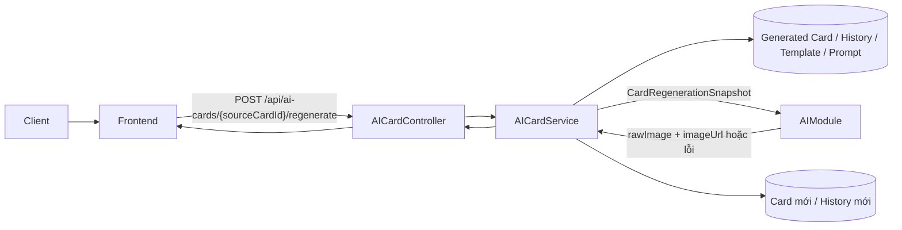
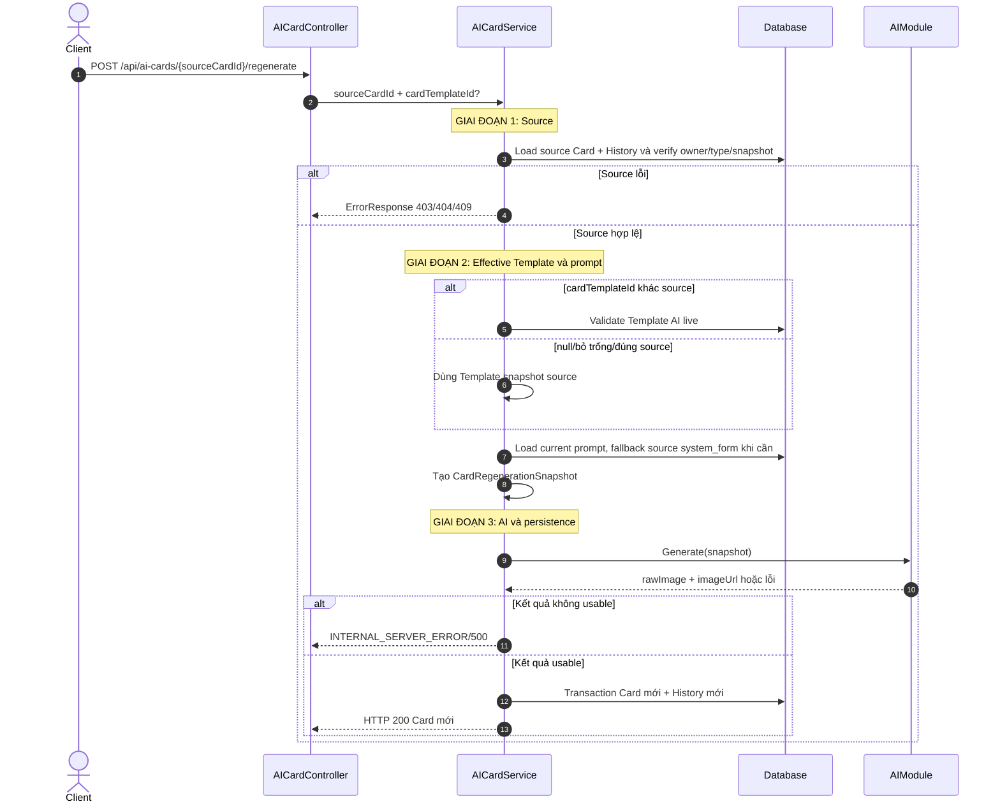
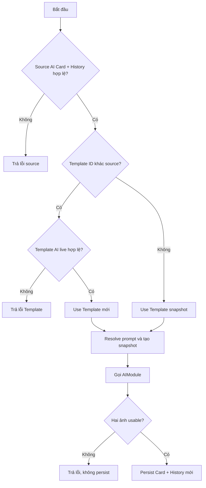
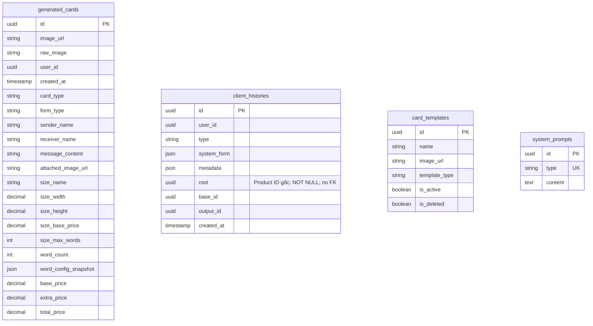

# TDD-007: Tạo lại thiệp từ lịch sử

## Thông tin tài liệu
- **Tiêu đề**: Regenerate Card AI từ History và cho phép đổi Template
- **Ghi chú**: API tạo Card mới từ snapshot của Card nguồn, giữ nguyên nội dung/Size/giá và chỉ cho chọn Template AI khác. Service gọi `AIModule` bằng snapshot đã resolve và không quản lý chính sách vận hành nội bộ của lời gọi AI.

## Metadata quản trị tài liệu
| Trường | Giá trị |
|---|---|
| Mã tài liệu | TDD-007 |
| Phiên bản | v1.3 |
| Author | Nguyễn Tùng Dương |
| Reviewer | Tân Trần |
| Approver | Chưa chỉ định |
| Owner | Nguyễn Tùng Dương |
| Cập nhật gần nhất | 2026-09-09 |

---

## BƯỚC 1 — Thông tin & Bối cảnh

### Thông tin tài liệu
- **Mã tài liệu**: TDD-007
- **Tính năng**: Regenerate Card AI từ History
- **Tác giả**: Nguyễn Tùng Dương
- **Người review**: Tân Trần
- **Phiên bản**: v1.3
- **Cập nhật (YYYY-MM-DD)**: 2026-09-09
- **Story liên quan**:
  - STORY-036

### Business Rules
- **BR-007-01**: Endpoint yêu cầu đăng nhập. `sourceCardId` là `generated_cards.id` được chọn từ `client_histories.output_id`.
- **BR-007-02**: Source Card phải tồn tại, thuộc user hiện tại, có `card_type=ai` và có History `type=card` với snapshot, `base_id` và `root` Product hợp lệ. `root` bắt buộc khác `Guid.Empty`. Card HandMade trả `HANDMADE_CARD_REGENERATE_NOT_SUPPORTED`.
- **BR-007-03**: Request chỉ nhận `cardTemplateId` tùy chọn; không mở form chỉnh sửa nội dung.
- **BR-007-04**: `cardTemplateId` bỏ trống/null/đúng ID Template nguồn dùng Template snapshot nguồn mà không query live. ID khác nguồn phải validate `CARD_TEMPLATE_NOT_FOUND` → `CARD_TEMPLATE_DELETED` → `CARD_TEMPLATE_INACTIVE` và bắt buộc `templateType=ai`; HandMade Template trả `CARD_TEMPLATE_TYPE_INVALID`.
- **BR-007-05**: Giữ nguyên `senderName`, `receiverName`, `messageContent`, `attachedImageUrl`, `formType`, toàn bộ Size snapshot, `wordCount`, Calligraphy snapshot và giá từ Card nguồn.
- **BR-007-06**: Không query/validate live Product, Generated Flower, Mockup, Size Config hoặc Price Config nguồn. Trạng thái live thay đổi không chặn Regenerate.
- **BR-007-07**: Prompt ưu tiên prompt hiện hành type `card`; nếu không usable thì fallback `client_histories.system_form` của source. Cả hai không usable trả `CARD_SOURCE_HISTORY_INVALID`.
- **BR-007-08**: Source thiếu Template/Size/pricing/prompt snapshot tối thiểu hoặc thiếu `base_id/root` Product hợp lệ trả `CARD_SOURCE_HISTORY_INVALID`.
- **BR-007-09**: Service tạo `CardRegenerationSnapshot` từ Card/History nguồn, Effective Template và prompt thực tế trước khi gọi AI.
- **BR-007-10**: Service gọi `AIModule` bằng snapshot và chỉ xử lý kết quả cuối cùng `{rawImage,imageUrl}` hoặc lỗi. Không mô tả chính sách vận hành nội bộ của lời gọi AI trong TDD này.
- **BR-007-11**: Chỉ persist khi cả `rawImage` và `imageUrl` usable. Lỗi AI/upload/persistence không tạo Card/History hoàn chỉnh.
- **BR-007-12**: Transaction thành công tạo Card AI mới và History mới; không ghi đè/xóa source Card hoặc source History.
- **BR-007-13**: History mới kế thừa cả `baseId` và `root` của History nguồn, `outputId` là Card mới; `root` tiếp tục là Product ID gốc, không được tính lại từ metadata. Metadata có `operation=regenerate`, `regeneratedFromCardId`, Effective Template và `systemPromptSource=current|source_card_fallback`.
- **BR-007-14**: Generated Card mới có ID, hai ảnh, `createdAt`, `userId` mới; các snapshot nội dung/giá giữ nguyên source.
- **BR-007-15**: Kết quả không tự gắn Checkout/Order.

### Bối cảnh & Mục tiêu

**Vấn đề**
> Khách hàng muốn tạo thêm một phiên bản ảnh của Card AI đã có mà không nhập lại nội dung. Template có thể giữ theo snapshot hoặc được đổi sang Template AI khác.

**Mục tiêu**
- Tạo Card mới mà không thay source.
- Giữ nguyên dữ liệu cá nhân hóa, Size và pricing snapshot.
- Resolve Template và prompt theo policy rõ ràng.
- Gọi AIModule với snapshot hoàn chỉnh và persist hai ảnh cùng History.

**Ngoài phạm vi** (Out of scope)
- Chỉnh sửa nội dung; xem TDD-027.
- Regenerate HandMade Card.
- Kiểm tra live Product/Mockup/Card Config nguồn.
- Tự gắn kết quả vào Checkout.
- Cách AIModule thực thi bên trong.

---

## BƯỚC 2 — Kiến trúc & Sơ đồ

### Kiến trúc tổng quan (Architecture)
**Tiêu đề**: Regenerate từ Card History
**Mô tả**: Service đọc source snapshot, resolve Template/prompt, gọi AIModule và tạo Card/History mới.


**Ghi chú**: TDD-007 không dùng `rawImage` của source làm image-reference; đó là TDD-027.

### Sequence Diagram
**Tiêu đề**: Trình tự Regenerate Card
**Mô tả**: Các dependency nguồn dùng snapshot; chỉ Template khác source được validate live.


**Ghi chú**: Không load live Size/Price Config hay nguồn Product/Flower trong flow này.

### Activity Diagram (optional — chỉ điền nếu logic có nhiều nhánh điều kiện phức tạp)
**Tiêu đề**: Nhánh source và Template
**Mô tả**: Thể hiện các quyết định thuộc trách nhiệm AICardService.



### State Diagram (optional — chỉ điền nếu entity chính có vòng đời trạng thái)
- **Không áp dụng**: Source không đổi; kết quả chỉ xuất hiện sau transaction thành công.

### Mô hình dữ liệu (Data Model / ERD)
**Tiêu đề**: Dữ liệu source và kết quả Regenerate
**Mô tả**: Chỉ liệt kê bảng/field, không vẽ dây quan hệ.



**Ghi chú dữ liệu**: History mới kế thừa nguyên `base_id` và `root` của History Card nguồn. `root` là Product ID gốc, bắt buộc, khác `Guid.Empty`, không có FK và không nằm trong response API.

---

## BƯỚC 3 — API

### API Contract nội bộ

#### Endpoint #1
- **Method**: POST
- **Endpoint**: `/api/ai-cards/{sourceCardId}/regenerate`
- **Tên endpoint**: Tạo lại thiệp từ lịch sử
- **Mô tả**: Tạo Card mới, giữ source content/size/price và tùy chọn đổi Template AI.

#### Path parameter specification
| Field | Type | Required | Mô tả |
|---|---|---:|---|
| `sourceCardId` | uuid | Có | `generated_cards.id` của Card được chọn; phải có History `type=card` thuộc user. |

#### Request body specification
| Field | Type | Required | Mô tả |
|---|---|---:|---|
| `cardTemplateId` | uuid/null | Không | Null/bỏ field/đúng source dùng Template snapshot; ID khác source được validate live và phải là Template AI. |

Body `{}` là hợp lệ.

#### Response field specification
| Field | Type | Mô tả |
|---|---|---|
| `id` | uuid | ID Card mới. |
| `content` | string/null | Content của Card mới. |
| `imageUrl` | string | Ảnh hoàn chỉnh mới. |
| `rawImage` | string | Ảnh gốc mới trước chèn chữ. |
| `userId` | uuid | User hiện tại. |
| `createdAt` | datetime UTC | Thời điểm tạo mới. |
| `cardType` | string | `ai`. |
| `formType` | string | Giữ từ source. |
| `senderName` | string | Giữ từ source. |
| `receiverName` | string | Giữ từ source. |
| `messageContent` | string | Giữ từ source. |
| `attachedImageUrl` | string/null | Giữ từ source. |
| `sizeName/sizeWidth/sizeHeight` | string/decimal | Size snapshot nguồn. |
| `sizeBasePrice/sizeMaxWords` | decimal/integer | Giá/giới hạn Size nguồn. |
| `wordCount` | integer | Giữ từ source. |
| `wordConfigSnapshot` | object/null | Giữ rule nguồn. |
| `basePrice/extraPrice/totalPrice` | decimal | Giữ pricing nguồn. |

**Ví dụ 1 — Dùng Template snapshot nguồn** — HTTP `200`

Request:
```http
POST /api/ai-cards/550e8400-e29b-41d4-a716-446655440001/regenerate
Content-Type: application/json

{}
```

Response:
```json
{
  "value": {
    "id": "880e8400-e29b-41d4-a716-446655440099",
    "content": "...",
    "imageUrl": "https://storage.example.com/cards/new-final.png",
    "rawImage": "https://storage.example.com/cards/new-raw.png",
    "userId": "770e8400-e29b-41d4-a716-446655440003",
    "createdAt": "2026-09-08T11:00:00Z",
    "cardType": "ai",
    "formType": "go_may",
    "senderName": "Nguyễn An",
    "receiverName": "Trần Bình",
    "messageContent": "Chúc bạn sinh nhật vui vẻ",
    "attachedImageUrl": null,
    "sizeName": "Kích thước chung",
    "sizeWidth": 15,
    "sizeHeight": 25,
    "sizeBasePrice": 15000,
    "sizeMaxWords": 150,
    "wordCount": 5,
    "wordConfigSnapshot": null,
    "basePrice": 15000,
    "extraPrice": 0,
    "totalPrice": 15000
  }
}
```

**Ví dụ 2 — Chọn Template AI khác** — HTTP `200`

Request:
```http
POST /api/ai-cards/550e8400-e29b-41d4-a716-446655440001/regenerate
Content-Type: application/json

{
  "cardTemplateId": "660e8400-e29b-41d4-a716-446655440010"
}
```

Response:
```json
{
  "value": {
    "id": "880e8400-e29b-41d4-a716-446655440100",
    "imageUrl": "https://storage.example.com/cards/template-new-final.png",
    "rawImage": "https://storage.example.com/cards/template-new-raw.png",
    "cardType": "ai",
    "formType": "go_may",
    "senderName": "Nguyễn An",
    "receiverName": "Trần Bình",
    "messageContent": "Chúc bạn sinh nhật vui vẻ",
    "sizeName": "Kích thước chung",
    "sizeWidth": 15,
    "sizeHeight": 25,
    "sizeBasePrice": 15000,
    "sizeMaxWords": 150,
    "wordCount": 5,
    "wordConfigSnapshot": null,
    "basePrice": 15000,
    "extraPrice": 0,
    "totalPrice": 15000
  }
}
```

**Ví dụ 3 — Giữ snapshot Calligraphy** — HTTP `200`

Request:
```http
POST /api/ai-cards/550e8400-e29b-41d4-a716-446655440002/regenerate

{}
```

Response:
```json
{
  "value": {
    "id": "990e8400-e29b-41d4-a716-446655440100",
    "imageUrl": "https://storage.example.com/cards/calligraphy-final.png",
    "rawImage": "https://storage.example.com/cards/calligraphy-raw.png",
    "cardType": "ai",
    "formType": "calligraphy",
    "senderName": "Hoàng Lan",
    "receiverName": "Lê Minh",
    "messageContent": "Nội dung nguồn",
    "sizeName": "Kích thước chung",
    "sizeWidth": 15,
    "sizeHeight": 25,
    "sizeBasePrice": 15000,
    "sizeMaxWords": 150,
    "wordCount": 45,
    "wordConfigSnapshot": {
      "min_words": 36,
      "max_words": 70,
      "extra_price": 39000
    },
    "basePrice": 15000,
    "extraPrice": 39000,
    "totalPrice": 54000
  }
}
```

**Ví dụ 4 — Card nguồn không tồn tại** — HTTP `404`

Request:
```http
POST /api/ai-cards/00000000-0000-0000-0000-000000000000/regenerate

{}
```

Response:
```json
{
  "title": "Not Found",
  "status": 404,
  "detail": "Thiệp không tồn tại.",
  "messageCode": "CARD_NOT_FOUND"
}
```

**Ví dụ 5 — Card nguồn khác owner** — HTTP `403`

Request:
```http
POST /api/ai-cards/550e8400-e29b-41d4-a716-446655440003/regenerate

{}
```

Response:
```json
{
  "title": "Forbidden",
  "status": 403,
  "detail": "Bạn không có quyền truy cập thiệp này.",
  "messageCode": "ACCESS_DENIED"
}
```

**Ví dụ 6 — Template mới không tồn tại** — HTTP `404`

Request:
```http
POST /api/ai-cards/550e8400-e29b-41d4-a716-446655440001/regenerate

{
  "cardTemplateId": "00000000-0000-0000-0000-000000000000"
}
```

Response:
```json
{
  "title": "Not Found",
  "status": 404,
  "detail": "Không tìm thấy mẫu thiệp được chọn.",
  "messageCode": "CARD_TEMPLATE_NOT_FOUND"
}
```

**Ví dụ 7 — Template mới đã xóa** — HTTP `410`

Request: dùng source hợp lệ và `cardTemplateId` của Template có `isDeleted=true`.

Response:
```json
{
  "title": "Gone",
  "status": 410,
  "detail": "Mẫu thiệp được chọn đã bị xóa.",
  "messageCode": "CARD_TEMPLATE_DELETED"
}
```

**Ví dụ 8 — Template mới inactive** — HTTP `409`

Request: dùng source hợp lệ và `cardTemplateId` của Template inactive.

Response:
```json
{
  "title": "Conflict",
  "status": 409,
  "detail": "Mẫu thiệp được chọn đang bị ngưng.",
  "messageCode": "CARD_TEMPLATE_INACTIVE"
}
```

**Ví dụ 9 — Chọn Template HandMade** — HTTP `409`

Request: dùng source hợp lệ và `cardTemplateId` của Template có `templateType=handmade`.

Response:
```json
{
  "title": "Conflict",
  "status": 409,
  "detail": "Template không phù hợp với Regenerate AI.",
  "messageCode": "CARD_TEMPLATE_TYPE_INVALID"
}
```

**Ví dụ 10 — Source History không đủ dữ liệu** — HTTP `409`

Request:
```http
POST /api/ai-cards/550e8400-e29b-41d4-a716-446655440004/regenerate

{}
```

Response:
```json
{
  "title": "Conflict",
  "status": 409,
  "detail": "Lịch sử Card nguồn không đủ snapshot hoặc Product gốc để tạo lại.",
  "messageCode": "CARD_SOURCE_HISTORY_INVALID"
}
```

**Ví dụ 11 — Source HandMade** — HTTP `409`

Request:
```http
POST /api/ai-cards/550e8400-e29b-41d4-a716-446655440005/regenerate

{}
```

Response:
```json
{
  "title": "Conflict",
  "status": 409,
  "detail": "Thiệp HandMade không hỗ trợ tạo lại.",
  "messageCode": "HANDMADE_CARD_REGENERATE_NOT_SUPPORTED"
}
```

**Ví dụ 12 — AIModule không trả kết quả usable** — HTTP `500`

Request: dùng source/body hợp lệ của Ví dụ 1.

Response:
```json
{
  "title": "Internal Server Error",
  "status": 500,
  "detail": "Không thể tạo ảnh thiệp.",
  "messageCode": "INTERNAL_SERVER_ERROR"
}
```

**Ví dụ 13 — Chưa đăng nhập** — HTTP `401`

Request: dùng source/body Ví dụ 1 nhưng không có phiên xác thực.

Response:
```json
{
  "title": "Unauthorized",
  "status": 401,
  "detail": "Bạn cần đăng nhập.",
  "messageCode": "UNAUTHORIZED"
}
```

#### Mã lỗi
| STT | Code | HTTP | Khi nào xảy ra |
|:---:|---|---:|---|
| 1 | `CARD_NOT_FOUND` | 404 | Source Card không tồn tại |
| 2 | `ACCESS_DENIED` | 403 | Source không thuộc user |
| 3 | `CARD_SOURCE_HISTORY_INVALID` | 409 | History/snapshot/prompt fallback hoặc `base_id/root` Product không đủ hay không hợp lệ |
| 4 | `CARD_TEMPLATE_NOT_FOUND` | 404 | Template khác source không tồn tại |
| 5 | `CARD_TEMPLATE_DELETED` | 410 | Template khác source đã xóa |
| 6 | `CARD_TEMPLATE_INACTIVE` | 409 | Template khác source inactive |
| 7 | `CARD_TEMPLATE_TYPE_INVALID` | 409 | Template khác source không phải AI |
| 8 | `HANDMADE_CARD_REGENERATE_NOT_SUPPORTED` | 409 | Source là HandMade Card |
| 9 | `UNAUTHORIZED` | 401 | Chưa đăng nhập |
| 10 | `INTERNAL_SERVER_ERROR` | 500 | AIModule, upload hoặc persistence không tạo kết quả hoàn chỉnh |

### API Contract bên ngoài (optional — chỉ điền nếu hàm/API này gọi ra service/API của bên thứ ba)
- **Endpoints sử dụng**: `AIModule` nội bộ; provider/endpoint cụ thể chưa được xác định.
- **Field quan trọng gửi vào**: `CardRegenerationSnapshot` gồm source snapshots, Effective Template, prompt và input/price cố định.
- **Field quan trọng nhận về**: `rawImage`, `imageUrl`.
- **Xử lý lỗi từ đối tác**: Service nhận kết quả cuối cùng hoặc lỗi; kết quả không usable không được persist.
- **Quirks / cạm bẫy**: Không dùng raw image của source làm reference và không query dependency live đã snapshot.

---

## BƯỚC 4 — Tham chiếu

### 🔴 Tham chiếu đến
- TDD-006 — Response Card, validation nền và persistence.
- TDD-022 đến TDD-026 — Card Template.
- `AI_Card_Context.md` — snapshot/prompt và chính sách nội bộ của lời gọi AI.

### ⚫ Trỏ vào tài liệu này
- STORY-036 và System Test Regenerate.
- TDD-027 để phân biệt “đổi Template” với “đổi nội dung”.

### ⋯ Bị ảnh hưởng
- Schema Generated Card/History, Template snapshot và prompt fallback.
