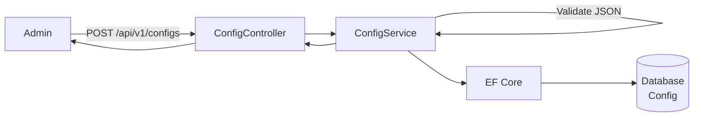
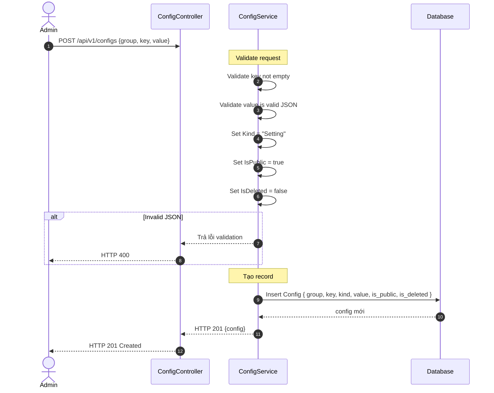
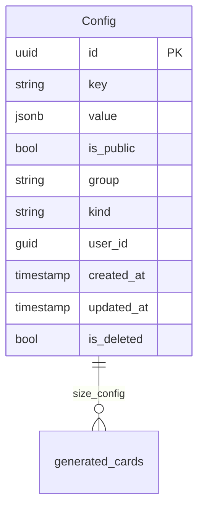

# TDD-009: Tạo Card Config

## Thông tin tài liệu
- **Tiêu đề**: Tạo cấu hình card (size/calligraphy)
- **Ghi chú**: API cho phép Admin tạo cấu hình card (size hoặc calligraphy words) sử dụng bảng Config có sẵn với Kind="Setting".

## Metadata quản trị tài liệu
| Trường | Giá trị |
|---|---|
| Mã tài liệu | TDD-009 |
| Phiên bản | v0.5 |
| Author | Codex |
| Reviewer | |
| Approver | Chưa chỉ định |
| Owner | Nhóm Hoa Theo Mùa |
| Cập nhật gần nhất | 2026-09-04 |

---

## BƯỚC 1 — Thông tin & Bối cảnh

### Thông tin tài liệu
- **Mã tài liệu**: TDD-009
- **Tính năng**: Tạo card config
- **Tác giả**: Codex
- **Người review**: 
- **Phiên bản**: v0.5
- **Cập nhật (YYYY-MM-DD)**: 2026-09-04
- **Story liên quan**: Không có

### Business Rules
- BR-009-01: Chỉ Admin có quyền tạo card config
- BR-009-02: Sử dụng bảng Config có sẵn
- BR-009-03: Với `group=card_size|card_config`, client không truyền `kind`; service luôn gán `Kind="Setting"`. Hành vi của endpoint Config tổng quát với group khác nằm ngoài TDD này.
- BR-009-04: Group phân loại:
  - "card_size" cho size configs
  - "card_config" cho calligraphy_words config
- BR-009-05: Key được chọn từ danh sách predefined:
  - Size: `size_A`, `size_B`, `size_C`, ...
  - Calligraphy: `calligraphy_words`
- BR-009-06: Cho phép nhiều Config cùng `group`, nhưng mỗi lựa chọn dùng key riêng (`size_A`, `size_B`, ...); trong các record chưa xóa chỉ được có một record `is_public=true` cho cùng cặp `(group,key)`
- BR-009-07: Value được format thành JSON khi lưu vào DB
- BR-009-08: Value phải là JSON hợp lệ khi tạo
- BR-009-09: IsPublic = true khi tạo mới (đang hoạt động)
- BR-009-10: IsDeleted = false khi tạo mới
- BR-009-11: Nếu đã có record chưa xóa và active cùng `(group,key)`, từ chối tạo bằng `CARD_CONFIG_AMBIGUOUS/409`; không chọn record ngẫu nhiên

### Bối cảnh & Mục tiêu

**Vấn đề**
> Admin cần tạo cấu hình card (size với giá, kích thước; calligraphy words với phụ phí theo số từ) sử dụng bảng Config có sẵn trong hệ thống.

**Mục tiêu**
- Tạo card config mới với Group, Key và Value; Kind do server gán
- Validate value là JSON hợp lệ
- Kind luôn là "Setting"

**Ngoài phạm vi** (Out of scope)
- Cập nhật card config (TDD-010)
- Xóa card config (TDD-011)
- Seed data mặc định

---

## BƯỚC 2 — Kiến trúc & Sơ đồ

### Kiến trúc tổng quan (Architecture)
**Tiêu đề**: Trình tự tạo card config
**Mô tả**: Admin gọi API tạo config → Controller nhận request → Service validate → Lưu vào bảng Config → Trả kết quả



### Sequence Diagram
**Tiêu đề**: Trình tự tạo card config
**Mô tả**: Từng bước gọi qua lại giữa các thành phần



### Activity Diagram

- **Không áp dụng**: Luồng điều kiện đã được thể hiện đầy đủ trong Sequence Diagram và không có nhánh nghiệp vụ phức tạp cần một Activity Diagram riêng.

### State Diagram

- **Không áp dụng**: Endpoint không định nghĩa một state machine riêng cho entity chính.

### Mô hình dữ liệu (Data Model / ERD)
**Tiêu đề**: Bảng Config
**Mô tả**: Cấu trúc bảng Config



---

## BƯỚC 3 — API

### API Contract nội bộ

#### Endpoint #1: Tạo card config
- **Method**: POST
- **Endpoint**: `/api/v1/configs`
- **Tên endpoint**: Tạo card config
- **Mô tả**: Tạo cấu hình card mới (size hoặc calligraphy)
- **Quyền**: Chỉ Admin

**Request Body:**
```json
{
  "group": "card_size",
  "key": "size_A",
  "value": { ... }
}
```

**Ví dụ 1 — Happy path: Tạo size config** — HTTP `201`

Request:
```json
POST /api/v1/configs
{
  "group": "card_size",
  "key": "size_A",
  "value": {
    "name": "A",
    "width": 10,
    "height": 15,
    "base_price": 100000,
    "max_words": 100
  }
}
```

Response:
```json
{
  "value": {
    "id": "550e8400-e29b-41d4-a716-446655440001",
    "key": "size_A",
    "value": {
      "name": "A",
      "width": 10,
      "height": 15,
      "base_price": 100000,
      "max_words": 100
    },
    "group": "card_size",
    "kind": "Setting",
    "is_public": true,
    "is_deleted": false,
    "user_id": "...",
    "created_at": "2026-08-26T10:00:00Z",
    "updated_at": null
  }
}
```

**Ví dụ 2 — Happy path: Tạo calligraphy words config** — HTTP `201`

Request:
```json
POST /api/v1/configs
{
  "group": "card_config",
  "key": "calligraphy_words",
  "value": [
    { "min_words": 0, "max_words": 35, "extra_price": 0 },
    { "min_words": 36, "max_words": 70, "extra_price": 39000 },
    { "min_words": 71, "max_words": 100, "extra_price": 69000 }
  ]
}
```

Response:
```json
{
  "value": {
    "id": "550e8400-e29b-41d4-a716-446655440002",
    "key": "calligraphy_words",
    "value": [
      { "min_words": 0, "max_words": 35, "extra_price": 0 },
      { "min_words": 36, "max_words": 70, "extra_price": 39000 },
      { "min_words": 71, "max_words": 100, "extra_price": 69000 }
    ],
    "group": "card_config",
    "kind": "Setting",
    "is_public": true,
    "is_deleted": false,
    "user_id": "...",
    "created_at": "2026-08-26T10:00:00Z",
    "updated_at": null
  }
}
```

**Ví dụ 3 — Từ chối tạo trùng cặp group + key đang active** — HTTP `409`

Request:
```json
POST /api/v1/configs
{
  "group": "card_size",
  "key": "size_A",
  "value": {
    "name": "A",
    "width": 12,
    "height": 18,
    "base_price": 120000,
    "max_words": 120
  }
}
```

Response khi đã có `group=card_size`, `key=size_A`, `is_public=true`, `is_deleted=false`:

```json
{
  "error": {
    "code": "CARD_CONFIG_AMBIGUOUS",
    "message": "Đã tồn tại cấu hình đang hoạt động cho cùng group và key."
  }
}
```

**Ví dụ 4 — Validation: Invalid JSON** — HTTP `400`

Request:
```json
POST /api/v1/configs
{
  "group": "card_size",
  "key": "size_A",
  "value": "this is not valid json {"
}
```

Response:
```json
{
  "error": {
    "code": "VALIDATION_ERROR",
    "message": "Value must be a valid JSON."
  }
}
```

**Ví dụ 5 — Validation: Missing key** — HTTP `400`

Request:
```json
POST /api/v1/configs
{
  "group": "card_size",
  "value": { "name": "A" }
}
```

Response:
```json
{
  "error": {
    "code": "VALIDATION_ERROR",
    "message": "Key is required."
  }
}
```

**Ví dụ 6 — Validation: Missing group** — HTTP `400`

Request:
```json
POST /api/v1/configs
{
  "key": "size_A",
  "value": { "name": "A" }
}
```

Response:
```json
{
  "error": {
    "code": "VALIDATION_ERROR",
    "message": "Group is required."
  }
}
```

**Ví dụ 7 — Không truyền kind, server tự gán Setting** — HTTP `201`

Request:
```json
POST /api/v1/configs
{
  "group": "card_size",
  "key": "size_A",
  "value": { "name": "A" }
}
```

Response:
```json
{
  "value": {
    "key": "size_A",
    "group": "card_size",
    "kind": "Setting",
    "is_public": true,
    "is_deleted": false,
    "value": { "name": "A" }
  }
}
```

**Ví dụ 8 — Authorization: Non-admin user** — HTTP `403`

Request:
```json
POST /api/v1/configs
{
  "group": "card_size",
  "key": "size_A",
  "value": { ... }
}
```

Response:
```json
{
  "error": {
    "code": "ACCESS_DENIED",
    "message": "Bạn không có quyền thực hiện thao tác này."
  }
}
```

**Ví dụ — User chưa đăng nhập** — HTTP `401`

Request:
```json
POST /api/v1/configs
{
  "group": "card_size",
  "key": "size_A",
  "value": "{\"name\":\"A\",\"width\":10,\"height\":15}"
}
```

Response:
```json
{
  "error": {
    "code": "UNAUTHORIZED",
    "message": "Bạn cần đăng nhập để thực hiện thao tác này."
  }
}
```

#### Mã lỗi
| Code | HTTP | Khi nào xảy ra |
|---|---|---|
| VALIDATION_ERROR | 400 | Value không phải JSON hợp lệ hoặc thiếu field bắt buộc (`key`, `group`, `value`) |
| CARD_CONFIG_AMBIGUOUS | 409 | Đã tồn tại Config active/chưa xóa cùng cặp group + key |
| ACCESS_DENIED | 403 | Bạn không có quyền tạo cấu hình card |
| UNAUTHORIZED | 401 | Bạn cần đăng nhập để thực hiện thao tác này |

### API Contract bên ngoài

- **Endpoints sử dụng**: Không áp dụng; endpoint này không gọi service hoặc API bên thứ ba.
- **Field quan trọng**: Không áp dụng.
- **Xử lý lỗi từ đối tác**: Không áp dụng.
- **Quirks / cạm bẫy**: Không áp dụng.

---

## BƯỚC 4 — Tham chiếu

> Chú thích: 🔴 Tham chiếu đến (tài liệu này đọc/phụ thuộc) · ⚫ Trỏ vào tài liệu này (tài liệu khác phụ thuộc vào tài liệu này) · ⋯ Bị ảnh hưởng (thay đổi ở đây có thể làm tài liệu kia sai theo)

### 🔴 Tham chiếu đến
- Không có

### ⚫ Trỏ vào tài liệu này
- TDD-008 - Lấy danh sách card configs
- TDD-010 - Cập nhật card config
- TDD-011 - Xóa card config
- TDD-006 - Tạo thiệp thiết kế AI (sử dụng Config cho pricing)
- TDD-007 - Tạo lại thiệp từ lịch sử (sử dụng Config cho pricing)

### ⋯ Bị ảnh hưởng
- TDD-006, TDD-007 - Nếu thay đổi cấu trúc Config, cần kiểm tra lại logic pricing

---

### Seed Data tham chiếu

```json
[
  {
    "group": "card_size",
    "key": "size_A",
    "kind": "Setting",
    "value": { "name": "A", "width": 10, "height": 15, "base_price": 100000, "max_words": 100 }
  },
  {
    "group": "card_size",
    "key": "size_B",
    "kind": "Setting",
    "value": { "name": "B", "width": 15, "height": 20, "base_price": 150000, "max_words": 150 }
  },
  {
    "group": "card_size",
    "key": "size_C",
    "kind": "Setting",
    "value": { "name": "C", "width": 20, "height": 25, "base_price": 200000, "max_words": 200 }
  },
  {
    "group": "card_config",
    "key": "calligraphy_words",
    "kind": "Setting",
    "value": [
      { "min_words": 0, "max_words": 35, "extra_price": 0 },
      { "min_words": 36, "max_words": 70, "extra_price": 39000 },
      { "min_words": 71, "max_words": 100, "extra_price": 69000 }
    ]
  }
]
```

---

### Ghi chú quan trọng

- Sử dụng bảng **Config** có sẵn trong codebase
- **Kind = "Setting"** do server gán cho tất cả card configs; client không truyền field này khi tạo
- **Group** phân loại: "card_size" hoặc "card_config"
- **IsPublic = true** khi tạo mới (đang hoạt động để người dùng chọn)
- **IsDeleted = false** khi tạo mới (chưa xóa mềm)
- **IsPublic**: dùng để xác định config có đang hoạt động để áp dụng cho người dùng chọn (true = đang hoạt động)
- **IsDeleted**: dùng cho xóa mềm
