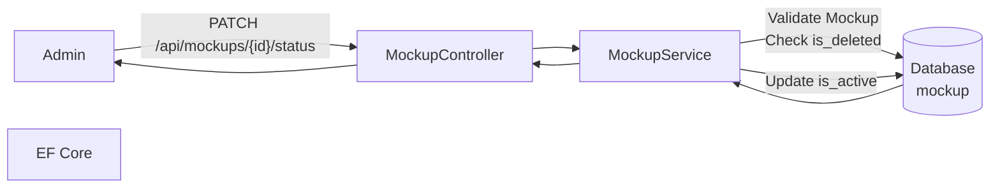
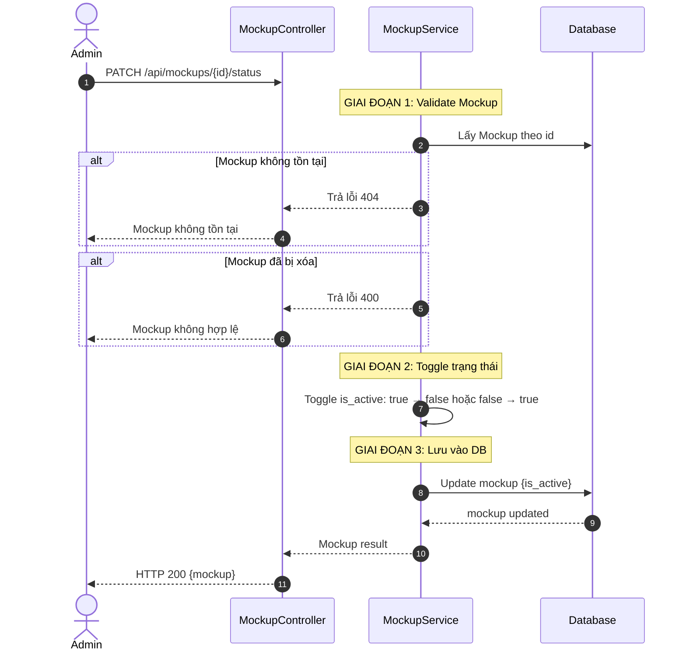
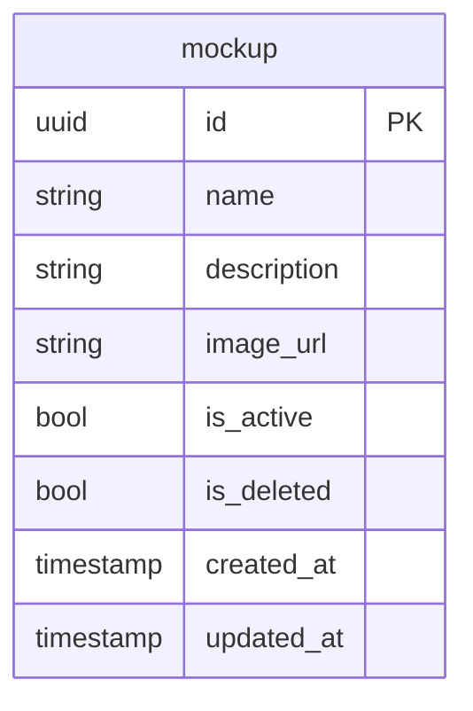

# TDD-014: Chuyển trạng thái Mockup

## Thông tin tài liệu
- **Tiêu đề**: Chuyển trạng thái Mockup giữa Active và Inactive
- **Ghi chú**: API cho phép Admin chuyển trạng thái Mockup từ Hoạt động sang Không hoạt động hoặc ngược lại.

## Metadata quản trị tài liệu
| Trường | Giá trị |
|---|---|
| Mã tài liệu | TDD-014 |
| Phiên bản | v0.2 |
| Author | Codex |
| Reviewer | |
| Approver | Chưa chỉ định |
| Owner | Nhóm Hoa Theo Mùa |
| Cập nhật gần nhất | 2026-09-04 |

---

## BƯỚC 1 — Thông tin & Bối cảnh

### Thông tin tài liệu
- **Mã tài liệu**: TDD-014
- **Tính năng**: Chuyển trạng thái Mockup
- **Tác giả**: Codex
- **Người review**: 
- **Phiên bản**: v0.2
- **Cập nhật (YYYY-MM-DD)**: 2026-09-04
- **Story liên quan**:
  - STORY-052

### Business Rules
- BR-014-01: Mockup Active (`is_active = true`) có thể chuyển sang Inactive
- BR-014-02: Mockup Inactive (`is_active = false`) có thể chuyển sang Active
- BR-014-03: Mockup đã bị xóa (`is_deleted = true`) không thể chuyển trạng thái
- BR-014-04: Mockup không tồn tại trả về lỗi 404
- BR-014-05: Inactive làm Mockup không thể được chọn mới cho Create Flower hoặc Regenerate Flower. Tuy nhiên Regenerate bỏ trống/null hoặc truyền đúng ID nguồn vẫn dùng Mockup snapshot nguồn mà không query/validate trạng thái live.

### Bối cảnh & Mục tiêu

**Vấn đề**
> Admin cần chuyển trạng thái Mockup giữa Hoạt động và Không hoạt động để kiểm soát Mockup nào được phép hiển thị cho khách hàng trong quy trình khởi tạo mẫu hoa.

**Mục tiêu**
- Chuyển trạng thái Mockup từ Active sang Inactive
- Chuyển trạng thái Mockup từ Inactive sang Active
- Chỉ Admin có quyền mới được phép chuyển trạng thái
- Không thể chuyển trạng thái Mockup đã bị xóa

**Ngoài phạm vi** (Out of scope)
- Thêm Mockup (TDD-013)
- Chỉnh sửa thông tin Mockup
- Xóa Mockup (TDD-015)

---

## BƯỚC 2 — Kiến trúc & Sơ đồ

### Kiến trúc tổng quan (Architecture)
**Tiêu đề**: Trình tự chuyển trạng thái Mockup
**Mô tả**: Client gọi API chuyển trạng thái → Controller nhận request → Service validate → Cập nhật vào DB → Trả kết quả



### Sequence Diagram
**Tiêu đề**: Trình tự chuyển trạng thái Mockup
**Mô tả**: Từng bước gọi qua lại giữa các thành phần



### Activity Diagram

- **Không áp dụng**: Luồng điều kiện đã được thể hiện đầy đủ trong Sequence Diagram và không có nhánh nghiệp vụ phức tạp cần một Activity Diagram riêng.

### State Diagram

- **Không áp dụng**: Endpoint không định nghĩa một state machine riêng cho entity chính.

### Mô hình dữ liệu (Data Model / ERD)
**Tiêu đề**: Bảng Mockup
**Mô tả**: Cấu trúc bảng mockup



---

## BƯỚC 3 — API

### API Contract nội bộ

#### Endpoint #1: Chuyển trạng thái Mockup
- **Method**: PATCH
- **Endpoint**: `/api/mockups/{id}/status`
- **Tên endpoint**: Chuyển trạng thái Mockup
- **Mô tả**: Toggle trạng thái Mockup giữa Active và Inactive
- **Quyền**: Admin

**Path Parameters:**
| Parameter | Type | Required | Mô tả |
|-----------|------|----------|--------|
| id | uuid | Có | ID của Mockup |

**Ví dụ 1 — Happy path: Chuyển từ Active sang Inactive** — HTTP `200`

Request:
```
PATCH /api/mockups/550e8400-e29b-41d4-a716-446655440001/status
```

Response:
```json
{
  "value": {
    "id": "550e8400-e29b-41d4-a716-446655440001",
    "name": "Mockup Sinh Nhật 1",
    "description": "Mockup bó hoa sinh nhật",
    "image_url": "https://storage.example.com/mockups/sinh-nhat-1.jpg",
    "is_active": false,
    "is_deleted": false,
    "created_at": "2026-08-27T10:00:00Z",
    "updated_at": "2026-08-27T11:00:00Z"
  }
}
```

**Ví dụ 2 — Happy path: Chuyển từ Inactive sang Active** — HTTP `200`

Request:
```
PATCH /api/mockups/550e8400-e29b-41d4-a716-446655440001/status
```

Response:
```json
{
  "value": {
    "id": "550e8400-e29b-41d4-a716-446655440001",
    "name": "Mockup Sinh Nhật 1",
    "is_active": true,
    "is_deleted": false,
    "created_at": "2026-08-27T10:00:00Z",
    "updated_at": "2026-08-27T11:30:00Z"
  }
}
```

**Ví dụ 3 — Mockup không tồn tại** — HTTP `404`

Request:
```
PATCH /api/mockups/00000000-0000-0000-0000-000000000000/status
```

Response:
```json
{
  "error": {
    "code": "NOT_FOUND",
    "message": "Mockup không tồn tại."
  }
}
```

**Ví dụ 4 — Mockup đã bị xóa** — HTTP `400`

Request:
```
PATCH /api/mockups/550e8400-e29b-41d4-a716-446655440099/status
```

Response:
```json
{
  "error": {
    "code": "BAD_REQUEST",
    "message": "Mockup không hợp lệ hoặc đã bị xóa."
  }
}
```

**Ví dụ 5 — Không có quyền** — HTTP `403`

Request:
```
PATCH /api/mockups/550e8400-e29b-41d4-a716-446655440001/status
```

Response:
```json
{
  "error": {
    "code": "ACCESS_DENIED",
    "message": "Bạn không có quyền thực hiện thao tác này."
  }
}
```

**Ví dụ 6 — Lỗi hệ thống** — HTTP `500`

Request:
```
PATCH /api/mockups/550e8400-e29b-41d4-a716-446655440001/status
```

Response:
```json
{
  "error": {
    "code": "INTERNAL_SERVER_ERROR",
    "message": "Đã xảy ra lỗi. Vui lòng thử lại sau."
  }
}
```

**Ví dụ 7 — Chưa đăng nhập** — HTTP `401`

Request:
```
PATCH /api/mockups/550e8400-e29b-41d4-a716-446655440001/status
```

Response:
```json
{
  "error": {
    "code": "UNAUTHORIZED",
    "message": "Bạn cần đăng nhập để thực hiện thao tác này."
  }
}
```

#### Mã lỗi
| Code | HTTP | Khi nào xảy ra |
|---|---|---|
| NOT_FOUND | 404 | Mockup không tồn tại |
| BAD_REQUEST | 400 | Mockup đã bị xóa và không thể thay đổi trạng thái |
| ACCESS_DENIED | 403 | Bạn không có quyền thay đổi trạng thái Mockup |
| UNAUTHORIZED | 401 | Bạn cần đăng nhập để thực hiện thao tác này |
| INTERNAL_SERVER_ERROR | 500 | Đã xảy ra lỗi khi cập nhật trạng thái Mockup. Vui lòng thử lại sau |

### API Contract bên ngoài

- **Endpoints sử dụng**: Không áp dụng; endpoint này không gọi service hoặc API bên thứ ba.
- **Field quan trọng**: Không áp dụng.
- **Xử lý lỗi từ đối tác**: Không áp dụng.
- **Quirks / cạm bẫy**: Không áp dụng.

---

## BƯỚC 4 — Tham chiếu

> Chú thích: 🔴 Tham chiếu đến (tài liệu này đọc/phụ thuộc) · ⚫ Trỏ vào tài liệu này (tài liệu khác phụ thuộc vào tài liệu này) · ⋯ Bị ảnh hưởng (thay đổi ở đây có thể làm tài liệu kia sai theo)

### 🔴 Tham chiếu đến
- Mockup Entity - Bảng mockup trong Database

### ⚫ Trỏ vào tài liệu này
- TDD-012 - Lấy danh sách Mockup
- TDD-013 - Thêm Mockup
- TDD-015 - Xóa Mockup
- AI_Mockup_Context - Tham chiếu context và business rules

### ⋯ Bị ảnh hưởng
- STORY-030 - Mockup có is_active=false không hiển thị cho khách hàng
