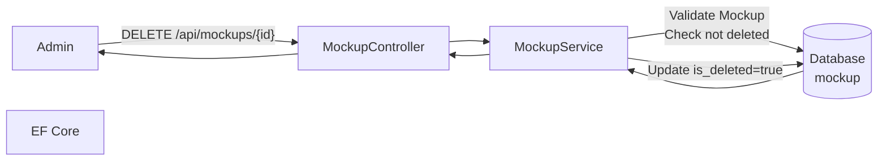
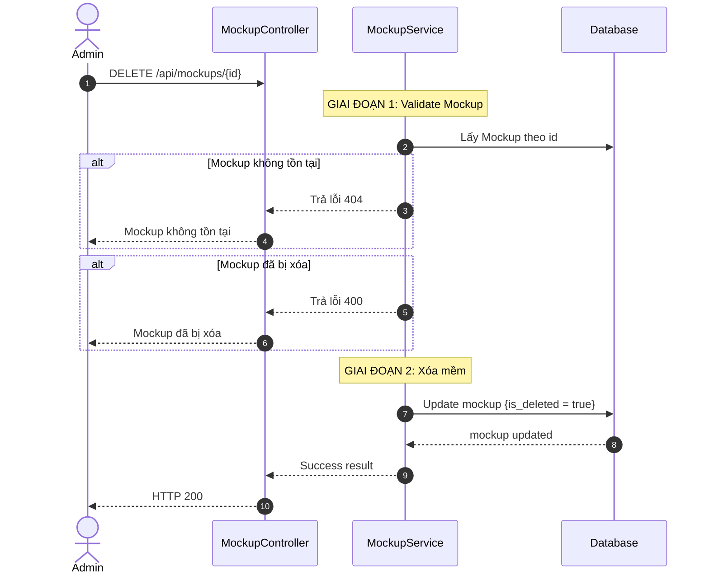
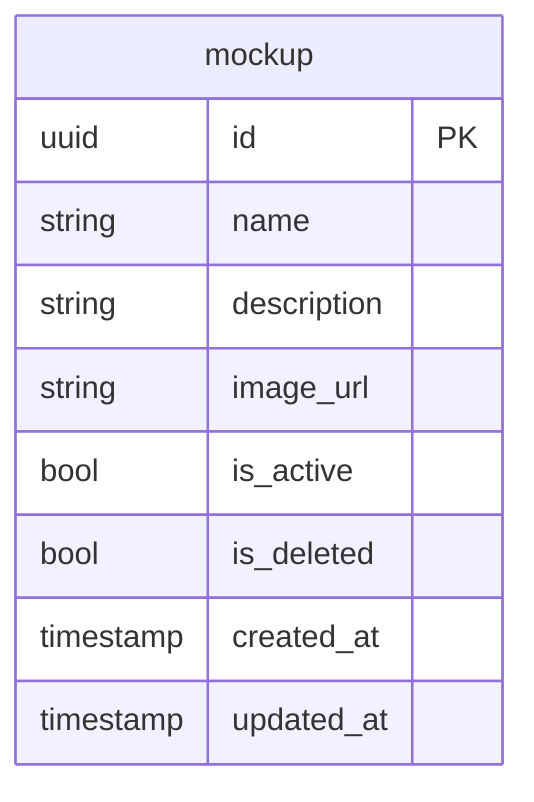

# TDD-015: Xóa Mockup

## Thông tin tài liệu
- **Tiêu đề**: Xóa mềm Mockup khỏi hệ thống
- **Ghi chú**: API cho phép Admin xóa mềm Mockup bằng cách cập nhật `is_deleted = true`. Không xóa vật lý dữ liệu hoặc ảnh.

## Metadata quản trị tài liệu
| Trường | Giá trị |
|---|---|
| Mã tài liệu | TDD-015 |
| Phiên bản | v0.2 |
| Author | Codex |
| Reviewer | |
| Approver | Chưa chỉ định |
| Owner | Nhóm Hoa Theo Mùa |
| Cập nhật gần nhất | 2026-09-04 |

---

## BƯỚC 1 — Thông tin & Bối cảnh

### Thông tin tài liệu
- **Mã tài liệu**: TDD-015
- **Tính năng**: Xóa Mockup
- **Tác giả**: Codex
- **Người review**: 
- **Phiên bản**: v0.2
- **Cập nhật (YYYY-MM-DD)**: 2026-09-04
- **Story liên quan**:
  - STORY-053

### Business Rules
- BR-015-01: Sử dụng xóa mềm với `is_deleted = true`
- BR-015-02: Không xóa vật lý dữ liệu Mockup
- BR-015-03: Không xóa vật lý ảnh Preview
- BR-015-04: Mockup đã xóa không hiển thị trong danh sách mặc định
- BR-015-05: Mockup đã xóa không hiển thị cho khách hàng
- BR-015-06: Mockup đã xóa có thể ở trạng thái Active hoặc Inactive
- BR-015-07: Mockup đã bị xóa (`is_deleted = true`) không thể xóa lại
- BR-015-08: Mockup đã xóa không thể được chọn mới cho Create Flower hoặc Regenerate Flower. Snapshot Mockup trong Flower history vẫn giữ nguyên và được dùng khi Regenerate bỏ trống/null hoặc truyền đúng ID nguồn, không kiểm tra record live.

### Bối cảnh & Mục tiêu

**Vấn đề**
> Admin cần xóa Mockup không còn sử dụng khỏi danh sách quản lý mà không làm mất dữ liệu lịch sử hoặc ảnh.

**Mục tiêu**
- Xóa mềm Mockup bằng `is_deleted = true`
- Không xóa vật lý dữ liệu hoặc ảnh
- Mockup đã xóa không hiển thị cho khách hàng
- Dữ liệu và liên kết với yêu cầu đã tồn tại được giữ nguyên

**Ngoài phạm vi** (Out of scope)
- Khôi phục Mockup đã xóa
- Xóa vật lý Mockup
- Chỉnh sửa Mockup
- Chuyển trạng thái Mockup (TDD-014)

---

## BƯỚC 2 — Kiến trúc & Sơ đồ

### Kiến trúc tổng quan (Architecture)
**Tiêu đề**: Trình tự xóa Mockup
**Mô tả**: Client gọi API xóa Mockup → Controller nhận request → Service validate → Cập nhật is_deleted → Trả kết quả



### Sequence Diagram
**Tiêu đề**: Trình tự xóa Mockup
**Mô tả**: Từng bước gọi qua lại giữa các thành phần



### Activity Diagram

- **Không áp dụng**: Luồng điều kiện đã được thể hiện đầy đủ trong Sequence Diagram và không có nhánh nghiệp vụ phức tạp cần một Activity Diagram riêng.

### State Diagram

- **Không áp dụng**: Endpoint không định nghĩa một state machine riêng cho entity chính.

### Mô hình dữ liệu (Data Model / ERD)
**Tiêu đề**: Bảng Mockup
**Mô tả**: Cấu trúc bảng mockup với xóa mềm



---

## BƯỚC 3 — API

### API Contract nội bộ

#### Endpoint #1: Xóa Mockup
- **Method**: DELETE
- **Endpoint**: `/api/mockups/{id}`
- **Tên endpoint**: Xóa Mockup
- **Mô tả**: Xóa mềm Mockup bằng cách cập nhật is_deleted = true
- **Quyền**: Admin

**Path Parameters:**
| Parameter | Type | Required | Mô tả |
|-----------|------|----------|--------|
| id | uuid | Có | ID của Mockup |

**Ví dụ 1 — Happy path: Xóa Mockup thành công** — HTTP `200`

Request:
```
DELETE /api/mockups/550e8400-e29b-41d4-a716-446655440001
```

Response:
```json
{
  "value": {
    "id": "550e8400-e29b-41d4-a716-446655440001",
    "name": "Mockup Sinh Nhật 1",
    "is_deleted": true,
    "deleted_at": "2026-08-27T11:00:00Z"
  }
}
```

**Ví dụ 2 — Mockup không tồn tại** — HTTP `404`

Request:
```
DELETE /api/mockups/00000000-0000-0000-0000-000000000000
```

Response:
```json
{
  "error": {
    "code": "NOT_FOUND",
    "message": "Mockup không tồn tại."
  }
}
```

**Ví dụ 3 — Mockup đã bị xóa trước đó** — HTTP `400`

Request:
```
DELETE /api/mockups/550e8400-e29b-41d4-a716-446655440099
```

Response:
```json
{
  "error": {
    "code": "BAD_REQUEST",
    "message": "Mockup đã bị xóa trước đó."
  }
}
```

**Ví dụ 4 — Không có quyền** — HTTP `403`

Request:
```
DELETE /api/mockups/550e8400-e29b-41d4-a716-446655440001
```

Response:
```json
{
  "error": {
    "code": "ACCESS_DENIED",
    "message": "Bạn không có quyền thực hiện thao tác này."
  }
}
```

**Ví dụ 5 — Lỗi hệ thống** — HTTP `500`

Request:
```
DELETE /api/mockups/550e8400-e29b-41d4-a716-446655440001
```

Response:
```json
{
  "error": {
    "code": "INTERNAL_SERVER_ERROR",
    "message": "Đã xảy ra lỗi. Vui lòng thử lại sau."
  }
}
```

**Ví dụ 6 — Chưa đăng nhập** — HTTP `401`

Request:
```
DELETE /api/mockups/550e8400-e29b-41d4-a716-446655440001
```

Response:
```json
{
  "error": {
    "code": "UNAUTHORIZED",
    "message": "Bạn cần đăng nhập để thực hiện thao tác này."
  }
}
```

#### Mã lỗi
| Code | HTTP | Khi nào xảy ra |
|---|---|---|
| NOT_FOUND | 404 | Mockup không tồn tại |
| BAD_REQUEST | 400 | Mockup đã bị xóa trước đó |
| ACCESS_DENIED | 403 | Bạn không có quyền xóa Mockup |
| UNAUTHORIZED | 401 | Bạn cần đăng nhập để thực hiện thao tác này |
| INTERNAL_SERVER_ERROR | 500 | Đã xảy ra lỗi khi xóa Mockup. Vui lòng thử lại sau |

### API Contract bên ngoài

- **Endpoints sử dụng**: Không áp dụng; endpoint này không gọi service hoặc API bên thứ ba.
- **Field quan trọng**: Không áp dụng.
- **Xử lý lỗi từ đối tác**: Không áp dụng.
- **Quirks / cạm bẫy**: Không áp dụng.

---

## BƯỚC 4 — Tham chiếu

> Chú thích: 🔴 Tham chiếu đến (tài liệu này đọc/phụ thuộc) · ⚫ Trỏ vào tài liệu này (tài liệu khác phụ thuộc vào tài liệu này) · ⋯ Bị ảnh hưởng (thay đổi ở đây có thể làm tài liệu kia sai theo)

### 🔴 Tham chiếu đến
- Mockup Entity - Bảng mockup trong Database

### ⚫ Trỏ vào tài liệu này
- TDD-012 - Lấy danh sách Mockup
- TDD-013 - Thêm Mockup
- TDD-014 - Chuyển trạng thái Mockup
- AI_Mockup_Context - Tham chiếu context và business rules

### ⋯ Bị ảnh hưởng
- STORY-030 - Mockup đã xóa không hiển thị cho khách hàng
- TDD-016 - Kiểm tra is_deleted trước khi gọi API tạo mẫu hoa AI
