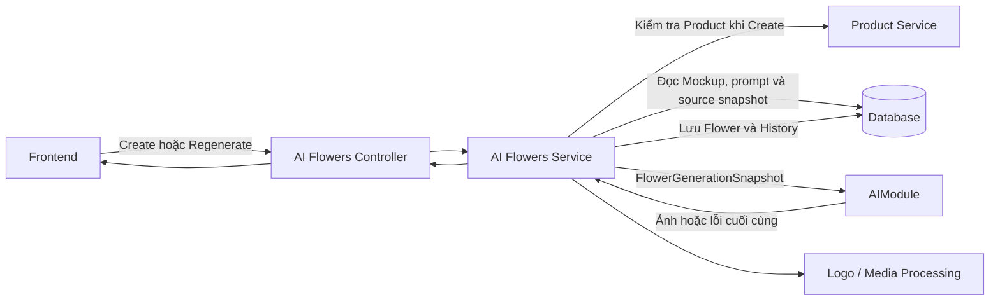
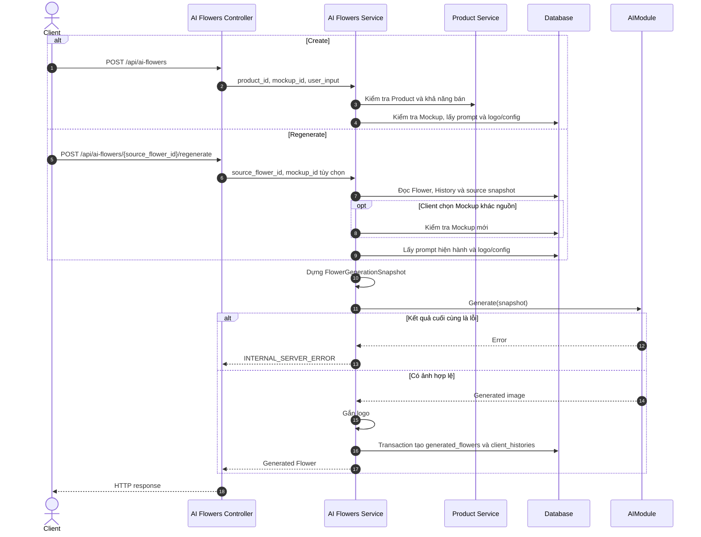
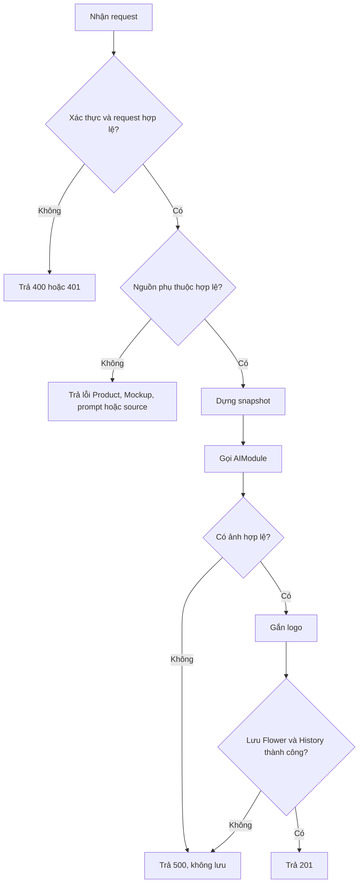
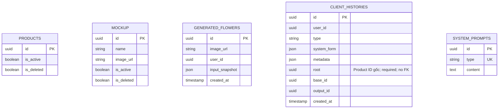

# TDD-016: Tạo và tạo lại mẫu hoa AI

## Thông tin tài liệu

| Trường | Giá trị |
|---|---|
| Mã tài liệu | TDD-016 |
| Tiêu đề | Tạo ảnh mẫu hoa AI và tạo lại từ lịch sử |
| Phiên bản | v1.1 |
| Author | Codex |
| Reviewer | Chưa chỉ định |
| Approver | Chưa chỉ định |
| Owner | Nhóm Hoa Theo Mùa |
| Cập nhật gần nhất | 2026-09-09 |

---

## BƯỚC 1 — Thông tin & Bối cảnh

### Thông tin tài liệu

- **Mã tài liệu**: TDD-016
- **Tính năng**: Tạo mới mẫu hoa AI và tạo lại từ một Flower trong lịch sử.
- **Story liên quan**: STORY-030, STORY-033.
- **Phạm vi API**: `POST /api/ai-flowers` và `POST /api/ai-flowers/{source_flower_id}/regenerate`.

### Business Rules

- **BR-016-01**: Chỉ khách hàng đã đăng nhập và có tài khoản đang hoạt động được sử dụng hai API.
- **BR-016-02**: Create bắt buộc nhận đúng `product_id` của Combo/biến thể được chọn và `mockup_id`. Product được kiểm tra lần lượt: tồn tại, chưa xóa, đang hoạt động và có thể bán.
- **BR-016-03**: Create kiểm tra Mockup lần lượt: tồn tại, chưa xóa và đang hoạt động.
- **BR-016-04**: Create bắt buộc dùng System Prompt hiện hành có `type="flower"` và `content` hợp lệ.
- **BR-016-05**: Nội dung gửi sang `AIModule` được dựng theo thứ tự ưu tiên `Combo > Mockup > note > style` và đóng băng trong `FlowerGenerationSnapshot`.
- **BR-016-06**: `AIModule` là dependency nội bộ. Service nghiệp vụ chỉ gọi module bằng snapshot và nhận kết quả cuối cùng là ảnh hợp lệ hoặc lỗi. Cách module xử lý nội bộ không thuộc TDD này.
- **BR-016-07**: Ảnh kết quả được gắn logo theo cấu hình hiện hành trước khi lưu.
- **BR-016-08**: Thành công phải tạo `generated_flowers` và `client_histories` trong cùng flow; History có `type="flower"`, `base_id=products.id`, `root=base_id`, `output_id=generated_flowers.id`. `root` là UUID bắt buộc, khác `Guid.Empty`, chỉ dùng nội bộ và không có FK.
- **BR-016-09**: `generated_flowers.input_snapshot` lưu dữ liệu thực tế đã dùng: Product/biến thể, toàn bộ `user_input`, Mockup, tham chiếu ảnh Product bất biến, System Prompt, cấu hình logo và `validated_at` UTC.
- **BR-016-10**: `client_histories.metadata` chỉ lưu provenance cần tra cứu; `client_histories.system_form` lưu `{type, content}` và không lưu ID prompt. Không lưu input trong History.
- **BR-016-11**: Nếu `AIModule`, xử lý logo hoặc persistence trả lỗi thì không tạo dở dang Flower/History.
- **BR-016-12**: Không tạo `flower_requests` hoặc `flower_ai_jobs`.
- **BR-016-13**: Regenerate yêu cầu Flower nguồn tồn tại, thuộc user hiện tại và có History `type="flower"` cùng Product lineage/snapshot đầy đủ. History nguồn phải có `base_id` Product hợp lệ và `root=base_id`; thiếu hoặc không nhất quán trả `FLOWER_SOURCE_HISTORY_INVALID`.
- **BR-016-14**: Regenerate chỉ nhận `mockup_id` tùy chọn. Product/biến thể, ảnh Product và toàn bộ `user_input` lấy từ snapshot nguồn; ảnh kết quả của Flower nguồn không được dùng làm input ảnh.
- **BR-016-15**: Regenerate bỏ `mockup_id`, truyền `null` hoặc đúng ID Mockup nguồn thì dùng snapshot Mockup nguồn mà không kiểm tra dữ liệu live. Chỉ ID khác nguồn được kiểm tra theo `not found → deleted → inactive`.
- **BR-016-16**: Regenerate ưu tiên System Prompt `flower` hiện hành. Nếu không có prompt hiện hành hợp lệ thì dùng `system_form` của History nguồn; nếu cả hai đều không dùng được thì trả `FLOWER_SOURCE_HISTORY_INVALID`.
- **BR-016-17**: Regenerate dùng logo/config hiện hành và tạo snapshot mới từ dữ liệu nguồn, Effective Mockup, prompt thực tế và logo/config thực tế.
- **BR-016-18**: History mới kế thừa `base_id` của History nguồn và gán `root=base_id`; `metadata.regenerated_from_flower_id` là ID Flower trực tiếp được chọn. Không gán ID Flower nguồn vào `base_id` hoặc `root`. Chuỗi F1 → F2 → F3 giữ cùng Product `base_id/root`, nhưng parent trực tiếp lần lượt là F1 và F2.
- **BR-016-19**: Generated Flower đã tạo thành công vẫn có thể được dùng cho flow tạo Card. Việc kiểm tra Product live khi Checkout/Order thuộc tài liệu của các flow đó.

### Bối cảnh & Mục tiêu

**Vấn đề**

Khách hàng cần nhận ảnh mẫu hoa từ Combo, Mockup và nhu cầu cá nhân trong một request; đồng thời có thể tạo lại một kết quả trong lịch sử và chỉ thay Mockup.

**Mục tiêu**

- Giữ hai API đồng bộ, không sinh request/job trung gian.
- Phân định rõ validation của service nghiệp vụ và contract cuối cùng với `AIModule`.
- Lưu đủ snapshot/provenance để tái tạo và truy vết kết quả.
- Trình bày đầy đủ request, response và mã lỗi của từng nhánh nghiệp vụ.

**Ngoài phạm vi**

- Cách `AIModule` giao tiếp với nhà cung cấp hoặc xử lý lỗi nội bộ.
- CRUD Mockup; xem TDD-012 đến TDD-015.
- Checkout, Order, thanh toán và tồn kho tại thời điểm đặt hàng.

---

## BƯỚC 2 — Kiến trúc & Sơ đồ

### Kiến trúc tổng quan

**Mô tả**: Service xác thực dữ liệu, dựng snapshot, gọi `AIModule`, xử lý logo và chỉ lưu khi đã có kết quả cuối cùng hợp lệ.



**Ghi chú**: Codebase hiện chưa có controller/service/DTO cho hai route này. Tên `AIModule` là tên dependency khái niệm đã dùng trong context, không khẳng định tên class hoặc transport khi triển khai.

### Sequence Diagram



### Activity Diagram



### State Diagram

Không áp dụng. Hệ thống không tạo entity request/job có vòng đời trạng thái; Flower chỉ xuất hiện sau khi hoàn tất thành công.

### Mô hình dữ liệu (ERD)

**Mô tả**: Sơ đồ chỉ liệt kê các entity và field liên quan. Theo yêu cầu tài liệu, không biểu diễn dây nối quan hệ; liên kết đa hình được mô tả bằng ghi chú bên dưới.



- Với `type="flower"`, `base_id` là Product nguồn, `root=base_id` và `output_id` là Generated Flower. Nếu Product được chọn là biến thể thì hai cột cùng lưu đúng ID biến thể.
- `root` do service gán, không có quan hệ database và không xuất hiện trong response API.
- Mockup và System Prompt được snapshot; không tạo FK riêng từ Flower.

---

## BƯỚC 3 — API

### Quy ước response

Response thành công dùng envelope hiện hành của hệ thống:

| Field | Kiểu | Mô tả |
|---|---|---|
| `isSuccess` | boolean | `true` khi request hoàn tất thành công. |
| `isFailed` | boolean | `false` khi thành công. |
| `error` | object/null | `null` khi thành công. |
| `traceId` | string | Mã truy vết request do backend sinh. |
| `timestampUtc` | datetime UTC | Thời điểm backend tạo response. |
| `value` | object | Generated Flower vừa tạo. |
| `value.id` | uuid | ID của `generated_flowers`. |
| `value.image_url` | string URL | Ảnh kết quả đã xử lý logo và được lưu. |
| `value.user_id` | uuid | ID user sở hữu kết quả. |
| `value.created_at` | datetime UTC | Thời điểm tạo kết quả. |

Response lỗi dùng các field `title`, `status`, `detail`, `messageCode`, `errors`, `traceId`, `timestampUtc`. `messageCode` là mã ổn định để FE xử lý; `detail` là mô tả cho người đọc/người dùng.

### Endpoint #1 — Tạo mẫu hoa AI

- **Method**: `POST`
- **Route**: `/api/ai-flowers`
- **Thành công**: HTTP `201`

#### Request fields

| Field | Kiểu | Bắt buộc | Mô tả |
|---|---|---:|---|
| `product_id` | uuid | Có | ID chính xác của Combo hoặc biến thể được người dùng chọn. |
| `mockup_id` | uuid | Có | ID Mockup dùng làm bố cục/tham chiếu. |
| `user_input` | object | Có | Nhóm dữ liệu form mà FE gửi để cá nhân hóa mẫu hoa. |
| `user_input.name` | string/null | Theo form FE | Tên/yêu cầu chính của mẫu hoa. Context hiện chưa chốt giới hạn độ dài hoặc quy tắc rỗng. |
| `user_input.occasion` | string/null | Theo form FE | Dịp sử dụng do FE gửi. Context hiện chưa chốt enum phía backend. |
| `user_input.style` | string/null | Theo form FE | Phong cách do FE gửi; được dùng sau Combo, Mockup và note trong thứ tự dựng prompt. Context hiện chưa chốt enum phía backend. |
| `user_input.budget` | number/null | Theo form FE | Ngân sách người dùng nhập. Context hiện chưa chốt min/max hoặc đơn vị validation phía backend. |
| `user_input.note` | string/null | Theo form FE | Yêu cầu bổ sung. Context hiện chưa chốt giới hạn độ dài phía backend. |

#### Request/response mẫu

**C01 — Thành công**

Request:

```json
{
  "product_id": "550e8400-e29b-41d4-a716-446655440001",
  "mockup_id": "550e8400-e29b-41d4-a716-446655440002",
  "user_input": {
    "name": "Bó hoa sinh nhật mẹ",
    "occasion": "sinh_nhat",
    "style": "dang_cap",
    "budget": 500000,
    "note": "Ưa thích hoa hồng và hoa lan"
  }
}
```

Response — HTTP `201`:

```json
{
  "isSuccess": true,
  "isFailed": false,
  "error": null,
  "traceId": "00-...",
  "timestampUtc": "2026-09-08T10:35:00Z",
  "value": {
    "id": "880e8400-e29b-41d4-a716-446655440005",
    "image_url": "https://storage.example.com/flowers/880e8400.png",
    "user_id": "770e8400-e29b-41d4-a716-446655440004",
    "created_at": "2026-09-08T10:35:00Z"
  }
}
```

#### Các tình huống lỗi

Mỗi hàng dưới đây là một cặp request/response hoàn chỉnh. “Như C01” nghĩa là giữ nguyên toàn bộ body C01 và chỉ thay đổi điều kiện được nêu trong cột Request.

| ID | Request | Response |
|---|---|---|
| C02 | Không có token; body như C01. | HTTP `401`, `messageCode=UNAUTHORIZED`. |
| C03 | Body như C01 nhưng bỏ `product_id`. | HTTP `400`, `messageCode=VALIDATION_ERROR`, lỗi field `product_id`. |
| C04 | Body như C01 nhưng bỏ `mockup_id`. | HTTP `400`, `messageCode=VALIDATION_ERROR`, lỗi field `mockup_id`. |
| C05 | Body không phải JSON object hoặc một field có kiểu dữ liệu không khớp contract. Không đặt thêm giới hạn nội dung vì context chưa chốt. | HTTP `400`, `messageCode=VALIDATION_ERROR`, `errors` chỉ rõ field sai. |
| C06 | Body như C01 nhưng `product_id` không có trong DB. | HTTP `404`, `messageCode=PRODUCT_NOT_FOUND`. |
| C07 | Body như C01 nhưng Product đã soft-delete. | HTTP `410`, `messageCode=PRODUCT_DELETED`. |
| C08 | Body như C01 nhưng Product chưa xóa và inactive. | HTTP `409`, `messageCode=PRODUCT_INACTIVE`. |
| C09 | Body như C01 nhưng Product có `sellableQuantity=0`. | HTTP `409`, `messageCode=PRODUCT_OUT_OF_STOCK`. |
| C10 | Body như C01 nhưng kết quả khả dụng là `no_formula`. Đại diện cả `no_core` vì cùng kết quả API. | HTTP `422`, `messageCode=PRODUCT_NOT_SELLABLE`. |
| C11 | Body như C01 nhưng không xác minh được khả năng bán của Product. | HTTP `503`, `messageCode=PRODUCT_AVAILABILITY_UNAVAILABLE`. |
| C12 | Body như C01 nhưng `mockup_id` không tồn tại. | HTTP `404`, `messageCode=MOCKUP_NOT_FOUND`. |
| C13 | Body như C01 nhưng Mockup đã soft-delete. | HTTP `410`, `messageCode=MOCKUP_DELETED`. |
| C14 | Body như C01 nhưng Mockup chưa xóa và inactive. | HTTP `409`, `messageCode=MOCKUP_INACTIVE`. |
| C15 | Body như C01 nhưng không có prompt `flower` hiện hành hợp lệ. | HTTP `409`, `messageCode=SYSTEM_PROMPT_INVALID`. |
| C16 | Body hợp lệ như C01; `AIModule`, bước gắn logo hoặc transaction lưu dữ liệu trả lỗi cuối cùng. | HTTP `500`, `messageCode=INTERNAL_SERVER_ERROR`; không có Flower/History mới. |

Response lỗi mẫu cho C12:

```json
{
  "title": "Not Found",
  "status": 404,
  "detail": "Không tìm thấy Mockup nguồn.",
  "messageCode": "MOCKUP_NOT_FOUND",
  "errors": null,
  "traceId": "00-...",
  "timestampUtc": "2026-09-08T10:35:00Z"
}
```

Các hàng khác giữ cùng envelope và thay `status`, `detail`, `messageCode`, `errors` theo bảng.

### Endpoint #2 — Tạo lại mẫu hoa từ lịch sử

- **Method**: `POST`
- **Route**: `/api/ai-flowers/{source_flower_id}/regenerate`
- **Thành công**: HTTP `201`

#### Path và request fields

| Field | Vị trí | Kiểu | Bắt buộc | Mô tả |
|---|---|---|---:|---|
| `source_flower_id` | path | uuid | Có | ID `generated_flowers` được chọn từ History; không phải History ID. |
| `mockup_id` | body | uuid/null | Không | Bỏ field, `null` hoặc bằng Mockup nguồn: dùng snapshot nguồn. UUID khác: chọn Mockup mới và kiểm tra live. |

Body không được chứa field khác. Product và `user_input` luôn lấy từ source snapshot.

#### Request/response mẫu

**R01 — Thành công, dùng Mockup nguồn**

Request:

```http
POST /api/ai-flowers/880e8400-e29b-41d4-a716-446655440005/regenerate
Content-Type: application/json

{}
```

Response — HTTP `201`:

```json
{
  "isSuccess": true,
  "isFailed": false,
  "error": null,
  "traceId": "00-...",
  "timestampUtc": "2026-09-08T11:00:00Z",
  "value": {
    "id": "990e8400-e29b-41d4-a716-446655440006",
    "image_url": "https://storage.example.com/flowers/990e8400.png",
    "user_id": "770e8400-e29b-41d4-a716-446655440004",
    "created_at": "2026-09-08T11:00:00Z"
  }
}
```

**R02 — Thành công, chọn Mockup mới**

Request:

```http
POST /api/ai-flowers/880e8400-e29b-41d4-a716-446655440005/regenerate
Content-Type: application/json

{
  "mockup_id": "660e8400-e29b-41d4-a716-446655440003"
}
```

Response — HTTP `201`: cùng schema R01; `value.id`, `value.image_url`, `value.created_at` là dữ liệu mới. Snapshot lưu Mockup `660e8400-e29b-41d4-a716-446655440003`.

#### Các tình huống lỗi

Mỗi hàng là một cặp request/response. “Như R01” nghĩa là cùng path/body R01 và chỉ thay điều kiện nêu trong cột Request.

| ID | Request | Response |
|---|---|---|
| R03 | Không có token; request như R01. | HTTP `401`, `messageCode=UNAUTHORIZED`. |
| R04 | Path chứa `source_flower_id` không tồn tại; body `{}`. | HTTP `404`, `messageCode=FLOWER_SOURCE_NOT_FOUND`. |
| R05 | Path là Flower tồn tại nhưng thuộc user khác; body `{}`. | HTTP `403`, `messageCode=ACCESS_DENIED`. |
| R06 | Request như R01 nhưng source thiếu History, Product lineage, `base_id/root` hợp lệ hoặc snapshot bắt buộc. | HTTP `409`, `messageCode=FLOWER_SOURCE_HISTORY_INVALID`. |
| R07 | Body chứa thêm `product_id` hoặc `user_input`. Đại diện mọi field ngoài allowlist `mockup_id`. | HTTP `400`, `messageCode=VALIDATION_ERROR`. |
| R08 | Body có `mockup_id` khác nguồn nhưng ID không tồn tại. | HTTP `404`, `messageCode=MOCKUP_NOT_FOUND`. |
| R09 | Body có `mockup_id` khác nguồn và Mockup đã soft-delete. | HTTP `410`, `messageCode=MOCKUP_DELETED`. |
| R10 | Body có `mockup_id` khác nguồn, chưa xóa nhưng inactive. | HTTP `409`, `messageCode=MOCKUP_INACTIVE`. |
| R11 | Request như R01; prompt hiện hành không dùng được và `system_form` nguồn cũng thiếu/rỗng. | HTTP `409`, `messageCode=FLOWER_SOURCE_HISTORY_INVALID`. |
| R12 | Request hợp lệ như R01; `AIModule`, bước gắn logo hoặc transaction lưu dữ liệu trả lỗi cuối cùng. | HTTP `500`, `messageCode=INTERNAL_SERVER_ERROR`; source không đổi và không có Flower/History mới. |

Response lỗi mẫu cho R06:

```json
{
  "title": "Conflict",
  "status": 409,
  "detail": "Mẫu hoa nguồn không có lịch sử, Product gốc hoặc snapshot đầy đủ để tạo lại.",
  "messageCode": "FLOWER_SOURCE_HISTORY_INVALID",
  "errors": null,
  "traceId": "00-...",
  "timestampUtc": "2026-09-08T11:00:00Z"
}
```

### Danh mục mã lỗi

| STT | Code | HTTP | Áp dụng | Khi nào xảy ra |
|:---:|---|---:|---|---|
| 1 | `VALIDATION_ERROR` | 400 | Create/Regenerate | Body, kiểu dữ liệu, field bắt buộc hoặc allowlist không hợp lệ. |
| 2 | `UNAUTHORIZED` | 401 | Create/Regenerate | Chưa đăng nhập hoặc tài khoản không hoạt động. |
| 3 | `PRODUCT_NOT_FOUND` | 404 | Create | Không có Product theo ID. |
| 4 | `PRODUCT_DELETED` | 410 | Create | Product đã soft-delete. |
| 5 | `PRODUCT_INACTIVE` | 409 | Create | Product chưa xóa nhưng inactive. |
| 6 | `PRODUCT_OUT_OF_STOCK` | 409 | Create | Product hợp lệ nhưng lượng có thể bán bằng 0. |
| 7 | `PRODUCT_NOT_SELLABLE` | 422 | Create | Product không có formula hoặc CORE usable. |
| 8 | `PRODUCT_AVAILABILITY_UNAVAILABLE` | 503 | Create | Không tính/xác minh được khả năng bán. |
| 9 | `MOCKUP_NOT_FOUND` | 404 | Create/Mockup mới | Không có Mockup theo ID. |
| 10 | `MOCKUP_DELETED` | 410 | Create/Mockup mới | Mockup đã soft-delete. |
| 11 | `MOCKUP_INACTIVE` | 409 | Create/Mockup mới | Mockup chưa xóa nhưng inactive. |
| 12 | `SYSTEM_PROMPT_INVALID` | 409 | Create | Prompt `flower` hiện hành thiếu/rỗng/không hợp lệ. |
| 13 | `FLOWER_SOURCE_NOT_FOUND` | 404 | Regenerate | Flower nguồn không tồn tại. |
| 14 | `ACCESS_DENIED` | 403 | Regenerate | Flower nguồn không thuộc user hiện tại. |
| 15 | `FLOWER_SOURCE_HISTORY_INVALID` | 409 | Regenerate | History, Product lineage, `base_id/root`, snapshot hoặc prompt nguồn bắt buộc không dùng được. |
| 16 | `INTERNAL_SERVER_ERROR` | 500 | Create/Regenerate | Dependency tạo ảnh, xử lý logo hoặc persistence trả lỗi cuối cùng. |

### Contract với AIModule

- Service truyền một `FlowerGenerationSnapshot` bất biến chứa Product, Effective Mockup, `user_input`, tham chiếu ảnh Product, prompt và cấu hình cần dùng.
- Module trả ảnh hợp lệ hoặc lỗi cuối cùng. Service không diễn giải các bước nội bộ của module.
- Regenerate không truyền ảnh output của Flower nguồn làm input.
- Nhà cung cấp, endpoint, credential và transport cụ thể chưa có trong codebase nên không được quy định tại TDD này.

---

## BƯỚC 4 — Tham chiếu

### 🔴 Tham chiếu đến

- `AI_Flower_Context.md` — quy tắc tổng thể của AI Flower và các chính sách vận hành thuộc AI Module.
- `AI_DB_Diagram.md`, `AI_CUSTOMIZE_DB.dbdiagram` — schema `generated_flowers`, `client_histories`, `mockup`, `system_prompts`.
- TDD-012 đến TDD-015 — CRUD và trạng thái Mockup.
- Product Entity/Core Database — Product/biến thể và phép tính khả năng bán.
- `ApiResponseFactory`, `GlobalExceptionHandlerMiddleware` — response envelope hiện hành.

### ⚫ Trỏ vào tài liệu này

- TDD-006 và TDD-007 — có thể dùng Generated Flower làm nguồn tạo Card.

### ⋯ Bị ảnh hưởng

- Flow Checkout/Order — resolve và kiểm tra Product gốc khi khách hàng đặt hàng.
- Implementation AI Flowers — controller, service, DTO và persistence chưa có trong codebase hiện tại.
