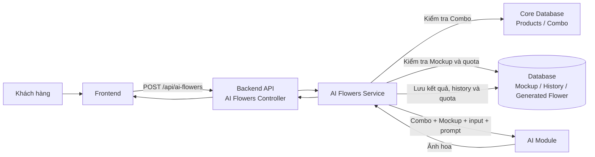
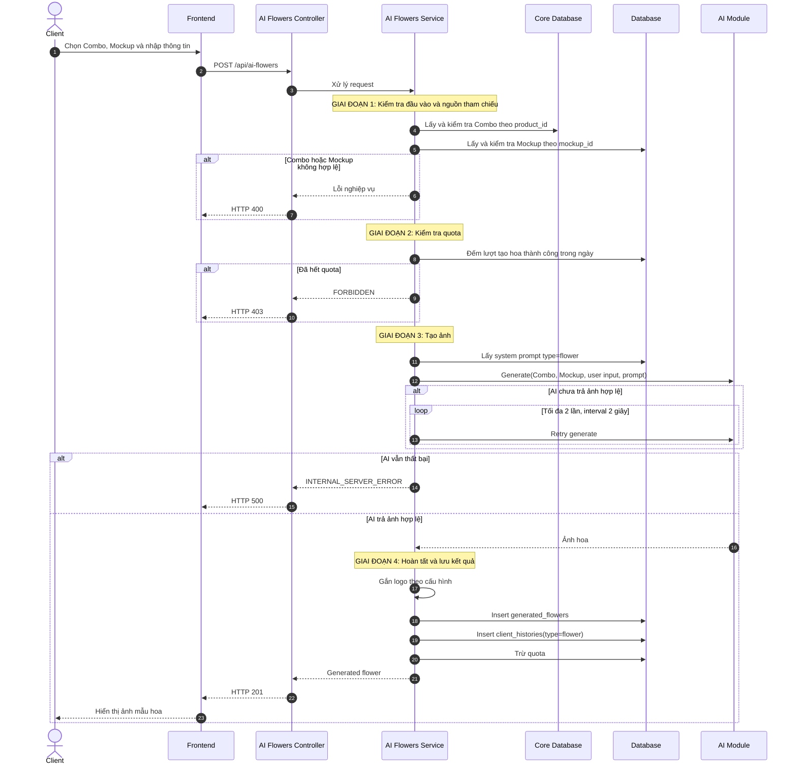
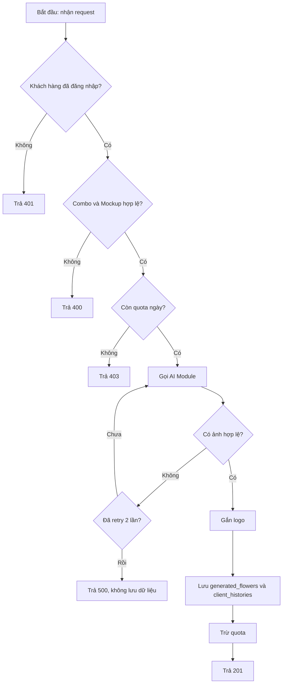
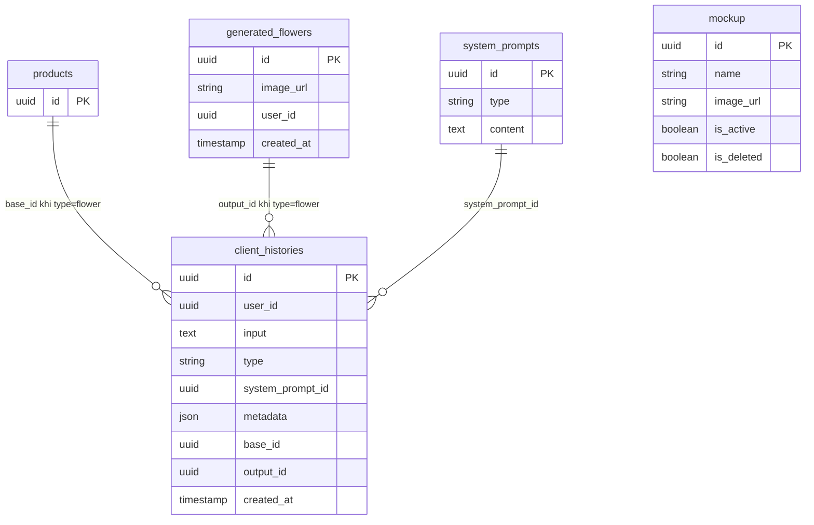

# TDD-030: Tạo mẫu hoa AI

## Thông tin tài liệu

- **Tiêu đề**: Tạo ảnh mẫu hoa AI từ Combo và Mockup trong một request đồng bộ
- **Ghi chú**: STORY-030 và STORY-033 cùng mô tả một API. Khách hàng gửi thông tin form, Combo và Mockup; hệ thống gọi AI, xử lý ảnh kết quả và chỉ lưu history khi tạo thành công.

## Metadata quản trị tài liệu

| Trường | Giá trị |
|---|---|
| Mã tài liệu | TDD-030 |
| Phiên bản | v0.3 |
| Author | Chưa chỉ định |
| Reviewer | Chưa chỉ định |
| Approver | Chưa chỉ định |
| Owner | Chưa chỉ định |
| Cập nhật gần nhất | 2026-08-28 |

---

## BƯỚC 1 — Thông tin & Bối cảnh

### Thông tin tài liệu

- **Mã tài liệu**: TDD-030
- **Tính năng**: Tạo mẫu hoa AI
- **Tác giả**: Chưa chỉ định
- **Người review**: Chưa chỉ định
- **Phiên bản**: v0.3
- **Cập nhật (YYYY-MM-DD)**: 2026-08-28
- **Story liên quan**:
  - STORY-030 — nhận dữ liệu tạo mẫu hoa.
  - STORY-033 — tạo và trả ảnh hoa bằng AI.

### Business Rules

- **BR-030-01**: Chỉ khách hàng đã đăng nhập, có tài khoản đang hoạt động mới được gọi API.
- **BR-030-02**: `product_id` bắt buộc và phải xác định một Combo còn khả dụng trong Core Database.
- **BR-030-03**: `mockup_id` bắt buộc; Mockup phải có `is_active = true` và `is_deleted = false` tại thời điểm gọi API.
- **BR-030-04**: Kiểm tra quota tối đa 3 lượt tạo hoa mỗi ngày cho mỗi khách hàng trước khi gọi AI.
- **BR-030-05**: Prompt AI ưu tiên theo thứ tự `Combo > Mockup > Ghi chú/Yêu cầu thêm > Phong cách`.
- **BR-030-06**: AI Module retry tối đa 2 lần với interval 2 giây khi chưa tạo được ảnh hợp lệ.
- **BR-030-07**: Chỉ trừ quota sau khi AI trả ảnh hợp lệ và ảnh đã được xử lý thành công.
- **BR-030-08**: Ảnh kết quả được gắn logo theo cấu hình trước khi lưu.
- **BR-030-09**: Khi thành công, tạo `generated_flowers` và `client_histories` trong cùng flow; `client_histories.type = "flower"`, `base_id = products.id`, `output_id = generated_flowers.id`.
- **BR-030-10**: `client_histories.input` lưu JSON request gốc; `metadata` lưu snapshot Mockup đã sử dụng.
- **BR-030-11**: Khi AI thất bại sau retry, không tạo `generated_flowers` hay `client_histories` và quota không bị trừ.
- **BR-030-12**: Không tạo hoặc lưu `flower_requests` và `flower_ai_jobs`.

### Bối cảnh & Mục tiêu

**Vấn đề**

> Khách hàng cần xem ngay ảnh mẫu hoa AI từ Combo, Mockup và nhu cầu đã nhập. Việc tách luồng thành một yêu cầu nháp rồi một AI Job không còn phù hợp: dữ liệu input chỉ phục vụ lần gọi AI, không cần có vòng đời lưu trữ riêng.

**Mục tiêu**

- Nhận toàn bộ dữ liệu tạo hoa qua một endpoint `POST /api/ai-flowers`.
- Xác thực Combo, Mockup và quota trước khi gọi AI.
- Tạo ảnh có retry, gắn logo và trả kết quả trong cùng request.
- Lưu kết quả thành công và history để phục vụ các flow sau, như tạo thiệp từ bó hoa AI.
- Không lưu request nháp, queue hoặc AI Job trung gian.

**Ngoài phạm vi**

- Cách AI Module tạo ảnh nội bộ và nhà cung cấp AI cụ thể.
- Quản lý Mockup CRUD; xem TDD-050 đến TDD-053.
- Lấy danh sách Combo, tồn kho, Checkout, tạo Order và thanh toán.
- API tạo lại theo request id; muốn tạo lại, client gửi một `POST /api/ai-flowers` mới.

---

## BƯỚC 2 — Kiến trúc & Sơ đồ

### Kiến trúc tổng quan (Architecture)

**Tiêu đề**: Trình tự tạo mẫu hoa AI đồng bộ

**Mô tả**: Frontend gửi một request tới API. Service xác thực Combo từ Core Database, Mockup và quota từ Database, sau đó gọi AI Module. Chỉ khi có ảnh hợp lệ, service mới gắn logo, lưu kết quả cùng history và trừ quota.



**Ghi chú**: Chưa có controller, service hay DTO cho API này trong codebase. Tên thành phần trong sơ đồ là thiết kế mục tiêu; implementation phải dùng response envelope `ApiResponseFactory` đang có của hệ thống.

### Sequence Diagram

**Tiêu đề**: Trình tự kiểm tra, tạo ảnh và lưu kết quả

**Mô tả**: Luồng mô tả một lần gọi API duy nhất, bao gồm các nhánh dữ liệu không hợp lệ, hết quota và AI thất bại sau retry.



**Ghi chú**: Không có bước tạo request nháp, kiểm tra job đang chạy hay cập nhật trạng thái job.

### Activity Diagram

**Tiêu đề**: Quyết định tạo mẫu hoa AI

**Mô tả**: Thể hiện các điều kiện dừng trước khi gọi AI và điều kiện lưu dữ liệu sau khi AI hoàn thành.



### State Diagram

**Tiêu đề**: Không áp dụng

**Mô tả**: Không có entity tạo hoa có vòng đời trạng thái. API không tạo bản nháp, request hay AI Job; `generated_flowers` chỉ được tạo sau khi đã có kết quả thành công.

### Mô hình dữ liệu (Data Model / ERD)

**Tiêu đề**: Dữ liệu lưu khi tạo mẫu hoa thành công

**Mô tả**: `client_histories` giữ quan hệ đa hình giữa Combo nguồn và ảnh hoa kết quả. Mockup được snapshot trong `metadata`, không có FK riêng trong flow này.



---

## BƯỚC 3 — API

### API Contract nội bộ

> API chưa được implement trong codebase. Contract dưới đây là contract thiết kế đã được chốt trong AI Flower Context; DTO/controller khi triển khai phải giữ đúng route, ràng buộc và response envelope của hệ thống.

#### Endpoint #1

- **Method**: POST
- **Endpoint**: `/api/ai-flowers`
- **Tên endpoint**: Tạo mẫu hoa AI
- **Mô tả**: Nhận Combo, Mockup và dữ liệu người dùng nhập; tạo và trả về một ảnh mẫu hoa AI trong cùng request.

**Ví dụ 1 — Tạo mẫu hoa thành công** — HTTP `201`

Request:

```json
POST /api/ai-flowers
{
  "product_id": "550e8400-e29b-41d4-a716-446655440001",
  "mockup_id": "550e8400-e29b-41d4-a716-446655440002",
  "user_input": {
    "name": "Bó hoa sinh nhật mẹ",
    "occasion": "sinh_nhat",
    "style": "dang_cap",
    "budget": 500000,
    "note": "Ưa thích hoa hồng và hoa lan"
  }
}
```

Response:

```json
{
  "isSuccess": true,
  "isFailed": false,
  "error": null,
  "traceId": "00-...",
  "timestampUtc": "2026-08-28T10:35:00Z",
  "value": {
    "id": "880e8400-e29b-41d4-a716-446655440005",
    "image_url": "https://storage.example.com/flowers/880e8400.png",
    "user_id": "770e8400-e29b-41d4-a716-446655440004",
    "created_at": "2026-08-28T10:35:00Z"
  }
}
```

Error: Không áp dụng.

**Ví dụ 2 — Combo hoặc Mockup không hợp lệ** — HTTP `400`

Request:

```json
POST /api/ai-flowers
{
  "product_id": "00000000-0000-0000-0000-000000000000",
  "mockup_id": "550e8400-e29b-41d4-a716-446655440002",
  "user_input": { "name": "Bó hoa sinh nhật" }
}
```

Response:

```json
{
  "title": "Bad Request",
  "status": 400,
  "detail": "Combo không tồn tại hoặc không còn khả dụng.",
  "messageCode": "BAD_REQUEST",
  "errors": null,
  "traceId": "00-...",
  "timestampUtc": "2026-08-28T10:35:00Z"
}
```

**Ví dụ 3 — Hết quota tạo hoa trong ngày** — HTTP `403`

Request:

```json
POST /api/ai-flowers
{
  "product_id": "550e8400-e29b-41d4-a716-446655440001",
  "mockup_id": "550e8400-e29b-41d4-a716-446655440002",
  "user_input": { "name": "Bó hoa sinh nhật" }
}
```

Response:

```json
{
  "title": "Forbidden",
  "status": 403,
  "detail": "Bạn đã sử dụng hết 3 lượt tạo mẫu hoa AI trong ngày.",
  "messageCode": "FORBIDDEN",
  "errors": null,
  "traceId": "00-...",
  "timestampUtc": "2026-08-28T10:35:00Z"
}
```

**Ví dụ 4 — AI thất bại sau retry** — HTTP `500`

Request:

```json
POST /api/ai-flowers
{
  "product_id": "550e8400-e29b-41d4-a716-446655440001",
  "mockup_id": "550e8400-e29b-41d4-a716-446655440002",
  "user_input": { "name": "Bó hoa sinh nhật" }
}
```

Response:

```json
{
  "title": "Internal Server Error",
  "status": 500,
  "detail": "An unexpected error occurred.",
  "messageCode": "INTERNAL_SERVER_ERROR",
  "errors": null,
  "traceId": "00-...",
  "timestampUtc": "2026-08-28T10:35:00Z"
}
```

#### Mã lỗi

| Code | HTTP | Khi nào xảy ra |
|---|---:|---|
| `VALIDATION_ERROR` | 400 | Thiếu `product_id`, `mockup_id` hoặc dữ liệu người dùng nhập không hợp lệ |
| `BAD_REQUEST` | 400 | Combo không tồn tại/không khả dụng, hoặc Mockup không active/đã soft-delete |
| `UNAUTHORIZED` | 401 | Người dùng chưa đăng nhập hoặc tài khoản không còn hoạt động |
| `FORBIDDEN` | 403 | Khách hàng đã dùng hết 3 lượt tạo mẫu hoa trong ngày |
| `INTERNAL_SERVER_ERROR` | 500 | AI vẫn không trả ảnh hợp lệ sau hai lần retry |

### API Contract bên ngoài

- **Endpoints sử dụng**: Không áp dụng ở mức TDD này; AI Module là module nội bộ và nhà cung cấp AI chưa được xác định trong codebase.
- **Field quan trọng**: AI Module nhận Combo, Mockup, dữ liệu người dùng nhập và `system_prompts.content` với `type = "flower"`; kết quả cần có ảnh hợp lệ.
- **Xử lý lỗi từ đối tác**: Khi AI Module báo thất bại hoặc không trả ảnh hợp lệ, retry tối đa 2 lần; sau đó trả lỗi 500, không tạo history và không trừ quota.
- **Quirks / cạm bẫy**: Không được lưu input bằng bảng request/job riêng. Chỉ `client_histories.input` của lần thành công mới lưu JSON request gốc.

---

## BƯỚC 4 — Tham chiếu

> Chú thích: 🔴 Tham chiếu đến (tài liệu này đọc/phụ thuộc) · ⚫ Trỏ vào tài liệu này (tài liệu khác phụ thuộc vào tài liệu này) · ⋯ Bị ảnh hưởng (thay đổi ở đây có thể làm tài liệu kia sai theo)

### 🔴 Tham chiếu đến

- AI Flower Context — flow, quota, prompt priority và nguyên tắc lưu dữ liệu.
- AI Customize DB Diagram — `generated_flowers`, `client_histories`, `mockup`, `system_prompts`.
- TDD-050, TDD-051, TDD-052, TDD-053 — quản lý và điều kiện khả dụng của Mockup.
- Product Entity/Core Database — lấy và kiểm tra Combo nguồn.
- `ApiResponseFactory` và `GlobalExceptionHandlerMiddleware` — response envelope thành công/lỗi của hệ thống.

### ⚫ Trỏ vào tài liệu này

- TDD-035 — tạo thiệp AI có thể dùng ảnh từ `generated_flowers` làm nguồn.
- TDD-036 — tạo lại thiệp từ history có thể dùng `generated_flowers` làm `base_id`.
- ST-030-01-01, ST-033-01-01, ST-033-08-01 — các system test liên quan.
- UT-030-01 đến UT-030-09 — các Unit Test Case của TDD-030.

### ⋯ Bị ảnh hưởng

- AI Flower Context — route, quota, persistence và contract cần đồng bộ với TDD này.
- AI Customize DB Diagram — nếu thay đổi cách lưu lịch sử hoặc quan hệ Combo–Flower.
- Flow Checkout/Order của STORY-038 và STORY-039 — sử dụng kết quả hoa AI sau khi tạo thành công.
