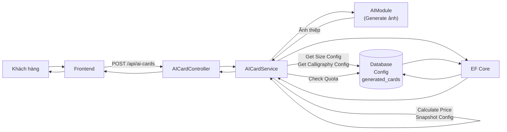
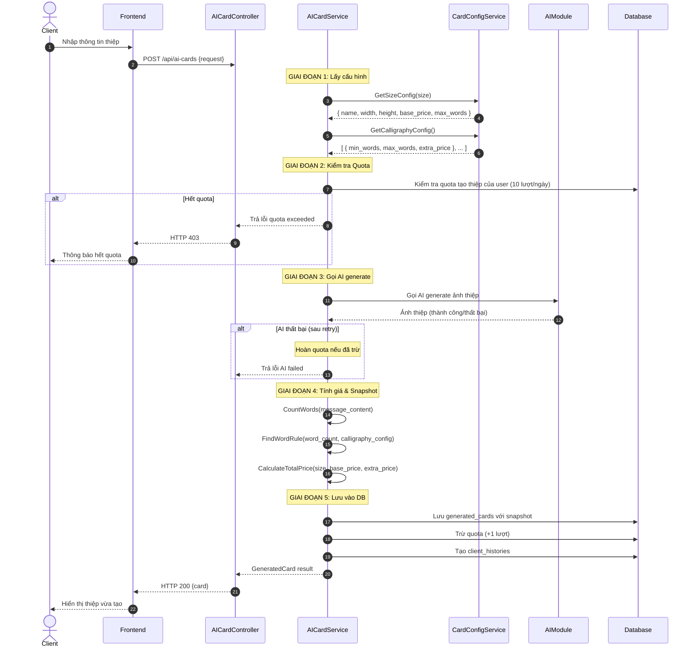
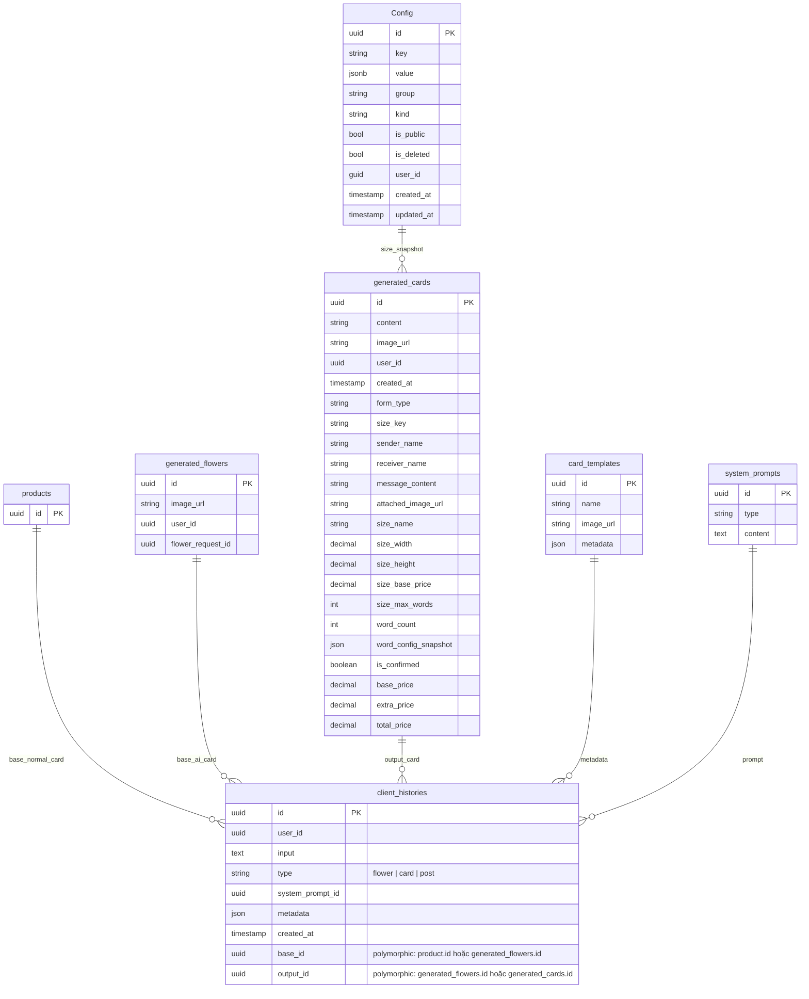

# TDD-035: Tạo thiệp thiết kế AI

## Thông tin tài liệu
- **Tiêu đề**: Tạo thiệp thiết kế AI cho khách hàng
- **Ghi chú**: API cho phép khách hàng tạo thiệp thiết kế mới với thông tin cá nhân hóa (người gửi, người nhận, lời chúc) và hình thức (gõ máy/calligraphy). Tính toán giá dựa trên cấu hình size và phụ phí calligraphy từ bảng Config. **Mối quan hệ với hoa được xác định qua `client_histories`, không qua `generated_cards.source_flower_id`**.

## Metadata quản trị tài liệu
| Trường | Giá trị |
|---|---|
| Mã tài liệu | TDD-035 |
| Phiên bản | v0.3 |
| Author | |
| Reviewer | |
| Approver | Chưa chỉnh định |
| Owner | |
| Cập nhật gần nhất | 2026-08-27 |

---

## BƯỚC 1 — Thông tin & Bối cảnh

### Thông tin tài liệu
- **Mã tài liệu**: TDD-035
- **Tính năng**: Tạo thiệp thiết kế AI
- **Tác giả**: 
- **Người review**: 
- **Phiên bản**: v0.2
- **Cập nhật (YYYY-MM-DD)**: 2026-08-26
- **Story liên quan**:
  - STORY-035

### Business Rules
- BR-035-01: Size config được lấy từ bảng `Config` với Group = `"card_size"`, Key = `"size_{size}"`, IsDeleted = false, và IsPublic = true, chứa: name, width, height, base_price, max_words
- BR-035-02: Calligraphy words config được lấy từ bảng `Config` với Group = `"card_config"`, Key = `"calligraphy_words"`, IsDeleted = false, và IsPublic = true, chứa mảng JSON các rule với min_words, max_words, extra_price
- BR-035-03: Chỉ Calligraphy mới có phụ phí theo số từ, Gõ máy không phụ phí
- BR-035-04: Tìm rule phù hợp trong calligraphy_words config: tìm rule có min_words <= word_count <= max_words
- BR-035-05: Tổng giá = Base Price + Extra Price (nếu có)
- BR-035-06: Khi tạo thiệp, lưu snapshot tất cả thông tin ảnh hưởng đến giá: size config, word config snapshot
- BR-035-07: Trước khi gọi AI, hệ thống kiểm tra quota tạo thiệp của khách hàng (tối đa 10 lượt/ngày)
- BR-035-08: Khi tạo thành công (có ảnh hợp lệ), hệ thống trừ 1 lượt quota và tạo client_histories
- BR-035-09: Khi AI thất bại (sau 2 lần retry), hệ thống hoàn quota đã trừ
- BR-035-10: client_histories chỉ được tạo khi có ảnh hợp lệ (thành công)
- BR-035-11: is_confirmed mặc định = false khi tạo mới
- **BR-035-12: base_id trong client_histories được xác định như sau:**
  - Nếu có `generated_flower_id` (thiệp cho bó hoa AI): base_id = generated_flower_id
  - Ngược lại (thiệp cho bó hoa bình thường): base_id = product.id (combo không có biến thể HOẶC biến thể là con của biến thể cha)
- **BR-035-13: output_id trong client_histories = generated_cards.id**
- **BR-035-14: metadata trong client_histories = thông tin card_template**
- **BR-035-15: type trong client_histories = "card"**

### Bối cảnh & Mục tiêu

**Vấn đề**
> Khách hàng cần tạo thiệp thiết kế AI với thông tin cá nhân hóa (tên người gửi, người nhận, lời chúc) và chọn hình thức (gõ máy/calligraphy). Hệ thống cần lấy cấu hình giá từ bảng Config có sẵn (Group="card_size", Group="card_config", Kind="Setting"), tính giá chính xác và lưu snapshot tại thời điểm tạo.

**Mục tiêu**
- Tạo thiệp mới với đầy đủ thông tin
- Lấy cấu hình size và calligraphy từ bảng Config
- Tính toán và lưu giá (base_price, extra_price, total_price) vào DB
- Lưu snapshot: size_name, size_width, size_height, size_base_price, size_max_words, word_config_snapshot
- Kiểm tra và quản lý quota tạo thiệp (10 lượt/ngày/khách hàng)
- Tạo client_histories khi có ảnh hợp lệ
- Trừ quota khi thành công, hoàn quota khi thất bại

**Ngoài phạm vi** (Out of scope)
- AI generation thực tế (được tách trong module riêng)
- Retry logic khi AI thất bại (được xử lý trong AI module)
- Tạo Order tự động sau khi xác nhận thiệp
- Bảng trung gian Card ↔ Order

---

## BƯỚC 2 — Kiến trúc & Sơ đồ

### Kiến trúc tổng quan (Architecture)
**Tiêu đề**: Trình tự tạo thiệp thiết kế AI
**Mô tả**: Client gọi API tạo thiệp → Controller nhận request → Service lấy config từ bảng Config → Kiểm tra quota → Gọi AI module → Tính giá & snapshot → Lưu vào DB → Trừ quota → Trả kết quả



### Sequence Diagram
**Tiêu đề**: Trình tự tạo thiệp thiết kế AI
**Mô tả**: Từng bước gọi qua lại giữa các thành phần



### Mô hình dữ liệu (Data Model / ERD)
**Tiêu đề**: Các bảng liên quan đến tạo thiệp
**Mô tả**: Config (bảng có sẵn), generated_cards, client_histories (polymorphic)



**LƯU Ý:** `generated_cards` KHÔNG có trường `source_flower_id`. Mối quan hệ với bó hoa được xác định qua `client_histories.base_id`:
- Thiệp cho bó hoa bình thường: `base_id = products.id`
- Thiệp cho bó hoa AI: `base_id = generated_flowers.id`

---

## BƯỚC 3 — API

### API Contract nội bộ

#### Endpoint #1: Tạo thiệp thiết kế AI
- **Method**: POST
- **Endpoint**: `/api/ai-cards`
- **Tên endpoint**: Tạo thiệp thiết kế AI
- **Mô tả**: Tạo thiệp thiết kế mới với thông tin cá nhân hóa và tính giá từ config

**Request Body:**
| Field | Type | Required | Mô tả |
|-------|------|---------|-------|
| card_template_id | uuid | Có | Template thiệp |
| size | string | Có | Kích thước: "A", "B", "C" |
| form_type | string | Có | Hình thức: "go_may", "calligraphy" |
| sender_name | string | Có | Người gửi (tối đa 20 từ) |
| receiver_name | string | Có | Người nhận (tối đa 20 từ) |
| message_content | string | Có | Lời chúc (tối đa 100 từ) |
| attached_image_url | string? | Không | Ảnh đính kèm |
| product_id | uuid | Không | Combo nguồn (khi thiệp cho bó hoa bình thường) |
| generated_flower_id | uuid | Không | Bó hoa AI nguồn (khi thiệp cho bó hoa AI) |

**Ghi chú:** Phải cung cấp `product_id` HOẶC `generated_flower_id`, không được cả hai cùng lúc.

**Ví dụ 1 — Happy path: Tạo thiệp Gõ máy cho bó hoa bình thường** — HTTP `200`

Request:
```json
POST /api/ai-cards
{
  "card_template_id": "550e8400-e29b-41d4-a716-446655440001",
  "size": "A",
  "form_type": "go_may",
  "sender_name": "Nguyễn An",
  "receiver_name": "Trần Bình",
  "message_content": "Chúc bạn sinh nhật vui vẻ",
  "attached_image_url": null,
  "product_id": "440e8400-e29b-41d4-a716-446655440010"
}
```

Response:
```json
{
  "value": {
    "id": "660e8400-e29b-41d4-a716-446655440002",
    "content": "...",
    "image_url": "https://storage.example.com/cards/660e8400.png",
    "user_id": "770e8400-e29b-41d4-a716-446655440003",
    "created_at": "2026-08-27T10:30:00Z",
    "form_type": "go_may",
    "size_key": "size_A",
    "sender_name": "Nguyễn An",
    "receiver_name": "Trần Bình",
    "message_content": "Chúc bạn sinh nhật vui vẻ",
    "attached_image_url": null,
    "size_name": "A",
    "size_width": 10,
    "size_height": 15,
    "size_base_price": 100000,
    "size_max_words": 100,
    "word_count": 5,
    "word_config_snapshot": null,
    "is_confirmed": false,
    "base_price": 100000,
    "extra_price": 0,
    "total_price": 100000
  }
}
```

**Ví dụ 2 — Happy path: Tạo thiệp Calligraphy cho bó hoa AI** — HTTP `200`

Request:
```json
POST /api/ai-cards
{
  "card_template_id": "550e8400-e29b-41d4-a716-446655440001",
  "size": "B",
  "form_type": "calligraphy",
  "sender_name": "Nguyễn An",
  "receiver_name": "Trần Bình",
  "message_content": "Nhân dịp sinh nhật bạn, tôi xin gửi đến bạn những lời chúc tốt đẹp nhất. Chúc bạn luôn hạnh phúc, khỏe mạnh và thành công trong cuộc sống.",
  "attached_image_url": "https://storage.example.com/images/flower-001.jpg",
  "generated_flower_id": "880e8400-e29b-41d4-a716-446655440005"
}
```

**Ví dụ 3 — Happy path: Tạo thiệp Calligraphy (36-70 từ)** — HTTP `200`

Request:
```json
POST /api/ai-cards
{
  "card_template_id": "550e8400-e29b-41d4-a716-446655440001",
  "size": "B",
  "form_type": "calligraphy",
  "sender_name": "Nguyễn An",
  "receiver_name": "Trần Bình",
  "message_content": "Nhân dịp sinh nhật bạn, tôi xin gửi đến bạn những lời chúc tốt đẹp nhất. Chúc bạn luôn hạnh phúc, khỏe mạnh và thành công trong cuộc sống.",
  "product_id": "440e8400-e29b-41d4-a716-446655440010"
}
```

Response:
```json
{
  "value": {
    "id": "660e8400-e29b-41d4-a716-446655440002",
    "image_url": "https://storage.example.com/cards/660e8400.png",
    "form_type": "calligraphy",
    "size_key": "size_B",
    "size_name": "B",
    "size_width": 15,
    "size_height": 20,
    "size_base_price": 150000,
    "size_max_words": 150,
    "word_count": 42,
    "word_config_snapshot": {
      "min_words": 36,
      "max_words": 70,
      "extra_price": 39000
    },
    "is_confirmed": false,
    "base_price": 150000,
    "extra_price": 39000,
    "total_price": 189000
  }
}
```

**Ví dụ 4 — Hết quota tạo thiệp trong ngày** — HTTP `403`

Response:
```json
{
  "error": {
    "code": "FORBIDDEN",
    "message": "Bạn đã sử dụng hết 10 lượt tạo thiệp AI trong ngày."
  }
}
```

**Ví dụ 5 — AI thất bại sau retry** — HTTP `500`

Response:
```json
{
  "error": {
    "code": "INTERNAL_SERVER_ERROR",
    "message": "Không thể tạo ảnh thiệp. Vui lòng thử lại sau."
  }
}
```

**Ví dụ 6 — Chưa đăng nhập** — HTTP `401`

Response:
```json
{
  "error": {
    "code": "UNAUTHORIZED",
    "message": "Bạn cần đăng nhập để thực hiện thao tác này."
  }
}
```

**Ví dụ 7 — Card Template không tồn tại** — HTTP `404`

Request:
```json
POST /api/ai-cards
{
  "card_template_id": "00000000-0000-0000-0000-000000000000",
  "size": "A",
  "form_type": "go_may",
  "sender_name": "Nguyễn An",
  "receiver_name": "Trần Bình",
  "message_content": "Chúc bạn sinh nhật vui vẻ",
  "product_id": "440e8400-e29b-41d4-a716-446655440010"
}
```

Response:
```json
{
  "error": {
    "code": "NOT_FOUND",
    "message": "Card template không tồn tại."
  }
}
```

**Ví dụ 8 — Size Config không tồn tại** — HTTP `404`

Request:
```json
POST /api/ai-cards
{
  "card_template_id": "550e8400-e29b-41d4-a716-446655440001",
  "size": "Z",
  "form_type": "go_may",
  "sender_name": "Nguyễn An",
  "receiver_name": "Trần Bình",
  "message_content": "Chúc bạn sinh nhật vui vẻ",
  "product_id": "440e8400-e29b-41d4-a716-446655440010"
}
```

Response:
```json
{
  "error": {
    "code": "NOT_FOUND",
    "message": "Size config không tồn tại."
  }
}
```

**Ví dụ 9 — Không truyền product_id và generated_flower_id** — HTTP `400`

Request:
```json
POST /api/ai-cards
{
  "card_template_id": "550e8400-e29b-41d4-a716-446655440001",
  "size": "A",
  "form_type": "go_may",
  "sender_name": "Nguyễn An",
  "receiver_name": "Trần Bình",
  "message_content": "Chúc bạn sinh nhật vui vẻ"
}
```

Response:
```json
{
  "error": {
    "code": "VALIDATION_ERROR",
    "message": "Phải cung cấp product_id hoặc generated_flower_id."
  }
}
```

**Ví dụ 10 — Cả product_id và generated_flower_id đều truyền** — HTTP `400`

Request:
```json
POST /api/ai-cards
{
  "card_template_id": "550e8400-e29b-41d4-a716-446655440001",
  "size": "A",
  "form_type": "go_may",
  "sender_name": "Nguyễn An",
  "receiver_name": "Trần Bình",
  "message_content": "Chúc bạn sinh nhật vui vẻ",
  "product_id": "440e8400-e29b-41d4-a716-446655440010",
  "generated_flower_id": "880e8400-e29b-41d4-a716-446655440005"
}
```

Response:
```json
{
  "error": {
    "code": "VALIDATION_ERROR",
    "message": "Chỉ được cung cấp product_id hoặc generated_flower_id, không được cả hai."
  }
}
```

**Ví dụ 11 — Size không hợp lệ** — HTTP `400`

Request:
```json
POST /api/ai-cards
{
  "card_template_id": "550e8400-e29b-41d4-a716-446655440001",
  "size": "X",
  "form_type": "go_may",
  "sender_name": "Nguyễn An",
  "receiver_name": "Trần Bình",
  "message_content": "Chúc bạn sinh nhật vui vẻ",
  "product_id": "440e8400-e29b-41d4-a716-446655440010"
}
```

Response:
```json
{
  "error": {
    "code": "VALIDATION_ERROR",
    "message": "Size không hợp lệ. Vui lòng chọn A, B hoặc C."
  }
}
```

**Ví dụ 12 — Form type không hợp lệ** — HTTP `400`

Request:
```json
POST /api/ai-cards
{
  "card_template_id": "550e8400-e29b-41d4-a716-446655440001",
  "size": "A",
  "form_type": "invalid",
  "sender_name": "Nguyễn An",
  "receiver_name": "Trần Bình",
  "message_content": "Chúc bạn sinh nhật vui vẻ",
  "product_id": "440e8400-e29b-41d4-a716-446655440010"
}
```

Response:
```json
{
  "error": {
    "code": "VALIDATION_ERROR",
    "message": "Form type không hợp lệ. Vui lòng chọn go_may hoặc calligraphy."
  }
}
```

**Ví dụ 13 — Message vượt max_words** — HTTP `400`

Request:
```json
POST /api/ai-cards
{
  "card_template_id": "550e8400-e29b-41d4-a716-446655440001",
  "size": "A",
  "form_type": "go_may",
  "sender_name": "Nguyễn An",
  "receiver_name": "Trần Bình",
  "message_content": "Chúc bạn sinh nhật vui vẻ với rất nhiều lời chúc tốt đẹp và ý nghĩa cho một ngày đặc biệt trong năm mà chúng ta cùng nhau đón mừng và chia sẻ niềm vui với gia đình và bạn bè thân yêu của mình trong suốt quãng đời dài phía trước",
  "product_id": "440e8400-e29b-41d4-a716-446655440010"
}
```

Response:
```json
{
  "error": {
    "code": "VALIDATION_ERROR",
    "message": "Số từ trong lời chúc vượt quá giới hạn cho phép."
  }
}
```

**Ví dụ 14 — Sender name quá dài** — HTTP `400`

Request:
```json
POST /api/ai-cards
{
  "card_template_id": "550e8400-e29b-41d4-a716-446655440001",
  "size": "A",
  "form_type": "go_may",
  "sender_name": "Nguyễn Văn A B C D E F G H I J K L M N O P Q R S T U V W X Y Z",
  "receiver_name": "Trần Bình",
  "message_content": "Chúc bạn sinh nhật vui vẻ",
  "product_id": "440e8400-e29b-41d4-a716-446655440010"
}
```

Response:
```json
{
  "error": {
    "code": "VALIDATION_ERROR",
    "message": "Tên người gửi không được vượt quá 20 từ."
  }
}
```

#### Mã lỗi
| Code | HTTP | Khi nào xảy ra |
|---|---|---|
| VALIDATION_ERROR | 400 | Request thiếu hoặc sai field bắt buộc, size/form_type không hợp lệ, message vượt max_words, tên người gửi quá dài |
| NOT_FOUND | 404 | Card template không tồn tại, Size config không tồn tại trong hệ thống |
| FORBIDDEN | 403 | Bạn đã sử dụng hết 10 lượt tạo thiệp thiết kế AI trong ngày |
| UNAUTHORIZED | 401 | Bạn cần đăng nhập để thực hiện thao tác này |
| INTERNAL_SERVER_ERROR | 500 | Không thể tạo thiệp thiết kế AI. Vui lòng thử lại sau |

---

## BƯỚC 4 — Tham chiếu

> Chú thích: 🔴 Tham chiếu đến (tài liệu này đọc/phụ thuộc) · ⚫ Trỏ vào tài liệu này (tài liệu khác phụ thuộc vào tài liệu này) · ⋯ Bị ảnh hưởng (thay đổi ở đây có thể làm tài liệu kia sai theo)

### 🔴 Tham chiếu đến
- AIModule - Module xử lý AI generation (tách riêng)
- Config Entity - Bảng Config có sẵn cho card_size và card_config
- Product Entity - Lấy thông tin combo nguồn
- generated_flowers Entity - Khi thiệp cho bó hoa AI
- card_templates Entity - Lấy thông tin template cho AI
- system_prompts Entity - Lấy prompt cho AI type="card"

### ⚫ Trỏ vào tài liệu này
- TDD-036 - Tạo lại thiệp từ lịch sử (sử dụng lại generated_cards và quota logic)
- AI_DB_Diagram - Tham chiếu cấu trúc client_histories
- AI_Card_Context - Tham chiếu input cho AI Module

### ⋯ Bị ảnh hưởng
- ST-035-05-01 - System Test: Hiển thị giá tạm tính theo Size và Hình thức
- ST-035-10-01 - System Test: Retry và hoàn lượt khi AI không tạo được ảnh
