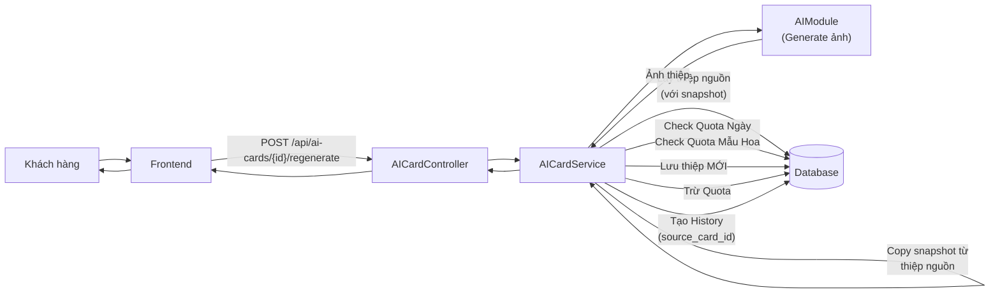
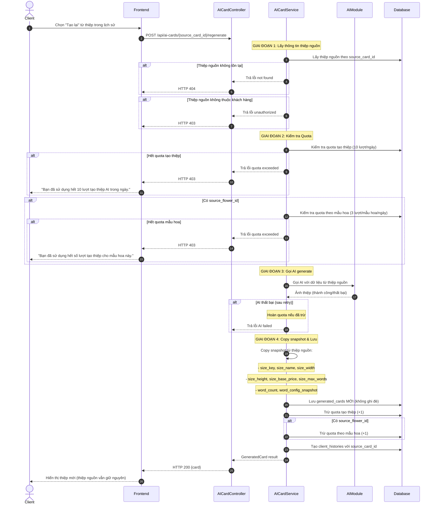
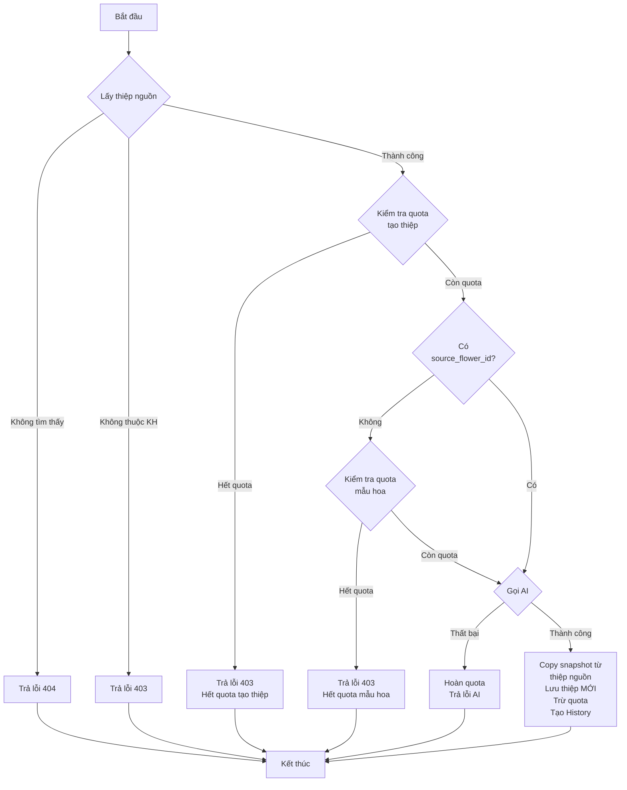
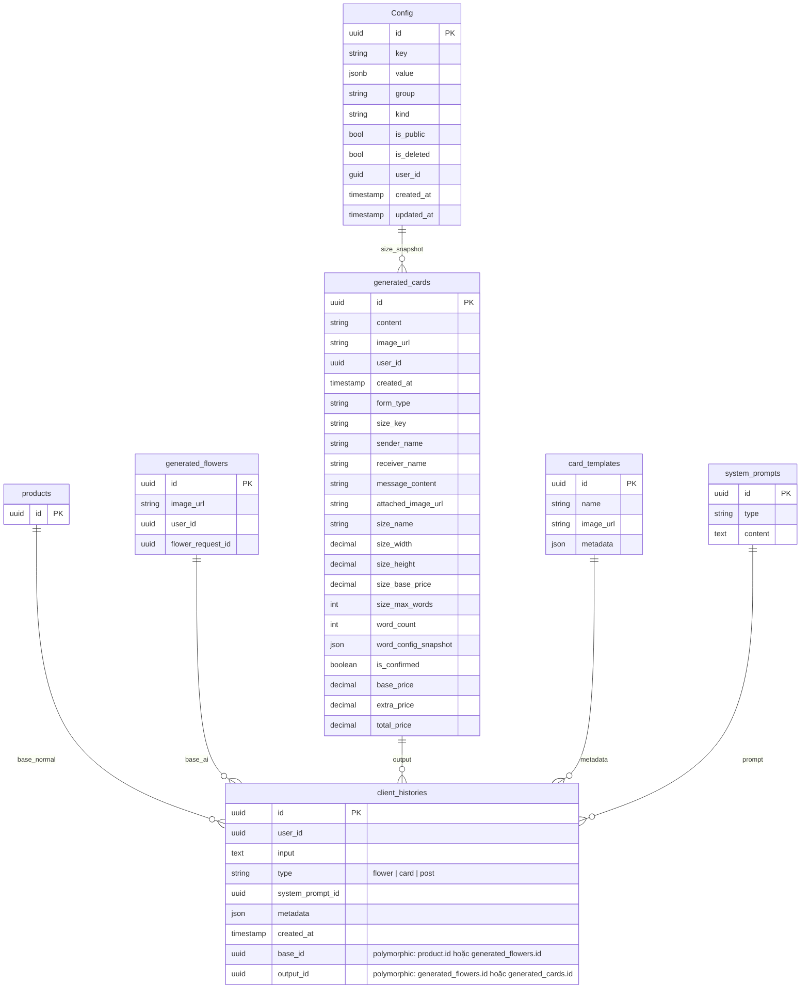

# TDD-036: Tạo lại thiệp từ lịch sử

## Thông tin tài liệu
- **Tiêu đề**: Tạo lại thiệp thiết kế AI từ lịch sử
- **Ghi chú**: API cho phép khách hàng tạo lại thiệp từ một thiệp đã có trong lịch sử. Hệ thống sử dụng nguyên thông tin của thiệp nguồn (bao gồm snapshot giá), không mở form chỉnh sửa. Có giới hạn quota riêng theo mẫu hoa (3 lần/ngày cho mỗi mẫu hoa đã generate). **Mối quan hệ với hoa được xác định qua `client_histories`, không qua `generated_cards.source_flower_id`**.

## Metadata quản trị tài liệu
| Trường | Giá trị |
|---|---|
| Mã tài liệu | TDD-036 |
| Phiên bản | v0.3 |
| Author | |
| Reviewer | |
| Approver | Chưa chỉnh định |
| Owner | |
| Cập nhật gần nhất | 2026-08-27 |

---

## BƯỚC 1 — Thông tin & Bối cảnh

### Thông tin tài liệu
- **Mã tài liệu**: TDD-036
- **Tính năng**: Tạo lại thiệp từ lịch sử
- **Tác giả**: 
- **Người review**: 
- **Phiên bản**: v0.2
- **Cập nhật (YYYY-MM-DD)**: 2026-08-26
- **Story liên quan**:
  - STORY-036

### Business Rules
- BR-036-01: Khi tạo lại, hệ thống lấy thông tin từ thiệp nguồn (generated_card_id) kết hợp với System form để generate thiệp mới
- BR-036-02: Hệ thống KHÔNG mở form cho khách hàng chỉnh sửa - dùng nguyên dữ liệu thiệp nguồn
- BR-036-03: generated_card_id bắt buộc phải tồn tại và thuộc về khách hàng hiện tại
- BR-036-04: base_id trong client_histories mới được xác định từ client_histories cũ của thiệp nguồn
- BR-036-05: Thiệp mới sử dụng snapshot config từ thiệp nguồn (size_name, size_width, size_height, size_base_price, size_max_words, word_config_snapshot)
- BR-036-06: Trước khi gọi AI, kiểm tra:
  - Quota tạo thiệp của khách hàng (10 lượt/ngày)
  - Quota theo mẫu hoa (3 lượt/mẫu hoa/ngày) - nếu có flower base
- BR-036-07: Mỗi mẫu hoa đã generate ra chỉ được tạo tối đa 3 lần/ngày
- BR-036-08: Khi tạo thành công:
  - Trừ 1 lượt quota tạo thiệp
  - Trừ 1 lượt quota theo mẫu hoa (nếu có flower base)
  - Tạo client_histories mới với base_id và output_id tương ứng
  - Tạo record generated_cards mới (KHÔNG ghi đè thiệp nguồn)
- BR-036-09: Khi AI thất bại (sau 2 lần retry), hoàn quota đã trừ
- BR-036-10: client_histories chỉ được tạo khi có ảnh hợp lệ
- BR-036-11: Thiệp nguồn KHÔNG bị xóa hoặc ghi đè
- BR-036-12: Kết quả mới không tự động gắn vào Checkout (vì thao tác từ lịch sử)
- **BR-036-13: base_id trong client_histories mới = base_id của client_histories thiệp nguồn**
- **BR-036-14: output_id trong client_histories mới = id thiệp mới vừa tạo**

### Bối cảnh & Mục tiêu

**Vấn đề**
> Khách hàng muốn tạo phiên bản mới của một thiệp đã có mà không cần nhập lại thông tin. Hệ thống cần lấy nguyên thông tin từ thiệp nguồn (bao gồm snapshot config về giá), đồng thời quản lý quota theo mẫu hoa để tránh spam tạo ảnh giống nhau.

**Mục tiêu**
- Tạo thiệp mới từ thiệp nguồn mà không cần form chỉnh sửa
- Giữ nguyên thông tin: sender_name, receiver_name, message_content, attached_image_url, form_type, size_key, và các snapshot giá
- Kiểm tra và quản lý quota (10 lượt/ngày + 3 lượt/mẫu hoa/ngày)
- Không ghi đè hoặc xóa thiệp nguồn
- Ghi nhận source_card_id và source_flower_id trong client_histories

**Ngoài phạm vi** (Out of scope)
- AI generation thực tế (được tách trong module riêng)
- Retry logic khi AI thất bại (được xử lý trong AI module)
- Tự động gắn kết quả vào Checkout
- Chỉnh sửa thông tin trước khi tạo lại

---

## BƯỚC 2 — Kiến trúc & Sơ đồ

### Kiến trúc tổng quan (Architecture)
**Tiêu đề**: Trình tự tạo lại thiệp từ lịch sử
**Mô tả**: Client gọi API tạo lại → Controller nhận request với source_card_id → Service lấy thông tin thiệp nguồn (bao gồm snapshot) → Kiểm tra quota → Gọi AI module → Lưu thiệp mới (không ghi đè) → Trừ quota → Trả kết quả



### Sequence Diagram
**Tiêu đề**: Trình tự tạo lại thiệp từ lịch sử
**Mô tả**: Từng bước gọi qua lại giữa các thành phần



### Activity Diagram
**Tiêu đề**: Quy trình tạo lại thiệp từ lịch sử
**Mô tả**: Sơ đồ quyết định khi tạo lại thiệp



### Mô hình dữ liệu (Data Model / ERD)
**Tiêu đề**: Các bảng liên quan đến tạo lại thiệp
**Mô tả**: Config (bảng có sẵn), generated_cards (nguồn và mới), client_histories (polymorphic)



**LƯU Ý:** `generated_cards` KHÔNG có trường `source_flower_id`. Mối quan hệ với bó hoa được xác định qua `client_histories.base_id`:
- Thiệp cho bó hoa bình thường: `base_id = products.id`
- Thiệp cho bó hoa AI: `base_id = generated_flowers.id`

Khi tạo lại:
- `base_id` mới = `base_id` cũ của thiệp nguồn
- `output_id` mới = id thiệp mới vừa tạo

---

## BƯỚC 3 — API

### API Contract nội bộ

#### Endpoint #1: Tạo lại thiệp từ lịch sử
- **Method**: POST
- **Endpoint**: `/api/ai-cards/{id}/regenerate`
- **Tên endpoint**: Tạo lại thiệp từ lịch sử
- **Mô tả**: Tạo thiệp mới từ thiệp nguồn trong lịch sử, sử dụng nguyên snapshot config, không cần form chỉnh sửa

**Ví dụ 1 — Happy path: Tạo lại thành công** — HTTP `200`

Request:
```
POST /api/ai-cards/550e8400-e29b-41d4-a716-446655440001/regenerate
```
(Không cần body - lấy thông tin từ source_card_id)

Response:
```json
{
  "value": {
    "id": "880e8400-e29b-41d4-a716-446655440099",
    "content": "...",
    "image_url": "https://storage.example.com/cards/880e8400.png",
    "user_id": "770e8400-e29b-41d4-a716-446655440003",
    "order_id": null,
    "created_at": "2026-08-26T11:00:00Z",
    "form_type": "go_may",
    "size_key": "size_A",
    "sender_name": "Nguyễn An",
    "receiver_name": "Trần Bình",
    "message_content": "Chúc bạn sinh nhật vui vẻ",
    "attached_image_url": null,
    "size_name": "A",
    "size_width": 10,
    "size_height": 15,
    "size_base_price": 100000,
    "size_max_words": 100,
    "word_count": 5,
    "word_config_snapshot": null,
    "is_confirmed": false,
    "base_price": 100000,
    "extra_price": 0,
    "total_price": 100000
  }
}
```

**Ghi chú:** Thiệp nguồn (id: 550e8400...) vẫn tồn tại trong DB với snapshot giá cũ, không bị ghi đè.

**Ví dụ 2 — Happy path: Tạo lại thiệp Calligraphy từ mẫu hoa** — HTTP `200`

Request:
```
POST /api/ai-cards/550e8400-e29b-41d4-a716-446655440002/regenerate
```

Response:
```json
{
  "value": {
    "id": "990e8400-e29b-41d4-a716-446655440100",
    "form_type": "calligraphy",
    "size_key": "size_B",
    "sender_name": "Hoàng Thị Lan",
    "receiver_name": "Lê Văn Minh",
    "message_content": "Chúc mừng năm mới...",
    "attached_image_url": "https://storage.example.com/images/flower-002.jpg",
    "size_name": "B",
    "size_width": 15,
    "size_height": 20,
    "size_base_price": 150000,
    "size_max_words": 150,
    "word_count": 45,
    "word_config_snapshot": {
      "min_words": 36,
      "max_words": 70,
      "extra_price": 39000
    },
    "base_price": 150000,
    "extra_price": 39000,
    "total_price": 189000
  }
}
```

**Ví dụ 3 — Thiệp nguồn không tồn tại** — HTTP `404`

Request:
```
POST /api/ai-cards/00000000-0000-0000-0000-000000000000/regenerate
```

Response:
```json
{
  "error": {
    "code": "CARD_NOT_FOUND",
    "message": "Thiệp không tồn tại."
  }
}
```

**Ví dụ 4 — Thiệp nguồn không thuộc khách hàng** — HTTP `403`

Request:
```
POST /api/ai-cards/550e8400-e29b-41d4-a716-446655440003/regenerate
```

Response:
```json
{
  "error": {
    "code": "ACCESS_DENIED",
    "message": "Bạn không có quyền truy cập thiệp này."
  }
}
```

**Ví dụ 5 — Hết quota tạo thiệp trong ngày** — HTTP `403`

Request:
```
POST /api/ai-cards/550e8400-e29b-41d4-a716-446655440001/regenerate
```

Response:
```json
{
  "error": {
    "code": "FORBIDDEN",
    "message": "Bạn đã sử dụng hết 10 lượt tạo thiệp AI trong ngày."
  }
}
```

**Ví dụ 6 — Hết quota theo mẫu hoa** — HTTP `403`

Request:
```
POST /api/ai-cards/550e8400-e29b-41d4-a716-446655440001/regenerate
```

Response:
```json
{
  "error": {
    "code": "FORBIDDEN",
    "message": "Bạn đã sử dụng hết số lượt tạo thiệp cho mẫu hoa này."
  }
}
```

**Ví dụ 7 — AI thất bại sau retry** — HTTP `500`

Response:
```json
{
  "error": {
    "code": "INTERNAL_SERVER_ERROR",
    "message": "Không thể tạo ảnh thiệp. Vui lòng thử lại sau."
  }
}
```

**Ví dụ 8 — Chưa đăng nhập** — HTTP `401`

Request:
```
POST /api/ai-cards/550e8400-e29b-41d4-a716-446655440001/regenerate
```

Response:
```json
{
  "error": {
    "code": "UNAUTHORIZED",
    "message": "Bạn cần đăng nhập để thực hiện thao tác này."
  }
}
```

#### Mã lỗi
| Code | HTTP | Khi nào xảy ra |
|---|---|---|
| NOT_FOUND | 404 | Thiệp không tồn tại |
| ACCESS_DENIED | 403 | Thiệp này không thuộc về bạn |
| FORBIDDEN | 403 | Bạn đã sử dụng hết 10 lượt tạo thiệp trong ngày hoặc đã tạo tối đa 3 lần cho mẫu hoa này trong ngày |
| UNAUTHORIZED | 401 | Bạn cần đăng nhập để thực hiện thao tác này |
| INTERNAL_SERVER_ERROR | 500 | Không thể tạo thiệp thiết kế AI. Vui lòng thử lại sau |

---

## BƯỚC 4 — Tham chiếu

> Chú thích: 🔴 Tham chiếu đến (tài liệu này đọc/phụ thuộc) · ⚫ Trỏ vào tài liệu này (tài liệu khác phụ thuộc vào tài liệu này) · ⋯ Bị ảnh hưởng (thay đổi ở đây có thể làm tài liệu kia sai theo)

### 🔴 Tham chiếu đến
- TDD-035 - Tạo thiệp thiết kế AI (sử dụng chung generated_cards, quota logic, bảng Config)
- AIModule - Module xử lý AI generation (tách riêng)
- client_histories Entity - Để lấy base_id từ thiệp nguồn

### ⚫ Trỏ vào tài liệu này
- ST-036-01-01 - System Test: Tạo lại thiệp thành công từ History
- ST-036-02-01 - System Test: Giữ nguyên nội dung và ảnh đính kèm khi Tạo lại
- ST-036-05-01 - System Test: Chặn Tạo lại khi hết quota ngày hoặc đủ 3 lượt theo mẫu hoa
- AI_DB_Diagram - Tham chiếu cấu trúc client_histories

### ⋯ Bị ảnh hưởng
- TDD-035 - Nếu thay đổi cấu trúc generated_cards hoặc quota logic, cần kiểm tra lại TDD-036
