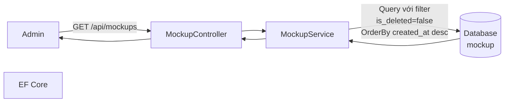
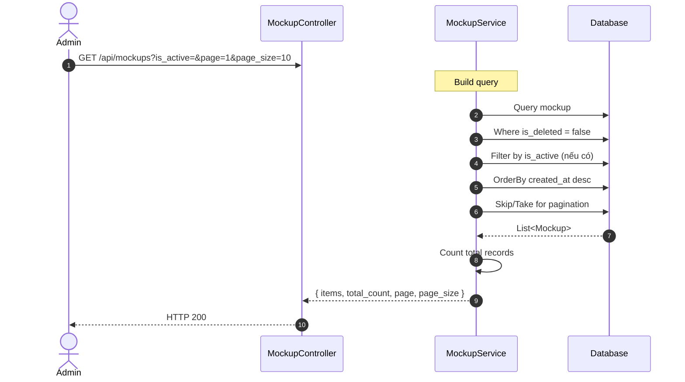
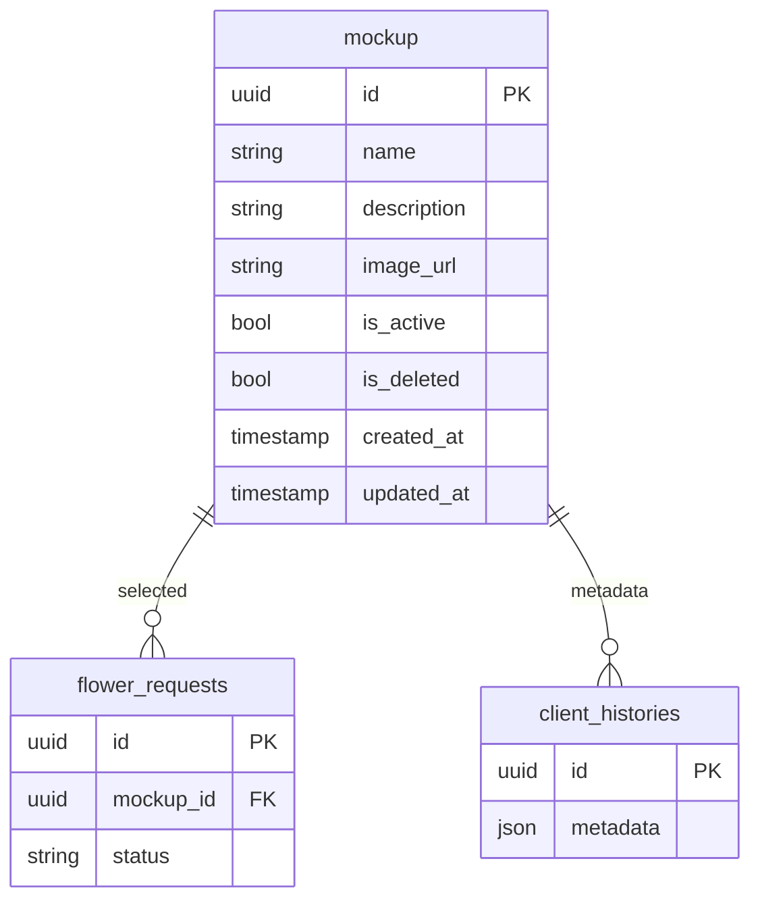

# TDD-050: Lấy danh sách Mockup

## Thông tin tài liệu
- **Tiêu đề**: Lấy danh sách Mockup có phân trang và lọc
- **Ghi chú**: API cho phép Admin lấy danh sách Mockup từ bảng mockup với filter theo trạng thái và phân trang.

## Metadata quản trị tài liệu
| Trường | Giá trị |
|---|---|
| Mã tài liệu | TDD-050 |
| Phiên bản | v0.1 |
| Author | |
| Reviewer | |
| Approver | Chưa chỉ định |
| Owner | |
| Cập nhật gần nhất | 2026-08-27 |

---

## BƯỚC 1 — Thông tin & Bối cảnh

### Thông tin tài liệu
- **Mã tài liệu**: TDD-050
- **Tính năng**: Lấy danh sách Mockup
- **Tác giả**: 
- **Người review**: 
- **Phiên bản**: v0.1
- **Cập nhật (YYYY-MM-DD)**: 2026-08-27
- **Story liên quan**:
  - STORY-050

### Business Rules
- BR-050-01: Danh sách Mockup chỉ hiển thị các Mockup có `is_deleted = false`
- BR-050-02: Danh sách hiển thị cả Mockup Active và Inactive
- BR-050-03: Danh sách được sắp xếp theo `created_at` giảm dần (mới nhất trước)
- BR-050-04: Hỗ trợ phân trang với các tùy chọn: 5, 10, 20, 30, 40, 50 dòng/trang
- BR-050-05: Mặc định hiển thị 10 dòng/trang
- BR-050-06: Filter theo trạng thái `is_active` (tùy chọn)

### Bối cảnh & Mục tiêu

**Vấn đề**
> Admin cần xem danh sách Mockup để theo dõi thông tin và trạng thái của các Mockup đang được quản lý trong hệ thống.

**Mục tiêu**
- Lấy danh sách Mockup từ bảng mockup
- Filter theo trạng thái `is_active` (tùy chọn)
- Sắp xếp theo `created_at` giảm dần
- Phân trang (page, page_size)

**Ngoài phạm vi** (Out of scope)
- Thêm Mockup (TDD-051)
- Chỉnh sửa Mockup
- Chuyển trạng thái Mockup (TDD-052)
- Xóa Mockup (TDD-053)

---

## BƯỚC 2 — Kiến trúc & Sơ đồ

### Kiến trúc tổng quan (Architecture)
**Tiêu đề**: Trình tự lấy danh sách Mockup
**Mô tả**: Client gọi API → Controller nhận request → Service query với filter → Trả kết quả có phân trang



### Sequence Diagram
**Tiêu đề**: Trình tự lấy danh sách Mockup
**Mô tả**: Từng bước gọi qua lại giữa các thành phần



### Mô hình dữ liệu (Data Model / ERD)
**Tiêu đề**: Bảng Mockup
**Mô tả**: Cấu trúc bảng mockup



---

## BƯỚC 3 — API

### API Contract nội bộ

#### Endpoint #1: Lấy danh sách Mockup
- **Method**: GET
- **Endpoint**: `/api/mockups`
- **Tên endpoint**: Lấy danh sách Mockup
- **Mô tả**: Lấy danh sách với filter theo trạng thái và phân trang
- **Quyền**: Admin

**Query Parameters:**
| Parameter | Type | Required | Default | Mô tả |
|-----------|------|----------|---------|-------|
| is_active | bool? | No | null | Filter theo trạng thái (true=Active, false=Inactive, null=tất cả) |
| page | int | No | 1 | Trang hiện tại |
| page_size | int | No | 10 | Số item trên trang (5, 10, 20, 30, 40, 50) |

**Ví dụ 1 — Happy path: Lấy tất cả Mockup** — HTTP `200`

Request:
```
GET /api/mockups
```

Response:
```json
{
  "value": [
    {
      "id": "550e8400-e29b-41d4-a716-446655440001",
      "name": "Mockup Sinh Nhật 1",
      "description": "Mockup bó hoa sinh nhật với màu sắc tươi sáng",
      "image_url": "https://storage.example.com/mockups/sinh-nhat-1.jpg",
      "is_active": true,
      "is_deleted": false,
      "created_at": "2026-08-27T10:00:00Z",
      "updated_at": null
    },
    {
      "id": "550e8400-e29b-41d4-a716-446655440002",
      "name": "Mockup Cưới Hỏi 1",
      "description": "Mockup bó hoa cưới với kiểu dáng sang trọng",
      "image_url": "https://storage.example.com/mockups/cuoi-hoi-1.jpg",
      "is_active": false,
      "is_deleted": false,
      "created_at": "2026-08-26T10:00:00Z",
      "updated_at": null
    }
  ],
  "total_count": 2,
  "page": 1,
  "page_size": 10
}
```

**Ví dụ 2 — Happy path: Filter theo is_active = true** — HTTP `200`

Request:
```
GET /api/mockups?is_active=true
```

Response:
```json
{
  "value": [
    {
      "id": "550e8400-e29b-41d4-a716-446655440001",
      "name": "Mockup Sinh Nhật 1",
      "is_active": true,
      "is_deleted": false,
      "created_at": "2026-08-27T10:00:00Z"
    }
  ],
  "total_count": 1,
  "page": 1,
  "page_size": 10
}
```

**Ví dụ 3 — Happy path: Kết hợp filter và pagination** — HTTP `200`

Request:
```
GET /api/mockups?is_active=true&page=1&page_size=5
```

Response:
```json
{
  "value": [
    {
      "id": "550e8400-e29b-41d4-a716-446655440001",
      "name": "Mockup Sinh Nhật 1",
      "description": "Mockup bó hoa sinh nhật với màu sắc tươi sáng",
      "image_url": "https://storage.example.com/mockups/sinh-nhat-1.jpg",
      "is_active": true,
      "is_deleted": false,
      "created_at": "2026-08-27T10:00:00Z",
      "updated_at": null
    }
  ],
  "total_count": 1,
  "page": 1,
  "page_size": 5
}
```

**Ví dụ 4 — Happy path: Danh sách rỗng** — HTTP `200`

Request:
```
GET /api/mockups?is_active=false
```

Response:
```json
{
  "value": [],
  "total_count": 0,
  "page": 1,
  "page_size": 10
}
```

**Ví dụ 5 — Happy path: Phân trang với page 2** — HTTP `200`

Request:
```
GET /api/mockups?page=2&page_size=2
```

Response:
```json
{
  "value": [
    {
      "id": "550e8400-e29b-41d4-a716-446655440003",
      "name": "Mockup Cưới Hỏi 1",
      "description": "Mockup bó hoa cưới với kiểu dáng sang trọng",
      "image_url": "https://storage.example.com/mockups/cuoi-hoi-1.jpg",
      "is_active": false,
      "is_deleted": false,
      "created_at": "2026-08-25T10:00:00Z",
      "updated_at": null
    },
    {
      "id": "550e8400-e29b-41d4-a716-446655440004",
      "name": "Mockup Tang Lễ 1",
      "description": "Mockup bó hoa tang lễ trang nhã",
      "image_url": "https://storage.example.com/mockups/tang-le-1.jpg",
      "is_active": true,
      "is_deleted": false,
      "created_at": "2026-08-24T10:00:00Z",
      "updated_at": null
    }
  ],
  "total_count": 5,
  "page": 2,
  "page_size": 2
}
```

**Ví dụ 6 — Chưa đăng nhập** — HTTP `401`

Request:
```
GET /api/mockups
```

Response:
```json
{
  "error": {
    "code": "UNAUTHORIZED",
    "message": "Bạn cần đăng nhập để thực hiện thao tác này."
  }
}
```

**Ví dụ 7 — Không có quyền xem** — HTTP `403`

Request:
```
GET /api/mockups
```

Response:
```json
{
  "error": {
    "code": "ACCESS_DENIED",
    "message": "Bạn không có quyền thực hiện thao tác này."
  }
}
```

#### Mã lỗi
| Code | HTTP | Khi nào xảy ra |
|---|---|---|
| UNAUTHORIZED | 401 | Bạn cần đăng nhập để thực hiện thao tác này |
| ACCESS_DENIED | 403 | Bạn không có quyền xem danh sách Mockup |

---

## BƯỚC 4 — Tham chiếu

> Chú thích: 🔴 Tham chiếu đến (tài liệu này đọc/phụ thuộc) · ⚫ Trỏ vào tài liệu này (tài liệu khác phụ thuộc vào tài liệu này) · ⋯ Bị ảnh hưởng (thay đổi ở đây có thể làm tài liệu kia sai theo)

### 🔴 Tham chiếu đến
- Mockup Entity - Bảng mockup trong Database

### ⚫ Trỏ vào tài liệu này
- TDD-051 - Thêm Mockup
- TDD-052 - Chuyển trạng thái Mockup
- TDD-053 - Xóa Mockup
- AI_Mockup_Context - Tham chiếu context và business rules

### ⋯ Bị ảnh hưởng
- STORY-030 - Khi chọn Mockup, cần filter theo is_active=true và is_deleted=false
