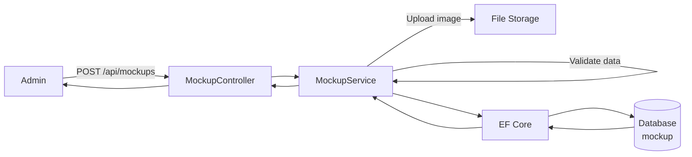
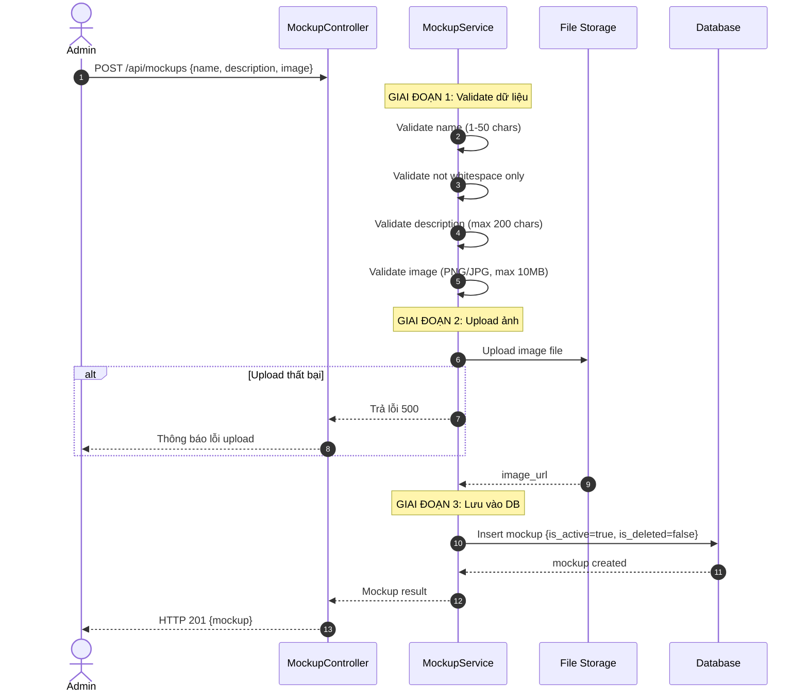
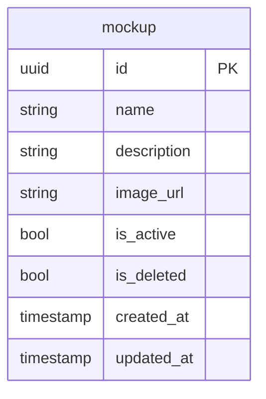

# TDD-051: Thêm Mockup

## Thông tin tài liệu
- **Tiêu đề**: Thêm Mockup mới vào hệ thống
- **Ghi chú**: API cho phép Admin thêm Mockup mới với thông tin cơ bản (tên, mô tả, ảnh). Mockup mới được tạo với trạng thái Active và chưa bị xóa.

## Metadata quản trị tài liệu
| Trường | Giá trị |
|---|---|
| Mã tài liệu | TDD-051 |
| Phiên bản | v0.1 |
| Author | |
| Reviewer | |
| Approver | Chưa chỉ định |
| Owner | |
| Cập nhật gần nhất | 2026-08-27 |

---

## BƯỚC 1 — Thông tin & Bối cảnh

### Thông tin tài liệu
- **Mã tài liệu**: TDD-051
- **Tính năng**: Thêm Mockup
- **Tác giả**: 
- **Người review**: 
- **Phiên bản**: v0.1
- **Cập nhật (YYYY-MM-DD)**: 2026-08-27
- **Story liên quan**:
  - STORY-051

### Business Rules
- BR-051-01: Tên Mockup bắt buộc, từ 1 đến 50 ký tự sau khi trim
- BR-051-02: Tên Mockup không chỉ chứa khoảng trắng
- BR-051-03: Mô tả tùy chọn, tối đa 200 ký tự
- BR-051-04: Ảnh Mockup bắt buộc, định dạng PNG hoặc JPG
- BR-051-05: Kích thước file ảnh tối đa 10MB
- BR-051-06: Mockup mới được tạo với `is_active = true`
- BR-051-07: Mockup mới được tạo với `is_deleted = false`
- BR-051-08: Chống duplicate bằng idempotency key

### Bối cảnh & Mục tiêu

**Vấn đề**
> Admin cần thêm Mockup mới để bổ sung thư viện Mockup cho hệ thống và cho phép khách hàng sử dụng trong quy trình khởi tạo mẫu hoa.

**Mục tiêu**
- Thêm Mockup mới với thông tin cơ bản
- Validate dữ liệu đầu vào (tên, ảnh)
- Upload ảnh Mockup lên storage
- Tạo Mockup với trạng thái Active mặc định

**Ngoài phạm vi** (Out of scope)
- Chỉnh sửa Mockup
- Chuyển trạng thái Mockup (TDD-052)
- Xóa Mockup (TDD-053)

---

## BƯỚC 2 — Kiến trúc & Sơ đồ

### Kiến trúc tổng quan (Architecture)
**Tiêu đề**: Trình tự thêm Mockup
**Mô tả**: Client gọi API thêm Mockup → Controller nhận request → Service validate → Upload ảnh → Lưu vào DB → Trả kết quả



### Sequence Diagram
**Tiêu đề**: Trình tự thêm Mockup
**Mô tả**: Từng bước gọi qua lại giữa các thành phần



### Mô hình dữ liệu (Data Model / ERD)
**Tiêu đề**: Bảng Mockup
**Mô tả**: Cấu trúc bảng mockup



---

## BƯỚC 3 — API

### API Contract nội bộ

#### Endpoint #1: Thêm Mockup
- **Method**: POST
- **Endpoint**: `/api/mockups`
- **Tên endpoint**: Thêm Mockup
- **Mô tả**: Thêm Mockup mới với thông tin cơ bản và upload ảnh
- **Quyền**: Admin

**Request Body (multipart/form-data):**
| Field | Type | Required | Mô tả |
|-------|------|---------|-------|
| name | string | Có | Tên Mockup (1-50 ký tự) |
| description | string | Không | Mô tả (max 200 ký tự) |
| image | file | Có | Ảnh Mockup (PNG/JPG, max 10MB) |

**Ví dụ 1 — Happy path: Thêm Mockup thành công** — HTTP `201`

Request:
```
POST /api/mockups
Content-Type: multipart/form-data

name: "Mockup Sinh Nhật 1"
description: "Mockup bó hoa sinh nhật với màu sắc tươi sáng"
image: [file upload]
```

Response:
```json
{
  "value": {
    "id": "550e8400-e29b-41d4-a716-446655440001",
    "name": "Mockup Sinh Nhật 1",
    "description": "Mockup bó hoa sinh nhật với màu sắc tươi sáng",
    "image_url": "https://storage.example.com/mockups/550e8400.jpg",
    "is_active": true,
    "is_deleted": false,
    "created_at": "2026-08-27T10:30:00Z",
    "updated_at": null
  }
}
```

**Ví dụ 2 — Happy path: Thêm Mockup không có mô tả** — HTTP `201`

Request:
```
POST /api/mockups
Content-Type: multipart/form-data

name: "Mockup Cưới Hỏi 1"
image: [file upload]
```

Response:
```json
{
  "value": {
    "id": "550e8400-e29b-41d4-a716-446655440002",
    "name": "Mockup Cưới Hỏi 1",
    "description": null,
    "image_url": "https://storage.example.com/mockups/550e8400.jpg",
    "is_active": true,
    "is_deleted": false,
    "created_at": "2026-08-27T10:35:00Z",
    "updated_at": null
  }
}
```

**Ví dụ 3 — Validation: Tên không hợp lệ (rỗng)** — HTTP `400`

Request:
```
POST /api/mockups
Content-Type: multipart/form-data

name: ""
image: [file upload]
```

Response:
```json
{
  "error": {
    "code": "VALIDATION_ERROR",
    "message": "Tên Mockup bắt buộc, từ 1 đến 50 ký tự."
  }
}
```

**Ví dụ 4 — Validation: Tên chỉ chứa khoảng trắng** — HTTP `400`

Request:
```
POST /api/mockups
Content-Type: multipart/form-data

name: "   "
image: [file upload]
```

Response:
```json
{
  "error": {
    "code": "VALIDATION_ERROR",
    "message": "Tên Mockup không hợp lệ."
  }
}
```

**Ví dụ 5 — Validation: Tên quá 50 ký tự** — HTTP `400`

Request:
```
POST /api/mockups
Content-Type: multipart/form-data

name: "Mockup Sinh Nhật 1 cho bó hoa tươi rực rỡ với nhiều màu sắc đẹp mắt"
image: [file upload]
```

Response:
```json
{
  "error": {
    "code": "VALIDATION_ERROR",
    "message": "Tên Mockup không được vượt quá 50 ký tự."
  }
}
```

**Ví dụ 6 — Validation: Mô tả quá 200 ký tự** — HTTP `400`

Request:
```
POST /api/mockups
Content-Type: multipart/form-data

name: "Mockup Test"
description: "Mô tả quá dài..." (hơn 200 ký tự)
image: [file upload]
```

Response:
```json
{
  "error": {
    "code": "VALIDATION_ERROR",
    "message": "Mô tả Mockup không được vượt quá 200 ký tự."
  }
}
```

**Ví dụ 7 — Validation: Thiếu ảnh** — HTTP `400`

Request:
```
POST /api/mockups
Content-Type: multipart/form-data

name: "Mockup Test"
```

Response:
```json
{
  "error": {
    "code": "VALIDATION_ERROR",
    "message": "Ảnh Mockup bắt buộc."
  }
}
```

**Ví dụ 8 — Validation: Định dạng ảnh không hợp lệ** — HTTP `400`

Request:
```
POST /api/mockups
Content-Type: multipart/form-data

name: "Mockup Test"
image: [file.gif]
```

Response:
```json
{
  "error": {
    "code": "VALIDATION_ERROR",
    "message": "Ảnh Mockup phải có định dạng PNG hoặc JPG."
  }
}
```

**Ví dụ 9 — Validation: Kích thước ảnh quá lớn** — HTTP `400`

Request:
```
POST /api/mockups
Content-Type: multipart/form-data

name: "Mockup Test"
image: [file > 10MB]
```

Response:
```json
{
  "error": {
    "code": "VALIDATION_ERROR",
    "message": "Kích thước ảnh Mockup không được vượt quá 10MB."
  }
}
```

**Ví dụ 10 — Upload ảnh thất bại** — HTTP `500`

Response:
```json
{
  "error": {
    "code": "INTERNAL_SERVER_ERROR",
    "message": "Không thể tải ảnh lên. Vui lòng thử lại."
  }
}
```

**Ví dụ 11 — Không có quyền** — HTTP `403`

Response:
```json
{
  "error": {
    "code": "ACCESS_DENIED",
    "message": "Bạn không có quyền thực hiện thao tác này."
  }
}
```

**Ví dụ 12 — Chưa đăng nhập** — HTTP `401`

Response:
```json
{
  "error": {
    "code": "UNAUTHORIZED",
    "message": "Bạn cần đăng nhập để thực hiện thao tác này."
  }
}
```

#### Mã lỗi
| Code | HTTP | Khi nào xảy ra |
|---|---|---|
| VALIDATION_ERROR | 400 | Tên Mockup không hợp lệ (rỗng, quá 50 ký tự, chỉ khoảng trắng), mô tả quá 200 ký tự, thiếu ảnh, định dạng ảnh không phải PNG/JPG, kích thước ảnh vượt quá 10MB |
| ACCESS_DENIED | 403 | Bạn không có quyền thêm Mockup |
| UNAUTHORIZED | 401 | Bạn cần đăng nhập để thực hiện thao tác này |
| INTERNAL_SERVER_ERROR | 500 | Không thể tải ảnh Mockup lên. Vui lòng thử lại sau |

---

## BƯỚC 4 — Tham chiếu

> Chú thích: 🔴 Tham chiếu đến (tài liệu này đọc/phụ thuộc) · ⚫ Trỏ vào tài liệu này (tài liệu khác phụ thuộc vào tài liệu này) · ⋯ Bị ảnh hưởng (thay đổi ở đây có thể làm tài liệu kia sai theo)

### 🔴 Tham chiếu đến
- Mockup Entity - Bảng mockup trong Database
- File Storage - Nơi lưu trữ ảnh Mockup

### ⚫ Trỏ vào tài liệu này
- TDD-050 - Lấy danh sách Mockup
- TDD-052 - Chuyển trạng thái Mockup
- TDD-053 - Xóa Mockup
- AI_Mockup_Context - Tham chiếu context và business rules

### ⋯ Bị ảnh hưởng
- STORY-030 - Mockup mới tạo có thể được sử dụng trong quy trình tạo mẫu hoa
