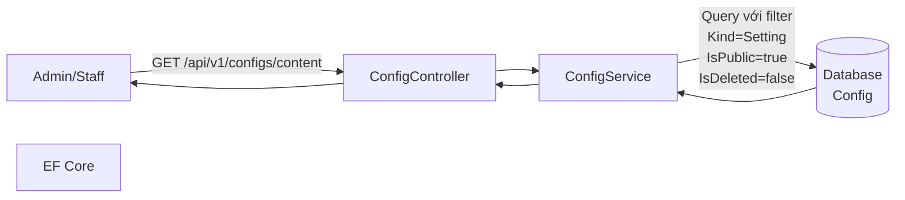
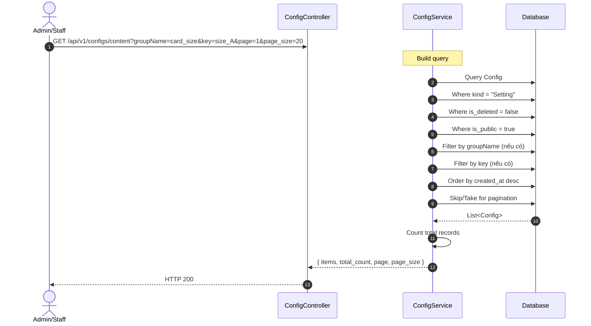
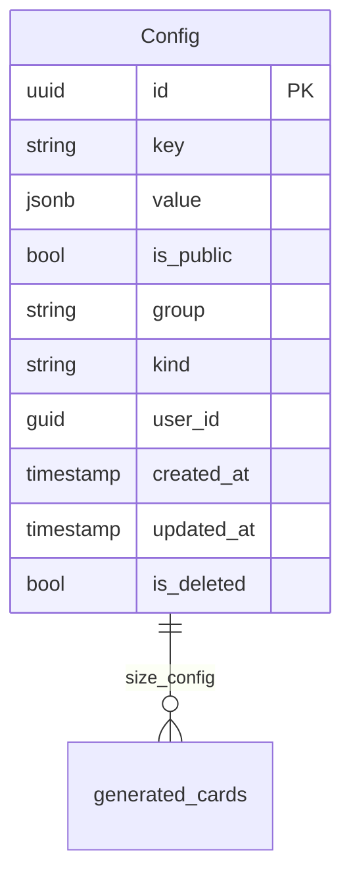

# TDD-054: Lấy danh sách Card Configs

## Thông tin tài liệu
- **Tiêu đề**: Lấy danh sách cấu hình card có phân trang và lọc
- **Ghi chú**: API cho phép Admin/Staff lấy danh sách card configs từ bảng Config với filter theo group, key và phân trang.

## Metadata quản trị tài liệu
| Trường | Giá trị |
|---|---|
| Mã tài liệu | TDD-054 |
| Phiên bản | v0.3 |
| Author | |
| Reviewer | |
| Approver | Chưa chỉ định |
| Owner | |
| Cập nhật gần nhất | 2026-08-26 |

---

## BƯỚC 1 — Thông tin & Bối cảnh

### Thông tin tài liệu
- **Mã tài liệu**: TDD-054
- **Tính năng**: Lấy danh sách card configs
- **Tác giả**: 
- **Người review**: 
- **Phiên bản**: v0.3
- **Cập nhật (YYYY-MM-DD)**: 2026-08-26
- **Story liên quan**: Không có

### Business Rules
- BR-054-01: Admin và Staff đều có quyền xem danh sách
- BR-054-02: Sử dụng bảng Config có sẵn
- BR-054-03: Kind = "Setting" để filter card configs
- BR-054-04: Chỉ trả về các config có IsDeleted = false (chưa bị xóa mềm)
- BR-054-05: Chỉ trả về các config có IsPublic = true (đang hoạt động)
- BR-054-06: Filter theo group và/hoặc key - nếu có param thì lọc theo đó
- BR-054-07: Pagination - mặc định page = 1, page_size = 20
- BR-054-08: Response trả về tổng số bản ghi để frontend phân trang

### Bối cảnh & Mục tiêu

**Vấn đề**
> Admin/Staff cần xem danh sách card configs để quản lý. Danh sách cần có filter theo group, key và pagination để dễ xem.

**Mục tiêu**
- Lấy danh sách card configs từ bảng Config
- Filter theo group và/hoặc key (tùy chọn)
- Phân trang (page, page_size)
- Không trả về các config có IsPublic = false

**Ngoài phạm vi** (Out of scope)
- Tạo card config (TDD-055)
- Cập nhật card config (TDD-062)
- Xóa card config (TDD-056)

---

## BƯỚC 2 — Kiến trúc & Sơ đồ

### Kiến trúc tổng quan (Architecture)
**Tiêu đề**: Trình tự lấy danh sách card configs
**Mô tả**: Client gọi API → Controller nhận request → Service query với filter → Trả kết quả có phân trang



### Sequence Diagram
**Tiêu đề**: Trình tự lấy danh sách card configs
**Mô tả**: Từng bước gọi qua lại giữa các thành phần



### Mô hình dữ liệu (Data Model / ERD)
**Tiêu đề**: Bảng Config
**Mô tả**: Cấu trúc bảng Config



---

## BƯỚC 3 — API

### API Contract nội bộ

#### Endpoint #1: Lấy danh sách card configs
- **Method**: GET
- **Endpoint**: `/api/v1/configs/content`
- **Tên endpoint**: Lấy danh sách card configs
- **Mô tả**: Lấy danh sách với filter theo group, key và phân trang
- **Quyền**: Admin, Staff

**Query Parameters:**
| Parameter | Type | Required | Default | Mô tả |
|-----------|------|----------|---------|-------|
| groupName | string | No | null | Filter theo group (card_size, card_config) |
| key | string | No | null | Filter theo key |
| isPublic | bool | No | null | Filter theo isPublic |
| page | int | No | 1 | Trang hiện tại |
| page_size | int | No | 20 | Số item trên trang |

**Ví dụ 1 — Happy path: Lấy tất cả card configs (Kind=Setting)** — HTTP `200`

Request:
```
GET /api/v1/configs/content
```

Response:
```json
{
  "value": [
    {
      "id": "550e8400-e29b-41d4-a716-446655440001",
      "key": "size_A",
      "value": { "name": "A", "width": 10, "height": 15, "base_price": 100000, "max_words": 100 },
      "group": "card_size",
      "kind": "Setting",
      "is_public": true,
      "is_deleted": false,
      "created_at": "2026-08-26T10:00:00Z",
      "updated_at": null
    },
    {
      "id": "550e8400-e29b-41d4-a716-446655440002",
      "key": "size_B",
      "value": { "name": "B", "width": 15, "height": 20, "base_price": 150000, "max_words": 150 },
      "group": "card_size",
      "kind": "Setting",
      "is_public": true,
      "is_deleted": false,
      "created_at": "2026-08-26T10:00:00Z",
      "updated_at": null
    },
    {
      "id": "550e8400-e29b-41d4-a716-446655440003",
      "key": "calligraphy_words",
      "value": [ { "min_words": 0, "max_words": 35, "extra_price": 0 }, ... ],
      "group": "card_config",
      "kind": "Setting",
      "is_public": true,
      "is_deleted": false,
      "created_at": "2026-08-26T10:00:00Z",
      "updated_at": null
    }
  ]
}
```

**Ví dụ 2 — Happy path: Filter theo group = card_size** — HTTP `200`

Request:
```
GET /api/v1/configs/content?groupName=card_size
```

Response:
```json
{
  "value": [
    {
      "id": "550e8400-e29b-41d4-a716-446655440001",
      "key": "size_A",
      "value": { "name": "A", ... },
      "group": "card_size",
      "kind": "Setting",
      ...
    },
    {
      "id": "550e8400-e29b-41d4-a716-446655440002",
      "key": "size_B",
      "value": { "name": "B", ... },
      "group": "card_size",
      "kind": "Setting",
      ...
    }
  ]
}
```

**Ví dụ 3 — Happy path: Filter theo key = calligraphy_words** — HTTP `200`

Request:
```
GET /api/v1/configs/content?key=calligraphy_words
```

Response:
```json
{
  "value": [
    {
      "id": "550e8400-e29b-41d4-a716-446655440003",
      "key": "calligraphy_words",
      "value": [
        { "min_words": 0, "max_words": 35, "extra_price": 0 },
        { "min_words": 36, "max_words": 70, "extra_price": 39000 },
        { "min_words": 71, "max_words": 100, "extra_price": 69000 }
      ],
      "group": "card_config",
      "kind": "Setting",
      "is_public": true,
      "is_deleted": false,
      "created_at": "2026-08-26T10:00:00Z",
      "updated_at": null
    }
  ]
}
```

**Ví dụ 4 — Happy path: Kết hợp filter và pagination** — HTTP `200`

Request:
```
GET /api/v1/configs/content?groupName=card_size&page=1&page_size=2
```

**Ví dụ 5 — Happy path: Không có dữ liệu** — HTTP `200`

Request:
```
GET /api/v1/configs/content?key=nonexistent_key
```

Response:
```json
{
  "value": []
}
```

**Ví dụ 6 — Chưa đăng nhập** — HTTP `401`

Request:
```
GET /api/v1/configs/content
```

Response:
```json
{
  "error": {
    "code": "UNAUTHORIZED",
    "message": "Bạn cần đăng nhập để thực hiện thao tác này."
  }
}
```

#### Mã lỗi
| Code | HTTP | Khi nào xảy ra |
|---|---|---|
| UNAUTHORIZED | 401 | Bạn cần đăng nhập để thực hiện thao tác này |
| ACCESS_DENIED | 403 | Bạn không có quyền xem danh sách cấu hình card |

---

## BƯỚC 4 — Tham chiếu

> Chú thích: 🔴 Tham chiếu đến (tài liệu này đọc/phụ thuộc) · ⚫ Trỏ vào tài liệu này (tài liệu khác phụ thuộc vào tài liệu này) · ⋯ Bị ảnh hưởng (thay đổi ở đây có thể làm tài liệu kia sai theo)

### 🔴 Tham chiếu đến
- Không có

### ⚫ Trỏ vào tài liệu này
- TDD-055 - Tạo card config
- TDD-062 - Cập nhật card config
- TDD-056 - Xóa card config
- TDD-035 - Tạo thiệp thiết kế AI (sử dụng Config cho pricing)
- TDD-036 - Tạo lại thiệp từ lịch sử (sử dụng Config cho pricing)

### ⋯ Bị ảnh hưởng
- Không có

---

## Notes

- Filter theo group, key sử dụng exact match
- Kind luôn là "Setting" cho card configs
- Các record có IsDeleted = true (đã xóa mềm) sẽ không được trả về
- Các record có IsPublic = false (không hoạt động) sẽ không được trả về
- Sử dụng endpoint `/api/v1/configs/content` với filter `isPublic=true` để lấy card configs
- **IsDeleted**: dùng cho xóa mềm
- **IsPublic**: dùng để xác định config có đang hoạt động để áp dụng cho người dùng chọn (true = đang hoạt động)
