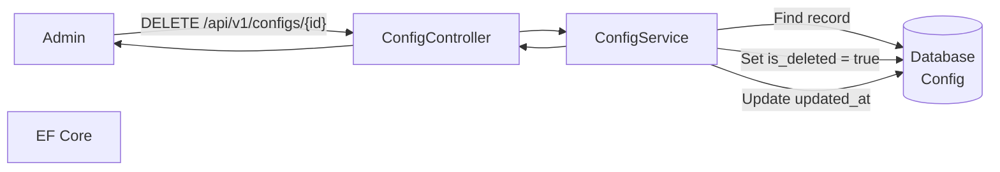
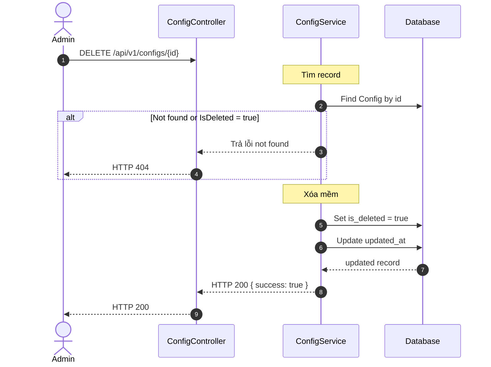
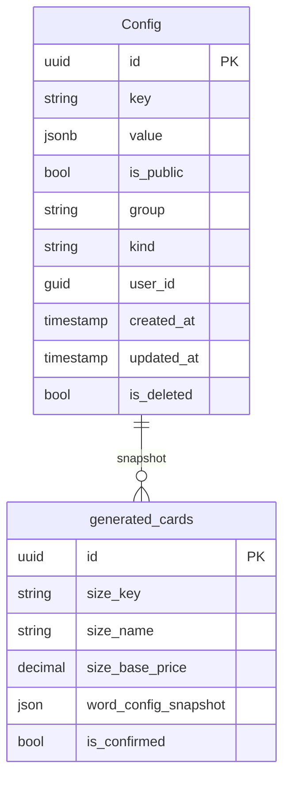

# TDD-056: Xóa Card Config

## Thông tin tài liệu
- **Tiêu đề**: Xóa cấu hình card
- **Ghi chú**: API cho phép Admin xóa card config trong bảng Config. Không có ràng buộc với generated_cards vì các thiệp đã sử dụng snapshot.

## Metadata quản trị tài liệu
| Trường | Giá trị |
|---|---|
| Mã tài liệu | TDD-056 |
| Phiên bản | v0.3 |
| Author | |
| Reviewer | |
| Approver | Chưa chỉ định |
| Owner | |
| Cập nhật gần nhất | 2026-08-26 |

---

## BƯỚC 1 — Thông tin & Bối cảnh

### Thông tin tài liệu
- **Mã tài liệu**: TDD-056
- **Tính năng**: Xóa card config
- **Tác giả**: 
- **Người review**: 
- **Phiên bản**: v0.3
- **Cập nhật (YYYY-MM-DD)**: 2026-08-26
- **Story liên quan**: Không có

### Business Rules
- BR-056-01: Chỉ Admin có quyền xóa card config
- BR-056-02: Sử dụng bảng Config có sẵn
- BR-056-03: Xóa mềm: set IsDeleted = true
- BR-056-04: UpdatedAt được cập nhật khi xóa
- BR-056-05: Không check ràng buộc với generated_cards
- BR-056-06: Các thiệp đã tạo dùng snapshot nên không bị ảnh hưởng
- BR-056-07: Không thể xóa config đã bị xóa trước đó (IsDeleted = true)

### Bối cảnh & Mục tiêu

**Vấn đề**
> Admin cần xóa card config không còn sử dụng. Không có ràng buộc với generated_cards vì các thiệp đã dùng snapshot.

**Mục tiêu**
- Xóa card config (IsDeleted = true)
- Cập nhật UpdatedAt

**Ngoài phạm vi** (Out of scope)
- Tạo card config (TDD-055)
- Cập nhật card config (TDD-062)
- Khôi phục card config đã xóa

---

## BƯỚC 2 — Kiến trúc & Sơ đồ

### Kiến trúc tổng quan (Architecture)
**Tiêu đề**: Trình tự xóa card config
**Mô tả**: Admin gọi API → Controller nhận request → Service tìm và xóa → Cập nhật DB → Trả kết quả



### Sequence Diagram
**Tiêu đề**: Trình tự xóa card config
**Mô tả**: Từng bước gọi qua lại giữa các thành phần



### Mô hình dữ liệu (Data Model / ERD)
**Tiêu đề**: Bảng Config
**Mô tả**: Cấu trúc bảng Config



---

## BƯỚC 3 — API

### API Contract nội bộ

#### Endpoint #1: Xóa card config
- **Method**: DELETE
- **Endpoint**: `/api/v1/configs/{id}`
- **Tên endpoint**: Xóa card config
- **Mô tả**: Xóa card config (IsDeleted = true)
- **Quyền**: Chỉ Admin

**Path Parameters:**
| Parameter | Type | Required | Mô tả |
|-----------|------|----------|-------|
| id | uuid | Yes | ID của card config |

**Ví dụ 1 — Happy path: Xóa thành công** — HTTP `200`

Request:
```
DELETE /api/v1/configs/550e8400-e29b-41d4-a716-446655440001
```

Response:
```json
{
  "value": {
    "success": true,
    "message": "Config deleted successfully."
  }
}
```

**Ví dụ 2 — Not found: ID không tồn tại** — HTTP `404`

Request:
```
DELETE /api/v1/configs/00000000-0000-0000-0000-000000000000
```

Response:
```json
{
  "error": {
    "code": "NOT_FOUND",
    "message": "Config not found."
  }
}
```

**Ví dụ 3 — Not found: Đã bị xóa trước đó** — HTTP `404`

Request:
```
DELETE /api/v1/configs/550e8400-e29b-41d4-a716-446655440001
```

Response:
```json
{
  "error": {
    "code": "NOT_FOUND",
    "message": "Config not found."
  }
}
```

**Ví dụ 4 — Authorization: Non-admin user** — HTTP `403`

Request:
```
DELETE /api/v1/configs/550e8400-e29b-41d4-a716-446655440001
```

Response:
```json
{
  "error": {
    "code": "ACCESS_DENIED",
    "message": "Bạn không có quyền thực hiện thao tác này."
  }
}
```

**Ví dụ 5 — Chưa đăng nhập** — HTTP `401`

Request:
```
DELETE /api/v1/configs/550e8400-e29b-41d4-a716-446655440001
```

Response:
```json
{
  "error": {
    "code": "UNAUTHORIZED",
    "message": "Bạn cần đăng nhập để thực hiện thao tác này."
  }
}
```

#### Mã lỗi
| Code | HTTP | Khi nào xảy ra |
|---|---|---|
| NOT_FOUND | 404 | Cấu hình card không tồn tại hoặc đã bị xóa |
| ACCESS_DENIED | 403 | Bạn không có quyền xóa cấu hình card |
| UNAUTHORIZED | 401 | Bạn cần đăng nhập để thực hiện thao tác này |

---

## BƯỚC 4 — Tham chiếu

> Chú thích: 🔴 Tham chiếu đến (tài liệu này đọc/phụ thuộc) · ⚫ Trỏ vào tài liệu này (tài liệu khác phụ thuộc vào tài liệu này) · ⋯ Bị ảnh hưởng (thay đổi ở đây có thể làm tài liệu kia sai theo)

### 🔴 Tham chiếu đến
- TDD-054 - Lấy danh sách card configs (sử dụng chung bảng, filter IsPublic)

### ⚫ Trỏ vào tài liệu này
- TDD-055 - Tạo card config
- TDD-054 - Lấy danh sách card configs
- TDD-062 - Cập nhật card config

### ⋯ Bị ảnh hưởng
- Không có - generated_cards dùng snapshot nên không bị ảnh hưởng

---

## Notes

- Xóa mềm: record vẫn còn trong DB với IsDeleted = true
- generated_cards dùng snapshot nên khi config bị xóa, các thiệp đã tạo vẫn giữ nguyên thông tin giá
- TDD-054 không trả về các record có IsDeleted = true hoặc IsPublic = false
- **IsDeleted**: dùng cho xóa mềm (config không tìm thấy khi IsDeleted = true)
- **IsPublic**: dùng để xác định config có đang hoạt động để áp dụng cho người dùng chọn (true = đang hoạt động)
