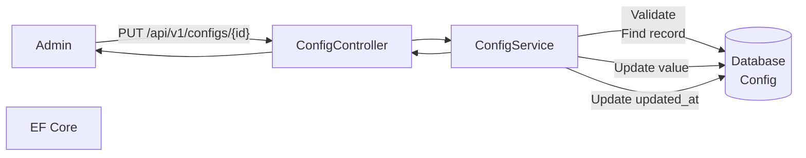
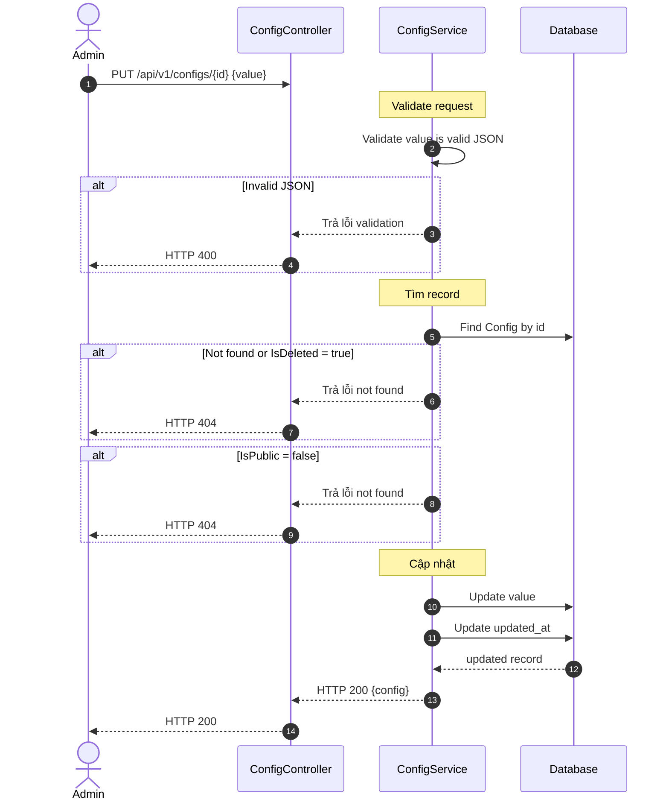
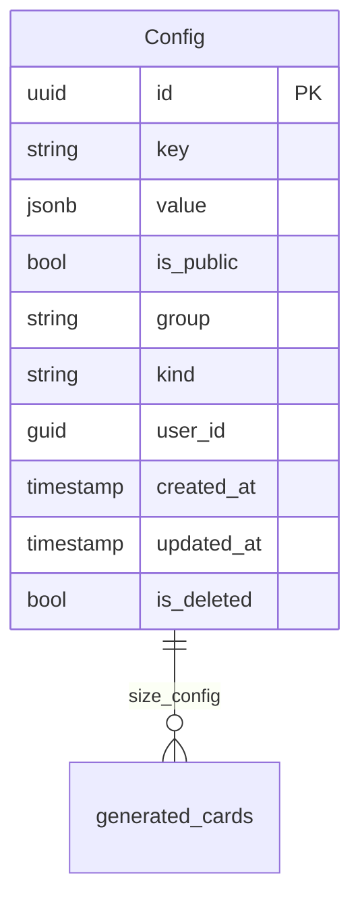

# TDD-062: Cập nhật Card Config

## Thông tin tài liệu
- **Tiêu đề**: Cập nhật cấu hình card
- **Ghi chú**: API cho phép Admin cập nhật value của card config trong bảng Config. Key và Group không được phép thay đổi.

## Metadata quản trị tài liệu
| Trường | Giá trị |
|---|---|
| Mã tài liệu | TDD-062 |
| Phiên bản | v0.3 |
| Author | |
| Reviewer | |
| Approver | Chưa chỉ định |
| Owner | |
| Cập nhật gần nhất | 2026-08-26 |

---

## BƯỚC 1 — Thông tin & Bối cảnh

### Thông tin tài liệu
- **Mã tài liệu**: TDD-062
- **Tính năng**: Cập nhật card config
- **Tác giả**: 
- **Người review**: 
- **Phiên bản**: v0.3
- **Cập nhật (YYYY-MM-DD)**: 2026-08-26
- **Story liên quan**: Không có

### Business Rules
- BR-062-01: Chỉ Admin có quyền cập nhật card config
- BR-062-02: Sử dụng bảng Config có sẵn
- BR-062-03: Key và Group KHÔNG được phép thay đổi
- BR-062-04: Chỉ cập nhật được field `value`
- BR-062-05: Value phải là JSON hợp lệ
- BR-062-06: UpdatedAt được cập nhật khi lưu
- BR-062-07: Không thể cập nhật config có IsDeleted = true (đã xóa mềm)
- BR-062-08: Không thể cập nhật config có IsPublic = false

### Bối cảnh & Mục tiêu

**Vấn đề**
> Admin cần cập nhật giá, kích thước của size hoặc phụ phí calligraphy words. Key và Group không được thay đổi để tránh ảnh hưởng đến các thiệp đã tạo với snapshot.

**Mục tiêu**
- Cập nhật value của card config
- Không cho phép thay đổi Key và Group
- Validate value là JSON hợp lệ
- Cập nhật UpdatedAt

**Ngoài phạm vi** (Out of scope)
- Tạo card config (TDD-055)
- Xóa card config (TDD-056)

---

## BƯỚC 2 — Kiến trúc & Sơ đồ

### Kiến trúc tổng quan (Architecture)
**Tiêu đề**: Trình tự cập nhật card config
**Mô tả**: Admin gọi API → Controller nhận request → Service validate → Cập nhật DB → Trả kết quả



### Sequence Diagram
**Tiêu đề**: Trình tự cập nhật card config
**Mô tả**: Từng bước gọi qua lại giữa các thành phần



### Mô hình dữ liệu (Data Model / ERD)
**Tiêu đề**: Bảng Config
**Mô tả**: Cấu trúc bảng Config



---

## BƯỚC 3 — API

### API Contract nội bộ

#### Endpoint #1: Cập nhật card config
- **Method**: PUT
- **Endpoint**: `/api/v1/configs/{id}`
- **Tên endpoint**: Cập nhật card config
- **Mô tả**: Cập nhật value của card config
- **Quyền**: Chỉ Admin

**Path Parameters:**
| Parameter | Type | Required | Mô tả |
|-----------|------|----------|-------|
| id | uuid | Yes | ID của card config |

**Request Body:**
```json
{
  "value": { ... }
}
```

**Lưu ý:** Key và Group không được truyền trong request - không thể thay đổi.

**Ví dụ 1 — Happy path: Cập nhật giá size_A** — HTTP `200`

Request:
```json
PUT /api/v1/configs/550e8400-e29b-41d4-a716-446655440001
{
  "value": {
    "name": "A",
    "width": 12,
    "height": 18,
    "base_price": 120000,
    "max_words": 120
  }
}
```

Response:
```json
{
  "value": {
    "id": "550e8400-e29b-41d4-a716-446655440001",
    "key": "size_A",
    "value": {
      "name": "A",
      "width": 12,
      "height": 18,
      "base_price": 120000,
      "max_words": 120
    },
    "group": "card_size",
    "kind": "Setting",
    "is_public": true,
    "is_deleted": false,
    "user_id": "...",
    "created_at": "2026-08-26T10:00:00Z",
    "updated_at": "2026-08-26T12:30:00Z"
  }
}
```

**Ví dụ 2 — Happy path: Cập nhật phụ phí calligraphy** — HTTP `200`

Request:
```json
PUT /api/v1/configs/550e8400-e29b-41d4-a716-446655440002
{
  "value": [
    { "min_words": 0, "max_words": 35, "extra_price": 10000 },
    { "min_words": 36, "max_words": 70, "extra_price": 49000 },
    { "min_words": 71, "max_words": 100, "extra_price": 79000 }
  ]
}
```

Response:
```json
{
  "value": {
    "id": "550e8400-e29b-41d4-a716-446655440002",
    "key": "calligraphy_words",
    "value": [
      { "min_words": 0, "max_words": 35, "extra_price": 10000 },
      { "min_words": 36, "max_words": 70, "extra_price": 49000 },
      { "min_words": 71, "max_words": 100, "extra_price": 79000 }
    ],
    "group": "card_config",
    "kind": "Setting",
    "is_public": true,
    "is_deleted": false,
    "created_at": "2026-08-26T10:00:00Z",
    "updated_at": "2026-08-26T12:35:00Z"
  }
}
```

**Ví dụ 3 — Validation: Invalid JSON** — HTTP `400`

Request:
```json
PUT /api/v1/configs/550e8400-e29b-41d4-a716-446655440001
{
  "value": "not valid json {"
}
```

Response:
```json
{
  "error": {
    "code": "VALIDATION_ERROR",
    "message": "Value must be a valid JSON."
  }
}
```

**Ví dụ 4 — Not found** — HTTP `404`

Request:
```json
PUT /api/v1/configs/00000000-0000-0000-0000-000000000000
{
  "value": { ... }
}
```

Response:
```json
{
  "error": {
    "code": "NOT_FOUND",
    "message": "Config not found."
  }
}
```

**Ví dụ 5 — Authorization: Non-admin user** — HTTP `403`

Request:
```json
PUT /api/v1/configs/550e8400-e29b-41d4-a716-446655440001
{
  "value": { ... }
}
```

Response:
```json
{
  "error": {
    "code": "ACCESS_DENIED",
    "message": "Bạn không có quyền thực hiện thao tác này."
  }
}
```

**Ví dụ 6 — Chưa đăng nhập** — HTTP `401`

Request:
```json
PUT /api/v1/configs/550e8400-e29b-41d4-a716-446655440001
{
  "value": { ... }
}
```

Response:
```json
{
  "error": {
    "code": "UNAUTHORIZED",
    "message": "Bạn cần đăng nhập để thực hiện thao tác này."
  }
}
```

#### Mã lỗi
| Code | HTTP | Khi nào xảy ra |
|---|---|---|
| VALIDATION_ERROR | 400 | Value không phải JSON hợp lệ |
| NOT_FOUND | 404 | Cấu hình card không tồn tại, đã bị xóa, hoặc không còn hoạt động |
| ACCESS_DENIED | 403 | Bạn không có quyền cập nhật cấu hình card |
| UNAUTHORIZED | 401 | Bạn cần đăng nhập để thực hiện thao tác này |

---

## BƯỚC 4 — Tham chiếu

> Chú thích: 🔴 Tham chiếu đến (tài liệu này đọc/phụ thuộc) · ⚫ Trỏ vào tài liệu này (tài liệu khác phụ thuộc vào tài liệu này) · ⋯ Bị ảnh hưởng (thay đổi ở đây có thể làm tài liệu kia sai theo)

### 🔴 Tham chiếu đến
- TDD-054 - Lấy danh sách card configs (sử dụng chung bảng)

### ⚫ Trỏ vào tài liệu này
- TDD-055 - Tạo card config
- TDD-054 - Lấy danh sách card configs
- TDD-056 - Xóa card config
- TDD-035 - Tạo thiệp thiết kế AI (sử dụng Config cho pricing)
- TDD-036 - Tạo lại thiệp từ lịch sử (sử dụng Config cho pricing)

### ⋯ Bị ảnh hưởng
- TDD-035, TDD-036 - Thay đổi Config ảnh hưởng đến pricing (nhưng các thiệp đã tạo dùng snapshot nên không bị ảnh hưởng)

---

## Notes

- Key và Group không được truyền trong request - không thể thay đổi
- UpdatedAt tự động cập nhật khi lưu
- Các thiệp đã tạo sử dụng snapshot nên không bị ảnh hưởng khi config thay đổi
- **IsDeleted**: dùng cho xóa mềm (config không tìm thấy khi IsDeleted = true)
- **IsPublic**: dùng để xác định config có đang hoạt động để áp dụng cho người dùng chọn (true = đang hoạt động)
