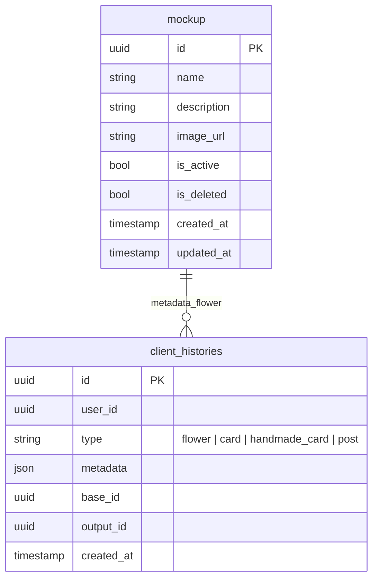

# AI Mockup Context - HTM_Flourist_AI

> Document First Project: hoa-theo-mua-ai-customize
> Date: 2026-08-27
> Last Updated: 2026-09-04

---

## MỤC LỤC

1. [Tổng quan](#1-tổng-quan)
2. [Luồng nghiệp vụ](#2-luồng-nghiệp-vụ)
3. [Database Schema](#3-database-schema)
4. [Quy tắc nghiệp vụ](#4-quy-tắc-nghiệp-vụ)
5. [API Endpoints](#5-api-endpoints)

---

## 1. TỔNG QUAN

### Mô tả
Mockup là hình ảnh dùng làm tham chiếu cho kiểu dáng, bố cục hoa. Mockup được quản lý bởi Admin và sử dụng trong quy trình khởi tạo mẫu hoa.

### Luồng chính
```
┌─────────────────────────────────────────────────────────────────────────────┐
│                      MOCKUP FLOW                                            │
├─────────────────────────────────────────────────────────────────────────────┤
│  Admin Management                                                           │
│      │                                                                      │
│      ▼                                                                      │
│  [STORY-050] "Xem danh sách Mockup"                                     │
│      │                                                                      │
│      ▼                                                                      │
│  [STORY-051] "Thêm Mockup"                                               │
│      │                                                                      │
│      ▼                                                                      │
│  [STORY-052] "Chuyển trạng thái (Active/Inactive)"                       │
│      │                                                                      │
│      ▼                                                                      │
│  [STORY-053] "Xóa Mockup"                                                 │
└─────────────────────────────────────────────────────────────────────────────┘

┌─────────────────────────────────────────────────────────────────────────────┐
│                      CUSTOMER FLOW                                         │
├─────────────────────────────────────────────────────────────────────────────┤
│  Create hoặc Regenerate Flower                                            │
│      │                                                                      │
│      ▼                                                                      │
│  Create/chọn mới → validate live; Regenerate bỏ trống → dùng snapshot cũ │
└─────────────────────────────────────────────────────────────────────────────┘
```

### Stories liên quan
| Story | Tên | Sprint | Priority | Status |
|-------|-----|--------|----------|--------|
| **STORY-050** | Admin xem danh sách Mockup | 1 | Must | Todo |
| **STORY-051** | Admin thêm Mockup | 1 | Must | Todo |
| **STORY-052** | Admin chuyển trạng thái Mockup | 1 | Must | Todo |
| **STORY-053** | Admin xóa Mockup | 1 | Must | Todo |

---

## 2. LUỒNG NGHIỆP VỤ

### STORY-050: Admin xem danh sách Mockup

#### Metadata
- **Story**: Là một Admin có quyền quản lý Mockup, tôi muốn xem danh sách Mockup để theo dõi thông tin và trạng thái của các Mockup đang được quản lý trong hệ thống.
- **Context**: Mockup được quản lý tại Core Database và được sử dụng trong quy trình khởi tạo mẫu hoa.
- **Sprint**: 1
- **Priority**: Must

#### Điều kiện

**Preconditions:**
- Admin đã đăng nhập
- Admin có quyền quản lý Mockup

**Trigger:**
Admin truy cập chức năng "Quản lý Mockup".

### STORY-051: Admin thêm Mockup

#### Metadata
- **Story**: Là một Admin có quyền quản lý Mockup, tôi muốn thêm Mockup mới để bổ sung Mockup cho hệ thống và cho phép khách hàng sử dụng trong quy trình khởi tạo mẫu hoa.
- **Context**: Mockup được quản lý tại Core Database và được sử dụng trong quy trình khởi tạo mẫu hoa.
- **Sprint**: 1
- **Priority**: Must

#### Điều kiện

**Preconditions:**
- Admin đã đăng nhập
- Admin có quyền quản lý Mockup

**Trigger:**
Admin chọn chức năng "Thêm Mockup".

#### Thông tin Mockup mới

| Trường | Bắt buộc | Ràng buộc |
|--------|----------|------------|
| Tên Mockup | ✓ | Tối đa 50 ký tự, không chỉ chứa khoảng trắng |
| Mô tả | ✗ | Tối đa 200 ký tự |
| Ảnh Mockup | ✓ | PNG hoặc JPG, tối đa 10MB |

### STORY-052: Admin chuyển trạng thái Mockup

#### Metadata
- **Story**: Là một Admin có quyền quản lý Mockup, tôi muốn chuyển trạng thái Mockup giữa Hoạt động và Không hoạt động để kiểm soát Mockup nào được phép hiển thị cho khách hàng trong quy trình khởi tạo mẫu hoa.
- **Context**: Mockup có hai trạng thái: **Hoạt động** (khả dụng cho khách hàng) và **Không hoạt động** (không hiển thị cho khách hàng).
- **Sprint**: 1
- **Priority**: Must

#### Trạng thái Mockup

| Trạng thái | Mô tả |
|-------------|--------|
| Hoạt động (Active) | Mockup khả dụng cho khách hàng |
| Không hoạt động (Inactive) | Mockup không hiển thị cho khách hàng |

### STORY-053: Admin xóa Mockup

#### Metadata
- **Story**: Là một Admin có quyền quản lý Mockup, tôi muốn xóa Mockup để loại bỏ Mockup không còn sử dụng khỏi danh sách quản lý và không cho khách hàng tiếp tục chọn trong quy trình tạo mẫu hoa mới.
- **Context**: Mockup được quản lý tại Core Database và được sử dụng trong quy trình khởi tạo mẫu hoa.
- **Sprint**: 1
- **Priority**: Must

#### Xóa mềm
- Sử dụng xóa mềm (soft delete) với trường `is_deleted`
- Không xóa vật lý dữ liệu
- Không xóa vật lý ảnh Preview

#### Hành vi Mockup đã xóa mềm

| Hành vi | Mô tả |
|---------|--------|
| Hiển thị | Không hiển thị trong danh sách Mockup mặc định của Admin |
| Khách hàng | Không hiển thị cho khách hàng trong quy trình tạo mẫu hoa mới |
| Sử dụng | Không được chọn cho request Flower mới hoặc làm Mockup được chọn mới khi Regenerate; snapshot lịch sử vẫn được dùng lại khi client không chọn Mockup |
| Dữ liệu | Vẫn giữ dữ liệu, ảnh Preview, snapshot trong `generated_flowers`/`client_histories` và kết quả lịch sử |

---

## 3. DATABASE SCHEMA

### mockup

```sql
Table mockup {
  id uuid [pk]
  name varchar(50)                  -- Tên Mockup (1-50 ký tự)
  description text                   -- Mô tả (tối đa 200 ký tự, nullable)
  image_url varchar                  -- URL ảnh Mockup
  is_active boolean                 -- Trạng thái: true=Hoạt động, false=Không hoạt động
  is_deleted boolean                -- Xóa mềm: true=đã xóa, false=chưa xóa
  created_at timestamp
  updated_at timestamp
}
```

### ERD Diagram



---

## 4. QUY TẮC NGHIỆP VỤ

### 4.1 Hiển thị danh sách Mockup (STORY-050)

- **BR-012-01**: Cùng `GET /api/mockups` phục vụ theo role và chỉ trả Mockup có `is_deleted = false`
- **BR-012-02**: Admin thấy cả Active/Inactive và được filter `is_active`; Customer luôn chỉ thấy Active, kể cả khi truyền filter khác
- **BR-012-03**: Danh sách được sắp xếp theo `created_at` giảm dần (mới nhất trước)
- **BR-012-04**: Hỗ trợ phân trang với các tùy chọn: 5, 10, 20, 30, 40, 50 dòng/trang
- **BR-012-05**: Mặc định hiển thị 10 dòng/trang

### 4.2 Thêm Mockup (STORY-051)

- **BR-013-01**: Tên Mockup bắt buộc, từ 1 đến 50 ký tự sau khi trim
- **BR-013-02**: Tên Mockup không chỉ chứa khoảng trắng
- **BR-013-03**: Mô tả tùy chọn, tối đa 200 ký tự
- **BR-013-04**: Ảnh Mockup bắt buộc, định dạng PNG hoặc JPG
- **BR-013-05**: Kích thước file ảnh tối đa 10MB
- **BR-013-06**: Mockup mới được tạo với `is_active = true` (mặc định)
- **BR-013-07**: Mockup mới được tạo với `is_deleted = false`

### 4.3 Chuyển trạng thái Mockup (STORY-052)

- **BR-014-01**: Mockup Active (`is_active = true`) có thể chuyển sang Inactive
- **BR-014-02**: Mockup Inactive (`is_active = false`) có thể chuyển sang Active
- **BR-014-03**: Chỉ Admin có quyền mới được phép chuyển trạng thái
- **BR-014-04**: Mockup Inactive không hiển thị cho khách hàng
- **BR-014-05**: Request Flower mới kiểm tra trạng thái Mockup đúng một lần tại admission; thay đổi trạng thái sau snapshot không ảnh hưởng request đang chạy
- **BR-014-06**: Regenerate Flower chỉ kiểm tra live khi client truyền ID Mockup khác nguồn; bỏ trống/null/đúng ID nguồn thì dùng Mockup snapshot nguồn dù record live đã inactive

### 4.4 Xóa Mockup (STORY-053)

- **BR-015-01**: Sử dụng xóa mềm với `is_deleted = true`
- **BR-015-02**: Không xóa vật lý dữ liệu hoặc ảnh
- **BR-015-03**: Mockup đã xóa không hiển thị trong danh sách mặc định
- **BR-015-04**: Mockup đã xóa không hiển thị cho khách hàng
- **BR-015-05**: Dữ liệu và liên kết với yêu cầu đã tồn tại được giữ nguyên
- **BR-015-06**: Request Flower mới kiểm tra `is_deleted` đúng một lần tại admission; không revalidate trước persist/history
- **BR-015-07**: Soft-delete không vô hiệu hóa Mockup snapshot của Flower lịch sử. Regenerate bỏ trống/null/đúng ID nguồn dùng snapshot đó mà không query record live; nếu client chọn ID khác nguồn thì Mockup mới đã xóa trả `MOCKUP_DELETED/410`

### 4.5 Validation boundary của Generate/Regenerate Flower

- Create Flower và Regenerate có ID Mockup khác nguồn đều validate theo thứ tự cố định: không tồn tại → `MOCKUP_NOT_FOUND/404`; `is_deleted=true` → `MOCKUP_DELETED/410`; chưa xóa nhưng `is_active=false` → `MOCKUP_INACTIVE/409`.
- Regenerate bỏ trống/null hoặc truyền đúng ID Mockup nguồn dùng nguyên snapshot của Flower nguồn, không query live và không kiểm tra active/soft-delete. Trạng thái record Mockup nguồn không chặn flow này.
- Khi hợp lệ, service đóng băng metadata và nội dung ảnh bằng bytes đã tải hoặc `url + object_key/version_id + sha256` trong `generated_flowers.input_snapshot` và `client_histories.metadata` trước AI.
- AI và mọi retry dùng cùng snapshot; không tải lại URL live và không query lại Mockup.
- Admin inactive/soft-delete Mockup sau admission không được hủy AI, retry, gắn logo, persist `generated_flowers` hoặc persist history.
- Generated Flower đã thành công vẫn được xem và dùng tạo Card dù Mockup gốc đổi trạng thái. Mockup không phải dependency tồn kho và không được dùng để chặn Checkout/Order.
- Không có bảng `flower_requests`; toàn bộ Flower/Card history là các record phân loại bởi `client_histories.type`.

---

## 5. API ENDPOINTS

### MOCKUP CRUD (STORY-050, 051, 052, 053)

| Story | Chức năng | Method | Route | Ghi chú |
|-------|-----------|--------|-------|----------|
| STORY-050, STORY-030 | Lấy danh sách Mockup | GET | `/api/mockups` | Cùng route theo role: Admin thấy active/inactive; Customer chỉ thấy active |
| STORY-051 | Thêm Mockup | POST | `/api/mockups` | Upload ảnh |
| STORY-052 | Chuyển trạng thái | PATCH | `/api/mockups/{id}/status` | Toggle Active/Inactive |
| STORY-053 | Xóa Mockup | DELETE | `/api/mockups/{id}` | Xóa mềm |

---

## TDDs liên quan

### Mockup CRUD
- TDD-012: Lấy danh sách Mockup
- TDD-013: Thêm Mockup
- TDD-014: Chuyển trạng thái Mockup
- TDD-015: Xóa Mockup

---

## Ghi chú quan trọng

- **Mockup là nguồn tham chiếu**: Dùng làm tham chiếu cho kiểu dáng, bố cục hoa
- **Trạng thái Active/Inactive**: Kiểm soát Mockup nào được hiển thị cho khách hàng
- **Xóa mềm**: Không xóa vật lý, giữ nguyên dữ liệu lịch sử
- **Kiểm tra trạng thái**: Create và Regenerate chọn ID Mockup khác nguồn kiểm tra `is_active`/`is_deleted` một lần tại admission; Regenerate bỏ trống/null/đúng ID nguồn dùng snapshot nguồn không kiểm tra live; không revalidate sau snapshot
