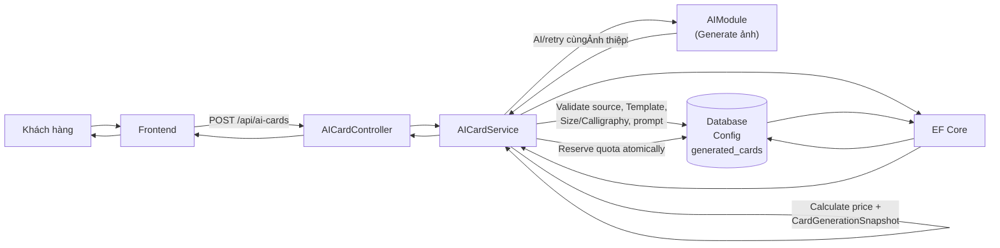
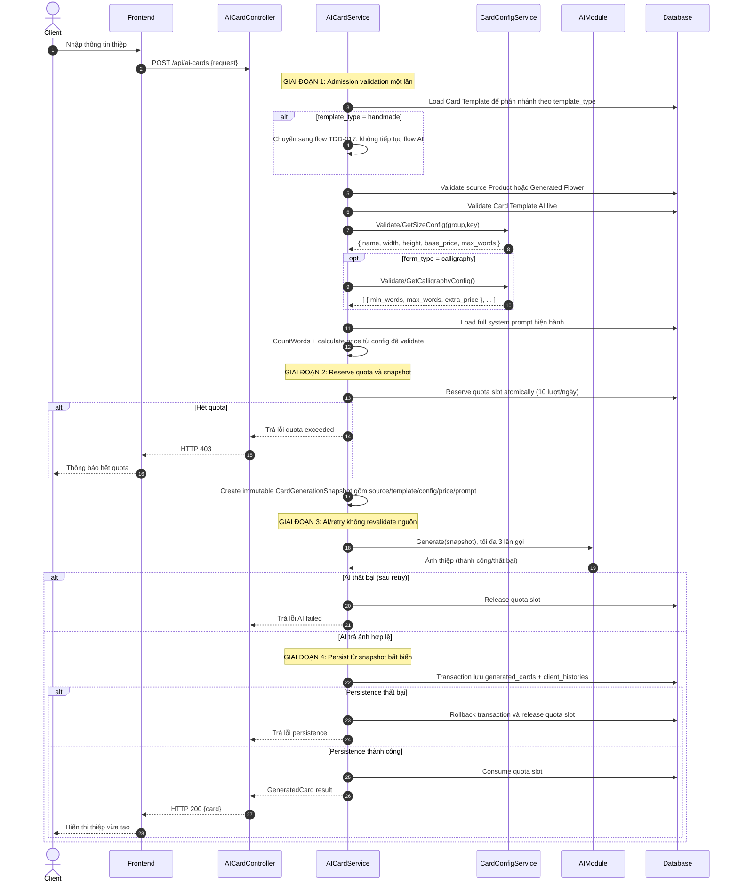
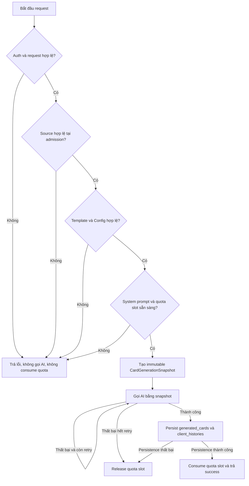
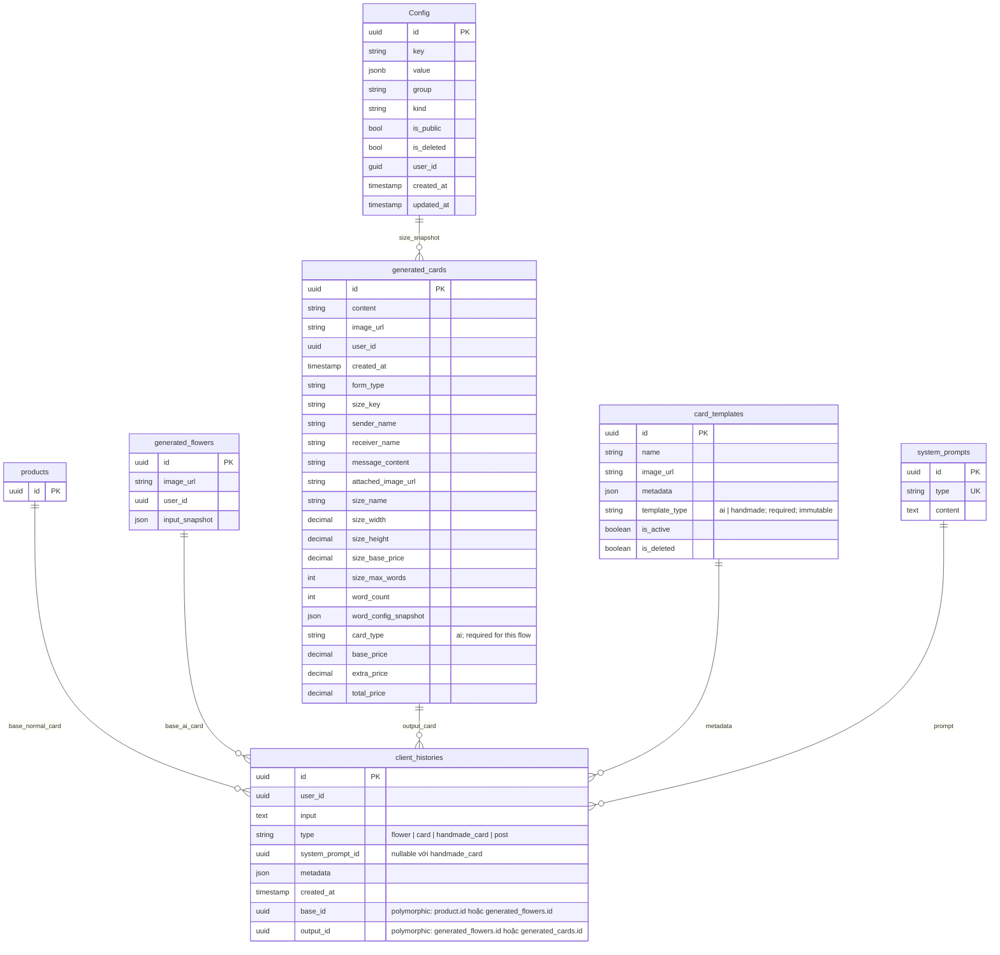

# TDD-006: Tạo thiệp thiết kế AI

## Thông tin tài liệu
- **Tiêu đề**: Tạo thiệp thiết kế AI cho khách hàng
- **Ghi chú**: API cho phép khách hàng tạo thiệp thiết kế mới với thông tin cá nhân hóa (người gửi, người nhận, lời chúc) và hình thức (gõ máy/calligraphy). Tính toán giá dựa trên cấu hình size và phụ phí calligraphy từ bảng Config. **Mối quan hệ với hoa được xác định qua `client_histories`, không qua `generated_cards.source_flower_id`**.

## Metadata quản trị tài liệu
| Trường | Giá trị |
|---|---|
| Mã tài liệu | TDD-006 |
| Phiên bản | v0.7 |
| Author | Codex |
| Reviewer | |
| Approver | Chưa chỉ định |
| Owner | Nhóm Hoa Theo Mùa |
| Cập nhật gần nhất | 2026-09-04 |

---

## BƯỚC 1 — Thông tin & Bối cảnh

### Thông tin tài liệu
- **Mã tài liệu**: TDD-006
- **Tính năng**: Tạo thiệp thiết kế AI
- **Tác giả**: Codex
- **Người review**: 
- **Phiên bản**: v0.7
- **Cập nhật (YYYY-MM-DD)**: 2026-09-04
- **Story liên quan**:
  - STORY-035

### Business Rules
- BR-006-01: Size config được lấy chính xác theo `(Group="card_size", Key="size_{size}")`; phải tồn tại, IsDeleted=false, IsPublic=true và không ambiguous, chứa name, width, height, base_price, max_words
- BR-006-02: Calligraphy config được lấy chính xác theo `(Group="card_config", Key="calligraphy_words")`; phải tồn tại, IsDeleted=false, IsPublic=true và không ambiguous, chứa mảng JSON rule min_words, max_words, extra_price
- BR-006-03: Chỉ Calligraphy mới có phụ phí theo số từ, Gõ máy không phụ phí
- BR-006-04: Tìm rule phù hợp trong calligraphy_words config bằng điều kiện `min_words <= word_count <= max_words`; nếu word_count vẫn hợp lệ theo Size Config nhưng không khớp bất kỳ rule nào thì trả `VALIDATION_ERROR/400`, không mặc định phụ phí bằng 0
- BR-006-05: Tổng giá = Base Price + Extra Price (nếu có)
- BR-006-06: Khi tạo thiệp, lưu snapshot tất cả thông tin ảnh hưởng đến giá: size config, word config snapshot
- BR-006-07: Sau dependency validation, hệ thống reserve atomically quota slot tạo thiệp (tối đa 10/ngày) trước snapshot/AI
- BR-006-08: Khi AI và persistence thành công, consume đúng một quota slot và tạo client_histories
- BR-006-09: Khi AI thất bại sau một lần đầu + tối đa hai retry, hoặc persistence rollback, release quota slot
- BR-006-10: client_histories chỉ được tạo khi có ảnh hợp lệ (thành công)
- **BR-006-12: base_id trong client_histories được xác định như sau:**
  - Nếu có `generated_flower_id` (thiệp cho bó hoa AI): base_id = generated_flower_id
  - Ngược lại (thiệp cho bó hoa bình thường): base_id = product.id (combo không có biến thể HOẶC biến thể là con của biến thể cha)
- **BR-006-13: output_id trong client_histories = generated_cards.id**
- **BR-006-14: metadata trong client_histories = snapshot/provenance đầy đủ của Card, bao gồm card_template**
- **BR-006-15: type trong client_histories = "card"**
- **BR-006-16**: Endpoint dùng thứ tự `auth/request → load Template để phân nhánh`. Với `template_type="ai"`, thứ tự tiếp theo là `source Product hoặc Generated Flower → validate Template AI → Size Config → Calligraphy Config → system prompt → quota → CardGenerationSnapshot → AI`; chỉ validate dependency một lần tại admission.
- **BR-006-17**: Product source validate theo thứ tự `PRODUCT_NOT_FOUND/404` → `PRODUCT_DELETED/410` → `PRODUCT_INACTIVE/409` → `PRODUCT_OUT_OF_STOCK/409`; `no_formula|no_core` → `PRODUCT_NOT_SELLABLE/422`; calculation error → `PRODUCT_AVAILABILITY_UNAVAILABLE/503`.
- **BR-006-18**: Nếu Product cha có biến thể, request bắt buộc truyền ID biến thể được chọn; Card Create tính quantity đúng biến thể, không dùng max của Product cha. Parent active chỉ được kiểm tra ở Order theo policy đã chốt.
- **BR-006-19**: Generated Flower source chỉ validate tồn tại + ownership (khác owner trả 404) + dữ liệu ảnh. Không revalidate Product/Mockup gốc. Thiếu ảnh → `GENERATED_FLOWER_INPUT_INVALID/409`.
- **BR-006-20**: Generated Flower legacy thiếu record `client_histories(type=flower)` vẫn được tạo Card khi thuộc user và đủ ảnh; Card metadata ghi `origin_product_id=null`, `provenance_status=unavailable`; Order chặn `SOURCE_PRODUCT_PROVENANCE_INVALID/409`.
- **BR-006-21**: Endpoint load Template theo ID trước; không có record trả `CARD_TEMPLATE_NOT_FOUND/404`. `template_type="ai"` tiếp tục TDD-006 và validate `CARD_TEMPLATE_DELETED/410` → `CARD_TEMPLATE_INACTIVE/409`; `template_type="handmade"` chuyển sang TDD-017 trong cùng endpoint.
- **BR-006-22**: Size Config validate `CARD_SIZE_CONFIG_NOT_FOUND/404` → `CARD_SIZE_CONFIG_DELETED/410` → `CARD_SIZE_CONFIG_INACTIVE/409`; Calligraphy validate độc lập bằng `CALLIGRAPHY_CONFIG_NOT_FOUND/404`, `..._DELETED/410`, `..._INACTIVE/409`.
- **BR-006-23**: Nhiều Config active/chưa xóa cùng `(group,key)` → `CARD_CONFIG_AMBIGUOUS/409`, không chọn ngẫu nhiên.
- **BR-006-24**: Tạo immutable `CardGenerationSnapshot` gồm source, template/config, bytes/version/hash ảnh, full prompt, `validated_at` UTC và provenance trước AI. AI/retry dùng cùng snapshot; không query lại dependency.
- **BR-006-25**: Dependency đổi trạng thái sau snapshot không hủy request hoặc persist. Admission fail thì không AI, record/history hay consume quota.
- **BR-006-26**: Record `client_histories(type=card).metadata` có `schema_version=2`, `source_type`, `origin_product_id`, `generated_flower_id`, `provenance_status`, template/config/prompt snapshot.
- **BR-006-27**: Mỗi `system_prompts.type` chỉ có đúng một prompt hiện hành. Card Create dùng prompt type `card`; record thiếu hoặc content rỗng/không hợp lệ trả `SYSTEM_PROMPT_INVALID/409` vì Create không có prompt snapshot nguồn để fallback.
- **BR-006-28**: Card AI thành công lưu `generated_cards.card_type="ai"` và `client_histories.type="card"`. `client_histories.type` là string, không phải DB enum.

### Bối cảnh & Mục tiêu

**Vấn đề**
> Khách hàng cần tạo thiệp thiết kế AI với thông tin cá nhân hóa (tên người gửi, người nhận, lời chúc) và chọn hình thức (gõ máy/calligraphy). Hệ thống cần lấy cấu hình giá từ bảng Config có sẵn (Group="card_size", Group="card_config", Kind="Setting"), tính giá chính xác và lưu snapshot tại thời điểm tạo.

**Mục tiêu**
- Tạo thiệp mới với đầy đủ thông tin
- Lấy cấu hình size và calligraphy từ bảng Config
- Tính toán và lưu giá (base_price, extra_price, total_price) vào DB
- Lưu snapshot: size_name, size_width, size_height, size_base_price, size_max_words, word_config_snapshot
- Kiểm tra và quản lý quota tạo thiệp (10 lượt/ngày/khách hàng)
- Tạo client_histories khi có ảnh hợp lệ
- Reserve quota atomically; success consume, AI/persistence fail release

**Ngoài phạm vi** (Out of scope)
- AI generation thực tế (được tách trong module riêng)
- Retry logic khi AI thất bại (được xử lý trong AI module)
- Tạo Order tự động sau khi xác nhận thiệp
- Bảng trung gian Card ↔ Order

---

## BƯỚC 2 — Kiến trúc & Sơ đồ

### Kiến trúc tổng quan (Architecture)
**Tiêu đề**: Trình tự tạo thiệp thiết kế AI
**Mô tả**: Client gọi API → validate source/Template/Config/prompt live → reserve quota atomically → tính giá và tạo immutable CardGenerationSnapshot → AI/retry dùng snapshot → transaction lưu Card/history → consume quota; lỗi AI/persistence thì release slot.



### Sequence Diagram
**Tiêu đề**: Trình tự tạo thiệp thiết kế AI
**Mô tả**: Từng bước gọi qua lại giữa các thành phần



### Activity Diagram

**Tiêu đề**: Ranh giới validation và snapshot khi tạo Card
**Mô tả**: Sơ đồ tách rõ các nhánh admission failure khỏi request đã được chấp nhận. Mọi lần gọi AI và retry sau snapshot đều không truy vấn lại trạng thái live của dependency.



### State Diagram

- **Không áp dụng**: TDD này mô tả vòng đời của một request đồng bộ và kết quả bất biến, không định nghĩa state machine cho entity chính.

### Mô hình dữ liệu (Data Model / ERD)
**Tiêu đề**: Các bảng liên quan đến tạo thiệp
**Mô tả**: Config (bảng có sẵn), generated_cards, client_histories (polymorphic)



**LƯU Ý:** `generated_cards` KHÔNG có trường `source_flower_id`. Mối quan hệ với bó hoa được xác định qua `client_histories.base_id`:
- Thiệp cho bó hoa bình thường: `base_id = products.id`
- Thiệp cho bó hoa AI: `base_id = generated_flowers.id`

---

## BƯỚC 3 — API

### API Contract nội bộ

#### Endpoint #1: Tạo thiệp thiết kế AI
- **Method**: POST
- **Endpoint**: `/api/ai-cards`
- **Tên endpoint**: Tạo thiệp thiết kế AI
- **Mô tả**: Tạo thiệp thiết kế mới với thông tin cá nhân hóa và tính giá từ config

**Request Body:**
| Field | Type | Required | Mô tả |
|-------|------|---------|-------|
| card_template_id | uuid | Có | Template thiệp |
| size | string | Có | Kích thước: "A", "B", "C" |
| form_type | string | Có | Hình thức: "go_may", "calligraphy" |
| sender_name | string | Có | Người gửi (tối đa 20 từ) |
| receiver_name | string | Có | Người nhận (tối đa 20 từ) |
| message_content | string | Có | Lời chúc (tối đa 100 từ) |
| attached_image_url | string? | Không | Ảnh đính kèm |
| product_id | uuid | Không | Combo nguồn (khi thiệp cho bó hoa bình thường) |
| generated_flower_id | uuid | Không | Bó hoa AI nguồn (khi thiệp cho bó hoa AI) |

**Ghi chú:** Phải cung cấp `product_id` HOẶC `generated_flower_id`, không được cả hai cùng lúc.

**Ví dụ 1 — Happy path: Tạo thiệp Gõ máy cho bó hoa bình thường** — HTTP `200`

Request:
```json
POST /api/ai-cards
{
  "card_template_id": "550e8400-e29b-41d4-a716-446655440001",
  "size": "A",
  "form_type": "go_may",
  "sender_name": "Nguyễn An",
  "receiver_name": "Trần Bình",
  "message_content": "Chúc bạn sinh nhật vui vẻ",
  "attached_image_url": null,
  "product_id": "440e8400-e29b-41d4-a716-446655440010"
}
```

Response:
```json
{
  "value": {
    "id": "660e8400-e29b-41d4-a716-446655440002",
    "content": "...",
    "image_url": "https://storage.example.com/cards/660e8400.png",
    "user_id": "770e8400-e29b-41d4-a716-446655440003",
    "created_at": "2026-08-27T10:30:00Z",
    "form_type": "go_may",
    "size_key": "size_A",
    "sender_name": "Nguyễn An",
    "receiver_name": "Trần Bình",
    "message_content": "Chúc bạn sinh nhật vui vẻ",
    "attached_image_url": null,
    "size_name": "A",
    "size_width": 10,
    "size_height": 15,
    "size_base_price": 100000,
    "size_max_words": 100,
    "word_count": 5,
    "word_config_snapshot": null,
    "base_price": 100000,
    "extra_price": 0,
    "total_price": 100000
  }
}
```

**Ví dụ 2 — Happy path: Tạo thiệp Calligraphy cho bó hoa AI** — HTTP `200`

Request:
```json
POST /api/ai-cards
{
  "card_template_id": "550e8400-e29b-41d4-a716-446655440001",
  "size": "B",
  "form_type": "calligraphy",
  "sender_name": "Nguyễn An",
  "receiver_name": "Trần Bình",
  "message_content": "Nhân dịp sinh nhật bạn, tôi xin gửi đến bạn những lời chúc tốt đẹp nhất. Chúc bạn luôn hạnh phúc, khỏe mạnh và thành công trong cuộc sống.",
  "attached_image_url": "https://storage.example.com/images/flower-001.jpg",
  "generated_flower_id": "880e8400-e29b-41d4-a716-446655440005"
}
```

**Ví dụ 3 — Happy path: Tạo thiệp Calligraphy (36-70 từ)** — HTTP `200`

Request:
```json
POST /api/ai-cards
{
  "card_template_id": "550e8400-e29b-41d4-a716-446655440001",
  "size": "B",
  "form_type": "calligraphy",
  "sender_name": "Nguyễn An",
  "receiver_name": "Trần Bình",
  "message_content": "Nhân dịp sinh nhật bạn, tôi xin gửi đến bạn những lời chúc tốt đẹp nhất. Chúc bạn luôn hạnh phúc, khỏe mạnh và thành công trong cuộc sống.",
  "product_id": "440e8400-e29b-41d4-a716-446655440010"
}
```

Response:
```json
{
  "value": {
    "id": "660e8400-e29b-41d4-a716-446655440002",
    "image_url": "https://storage.example.com/cards/660e8400.png",
    "form_type": "calligraphy",
    "size_key": "size_B",
    "size_name": "B",
    "size_width": 15,
    "size_height": 20,
    "size_base_price": 150000,
    "size_max_words": 150,
    "word_count": 42,
    "word_config_snapshot": {
      "min_words": 36,
      "max_words": 70,
      "extra_price": 39000
    },
    "base_price": 150000,
    "extra_price": 39000,
    "total_price": 189000
  }
}
```

**Ví dụ 4 — Hết quota tạo thiệp trong ngày** — HTTP `403`

Response:
```json
{
  "error": {
    "code": "FORBIDDEN",
    "message": "Bạn đã sử dụng hết 10 lượt tạo thiệp AI trong ngày."
  }
}
```

**Ví dụ 5 — AI thất bại sau retry** — HTTP `500`

Response:
```json
{
  "error": {
    "code": "INTERNAL_SERVER_ERROR",
    "message": "Không thể tạo ảnh thiệp. Vui lòng thử lại sau."
  }
}
```

**Ví dụ 6 — Chưa đăng nhập** — HTTP `401`

Response:
```json
{
  "error": {
    "code": "UNAUTHORIZED",
    "message": "Bạn cần đăng nhập để thực hiện thao tác này."
  }
}
```

**Ví dụ 7 — Card Template không tồn tại** — HTTP `404`

Request:
```json
POST /api/ai-cards
{
  "card_template_id": "00000000-0000-0000-0000-000000000000",
  "size": "A",
  "form_type": "go_may",
  "sender_name": "Nguyễn An",
  "receiver_name": "Trần Bình",
  "message_content": "Chúc bạn sinh nhật vui vẻ",
  "product_id": "440e8400-e29b-41d4-a716-446655440010"
}
```

Response:
```json
{
  "error": {
    "code": "CARD_TEMPLATE_NOT_FOUND",
    "message": "Card template không tồn tại."
  }
}
```

**Ví dụ 8 — Size Config không tồn tại** — HTTP `404`

Dữ liệu live tại admission không có record Config cho exact `Group="card_size"`, `Key="size_A"`, `Kind="Setting"`. Giá trị `size="A"` vẫn hợp lệ ở request validation nên request đi tới đúng nhánh lookup Size Config.

Request:
```json
POST /api/ai-cards
{
  "card_template_id": "550e8400-e29b-41d4-a716-446655440001",
  "size": "A",
  "form_type": "go_may",
  "sender_name": "Nguyễn An",
  "receiver_name": "Trần Bình",
  "message_content": "Chúc bạn sinh nhật vui vẻ",
  "product_id": "440e8400-e29b-41d4-a716-446655440010"
}
```

Response:
```json
{
  "error": {
    "code": "CARD_SIZE_CONFIG_NOT_FOUND",
    "message": "Size config không tồn tại."
  }
}
```

**Ví dụ 9 — Không truyền product_id và generated_flower_id** — HTTP `400`

Request:
```json
POST /api/ai-cards
{
  "card_template_id": "550e8400-e29b-41d4-a716-446655440001",
  "size": "A",
  "form_type": "go_may",
  "sender_name": "Nguyễn An",
  "receiver_name": "Trần Bình",
  "message_content": "Chúc bạn sinh nhật vui vẻ"
}
```

Response:
```json
{
  "error": {
    "code": "VALIDATION_ERROR",
    "message": "Phải cung cấp product_id hoặc generated_flower_id."
  }
}
```

**Ví dụ 10 — Cả product_id và generated_flower_id đều truyền** — HTTP `400`

Request:
```json
POST /api/ai-cards
{
  "card_template_id": "550e8400-e29b-41d4-a716-446655440001",
  "size": "A",
  "form_type": "go_may",
  "sender_name": "Nguyễn An",
  "receiver_name": "Trần Bình",
  "message_content": "Chúc bạn sinh nhật vui vẻ",
  "product_id": "440e8400-e29b-41d4-a716-446655440010",
  "generated_flower_id": "880e8400-e29b-41d4-a716-446655440005"
}
```

Response:
```json
{
  "error": {
    "code": "VALIDATION_ERROR",
    "message": "Chỉ được cung cấp product_id hoặc generated_flower_id, không được cả hai."
  }
}
```

**Ví dụ 11 — Size không hợp lệ** — HTTP `400`

Request:
```json
POST /api/ai-cards
{
  "card_template_id": "550e8400-e29b-41d4-a716-446655440001",
  "size": "X",
  "form_type": "go_may",
  "sender_name": "Nguyễn An",
  "receiver_name": "Trần Bình",
  "message_content": "Chúc bạn sinh nhật vui vẻ",
  "product_id": "440e8400-e29b-41d4-a716-446655440010"
}
```

Response:
```json
{
  "error": {
    "code": "VALIDATION_ERROR",
    "message": "Size không hợp lệ. Vui lòng chọn A, B hoặc C."
  }
}
```

**Ví dụ 12 — Form type không hợp lệ** — HTTP `400`

Request:
```json
POST /api/ai-cards
{
  "card_template_id": "550e8400-e29b-41d4-a716-446655440001",
  "size": "A",
  "form_type": "invalid",
  "sender_name": "Nguyễn An",
  "receiver_name": "Trần Bình",
  "message_content": "Chúc bạn sinh nhật vui vẻ",
  "product_id": "440e8400-e29b-41d4-a716-446655440010"
}
```

Response:
```json
{
  "error": {
    "code": "VALIDATION_ERROR",
    "message": "Form type không hợp lệ. Vui lòng chọn go_may hoặc calligraphy."
  }
}
```

**Ví dụ 13 — Message vượt max_words** — HTTP `400`

Request:
```json
POST /api/ai-cards
{
  "card_template_id": "550e8400-e29b-41d4-a716-446655440001",
  "size": "A",
  "form_type": "go_may",
  "sender_name": "Nguyễn An",
  "receiver_name": "Trần Bình",
  "message_content": "Chúc bạn sinh nhật vui vẻ với rất nhiều lời chúc tốt đẹp và ý nghĩa cho một ngày đặc biệt trong năm mà chúng ta cùng nhau đón mừng và chia sẻ niềm vui với gia đình và bạn bè thân yêu của mình trong suốt quãng đời dài phía trước",
  "product_id": "440e8400-e29b-41d4-a716-446655440010"
}
```

Response:
```json
{
  "error": {
    "code": "VALIDATION_ERROR",
    "message": "Số từ trong lời chúc vượt quá giới hạn cho phép."
  }
}
```

**Ví dụ 14 — Sender name quá dài** — HTTP `400`

Request:
```json
POST /api/ai-cards
{
  "card_template_id": "550e8400-e29b-41d4-a716-446655440001",
  "size": "A",
  "form_type": "go_may",
  "sender_name": "Nguyễn Văn A B C D E F G H I J K L M N O P Q R S T U V W X Y Z",
  "receiver_name": "Trần Bình",
  "message_content": "Chúc bạn sinh nhật vui vẻ",
  "product_id": "440e8400-e29b-41d4-a716-446655440010"
}
```

Response:
```json
{
  "error": {
    "code": "VALIDATION_ERROR",
    "message": "Tên người gửi không được vượt quá 20 từ."
  }
}
```

+**Ví dụ 15 — Product không tồn tại** — HTTP `404`

Request:
```json
POST /api/ai-cards
{
  "card_template_id": "template-001",
  "size": "A",
  "form_type": "calligraphy",
  "sender_name": "Nguyễn An",
  "receiver_name": "Trần Bình",
  "message_content": "Chúc bạn sinh nhật vui vẻ",
  "product_id": "product-variant-a"
}
```

Response:
```json
{
  "error": {
    "code": "PRODUCT_NOT_FOUND",
    "message": "Không tìm thấy sản phẩm nguồn."
  }
}
```

**Ví dụ 16 — Product đã soft-delete** — HTTP `410`

Request:
```json
POST /api/ai-cards
{
  "card_template_id": "template-001",
  "size": "A",
  "form_type": "calligraphy",
  "sender_name": "Nguyễn An",
  "receiver_name": "Trần Bình",
  "message_content": "Chúc bạn sinh nhật vui vẻ",
  "product_id": "product-variant-a"
}
```

Response:
```json
{
  "error": {
    "code": "PRODUCT_DELETED",
    "message": "Sản phẩm nguồn đã bị ngừng cung cấp."
  }
}
```

**Ví dụ 17 — Product inactive** — HTTP `409`

Request:
```json
POST /api/ai-cards
{
  "card_template_id": "template-001",
  "size": "A",
  "form_type": "calligraphy",
  "sender_name": "Nguyễn An",
  "receiver_name": "Trần Bình",
  "message_content": "Chúc bạn sinh nhật vui vẻ",
  "product_id": "product-variant-a"
}
```

Response:
```json
{
  "error": {
    "code": "PRODUCT_INACTIVE",
    "message": "Sản phẩm nguồn hiện đang tạm ngưng bán."
  }
}
```

**Ví dụ 18 — Product hết hàng** — HTTP `409`

Request:
```json
POST /api/ai-cards
{
  "card_template_id": "template-001",
  "size": "A",
  "form_type": "calligraphy",
  "sender_name": "Nguyễn An",
  "receiver_name": "Trần Bình",
  "message_content": "Chúc bạn sinh nhật vui vẻ",
  "product_id": "product-variant-a"
}
```

Response:
```json
{
  "error": {
    "code": "PRODUCT_OUT_OF_STOCK",
    "message": "Sản phẩm nguồn hiện đã hết hàng."
  }
}
```

**Ví dụ 19 — Product không có formula usable** — HTTP `422`

Dữ liệu live tại admission: `CalculateAvailableQty(product-variant-a)` trả `UnavailableReason="no_formula"`.

Request:
```json
POST /api/ai-cards
{
  "card_template_id": "template-001",
  "size": "A",
  "form_type": "calligraphy",
  "sender_name": "Nguyễn An",
  "receiver_name": "Trần Bình",
  "message_content": "Chúc bạn sinh nhật vui vẻ",
  "product_id": "product-variant-a"
}
```

Response:
```json
{
  "error": {
    "code": "PRODUCT_NOT_SELLABLE",
    "message": "Sản phẩm hiện chưa đủ điều kiện để bán."
  }
}
```

**Ví dụ 19A — Product không có CORE usable** — HTTP `422`

Dữ liệu live tại admission: `CalculateAvailableQty(product-variant-a)` trả `UnavailableReason="no_core"`.

Request:
```json
POST /api/ai-cards
{
  "card_template_id": "template-001",
  "size": "A",
  "form_type": "calligraphy",
  "sender_name": "Nguyễn An",
  "receiver_name": "Trần Bình",
  "message_content": "Chúc bạn sinh nhật vui vẻ",
  "product_id": "product-variant-a"
}
```

Response:
```json
{
  "error": {
    "code": "PRODUCT_NOT_SELLABLE",
    "message": "Sản phẩm hiện chưa đủ điều kiện để bán vì không có CORE usable."
  }
}
```

**Ví dụ 20 — Không tính được tồn kho Product** — HTTP `503`

Request:
```json
POST /api/ai-cards
{
  "card_template_id": "template-001",
  "size": "A",
  "form_type": "calligraphy",
  "sender_name": "Nguyễn An",
  "receiver_name": "Trần Bình",
  "message_content": "Chúc bạn sinh nhật vui vẻ",
  "product_id": "product-variant-a"
}
```

Response:
```json
{
  "error": {
    "code": "PRODUCT_AVAILABILITY_UNAVAILABLE",
    "message": "Chưa thể xác minh tồn kho sản phẩm. Vui lòng thử lại sau."
  }
}
```

**Ví dụ 21 — Generated Flower không tồn tại** — HTTP `404`

Request:
```json
POST /api/ai-cards
{
  "card_template_id": "template-001",
  "size": "A",
  "form_type": "calligraphy",
  "sender_name": "Nguyễn An",
  "receiver_name": "Trần Bình",
  "message_content": "Chúc bạn sinh nhật vui vẻ",
  "generated_flower_id": "flower-missing"
}
```

Response:
```json
{
  "error": {
    "code": "GENERATED_FLOWER_NOT_FOUND",
    "message": "Không tìm thấy mẫu hoa AI thuộc quyền sử dụng của bạn."
  }
}
```

**Ví dụ 21A — Generated Flower thuộc user khác** — HTTP `404`

Dữ liệu live tại admission: `flower-other-user.UserId="user-002"`, trong khi user hiện tại là `user-001`.

Request:
```json
POST /api/ai-cards
{
  "card_template_id": "template-001",
  "size": "A",
  "form_type": "calligraphy",
  "sender_name": "Nguyễn An",
  "receiver_name": "Trần Bình",
  "message_content": "Chúc bạn sinh nhật vui vẻ",
  "generated_flower_id": "flower-other-user"
}
```

Response:
```json
{
  "error": {
    "code": "GENERATED_FLOWER_NOT_FOUND",
    "message": "Không tìm thấy mẫu hoa AI thuộc quyền sử dụng của bạn."
  }
}
```

**Ví dụ 22 — Generated Flower thiếu dữ liệu ảnh** — HTTP `409`

Request:
```json
POST /api/ai-cards
{
  "card_template_id": "template-001",
  "size": "A",
  "form_type": "calligraphy",
  "sender_name": "Nguyễn An",
  "receiver_name": "Trần Bình",
  "message_content": "Chúc bạn sinh nhật vui vẻ",
  "generated_flower_id": "flower-without-image"
}
```

Response:
```json
{
  "error": {
    "code": "GENERATED_FLOWER_INPUT_INVALID",
    "message": "Mẫu hoa AI không có dữ liệu ảnh hợp lệ để tạo thiệp."
  }
}
```

**Ví dụ 23 — Card Template đã soft-delete** — HTTP `410`

Request:
```json
POST /api/ai-cards
{
  "card_template_id": "template-001",
  "size": "A",
  "form_type": "calligraphy",
  "sender_name": "Nguyễn An",
  "receiver_name": "Trần Bình",
  "message_content": "Chúc bạn sinh nhật vui vẻ",
  "product_id": "product-variant-a"
}
```

Response:
```json
{
  "error": {
    "code": "CARD_TEMPLATE_DELETED",
    "message": "Mẫu thiệp đã bị ngừng cung cấp."
  }
}
```

**Ví dụ 24 — Card Template inactive** — HTTP `409`

Request:
```json
POST /api/ai-cards
{
  "card_template_id": "template-001",
  "size": "A",
  "form_type": "calligraphy",
  "sender_name": "Nguyễn An",
  "receiver_name": "Trần Bình",
  "message_content": "Chúc bạn sinh nhật vui vẻ",
  "product_id": "product-variant-a"
}
```

Response:
```json
{
  "error": {
    "code": "CARD_TEMPLATE_INACTIVE",
    "message": "Mẫu thiệp hiện đang tạm ngưng sử dụng."
  }
}
```

**Ví dụ 25 — Size Config đã soft-delete** — HTTP `410`

Request:
```json
POST /api/ai-cards
{
  "card_template_id": "template-001",
  "size": "A",
  "form_type": "calligraphy",
  "sender_name": "Nguyễn An",
  "receiver_name": "Trần Bình",
  "message_content": "Chúc bạn sinh nhật vui vẻ",
  "product_id": "product-variant-a"
}
```

Response:
```json
{
  "error": {
    "code": "CARD_SIZE_CONFIG_DELETED",
    "message": "Cấu hình kích thước đã bị xóa."
  }
}
```

**Ví dụ 26 — Size Config inactive** — HTTP `409`

Request:
```json
POST /api/ai-cards
{
  "card_template_id": "template-001",
  "size": "A",
  "form_type": "calligraphy",
  "sender_name": "Nguyễn An",
  "receiver_name": "Trần Bình",
  "message_content": "Chúc bạn sinh nhật vui vẻ",
  "product_id": "product-variant-a"
}
```

Response:
```json
{
  "error": {
    "code": "CARD_SIZE_CONFIG_INACTIVE",
    "message": "Cấu hình kích thước hiện đang bị ngưng."
  }
}
```

**Ví dụ 27 — Calligraphy Config không tồn tại** — HTTP `404`

Request:
```json
POST /api/ai-cards
{
  "card_template_id": "template-001",
  "size": "A",
  "form_type": "calligraphy",
  "sender_name": "Nguyễn An",
  "receiver_name": "Trần Bình",
  "message_content": "Chúc bạn sinh nhật vui vẻ",
  "product_id": "product-variant-a"
}
```

Response:
```json
{
  "error": {
    "code": "CALLIGRAPHY_CONFIG_NOT_FOUND",
    "message": "Không tìm thấy cấu hình Calligraphy."
  }
}
```

**Ví dụ 28 — Calligraphy Config đã soft-delete** — HTTP `410`

Request:
```json
POST /api/ai-cards
{
  "card_template_id": "template-001",
  "size": "A",
  "form_type": "calligraphy",
  "sender_name": "Nguyễn An",
  "receiver_name": "Trần Bình",
  "message_content": "Chúc bạn sinh nhật vui vẻ",
  "product_id": "product-variant-a"
}
```

Response:
```json
{
  "error": {
    "code": "CALLIGRAPHY_CONFIG_DELETED",
    "message": "Cấu hình Calligraphy đã bị xóa."
  }
}
```

**Ví dụ 29 — Calligraphy Config inactive** — HTTP `409`

Request:
```json
POST /api/ai-cards
{
  "card_template_id": "template-001",
  "size": "A",
  "form_type": "calligraphy",
  "sender_name": "Nguyễn An",
  "receiver_name": "Trần Bình",
  "message_content": "Chúc bạn sinh nhật vui vẻ",
  "product_id": "product-variant-a"
}
```

Response:
```json
{
  "error": {
    "code": "CALLIGRAPHY_CONFIG_INACTIVE",
    "message": "Cấu hình Calligraphy hiện đang bị ngưng."
  }
}
```

**Ví dụ 30 — Config active trùng exact group và key** — HTTP `409`

Request:
```json
POST /api/ai-cards
{
  "card_template_id": "template-001",
  "size": "A",
  "form_type": "calligraphy",
  "sender_name": "Nguyễn An",
  "receiver_name": "Trần Bình",
  "message_content": "Chúc bạn sinh nhật vui vẻ",
  "product_id": "product-variant-a"
}
```

Response:
```json
{
  "error": {
    "code": "CARD_CONFIG_AMBIGUOUS",
    "message": "Có nhiều cấu hình đang hoạt động cho cùng group và key."
  }
}
```

#### Mã lỗi
| Code | HTTP | Khi nào xảy ra |
|---|---|---|
| VALIDATION_ERROR | 400 | Request thiếu hoặc sai field bắt buộc, size/form_type không hợp lệ, message vượt max_words, tên người gửi quá dài hoặc Calligraphy word_count không khớp rule giá nào dù vẫn hợp lệ theo Size Config |
| PRODUCT_NOT_FOUND | 404 | Không có Product nguồn |
| PRODUCT_DELETED | 410 | Product đã soft-delete |
| PRODUCT_INACTIVE | 409 | Product inactive |
| PRODUCT_OUT_OF_STOCK | 409 | Đúng Product/variant đã hết hàng |
| PRODUCT_NOT_SELLABLE | 422 | Combo thiếu formula/CORE usable |
| PRODUCT_AVAILABILITY_UNAVAILABLE | 503 | Không tính được tồn kho |
| GENERATED_FLOWER_NOT_FOUND | 404 | Flower không tồn tại hoặc không thuộc user |
| GENERATED_FLOWER_INPUT_INVALID | 409 | Flower thiếu dữ liệu ảnh dùng cho AI |
| CARD_TEMPLATE_NOT_FOUND | 404 | Không có Card Template |
| CARD_TEMPLATE_DELETED | 410 | Card Template đã soft-delete |
| CARD_TEMPLATE_INACTIVE | 409 | Card Template inactive |
| CARD_SIZE_CONFIG_NOT_FOUND | 404 | Không có Size Config theo exact group/key |
| CARD_SIZE_CONFIG_DELETED | 410 | Size Config đã xóa |
| CARD_SIZE_CONFIG_INACTIVE | 409 | Size Config IsPublic=false |
| CALLIGRAPHY_CONFIG_NOT_FOUND | 404 | Không có Calligraphy Config |
| CALLIGRAPHY_CONFIG_DELETED | 410 | Calligraphy Config đã xóa |
| CALLIGRAPHY_CONFIG_INACTIVE | 409 | Calligraphy Config IsPublic=false |
| SYSTEM_PROMPT_INVALID | 409 | Prompt hiện hành type `card` không tồn tại hoặc content rỗng/không hợp lệ |
| CARD_CONFIG_AMBIGUOUS | 409 | Nhiều Config active cùng exact group/key |
| FORBIDDEN | 403 | Bạn đã sử dụng hết 10 lượt tạo thiệp thiết kế AI trong ngày |
| UNAUTHORIZED | 401 | Bạn cần đăng nhập để thực hiện thao tác này |
| INTERNAL_SERVER_ERROR | 500 | Không thể tạo thiệp thiết kế AI. Vui lòng thử lại sau |

### API Contract bên ngoài

- **Endpoints sử dụng**: Không áp dụng ở mức TDD này. AI Module là module nội bộ; nhà cung cấp AI và endpoint bên thứ ba chưa được xác định trong codebase.
- **Field quan trọng**: AI Module chỉ nhận immutable generation snapshot đã được tạo sau khi toàn bộ dependency vượt qua validation tại request admission.
- **Xử lý lỗi từ đối tác**: Một lần gọi đầu và tối đa hai lần retry dùng cùng snapshot và cùng quota slot; hết retry thì release quota slot và không tạo kết quả/history.
- **Quirks / cạm bẫy**: Không được tải lại ảnh, prompt hoặc query lại trạng thái dependency live trong retry.

---

## BƯỚC 4 — Tham chiếu

> Chú thích: 🔴 Tham chiếu đến (tài liệu này đọc/phụ thuộc) · ⚫ Trỏ vào tài liệu này (tài liệu khác phụ thuộc vào tài liệu này) · ⋯ Bị ảnh hưởng (thay đổi ở đây có thể làm tài liệu kia sai theo)

### 🔴 Tham chiếu đến
- AIModule - Module xử lý AI generation (tách riêng)
- Config Entity - Bảng Config có sẵn cho card_size và card_config
- Product Entity - Lấy thông tin combo nguồn
- generated_flowers Entity - Khi thiệp cho bó hoa AI
- card_templates Entity - Lấy thông tin template cho AI
- TDD-017 - Cùng endpoint nhưng xử lý Template `handmade`, không gọi AI
- system_prompts Entity - Lấy prompt cho AI type="card"

### ⚫ Trỏ vào tài liệu này
- TDD-007 - Tạo lại thiệp từ lịch sử (sử dụng lại generated_cards và quota logic)
- AI_DB_Diagram - Tham chiếu cấu trúc client_histories
- AI_Card_Context - Tham chiếu input cho AI Module

### ⋯ Bị ảnh hưởng
- ST-035-05-01 - System Test: Hiển thị giá tạm tính theo Size và Hình thức
- ST-035-10-01 - System Test: Retry và hoàn lượt khi AI không tạo được ảnh
