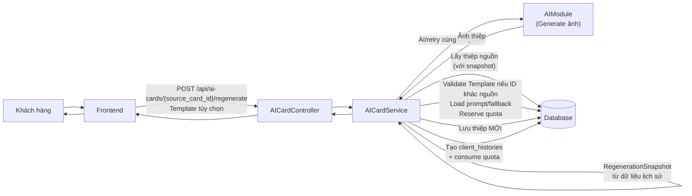
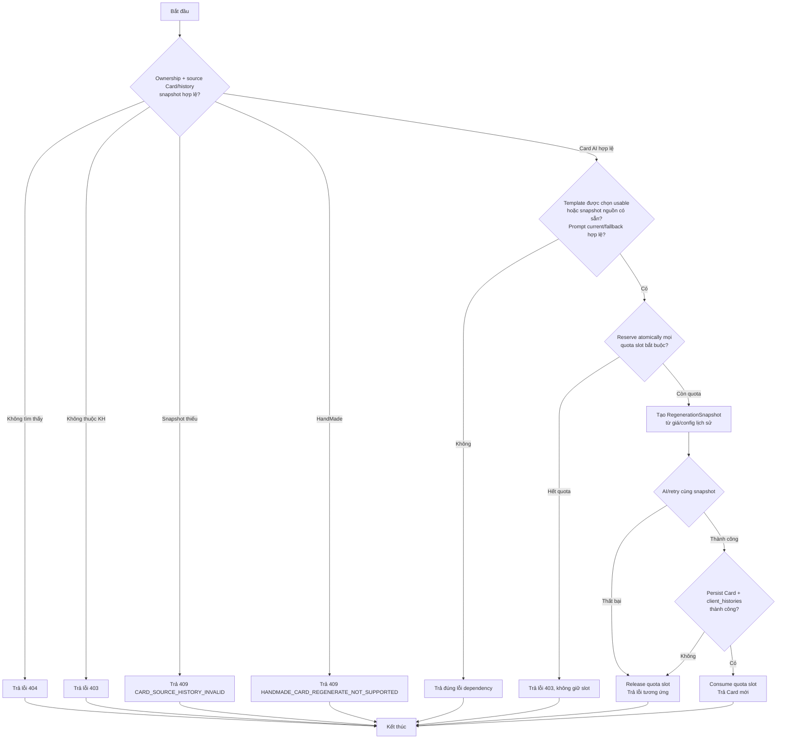
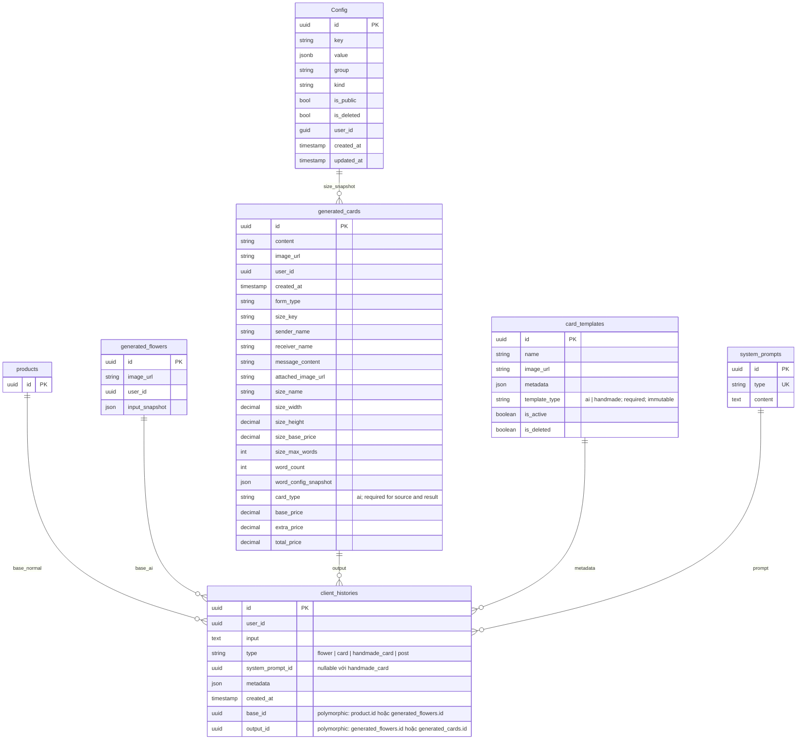

# TDD-007: Tạo lại thiệp từ lịch sử

## Thông tin tài liệu
- **Tiêu đề**: Tạo lại thiệp thiết kế AI từ lịch sử
- **Ghi chú**: API cho phép khách hàng tạo lại thiệp từ một thiệp thuộc lịch sử của mình. Hệ thống giữ nguyên nội dung, nguồn hoa, size, giá và Config snapshot của Card nguồn; người dùng có thể chọn Template khác hoặc để trống để dùng Template nguồn. Có giới hạn quota riêng theo mẫu hoa (3 lần/ngày cho mỗi mẫu hoa đã generate). **Mối quan hệ với hoa được xác định qua `client_histories`, không qua `generated_cards.source_flower_id`**.

## Metadata quản trị tài liệu
| Trường | Giá trị |
|---|---|
| Mã tài liệu | TDD-007 |
| Phiên bản | v0.7 |
| Author | Codex |
| Reviewer | |
| Approver | Chưa chỉ định |
| Owner | Nhóm Hoa Theo Mùa |
| Cập nhật gần nhất | 2026-09-04 |

---

## BƯỚC 1 — Thông tin & Bối cảnh

### Thông tin tài liệu
- **Mã tài liệu**: TDD-007
- **Tính năng**: Tạo lại thiệp từ lịch sử
- **Tác giả**: Codex
- **Người review**: 
- **Phiên bản**: v0.7
- **Cập nhật (YYYY-MM-DD)**: 2026-09-04
- **Story liên quan**:
  - STORY-036

### Business Rules
- BR-007-01: Khi tạo lại, hệ thống giữ nguyên sender, receiver, message, ảnh đính kèm, form type, size, giá, Config snapshot và lineage của Card nguồn; Template được xác định riêng theo BR-007-02.
- BR-007-02: Không mở form chỉnh sửa nội dung. `card_template_id` là tùy chọn: null, không truyền hoặc đúng ID nguồn thì dùng Template snapshot nguồn; ID khác thì dùng Template AI mới sau validation. Người dùng được chọn lại Template AI cũ hoặc Template AI khác, không được chuyển sang HandMade.
- BR-007-03: `source_card_id` bắt buộc tồn tại, thuộc khách hàng hiện tại và có history `type="card"`. History `type="handmade_card"` không được tạo lại.
- BR-007-04: base_id trong client_histories mới được xác định từ client_histories cũ của thiệp nguồn
- BR-007-05: Thiệp mới sử dụng snapshot config từ thiệp nguồn (`size_name`, `size_width`, `size_height`, `size_base_price`, `size_max_words`, `word_config_snapshot`) và không query/validate Config live.
- BR-007-06: Trước khi gọi AI, kiểm tra theo thứ tự:
  - user và source card ownership
  - source Card + record `client_histories(type=card)` + snapshot
  - Effective Template: validate live chỉ khi client chọn ID khác nguồn; bỏ trống/null/đúng ID nguồn thì dùng Template snapshot nguồn, không query trạng thái live
  - system prompt hiện hành hợp lệ; nếu không có hoặc content rỗng/không hợp lệ thì fallback sang full prompt snapshot của Card nguồn
  - atomically reserve quota tạo thiệp (10/ngày) và quota theo mẫu hoa (3/mẫu/ngày) nếu có flower base; sau đó tạo immutable regeneration snapshot
- BR-007-07: Mỗi mẫu hoa đã generate ra chỉ được tạo tối đa 3 lần/ngày
- BR-007-08: Khi tạo thành công:
  - Consume 1 quota slot tạo thiệp
  - Consume 1 quota slot theo mẫu hoa (nếu có flower base)
  - Tạo client_histories mới với base_id và output_id tương ứng
  - Tạo record generated_cards mới (KHÔNG ghi đè thiệp nguồn)
- BR-007-09: Reserve quota atomically sau dependency validation; một lần đầu + tối đa 2 retry dùng cùng snapshot/slot; success consume, AI/persistence fail release
- BR-007-10: client_histories chỉ được tạo khi có ảnh hợp lệ
- BR-007-11: Thiệp nguồn KHÔNG bị xóa hoặc ghi đè
- BR-007-12: Kết quả mới không tự động gắn vào Checkout (vì thao tác từ lịch sử)
- **BR-007-13: base_id trong client_histories mới = base_id của client_histories thiệp nguồn**
- **BR-007-14: output_id trong client_histories mới = id thiệp mới vừa tạo**
- **BR-007-15**: Nếu client bỏ trống/null hoặc truyền đúng ID Template nguồn, dùng nguyên Template snapshot nguồn và không query/validate active hay soft-delete. Chỉ khi client chọn ID Template khác nguồn, validate Template mới theo `CARD_TEMPLATE_NOT_FOUND/404` → `CARD_TEMPLATE_DELETED/410` → `CARD_TEMPLATE_INACTIVE/409`, sau đó bắt buộc `template_type="ai"`; chọn Template HandMade trả `CARD_TEMPLATE_TYPE_INVALID/409`. Trạng thái Template cũ không chặn request. Mọi Template AI tương thích với mọi size/form type.
- **BR-007-16**: Regenerate không query hoặc validate Size/Calligraphy Config live; snapshot Card nguồn phải tự chứa đủ dữ liệu cần dùng.
- **BR-007-17**: Template mới hợp lệ tại admission nhưng bị inactive/soft-delete khi AI chạy không ảnh hưởng retry/persist; không revalidate sau snapshot. Template snapshot nguồn được dùng khi request bỏ trống/null/đúng ID nguồn không có bước kiểm tra live.
- **BR-007-18**: Regenerate dùng nguyên nội dung, giá và Config snapshot của Card nguồn; Template snapshot lấy từ Effective Template.
- **BR-007-19**: Product/Mockup gốc inactive, deleted hoặc out-of-stock không chặn Regenerate; chỉ Order kiểm tra Product live.
- **BR-007-20**: Card nguồn không có snapshot đủ dùng → `CARD_SOURCE_HISTORY_INVALID/409`. Với Card tạo từ Generated Flower thiếu provenance nhưng snapshot Card đủ, vẫn regenerate và giữ `origin_product_id=null`, `provenance_status=unavailable`.
- **BR-007-22**: Mỗi `system_prompts.type` có đúng một prompt hiện hành. Ưu tiên prompt hiện hành type `card`; record không tồn tại hoặc content rỗng/không hợp lệ đều được xem là không khả dụng và phải fallback sang full prompt snapshot của Card nguồn, không kiểm tra trạng thái record nguồn. Metadata ghi `system_prompt_source=current|source_card_fallback`.
- **BR-007-23**: Card mới có ID, ảnh và `created_at` mới, lấy `user_id` từ phiên đăng nhập; không sao chép identity/audit/output của Card nguồn.
- **BR-007-24**: History mới ghi `input={operation,source_card_id,card_template_id}`; metadata giữ snapshot đã dùng và bổ sung `operation=regenerate`, `regenerated_from_card_id`. `base_id` vẫn kế thừa history nguồn.
- **BR-007-25**: Source history `type="handmade_card"` trả `HANDMADE_CARD_REGENERATE_NOT_SUPPORTED/409` trước khi kiểm Template/quota/AI.

### Bối cảnh & Mục tiêu

**Vấn đề**
> Khách hàng muốn tạo phiên bản mới của một thiệp AI đã có mà không cần nhập lại nội dung, nhưng có thể đổi Template AI. Hệ thống giữ nguyên snapshot config/giá và lineage; HandMade Card không thuộc flow này.

**Mục tiêu**
- Tạo thiệp mới từ thiệp nguồn mà không cần form chỉnh sửa nội dung; chỉ cho phép chọn Template
- Giữ nguyên thông tin: sender_name, receiver_name, message_content, attached_image_url, form_type, size_key, và các snapshot giá
- Kiểm tra và quản lý quota (10 lượt/ngày + 3 lượt/mẫu hoa/ngày)
- Không ghi đè hoặc xóa thiệp nguồn
- Ghi nhận source card và lineage trong `client_histories.metadata`; không có column `source_flower_id`
- Không phụ thuộc trạng thái live của Product/Mockup/Config nguồn khi regenerate

**Ngoài phạm vi** (Out of scope)
- AI generation thực tế (được tách trong module riêng)
- Chi tiết implementation của nhà cung cấp AI; TDD chỉ quy định tối đa ba lần gọi bằng cùng snapshot
- Tự động gắn kết quả vào Checkout
- Chỉnh sửa thông tin khác ngoài Template trước khi tạo lại

---

## BƯỚC 2 — Kiến trúc & Sơ đồ

### Kiến trúc tổng quan (Architecture)
**Tiêu đề**: Trình tự tạo lại thiệp từ lịch sử
**Mô tả**: Client gọi API với Template tùy chọn → xác thực ownership/source snapshot và chặn HandMade → dùng Template snapshot nguồn nếu bỏ trống/null/đúng ID nguồn hoặc validate live Template AI có ID khác → lấy prompt hiện hành hợp lệ hoặc fallback prompt nguồn → reserve quota → tạo immutable RegenerationSnapshot → AI/retry cùng snapshot → persist Card/history mới → consume quota; lỗi thì release.



### Sequence Diagram
**Tiêu đề**: Trình tự tạo lại thiệp từ lịch sử
**Mô tả**: Từng bước gọi qua lại giữa các thành phần

```mermaid
sequenceDiagram
    autonumber
    actor Client
    participant FE as Frontend
    participant C as AICardController
    participant S as AICardService
    participant AI as AIModule
    participant DB as Database

    Client->>FE: Chọn "Tạo lại" và có thể chọn Template
    FE->>C: POST /api/ai-cards/{source_card_id}/regenerate

    Note over S: GIAI ĐOẠN 1: Admission validation một lần
    S->>DB: Xác thực ownership; load source Card + client_histories snapshot
    alt Thiệp nguồn không tồn tại
        S-->>C: Trả lỗi not found
        C-->>FE: HTTP 404
    end
    alt Thiệp nguồn không thuộc khách hàng
        S-->>C: Trả lỗi unauthorized
        C-->>FE: HTTP 403
    end
    alt History nguồn là handmade_card
        S-->>C: HANDMADE_CARD_REGENERATE_NOT_SUPPORTED/409
        C-->>FE: HTTP 409
    end
    alt Client chọn ID Template khác nguồn
        S->>DB: Validate Template mới live
    else Bỏ trống/null/đúng ID nguồn
        S->>S: Dùng Template snapshot nguồn, không query live
    end
    S->>DB: Load System Prompt hiện hành hợp lệ; nếu thiếu/rỗng/invalid thì dùng prompt snapshot nguồn

    Note over S: GIAI ĐOẠN 2: Reserve quota và snapshot
    S->>DB: Atomically reserve daily slot + flower slot nếu base là GeneratedFlower
    alt Bất kỳ quota bắt buộc nào đã hết
        S-->>C: Trả lỗi quota tương ứng, không giữ slot nào
        C-->>FE: HTTP 403
    end
    S->>S: Tạo immutable RegenerationSnapshot từ dữ liệu/giá/Config nguồn + Effective Template + prompt thực tế

    Note over S: GIAI ĐOẠN 3: AI/retry không revalidate dependency
    S->>AI: Generate(regeneration snapshot), tối đa 3 lần gọi
    AI-->>S: Ảnh thiệp (thành công/thất bại)

    alt AI thất bại (sau retry)
        S->>DB: Release mọi quota slot đã reserve
        S-->>C: Trả lỗi AI failed
    else AI trả ảnh hợp lệ
        Note over S: GIAI ĐOẠN 4: Persist từ RegenerationSnapshot đã đóng băng
        S->>DB: Transaction lưu Card MỚI + client_histories
        alt Persistence thất bại
            S->>DB: Rollback và release mọi quota slot
            S-->>C: Trả lỗi persistence
        else Persistence thành công
            S->>DB: Consume daily slot + flower slot nếu có
            S-->>C: GeneratedCard result
            C-->>FE: HTTP 200 {card}
            FE-->>Client: Hiển thị thiệp mới (source giữ nguyên)
        end
    end
```

### Activity Diagram
**Tiêu đề**: Quy trình tạo lại thiệp từ lịch sử
**Mô tả**: Sơ đồ quyết định khi tạo lại thiệp



### State Diagram

- **Không áp dụng**: Regenerate tạo một generated_cards mới và không thay đổi trạng thái Card nguồn; TDD này không định nghĩa state machine cho entity.

### Mô hình dữ liệu (Data Model / ERD)
**Tiêu đề**: Các bảng liên quan đến tạo lại thiệp
**Mô tả**: Config (bảng có sẵn), generated_cards (nguồn và mới), client_histories (polymorphic)



**LƯU Ý:** `generated_cards` KHÔNG có trường `source_flower_id`. Mối quan hệ với bó hoa được xác định qua `client_histories.base_id`:
- Thiệp cho bó hoa bình thường: `base_id = products.id`
- Thiệp cho bó hoa AI: `base_id = generated_flowers.id`

Khi tạo lại:
- `base_id` mới = `base_id` cũ của thiệp nguồn
- `output_id` mới = id thiệp mới vừa tạo
- `client_histories.input` mới = `{ "operation": "regenerate", "source_card_id": "...", "card_template_id": "uuid-or-null" }`
- `client_histories.metadata` giữ lineage/giá/Config snapshot nguồn, thay bằng Effective Template snapshot và bổ sung `operation="regenerate"`, `regenerated_from_card_id`, `system_prompt_source`.

---

## BƯỚC 3 — API

### API Contract nội bộ

#### Endpoint #1: Tạo lại thiệp từ lịch sử
- **Method**: POST
- **Endpoint**: `/api/ai-cards/{source_card_id}/regenerate`
- **Tên endpoint**: Tạo lại thiệp từ lịch sử
- **Mô tả**: Tạo Card mới từ Card nguồn, giữ nguyên nội dung/giá/Config snapshot và cho phép chọn Template khác

**Request Body:**

```json
{
  "card_template_id": "uuid-or-null"
}
```

`card_template_id` là tùy chọn. Null, bỏ field, body rỗng hoặc truyền đúng ID Template nguồn thì dùng Template snapshot nguồn mà không validate live. Chỉ ID khác nguồn mới được validate như Template mới và Template đó bắt buộc có `template_type="ai"`.

Mỗi type có đúng một System Prompt hiện hành. Regenerate dùng prompt hiện hành type `card` nếu record tồn tại và content hợp lệ. Khi record không tồn tại hoặc content rỗng/không hợp lệ, service dùng full prompt snapshot của Card nguồn mà không kiểm tra trạng thái record nguồn; nếu snapshot cũng thiếu/không hợp lệ thì trả `CARD_SOURCE_HISTORY_INVALID/409`.

**Ví dụ 1 — Happy path: Tạo lại thành công** — HTTP `200`

Request:
```http
POST /api/ai-cards/550e8400-e29b-41d4-a716-446655440001/regenerate

{}
```

Response:
```json
{
  "value": {
    "id": "880e8400-e29b-41d4-a716-446655440099",
    "content": "...",
    "image_url": "https://storage.example.com/cards/880e8400.png",
    "user_id": "770e8400-e29b-41d4-a716-446655440003",
    "created_at": "2026-08-26T11:00:00Z",
    "form_type": "go_may",
    "size_key": "size_A",
    "sender_name": "Nguyễn An",
    "receiver_name": "Trần Bình",
    "message_content": "Chúc bạn sinh nhật vui vẻ",
    "attached_image_url": null,
    "size_name": "A",
    "size_width": 10,
    "size_height": 15,
    "size_base_price": 100000,
    "size_max_words": 100,
    "word_count": 5,
    "word_config_snapshot": null,
    "base_price": 100000,
    "extra_price": 0,
    "total_price": 100000
  }
}
```

**Ghi chú:** Thiệp nguồn (id: 550e8400...) vẫn tồn tại trong DB với snapshot giá cũ, không bị ghi đè.

**Ví dụ 2 — Happy path: Chọn Template khác** — HTTP `200`

Request:
```http
POST /api/ai-cards/550e8400-e29b-41d4-a716-446655440001/regenerate
Content-Type: application/json

{
  "card_template_id": "660e8400-e29b-41d4-a716-446655440010"
}
```

Kết quả giữ nguyên nội dung, size, giá và Config snapshot của Card nguồn; `metadata.card_template` là snapshot Template mới và `metadata.regenerated_from_card_id` là ID Card nguồn. Trạng thái Template cũ không được dùng để chặn request.

**Ví dụ 3 — Happy path: Tạo lại thiệp Calligraphy từ mẫu hoa** — HTTP `200`

Request:
```http
POST /api/ai-cards/550e8400-e29b-41d4-a716-446655440002/regenerate

{}
```

Response:
```json
{
  "value": {
    "id": "990e8400-e29b-41d4-a716-446655440100",
    "form_type": "calligraphy",
    "size_key": "size_B",
    "sender_name": "Hoàng Thị Lan",
    "receiver_name": "Lê Văn Minh",
    "message_content": "Chúc mừng năm mới...",
    "attached_image_url": "https://storage.example.com/images/flower-002.jpg",
    "size_name": "B",
    "size_width": 15,
    "size_height": 20,
    "size_base_price": 150000,
    "size_max_words": 150,
    "word_count": 45,
    "word_config_snapshot": {
      "min_words": 36,
      "max_words": 70,
      "extra_price": 39000
    },
    "base_price": 150000,
    "extra_price": 39000,
    "total_price": 189000
  }
}
```

**Ví dụ 4 — Thiệp nguồn không tồn tại** — HTTP `404`

Request:
```
POST /api/ai-cards/00000000-0000-0000-0000-000000000000/regenerate
```

Response:
```json
{
  "error": {
    "code": "CARD_NOT_FOUND",
    "message": "Thiệp không tồn tại."
  }
}
```

**Ví dụ 5 — Thiệp nguồn không thuộc khách hàng** — HTTP `403`

Request:
```
POST /api/ai-cards/550e8400-e29b-41d4-a716-446655440003/regenerate
```

Response:
```json
{
  "error": {
    "code": "ACCESS_DENIED",
    "message": "Bạn không có quyền truy cập thiệp này."
  }
}
```

**Ví dụ 6 — Hết quota tạo thiệp trong ngày** — HTTP `403`

Request:
```
POST /api/ai-cards/550e8400-e29b-41d4-a716-446655440001/regenerate
```

Response:
```json
{
  "error": {
    "code": "FORBIDDEN",
    "message": "Bạn đã sử dụng hết 10 lượt tạo thiệp AI trong ngày."
  }
}
```

**Ví dụ 7 — Hết quota theo mẫu hoa** — HTTP `403`

Request:
```
POST /api/ai-cards/550e8400-e29b-41d4-a716-446655440001/regenerate
```

Response:
```json
{
  "error": {
    "code": "FORBIDDEN",
    "message": "Bạn đã sử dụng hết số lượt tạo thiệp cho mẫu hoa này."
  }
}
```

**Ví dụ 8 — AI thất bại sau retry** — HTTP `500`

Response:
```json
{
  "error": {
    "code": "INTERNAL_SERVER_ERROR",
    "message": "Không thể tạo ảnh thiệp. Vui lòng thử lại sau."
  }
}
```

**Ví dụ 9 — Chưa đăng nhập** — HTTP `401`

Request:
```
POST /api/ai-cards/550e8400-e29b-41d4-a716-446655440001/regenerate
```

Response:
```json
{
  "error": {
    "code": "UNAUTHORIZED",
    "message": "Bạn cần đăng nhập để thực hiện thao tác này."
  }
}
```

**Ví dụ 10 — Template được client chọn không tồn tại** — HTTP `404`

Request:
```http
POST /api/ai-cards/card-source-001/regenerate
Content-Type: application/json

{ "card_template_id": "template-not-found" }
```

Response:
```json
{
  "error": {
    "code": "CARD_TEMPLATE_NOT_FOUND",
    "message": "Không tìm thấy mẫu thiệp được chọn."
  }
}
```

**Ví dụ 11 — Template được client chọn đã soft-delete** — HTTP `410`

Request:
```http
POST /api/ai-cards/card-source-001/regenerate
Content-Type: application/json

{ "card_template_id": "template-deleted" }
```

Response:
```json
{
  "error": {
    "code": "CARD_TEMPLATE_DELETED",
    "message": "Mẫu thiệp được chọn đã bị xóa."
  }
}
```

**Ví dụ 12 — Template được client chọn inactive** — HTTP `409`

Request:
```http
POST /api/ai-cards/card-source-001/regenerate
Content-Type: application/json

{ "card_template_id": "template-inactive" }
```

Response:
```json
{
  "error": {
    "code": "CARD_TEMPLATE_INACTIVE",
    "message": "Mẫu thiệp được chọn đang bị ngưng."
  }
}
```

**Ví dụ 13 — Card source history không đủ snapshot** — HTTP `409`

Request:
```json
POST /api/ai-cards/card-source-001/regenerate
```

Response:
```json
{
  "error": {
    "code": "CARD_SOURCE_HISTORY_INVALID",
    "message": "Lịch sử Card nguồn không đủ dữ liệu để tạo lại."
  }
}
```

**Ví dụ 14 — Từ chối tạo lại HandMade Card** — HTTP `409`

Request:
```http
POST /api/ai-cards/handmade-card-source-001/regenerate
```

Response:
```json
{
  "error": {
    "code": "HANDMADE_CARD_REGENERATE_NOT_SUPPORTED",
    "message": "Thiệp HandMade không hỗ trợ chức năng tạo lại."
  }
}
```

**Ví dụ 15 — Từ chối chọn Template HandMade cho Regenerate AI** — HTTP `409`

```http
POST /api/ai-cards/card-source-001/regenerate
Content-Type: application/json

{ "card_template_id": "template-handmade-001" }
```

```json
{
  "error": {
    "code": "CARD_TEMPLATE_TYPE_INVALID",
    "message": "Mẫu thiệp được chọn không phù hợp với chức năng tạo lại thiệp AI."
  }
}
```

#### Mã lỗi
| Code | HTTP | Khi nào xảy ra |
|---|---|---|
| CARD_NOT_FOUND | 404 | Thiệp nguồn không tồn tại |
| ACCESS_DENIED | 403 | Thiệp này không thuộc về bạn |
| CARD_SOURCE_HISTORY_INVALID | 409 | Thiệp nguồn không có snapshot đủ để regenerate |
| CARD_TEMPLATE_NOT_FOUND | 404 | Template client chủ động chọn không tồn tại |
| CARD_TEMPLATE_DELETED | 410 | Template client chủ động chọn đã soft-delete |
| CARD_TEMPLATE_INACTIVE | 409 | Template client chủ động chọn inactive |
| CARD_TEMPLATE_TYPE_INVALID | 409 | Template mới được chọn không có `template_type="ai"` |
| HANDMADE_CARD_REGENERATE_NOT_SUPPORTED | 409 | Source history có `type="handmade_card"` |
| FORBIDDEN | 403 | Bạn đã sử dụng hết 10 lượt tạo thiệp trong ngày hoặc đã tạo tối đa 3 lần cho mẫu hoa này trong ngày |
| UNAUTHORIZED | 401 | Bạn cần đăng nhập để thực hiện thao tác này |
| INTERNAL_SERVER_ERROR | 500 | Không thể tạo thiệp thiết kế AI. Vui lòng thử lại sau |

### API Contract bên ngoài

- **Endpoints sử dụng**: Không áp dụng ở mức TDD này. AI Module là module nội bộ; nhà cung cấp AI và endpoint bên thứ ba chưa được xác định trong codebase.
- **Field quan trọng**: AI Module chỉ nhận immutable generation snapshot đã được tạo sau khi toàn bộ dependency vượt qua validation tại request admission.
- **Xử lý lỗi từ đối tác**: Một lần gọi đầu và tối đa hai lần retry dùng cùng snapshot và cùng quota slot; hết retry thì release quota slot và không tạo kết quả/history.
- **Quirks / cạm bẫy**: Không được tải lại ảnh, prompt hoặc query lại trạng thái dependency live trong retry.

---

## BƯỚC 4 — Tham chiếu

> Chú thích: 🔴 Tham chiếu đến (tài liệu này đọc/phụ thuộc) · ⚫ Trỏ vào tài liệu này (tài liệu khác phụ thuộc vào tài liệu này) · ⋯ Bị ảnh hưởng (thay đổi ở đây có thể làm tài liệu kia sai theo)

### 🔴 Tham chiếu đến
- TDD-006 - Tạo thiệp thiết kế AI (sử dụng chung generated_cards, quota logic, bảng Config)
- AIModule - Module xử lý AI generation (tách riêng)
- client_histories Entity - Để lấy base_id từ thiệp nguồn

### ⚫ Trỏ vào tài liệu này
- ST-036-01-01 - System Test: Tạo lại thiệp thành công từ History
- ST-036-02-01 - System Test: Giữ nguyên nội dung và ảnh đính kèm khi Tạo lại
- ST-036-05-01 - System Test: Chặn Tạo lại khi hết quota ngày hoặc đủ 3 lượt theo mẫu hoa
- AI_DB_Diagram - Tham chiếu cấu trúc client_histories

### ⋯ Bị ảnh hưởng
- TDD-006 - Nếu thay đổi cấu trúc generated_cards hoặc quota logic, cần kiểm tra lại TDD-007
