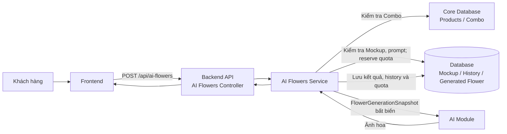
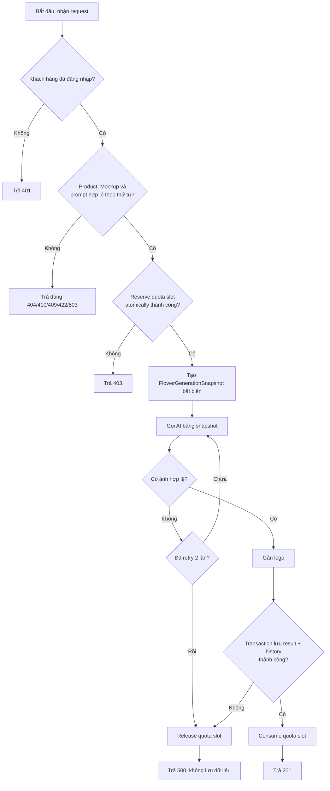
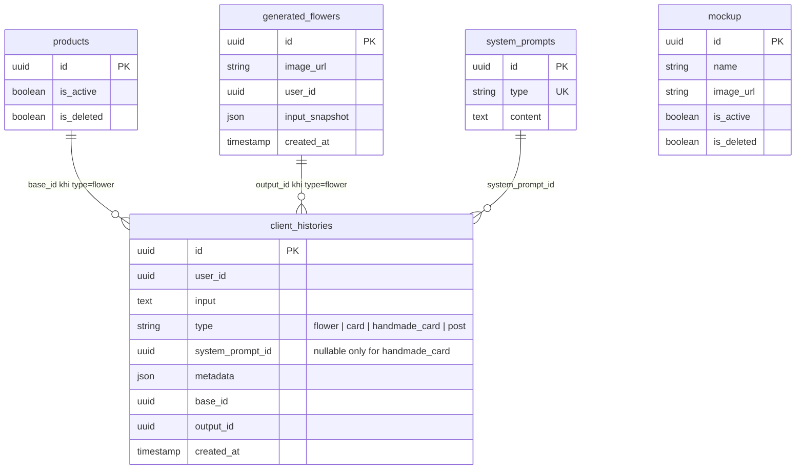

# TDD-016: Tạo và tạo lại mẫu hoa AI

## Thông tin tài liệu

- **Tiêu đề**: Tạo ảnh mẫu hoa AI và tạo lại từ lịch sử
- **Ghi chú**: STORY-030 và STORY-033 mô tả API tạo mới. Cùng TDD này quy định API tạo lại từ Flower history: giữ dữ liệu nguồn, chỉ cho phép chọn lại Mockup.

## Metadata quản trị tài liệu

| Trường | Giá trị |
|---|---|
| Mã tài liệu | TDD-016 |
| Phiên bản | v0.7 |
| Author | Codex |
| Reviewer | Chưa chỉ định |
| Approver | Chưa chỉ định |
| Owner | Nhóm Hoa Theo Mùa |
| Cập nhật gần nhất | 2026-09-04 |

---

## BƯỚC 1 — Thông tin & Bối cảnh

### Thông tin tài liệu

- **Mã tài liệu**: TDD-016
- **Tính năng**: Tạo và tạo lại mẫu hoa AI
- **Tác giả**: Codex
- **Người review**: Chưa chỉ định
- **Phiên bản**: v0.7
- **Cập nhật (YYYY-MM-DD)**: 2026-09-04
- **Story liên quan**:
  - STORY-030 — nhận dữ liệu tạo mẫu hoa.
  - STORY-033 — tạo và trả ảnh hoa bằng AI.

### Business Rules

- **BR-016-01**: Chỉ khách hàng đã đăng nhập, có tài khoản đang hoạt động mới được gọi API.
- **BR-016-02**: `product_id` bắt buộc, là đúng ID Combo/biến thể được chọn (không dùng ID cha nếu cha có biến thể), và được validate live theo thứ tự not-found → deleted → inactive → sellable quantity.
- **BR-016-03**: `mockup_id` bắt buộc; validate live theo thứ tự not-found → deleted → inactive tại admission.
- **BR-016-04**: Sau dependency validation, reserve atomically một quota slot (tối đa 3/ngày/user) trước AI; success consume, AI/persistence fail release.
- **BR-016-05**: Prompt AI ưu tiên theo thứ tự `Combo > Mockup > Ghi chú/Yêu cầu thêm > Phong cách`.
- **BR-016-06**: AI Module gọi lần đầu và retry tối đa 2 lần (tổng tối đa 3 lần) bằng cùng `FlowerGenerationSnapshot` và quota slot.
- **BR-016-07**: Chỉ consume quota sau khi AI trả ảnh hợp lệ, ảnh đã xử lý và persistence thành công.
- **BR-016-08**: Ảnh kết quả được gắn logo theo cấu hình trước khi lưu.
- **BR-016-09**: Khi thành công, tạo `generated_flowers` và `client_histories` trong cùng flow; `client_histories.type = "flower"`, `base_id = products.id`, `output_id = generated_flowers.id`.
- **BR-016-10**: `generated_flowers.input_snapshot` và `client_histories.metadata` lưu `schema_version=2`, Product/biến thể, Mockup, bytes/version/hash ảnh, observed status, `validated_at` UTC và full system prompt (`id`, `content`, `sha256`).
- **BR-016-11**: Khi AI thất bại sau retry, không tạo `generated_flowers` hay `client_histories` và quota không bị trừ.
- **BR-016-12**: Không tạo hoặc lưu `flower_requests` và `flower_ai_jobs`.
- **BR-016-13**: Validation chỉ xảy ra một lần tại request admission theo thứ tự `auth/request → Product → Mockup → system prompt → quota → snapshot → AI`; không revalidate sau snapshot, trong retry, trước persist hoặc sau gắn logo.
- **BR-016-14**: Product errors: `PRODUCT_NOT_FOUND/404`, `PRODUCT_DELETED/410`, `PRODUCT_INACTIVE/409`, `PRODUCT_OUT_OF_STOCK/409`; `no_formula|no_core` → `PRODUCT_NOT_SELLABLE/422`; lỗi tính → `PRODUCT_AVAILABILITY_UNAVAILABLE/503`.
- **BR-016-15**: Mockup errors: `MOCKUP_NOT_FOUND/404`, `MOCKUP_DELETED/410`, `MOCKUP_INACTIVE/409`.
- **BR-016-16**: Admin đổi Product/Mockup sau snapshot không ảnh hưởng AI/retry/persist/history của request đã nhận; retry không query lại nguồn.
- **BR-016-17**: Generated Flower đã thành công vẫn dùng tạo Card dù nguồn đổi trạng thái; Order mới resolve Product gốc và validate live.
- **BR-016-18**: Khi request nhận đúng ID variant con, Generate kiểm tra trạng thái/lượng bán của chính child; Product cha inactive không chặn Generate, nhưng sẽ chặn Order sau này.
- **BR-016-19**: Regenerate dùng `POST /api/ai-flowers/{source_flower_id}/regenerate`; Flower nguồn phải thuộc user hiện tại và có history `type=flower`, `base_id` Product cùng snapshot đầy đủ. Thiếu lineage/Product provenance hoặc snapshot bắt buộc → `FLOWER_SOURCE_HISTORY_INVALID/409`.
- **BR-016-20**: Regenerate chỉ nhận `mockup_id` tùy chọn. Product/biến thể snapshot, ảnh Product, tên, dịp, phong cách, ngân sách, ghi chú và mọi user input khác lấy nguyên từ Flower nguồn; client không được thay đổi. Ảnh output của Flower nguồn không được dùng làm input AI.
- **BR-016-21**: Nếu `mockup_id` null/bỏ trống hoặc bằng ID Mockup nguồn, dùng nguyên Mockup snapshot nguồn, không query live và không kiểm tra active/soft-delete. Chỉ khi client truyền ID khác nguồn, validate Mockup mới theo `MOCKUP_NOT_FOUND/404` → `MOCKUP_DELETED/410` → `MOCKUP_INACTIVE/409`.
- **BR-016-22**: Mỗi `system_prompts.type` có đúng một prompt hiện hành. Regenerate ưu tiên prompt hiện hành type `flower`; record không tồn tại hoặc content rỗng/không hợp lệ được xem là không khả dụng và phải fallback full prompt snapshot nguồn, không kiểm tra trạng thái record nguồn.
- **BR-016-23**: Regenerate dùng logo/config hiện hành và dựng `input_snapshot` mới từ source snapshot + Effective Mockup + prompt thực tế + logo/config hiện hành. Flower mới có ID, AI `image_url`, `created_at` mới và `user_id` hiện tại.
- **BR-016-24**: History regenerate có `base_id` bằng `base_id` history nguồn, `output_id` bằng ID Flower mới, `metadata.regenerated_from_flower_id` bằng ID Flower trực tiếp được chọn và `system_prompt_source=current|source_flower_fallback`. F1→F2→F3 giữ cùng Product `base_id`, còn parent trực tiếp lần lượt là F1 và F2.
- **BR-016-25**: `client_histories.input` của Regenerate chỉ ghi `{operation,source_flower_id,mockup_id}`; null nghĩa là client không chọn Mockup mới. Metadata/input snapshot lưu Effective Mockup thực tế.
- **BR-016-27**: Regenerate dùng cùng quota, reserve/consume/release và retry tối đa 2 lần như Create; Product/Mockup nguồn không được revalidate sau khi đã có snapshot.
- **BR-016-28**: Create dùng prompt hiện hành duy nhất của type `flower`; record thiếu hoặc content rỗng/không hợp lệ trả `SYSTEM_PROMPT_INVALID/409` vì Create không có prompt snapshot nguồn để fallback.

### Bối cảnh & Mục tiêu

**Vấn đề**

> Khách hàng cần xem ngay ảnh mẫu hoa AI từ Combo, Mockup và nhu cầu đã nhập. Việc tách luồng thành một yêu cầu nháp rồi một AI Job không còn phù hợp: dữ liệu input chỉ phục vụ lần gọi AI, không cần có vòng đời lưu trữ riêng.

**Mục tiêu**

- Nhận toàn bộ dữ liệu tạo hoa qua một endpoint `POST /api/ai-flowers`.
- Xác thực Combo, Mockup và quota trước khi gọi AI.
- Tạo ảnh có retry, gắn logo và trả kết quả trong cùng request.
- Lưu kết quả thành công và history để phục vụ các flow sau, như tạo thiệp từ bó hoa AI.
- Không lưu request nháp, queue hoặc AI Job trung gian.

**Ngoài phạm vi**

- Cách AI Module tạo ảnh nội bộ và nhà cung cấp AI cụ thể.
- Quản lý Mockup CRUD; xem TDD-012 đến TDD-015.
- Lấy danh sách Combo, tồn kho, Checkout, tạo Order và thanh toán.
- API tạo lại theo `flower_request_id`; hệ thống không có entity request/job. Regenerate dùng `source_flower_id` của kết quả lịch sử.

---

## BƯỚC 2 — Kiến trúc & Sơ đồ

### Kiến trúc tổng quan (Architecture)

**Tiêu đề**: Trình tự tạo mẫu hoa AI đồng bộ

**Mô tả**: Frontend gửi một request. Service load Product/Mockup/prompt live, reserve quota và tạo snapshot bất biến trước AI. AI/retry chỉ dùng snapshot. Chỉ khi ảnh và persistence thành công mới consume quota.



**Ghi chú**: Chưa có controller, service hay DTO cho API này trong codebase. Tên thành phần trong sơ đồ là thiết kế mục tiêu; implementation phải dùng response envelope `ApiResponseFactory` đang có của hệ thống.

### Sequence Diagram

**Tiêu đề**: Trình tự kiểm tra, tạo ảnh và lưu kết quả

**Mô tả**: Luồng mô tả một lần gọi API duy nhất, bao gồm các nhánh dữ liệu không hợp lệ, hết quota và AI thất bại sau retry.

```mermaid
sequenceDiagram
    autonumber
    actor Client
    participant FE as Frontend
    participant C as AI Flowers Controller
    participant S as AI Flowers Service
    participant Core as Core Database
    participant DB as Database
    participant AI as AI Module

    Client->>FE: Chọn Combo, Mockup và nhập thông tin
    FE->>C: POST /api/ai-flowers
    C->>S: Xử lý request

    Note over S: GIAI ĐOẠN 1: Admission validation một lần
    S->>Core: Validate Product live + CalculateAvailableQty đúng variant
    S->>DB: Validate Mockup live; load full system prompt
    alt Dependency không hợp lệ
        S-->>C: Mã lỗi riêng 404/410/409/422/503
        C-->>FE: Không gọi AI, không quota/history
    end

    Note over S: GIAI ĐOẠN 2: Reserve quota và đóng băng input
    S->>DB: Reserve quota slot atomically
    alt Đã hết quota
        S-->>C: FORBIDDEN
        C-->>FE: HTTP 403
    end
    S->>S: Create immutable FlowerGenerationSnapshot

    Note over S: GIAI ĐOẠN 3: Tạo ảnh không revalidate nguồn
    S->>AI: Generate(snapshot)
    alt AI chưa trả ảnh hợp lệ
        loop Tối đa 2 lần, interval 2 giây
            S->>AI: Retry generate(same snapshot)
        end
    end

    alt AI vẫn thất bại
        S->>DB: Release quota slot
        S-->>C: INTERNAL_SERVER_ERROR
        C-->>FE: HTTP 500
    else AI trả ảnh hợp lệ
        AI-->>S: Ảnh hoa
        Note over S: GIAI ĐOẠN 4: Hoàn tất và lưu kết quả
        S->>S: Gắn logo theo cấu hình
        alt Gắn logo thất bại
            S->>DB: Release quota slot
            S-->>C: INTERNAL_SERVER_ERROR
        else Logo thành công
            S->>DB: Transaction insert generated_flowers + client_histories
            alt Persistence thất bại
                S->>DB: Rollback và release quota slot
                S-->>C: INTERNAL_SERVER_ERROR
            else Persistence thành công
                S->>DB: Consume quota slot
                S-->>C: Generated flower
                C-->>FE: HTTP 201
                FE-->>Client: Hiển thị ảnh mẫu hoa
            end
        end
    end
```

**Ghi chú**: Không có bước tạo request nháp, kiểm tra job đang chạy hay cập nhật trạng thái job.

### Sequence Diagram — Regenerate từ Flower history

```mermaid
sequenceDiagram
    autonumber
    actor Client
    participant C as AI Flowers Controller
    participant S as AI Flowers Service
    participant DB as Database
    participant AI as AI Module

    Client->>C: POST /api/ai-flowers/{source_flower_id}/regenerate
    C->>S: mockup_id tùy chọn
    S->>DB: Validate ownership + load Flower/history/source snapshot
    alt Source history/provenance thiếu
        S-->>C: FLOWER_SOURCE_HISTORY_INVALID/409
    end
    alt Client chọn ID Mockup khác nguồn
        S->>DB: Validate Mockup mới live
    else Bỏ trống/null/đúng ID nguồn
        S->>S: Dùng Mockup snapshot nguồn, không query live
    end
    S->>DB: Load current flower prompt
    alt Prompt current thiếu/rỗng/invalid
        S->>S: Dùng full prompt snapshot nguồn
    end
    S->>DB: Load logo/config hiện hành; reserve quota
    S->>S: Dựng snapshot mới từ Product/user input nguồn + Effective Mockup + prompt/logo
    S->>AI: Generate(snapshot), tối đa 3 lần gọi
    AI-->>S: Ảnh Flower mới
    S->>DB: Transaction insert generated_flowers + client_histories; consume quota
    S-->>C: HTTP 201
```

Regenerate không dùng ảnh output của Flower nguồn làm input AI và không validate Product live. AI/retry dùng snapshot mới bất biến; failure release quota giống Create.

### Activity Diagram

**Tiêu đề**: Quyết định tạo mẫu hoa AI

**Mô tả**: Thể hiện các điều kiện dừng trước khi gọi AI và điều kiện lưu dữ liệu sau khi AI hoàn thành.



### State Diagram

**Tiêu đề**: Không áp dụng

**Mô tả**: Không có entity tạo hoa có vòng đời trạng thái. API không tạo bản nháp, request hay AI Job; `generated_flowers` chỉ được tạo sau khi đã có kết quả thành công.

### Mô hình dữ liệu (Data Model / ERD)

**Tiêu đề**: Dữ liệu lưu khi tạo mẫu hoa thành công

**Mô tả**: `client_histories` giữ quan hệ đa hình giữa Product/biến thể nguồn và ảnh hoa kết quả. Snapshot đầy đủ nằm trong `generated_flowers.input_snapshot` và `client_histories.metadata`; không có FK Mockup riêng. Với Regenerate, `base_id` vẫn là Product gốc và metadata giữ Flower cha trực tiếp.



Snapshot JSON tối thiểu gồm `schema_version=2`, `source_product_id`, Product snapshot và observed status, toàn bộ `user_input`, Mockup snapshot và observed status, ảnh Product theo bytes đã đóng băng hoặc `url/object_key/version_id/sha256`, `system_prompt{id,content,sha256}`, `validated_at` UTC. Regenerate bổ sung `operation=regenerate`, `regenerated_from_flower_id`, `system_prompt_source` và logo/config hiện hành đã dùng. Hai nơi lưu cùng payload audit để history vẫn tự mô tả khi nguồn soft-delete.

---

## BƯỚC 3 — API

### API Contract nội bộ

> API chưa được implement trong codebase. Contract dưới đây là contract thiết kế đã được chốt trong AI Flower Context; DTO/controller khi triển khai phải giữ đúng route, ràng buộc và response envelope của hệ thống.

#### Endpoint #1

- **Method**: POST
- **Endpoint**: `/api/ai-flowers`
- **Tên endpoint**: Tạo mẫu hoa AI
- **Mô tả**: Nhận Combo, Mockup và dữ liệu người dùng nhập; tạo và trả về một ảnh mẫu hoa AI trong cùng request.

**Ví dụ 1 — Tạo mẫu hoa thành công** — HTTP `201`

Request:

```json
POST /api/ai-flowers
{
  "product_id": "550e8400-e29b-41d4-a716-446655440001",
  "mockup_id": "550e8400-e29b-41d4-a716-446655440002",
  "user_input": {
    "name": "Bó hoa sinh nhật mẹ",
    "occasion": "sinh_nhat",
    "style": "dang_cap",
    "budget": 500000,
    "note": "Ưa thích hoa hồng và hoa lan"
  }
}
```

Response:

```json
{
  "isSuccess": true,
  "isFailed": false,
  "error": null,
  "traceId": "00-...",
  "timestampUtc": "2026-08-28T10:35:00Z",
  "value": {
    "id": "880e8400-e29b-41d4-a716-446655440005",
    "image_url": "https://storage.example.com/flowers/880e8400.png",
    "user_id": "770e8400-e29b-41d4-a716-446655440004",
    "created_at": "2026-08-28T10:35:00Z"
  }
}
```

Error: Không áp dụng.

**Ví dụ 2 — Product không tồn tại** — HTTP `404`

Request:

```json
POST /api/ai-flowers
{
  "product_id": "00000000-0000-0000-0000-000000000000",
  "mockup_id": "550e8400-e29b-41d4-a716-446655440002",
  "user_input": { "name": "Bó hoa sinh nhật" }
}
```

Response:

```json
{
  "title": "Not Found",
  "status": 404,
  "detail": "Không tìm thấy sản phẩm nguồn.",
  "messageCode": "PRODUCT_NOT_FOUND",
  "errors": null,
  "traceId": "00-...",
  "timestampUtc": "2026-08-28T10:35:00Z"
}
```

**Ví dụ 3 — Hết quota tạo hoa trong ngày** — HTTP `403`

Request:

```json
POST /api/ai-flowers
{
  "product_id": "550e8400-e29b-41d4-a716-446655440001",
  "mockup_id": "550e8400-e29b-41d4-a716-446655440002",
  "user_input": { "name": "Bó hoa sinh nhật" }
}
```

Response:

```json
{
  "title": "Forbidden",
  "status": 403,
  "detail": "Bạn đã sử dụng hết 3 lượt tạo mẫu hoa AI trong ngày.",
  "messageCode": "FORBIDDEN",
  "errors": null,
  "traceId": "00-...",
  "timestampUtc": "2026-08-28T10:35:00Z"
}
```

**Ví dụ 4 — AI thất bại sau retry** — HTTP `500`

Request:

```json
POST /api/ai-flowers
{
  "product_id": "550e8400-e29b-41d4-a716-446655440001",
  "mockup_id": "550e8400-e29b-41d4-a716-446655440002",
  "user_input": { "name": "Bó hoa sinh nhật" }
}
```

Response:

```json
{
  "title": "Internal Server Error",
  "status": 500,
  "detail": "An unexpected error occurred.",
  "messageCode": "INTERNAL_SERVER_ERROR",
  "errors": null,
  "traceId": "00-...",
  "timestampUtc": "2026-08-28T10:35:00Z"
}
```

**Ví dụ 5 — Request thiếu product_id bắt buộc** — HTTP `400`

Request:
```json
POST /api/ai-flowers
{
  "mockup_id": "mockup-001",
  "user_input": {
    "name": "Bó hoa sinh nhật"
  }
}
```

Response:
```json
{
  "title": "Request rejected",
  "status": 400,
  "detail": "product_id là bắt buộc.",
  "messageCode": "VALIDATION_ERROR",
  "errors": null,
  "timestampUtc": "2026-08-28T10:35:00Z"
}
```

**Ví dụ 6 — Product đã soft-delete** — HTTP `410`

Request:
```json
POST /api/ai-flowers
{
  "product_id": "product-variant-a",
  "mockup_id": "mockup-001",
  "user_input": {
    "name": "Bó hoa sinh nhật"
  }
}
```

Response:
```json
{
  "title": "Request rejected",
  "status": 410,
  "detail": "Sản phẩm nguồn đã bị ngừng cung cấp.",
  "messageCode": "PRODUCT_DELETED",
  "errors": null,
  "timestampUtc": "2026-08-28T10:35:00Z"
}
```

**Ví dụ 7 — Product inactive** — HTTP `409`

Request:
```json
POST /api/ai-flowers
{
  "product_id": "product-variant-a",
  "mockup_id": "mockup-001",
  "user_input": {
    "name": "Bó hoa sinh nhật"
  }
}
```

Response:
```json
{
  "title": "Request rejected",
  "status": 409,
  "detail": "Sản phẩm nguồn hiện đang tạm ngưng bán.",
  "messageCode": "PRODUCT_INACTIVE",
  "errors": null,
  "timestampUtc": "2026-08-28T10:35:00Z"
}
```

**Ví dụ 8 — Product hết hàng** — HTTP `409`

Request:
```json
POST /api/ai-flowers
{
  "product_id": "product-variant-a",
  "mockup_id": "mockup-001",
  "user_input": {
    "name": "Bó hoa sinh nhật"
  }
}
```

Response:
```json
{
  "title": "Request rejected",
  "status": 409,
  "detail": "Sản phẩm nguồn hiện đã hết hàng.",
  "messageCode": "PRODUCT_OUT_OF_STOCK",
  "errors": null,
  "timestampUtc": "2026-08-28T10:35:00Z"
}
```

**Ví dụ 9 — Product không có formula usable** — HTTP `422`

Dữ liệu live tại admission: `CalculateAvailableQty(product-variant-a)` trả `UnavailableReason="no_formula"`.

Request:
```json
POST /api/ai-flowers
{
  "product_id": "product-variant-a",
  "mockup_id": "mockup-001",
  "user_input": {
    "name": "Bó hoa sinh nhật"
  }
}
```

Response:
```json
{
  "title": "Request rejected",
  "status": 422,
  "detail": "Sản phẩm hiện chưa đủ điều kiện để bán.",
  "messageCode": "PRODUCT_NOT_SELLABLE",
  "errors": null,
  "timestampUtc": "2026-08-28T10:35:00Z"
}
```

**Ví dụ 9A — Product không có CORE usable** — HTTP `422`

Dữ liệu live tại admission: `CalculateAvailableQty(product-variant-a)` trả `UnavailableReason="no_core"`.

Request:
```json
POST /api/ai-flowers
{
  "product_id": "product-variant-a",
  "mockup_id": "mockup-001",
  "user_input": {
    "name": "Bó hoa sinh nhật"
  }
}
```

Response:
```json
{
  "title": "Request rejected",
  "status": 422,
  "detail": "Sản phẩm hiện chưa đủ điều kiện để bán vì không có CORE usable.",
  "messageCode": "PRODUCT_NOT_SELLABLE",
  "errors": null,
  "timestampUtc": "2026-08-28T10:35:00Z"
}
```

**Ví dụ 10 — Không tính được tồn kho Product** — HTTP `503`

Request:
```json
POST /api/ai-flowers
{
  "product_id": "product-variant-a",
  "mockup_id": "mockup-001",
  "user_input": {
    "name": "Bó hoa sinh nhật"
  }
}
```

Response:
```json
{
  "title": "Service Unavailable",
  "status": 503,
  "detail": "Chưa thể xác minh tồn kho sản phẩm. Vui lòng thử lại sau.",
  "messageCode": "PRODUCT_AVAILABILITY_UNAVAILABLE",
  "errors": null,
  "timestampUtc": "2026-08-28T10:35:00Z"
}
```

**Ví dụ 11 — Mockup không tồn tại** — HTTP `404`

Request:
```json
POST /api/ai-flowers
{
  "product_id": "product-variant-a",
  "mockup_id": "mockup-001",
  "user_input": {
    "name": "Bó hoa sinh nhật"
  }
}
```

Response:
```json
{
  "title": "Request rejected",
  "status": 404,
  "detail": "Không tìm thấy Mockup nguồn.",
  "messageCode": "MOCKUP_NOT_FOUND",
  "errors": null,
  "timestampUtc": "2026-08-28T10:35:00Z"
}
```

**Ví dụ 12 — Mockup đã soft-delete** — HTTP `410`

Request:
```json
POST /api/ai-flowers
{
  "product_id": "product-variant-a",
  "mockup_id": "mockup-001",
  "user_input": {
    "name": "Bó hoa sinh nhật"
  }
}
```

Response:
```json
{
  "title": "Request rejected",
  "status": 410,
  "detail": "Mockup nguồn đã bị xóa.",
  "messageCode": "MOCKUP_DELETED",
  "errors": null,
  "timestampUtc": "2026-08-28T10:35:00Z"
}
```

**Ví dụ 13 — Mockup inactive** — HTTP `409`

Request:
```json
POST /api/ai-flowers
{
  "product_id": "product-variant-a",
  "mockup_id": "mockup-001",
  "user_input": {
    "name": "Bó hoa sinh nhật"
  }
}
```

Response:
```json
{
  "title": "Request rejected",
  "status": 409,
  "detail": "Mockup nguồn đang tạm ngưng sử dụng.",
  "messageCode": "MOCKUP_INACTIVE",
  "errors": null,
  "timestampUtc": "2026-08-28T10:35:00Z"
}
```

**Ví dụ 14 — Người dùng chưa đăng nhập** — HTTP `401`

Request:
```json
POST /api/ai-flowers
{
  "product_id": "product-variant-a",
  "mockup_id": "mockup-001",
  "user_input": {
    "name": "Bó hoa sinh nhật"
  }
}
```

Response:
```json
{
  "title": "Request rejected",
  "status": 401,
  "detail": "Bạn cần đăng nhập để thực hiện thao tác này.",
  "messageCode": "UNAUTHORIZED",
  "errors": null,
  "timestampUtc": "2026-08-28T10:35:00Z"
}
```

#### Endpoint #2

- **Method**: POST
- **Endpoint**: `/api/ai-flowers/{source_flower_id}/regenerate`
- **Tên endpoint**: Tạo lại mẫu hoa từ lịch sử
- **Mô tả**: Tạo Flower mới bằng Product/ảnh Product/user input của Flower nguồn; client chỉ có thể chọn lại Mockup.
- **Body**: `{ "mockup_id": "uuid-or-null" }`; field khác ngoài `mockup_id` không được chấp nhận.

Null, bỏ field, body rỗng hoặc đúng ID Mockup nguồn dùng snapshot nguồn mà không query trạng thái live. Chỉ ID khác nguồn được xem là Mockup mới và được validate live.

**Ví dụ R1 — Tạo lại, dùng Mockup nguồn** — HTTP `201`

```http
POST /api/ai-flowers/flower-f1/regenerate
Content-Type: application/json

{}
```

Hệ thống dùng Product/user input/ảnh Product và Mockup snapshot của F1, không kiểm tra trạng thái live của Product hoặc Mockup nguồn; dùng prompt `flower` hiện hành hợp lệ hoặc fallback prompt snapshot F1; logo/config lấy hiện hành. History mới có `base_id=F1.history.base_id`, `output_id=F2.id`, `metadata.regenerated_from_flower_id=F1.id`.

**Ví dụ R2 — Tạo lại với Mockup client chọn** — HTTP `201`

```http
POST /api/ai-flowers/flower-f1/regenerate
Content-Type: application/json

{
  "mockup_id": "mockup-new"
}
```

`mockup-new` phải tồn tại, chưa soft-delete và active tại admission. Các field còn lại vẫn lấy từ F1 và không được thay đổi.

**Ví dụ R3 — Source history/provenance không đầy đủ** — HTTP `409`

```http
POST /api/ai-flowers/legacy-flower/regenerate

{}
```

```json
{
  "title": "Request rejected",
  "status": 409,
  "detail": "Mẫu hoa nguồn không có lịch sử hoặc snapshot nguồn đầy đủ để tạo lại.",
  "messageCode": "FLOWER_SOURCE_HISTORY_INVALID",
  "errors": null
}
```

**Ví dụ R4 — Chuỗi tạo lại nhiều cấp**

- F2 tạo từ F1: `F2.metadata.regenerated_from_flower_id=F1.id`.
- F3 tạo từ F2: `F3.metadata.regenerated_from_flower_id=F2.id`.
- History F1, F2 và F3 có cùng `base_id` là ID Product gốc; mỗi lần có `output_id` là ID Flower mới tương ứng.

#### Mã lỗi

| Code | HTTP | Khi nào xảy ra |
|---|---:|---|
| `VALIDATION_ERROR` | 400 | Thiếu `product_id`, `mockup_id` hoặc dữ liệu người dùng nhập không hợp lệ |
| `PRODUCT_NOT_FOUND` | 404 | Không có Product theo ID |
| `PRODUCT_DELETED` | 410 | Product đã soft-delete |
| `PRODUCT_INACTIVE` | 409 | Product chưa xóa nhưng inactive |
| `PRODUCT_OUT_OF_STOCK` | 409 | Product active/chưa xóa nhưng sellableQuantity = 0 |
| `PRODUCT_NOT_SELLABLE` | 422 | Combo không có formula/CORE usable |
| `PRODUCT_AVAILABILITY_UNAVAILABLE` | 503 | Không tính hoặc không xác minh được tồn kho |
| `MOCKUP_NOT_FOUND` | 404 | Không có Mockup theo ID |
| `MOCKUP_DELETED` | 410 | Mockup đã soft-delete |
| `MOCKUP_INACTIVE` | 409 | Mockup chưa xóa nhưng inactive |
| `SYSTEM_PROMPT_INVALID` | 409 | Create không có prompt hiện hành hợp lệ cho type `flower` |
| `FLOWER_SOURCE_NOT_FOUND` | 404 | Flower nguồn không tồn tại |
| `ACCESS_DENIED` | 403 | Flower nguồn không thuộc user hiện tại |
| `FLOWER_SOURCE_HISTORY_INVALID` | 409 | Flower nguồn thiếu history, Product lineage, source snapshot hoặc prompt fallback bắt buộc |
| `UNAUTHORIZED` | 401 | Người dùng chưa đăng nhập hoặc tài khoản không còn hoạt động |
| `FORBIDDEN` | 403 | Khách hàng đã dùng hết 3 lượt tạo mẫu hoa trong ngày |
| `INTERNAL_SERVER_ERROR` | 500 | AI vẫn không trả ảnh hợp lệ sau hai lần retry |

### API Contract bên ngoài

- **Endpoints sử dụng**: Không áp dụng ở mức TDD này; AI Module là module nội bộ và nhà cung cấp AI chưa được xác định trong codebase.
- **Field quan trọng**: AI Module nhận `FlowerGenerationSnapshot` đã đóng băng gồm Product, Mockup, user input, ảnh Product và full `system_prompts.content`; kết quả cần có ảnh hợp lệ. Regenerate không truyền ảnh output Flower cũ làm input.
- **Xử lý lỗi từ đối tác**: Một lần gọi đầu + tối đa 2 retry cùng snapshot; sau đó trả lỗi 500, release quota slot, không tạo history.
- **Quirks / cạm bẫy**: Không được lưu input bằng bảng request/job riêng. Create lưu JSON request gốc; Regenerate chỉ lưu action `{operation,source_flower_id,mockup_id}` trong `client_histories.input`.

---

## BƯỚC 4 — Tham chiếu

> Chú thích: 🔴 Tham chiếu đến (tài liệu này đọc/phụ thuộc) · ⚫ Trỏ vào tài liệu này (tài liệu khác phụ thuộc vào tài liệu này) · ⋯ Bị ảnh hưởng (thay đổi ở đây có thể làm tài liệu kia sai theo)

### 🔴 Tham chiếu đến

- AI Flower Context — flow, quota, prompt priority và nguyên tắc lưu dữ liệu.
- AI Customize DB Diagram — `generated_flowers`, `client_histories`, `mockup`, `system_prompts`.
- TDD-012, TDD-013, TDD-014, TDD-015 — quản lý và điều kiện khả dụng của Mockup.
- Product Entity/Core Database — lấy và kiểm tra Combo nguồn.
- `ApiResponseFactory` và `GlobalExceptionHandlerMiddleware` — response envelope thành công/lỗi của hệ thống.

### ⚫ Trỏ vào tài liệu này

- TDD-006 — tạo thiệp AI có thể dùng ảnh từ `generated_flowers` làm nguồn.
- TDD-007 — tạo lại thiệp từ history có thể dùng `generated_flowers` làm `base_id`.
- ST-030-01-01, ST-033-01-01, ST-033-08-01 — các system test liên quan.
- UT-016-01 đến UT-016-24 — các Unit Test Case của TDD-016.

### ⋯ Bị ảnh hưởng

- AI Flower Context — route, quota, persistence và contract cần đồng bộ với TDD này.
- AI Customize DB Diagram — nếu thay đổi cách lưu lịch sử hoặc quan hệ Combo–Flower.
- Flow Checkout/Order của STORY-038 và STORY-039 — sử dụng kết quả hoa AI sau khi tạo thành công.
