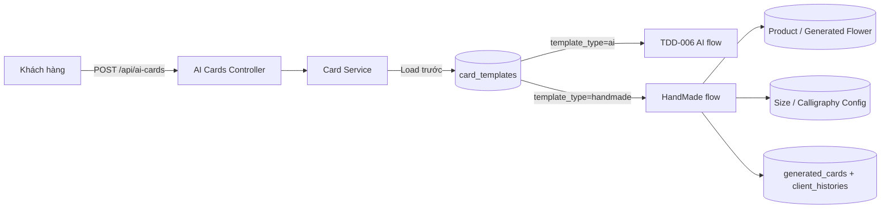
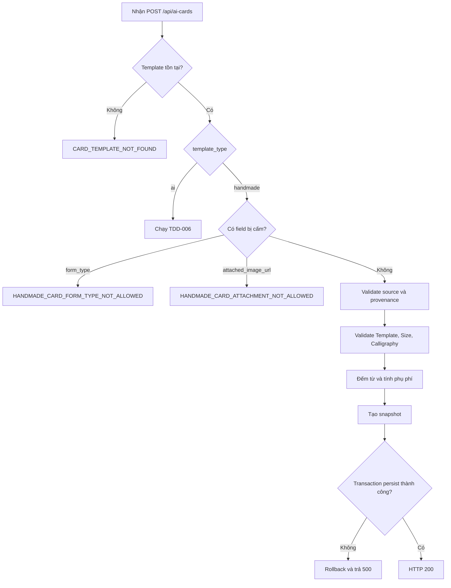
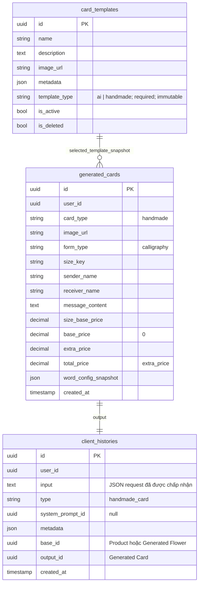

# TDD-017: Chọn và tạo thiệp HandMade

## Thông tin tài liệu

- **Tiêu đề**: Chọn mẫu thiệp có sẵn và tạo thiệp HandMade cho hoa
- **Ghi chú**: Flow dùng chung `POST /api/ai-cards` với Card AI nhưng không gọi AI. Service load `card_templates` trước và phân nhánh theo `template_type`.

## Metadata quản trị tài liệu

| Trường | Giá trị |
|---|---|
| Mã tài liệu | TDD-017 |
| Phiên bản | v0.1 |
| Author | Codex |
| Reviewer | Chưa chỉ định |
| Approver | Chưa chỉ định |
| Owner | Nhóm Hoa Theo Mùa |
| Cập nhật gần nhất | 2026-09-04 |

---

## BƯỚC 1 — Thông tin và bối cảnh

### Business Rules

- **BR-017-01**: Chỉ khách hàng đã đăng nhập và có tài khoản hoạt động được gọi API.
- **BR-017-02**: `card_templates.template_type` là string bắt buộc, chỉ nhận lowercase `ai` hoặc `handmade`, không được đổi sau khi tạo. Dữ liệu Template hiện có được xem là `ai`.
- **BR-017-03**: Client dùng chung `POST /api/ai-cards`. Service phải load Template trước; `template_type=ai` chạy TDD-006, `template_type=handmade` chạy TDD này.
- **BR-017-04**: Request HandMade bắt buộc đúng một nguồn hoa: `product_id` hoặc `generated_flower_id`; đồng thời bắt buộc `card_template_id`, `size_key`, `sender_name`, `receiver_name`, `message_content`.
- **BR-017-05**: Không chấp nhận `form_type`. Nếu có field này, trả `HANDMADE_CARD_FORM_TYPE_NOT_ALLOWED/400` với message `Thiệp mẫu có sẵn luôn sử dụng hình thức viết tay; không được truyền form_type.`
- **BR-017-06**: Không chấp nhận `attached_image_url`. Nếu có field này, trả `HANDMADE_CARD_ATTACHMENT_NOT_ALLOWED/400` với message `Thiệp mẫu có sẵn không hỗ trợ ảnh đính kèm.`
- **BR-017-07**: Server luôn gán `form_type="calligraphy"` cho HandMade.
- **BR-017-08**: Template HandMade được validate live một lần theo thứ tự not-found → deleted → inactive và phải có `template_type="handmade"`.
- **BR-017-09**: Người dùng được chọn Size Config hợp lệ. Hệ thống snapshot đầy đủ Size Config và vẫn kiểm tra `message_content` không vượt `max_words`.
- **BR-017-10**: Giá size không được thu: `size_base_price` giữ giá cấu hình để audit, còn `base_price=0`.
- **BR-017-11**: Hệ thống đếm từ giống Card AI, validate Calligraphy Config live một lần, chọn đúng rule chứa `word_count` và snapshot rule đã áp dụng.
- **BR-017-12**: `extra_price` bằng phụ phí của Calligraphy rule; `total_price=extra_price`.
- **BR-017-13**: Ảnh kết quả dùng trực tiếp `card_templates.image_url`; chỉ lưu URL, không tạo bản sao và không render người gửi, người nhận hoặc nội dung lên ảnh preview.
- **BR-017-14**: HandMade không gọi AI, không load System Prompt, không retry và không reserve/consume quota Card AI hoặc quota theo Generated Flower.
- **BR-017-15**: Request thành công tạo `generated_cards.card_type="handmade"` và `client_histories.type="handmade_card"` trong cùng transaction. Nếu client không gọi API thì không tạo record.
- **BR-017-16**: `client_histories.system_prompt_id=null`; metadata không có `system_prompt` nhưng phải snapshot đầy đủ Template HandMade, Size Config, Calligraphy rule, pricing, source và provenance.
- **BR-017-17**: Nguồn Product có `base_id=products.id`; nguồn Generated Flower có `base_id=generated_flowers.id`; mọi trường hợp có `output_id=generated_cards.id` mới tạo.
- **BR-017-18**: HandMade mới bắt buộc provenance đầy đủ và `provenance_status="available"`. Nguồn Generated Flower phải thuộc user và resolve nhất quán về Product gốc.
- **BR-017-19**: HandMade không được tạo lại dưới bất kỳ hình thức nào và không hỗ trợ chuyển chéo AI ↔ HandMade. Regenerate source history `handmade_card` trả `HANDMADE_CARD_REGENERATE_NOT_SUPPORTED/409` với message `Thiệp HandMade không hỗ trợ chức năng tạo lại.`
- **BR-017-20**: API History mặc định trả cả `card` và `handmade_card`; filter `type` nhận từng giá trị string này.
- **BR-017-21**: Danh sách Template cho màn AI chỉ trả `template_type=ai`; màn chọn thiệp có sẵn chỉ trả `template_type=handmade`. Admin dùng chung CRUD và không được cập nhật `template_type` của record đã tạo.
- **BR-017-22**: Phần gắn Card vào Checkout/Order không thuộc phạm vi TDD này.

### Mục tiêu

- Cho phép khách hàng dùng mẫu thiệp có sẵn do Admin chuẩn bị thay vì tạo ảnh bằng AI.
- Giữ cách lưu `generated_cards`, history, snapshot, lineage và tính phụ phí viết tay nhất quán với Card AI.
- Tách rõ hai loại Template/Card/History bằng string discriminator mở rộng được.

### Ngoài phạm vi

- Render nội dung lên ảnh mẫu HandMade.
- Tạo lại HandMade Card hoặc chuyển đổi giữa Card AI và HandMade.
- Checkout, Order, thanh toán và lựa chọn Card trong đơn hàng.
- Unit Test cho flow mới.

---

## BƯỚC 2 — Kiến trúc và sơ đồ

### Kiến trúc tổng quan



### Sequence Diagram — tạo HandMade Card

```mermaid
sequenceDiagram
    autonumber
    actor Client
    participant C as AI Cards Controller
    participant S as Card Service
    participant DB as Database

    Client->>C: POST /api/ai-cards
    C->>S: Request
    S->>DB: Load card_template_id
    alt Template type là ai
        S->>S: Chuyển sang flow TDD-006
    else Template type là handmade
        S->>S: Từ chối form_type/attached_image_url nếu được truyền
        S->>DB: Validate source + provenance
        S->>DB: Validate Template live
        S->>DB: Load Size và Calligraphy Config live
        S->>S: Đếm từ, validate max_words, chọn Calligraphy rule
        S->>S: Gán calligraphy; tính base_price=0 và total_price=extra_price
        S->>S: Tạo snapshot bất biến
        S->>DB: Transaction insert generated_cards + client_histories
        alt Persistence thất bại
            DB-->>S: Rollback
            S-->>C: INTERNAL_SERVER_ERROR/500
        else Thành công
            S-->>C: Generated HandMade Card
            C-->>Client: HTTP 200
        end
    end
```

### Activity Diagram



### Data Model / ERD



### Snapshot bắt buộc

```json
{
  "schema_version": 2,
  "card_type": "handmade",
  "source_type": "product",
  "origin_product_id": "product-001",
  "generated_flower_id": null,
  "provenance_status": "available",
  "card_template": {
    "id": "template-hm-001",
    "name": "Mẫu thiệp viết tay",
    "template_type": "handmade",
    "description": "Mẫu do Admin chuẩn bị",
    "metadata": {},
    "image_url": "https://storage.example.com/cards/hm-001.png"
  },
  "size_config": {
    "group": "card_size",
    "key": "size_A",
    "value": {
      "name": "Size A",
      "width": 10,
      "height": 15,
      "base_price": 100000,
      "max_words": 100
    }
  },
  "calligraphy_rule": {
    "min_words": 36,
    "max_words": 70,
    "extra_price": 39000
  },
  "pricing": {
    "configured_size_base_price": 100000,
    "charged_base_price": 0,
    "extra_price": 39000,
    "total_price": 39000
  },
  "validated_at": "2026-09-04T08:00:00Z"
}
```

`system_prompt` không xuất hiện trong metadata HandMade. Với nguồn Generated Flower, `source_type="generated_flower"`, `generated_flower_id` có giá trị và `origin_product_id` là Product gốc resolve từ Flower history.

`client_histories.input` lưu request HandMade thực tế đã được chấp nhận, không bổ sung field do AI dùng:

```json
{
  "product_id": "product-001",
  "generated_flower_id": null,
  "card_template_id": "template-hm-001",
  "size_key": "size_A",
  "sender_name": "Minh",
  "receiver_name": "Lan",
  "message_content": "Chúc bạn luôn vui và hạnh phúc"
}
```

---

## BƯỚC 3 — API

### Endpoint dùng chung

- **Method**: POST
- **Endpoint**: `/api/ai-cards`
- **Quyền**: Customer đã đăng nhập
- **Phân nhánh**: Load `card_template_id`; `ai` theo TDD-006, `handmade` theo TDD-017.

### Request HandMade

| Field | Type | Required | Mô tả |
|---|---|---:|---|
| `product_id` | uuid? | Điều kiện | Nguồn hoa thường; chỉ truyền một trong hai nguồn |
| `generated_flower_id` | uuid? | Điều kiện | Nguồn hoa AI; chỉ truyền một trong hai nguồn |
| `card_template_id` | uuid | Có | Template có `template_type=handmade` |
| `size_key` | string | Có | Size người dùng chọn |
| `sender_name` | string | Có | Người gửi |
| `receiver_name` | string | Có | Người nhận |
| `message_content` | string | Có | Nội dung, vẫn tính từ và phụ phí viết tay |
| `form_type` | — | Không cho phép | Server tự gán `calligraphy` |
| `attached_image_url` | — | Không cho phép | HandMade không hỗ trợ ảnh đính kèm |

### Ví dụ — tạo từ Product

```http
POST /api/ai-cards
Content-Type: application/json

{
  "product_id": "product-001",
  "card_template_id": "template-hm-001",
  "size_key": "size_A",
  "sender_name": "Minh",
  "receiver_name": "Lan",
  "message_content": "Chúc bạn luôn vui và hạnh phúc"
}
```

Response `200`:

```json
{
  "id": "generated-card-hm-001",
  "card_type": "handmade",
  "image_url": "https://storage.example.com/cards/hm-001.png",
  "form_type": "calligraphy",
  "size_key": "size_A",
  "size_base_price": 100000,
  "base_price": 0,
  "extra_price": 39000,
  "total_price": 39000
}
```

History tương ứng có `type="handmade_card"`, `base_id="product-001"`, `output_id="generated-card-hm-001"` và `system_prompt_id=null`.

### Ví dụ — tạo từ Generated Flower

```http
POST /api/ai-cards
Content-Type: application/json

{
  "generated_flower_id": "generated-flower-001",
  "card_template_id": "template-hm-001",
  "size_key": "size_A",
  "sender_name": "Minh",
  "receiver_name": "Lan",
  "message_content": "Chúc mừng sinh nhật"
}
```

History có `base_id="generated-flower-001"`; metadata bắt buộc có `generated_flower_id`, `origin_product_id` và `provenance_status="available"`.

### Ví dụ lỗi field bị cấm

Request có `form_type` trả `400`:

```json
{
  "messageCode": "HANDMADE_CARD_FORM_TYPE_NOT_ALLOWED",
  "message": "Thiệp mẫu có sẵn luôn sử dụng hình thức viết tay; không được truyền form_type."
}
```

Request có `attached_image_url` trả `400`:

```json
{
  "messageCode": "HANDMADE_CARD_ATTACHMENT_NOT_ALLOWED",
  "message": "Thiệp mẫu có sẵn không hỗ trợ ảnh đính kèm."
}
```

### Mã lỗi

| Code | HTTP | Khi nào xảy ra |
|---|---:|---|
| `VALIDATION_ERROR` | 400 | Thiếu/sai field, không truyền đúng một nguồn, message vượt `max_words`, hoặc không có Calligraphy rule khớp |
| `HANDMADE_CARD_FORM_TYPE_NOT_ALLOWED` | 400 | Request HandMade truyền `form_type` |
| `HANDMADE_CARD_ATTACHMENT_NOT_ALLOWED` | 400 | Request HandMade truyền `attached_image_url` |
| `CARD_TEMPLATE_NOT_FOUND` | 404 | Template không tồn tại |
| `CARD_TEMPLATE_DELETED` | 410 | Template đã soft-delete |
| `CARD_TEMPLATE_INACTIVE` | 409 | Template chưa xóa nhưng inactive |
| `CARD_SIZE_CONFIG_NOT_FOUND` | 404 | Không có Size Config theo `size_key` |
| `CARD_SIZE_CONFIG_DELETED` | 410 | Size Config đã soft-delete |
| `CARD_SIZE_CONFIG_INACTIVE` | 409 | Size Config không public/không khả dụng |
| `CALLIGRAPHY_CONFIG_NOT_FOUND` | 404 | Không có Calligraphy Config |
| `CALLIGRAPHY_CONFIG_DELETED` | 410 | Calligraphy Config đã soft-delete |
| `CALLIGRAPHY_CONFIG_INACTIVE` | 409 | Calligraphy Config không public/không khả dụng |
| `PRODUCT_NOT_FOUND` | 404 | Product không tồn tại |
| `PRODUCT_DELETED` | 410 | Product đã soft-delete |
| `PRODUCT_INACTIVE` | 409 | Product inactive |
| `PRODUCT_OUT_OF_STOCK` | 409 | Product không còn số lượng có thể bán |
| `PRODUCT_NOT_SELLABLE` | 422 | Product không có formula/CORE dùng được |
| `PRODUCT_AVAILABILITY_UNAVAILABLE` | 503 | Không xác minh được tồn kho Product |
| `GENERATED_FLOWER_NOT_FOUND` | 404 | Generated Flower không tồn tại hoặc không thuộc user |
| `GENERATED_FLOWER_INPUT_INVALID` | 409 | Generated Flower thiếu dữ liệu nguồn bắt buộc |
| `SOURCE_PRODUCT_PROVENANCE_INVALID` | 409 | Không resolve được Product gốc hoặc lineage không nhất quán |
| `HANDMADE_CARD_REGENERATE_NOT_SUPPORTED` | 409 | Có yêu cầu tạo lại từ HandMade Card |
| `UNAUTHORIZED` | 401 | Chưa đăng nhập hoặc tài khoản không hoạt động |
| `INTERNAL_SERVER_ERROR` | 500 | Không thể lưu transaction Card và History |

### API danh sách và quản trị Template

- API danh sách phải hỗ trợ filter string `template_type=ai|handmade`.
- Màn tạo Card AI yêu cầu filter `ai`; màn chọn mẫu có sẵn yêu cầu filter `handmade`.
- Admin Create bắt buộc truyền một `template_type` hợp lệ. Admin Update không nhận thay đổi `template_type`.
- Một Template sai type không được dùng chéo flow.

### API History

- Khi không truyền filter loại Card, kết quả bao gồm cả history `type="card"` và `type="handmade_card"`.
- Khi truyền filter, `type=card` chỉ trả Card AI; `type=handmade_card` chỉ trả HandMade Card.
- `client_histories.type` là string để có thể bổ sung loại mới mà không phụ thuộc DB enum.

---

## BƯỚC 4 — Tham chiếu

- TDD-006 — Tạo Card AI qua cùng endpoint.
- TDD-007 — Tạo lại Card AI và chặn HandMade Card.
- AI_Card_Context — Quy tắc Card, snapshot, pricing và lineage.
- AI_DB_Diagram — Schema `card_templates`, `generated_cards`, `client_histories`.
- AI_CUSTOMIZE_DB.dbdiagram — Mô tả DB triển khai mục tiêu.
