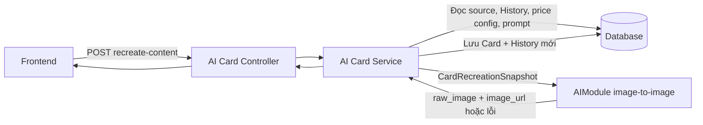
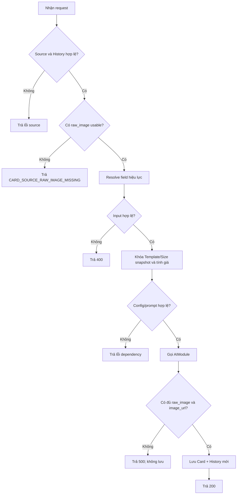
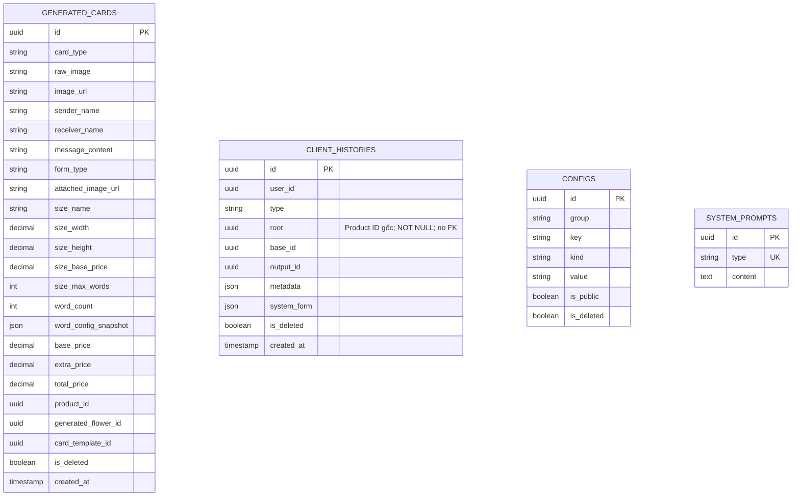

# TDD-027: Tạo lại thiệp AI giữ thiết kế gốc

## Thông tin tài liệu

| Trường | Giá trị |
|---|---|
| Mã tài liệu | TDD-027 |
| Tiêu đề | Tạo phiên bản Card AI mới từ History, dùng ảnh gốc làm tham chiếu |
| Phiên bản | v1.5 |
| Author | Nguyễn Tùng Dương |
| Reviewer | Tân Trần |
| Approver | Chưa chỉ định |
| Owner | Nguyễn Tùng Dương |
| Cập nhật gần nhất | 2026-09-09 |

---

## BƯỚC 1 — Thông tin & Bối cảnh

### Thông tin tài liệu

- **Mã tài liệu**: TDD-027
- **Tính năng**: Tạo Card AI mới từ một Card AI trong History, giữ Template/Size và cho phép đổi nội dung cá nhân hóa.
- **Endpoint**: `POST /api/ai-cards/{source_card_id}/recreate-content`.
- **Quan hệ với TDD-007**: TDD-007 giữ nội dung và cho đổi Template; TDD-027 khóa Template/Size và cho sửa nội dung.

### Business Rules

- **BR-027-01**: `generated_cards.raw_image` lưu URL ảnh gốc do AI sinh trước khi chèn chữ; `image_url` lưu ảnh hoàn chỉnh. Cột `raw_image` nullable chỉ để tương thích dữ liệu cũ, còn Card AI mới thành công phải có cả hai URL hợp lệ.
- **BR-027-02**: `AIModule` trả kết quả cuối cùng gồm đủ `raw_image` và `image_url`, hoặc trả lỗi. Service không persist Card/History nếu thiếu một trong hai ảnh.
- **BR-027-03**: API yêu cầu đăng nhập. `source_card_id` là `generated_cards.id` từ `client_histories.output_id`, không phải History ID.
- **BR-027-04**: Source phải tồn tại, thuộc user hiện tại, có `card_type="ai"` và có History của user với `type="card"`, `output_id=source_card_id` cùng snapshot, `base_id` và `root` Product đủ dùng. `root` bắt buộc khác `Guid.Empty`.
- **BR-027-05**: Source HandMade trả `HANDMADE_CARD_RECREATE_NOT_SUPPORTED/409`. Source Card AI thiếu `raw_image` usable trả `CARD_SOURCE_RAW_IMAGE_MISSING/409`; không dùng `image_url` thay thế.
- **BR-027-06**: Không kiểm tra live Product, Generated Flower, Template hoặc Size nguồn. TDD này dùng dữ liệu bất biến trong Card/History nguồn.
- **BR-027-07**: Client không được gửi `card_template_id`, `size`, `product_id` hoặc `generated_flower_id`. Template snapshot và toàn bộ Size snapshot bắt buộc lấy từ nguồn.
- **BR-027-08**: Các text field `sender_name`, `receiver_name`, `message_content` bị bỏ, `null`, rỗng hoặc chỉ có khoảng trắng thì dùng giá trị nguồn. Giá trị hiệu lực phải thỏa validation của TDD-006: sender/receiver tối đa 20 từ; message không vượt giới hạn của Size snapshot.
- **BR-027-09**: `form_type` bị bỏ hoặc `null` thì dùng nguồn; giá trị explicit chỉ nhận `go_may` hoặc `calligraphy`.
- **BR-027-10**: `attached_image_url` bị bỏ thì dùng nguồn; explicit `null` nghĩa là bỏ ảnh đính kèm; chuỗi không rỗng phải thỏa validation URL/upload của TDD-006.
- **BR-027-11**: Size snapshot nguồn quyết định `size_name`, `size_width`, `size_height`, `size_base_price`, `size_max_words`; không đọc Size Config live.
- **BR-027-12**: Hệ thống tính lại `word_count` từ `message_content` hiệu lực. `go_may` có `extra_price=0`. `calligraphy` dùng singleton `card_config.prices` hiện hành, validate wrapper/value/ranges và chọn đúng một rule khớp; giá không sao chép từ Card nguồn.
- **BR-027-13**: Prompt hiện hành `type="card"` phải tồn tại và có content hợp lệ; không fallback prompt của Card nguồn.
- **BR-027-14**: Sau validation, service dựng `CardRecreationSnapshot` gồm source Card/History ID, tham chiếu `raw_image`, Template/Size snapshots, input hiệu lực, pricing snapshot, full prompt và `validated_at` UTC.
- **BR-027-15**: Service gọi `AIModule` bằng snapshot và chỉ xử lý kết quả cuối cùng. Cách module giao tiếp với nhà cung cấp hoặc xử lý nội bộ không thuộc TDD này.
- **BR-027-16**: Thành công tạo đồng thời một `generated_cards(card_type="ai")` mới và một `client_histories(type="card")` mới. Card/History nguồn không bị sửa hoặc xóa.
- **BR-027-17**: History mới kế thừa cả `base_id` và `root` của History nguồn; `root` tiếp tục là Product ID gốc, không được tính lại từ metadata; `output_id` là ID Card mới; `metadata.recreated_from_card_id` là ID Card trực tiếp được chọn. Thiếu `root` hợp lệ trả `CARD_SOURCE_HISTORY_INVALID/409`.
- **BR-027-18**: `client_histories` không lưu input. `metadata` chỉ giữ provenance cần thiết; `system_form` lưu `{type, content}` của prompt thực tế và không lưu ID.
- **BR-027-19**: Kết quả mới không tự liên kết Checkout/Order. Validation của các flow đó nằm ngoài TDD này.

### Bối cảnh & Mục tiêu

**Vấn đề**

Khách hàng muốn giữ phong cách của một Card AI trong lịch sử nhưng thay tên, lời chúc, hình thức chữ hoặc ảnh đính kèm. Ảnh `raw_image` của Card nguồn được dùng làm image-reference để tránh lấy ảnh đã chèn chữ làm nguồn.

**Mục tiêu**

- Khóa Template/Size theo source snapshot.
- Quy định rõ fallback của từng field được phép sửa.
- Tính lại số từ và giá theo input hiệu lực.
- Tạo Card/History mới mà không thay đổi source.
- Mô tả đầy đủ request, response và mã lỗi.

**Ngoài phạm vi**

- Định lượng tỷ lệ giống thiết kế; đây là mục tiêu của prompt/model trong `AIModule`.
- Sửa Card nguồn.
- Checkout, Order và validation nguồn live.
- Chi tiết triển khai nội bộ hoặc nhà cung cấp của `AIModule`.

---

## BƯỚC 2 — Kiến trúc & Sơ đồ

### Kiến trúc tổng quan



**Ghi chú**: `AIModule` là dependency khái niệm đã được dùng trong AI Card Context; tài liệu không khẳng định class, endpoint hoặc transport cụ thể.

### Sequence Diagram

```mermaid
sequenceDiagram
    autonumber
    actor Client
    participant API as AI Card Controller
    participant S as AI Card Service
    participant DB as Database
    participant AI as AIModule

    Client->>API: POST /api/ai-cards/{source_card_id}/recreate-content
    API->>S: source_card_id + editable fields
    S->>DB: Đọc source Card và History
    S->>S: Kiểm tra owner, card_type, raw_image và source snapshots
    S->>S: Resolve fallback; validate effective input
    S->>S: Khóa Template/Size snapshot; tính word_count
    opt Effective form_type là calligraphy
        S->>DB: Đọc và kiểm tra card_config.prices
        S->>S: Chọn price rule và tính giá
    end
    S->>DB: Đọc prompt card hiện hành
    S->>S: Dựng CardRecreationSnapshot
    S->>AI: Generate(snapshot có source raw_image)
    alt Kết quả cuối cùng không hợp lệ
        AI-->>S: Error hoặc thiếu ảnh
        S-->>API: INTERNAL_SERVER_ERROR
    else Có đủ hai ảnh
        AI-->>S: raw_image, image_url
        S->>DB: Transaction tạo Card và History mới
        S-->>API: Card mới
    end
    API-->>Client: HTTP response
```

### Activity Diagram



### State Diagram

Không áp dụng. API tạo resource mới ở trạng thái hoàn tất và không thay đổi trạng thái của Card nguồn.

### Mô hình dữ liệu (ERD)

**Mô tả**: Chỉ thể hiện bảng và field; không vẽ dây nối quan hệ. Quan hệ đa hình được mô tả dưới sơ đồ.



- History mới có `type="card"`, kế thừa `base_id/root` nguồn và trỏ `output_id` đến Card mới. `root` là Product ID gốc, bắt buộc, không có FK và không nằm trong response API.
- `metadata.recreated_from_card_id` lưu parent trực tiếp; không cần FK mới.

---

## BƯỚC 3 — API

### API Contract nội bộ

- **Method**: `POST`
- **Endpoint**: `/api/ai-cards/{source_card_id}/recreate-content`
- **Tên endpoint**: Recreate Card AI Content
- **Thành công**: HTTP `200`

#### Path parameter

| Field | Kiểu | Bắt buộc | Mô tả |
|---|---|---:|---|
| `source_card_id` | uuid | Có | ID `generated_cards` của Card được chọn từ History. Không nhận History ID. |

#### Request body

| Field | Kiểu | Bắt buộc | Mô tả |
|---|---|---:|---|
| `sender_name` | string/null | Không | Bỏ/null/rỗng/blank dùng người gửi nguồn; giá trị mới tối đa 20 từ. |
| `receiver_name` | string/null | Không | Bỏ/null/rỗng/blank dùng người nhận nguồn; giá trị mới tối đa 20 từ. |
| `message_content` | string/null | Không | Bỏ/null/rỗng/blank dùng lời chúc nguồn; giá trị hiệu lực không vượt `size_max_words` của source snapshot. |
| `form_type` | `go_may`/`calligraphy`/null | Không | Bỏ/null dùng nguồn. Không nhận giá trị khác hai enum này. |
| `attached_image_url` | string URL/null | Không | Bỏ field dùng ảnh nguồn; `null` chủ động bỏ ảnh; chuỗi phải là URL/upload hợp lệ theo TDD-006. |

Các field bị khóa và luôn bị từ chối nếu xuất hiện: `card_template_id`, `size`, `product_id`, `generated_flower_id`.

#### Response fields

| Field | Kiểu | Mô tả |
|---|---|---|
| `value.id` | uuid | ID Card mới. |
| `value.content` | string/null | Nội dung lưu trên Generated Card theo model kết quả. |
| `value.card_type` | string | Luôn là `ai`. |
| `value.image_url` | URL | Ảnh hoàn chỉnh đã chèn chữ. |
| `value.raw_image` | URL | Ảnh AI gốc trước chèn chữ; dùng cho lần recreate sau. |
| `value.user_id` | uuid | User sở hữu Card mới. |
| `value.created_at` | datetime UTC | Thời điểm tạo Card mới. |
| `value.sender_name` | string | Người gửi sau khi resolve fallback. |
| `value.receiver_name` | string | Người nhận sau khi resolve fallback. |
| `value.message_content` | string | Lời chúc sau khi resolve fallback. |
| `value.form_type` | string | `go_may` hoặc `calligraphy` hiệu lực. |
| `value.attached_image_url` | URL/null | Ảnh đính kèm hiệu lực. |
| `value.size_name` | string | Tên Size kế thừa. |
| `value.size_width` | decimal | Chiều rộng Size snapshot. |
| `value.size_height` | decimal | Chiều cao Size snapshot. |
| `value.size_base_price` | decimal | Giá Size trong snapshot nguồn. |
| `value.size_max_words` | integer | Giới hạn từ dùng để validate message. |
| `value.word_count` | integer | Số từ của message hiệu lực. |
| `value.word_config_snapshot` | object/null | Rule giá thực tế; `null` với `go_may`. |
| `value.base_price` | decimal | Bằng `size_base_price`. |
| `value.extra_price` | decimal | Phụ phí chữ viết tay hoặc `0`. |
| `value.total_price` | decimal | `base_price + extra_price`. |

Response lỗi dùng `title`, `status`, `detail`, `messageCode`, `errors`, `traceId`, `timestampUtc` theo envelope hiện hành.

### Các tình huống request/response

**S01 — Đổi toàn bộ field được phép, bỏ ảnh đính kèm**

Request:

```http
POST /api/ai-cards/550e8400-e29b-41d4-a716-446655440001/recreate-content
Content-Type: application/json

{
  "sender_name": "Minh Anh",
  "receiver_name": "Ngọc Lan",
  "message_content": "Chúc bạn luôn rạng rỡ và hạnh phúc.",
  "form_type": "go_may",
  "attached_image_url": null
}
```

Response — HTTP `200`:

```json
{
  "value": {
    "id": "880e8400-e29b-41d4-a716-446655440099",
    "content": "Chúc bạn luôn rạng rỡ và hạnh phúc.",
    "card_type": "ai",
    "image_url": "https://storage.example.com/cards/880e8400-final.png",
    "raw_image": "https://storage.example.com/cards/880e8400-raw.png",
    "user_id": "770e8400-e29b-41d4-a716-446655440004",
    "created_at": "2026-09-08T10:00:00Z",
    "sender_name": "Minh Anh",
    "receiver_name": "Ngọc Lan",
    "message_content": "Chúc bạn luôn rạng rỡ và hạnh phúc.",
    "form_type": "go_may",
    "attached_image_url": null,
    "size_name": "Kích thước chung",
    "size_width": 10,
    "size_height": 20,
    "size_base_price": 10000,
    "size_max_words": 100,
    "word_count": 8,
    "word_config_snapshot": null,
    "base_price": 10000,
    "extra_price": 0,
    "total_price": 10000
  }
}
```

**S02 — Dùng fallback nguồn và đổi sang calligraphy**

Giả định source có sender `An`, receiver `Bình`, message 45 từ, ảnh đính kèm hợp lệ và snapshot Size chung. Request bỏ các field đó nên hệ thống dùng nguyên giá trị nguồn.

Request:

```http
POST /api/ai-cards/550e8400-e29b-41d4-a716-446655440001/recreate-content
Content-Type: application/json

{
  "form_type": "calligraphy"
}
```

Response — HTTP `200`:

```json
{
  "value": {
    "id": "880e8400-e29b-41d4-a716-446655440100",
    "content": "Nội dung nguồn đại diện có 45 từ",
    "card_type": "ai",
    "image_url": "https://storage.example.com/cards/880e8400-final-2.png",
    "raw_image": "https://storage.example.com/cards/880e8400-raw-2.png",
    "user_id": "770e8400-e29b-41d4-a716-446655440004",
    "created_at": "2026-09-08T10:05:00Z",
    "sender_name": "An",
    "receiver_name": "Bình",
    "message_content": "Nội dung nguồn đại diện có 45 từ",
    "form_type": "calligraphy",
    "attached_image_url": "https://storage.example.com/cards/source-attachment.png",
    "size_name": "Kích thước chung",
    "size_width": 15,
    "size_height": 25,
    "size_base_price": 15000,
    "size_max_words": 150,
    "word_count": 45,
    "word_config_snapshot": {
      "min_words": 36,
      "max_words": 70,
      "extra_price": 39000
    },
    "base_price": 15000,
    "extra_price": 39000,
    "total_price": 54000
  }
}
```

**S03 — Gửi ảnh đính kèm mới**

Request:

```http
POST /api/ai-cards/550e8400-e29b-41d4-a716-446655440001/recreate-content
Content-Type: application/json

{
  "attached_image_url": "https://storage.example.com/uploads/new-photo.png"
}
```

Response — HTTP `200`: cùng schema S01; `value.attached_image_url` bằng URL mới, các field được bỏ lấy từ nguồn.

**Ghi chú đại diện**: S02 đại diện cho việc bỏ field, `null`, `""` hoặc chuỗi chỉ có khoảng trắng ở ba text field vì bốn input này cùng cho một kết quả fallback. Với `attached_image_url`, không truyền và `null` là hai hành vi khác nhau nên S01 và S02 được tách riêng.

### Các tình huống lỗi

Mỗi hàng là một cặp request/response hoàn chỉnh. “Như S01” nghĩa là giữ path/body S01 và chỉ thay điều kiện nêu trong cột Request.

| ID | Request | Response |
|---|---|---|
| E01 | Không có token; request như S01. | HTTP `401`, `messageCode=UNAUTHORIZED`. |
| E02 | Path có `source_card_id` không tồn tại; body `{}`. | HTTP `404`, `messageCode=CARD_NOT_FOUND`. |
| E03 | Path là Card tồn tại nhưng Card/History thuộc user khác; body `{}`. | HTTP `403`, `messageCode=ACCESS_DENIED`. |
| E04 | Path là Card HandMade; body `{}`. | HTTP `409`, `messageCode=HANDMADE_CARD_RECREATE_NOT_SUPPORTED`. |
| E05 | Path là Card AI nguồn có `raw_image=null` hoặc URL unusable; body `{}`. | HTTP `409`, `messageCode=CARD_SOURCE_RAW_IMAGE_MISSING`. |
| E06 | Path là Card AI nhưng thiếu History, `base_id/root` Product hợp lệ, Template/Size snapshot hoặc dữ liệu nguồn bắt buộc; body `{}`. | HTTP `409`, `messageCode=CARD_SOURCE_HISTORY_INVALID`. |
| E07 | Body có `card_template_id`. Đại diện cả `size`, `product_id`, `generated_flower_id` vì cùng kết quả. | HTTP `400`, `messageCode=RECREATE_LOCKED_FIELD_NOT_ALLOWED`. |
| E08 | Body như S01 nhưng `sender_name` trên 20 từ. Đại diện receiver quá 20 từ và message vượt `size_max_words`. | HTTP `400`, `messageCode=VALIDATION_ERROR`, `errors` chỉ rõ field sai. |
| E09 | Body có `form_type="handwriting"`. | HTTP `400`, `messageCode=VALIDATION_ERROR`, lỗi field `form_type`. |
| E10 | Body có `attached_image_url` không hợp lệ. | HTTP `400`, `messageCode=VALIDATION_ERROR`, lỗi field `attached_image_url`. |
| E11 | Body chọn `calligraphy`; không có singleton `card_config.prices`. | HTTP `404`, `messageCode=CALLIGRAPHY_CONFIG_NOT_FOUND`. |
| E12 | Body chọn `calligraphy`; Price Config đã soft-delete. | HTTP `410`, `messageCode=CALLIGRAPHY_CONFIG_DELETED`. |
| E13 | Body chọn `calligraphy`; Price Config chưa xóa nhưng `isPublic=false`. | HTTP `409`, `messageCode=CALLIGRAPHY_CONFIG_INACTIVE`. |
| E14 | Body chọn `calligraphy`; wrapper, JSON value, item hoặc ranges của Price Config sai schema. | HTTP `409`, `messageCode=CALLIGRAPHY_CONFIG_INVALID`. |
| E15 | Body chọn `calligraphy`; không có range khớp `word_count`. | HTTP `422`, `messageCode=CALLIGRAPHY_PRICE_RULE_NOT_FOUND`. |
| E16 | Request hợp lệ như S01 nhưng prompt `card` hiện hành thiếu/rỗng/không hợp lệ. | HTTP `409`, `messageCode=SYSTEM_PROMPT_INVALID`. |
| E17 | Request hợp lệ như S01; `AIModule`, upload/lưu ảnh hoặc transaction persistence trả lỗi cuối cùng. | HTTP `500`, `messageCode=INTERNAL_SERVER_ERROR`; source không đổi và không tạo Card/History mới. |

Response lỗi mẫu cho E05:

```json
{
  "title": "Conflict",
  "status": 409,
  "detail": "Card nguồn không có ảnh gốc dùng được để làm tham chiếu.",
  "messageCode": "CARD_SOURCE_RAW_IMAGE_MISSING",
  "errors": null,
  "traceId": "00-...",
  "timestampUtc": "2026-09-08T10:00:00Z"
}
```

Các hàng còn lại dùng cùng envelope và thay `status`, `detail`, `messageCode`, `errors` theo bảng.

### Danh mục mã lỗi

| Code | HTTP | Khi nào xảy ra |
|---|---:|---|
| `UNAUTHORIZED` | 401 | Chưa đăng nhập hoặc tài khoản không hoạt động. |
| `CARD_NOT_FOUND` | 404 | Không có Card theo `source_card_id`. |
| `ACCESS_DENIED` | 403 | Card/History nguồn không thuộc user hiện tại. |
| `HANDMADE_CARD_RECREATE_NOT_SUPPORTED` | 409 | Source không phải Card AI. |
| `CARD_SOURCE_RAW_IMAGE_MISSING` | 409 | Card AI nguồn không có `raw_image` usable. |
| `CARD_SOURCE_HISTORY_INVALID` | 409 | Source thiếu History, `base_id/root` Product hợp lệ, Template/Size snapshot hoặc dữ liệu bắt buộc. |
| `RECREATE_LOCKED_FIELD_NOT_ALLOWED` | 400 | Body chứa một field bị khóa. |
| `VALIDATION_ERROR` | 400 | Nội dung, form type, ảnh đính kèm hoặc request shape không hợp lệ. |
| `CALLIGRAPHY_CONFIG_NOT_FOUND` | 404 | Không có singleton `card_config.prices`. |
| `CALLIGRAPHY_CONFIG_DELETED` | 410 | Price Config đã soft-delete. |
| `CALLIGRAPHY_CONFIG_INACTIVE` | 409 | Price Config có `isPublic=false`. |
| `CALLIGRAPHY_CONFIG_INVALID` | 409 | Wrapper, JSON value, item hoặc ranges sai schema. |
| `CALLIGRAPHY_PRICE_RULE_NOT_FOUND` | 422 | `word_count` không thuộc rule nào. |
| `SYSTEM_PROMPT_INVALID` | 409 | Prompt hiện hành `type="card"` thiếu/rỗng/không hợp lệ. |
| `INTERNAL_SERVER_ERROR` | 500 | Dependency tạo ảnh, lưu ảnh hoặc persistence trả lỗi cuối cùng. |

### Contract với AIModule

- Input là `CardRecreationSnapshot` có source `raw_image`, Template/Size snapshots, effective input, pricing và full prompt hiện hành.
- Output thành công bắt buộc có cả `raw_image` và `image_url`; output thiếu một field được xem là lỗi cuối cùng.
- Mục tiêu giữ đặc trưng thiết kế nằm trong prompt/khả năng của module; service không chấm một tỷ lệ giống định lượng.
- Endpoint, credential, model và transport của nhà cung cấp chưa được xác định trong codebase nên không được quy định tại TDD này.

---

## BƯỚC 4 — Tham chiếu

### 🔴 Tham chiếu đến

- TDD-006 — validation nội dung, Size và cách tính Calligraphy/pricing của Card Create.
- TDD-007 — flow tạo lại khác: giữ nội dung và cho đổi Template.
- `AI_Card_Context.md` — context tổng thể và các chính sách vận hành thuộc AI Module.
- `AI_DB_Diagram.md`, `AI_CUSTOMIZE_DB.dbdiagram` — schema `raw_image`, Generated Card và History.

### ⚫ Trỏ vào tài liệu này

- Chưa có TDD/UT khác trỏ trực tiếp tại thời điểm cập nhật.

### ⋯ Bị ảnh hưởng

- AI Card implementation — cần hỗ trợ image-reference input và output hai ảnh.
- Database migration/EF mapping — cần có `generated_cards.raw_image` nullable cho legacy nhưng bắt buộc ở Card AI mới.
