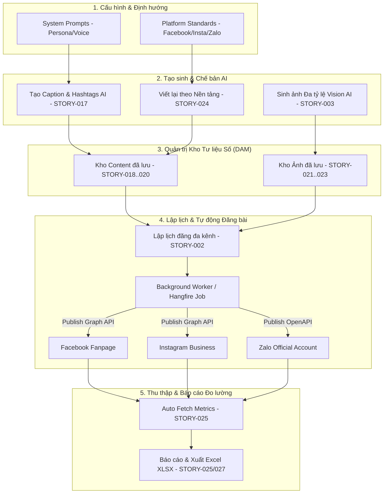
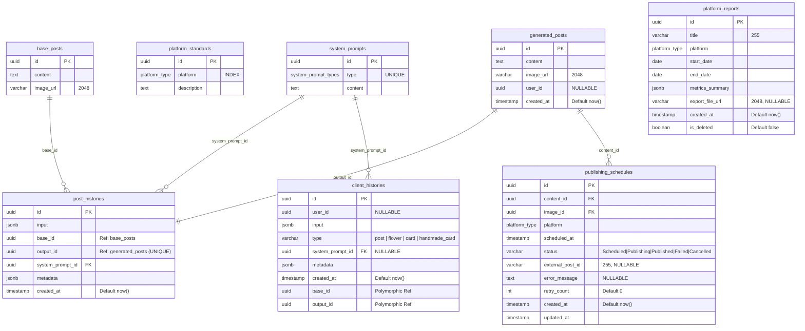
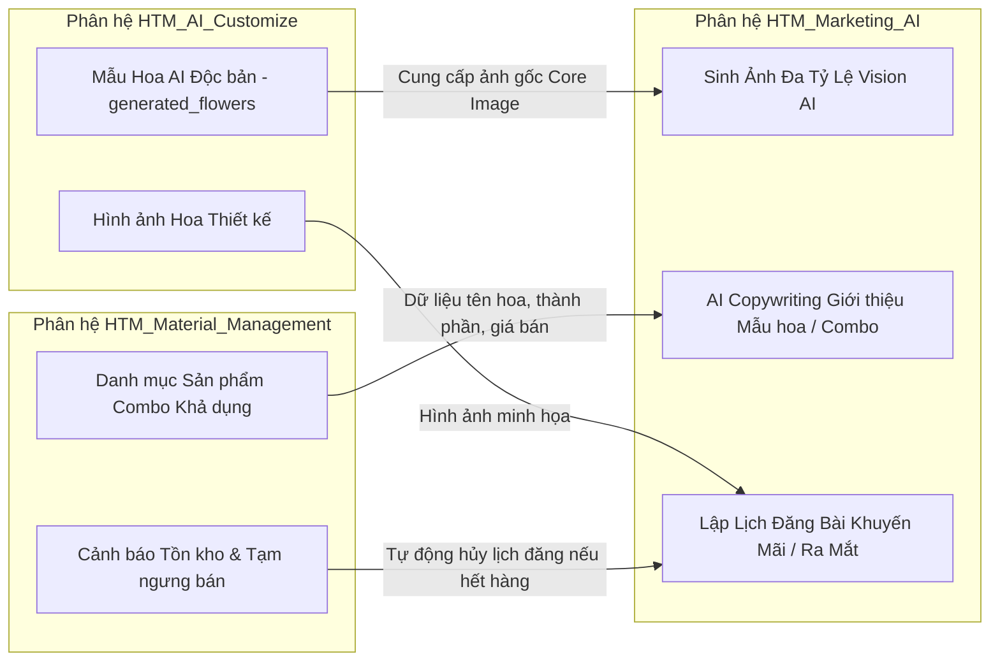

# AI Marketing Context & Architecture — HTM_Marketing_AI

> **Dự án**: Hoa Theo Mùa (`hoa-theo-mua-ai-marketing`)  
> **Phân hệ**: `HTM_Marketing_AI` (Marketing & Social Media Automation Subsystem)  
> **Phương pháp tiếp cận**: Document-First Architecture & Domain Context Specification  
> **Phiên bản tài liệu**: v1.0  
> **Ngày phê duyệt**: 09/09/2026  
> **Trạng thái**: Chuẩn hóa từ 19 User Stories (STORY-002 đến STORY-027), 78 Business Rules và CSDL PostgreSQL/EF Core  

---

## MỤC LỤC

1. [Tổng quan Phân hệ](#1-tổng-quan-phân-hệ)
2. [Ma trận Ánh xạ 19 User Stories](#2-ma-trận-ánh-xạ-19-user-stories)
3. [Kiến trúc Nghiệp vụ 6 Phân nhóm (Business Domains)](#3-kiến-trúc-nghiệp-vụ-6-phân-nhóm-business-domains)
   - [3.1. Domain 1: Quản trị Cấu hình & System Prompts](#31-domain-1-quản-trị-cấu-hình--system-prompts)
   - [3.2. Domain 2: Sáng tạo Nội dung AI & Thích ứng Đa nền tảng (AI Copywriting)](#32-domain-2-sáng-tạo-nội-dung-ai--thích-ứng-đa-nền-tảng-ai-copywriting)
   - [3.3. Domain 3: Xử lý Đồ họa Đa tỷ lệ Vision AI](#33-domain-3-xử-lý-đồ-họa-đa-tỷ-lệ-vision-ai)
   - [3.4. Domain 4: Quản trị Kho Nội dung & Thư viện Số (Digital Asset Management)](#34-domain-4-quản-trị-kho-nội-dung--thư-viện-số-digital-asset-management)
   - [3.5. Domain 5: Lập lịch & Tự động Đăng bài Đa kênh (Multi-channel Auto Publishing)](#35-domain-5-lập-lịch--tự-động-đăng-bài-đa-kênh-multi-channel-auto-publishing)
   - [3.6. Domain 6: Thu thập & Quản lý Báo cáo Đo lường Đa nền tảng (Social Analytics & Reporting)](#36-domain-6-thu-thập--quản-lý-báo-cáo-đo-lường-đa-nền-tảng-social-analytics--reporting)
4. [Kiến trúc Cơ sở Dữ liệu & Data Dictionary](#4-kiến-trúc-cơ-sở-dữ-liệu--data-dictionary) — [Bản Bổ Sung Mở Rộng: Marketing_AI_DB_Bonus.md](file:///d:/VNZ/document-first-brief/hoa-theo-mua-ai-marketing/Context/Marketing_AI_DB_Bonus.md)
   - [4.1. Sơ đồ Thực thể Quan hệ (Mermaid ERD)](#41-sơ-đồ-thực-thể-quan-hệ-mermaid-erd)
   - [4.2. Cơ chế Snapshot Bất biến (Immutable Metadata)](#42-cơ-chế-snapshot-bất-biến-immutable-metadata)
   - [4.3. Thiết kế Đa hình (Polymorphic Pattern) với `client_histories`](#43-thiết-kế-đa-hình-polymorphic-pattern-với-client_histories)
5. [Quy tắc Nghiệp vụ Cốt lõi (Core Business Rules)](#5-quy-tắc-nghiệp-vụ-cốt-lõi-core-business-rules)
6. [Tích hợp Bên thứ ba & Hợp đồng API (External Integrations)](#6-tích-hợp-bên-thứ-ba--hợp-đồng-api-external-integrations)
   - [6.1. Mô hình AI Tạo sinh (LLM & Vision AI Providers)](#61-mô-hình-ai-tạo-sinh-llm--vision-ai-providers)
   - [6.2. Mạng xã hội (Meta Graph API & Zalo OA OpenAPI)](#62-mạng-xã-hội-meta-graph-api--zalo-oa-openapi)
   - [6.3. Động cơ Lập lịch Nền (Background Worker Engine)](#63-động-cơ-lập-lịch-nền-background-worker-engine)
   - [6.4. Công cụ Xuất Báo cáo Excel (.XLSX)](#64-công-cụ-xuất-báo-cáo-excel-xlsx)
7. [Bảng Mã lỗi Hệ thống Chuẩn hóa](#7-bảng-mã-lỗi-hệ-thống-chuẩn-hóa)
8. [Tương tác Liên Phân hệ (Inter-module Architecture)](#8-tương-tác-liên-phân-hệ-inter-module-architecture)

---

## 1. TỔNG QUAN PHÂN HỆ

### 1.1. Sứ mệnh & Bối cảnh Nghiệp vụ
Phân hệ **HTM_Marketing_AI** ra đời nhằm giải quyết bài toán vận hành truyền thông số của chuỗi hoa tươi cao cấp **Hoa Theo Mùa**:
- **Cá nhân hóa truyền thông theo mùa & sự kiện**: Nhu cầu sáng tạo nội dung hoa tươi biến đổi liên tục theo các dịp lễ (Valentine, 8/3, 20/10, Giáng sinh, Tết, Khai trương, Sinh nhật...). Đội ngũ marketing cần công cụ tạo caption hấp dẫn, chuẩn giọng điệu thương hiệu (Brand Voice) và đề xuất bộ hashtag tối ưu khả năng khám phá tự nhiên.
- **Thích ứng định dạng đa nền tảng**: Mỗi mạng xã hội (Facebook, Instagram, Zalo OA) có hành vi độc giả và tiêu chuẩn kỹ thuật khác nhau (Facebook cần CTA mạnh mẽ; Instagram tập trung hình ảnh visual và hashtag; Zalo OA cần sự trang trọng, ngắn gọn). Hệ thống giúp viết lại (rewrite) bài viết gốc sang đúng phong cách từng kênh trong một cú click.
- **Chuẩn hóa kích thước hình ảnh tự động (Vision AI)**: Từ một ảnh sản phẩm gốc (Core Image), AI tự động tạo ra 5 tỷ lệ kích thước chuẩn (`1:1`, `4:5`, `9:16`, `16:9`, `2:1`) mà không làm méo hay cắt lẹm các chi tiết nhận diện thương hiệu (Safe Zone).
- **Tự động hóa đăng bài & thu thập báo cáo**: Đảm bảo luồng xuất bản xuyên suốt từ khâu duyệt nội dung -> lên lịch đăng tự động đa kênh -> tự động cào số liệu tương tác (Reach, Impression, Engagement, Clicks) định kỳ -> xuất báo cáo phân tích Excel (.XLSX).

### 1.2. Sơ đồ Luồng Hoạt động Tổng thể (End-to-End Workflow)



---

## 2. MA TRẬN ÁNH XẠ 19 USER STORIES

Phân hệ được thiết kế theo phương pháp **Document-First**, hoàn thiện đặc tả chi tiết 19 User Stories (từ khâu yêu cầu, quy tắc nghiệp vụ đến Acceptance Criteria BDD):

| Mã Story | Tên User Story | Nhóm chức năng | Sprint | Độ ưu tiên | Vai trò chính |
| :--- | :--- | :--- | :---: | :---: | :--- |
| [**STORY-002**](file:///d:/VNZ/document-first-brief/hoa-theo-mua-ai-marketing/UserStory/02-ScheduleAndAutoPublishPosts.md) | Lên lịch và tự động đăng bài đa nền tảng | Auto Publishing | S1 | Must | Quản trị viên (Admin) |
| [**STORY-003**](file:///d:/VNZ/document-first-brief/hoa-theo-mua-ai-marketing/UserStory/03-AutoGenerateMultiRatioImagesFromCore.md) | Tự động sinh ảnh đa tỷ lệ từ ảnh core | Vision AI | S1 | Must | Quản trị viên (Admin) |
| [**STORY-004**](file:///d:/VNZ/document-first-brief/hoa-theo-mua-ai-marketing/UserStory/04-ViewSystemPromptsListAndDetail.md) | Xem danh sách và chi tiết System Prompt | System Prompt | S1 | Must | Quản trị viên (Admin) |
| [**STORY-005**](file:///d:/VNZ/document-first-brief/hoa-theo-mua-ai-marketing/UserStory/05-UpdateSystemPrompt.md) | Sửa System Prompt & Quản lý phiên bản | System Prompt | S1 | Must | Quản trị viên (Admin) |
| [**STORY-006**](file:///d:/VNZ/document-first-brief/hoa-theo-mua-ai-marketing/UserStory/06-DeleteSystemPrompt.md) | Xóa System Prompt không còn sử dụng | System Prompt | S1 | Won't | Quản trị viên (Admin) |
| [**STORY-012**](file:///d:/VNZ/document-first-brief/hoa-theo-mua-ai-marketing/UserStory/12-SearchSystemPrompts.md) | Tìm kiếm System Prompt theo tên/mã | System Prompt | S1 | Won't | Quản trị viên (Admin) |
| [**STORY-013**](file:///d:/VNZ/document-first-brief/hoa-theo-mua-ai-marketing/UserStory/13-FilterSystemPrompts.md) | Lọc System Prompt theo trạng thái | System Prompt | S1 | Won't | Quản trị viên (Admin) |
| [**STORY-014**](file:///d:/VNZ/document-first-brief/hoa-theo-mua-ai-marketing/UserStory/14-ViewAutoPublishSchedules.md) | Xem danh sách và chi tiết lịch đăng bài | Auto Publishing | S1 | Must | Quản trị viên (Admin) |
| [**STORY-015**](file:///d:/VNZ/document-first-brief/hoa-theo-mua-ai-marketing/UserStory/15-DeleteAutoPublishSchedule.md) | Xóa lịch đăng bài tự động & hủy Cron Job | Auto Publishing | S1 | Must | Quản trị viên (Admin) |
| [**STORY-016**](file:///d:/VNZ/document-first-brief/hoa-theo-mua-ai-marketing/UserStory/16-UpdateAutoPublishSchedule.md) | Cập nhật thông tin lịch đăng bài tự động | Auto Publishing | S1 | Must | Quản trị viên (Admin) |
| [**STORY-017**](file:///d:/VNZ/document-first-brief/hoa-theo-mua-ai-marketing/UserStory/17-AutoGenerateContentAndHashtags.md) | Tự động viết content và hashtag bằng AI | AI Copywriting | S1 | Must | Quản trị viên (Admin) |
| [**STORY-018**](file:///d:/VNZ/document-first-brief/hoa-theo-mua-ai-marketing/UserStory/18-ViewSavedContentListAndDetail.md) | Xem danh sách, tìm kiếm & chi tiết content | Content DAM | S1 | Must | Quản trị viên (Admin) |
| [**STORY-019**](file:///d:/VNZ/document-first-brief/hoa-theo-mua-ai-marketing/UserStory/19-DeleteSavedContent.md) | Xóa an toàn content đã lưu lại | Content DAM | S1 | Must | Quản trị viên (Admin) |
| [**STORY-020**](file:///d:/VNZ/document-first-brief/hoa-theo-mua-ai-marketing/UserStory/20-UpdateSavedContent.md) | Chỉnh sửa content và danh sách hashtag | Content DAM | S1 | Must | Quản trị viên (Admin) |
| [**STORY-021**](file:///d:/VNZ/document-first-brief/hoa-theo-mua-ai-marketing/UserStory/21-ViewSavedImagesListAndDetail.md) | Xem danh sách, tìm kiếm & chi tiết ảnh | Image DAM | S1 | Must | Quản trị viên (Admin) |
| [**STORY-022**](file:///d:/VNZ/document-first-brief/hoa-theo-mua-ai-marketing/UserStory/22-DeleteSavedImage.md) | Xóa ảnh đã lưu & Cascade Delete biến thể con | Image DAM | S1 | Must | Quản trị viên (Admin) |
| [**STORY-023**](file:///d:/VNZ/document-first-brief/hoa-theo-mua-ai-marketing/UserStory/23-UpdateSavedImageInfo.md) | Sửa metadata ảnh (tên, mô tả, thẻ tags) | Image DAM | S1 | Must | Quản trị viên (Admin) |
| [**STORY-024**](file:///d:/VNZ/document-first-brief/hoa-theo-mua-ai-marketing/UserStory/24-RewriteContentByPlatform.md) | Tự động viết lại nội dung theo từng nền tảng | AI Copywriting | S1 | Must | Quản trị viên (Admin) |
| [**STORY-025**](file:///d:/VNZ/document-first-brief/hoa-theo-mua-ai-marketing/UserStory/25-CollectAndManagePlatformReports.md) | Thu thập & quản lý báo cáo từ các nền tảng | Analytics | S1 | Must | Quản trị viên (Admin) |
| [**STORY-027**](file:///d:/VNZ/document-first-brief/hoa-theo-mua-ai-marketing/UserStory/27-DeleteSavedReport.md) | Xóa báo cáo đã lưu không còn cần thiết | Analytics | S1 | Must | Quản trị viên (Admin) |

---

## 3. KIẾN TRÚC NGHIỆP VỤ 6 PHÂN NHÓM (BUSINESS DOMAINS)

### 3.1. Domain 1: Quản trị Cấu hình & System Prompts
- **Mục tiêu**: Cung cấp khả năng tinh chỉnh văn phong, persona, chỉ dẫn an toàn và phong cách viết bài cho mô hình AI mà không cần can thiệp code backend.
- **Thực thể dữ liệu**: `system_prompts`.
- **Đặc tả hoạt động**:
  - Mỗi loại System Prompt gắn với một `type` duy nhất (`flower`, `card`, `post`). Phân hệ Marketing AI sử dụng chủ yếu `type = 'post'`.
  - Giới hạn độ dài nội dung prompt: từ **1 đến 20.000 ký tự** ([BR-041](file:///d:/VNZ/document-first-brief/hoa-theo-mua-ai-marketing/BusinessRules/BR-041.md)).
  - Cơ chế phiên bản hóa & lưu vết: Khi cập nhật nội dung, hệ thống tự động tăng số phiên bản và lưu vết lịch sử người sửa ([BR-042](file:///d:/VNZ/document-first-brief/hoa-theo-mua-ai-marketing/BusinessRules/BR-042.md), [BR-045](file:///d:/VNZ/document-first-brief/hoa-theo-mua-ai-marketing/BusinessRules/BR-045.md)).
  - Ràng buộc an toàn: Không cho phép xóa System Prompt đang là bản duy nhất của một `type` hoặc đang được tham chiếu bởi các tác vụ sinh bài viết đang hoạt động.

### 3.2. Domain 2: Sáng tạo Nội dung AI & Thích ứng Đa nền tảng (AI Copywriting)
- **Tự động viết bài & Hashtag (STORY-017)**:
  - **Dữ liệu đầu vào**:
    - *Chủ đề (Topic)*: Bắt buộc, độ dài từ 5 đến 1.000 ký tự ([BR-015](file:///d:/VNZ/document-first-brief/hoa-theo-mua-ai-marketing/BusinessRules/BR-015.md)).
    - *Mục tiêu truyền thông*: Tương tác, Khuyến mãi / Bán hàng, Giới thiệu mẫu hoa mới, Tri ân khách hàng, Chăm sóc ngày lễ.
    - *Đối tượng độc giả*: Giới trẻ, Doanh nghiệp/Đối tác, Gia đình, Cặp đôi.
    - *Giọng văn (Tone of Voice)*: Thanh lịch, Lãng mạn, Năng động, Hài hước, Trang trọng.
  - **Dữ liệu đầu ra**:
    - Bài viết hoàn chỉnh (1 đến 10.000 ký tự).
    - Bộ hashtag đề xuất: từ **1 đến 30 hashtag** ([BR-017](file:///d:/VNZ/document-first-brief/hoa-theo-mua-ai-marketing/BusinessRules/BR-017.md)), bắt đầu bằng dấu `#`, không dấu cách/ký tự đặc biệt, độ dài mỗi thẻ từ 2 đến 50 ký tự ([BR-018](file:///d:/VNZ/document-first-brief/hoa-theo-mua-ai-marketing/BusinessRules/BR-018.md)).
- **Viết lại theo từng nền tảng (STORY-024)**:
  - Lấy nội dung gốc đã lưu và cho phép chọn 1 hoặc nhiều nền tảng mục tiêu (`Facebook`, `Instagram`, `Zalo OA`).
  - Sử dụng quy chuẩn từ bảng `platform_standards`:
    - **Facebook**: Đoạn mở đầu (hook) tạo cảm xúc, thân bài chia ý rõ ràng, lời kêu gọi hành động (CTA), đính kèm 3–5 hashtag liên quan.
    - **Instagram**: Tối giản văn bản, nhấn mạnh cảm xúc thẩm mỹ, chia dòng thoáng, cụm 10–20 hashtag ở chân bài.
    - **Zalo OA**: Ngắn gọn, súc tích, mang tính thông báo/chính sách/ưu đãi, thông tin hotline/địa chỉ rõ ràng, ít hoặc không dùng hashtag.
  - Mỗi nền tảng được chọn sẽ sinh ra một bản ghi độc lập, tự động liên kết nguồn gốc (`parent_content_id`) với nội dung gốc ([BR-070](file:///d:/VNZ/document-first-brief/hoa-theo-mua-ai-marketing/BusinessRules/BR-070.md)).

### 3.3. Domain 3: Xử lý Đồ họa Đa tỷ lệ Vision AI
- **Nguyên lý hoạt động (STORY-003)**:
  - Đầu vào là một **Ảnh gốc (Core Image)** đạt chuẩn: định dạng JPEG, PNG, WEBP, dung lượng tối đa 15MB, kích thước tối thiểu 1024x1024px.
  - Mô hình Vision AI (Outpainting / Smart Inpainting) tự động sinh ra **5 tỷ lệ kích thước chuẩn** phục vụ truyền thông đa kênh:
    1. **1:1 (Square - 1080x1080px)**: Dùng cho bài đăng feed thông thường trên Facebook, Instagram, Zalo.
    2. **4:5 (Vertical Portrait - 1080x1350px)**: Tỷ lệ hiển thị tối ưu diện tích màn hình trên ứng dụng di động Facebook/Instagram.
    3. **9:16 (Story/Reels/Shorts - 1080x1920px)**: Định dạng dọc toàn màn hình cho Story và video ngắn.
    4. **16:9 (Landscape - 1920x1080px)**: Bài đăng ngang, ảnh cover nhóm hoặc hiển thị trên desktop.
    5. **2:1 (Header/Banner - 1200x600px)**: Ảnh banner website hoặc ảnh xem trước liên kết (link preview).
- **Vùng An Toàn (Safe Zone Preservation)**:
  - Thuật toán AI phân tích bounding box của đối tượng chính (bình hoa, lẵng hoa, bó hoa) và logo Hoa Theo Mùa.
  - Vùng an toàn luôn nằm trong tọa độ hiển thị trung tâm, nghiêm cấm outpainting làm biến dạng, mờ nhòe hoặc cắt cụt các chi tiết hoa chính ([BR-035](file:///d:/VNZ/document-first-brief/hoa-theo-mua-ai-marketing/BusinessRules/BR-035.md), [BR-050](file:///d:/VNZ/document-first-brief/hoa-theo-mua-ai-marketing/BusinessRules/BR-050.md)).
- **Quản lý Vòng đời & Xóa phân tầng (Cascade Delete)**:
  - Ảnh Core Image đóng vai trò bản ghi cha; 5 ảnh tỷ lệ là biến thể con (`image_variants`).
  - Khi người dùng xóa ảnh Core Image, hệ thống hiển thị cảnh báo phụ thuộc và thực hiện xóa đồng thời toàn bộ 5 biến thể con trên CSDL và S3 Storage ([BR-039](file:///d:/VNZ/document-first-brief/hoa-theo-mua-ai-marketing/BusinessRules/BR-039.md), [BR-065](file:///d:/VNZ/document-first-brief/hoa-theo-mua-ai-marketing/BusinessRules/BR-065.md)).
  - Chặn xóa nếu ảnh đang được gán vào lịch đăng bài đang ở trạng thái `Scheduled` ([BR-039](file:///d:/VNZ/document-first-brief/hoa-theo-mua-ai-marketing/BusinessRules/BR-039.md)).

### 3.4. Domain 4: Quản trị Kho Nội dung & Thư viện Số (Digital Asset Management)
- **Kho Content (STORY-018, 019, 020)**:
  - Lưu trữ tập trung các nội dung do AI sinh, nội dung viết lại và nội dung do biên tập viên tự soạn thảo.
  - Phân loại theo nguồn gốc (`ai_generated`, `rewritten`, `manual`), hỗ trợ gắn nhãn phân loại (Dịp lễ, Loại hoa, Phong cách).
  - Tìm kiếm toàn văn (Full-text Search) không phân biệt dấu hoa/thường trên trường tiêu đề và nội dung ([BR-024](file:///d:/VNZ/document-first-brief/hoa-theo-mua-ai-marketing/BusinessRules/BR-024.md)).
  - Áp dụng cơ chế **Xóa mềm (Soft Delete)**: Đánh dấu `is_deleted = true`, ẩn khỏi danh sách hiển thị nhưng lưu vết cho báo cáo kiểm toán ([BR-028](file:///d:/VNZ/document-first-brief/hoa-theo-mua-ai-marketing/BusinessRules/BR-028.md)).
- **Kho Hình ảnh (STORY-021, 022, 023)**:
  - Lưu trữ tập trung Core Image và các biến thể tỷ lệ.
  - Cho phép cập nhật tên ảnh, mô tả và hệ thống thẻ nhãn tag (tối đa 20 tags) để phục vụ tra cứu nhanh ([BR-066](file:///d:/VNZ/document-first-brief/hoa-theo-mua-ai-marketing/BusinessRules/BR-066.md), [BR-067](file:///d:/VNZ/document-first-brief/hoa-theo-mua-ai-marketing/BusinessRules/BR-067.md)).

### 3.5. Domain 5: Lập lịch & Tự động Đăng bài Đa kênh (Multi-channel Auto Publishing)
- **Cấu hình Đăng bài (STORY-002, 016)**:
  - Chọn 1 nội dung bài viết + 1 hoặc nhiều hình ảnh tương thích với từng nền tảng.
  - Chọn 1 hoặc nhiều nền tảng xuất bản đích (`Facebook`, `Instagram`, `Zalo OA`).
  - **Thời gian xuất bản**: Chuẩn ISO-8601, múi giờ Việt Nam (`Asia/Ho_Chi_Minh` / UTC+7). Thời gian lên lịch phải cách thời điểm hiện tại ít nhất **05 phút** ([BR-001](file:///d:/VNZ/document-first-brief/hoa-theo-mua-ai-marketing/BusinessRules/BR-001.md), [BR-046](file:///d:/VNZ/document-first-brief/hoa-theo-mua-ai-marketing/BusinessRules/BR-046.md)).
- **Cơ chế Chống Trùng Lịch (Overlap Prevention)**:
  - Hệ thống kiểm tra trong cùng một kênh/nền tảng xuất bản, không được phép có 2 lịch đăng bài có thời gian dự kiến cách nhau dưới **15 phút** ([BR-004](file:///d:/VNZ/document-first-brief/hoa-theo-mua-ai-marketing/BusinessRules/BR-004.md), [BR-048](file:///d:/VNZ/document-first-brief/hoa-theo-mua-ai-marketing/BusinessRules/BR-048.md)).
  - Quy tắc này ngăn chặn hiện tượng spam kênh và tránh việc thuật toán phân phối của Facebook/Instagram giảm tương tác do đăng quá dày.
- **Thực thi & Quản lý Trạng thái**:
  - Trạng thái vòng đời:
    - `Scheduled` (Đã lên lịch): Đã tạo job nền, chờ đến giờ thực thi.
    - `Publishing` (Đang đăng): Động cơ đang kết nối và đẩy bài qua API mạng xã hội.
    - `Published` (Đã xuất bản thành công): Nhận được ID bài viết (`external_post_id`) từ mạng xã hội.
    - `Failed` (Thất bại): Gặp lỗi xác thực token, lỗi mạng, hoặc nội dung vi phạm chính sách nền tảng. Tự động retry tối đa 3 lần ([BR-049](file:///d:/VNZ/document-first-brief/hoa-theo-mua-ai-marketing/BusinessRules/BR-049.md)).
    - `Cancelled` (Đã hủy): Người dùng chủ động hủy lịch trước giờ đăng ([STORY-015](file:///d:/VNZ/document-first-brief/hoa-theo-mua-ai-marketing/UserStory/15-DeleteAutoPublishSchedule.md)).

### 3.6. Domain 6: Thu thập & Quản lý Báo cáo Đo lường Đa nền tảng (Social Analytics & Reporting)
- **Thu thập Số liệu Tự động (STORY-025)**:
  - Tiến trình Worker tự động chạy định kỳ vào **00:00 hằng ngày** (giờ Việt Nam) hoặc theo mốc cấu hình để gọi API các nền tảng và cập nhật chỉ số của các bài viết đã xuất bản trong vòng 30 ngày gần nhất ([BR-073](file:///d:/VNZ/document-first-brief/hoa-theo-mua-ai-marketing/BusinessRules/BR-073.md)).
  - **Bộ chỉ số đo lường chuẩn hóa**:
    - `Reach`: Số người dùng duy nhất nhìn thấy bài viết.
    - `Impressions`: Tổng số lượt hiển thị bài viết.
    - `Engagements`: Tổng tương tác (Thích, Thả tim, Chia sẻ, Bình luận).
    - `Clicks`: Số lượt nhấp vào liên kết/hình ảnh.
    - `Engagement Rate (%)`: Tính theo công thức chuẩn: `(Engagements / Reach) * 100` ([BR-076](file:///d:/VNZ/document-first-brief/hoa-theo-mua-ai-marketing/BusinessRules/BR-076.md)).
- **Quản lý Báo cáo & Xuất File Excel (.XLSX)**:
  - Cho phép người dùng tạo báo cáo tổng hợp theo khoảng thời gian (Tuần, Tháng, Quý hoặc khoảng ngày tùy chọn).
  - Xuất báo cáo dạng file bảng tính Microsoft Excel (`.XLSX`), được thiết kế chuyên nghiệp với:
    - Sheet 1: Tổng quan chiến dịch & biểu đồ tăng trưởng tương tác.
    - Sheet 2: Bảng kê chi tiết từng bài viết (Tiêu đề, Kênh, Ngày đăng, Reach, Like, Share, Comment, Clicks).
  - **Xóa báo cáo an toàn (STORY-027)**: Cho phép xóa các báo cáo đã lưu không còn giá trị, không ảnh hưởng đến dữ liệu bài viết gốc hay lịch sử đăng bài ([BR-080](file:///d:/VNZ/document-first-brief/hoa-theo-mua-ai-marketing/BusinessRules/BR-080.md), [BR-081](file:///d:/VNZ/document-first-brief/hoa-theo-mua-ai-marketing/BusinessRules/BR-081.md)).

---

## 4. KIẾN TRÚC CƠ SỞ DỮ LIỆU & DATA DICTIONARY

> **Tài liệu Bổ sung Chi tiết (Bonus DB)**: Xem chi tiết tại [Marketing_AI_DB_Bonus.md](file:///d:/VNZ/document-first-brief/hoa-theo-mua-ai-marketing/Context/Marketing_AI_DB_Bonus.md) để tra cứu đầy đủ các Entity mở rộng (Kho ảnh số `images`, Chi tiết báo cáo `report_metrics`, Phiên sinh tạm `generation_sessions`, Kịch bản DDL PostgreSQL và Ma trận truy vết 78 Business Rules).

### 4.1. Sơ đồ Thực thể Quan hệ (Mermaid ERD)



### 4.2. Cơ chế Snapshot Bất biến (Immutable Metadata)
Để đảm bảo tính toàn vẹn dữ liệu và khả năng kiểm toán / tái hiện kết quả AI:
- `post_histories.input`: Lưu trữ nguyên vẹn cấu hình request gửi lên AI (chủ đề, giọng văn, mục tiêu, độ dài, danh sách hashtag yêu cầu).
- `post_histories.metadata`: Lưu snapshot bất biến của môi trường tại thời điểm tạo bài, bao gồm:
  - Phiên bản mô hình AI (e.g., `gpt-4o-2026-08`, `gemini-2.5-pro`).
  - Nội dung chính xác của `system_prompt` áp dụng.
  - Tham số sinh (`temperature`, `top_p`, `max_tokens`).
  - Lượng token tiêu thụ và độ trễ phản hồi (latency).
Khi người dùng cập nhật System Prompt ở thời điểm sau, toàn bộ bài viết và lịch sử đã tạo trong quá khứ **tuyệt đối không bị thay đổi nội dung tham chiếu**.

### 4.3. Thiết kế Đa hình (Polymorphic Pattern) với `client_histories`
Hệ thống Hoa Theo Mùa sử dụng một bảng lịch sử khách hàng tập trung `client_histories` để đồng bộ lịch sử giữa các phân hệ:
- Khi sinh bài viết marketing:
  - `client_histories.type = 'post'`
  - `client_histories.base_id = base_posts.id`
  - `client_histories.output_id = generated_posts.id`
- Khi sinh hoa AI (`HTM_AI_Customize`):
  - `client_histories.type = 'flower'`
  - `client_histories.output_id = generated_flowers.id`
- Khi sinh thiệp AI (`HTM_AI_Customize`):
  - `client_histories.type = 'card'` hoặc `'handmade_card'`
  - `client_histories.output_id = generated_cards.id`

---

## 5. QUY TẮC NGHIỆP VỤ CỐT LÕI (CORE BUSINESS RULES)

Dưới đây là bảng tổng hợp các Business Rules trọng yếu được trích xuất từ 78 tài liệu đặc tả trong thư mục `BusinessRules/`:

| Mã Rule | Quy tắc nghiệp vụ | Mô tả chi tiết & Ràng buộc kỹ thuật | Áp dụng tại Story |
| :--- | :--- | :--- | :--- |
| **BR-001** | Thời gian lên lịch đăng bài tối thiểu | Thời gian đăng bài phải lớn hơn thời điểm hiện tại tối thiểu 5 phút. | STORY-002, STORY-016 |
| **BR-004** | Chống trùng lịch đăng trên cùng một kênh | Khoảng cách thời gian giữa 2 bài đăng trên cùng 1 kênh phải $\ge$ 15 phút. | STORY-002, STORY-016 |
| **BR-015** | Giới hạn độ dài chủ đề bài viết | Chủ đề bài viết đầu vào bắt buộc từ 5 đến 1.000 ký tự. | STORY-017 |
| **BR-017** | Giới hạn số lượng hashtag sinh ra | Bộ hashtag đề xuất phải chứa từ 1 đến 30 thẻ. | STORY-017, STORY-020 |
| **BR-018** | Định dạng chuẩn của Hashtag | Bắt đầu bằng `#`, không chứa khoảng trắng, ký tự đặc biệt, độ dài 2–50 ký tự. | STORY-017, STORY-020 |
| **BR-020** | Giới hạn độ dài nội dung bài viết đã lưu | Nội dung bài viết cho phép lưu trữ và chỉnh sửa từ 1 đến 10.000 ký tự. | STORY-017, STORY-020 |
| **BR-028** | Ràng buộc kiểm tra khi xóa Content | Không cho phép xóa content nếu đang được liên kết trong lịch đăng bài `Scheduled`. | STORY-019 |
| **BR-032** | Định dạng và dung lượng ảnh Core hợp lệ | Chấp nhận JPEG, PNG, WEBP; dung lượng $\le$ 15MB; độ phân giải $\ge$ 1024x1024px. | STORY-003 |
| **BR-034** | Danh mục 5 tỷ lệ ảnh chuẩn | Bắt buộc sinh đủ 5 tỷ lệ: 1:1, 4:5, 9:16, 16:9, 2:1. | STORY-003 |
| **BR-035** | Bảo toàn Vùng An Toàn (Safe Zone) | Bó hoa và logo thương hiệu phải nằm trọn trong Safe Zone, không bị cắt lẹm. | STORY-003 |
| **BR-039** | Xóa phân tầng (Cascade Delete) hình ảnh | Xóa Core Image sẽ tự động xóa toàn bộ 5 biến thể con trên CSDL và S3. | STORY-022 |
| **BR-041** | Giới hạn ký tự System Prompt | Nội dung System Prompt phải từ 1 đến 20.000 ký tự. | STORY-005 |
| **BR-042** | Tự động tăng phiên bản System Prompt | Mỗi lần chỉnh sửa thành công, số phiên bản tự động tăng `version = version + 1`. | STORY-005 |
| **BR-049** | Cơ chế thử lại (Retry) khi đăng bài lỗi | Khi API mạng xã hội trả lỗi 5xx hoặc Timeout, thử lại tối đa 3 lần (Backoff: 1m, 5m, 15m). | STORY-002 |
| **BR-068** | Ràng buộc nền tảng khi viết lại nội dung | Chỉ chấp nhận các nền tảng: Facebook, Instagram, Zalo OA; bắt buộc chọn $\ge$ 1 nền tảng. | STORY-024 |
| **BR-073** | Khung giờ thu thập số liệu tự động | Hệ thống chạy job cào số liệu vào lúc 00:00 (Asia/Ho_Chi_Minh) hằng ngày. | STORY-025 |
| **BR-076** | Công thức tính tỷ lệ tương tác chuẩn | `Engagement Rate (%) = (Engagements / Reach) * 100`. | STORY-025 |
| **BR-080** | Kiểm tra tham chiếu khi xóa Báo cáo | Báo cáo đã lưu có thể xóa nếu không bị báo cáo tổng hợp cấp cao hơn khóa tham chiếu. | STORY-027 |

---

## 6. TÍCH HỢP BÊN THỨ BA & HỢP ĐỒNG API (EXTERNAL INTEGRATIONS)

### 6.1. Mô hình AI Tạo sinh (LLM & Vision AI Providers)
1. **AI Copywriting & Rewriting**:
   - Sử dụng mô hình ngôn ngữ lớn (OpenAI GPT-4o / Claude 3.5 Sonnet / Google Gemini 2.5 Pro).
   - Truyền tải định dạng JSON Mode (Structured Outputs) để đảm bảo đầu ra luôn tuân thủ cấu trúc:
     ```json
     {
       "content": "Lời chúc mừng sinh nhật ngọt ngào cùng đoá hồng đỏ...",
       "hashtags": ["#HoaTheoMua", "#HoaTuoiSaiGon", "#SinhNhatYeuThuong"],
       "suggested_cta": "Nhắn tin ngay để nhận ưu đãi 10% trong hôm nay!"
     }
     ```
2. **AI Vision Outpainting & Smart Crop**:
   - Sử dụng các API chuyên biệt về xử lý ảnh (Stable Diffusion Outpainting / Midjourney API / Fal.ai).
   - Truyền Core Image kèm mặt nạ mở rộng (Expansion Mask) và yêu cầu bảo toàn đối tượng hoa trung tâm.

### 6.2. Mạng xã hội (Meta Graph API & Zalo OA OpenAPI)
1. **Facebook Page Publishing**:
   - Endpoint: `POST https://graph.facebook.com/v20.0/{page-id}/photos` (đăng ảnh kèm caption) hoặc `/feed`.
   - Cần quyền: `pages_manage_posts`, `pages_read_engagement`.
2. **Instagram Business Publishing**:
   - Cơ chế 2 bước (Container Pattern):
     - Bước 1: `POST https://graph.facebook.com/v20.0/{ig-user-id}/media` (tạo Media Container chứa URL ảnh và caption).
     - Bước 2: `POST https://graph.facebook.com/v20.0/{ig-user-id}/media_publish` (xuất bản container).
3. **Zalo Official Account**:
   - Endpoint: `POST https://openapi.zalo.me/v2.0/oa/article/create` hoặc Broadcast Message API.
   - Cần Refresh Token hợp lệ và cấu hình Webhook nhận trạng thái gửi.

### 6.3. Động cơ Lập lịch Nền (Background Worker Engine)
- Sử dụng **Hangfire** hoặc **Quartz.NET** tích hợp trên nền .NET Core / PostgreSQL.
- Quản lý hàng đợi job:
  - Hàng đợi ưu tiên `publishing-queue` cho các tác vụ đăng bài theo lịch đúng giờ.
  - Hàng đợi `analytics-queue` cho tác vụ chạy nền thu thập số liệu ban đêm.
- Khả năng phục hồi sự cố: Nếu server khởi động lại đúng thời điểm đến hạn bài đăng, hệ thống tự động quét các lịch ở trạng thái `Scheduled` có `scheduled_at <= now()` để kích hoạt ngay lập tức.

### 6.4. Công cụ Xuất Báo cáo Excel (.XLSX)
- Sử dụng thư viện **ClosedXML** hoặc **EPPlus**.
- Template báo cáo tuân thủ nhận diện thương hiệu Hoa Theo Mùa (mã màu chủ đạo, font chữ chuẩn, logo chèn tại header, tự động căn chỉnh độ rộng cột và định dạng số phần trăm, hàng ngàn).

---

## 7. BẢNG MÃ LỖI HỆ THỐNG CHUẨN HÓA

Toàn bộ các API trong phân hệ tuân thủ cấu trúc phản hồi lỗi RFC 7807 (Problem Details) với mã lỗi (`messageCode`) được đánh số thứ tự:

| STT | Mã lỗi (`messageCode`) | HTTP Status | Diễn giải nguyên nhân |
| :-: | :--- | :-: | :--- |
| **1** | `VALIDATION_ERROR` | 400 | Dữ liệu đầu vào không hợp lệ (độ dài, ký tự đặc biệt, định dạng sai). |
| **2** | `UNAUTHORIZED` | 401 | Người dùng chưa đăng nhập hoặc Token xác thực hết hạn. |
| **3** | `ACCESS_DENIED` | 403 | Không có quyền Quản trị viên (Admin) để thao tác. |
| **4** | `TOPIC_LENGTH_INVALID` | 400 | Chủ đề bài viết ngắn hơn 5 ký tự hoặc vượt quá 1.000 ký tự. |
| **5** | `HASHTAG_FORMAT_INVALID` | 400 | Thẻ hashtag không bắt đầu bằng `#` hoặc chứa ký tự không hợp lệ. |
| **6** | `HASHTAG_COUNT_EXCEEDED` | 400 | Số lượng hashtag vượt quá giới hạn tối đa 30 thẻ. |
| **7** | `CONTENT_NOT_FOUND` | 404 | Không tìm thấy bài viết đã lưu theo ID cung cấp. |
| **8** | `CONTENT_DELETED` | 410 | Bài viết đã bị xóa mềm trước đó. |
| **9** | `CONTENT_IN_USE_CANNOT_DELETE` | 409 | Không thể xóa bài viết vì đang được liên kết trong lịch đăng `Scheduled`. |
| **10** | `IMAGE_NOT_FOUND` | 404 | Không tìm thấy hình ảnh theo ID cung cấp. |
| **11** | `IMAGE_SIZE_EXCEEDED` | 400 | Dung lượng ảnh tải lên vượt quá 15MB. |
| **12** | `IMAGE_FORMAT_UNSUPPORTED` | 400 | Định dạng ảnh không thuộc JPEG, PNG, WEBP. |
| **13** | `SAFE_ZONE_VIOLATION` | 422 | Bố cục ảnh sau khi sinh vi phạm vùng an toàn thương hiệu. |
| **14** | `SYSTEM_PROMPT_NOT_FOUND` | 404 | Không tìm thấy System Prompt theo ID cung cấp. |
| **15** | `SYSTEM_PROMPT_LENGTH_INVALID` | 400 | Độ dài System Prompt không nằm trong khoảng 1–20.000 ký tự. |
| **16** | `SCHEDULE_TIME_INVALID` | 400 | Thời gian lên lịch phải cách thời điểm hiện tại tối thiểu 5 phút. |
| **17** | `SCHEDULE_OVERLAP_CONFLICT` | 409 | Trùng lịch: Đã có bài đăng trên cùng kênh trong vòng 15 phút. |
| **18** | `SCHEDULE_NOT_FOUND` | 404 | Không tìm thấy lịch đăng bài cần chỉnh sửa hoặc xóa. |
| **19** | `SCHEDULE_CANNOT_CANCEL` | 409 | Lịch đăng đã ở trạng thái `Publishing` hoặc `Published`, không thể hủy. |
| **20** | `PLATFORM_TOKEN_EXPIRED` | 401 | Token kết nối Fanpage / Instagram / Zalo OA đã hết hạn, cần xác thực lại. |
| **21** | `REPORT_NOT_FOUND` | 404 | Không tìm thấy báo cáo đo lường theo ID cung cấp. |
| **22** | `AI_PROVIDER_UNAVAILABLE` | 503 | Dịch vụ AI (OpenAI / Gemini / SD) gặp sự cố gián đoạn hoặc timeout. |
| **23** | `INTERNAL_SERVER_ERROR` | 500 | Lỗi nội bộ hệ thống hoặc giao dịch cơ sở dữ liệu thất bại. |

---

## 8. TƯƠNG TÁC LIÊN PHÂN HỆ (INTER-MODULE ARCHITECTURE)

Hệ thống Marketing AI đóng vai trò đầu ra truyền thông trong hệ sinh thái số **Hoa Theo Mùa**, tương tác chặt chẽ với hai phân hệ nghiệp vụ khác:



1. **Với phân hệ `HTM_AI_Customize`**:
   - Khi một mẫu phối hoa AI độc bản (`generated_flowers`) được tạo ra và khách hàng yêu thích, đội ngũ Marketing có thể lấy trực tiếp `image_url` này làm **Core Image** đầu vào cho [STORY-003](file:///d:/VNZ/document-first-brief/hoa-theo-mua-ai-marketing/UserStory/03-AutoGenerateMultiRatioImagesFromCore.md) để mở rộng thành bộ ảnh 5 tỷ lệ và đăng bài quảng bá lên mạng xã hội.
2. **Với phân hệ `HTM_Material_Management`**:
   - Phân hệ quản lý nguyên vật liệu cung cấp danh mục các mẫu Combo hoa tươi đang có trạng thái `AvailableForSale > 0` (đủ điều kiện bán). Marketing AI sử dụng tên hoa, màu sắc, ý nghĩa loài hoa và bảng giá để tự động soạn thảo bài viết tiếp thị chính xác ([STORY-017](file:///d:/VNZ/document-first-brief/hoa-theo-mua-ai-marketing/UserStory/17-AutoGenerateContentAndHashtags.md)).
   - Ngược lại, nếu nguyên vật liệu thành phần bị cháy hàng (`AvailableForSale = 0`), phân hệ Material Management gửi sự kiện cảnh báo để Marketing AI tạm dừng hoặc điều chỉnh các lịch đăng bài liên quan ([STORY-016](file:///d:/VNZ/document-first-brief/hoa-theo-mua-ai-marketing/UserStory/16-UpdateAutoPublishSchedule.md)).
