# Marketing AI Extended Database Specification — HTM_Marketing_AI (Bonus DB)

> **Dự án**: Hoa Theo Mùa (`hoa-theo-mua-ai-marketing`)  
> **Tài liệu**: Đặc tả Cơ sở Dữ liệu Mở rộng & Bổ sung Toàn diện (Bonus / Extended DB)  
> **DBMS**: PostgreSQL 16+ / Entity Framework Core 8  
> **Trạng thái**: Chuẩn hóa đồng bộ 100% với 19 User Stories, 78 Business Rules và 17 tài liệu TDD  
> **Ngày lập**: 10/09/2026  

---

## 1. Mục Đích & Bối Cảnh Bổ Sung

Tài liệu này bổ sung toàn bộ các thực thể (Entities), bảng dữ liệu (Tables) và các trường (Fields) còn thiếu trong schema cơ sở, nhằm đảm bảo hệ thống Marketing AI hoạt động hoàn chỉnh, không gặp lỗi thiếu cột khi triển khai 17 chức năng TDD:
1. **Kho Ảnh Số (Digital Asset Management - DAM)**: Bổ sung bảng `images` lưu trữ ảnh Core và 5 biến thể tỷ lệ (`1:1`, `4:5`, `9:16`, `16:9`, `2:1`) theo [STORY-003](../UserStory/03-AutoGenerateMultiRatioImagesFromCore.md), [STORY-021](../UserStory/21-ViewSavedImagesListAndDetail.md), [STORY-022](../UserStory/22-DeleteSavedImage.md), [STORY-023](../UserStory/23-UpdateSavedImageInfo.md).
2. **Chi Tiết Báo Cáo Đo Lường (Social Analytics Metrics)**: Bổ sung bảng `report_metrics` và `aggregated_report_items` để lưu số liệu tương tác chi tiết từng bài viết phục vụ xuất Excel Sheet 2 và chặn xóa khi có liên kết cha con theo [STORY-025](../UserStory/25-CollectAndManagePlatformReports.md), [STORY-027](../UserStory/27-DeleteSavedReport.md), [BR-080](../BusinessRules/BR-080.md).
3. **Các Phiên Tác Vụ Tạm (Generation Sessions)**: Bổ sung `generation_sessions`, `image_generation_sessions`, `image_generation_items` lưu trữ kết quả tạo sinh tạm thời để người dùng xem trước và duyệt trước khi lưu vào kho chính thức.
4. **Chuẩn Hóa Các Cột Khóa Thiếu**:
   - Bổ sung `job_id` (Hangfire Scheduler Job ID) và `is_deleted` vào lịch đăng bài để hủy lịch an toàn ([BR-011](../BusinessRules/BR-011.md), [STORY-015](../UserStory/15-DeleteAutoPublishSchedule.md)).
   - Bổ sung `hashtags`, `title`, `platform`, `parent_content_id`, `is_deleted`, `updated_at` vào bài viết đã lưu để hỗ trợ viết lại đa kênh ([STORY-024](../UserStory/24-RewriteContentByPlatform.md)) và khóa lạc quan Optimistic Lock ([STORY-020](../UserStory/20-UpdateSavedContent.md)).
   - Bổ sung `version`, `is_deleted`, `updated_at` vào `system_prompts` để tự động tăng version ([BR-042](../BusinessRules/BR-042.md)).

---

## 2. Sơ Đồ Thực Thể Quan Hệ Toàn Diện (Mermaid ERD)

```mermaid
erDiagram
    %% --- NHÓM 1: CẤU HÌNH & SYSTEM PROMPTS ---
    system_prompts {
        uuid id PK
        system_prompt_types type "UNIQUE"
        text content
        int version "Default 1 (BR-042)"
        boolean is_deleted "Default false"
        timestamp created_at "Default now()"
        timestamp updated_at "Default now()"
    }

    platform_standards {
        uuid id PK
        platform_type platform "INDEX"
        text description
        timestamp updated_at
    }

    %% --- NHÓM 2: SÁNG TẠO NỘI DUNG & KHO CONTENT (DAM) ---
    generation_sessions {
        uuid id PK
        uuid user_id "FK -> users"
        jsonb input_parameters "Topic, Goal, Tone, Audience"
        timestamp created_at "Default now()"
    }

    generated_posts {
        uuid id PK
        uuid session_id "FK -> generation_sessions, NULLABLE"
        uuid parent_content_id "FK -> generated_posts, NULLABLE (Rewrite - STORY-024)"
        varchar title "255, NOT NULL"
        text content "1..10000 chars (BR-020)"
        text_array hashtags "1..30 items (BR-017, BR-018)"
        platform_type platform "NULLABLE: Zalo=0, FB=1, IG=2"
        uuid user_id "NULLABLE"
        boolean is_deleted "Default false (Soft delete - STORY-019)"
        timestamp created_at "Default now()"
        timestamp updated_at "Default now() (Concurrency Token)"
    }

    %% --- NHÓM 3: XỬ LÝ ĐỒ HỌA & KHO ẢNH SỐ (DAM) ---
    image_generation_sessions {
        uuid id PK
        uuid user_id "NULLABLE"
        varchar core_image_url "2048"
        varchar status "PROCESSING, COMPLETED, FAILED"
        timestamp created_at "Default now()"
    }

    image_generation_items {
        uuid id PK
        uuid session_id "FK -> image_generation_sessions"
        varchar ratio "1:1, 4:5, 9:16, 16:9, 2:1 (BR-034)"
        varchar preview_url "2048"
        int width
        int height
        varchar status "SUCCESS, FAILED"
    }

    images {
        uuid id PK
        uuid parent_image_id "FK -> images, NULLABLE (Core Image vs Variant - BR-039)"
        uuid session_id "FK -> image_generation_sessions, NULLABLE"
        varchar name "255, NOT NULL"
        text description "NULLABLE"
        text_array tags "Tags phân loại"
        varchar url "2048, NOT NULL"
        varchar thumbnail_url "2048, NULLABLE"
        varchar ratio "1:1, 4:5, 9:16, 16:9, 2:1, original"
        int width
        int height
        bigint file_size "Bytes"
        varchar format "jpg, png, webp"
        uuid user_id "NULLABLE"
        boolean is_deleted "Default false (STORY-022)"
        timestamp created_at "Default now()"
        timestamp updated_at "Default now() (Concurrency Token)"
    }

    %% --- NHÓM 4: LẬP LỊCH & TỰ ĐỘNG ĐĂNG BÀI ĐA KÊNH ---
    auto_publish_schedules {
        uuid id PK
        uuid content_id "FK -> generated_posts"
        text_array image_urls "Danh sách URL ảnh đính kèm"
        smallint_array platforms "Mảng nền tảng: 0=Zalo, 1=Facebook, 2=Instagram"
        timestamp scheduled_time "Thời điểm hẹn đăng (>= now + 5m - BR-001)"
        varchar status "Scheduled, Publishing, Published, Failed, Cancelled"
        varchar job_id "255, Hangfire Job ID (BR-011)"
        jsonb execution_result "Kết quả chi tiết từng nền tảng (BR-048)"
        int retry_count "Default 0 (Max 3 - BR-049)"
        boolean is_deleted "Default false (STORY-015)"
        timestamp published_at "NULLABLE"
        timestamp created_at "Default now()"
        timestamp updated_at "Default now()"
    }

    %% --- NHÓM 5: THU THẬP SỐ LIỆU & BÁO CÁO ĐO LƯỜNG ---
    platform_reports {
        uuid id PK
        varchar title "255, NOT NULL"
        platform_type platform "0=Zalo, 1=Facebook, 2=Instagram"
        timestamp collected_at "Thời điểm cào số liệu (00:00 - BR-073)"
        varchar status "SUCCESS, NO_DATA, FAILED"
        int record_count "Default 0"
        jsonb metrics_summary "Tổng Reach, Engagements, Clicks, Avg Rate"
        varchar export_file_url "2048, Đường dẫn tệp Excel .xlsx"
        text error_message "NULLABLE"
        boolean is_deleted "Default false (STORY-027)"
        timestamp created_at "Default now()"
        timestamp updated_at "Default now()"
    }

    report_metrics {
        uuid id PK
        uuid report_id "FK -> platform_reports"
        varchar post_external_id "255, ID bài viết trên MXH"
        varchar post_title "255, Tiêu đề bài viết"
        int reach_count "Default 0"
        int engagement_count "Default 0"
        int comment_count "Default 0"
        int share_count "Default 0"
        int click_count "Default 0"
        decimal engagement_rate "5,2 (BR-076)"
        jsonb raw_data "Dữ liệu JSON gốc từ API nền tảng"
        boolean is_deleted "Default false"
    }

    aggregated_report_items {
        uuid id PK
        uuid aggregated_report_id "FK -> platform_reports (Báo cáo tổng hợp)"
        uuid source_report_id "FK -> platform_reports (Báo cáo nguồn bị khóa xóa - BR-080)"
        timestamp linked_at "Default now()"
    }

    %% --- NHÓM 6: LỊCH SỬ ĐA HÌNH & AUDIT ---
    client_histories {
        uuid id PK
        uuid user_id "NULLABLE"
        jsonb input "Request parameters"
        varchar type "post | flower | card | handmade_card"
        uuid system_prompt_id "FK -> system_prompts, NULLABLE"
        jsonb metadata "Immutable snapshot phiên bản tạo"
        uuid base_id "Polymorphic Source ID"
        uuid output_id "Polymorphic Result ID"
        timestamp created_at "Default now()"
    }

    audit_logs {
        uuid id PK
        uuid user_id "NULLABLE"
        varchar action "DELETE_REPORT, CANCEL_SCHEDULE..."
        varchar entity_name "platform_reports, auto_publish_schedules..."
        uuid entity_id
        jsonb details
        timestamp created_at "Default now()"
    }

    %% --- QUAN HỆ KHÓA NGOẠI (RELATIONSHIPS) ---
    generation_sessions ||--o{ generated_posts : "session_id"
    generated_posts ||--o{ generated_posts : "parent_content_id (Rewrite)"
    generated_posts ||--o{ auto_publish_schedules : "content_id"

    image_generation_sessions ||--o{ image_generation_items : "session_id"
    image_generation_sessions ||--o{ images : "session_id"
    images ||--o{ images : "parent_image_id (Cascade delete biến thể con - BR-039)"

    platform_reports ||--o{ report_metrics : "report_id"
    platform_reports ||--o{ aggregated_report_items : "aggregated_report_id"
    platform_reports ||--o{ aggregated_report_items : "source_report_id"

    system_prompts ||--o{ client_histories : "system_prompt_id"
```



---

## 3. Data Dictionary Chi Tiết Từng Bảng Mở Rộng

### 3.1. Bảng `images` (Kho Quản Trị Ảnh Số - DAM)
*Phục vụ: STORY-003, STORY-021, STORY-022, STORY-023 | TDD-021, TDD-022, TDD-023, TDD-026*

| Cột | Kiểu | Nullable | Mặc định | Ràng buộc / Index | Diễn giải & Quy tắc nghiệp vụ |
| :--- | :--- | :---: | :---: | :--- | :--- |
| `id` | `uuid` | NO | `gen_random_uuid()` | **PK** | Định danh duy nhất của hình ảnh. |
| `parent_image_id` | `uuid` | YES | NULL | **FK -> images(id)** | Nếu là ảnh biến thể con (1:1, 4:5...), trỏ về ảnh gốc (Core Image). Khi xóa Core, cascade xóa toàn bộ con ([BR-039](../BusinessRules/BR-039.md)). |
| `session_id` | `uuid` | YES | NULL | **FK -> image_generation_sessions(id)** | Phiên sinh Vision AI tạo ra ảnh này (nếu có). |
| `name` | `varchar(255)` | NO | — | — | Tên hình ảnh (1..255 ký tự, không chứa ký tự cấm). |
| `description` | `text` | YES | NULL | — | Mô tả chi tiết hình ảnh (tối đa 1.000 ký tự). |
| `tags` | `text[]` | YES | `'{}'` | **GIN INDEX** | Mảng thẻ phân loại tìm kiếm. |
| `url` | `varchar(2048)` | NO | — | — | Đường dẫn CDN/S3 ảnh gốc chất lượng cao. |
| `thumbnail_url` | `varchar(2048)` | YES | NULL | — | Đường dẫn ảnh thu nhỏ tối ưu hiển thị danh sách. |
| `ratio` | `varchar(10)` | NO | `'original'` | — | Tỷ lệ chuẩn: `'1:1'`, `'4:5'`, `'9:16'`, `'16:9'`, `'2:1'` hoặc `'original'` ([BR-034](../BusinessRules/BR-034.md)). |
| `width` | `int` | NO | 0 | — | Chiều rộng vật lý (pixels). |
| `height` | `int` | NO | 0 | — | Chiều cao vật lý (pixels). |
| `file_size` | `bigint` | NO | 0 | — | Dung lượng tệp tính bằng bytes (<= 15MB theo [BR-032](../BusinessRules/BR-032.md)). |
| `format` | `varchar(10)` | NO | `'jpg'` | — | Định dạng tệp: `'jpg'`, `'png'`, `'webp'`. |
| `user_id` | `uuid` | YES | NULL | **INDEX** | ID người tải lên hoặc lưu ảnh. |
| `is_deleted` | `boolean` | NO | `false` | **INDEX** | Cờ xóa mềm. Bị chặn xóa nếu đang trong lịch đăng bài `Scheduled`/`Publishing` ([BR-060](../BusinessRules/BR-060.md)). |
| `created_at` | `timestamptz` | NO | `now()` | **INDEX (DESC)** | Thời điểm tạo. |
| `updated_at` | `timestamptz` | NO | `now()` | — | Thời điểm sửa đổi (dùng làm Concurrency Token). |

---

### 3.2. Bảng `generated_posts` (Chuẩn Hóa & Bổ Sung Cột)
*Phục vụ: STORY-017, STORY-018, STORY-019, STORY-020, STORY-024 | TDD-017, TDD-018, TDD-019, TDD-020, TDD-024*

| Cột | Kiểu | Nullable | Mặc định | Ràng buộc / Index | Diễn giải & Quy tắc nghiệp vụ |
| :--- | :--- | :---: | :---: | :--- | :--- |
| `id` | `uuid` | NO | `gen_random_uuid()` | **PK** | Định danh bài viết. |
| `session_id` | `uuid` | YES | NULL | **FK -> generation_sessions(id)** | Phiên sinh nội dung AI. |
| `parent_content_id` | `uuid` | YES | NULL | **FK -> generated_posts(id)** | Trỏ về bài gốc khi viết lại theo nền tảng ([STORY-024](../UserStory/24-RewriteContentByPlatform.md)). |
| `title` | `varchar(255)` | NO | — | — | Tiêu đề tóm tắt bài viết (1..255 ký tự). |
| `content` | `text` | NO | — | — | Nội dung bài viết (1..10.000 ký tự theo [BR-020](../BusinessRules/BR-020.md)). |
| `hashtags` | `text[]` | NO | `'{}'` | **GIN INDEX** | Danh sách 1..30 hashtag chuẩn hóa ([BR-017](../BusinessRules/BR-017.md), [BR-018](../BusinessRules/BR-018.md)). |
| `platform` | `smallint` | YES | NULL | **INDEX** | `0`: Zalo, `1`: Facebook, `2`: Instagram (NULL nếu là bài gốc đa dụng). |
| `user_id` | `uuid` | YES | NULL | **INDEX** | Người tạo bài viết. |
| `is_deleted` | `boolean` | NO | `false` | **INDEX** | Cờ xóa mềm ([STORY-019](../UserStory/19-DeleteSavedContent.md)). Chặn xóa nếu có lịch đăng `Scheduled` ([BR-028](../BusinessRules/BR-028.md)). |
| `created_at` | `timestamptz` | NO | `now()` | **INDEX (DESC)** | Thời điểm tạo bài viết. |
| `updated_at` | `timestamptz` | NO | `now()` | — | Thời điểm cập nhật (Concurrency Token kiểm tra xung đột [STORY-020](../UserStory/20-UpdateSavedContent.md)). |

---

### 3.3. Bảng `auto_publish_schedules` (Chuẩn Hóa & Bổ Sung Cột)
*Phục vụ: STORY-002, STORY-014, STORY-015, STORY-016 | TDD-002, TDD-014, TDD-015, TDD-016*

| Cột | Kiểu | Nullable | Mặc định | Ràng buộc / Index | Diễn giải & Quy tắc nghiệp vụ |
| :--- | :--- | :---: | :---: | :--- | :--- |
| `id` | `uuid` | NO | `gen_random_uuid()` | **PK** | Định danh lịch đăng bài. |
| `content_id` | `uuid` | NO | — | **FK -> generated_posts(id)** | Khóa ngoại trỏ đến bài viết xuất bản. |
| `image_urls` | `text[]` | YES | `'{}'` | — | Mảng URL các ảnh đính kèm bài viết xuất bản. |
| `platforms` | `smallint[]` | NO | — | — | Mảng mã nền tảng đăng: `0`: Zalo, `1`: Facebook, `2`: Instagram. |
| `scheduled_time` | `timestamptz` | NO | — | **INDEX** | Giờ xuất bản hẹn trước (>= now + 5 phút theo [BR-001](../BusinessRules/BR-001.md), cách nhau >= 15 phút theo [BR-004](../BusinessRules/BR-004.md)). |
| `status` | `varchar(30)` | NO | `'Scheduled'` | **INDEX** | Trạng thái: `'Scheduled'`, `'Publishing'`, `'Published'`, `'Failed'`, `'Cancelled'`. |
| `job_id` | `varchar(255)` | YES | NULL | **INDEX** | **Hangfire Background Job ID**. Dùng để hủy Job khi Admin bấm Xóa lịch ([BR-011](../BusinessRules/BR-011.md)) hoặc Đổi giờ ([STORY-016](../UserStory/16-UpdateAutoPublishSchedule.md)). |
| `execution_result` | `jsonb` | YES | NULL | — | Chi tiết kết quả gọi API từng nền tảng (`external_post_id`, lỗi, số lần retry theo [BR-048](../BusinessRules/BR-048.md)). |
| `retry_count` | `int` | NO | 0 | — | Số lần đã retry tự động khi gặp lỗi mạng tạm thời (tối đa 3 lần theo [BR-049](../BusinessRules/BR-049.md)). |
| `is_deleted` | `boolean` | NO | `false` | **INDEX** | Cờ xóa mềm ([STORY-015](../UserStory/15-DeleteAutoPublishSchedule.md)). |
| `published_at` | `timestamptz` | YES | NULL | — | Thời điểm đăng bài thành công thực tế trên mạng xã hội. |
| `created_at` | `timestamptz` | NO | `now()` | — | Thời điểm tạo lịch. |
| `updated_at` | `timestamptz` | NO | `now()` | — | Thời điểm cập nhật lịch (Concurrency Token). |

---

### 3.4. Bảng `report_metrics` (Bảng Mới - Chi Tiết Báo Cáo)
*Phục vụ: STORY-025, STORY-027 | TDD-025, TDD-027*

| Cột | Kiểu | Nullable | Mặc định | Ràng buộc / Index | Diễn giải & Quy tắc nghiệp vụ |
| :--- | :--- | :---: | :---: | :--- | :--- |
| `id` | `uuid` | NO | `gen_random_uuid()` | **PK** | Định danh dòng chi tiết chỉ số. |
| `report_id` | `uuid` | NO | — | **FK -> platform_reports(id)** | Thuộc về báo cáo nào (Cascade/Set null theo nghiệp vụ). |
| `post_external_id` | `varchar(255)` | NO | — | **INDEX** | ID bài viết thực tế trên mạng xã hội (Facebook Post ID, Zalo Article ID...). |
| `post_title` | `varchar(255)` | NO | — | — | Tiêu đề bài viết tại thời điểm thu thập. |
| `reach_count` | `int` | NO | 0 | — | Số người dùng tiếp cận bài viết. |
| `engagement_count` | `int` | NO | 0 | — | Tổng tương tác (Reactions + Comments + Shares). |
| `comment_count` | `int` | NO | 0 | — | Số lượng bình luận. |
| `share_count` | `int` | NO | 0 | — | Số lượng chia sẻ. |
| `click_count` | `int` | NO | 0 | — | Số lượt nhấp liên kết/ảnh. |
| `engagement_rate` | `decimal(5,2)` | NO | 0.00 | — | Tỷ lệ tương tác tính theo công thức: `(engagement_count / reach_count) * 100` ([BR-076](../BusinessRules/BR-076.md)). |
| `raw_data` | `jsonb` | YES | NULL | — | Snapshot JSON thô trả về từ Graph API/OpenAPI. |
| `is_deleted` | `boolean` | NO | `false` | **INDEX** | Đánh dấu xóa mềm theo báo cáo mẹ ([STORY-027](../UserStory/27-DeleteSavedReport.md)). |

---

### 3.5. Bảng `aggregated_report_items` (Bảng Mới - Khóa Xóa Báo Cáo Cha Con)
*Phục vụ: STORY-027, BR-080 | TDD-027*

| Cột | Kiểu | Nullable | Mặc định | Ràng buộc / Index | Diễn giải & Quy tắc nghiệp vụ |
| :--- | :--- | :---: | :---: | :--- | :--- |
| `id` | `uuid` | NO | `gen_random_uuid()` | **PK** | Khóa chính bản ghi liên kết. |
| `aggregated_report_id` | `uuid` | NO | — | **FK -> platform_reports(id)** | Báo cáo tổng hợp cấp cao (tháng/quý). |
| `source_report_id` | `uuid` | NO | — | **FK -> platform_reports(id)** | Báo cáo nguồn thành phần. Báo cáo này **bị cấm xóa** khi còn tồn tại liên kết này ([BR-080](../BusinessRules/BR-080.md)). |
| `linked_at` | `timestamptz` | NO | `now()` | — | Thời điểm tạo liên kết tổng hợp. |

* **Unique Constraint**: `UNIQUE (aggregated_report_id, source_report_id)`

---

## 4. Kịch Bản Khởi Tạo CSDL (PostgreSQL DDL Migration)

```sql
-- 1. Bật Extension UUID nếu chưa có
CREATE EXTENSION IF NOT EXISTS "uuid-ossp";

-- 2. Đảm bảo các kiểu Enum chuẩn
DO $$ BEGIN
    CREATE TYPE system_prompt_types AS ENUM ('flower', 'card', 'post');
EXCEPTION WHEN duplicate_object THEN null; END $$;

DO $$ BEGIN
    CREATE TYPE platform_type AS ENUM ('zalo', 'facebook', 'instagram');
EXCEPTION WHEN duplicate_object THEN null; END $$;

-- 3. Cập nhật system_prompts (nếu chưa có version và audit columns)
ALTER TABLE system_prompts 
    ADD COLUMN IF NOT EXISTS version INT NOT NULL DEFAULT 1,
    ADD COLUMN IF NOT EXISTS is_deleted BOOLEAN NOT NULL DEFAULT false,
    ADD COLUMN IF NOT EXISTS created_at TIMESTAMPTZ NOT NULL DEFAULT now(),
    ADD COLUMN IF NOT EXISTS updated_at TIMESTAMPTZ NOT NULL DEFAULT now();

-- 4. Bảng Phiên sinh nội dung AI
CREATE TABLE IF NOT EXISTS generation_sessions (
    id UUID PRIMARY KEY DEFAULT gen_random_uuid(),
    user_id UUID NULL,
    input_parameters JSONB NOT NULL,
    created_at TIMESTAMPTZ NOT NULL DEFAULT now()
);

-- 5. Chuẩn hóa generated_posts
CREATE TABLE IF NOT EXISTS generated_posts (
    id UUID PRIMARY KEY DEFAULT gen_random_uuid(),
    session_id UUID NULL REFERENCES generation_sessions(id) ON DELETE SET NULL,
    parent_content_id UUID NULL REFERENCES generated_posts(id) ON DELETE SET NULL,
    title VARCHAR(255) NOT NULL DEFAULT '',
    content TEXT NOT NULL,
    hashtags TEXT[] NOT NULL DEFAULT '{}',
    platform SMALLINT NULL, -- 0: Zalo, 1: Facebook, 2: Instagram
    user_id UUID NULL,
    is_deleted BOOLEAN NOT NULL DEFAULT false,
    created_at TIMESTAMPTZ NOT NULL DEFAULT now(),
    updated_at TIMESTAMPTZ NOT NULL DEFAULT now()
);
CREATE INDEX IF NOT EXISTS ix_generated_posts_filter ON generated_posts (is_deleted, created_at DESC);
CREATE INDEX IF NOT EXISTS ix_generated_posts_parent ON generated_posts (parent_content_id) WHERE is_deleted = false;

-- 6. Bảng Phiên sinh đồ họa đa tỷ lệ
CREATE TABLE IF NOT EXISTS image_generation_sessions (
    id UUID PRIMARY KEY DEFAULT gen_random_uuid(),
    user_id UUID NULL,
    core_image_url VARCHAR(2048) NOT NULL,
    status VARCHAR(30) NOT NULL DEFAULT 'PROCESSING',
    created_at TIMESTAMPTZ NOT NULL DEFAULT now()
);

CREATE TABLE IF NOT EXISTS image_generation_items (
    id UUID PRIMARY KEY DEFAULT gen_random_uuid(),
    session_id UUID NOT NULL REFERENCES image_generation_sessions(id) ON DELETE CASCADE,
    ratio VARCHAR(10) NOT NULL,
    preview_url VARCHAR(2048) NOT NULL,
    width INT NOT NULL DEFAULT 0,
    height INT NOT NULL DEFAULT 0,
    status VARCHAR(30) NOT NULL DEFAULT 'SUCCESS'
);

-- 7. Bảng Kho Ảnh Số (DAM - images)
CREATE TABLE IF NOT EXISTS images (
    id UUID PRIMARY KEY DEFAULT gen_random_uuid(),
    parent_image_id UUID NULL REFERENCES images(id) ON DELETE CASCADE,
    session_id UUID NULL REFERENCES image_generation_sessions(id) ON DELETE SET NULL,
    name VARCHAR(255) NOT NULL,
    description TEXT NULL,
    tags TEXT[] NOT NULL DEFAULT '{}',
    url VARCHAR(2048) NOT NULL,
    thumbnail_url VARCHAR(2048) NULL,
    ratio VARCHAR(10) NOT NULL DEFAULT 'original',
    width INT NOT NULL DEFAULT 0,
    height INT NOT NULL DEFAULT 0,
    file_size BIGINT NOT NULL DEFAULT 0,
    format VARCHAR(10) NOT NULL DEFAULT 'jpg',
    user_id UUID NULL,
    is_deleted BOOLEAN NOT NULL DEFAULT false,
    created_at TIMESTAMPTZ NOT NULL DEFAULT now(),
    updated_at TIMESTAMPTZ NOT NULL DEFAULT now()
);
CREATE INDEX IF NOT EXISTS ix_images_list ON images (is_deleted, created_at DESC);
CREATE INDEX IF NOT EXISTS ix_images_parent ON images (parent_image_id) WHERE is_deleted = false;

-- 8. Bảng Lịch Đăng Bài Đa Kênh (auto_publish_schedules)
CREATE TABLE IF NOT EXISTS auto_publish_schedules (
    id UUID PRIMARY KEY DEFAULT gen_random_uuid(),
    content_id UUID NOT NULL REFERENCES generated_posts(id) ON DELETE RESTRICT,
    image_urls TEXT[] NOT NULL DEFAULT '{}',
    platforms SMALLINT[] NOT NULL,
    scheduled_time TIMESTAMPTZ NOT NULL,
    status VARCHAR(30) NOT NULL DEFAULT 'Scheduled',
    job_id VARCHAR(255) NULL,
    execution_result JSONB NULL,
    retry_count INT NOT NULL DEFAULT 0,
    is_deleted BOOLEAN NOT NULL DEFAULT false,
    published_at TIMESTAMPTZ NULL,
    created_at TIMESTAMPTZ NOT NULL DEFAULT now(),
    updated_at TIMESTAMPTZ NOT NULL DEFAULT now()
);
CREATE INDEX IF NOT EXISTS ix_schedules_time_status ON auto_publish_schedules (scheduled_time, status) WHERE is_deleted = false;
CREATE INDEX IF NOT EXISTS ix_schedules_job_id ON auto_publish_schedules (job_id);

-- 9. Bảng Báo Cáo Đo Lường (platform_reports)
CREATE TABLE IF NOT EXISTS platform_reports (
    id UUID PRIMARY KEY DEFAULT gen_random_uuid(),
    title VARCHAR(255) NOT NULL DEFAULT '',
    platform SMALLINT NOT NULL, -- 0: Zalo, 1: Facebook, 2: Instagram
    collected_at TIMESTAMPTZ NOT NULL DEFAULT now(),
    status VARCHAR(30) NOT NULL DEFAULT 'SUCCESS',
    record_count INT NOT NULL DEFAULT 0,
    metrics_summary JSONB NULL,
    export_file_url VARCHAR(2048) NULL,
    error_message TEXT NULL,
    is_deleted BOOLEAN NOT NULL DEFAULT false,
    created_at TIMESTAMPTZ NOT NULL DEFAULT now(),
    updated_at TIMESTAMPTZ NOT NULL DEFAULT now()
);
CREATE INDEX IF NOT EXISTS ix_reports_list ON platform_reports (platform, collected_at DESC) WHERE is_deleted = false;

-- 10. Bảng Chi Tiết Chỉ Số Bài Viết (report_metrics)
CREATE TABLE IF NOT EXISTS report_metrics (
    id UUID PRIMARY KEY DEFAULT gen_random_uuid(),
    report_id UUID NOT NULL REFERENCES platform_reports(id) ON DELETE CASCADE,
    post_external_id VARCHAR(255) NOT NULL,
    post_title VARCHAR(255) NOT NULL DEFAULT '',
    reach_count INT NOT NULL DEFAULT 0,
    engagement_count INT NOT NULL DEFAULT 0,
    comment_count INT NOT NULL DEFAULT 0,
    share_count INT NOT NULL DEFAULT 0,
    click_count INT NOT NULL DEFAULT 0,
    engagement_rate DECIMAL(5,2) NOT NULL DEFAULT 0.00,
    raw_data JSONB NULL,
    is_deleted BOOLEAN NOT NULL DEFAULT false
);
CREATE INDEX IF NOT EXISTS ix_report_metrics_report ON report_metrics (report_id) WHERE is_deleted = false;

-- 11. Bảng Khóa Tham Chiếu Báo Cáo Tổng Hợp (aggregated_report_items)
CREATE TABLE IF NOT EXISTS aggregated_report_items (
    id UUID PRIMARY KEY DEFAULT gen_random_uuid(),
    aggregated_report_id UUID NOT NULL REFERENCES platform_reports(id) ON DELETE CASCADE,
    source_report_id UUID NOT NULL REFERENCES platform_reports(id) ON DELETE RESTRICT,
    linked_at TIMESTAMPTZ NOT NULL DEFAULT now(),
    CONSTRAINT uq_aggregated_source UNIQUE (aggregated_report_id, source_report_id)
);
CREATE INDEX IF NOT EXISTS ix_aggregated_source ON aggregated_report_items (source_report_id);
```

---

## 5. Ma Trận Ánh Xạ Nghiệp Vụ (Traceability Matrix)

| Bảng dữ liệu | User Story trực tiếp | Business Rules trọng yếu | Chức năng phụ trách |
| :--- | :--- | :--- | :--- |
| `system_prompts` | STORY-004, STORY-005 | BR-041, BR-042 | Quản trị và tăng `version` cấu hình prompt AI. |
| `generation_sessions` | STORY-017 | BR-015, BR-057 | Lưu trữ tham số và kết quả AI tạm trước khi lưu. |
| `generated_posts` | STORY-017, STORY-018, STORY-019, STORY-020, STORY-024 | BR-017, BR-018, BR-020, BR-022, BR-028, BR-068 | Quản lý kho bài viết, lưu 1..30 hashtag, viết lại đa kênh qua `parent_content_id`, xóa mềm và khóa Optimistic Lock. |
| `image_generation_sessions` & `image_generation_items` | STORY-003 | BR-032, BR-034, BR-035 | Xử lý đồ họa Vision AI tạo 5 tỷ lệ xem trước từ Core Image. |
| `images` | STORY-003, STORY-021, STORY-022, STORY-023 | BR-034, BR-039, BR-060 | Kho quản trị ảnh số (DAM), liên kết phả hệ Core Image - Biến thể con, cascade delete và kiểm tra ràng buộc trước khi xóa. |
| `auto_publish_schedules` | STORY-002, STORY-014, STORY-015, STORY-016 | BR-001, BR-004, BR-010, BR-011, BR-048, BR-049 | Lập lịch đăng bài tự động đa kênh, lưu `job_id` của Hangfire để hủy/đổi giờ an toàn, lưu kết quả xuất bản và số lần retry. |
| `platform_reports` & `report_metrics` | STORY-025, STORY-027 | BR-073, BR-075, BR-076, BR-080, BR-081 | Tự động cào số liệu 00:00 hằng ngày, lưu chi tiết từng post để xuất Excel Sheet 2, tính Engagement Rate chuẩn và bảo vệ xóa an toàn. |
| `aggregated_report_items` | STORY-027 | BR-080 | Ngăn chặn xóa báo cáo thành phần khi đang bị báo cáo tổng hợp tham chiếu. |
