# Marketing AI Database Schema & Architecture — HTM_Marketing_AI

> **Document First Project**: `hoa-theo-mua-ai-marketing`  
> **Repository Namespace**: `HoaTheoMua.Repository.Configurations`  
> **DBMS**: PostgreSQL  
> **Trạng thái**: Đã chuẩn hóa từ cấu hình Entity Framework Core  

---

## 1. Sơ đồ Thực thể Quan hệ (Mermaid ERD)

```mermaid
erDiagram
    %% --- BẢNG CẤU HÌNH & TIÊU CHUẨN ---
    system_prompts {
        uuid id PK
        system_prompt_types type "UNIQUE"
        text content
    }

    platform_standards {
        uuid id PK
        platform_type platform "INDEX"
        text description
    }

    card_templates {
        uuid id PK
        varchar name "200"
        text description
        varchar image_url "2048"
        varchar template_type "20 ('ai', 'handmade')"
        boolean is_active "Default true"
        boolean is_deleted "Default false"
        timestamp created_at "Default now()"
        timestamp updated_at
    }

    mockup {
        uuid id PK
        varchar name "50"
        varchar description "200"
        varchar image_url "2048"
        boolean is_active "Default true"
        boolean is_deleted "Default false"
        timestamp created_at "Default now()"
        timestamp updated_at
    }

    %% --- BẢNG NGUỒN & DỮ LIỆU ĐẦU RA ---
    base_posts {
        uuid id PK
        text content
        varchar image_url "2048"
    }

    generated_posts {
        uuid id PK
        text content
        varchar image_url "2048"
        uuid user_id "NULLABLE"
        timestamp created_at "Default now()"
    }

    generated_flowers {
        uuid id PK
        varchar image_url "2048"
        uuid user_id "NULLABLE"
        jsonb input_snapshot
        timestamp created_at "Default now()"
    }

    generated_cards {
        uuid id PK
        text content
        varchar image_url "2048"
        varchar raw_image "2048, NULLABLE"
        uuid user_id "NULLABLE"
        timestamp created_at "Default now()"
        varchar card_type "20 ('ai', 'handmade')"
        form_type form_type
        varchar size_key "100"
        varchar sender_name "500"
        varchar receiver_name "500"
        text message_content
        varchar attached_image_url "2048, NULLABLE"
        varchar size_name "100"
        decimal size_width "10,2"
        decimal size_height "10,2"
        decimal size_base_price "18,2"
        int size_max_words
        int word_count
        jsonb word_config_snapshot
        decimal base_price "18,2"
        decimal extra_price "18,2"
        decimal total_price "18,2"
    }

    %% --- BẢNG LỊCH SỬ & TRUY VẾT ---
    post_histories {
        uuid id PK
        jsonb input
        uuid base_id "Logical ref: base_posts"
        uuid output_id "Logical ref: generated_posts (UNIQUE)"
        uuid system_prompt_id FK
        jsonb metadata
        timestamp created_at "Default now()"
    }

    client_histories {
        uuid id PK
        uuid user_id "NULLABLE"
        jsonb input
        varchar type "50 ('flower', 'card', 'handmade_card', 'post')"
        uuid system_prompt_id FK "NULLABLE"
        jsonb metadata
        timestamp created_at "Default now()"
        uuid base_id "Polymorphic Logical Ref"
        uuid output_id "Polymorphic Logical Ref"
    }

    %% --- QUAN HỆ VẬT LÝ (FOREIGN KEYS) ---
    system_prompts ||--o{ post_histories : "system_prompt_id (Restrict)"
    system_prompts ||--o{ client_histories : "system_prompt_id (Restrict)"

    %% --- QUAN HỆ LOGIC / ĐA HÌNH (POLYMORPHIC REFERENCES) ---
    base_posts ||--o{ post_histories : "base_id (1:N logic)"
    generated_posts ||--|| post_histories : "output_id (1:1 unique logic)"

    base_posts ||--o{ client_histories : "base_id (type='post')"
    generated_posts ||--|| client_histories : "output_id (type='post')"
    generated_flowers ||--|| client_histories : "output_id (type='flower')"
    generated_cards ||--|| client_histories : "output_id (type='card')"
```



---

## 2. Danh Sách Kiểu Liệt Kê (Enums & Custom Types)

```sql
-- Loại System Prompt theo đối tượng xử lý AI
CREATE TYPE system_prompt_types AS ENUM ('flower', 'card', 'post');

-- Nền tảng mạng xã hội hỗ trợ
CREATE TYPE platform_type AS ENUM ('zalo', 'facebook', 'instagram');

-- Hình thức thể hiện thiệp
CREATE TYPE form_type AS ENUM ('go_may', 'calligraphy');
```

---

## 3. Đặc Tả Chi Tiết Các Bảng Dữ Liệu (Data Dictionary)

### 3.1. Nhóm Cấu hình & Tiêu chuẩn

#### `system_prompts` (Cấu hình System Prompt)
| Tên cột | Kiểu dữ liệu | Nullable | Mặc định | Ràng buộc / Index | Diễn giải |
| :--- | :--- | :---: | :---: | :--- | :--- |
| `id` | `uuid` | NO | — | **PK** | Khóa chính |
| `type` | `system_prompt_types` | NO | — | **UNIQUE INDEX** | Loại prompt (`flower`, `card`, `post`) |
| `content` | `text` | NO | — | — | Nội dung System Prompt định hướng AI |

#### `platform_standards` (Tiêu chuẩn nền tảng)
| Tên cột | Kiểu dữ liệu | Nullable | Mặc định | Ràng buộc / Index | Diễn giải |
| :--- | :--- | :---: | :---: | :--- | :--- |
| `id` | `uuid` | NO | — | **PK** | Khóa chính |
| `platform` | `platform_type` | NO | — | **INDEX** | Nền tảng (`zalo`, `facebook`, `instagram`) |
| `description` | `text` | NO | — | — | Mô tả tiêu chuẩn định dạng/văn phong |

#### `card_templates` (Mẫu thiệp)
| Tên cột | Kiểu dữ liệu | Nullable | Mặc định | Ràng buộc / Index | Diễn giải |
| :--- | :--- | :---: | :---: | :--- | :--- |
| `id` | `uuid` | NO | — | **PK** | Khóa chính |
| `name` | `varchar(200)` | NO | — | — | Tên mẫu thiệp |
| `description` | `text` | YES | — | — | Mô tả chi tiết |
| `image_url` | `varchar(2048)` | NO | — | — | Đường dẫn hình ảnh mẫu thiệp |
| `template_type` | `varchar(20)` | NO | — | **CK: IN ('ai', 'handmade')** | Phân loại mẫu thiệp |
| `is_active` | `boolean` | NO | `true` | — | Trạng thái kích hoạt |
| `is_deleted` | `boolean` | NO | `false` | — | Đánh dấu xóa mềm |
| `created_at` | `timestamp` | NO | `now()` | — | Thời điểm tạo |
| `updated_at` | `timestamp` | YES | — | — | Thời điểm cập nhật gần nhất |

* **Filtered Index**: `CREATE INDEX IX_card_templates ON card_templates (template_type ASC, is_active ASC, created_at DESC) WHERE is_deleted = false;`

#### `mockup` (Mockup Bình hoa / Hộp hoa)
| Tên cột | Kiểu dữ liệu | Nullable | Mặc định | Ràng buộc / Index | Diễn giải |
| :--- | :--- | :---: | :---: | :--- | :--- |
| `id` | `uuid` | NO | — | **PK** | Khóa chính |
| `name` | `varchar(50)` | NO | — | — | Tên mockup |
| `description` | `varchar(200)` | YES | — | — | Mô tả mockup |
| `image_url` | `varchar(2048)` | NO | — | — | Đường dẫn ảnh mockup |
| `is_active` | `boolean` | NO | `true` | — | Trạng thái sử dụng |
| `is_deleted` | `boolean` | NO | `false` | — | Đánh dấu xóa mềm |
| `created_at` | `timestamp` | NO | `now()` | — | Thời điểm tạo |
| `updated_at` | `timestamp` | YES | — | — | Thời điểm cập nhật gần nhất |

* **Filtered Index**: `CREATE INDEX IX_mockup ON mockup (is_active ASC, created_at DESC) WHERE is_deleted = false;`

---

### 3.2. Nhóm Nội dung & Kết quả do AI Sinh

#### `base_posts` (Bài viết gốc / Bài mẫu)
| Tên cột | Kiểu dữ liệu | Nullable | Mặc định | Ràng buộc / Index | Diễn giải |
| :--- | :--- | :---: | :---: | :--- | :--- |
| `id` | `uuid` | NO | — | **PK** | Khóa chính |
| `content` | `text` | NO | — | — | Nội dung bài viết mẫu |
| `image_url` | `varchar(2048)` | NO | — | — | Đường dẫn ảnh bài viết |

#### `generated_posts` (Bài viết Marketing AI sinh)
| Tên cột | Kiểu dữ liệu | Nullable | Mặc định | Ràng buộc / Index | Diễn giải |
| :--- | :--- | :---: | :---: | :--- | :--- |
| `id` | `uuid` | NO | — | **PK** | Khóa chính |
| `content` | `text` | NO | — | — | Nội dung bài viết marketing |
| `image_url` | `varchar(2048)` | NO | — | — | Đường dẫn ảnh kèm bài viết |
| `user_id` | `uuid` | YES | — | **INDEX (kèm created_at)** | Người tạo bài viết |
| `created_at` | `timestamp` | NO | `now()` | — | Thời điểm tạo |

* **Index**: `(user_id ASC, created_at DESC)`

#### `generated_flowers` (Mẫu hoa do AI sinh)
| Tên cột | Kiểu dữ liệu | Nullable | Mặc định | Ràng buộc / Index | Diễn giải |
| :--- | :--- | :---: | :---: | :--- | :--- |
| `id` | `uuid` | NO | — | **PK** | Khóa chính |
| `image_url` | `varchar(2048)` | NO | — | — | Đường dẫn ảnh phối hoa AI |
| `user_id` | `uuid` | YES | — | **INDEX (kèm created_at)** | Người dùng tạo mẫu hoa |
| `input_snapshot` | `jsonb` | NO | — | — | Snapshot bất biến prompt và tham số đầu vào |
| `created_at` | `timestamp` | NO | `now()` | — | Thời điểm tạo |

* **Index**: `(user_id ASC, created_at DESC)`

#### `generated_cards` (Thiệp AI & Thiệp Handmade)
| Tên cột | Kiểu dữ liệu | Nullable | Mặc định | Ràng buộc / Index | Diễn giải |
| :--- | :--- | :---: | :---: | :--- | :--- |
| `id` | `uuid` | NO | — | **PK** | Khóa chính |
| `content` | `text` | NO | — | — | Nội dung hiển thị trên thiệp |
| `image_url` | `varchar(2048)` | NO | — | — | Đường dẫn ảnh thiệp hoàn thiện |
| `raw_image` | `varchar(2048)` | YES | — | — | Đường dẫn ảnh thô trước khi render text |
| `user_id` | `uuid` | YES | — | **INDEX (kèm created_at)** | Người tạo thiệp |
| `card_type` | `varchar(20)` | NO | — | **CK: IN ('ai', 'handmade')** | Loại thiệp |
| `form_type` | `form_type` | NO | — | — | Hình thức: `go_may` hoặc `calligraphy` |
| `size_key` | `varchar(100)` | NO | — | — | Mã định danh kích cỡ |
| `sender_name` | `varchar(500)` | NO | — | — | Tên người gửi |
| `receiver_name` | `varchar(500)` | NO | — | — | Tên người nhận |
| `message_content` | `text` | NO | — | — | Lời chúc / Thông điệp |
| `attached_image_url` | `varchar(2048)` | YES | — | — | Ảnh đính kèm (NULL với handmade) |
| `size_name` | `varchar(100)` | NO | — | — | Tên hiển thị kích cỡ |
| `size_width` | `decimal(10,2)` | YES | — | — | Chiều rộng thiệp |
| `size_height` | `decimal(10,2)` | YES | — | — | Chiều cao thiệp |
| `size_base_price` | `decimal(18,2)` | YES | — | — | Đơn giá gốc của size |
| `size_max_words` | `int` | YES | — | — | Số từ định mức tối đa |
| `word_count` | `int` | YES | — | — | Số từ thực tế trong lời chúc |
| `word_config_snapshot` | `jsonb` | YES | — | — | Snapshot cấu hình phụ phí từ |
| `base_price` | `decimal(18,2)` | YES | — | — | Giá cơ bản |
| `extra_price` | `decimal(18,2)` | YES | — | — | Phụ phí số từ |
| `total_price` | `decimal(18,2)` | YES | — | — | Tổng giá thiệp |
| `created_at` | `timestamp` | NO | `now()` | — | Thời điểm tạo |

* **Check Constraints**:
  - `CK_generated_cards_card_type`: `card_type IN ('ai', 'handmade')`
  - `CK_generated_cards_non_negative_values`: Toàn bộ kích thước và đơn giá $\ge 0$.
  - `CK_generated_cards_handmade`: Nếu `card_type = 'handmade'` thì bắt buộc `form_type = 'calligraphy'`, `attached_image_url IS NULL`, `raw_image IS NULL`, `base_price = 0`, `total_price = extra_price`.
  - `CK_generated_cards_ai_images`: Nếu `card_type = 'ai'` thì bắt buộc `raw_image IS NOT NULL` và `image_url IS NOT NULL`.

---

### 3.3. Nhóm Lịch Sử & Truy Vết (Audit & Lineage)

#### `post_histories` (Lịch sử tạo bài viết Marketing)
| Tên cột | Kiểu dữ liệu | Nullable | Mặc định | Ràng buộc / Index | Diễn giải |
| :--- | :--- | :---: | :---: | :--- | :--- |
| `id` | `uuid` | NO | — | **PK** | Khóa chính |
| `input` | `jsonb` | NO | — | — | Input JSON gửi cho AI |
| `base_id` | `uuid` | YES | — | **INDEX (kèm created_at)** | Tham chiếu logic `base_posts.id` |
| `output_id` | `uuid` | YES | — | **UNIQUE INDEX** | Tham chiếu 1:1 `generated_posts.id` |
| `system_prompt_id` | `uuid` | YES | — | **FK -> system_prompts.id** | FK Restrict |
| `metadata` | `jsonb` | YES | — | — | Snapshot thông số tạo |
| `created_at` | `timestamp` | NO | `now()` | — | Thời điểm tạo |

#### `client_histories` (Sổ cái lịch sử tạo nội dung đa hình)
| Tên cột | Kiểu dữ liệu | Nullable | Mặc định | Ràng buộc / Index | Diễn giải |
| :--- | :--- | :---: | :---: | :--- | :--- |
| `id` | `uuid` | NO | — | **PK** | Khóa chính |
| `user_id` | `uuid` | YES | — | **INDEX** | Tài khoản người tạo |
| `input` | `jsonb` | NO | — | — | Dữ liệu đầu vào ban đầu |
| `type` | `varchar(50)` | NO | — | **INDEX** | Loại tạo: `flower`, `card`, `handmade_card`, `post` |
| `system_prompt_id` | `uuid` | YES | — | **FK -> system_prompts.id** | FK Restrict (NULL với handmade_card) |
| `metadata` | `jsonb` | NO | — | — | Snapshot ngữ cảnh và provenance |
| `base_id` | `uuid` | YES | — | **INDEX** | Tham chiếu nguồn đa hình |
| `output_id` | `uuid` | YES | — | **INDEX** | Tham chiếu kết quả đa hình |
| `created_at` | `timestamp` | NO | `now()` | — | Thời điểm tạo |

* **Chỉ mục:**
  - `UNIQUE INDEX (type, output_id)`
  - `INDEX (user_id ASC, type ASC, created_at DESC)`
  - `INDEX (base_id ASC, type ASC, created_at DESC)`
