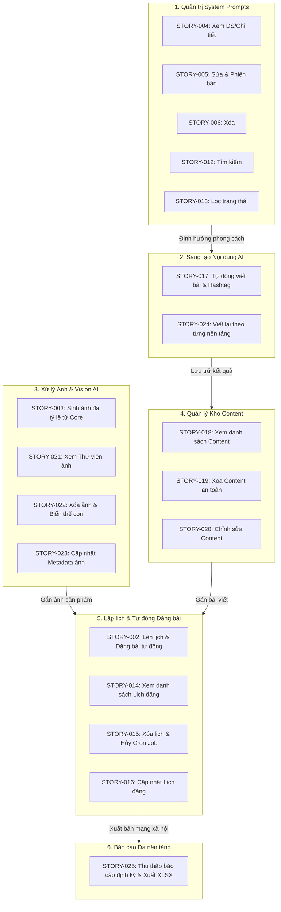

# HTM_Marketing_AI — Phân hệ Marketing & Truyền thông AI (`hoa-theo-mua-ai-marketing`)

> **Mã dự án (Key)**: `hoa-theo-mua-ai-marketing`  
> **Tên phân hệ**: `HTM_Marketing_AI` (Marketing & Social Media Automation Subsystem)  
> **Thương hiệu**: Hoa Theo Mùa  
> **Phương pháp tiếp cận**: Document-First System Specification (BDD Acceptance Criteria)  
> **Phiên bản tài liệu**: v1.0  
> **Trạng thái**: Đã chuẩn hóa 19 User Stories (STORY-002 đến STORY-025)  

---

## 📖 1. Tổng quan & Tầm nhìn Phân hệ

**HTM_Marketing_AI** là phân hệ trí tuệ nhân tạo và tự động hóa toàn diện, phục vụ chiến lược truyền thông đa kênh và tiếp thị nội dung số của thương hiệu **Hoa Theo Mùa**:
1. **AI Copywriting & Thích ứng đa nền tảng**: Tự động sinh nội dung bài viết tiếp thị và đề xuất hashtag theo chủ đề, mục tiêu, đối tượng và giọng văn; tự động viết lại nội dung tối ưu theo từng nền tảng (Facebook, Instagram, Zalo OA).
2. **Xử lý Đồ họa AI đa tỷ lệ**: Tự động mở rộng và cắt ảnh từ ảnh gốc (Core Image) sang các tỷ lệ chuẩn (1:1, 4:5, 9:16, 16:9, 2:1) mà vẫn bảo toàn an toàn bố cục (safe zone) của sản phẩm và logo.
3. **Quản trị Thư viện Số (Digital Asset Management)**: Quản lý vòng đời lưu trữ, tìm kiếm, lọc, chỉnh sửa metadata và xóa an toàn cho cả Content và Thư viện hình ảnh.
4. **Cấu hình & Tinh chỉnh System Prompts**: Cho phép quản trị viên thiết lập, tìm kiếm, lọc trạng thái, cập nhật phiên bản và quản lý các Persona/Prompt định hướng AI.
5. **Lập lịch & Xuất bản tự động (Multi-channel Auto Publishing)**: Lên lịch, quản lý, chỉnh sửa và tự động đăng bài viết kèm hình ảnh lên nhiều mạng xã hội, tích hợp cơ chế chống trùng lịch và xử lý lỗi mạng.
6. **Thu thập & Quản trị Báo cáo đa kênh**: Tự động thu thập số liệu hiệu quả chiến dịch định kỳ (hằng ngày, hằng tuần, hằng tháng theo múi giờ `Asia/Ho_Chi_Minh`), hỗ trợ xem chi tiết và xuất báo cáo chuẩn Excel (.XLSX).

---

## 📂 2. Cấu trúc Thư mục Phân hệ

```text
hoa-theo-mua-ai-marketing/
├── README.md                                      # Cổng thông tin & Tổng quan phân hệ Marketing AI
├── BusinessRules/                                 # Quy tắc nghiệp vụ (BR-015 -> BR-079)
│   └── .gitkeep
├── ConfirmedDoc/                                  # Hợp đồng API & tài liệu kỹ thuật đã thống nhất
│   └── .gitkeep
├── Context/                                       # Ngữ cảnh kiến trúc hệ thống & Mô hình dữ liệu
│   ├── Marketing_AI_Context.md                    # Kiến trúc CSDL: generated_posts, post_histories, client_histories
│   ├── Marketing_AI_DB.dbdiagram                  # Sơ đồ CSDL định dạng DBML (dbdiagram.io)
│   └── Marketing_AI_DB_Diagram.md                 # Sơ đồ ERD (Mermaid) và đặc tả chi tiết 10 Entities EF Core
├── UserStory/                                     # Toàn bộ 19 User Stories đặc tả theo chuẩn BDD
│   ├── 02-ScheduleAndAutoPublishPosts.md          # STORY-002: Lên lịch và tự động đăng bài đa nền tảng
│   ├── 03-AutoGenerateMultiRatioImagesFromCore.md # STORY-003: Tự động sinh ảnh đa tỷ lệ từ ảnh core
│   ├── 04-ViewSystemPromptsListAndDetail.md       # STORY-004: Xem danh sách và chi tiết System Prompt
│   ├── 05-UpdateSystemPrompt.md                   # STORY-005: Sửa System Prompt & Quản lý phiên bản
│   ├── 06-DeleteSystemPrompt.md                   # STORY-006: Xóa System Prompt không còn sử dụng
│   ├── 12-SearchSystemPrompts.md                  # STORY-012: Tìm kiếm System Prompt theo tên/mã
│   ├── 13-FilterSystemPrompts.md                  # STORY-013: Lọc System Prompt theo trạng thái
│   ├── 14-ViewAutoPublishSchedules.md             # STORY-014: Xem danh sách và chi tiết lịch đăng bài
│   ├── 15-DeleteAutoPublishSchedule.md            # STORY-015: Xóa lịch đăng bài tự động & hủy Cron Job
│   ├── 16-UpdateAutoPublishSchedule.md            # STORY-016: Sửa thông tin lịch đăng bài tự động
│   ├── 17-AutoGenerateContentAndHashtags.md       # STORY-017: Tự động viết content và hashtag bằng AI
│   ├── 18-ViewSavedContentListAndDetail.md        # STORY-018: Xem danh sách, tìm kiếm & chi tiết content
│   ├── 19-DeleteSavedContent.md                   # STORY-019: Xóa an toàn content đã lưu lại
│   ├── 20-UpdateSavedContent.md                   # STORY-020: Chỉnh sửa content và danh sách hashtag
│   ├── 21-ViewSavedImagesListAndDetail.md         # STORY-021: Xem danh sách, tìm kiếm & chi tiết ảnh đã lưu
│   ├── 22-DeleteSavedImage.md                     # STORY-022: Xóa ảnh đã lưu & Cascade Delete biến thể con
│   ├── 23-UpdateSavedImageInfo.md                 # STORY-023: Sửa metadata ảnh (tên, mô tả, thẻ tags)
│   ├── 24-RewriteContentByPlatform.md             # STORY-024: Tự động viết lại nội dung theo từng nền tảng
│   └── 25-CollectAndManagePlatformReports.md      # STORY-025: Thu thập và quản lý báo cáo từ các nền tảng (XLSX)
├── TDD/                                           # Thiết kế kỹ thuật chi tiết (Technical Design Documents)
│   └── .gitkeep
└── UnitTest/                                      # Kịch bản kiểm thử đơn vị & Ma trận Test Cases
    └── .gitkeep
```

---

## 🧩 3. Phân nhóm Nghiệp vụ Cốt lõi (Business Domains)

Phân hệ bao gồm **6 nhóm năng lực nghiệp vụ** hoạt động đồng bộ:



---

## 📑 4. Danh mục Toàn bộ 19 User Stories

Toàn bộ các yêu cầu nghiệp vụ được chuẩn hóa đầy đủ theo cấu trúc: **Metadata**, **Conditions** (Preconditions, Trigger), **Flows** (Main, Alternative, Exception), **Acceptance Criteria** (BDD: Given/When/Then/And), **Business Rules**, **Non-Functional** và **Out of Scope**:

| Mã Story | Tài liệu đặc tả | Nhóm chức năng | Sprint | Độ ưu tiên | Tóm tắt nghiệp vụ chính |
| :--- | :--- | :--- | :---: | :---: | :--- |
| **STORY-002** | [`02-ScheduleAndAutoPublishPosts.md`](file:///d:/VNZ/document-first-brief/hoa-theo-mua-ai-marketing/UserStory/02-ScheduleAndAutoPublishPosts.md) | Auto Publishing | **S1** | **Must** | Chọn content, gắn hình ảnh, chọn nền tảng và lên lịch đăng tự động đa kênh; kiểm tra trùng lịch. |
| **STORY-003** | [`03-AutoGenerateMultiRatioImagesFromCore.md`](file:///d:/VNZ/document-first-brief/hoa-theo-mua-ai-marketing/UserStory/03-AutoGenerateMultiRatioImagesFromCore.md) | Vision AI | **S1** | **Must** | Tải ảnh core, AI tự động sinh các tỷ lệ (1:1, 4:5, 9:16, 16:9, 2:1) tối ưu cho Facebook/Instagram. |
| **STORY-004** | [`04-ViewSystemPromptsListAndDetail.md`](file:///d:/VNZ/document-first-brief/hoa-theo-mua-ai-marketing/UserStory/04-ViewSystemPromptsListAndDetail.md) | System Prompt | **S1** | **Must** | Xem danh sách và chi tiết các System Prompt định hướng văn phong cho mô hình AI. |
| **STORY-005** | [`05-UpdateSystemPrompt.md`](file:///d:/VNZ/document-first-brief/hoa-theo-mua-ai-marketing/UserStory/05-UpdateSystemPrompt.md) | System Prompt | **S1** | **Must** | Chỉnh sửa System Prompt (1–20.000 ký tự), tự động tăng phiên bản và lưu vết lịch sử thay đổi. |
| **STORY-006** | [`06-DeleteSystemPrompt.md`](file:///d:/VNZ/document-first-brief/hoa-theo-mua-ai-marketing/UserStory/06-DeleteSystemPrompt.md) | System Prompt | **S1** | **Won't** | Xóa bỏ System Prompt không còn sử dụng kèm xác nhận cảnh báo an toàn. |
| **STORY-012** | [`12-SearchSystemPrompts.md`](file:///d:/VNZ/document-first-brief/hoa-theo-mua-ai-marketing/UserStory/12-SearchSystemPrompts.md) | System Prompt | **S1** | **Won't** | Tìm kiếm nhanh System Prompt theo tên hoặc mã định danh bằng từ khóa không phân biệt hoa/thường. |
| **STORY-013** | [`13-FilterSystemPrompts.md`](file:///d:/VNZ/document-first-brief/hoa-theo-mua-ai-marketing/UserStory/13-FilterSystemPrompts.md) | System Prompt | **S1** | **Won't** | Lọc danh sách System Prompt theo trạng thái kích hoạt (Đang hoạt động / Tạm dừng). |
| **STORY-014** | [`14-ViewAutoPublishSchedules.md`](file:///d:/VNZ/document-first-brief/hoa-theo-mua-ai-marketing/UserStory/14-ViewAutoPublishSchedules.md) | Auto Publishing | **S1** | **Must** | Xem danh sách và chi tiết lịch đăng bài tự động; hỗ trợ tìm kiếm và lọc theo nền tảng/trạng thái. |
| **STORY-015** | [`15-DeleteAutoPublishSchedule.md`](file:///d:/VNZ/document-first-brief/hoa-theo-mua-ai-marketing/UserStory/15-DeleteAutoPublishSchedule.md) | Auto Publishing | **S1** | **Must** | Xóa lịch đăng bài ở trạng thái cho phép ("Đã lên lịch", "Đã hủy"), tự động hủy bỏ tiến trình Cron Job. |
| **STORY-016** | [`16-UpdateAutoPublishSchedule.md`](file:///d:/VNZ/document-first-brief/hoa-theo-mua-ai-marketing/UserStory/16-UpdateAutoPublishSchedule.md) | Auto Publishing | **S1** | **Must** | Cập nhật thông tin lịch đăng bài (content, ảnh, nền tảng, thời gian), kiểm tra trùng lịch và tái cấu hình Job. |
| **STORY-017** | [`17-AutoGenerateContentAndHashtags.md`](file:///d:/VNZ/document-first-brief/hoa-theo-mua-ai-marketing/UserStory/17-AutoGenerateContentAndHashtags.md) | AI Copywriting | **S1** | **Must** | AI sinh bài viết và danh sách 1–30 hashtag chuẩn theo chủ đề (5–1.000 ký tự), mục tiêu, đối tượng, giọng văn. |
| **STORY-018** | [`18-ViewSavedContentListAndDetail.md`](file:///d:/VNZ/document-first-brief/hoa-theo-mua-ai-marketing/UserStory/18-ViewSavedContentListAndDetail.md) | Content Library | **S2** | **Must** | Xem danh sách theo thời gian cập nhật mới nhất, tìm kiếm từ khóa, lọc hashtag/nền tảng; xem chi tiết Read-only. |
| **STORY-019** | [`19-DeleteSavedContent.md`](file:///d:/VNZ/document-first-brief/hoa-theo-mua-ai-marketing/UserStory/19-DeleteSavedContent.md) | Content Library | **S2** | **Must** | Xóa an toàn content không bị ràng buộc tham chiếu; thực thi xóa trong giao dịch thống nhất (ACID). |
| **STORY-020** | [`20-UpdateSavedContent.md`](file:///d:/VNZ/document-first-brief/hoa-theo-mua-ai-marketing/UserStory/20-UpdateSavedContent.md) | Content Library | **S2** | **Must** | Chỉnh sửa nội dung văn bản (1–10.000 ký tự) và hashtag (1–30); cơ chế Optimistic Locking chống xung đột. |
| **STORY-021** | [`21-ViewSavedImagesListAndDetail.md`](file:///d:/VNZ/document-first-brief/hoa-theo-mua-ai-marketing/UserStory/21-ViewSavedImagesListAndDetail.md) | Image Library | **S1** | **Must** | Xem danh sách lưới thư viện ảnh, tìm kiếm theo tên/ID/thẻ tags, lọc định dạng/thời gian; xem chi tiết phóng lớn. |
| **STORY-022** | [`22-DeleteSavedImage.md`](file:///d:/VNZ/document-first-brief/hoa-theo-mua-ai-marketing/UserStory/22-DeleteSavedImage.md) | Image Library | **S3** | **Must** | Xóa ảnh đã lưu; tự động xóa liên đới (Cascade Delete) các biến thể con đa tỷ lệ nếu không bị sử dụng. |
| **STORY-023** | [`23-UpdateSavedImageInfo.md`](file:///d:/VNZ/document-first-brief/hoa-theo-mua-ai-marketing/UserStory/23-UpdateSavedImageInfo.md) | Image Library | **S1** | **Must** | Bổ sung và chỉnh sửa tên ảnh, mô tả, thẻ tags cho ảnh tải lên hoặc ảnh AI sinh từ STORY-003. |
| **STORY-024** | [`24-RewriteContentByPlatform.md`](file:///d:/VNZ/document-first-brief/hoa-theo-mua-ai-marketing/UserStory/24-RewriteContentByPlatform.md) | AI Copywriting | **S1** | **Must** | AI viết lại nội dung gốc cho từng nền tảng mục tiêu (Facebook, Instagram, Zalo OA); duy trì liên kết nguồn. |
| **STORY-025** | [`25-CollectAndManagePlatformReports.md`](file:///d:/VNZ/document-first-brief/hoa-theo-mua-ai-marketing/UserStory/25-CollectAndManagePlatformReports.md) | Reporting | **S1** | **Must** | Tự động lấy báo cáo định kỳ (ngày/tuần/tháng theo múi giờ `Asia/Ho_Chi_Minh`), xem chi tiết và tải tệp XLSX. |

---

## 🗄 5. Mô hình Dữ liệu Cốt lõi (Data Architecture)

Kiến trúc phân hệ Marketing AI được thiết kế xoay quanh các thực thể CSDL chính (chi tiết tại [`Marketing_AI_Context.md`](file:///d:/VNZ/document-first-brief/hoa-theo-mua-ai-marketing/Context/Marketing_AI_Context.md)):

```text
┌─────────────────────────┐         ┌─────────────────────────┐
│      system_prompts     │         │       image_assets      │
├─────────────────────────┤         ├─────────────────────────┤
│ id (PK)                 │         │ id (PK)                 │
│ name, prompt_text       │         │ parent_id (FK - self)   │
│ version, is_active      │         │ aspect_ratio, file_path │
└────────────┬────────────┘         │ name, description, tags │
             │                      └────────────┬────────────┘
             │                                   │
             ▼                                   ▼
┌─────────────────────────┐         ┌─────────────────────────┐
│     generated_posts     │◄────────┤    publish_schedules    │
├─────────────────────────┤         ├─────────────────────────┤
│ id (PK)                 │         │ id (PK)                 │
│ content, hashtags       │         │ post_id (FK)            │
│ parent_content_id (FK)  │         │ image_ids (json array)  │
│ platform, user_id       │         │ platforms, scheduled_at │
└────────────┬────────────┘         │ status, cron_job_id     │
             │                      └─────────────────────────┘
             ▼                                   ▲
┌─────────────────────────┐                      │
│     post_histories      │         ┌────────────┴────────────┐
├─────────────────────────┤         │     platform_reports    │
│ id (PK)                 │         ├─────────────────────────┤
│ input, metadata (json)  │         │ id (PK), platform       │
│ base_id, output_id      │         │ collected_at, status    │
│ system_prompt_id        │         │ raw_data, xlsx_path     │
└─────────────────────────┘         └─────────────────────────┘
```

---

## 🔒 6. Ràng buộc Kỹ thuật & Phi chức năng (Non-Functional Requirements)

1. **Hiệu năng & Thời gian phản hồi**:
   - Tải danh sách và thông tin chi tiết (Content, Ảnh, Lịch đăng, Báo cáo) trong vòng **dưới 2 giây**.
   - Thời gian timeout tối đa cho một lượt gọi API sinh nội dung AI là **60 giây**.
2. **Toàn vẹn Dữ liệu & Tính nguyên tử (ACID Transactions)**:
   - Các thao tác cập nhật hoặc xóa content, hashtag, ảnh và biến thể con phải được thực thi trong một Database Transaction thống nhất. Rollback 100% nếu phát sinh sự cố.
3. **Kiểm soát đồng thời (Optimistic Concurrency Control)**:
   - Áp dụng kiểm tra mã phiên bản (`version` / `updated_at`) tại thời điểm lưu để ngăn chặn hiện tượng ghi đè dữ liệu (Lost Update) khi có nhiều quản trị viên cùng thao tác.
4. **An toàn dữ liệu & Cô lập lỗi (Process Isolation)**:
   - Sự cố kết nối hoặc lỗi dữ liệu từ một nền tảng mạng xã hội không được làm gián đoạn hoặc mất dữ liệu của các nền tảng khác.
   - Thư viện ảnh áp dụng kỹ thuật **Lazy Loading** và **Pagination** để tối ưu băng thông khi duyệt số lượng lớn hình ảnh.
5. **Tuân thủ múi giờ**:
   - Toàn bộ lịch trình đăng bài và lịch thu thập báo cáo tự động được đồng bộ thống nhất theo múi giờ Việt Nam: `Asia/Ho_Chi_Minh` (GMT+7).
