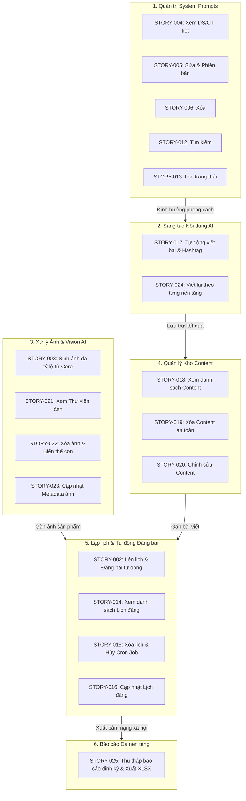

# HTM_Marketing_AI — Phân hệ Marketing & Truyền thông AI (`hoa-theo-mua-ai-marketing`)

> **Mã dự án (Key)**: `hoa-theo-mua-ai-marketing`  
> **Tên phân hệ**: `HTM_Marketing_AI` (Marketing & Social Media Automation Subsystem)  
> **Thương hiệu**: Hoa Theo Mùa  
> **Phương pháp tiếp cận**: Document-First System Specification (BDD Acceptance Criteria)  
> **Phiên bản tài liệu**: v1.0  
> **Trạng thái**: Đã chuẩn hóa 19 User Stories (STORY-002 đến STORY-025)  

---

## 📖 1. Tổng quan & Tầm nhìn Phân hệ

**HTM_Marketing_AI** là phân hệ trí tuệ nhân tạo và tự động hóa toàn diện, phục vụ chiến lược truyền thông đa kênh và tiếp thị nội dung số của thương hiệu **Hoa Theo Mùa**:
1. **AI Copywriting & Thích ứng đa nền tảng**: Tự động sinh nội dung bài viết tiếp thị và đề xuất hashtag theo chủ đề, mục tiêu, đối tượng và giọng văn; tự động viết lại nội dung tối ưu theo từng nền tảng (Facebook, Instagram, Zalo OA).
2. **Xử lý Đồ họa AI đa tỷ lệ**: Tự động mở rộng và cắt ảnh từ ảnh gốc (Core Image) sang các tỷ lệ chuẩn (1:1, 4:5, 9:16, 16:9, 2:1) mà vẫn bảo toàn an toàn bố cục (safe zone) của sản phẩm và logo.
3. **Quản trị Thư viện Số (Digital Asset Management)**: Quản lý vòng đời lưu trữ, tìm kiếm, lọc, chỉnh sửa metadata và xóa an toàn cho cả Content và Thư viện hình ảnh.
4. **Cấu hình & Tinh chỉnh System Prompts**: Cho phép quản trị viên thiết lập, tìm kiếm, lọc trạng thái, cập nhật phiên bản và quản lý các Persona/Prompt định hướng AI.
5. **Lập lịch & Xuất bản tự động (Multi-channel Auto Publishing)**: Lên lịch, quản lý, chỉnh sửa và tự động đăng bài viết kèm hình ảnh lên nhiều mạng xã hội, tích hợp cơ chế chống trùng lịch và xử lý lỗi mạng.
6. **Thu thập & Quản trị Báo cáo đa kênh**: Tự động thu thập số liệu hiệu quả chiến dịch định kỳ (hằng ngày, hằng tuần, hằng tháng theo múi giờ `Asia/Ho_Chi_Minh`), hỗ trợ xem chi tiết và xuất báo cáo chuẩn Excel (.XLSX).

---

## 📂 2. Cấu trúc Thư mục Phân hệ

```text
hoa-theo-mua-ai-marketing/
├── README.md                                      # Cổng thông tin & Tổng quan phân hệ Marketing AI
├── BusinessRules/                                 # 76 Quy tắc nghiệp vụ (BR-001 -> BR-079)
│   ├── BR-001 -> BR-006, BR-046 -> BR-049        # 10 rules cho STORY-002 (Lên lịch & Đăng bài)
│   ├── BR-032 -> BR-037, BR-050 -> BR-051        # 8 rules cho STORY-003 (Sinh ảnh đa tỷ lệ AI)
│   ├── BR-040                                     # 1 rule cho STORY-004 (Xem DS System Prompt)
│   ├── BR-041, BR-042, BR-045, BR-052             # 4 rules cho STORY-005 (Sửa System Prompt)
│   ├── BR-007, BR-012 -> BR-014                  # 4 rules cho STORY-014 (Xem DS lịch đăng bài)
│   ├── BR-010, BR-011                             # 2 rules cho STORY-015 (Xóa lịch đăng bài)
│   ├── BR-008, BR-009, BR-053, BR-054             # 4 rules cho STORY-016 (Sửa lịch đăng bài)
│   ├── BR-015 -> BR-022, BR-055 -> BR-058        # 12 rules cho STORY-017 (Tự động viết bài & Hashtag AI)
│   ├── BR-023, BR-024, BR-030, BR-031, BR-059    # 5 rules cho STORY-018 (Xem danh sách Content)
│   ├── BR-028, BR-029, BR-060                     # 3 rules cho STORY-019 (Xóa content đã lưu)
│   ├── BR-025, BR-026, BR-061, BR-062             # 4 rules cho STORY-020 (Sửa content đã lưu)
│   ├── BR-038, BR-063, BR-064                     # 3 rules cho STORY-021 (Xem ảnh đã lưu)
│   ├── BR-039, BR-065                             # 2 rules cho STORY-022 (Xóa ảnh đã lưu)
│   ├── BR-066, BR-067                             # 2 rules cho STORY-023 (Sửa thông tin ảnh)
│   ├── BR-068 -> BR-071                          # 4 rules cho STORY-024 (Viết lại nội dung đa nền tảng)
│   └── BR-072 -> BR-079                          # 8 rules cho STORY-025 (Thu thập báo cáo đa kênh)
├── ConfirmedDoc/                                  # Hợp đồng API & tài liệu kỹ thuật đã thống nhất
│   └── .gitkeep
├── Context/                                       # Ngữ cảnh kiến trúc hệ thống & Mô hình dữ liệu
│   ├── Marketing_AI_Context.md                    # Kiến trúc CSDL: generated_posts, post_histories, client_histories
│   ├── Marketing_AI_DB.dbdiagram                  # Sơ đồ CSDL định dạng DBML (dbdiagram.io)
│   └── Marketing_AI_DB_Diagram.md                 # Sơ đồ ERD (Mermaid) và đặc tả chi tiết 10 Entities EF Core
├── UserStory/                                     # Toàn bộ 19 User Stories đặc tả theo chuẩn BDD
│   ├── 02-ScheduleAndAutoPublishPosts.md          # STORY-002: Lên lịch và tự động đăng bài đa nền tảng
│   ├── 03-AutoGenerateMultiRatioImagesFromCore.md # STORY-003: Tự động sinh ảnh đa tỷ lệ từ ảnh core
│   ├── 04-ViewSystemPromptsListAndDetail.md       # STORY-004: Xem danh sách và chi tiết System Prompt
│   ├── 05-UpdateSystemPrompt.md                   # STORY-005: Sửa System Prompt & Quản lý phiên bản
│   ├── 06-DeleteSystemPrompt.md                   # STORY-006: Xóa System Prompt không còn sử dụng
│   ├── 12-SearchSystemPrompts.md                  # STORY-012: Tìm kiếm System Prompt theo tên/mã
│   ├── 13-FilterSystemPrompts.md                  # STORY-013: Lọc System Prompt theo trạng thái
│   ├── 14-ViewAutoPublishSchedules.md             # STORY-014: Xem danh sách và chi tiết lịch đăng bài
│   ├── 15-DeleteAutoPublishSchedule.md            # STORY-015: Xóa lịch đăng bài tự động & hủy Cron Job
│   ├── 16-UpdateAutoPublishSchedule.md            # STORY-016: Sửa thông tin lịch đăng bài tự động
│   ├── 17-AutoGenerateContentAndHashtags.md       # STORY-017: Tự động viết content và hashtag bằng AI
│   ├── 18-ViewSavedContentListAndDetail.md        # STORY-018: Xem danh sách, tìm kiếm & chi tiết content
│   ├── 19-DeleteSavedContent.md                   # STORY-019: Xóa an toàn content đã lưu lại
│   ├── 20-UpdateSavedContent.md                   # STORY-020: Chỉnh sửa content và danh sách hashtag
│   ├── 21-ViewSavedImagesListAndDetail.md         # STORY-021: Xem danh sách, tìm kiếm & chi tiết ảnh đã lưu
│   ├── 22-DeleteSavedImage.md                     # STORY-022: Xóa ảnh đã lưu & Cascade Delete biến thể con
│   ├── 23-UpdateSavedImageInfo.md                 # STORY-023: Sửa metadata ảnh (tên, mô tả, thẻ tags)
│   ├── 24-RewriteContentByPlatform.md             # STORY-024: Tự động viết lại nội dung theo từng nền tảng
│   └── 25-CollectAndManagePlatformReports.md      # STORY-025: Thu thập và quản lý báo cáo từ các nền tảng (XLSX)
├── TDD/                                           # Thiết kế kỹ thuật chi tiết (Technical Design Documents)
│   └── .gitkeep
└── UnitTest/                                      # Kịch bản kiểm thử đơn vị & Ma trận Test Cases
    └── .gitkeep
```

---

## 🧩 3. Phân nhóm Nghiệp vụ Cốt lõi (Business Domains)

Phân hệ bao gồm **6 nhóm năng lực nghiệp vụ** hoạt động đồng bộ:



---

## 📑 4. Danh mục Toàn bộ 19 User Stories

Toàn bộ các yêu cầu nghiệp vụ được chuẩn hóa đầy đủ theo cấu trúc: **Metadata**, **Conditions** (Preconditions, Trigger), **Flows** (Main, Alternative, Exception), **Acceptance Criteria** (BDD: Given/When/Then/And), **Business Rules**, **Non-Functional** và **Out of Scope**:

| Mã Story | Tài liệu đặc tả | Nhóm chức năng | Sprint | Độ ưu tiên | Tóm tắt nghiệp vụ chính |
| :--- | :--- | :--- | :---: | :---: | :--- |
| **STORY-002** | [`02-ScheduleAndAutoPublishPosts.md`](file:///d:/VNZ/document-first-brief/hoa-theo-mua-ai-marketing/UserStory/02-ScheduleAndAutoPublishPosts.md) | Auto Publishing | **S1** | **Must** | Chọn content, gắn hình ảnh, chọn nền tảng và lên lịch đăng tự động đa kênh; kiểm tra trùng lịch. |
| **STORY-003** | [`03-AutoGenerateMultiRatioImagesFromCore.md`](file:///d:/VNZ/document-first-brief/hoa-theo-mua-ai-marketing/UserStory/03-AutoGenerateMultiRatioImagesFromCore.md) | Vision AI | **S1** | **Must** | Tải ảnh core, AI tự động sinh các tỷ lệ (1:1, 4:5, 9:16, 16:9, 2:1) tối ưu cho Facebook/Instagram. |
| **STORY-004** | [`04-ViewSystemPromptsListAndDetail.md`](file:///d:/VNZ/document-first-brief/hoa-theo-mua-ai-marketing/UserStory/04-ViewSystemPromptsListAndDetail.md) | System Prompt | **S1** | **Must** | Xem danh sách và chi tiết các System Prompt định hướng văn phong cho mô hình AI. |
| **STORY-005** | [`05-UpdateSystemPrompt.md`](file:///d:/VNZ/document-first-brief/hoa-theo-mua-ai-marketing/UserStory/05-UpdateSystemPrompt.md) | System Prompt | **S1** | **Must** | Chỉnh sửa System Prompt (1–20.000 ký tự), tự động tăng phiên bản và lưu vết lịch sử thay đổi. |
| **STORY-006** | [`06-DeleteSystemPrompt.md`](file:///d:/VNZ/document-first-brief/hoa-theo-mua-ai-marketing/UserStory/06-DeleteSystemPrompt.md) | System Prompt | **S1** | **Won't** | Xóa bỏ System Prompt không còn sử dụng kèm xác nhận cảnh báo an toàn. |
| **STORY-012** | [`12-SearchSystemPrompts.md`](file:///d:/VNZ/document-first-brief/hoa-theo-mua-ai-marketing/UserStory/12-SearchSystemPrompts.md) | System Prompt | **S1** | **Won't** | Tìm kiếm nhanh System Prompt theo tên hoặc mã định danh bằng từ khóa không phân biệt hoa/thường. |
| **STORY-013** | [`13-FilterSystemPrompts.md`](file:///d:/VNZ/document-first-brief/hoa-theo-mua-ai-marketing/UserStory/13-FilterSystemPrompts.md) | System Prompt | **S1** | **Won't** | Lọc danh sách System Prompt theo trạng thái kích hoạt (Đang hoạt động / Tạm dừng). |
| **STORY-014** | [`14-ViewAutoPublishSchedules.md`](file:///d:/VNZ/document-first-brief/hoa-theo-mua-ai-marketing/UserStory/14-ViewAutoPublishSchedules.md) | Auto Publishing | **S1** | **Must** | Xem danh sách và chi tiết lịch đăng bài tự động; hỗ trợ tìm kiếm và lọc theo nền tảng/trạng thái. |
| **STORY-015** | [`15-DeleteAutoPublishSchedule.md`](file:///d:/VNZ/document-first-brief/hoa-theo-mua-ai-marketing/UserStory/15-DeleteAutoPublishSchedule.md) | Auto Publishing | **S1** | **Must** | Xóa lịch đăng bài ở trạng thái cho phép ("Đã lên lịch", "Đã hủy"), tự động hủy bỏ tiến trình Cron Job. |
| **STORY-016** | [`16-UpdateAutoPublishSchedule.md`](file:///d:/VNZ/document-first-brief/hoa-theo-mua-ai-marketing/UserStory/16-UpdateAutoPublishSchedule.md) | Auto Publishing | **S1** | **Must** | Cập nhật thông tin lịch đăng bài (content, ảnh, nền tảng, thời gian), kiểm tra trùng lịch và tái cấu hình Job. |
| **STORY-017** | [`17-AutoGenerateContentAndHashtags.md`](file:///d:/VNZ/document-first-brief/hoa-theo-mua-ai-marketing/UserStory/17-AutoGenerateContentAndHashtags.md) | AI Copywriting | **S1** | **Must** | AI sinh bài viết và danh sách 1–30 hashtag chuẩn theo chủ đề (5–1.000 ký tự), mục tiêu, đối tượng, giọng văn. |
| **STORY-018** | [`18-ViewSavedContentListAndDetail.md`](file:///d:/VNZ/document-first-brief/hoa-theo-mua-ai-marketing/UserStory/18-ViewSavedContentListAndDetail.md) | Content Library | **S2** | **Must** | Xem danh sách theo thời gian cập nhật mới nhất, tìm kiếm từ khóa, lọc hashtag/nền tảng; xem chi tiết Read-only. |
| **STORY-019** | [`19-DeleteSavedContent.md`](file:///d:/VNZ/document-first-brief/hoa-theo-mua-ai-marketing/UserStory/19-DeleteSavedContent.md) | Content Library | **S2** | **Must** | Xóa an toàn content không bị ràng buộc tham chiếu; thực thi xóa trong giao dịch thống nhất (ACID). |
| **STORY-020** | [`20-UpdateSavedContent.md`](file:///d:/VNZ/document-first-brief/hoa-theo-mua-ai-marketing/UserStory/20-UpdateSavedContent.md) | Content Library | **S2** | **Must** | Chỉnh sửa nội dung văn bản (1–10.000 ký tự) và hashtag (1–30); cơ chế Optimistic Locking chống xung đột. |
| **STORY-021** | [`21-ViewSavedImagesListAndDetail.md`](file:///d:/VNZ/document-first-brief/hoa-theo-mua-ai-marketing/UserStory/21-ViewSavedImagesListAndDetail.md) | Image Library | **S1** | **Must** | Xem danh sách lưới thư viện ảnh, tìm kiếm theo tên/ID/thẻ tags, lọc định dạng/thời gian; xem chi tiết phóng lớn. |
| **STORY-022** | [`22-DeleteSavedImage.md`](file:///d:/VNZ/document-first-brief/hoa-theo-mua-ai-marketing/UserStory/22-DeleteSavedImage.md) | Image Library | **S3** | **Must** | Xóa ảnh đã lưu; tự động xóa liên đới (Cascade Delete) các biến thể con đa tỷ lệ nếu không bị sử dụng. |
| **STORY-023** | [`23-UpdateSavedImageInfo.md`](file:///d:/VNZ/document-first-brief/hoa-theo-mua-ai-marketing/UserStory/23-UpdateSavedImageInfo.md) | Image Library | **S1** | **Must** | Bổ sung và chỉnh sửa tên ảnh, mô tả, thẻ tags cho ảnh tải lên hoặc ảnh AI sinh từ STORY-003. |
| **STORY-024** | [`24-RewriteContentByPlatform.md`](file:///d:/VNZ/document-first-brief/hoa-theo-mua-ai-marketing/UserStory/24-RewriteContentByPlatform.md) | AI Copywriting | **S1** | **Must** | AI viết lại nội dung gốc cho từng nền tảng mục tiêu (Facebook, Instagram, Zalo OA); duy trì liên kết nguồn. |
| **STORY-025** | [`25-CollectAndManagePlatformReports.md`](file:///d:/VNZ/document-first-brief/hoa-theo-mua-ai-marketing/UserStory/25-CollectAndManagePlatformReports.md) | Reporting | **S1** | **Must** | Tự động lấy báo cáo định kỳ (ngày/tuần/tháng theo múi giờ `Asia/Ho_Chi_Minh`), xem chi tiết và tải tệp XLSX. |

---

## 📋 5. Ma trận 76 Quy tắc Nghiệp vụ (Business Rules Matrix)

Toàn bộ các quy tắc nghiệp vụ (Business Rules) được đặc tả độc lập theo chuẩn Document-First, liên kết chặt chẽ với từng User Story:

| Mã Rule | Tên quy tắc nghiệp vụ | Danh mục | Áp dụng cho | Tóm tắt phát biểu (Statement) | Trạng thái |
| :--- | :--- | :--- | :---: | :--- | :---: |
| [`BR-001`](file:///d:/VNZ/document-first-brief/hoa-theo-mua-ai-marketing/BusinessRules/BR-001.md) | **Định dạng file ảnh đính kèm bài đăng** | Chung | [`STORY-002`](file:///d:/VNZ/document-first-brief/hoa-theo-mua-ai-marketing/UserStory/02-ScheduleAndAutoPublishPosts.md) |  | Active (v0) |
| [`BR-002`](file:///d:/VNZ/document-first-brief/hoa-theo-mua-ai-marketing/BusinessRules/BR-002.md) | **Dung lượng tối đa của ảnh đính kèm** | Chung | [`STORY-002`](file:///d:/VNZ/document-first-brief/hoa-theo-mua-ai-marketing/UserStory/02-ScheduleAndAutoPublishPosts.md) |  | Active (v0) |
| [`BR-003`](file:///d:/VNZ/document-first-brief/hoa-theo-mua-ai-marketing/BusinessRules/BR-003.md) | **Giới hạn số lượng ảnh đính kèm bài đăng** | Chung | [`STORY-002`](file:///d:/VNZ/document-first-brief/hoa-theo-mua-ai-marketing/UserStory/02-ScheduleAndAutoPublishPosts.md) |  | Active (v0) |
| [`BR-004`](file:///d:/VNZ/document-first-brief/hoa-theo-mua-ai-marketing/BusinessRules/BR-004.md) | **Thời điểm hẹn giờ đăng bài hợp lệ** | Chung | [`STORY-002`](file:///d:/VNZ/document-first-brief/hoa-theo-mua-ai-marketing/UserStory/02-ScheduleAndAutoPublishPosts.md) |  | Active (v0) |
| [`BR-005`](file:///d:/VNZ/document-first-brief/hoa-theo-mua-ai-marketing/BusinessRules/BR-005.md) | **Bắt buộc chọn nền tảng mạng xã hội** | Chung | [`STORY-002`](file:///d:/VNZ/document-first-brief/hoa-theo-mua-ai-marketing/UserStory/02-ScheduleAndAutoPublishPosts.md) |  | Active (v0) |
| [`BR-006`](file:///d:/VNZ/document-first-brief/hoa-theo-mua-ai-marketing/BusinessRules/BR-006.md) | **Chống trùng lặp lịch đăng bài** | Chung | [`STORY-002`](file:///d:/VNZ/document-first-brief/hoa-theo-mua-ai-marketing/UserStory/02-ScheduleAndAutoPublishPosts.md) |  | Active (v0) |
| [`BR-007`](file:///d:/VNZ/document-first-brief/hoa-theo-mua-ai-marketing/BusinessRules/BR-007.md) | **Sắp xếp danh sách lịch đăng bài** | Schedule & Auto-Post | [`STORY-014`](file:///d:/VNZ/document-first-brief/hoa-theo-mua-ai-marketing/UserStory/14-ViewAutoPublishSchedules.md) | Danh sách lịch đăng hiển thị ưu tiên theo dòng thời gian từ gần đến xa. | Active (v0) |
| [`BR-008`](file:///d:/VNZ/document-first-brief/hoa-theo-mua-ai-marketing/BusinessRules/BR-008.md) | **Trạng thái hợp lệ để chỉnh sửa lịch đăng** | Schedule & Auto-Post | [`STORY-016`](file:///d:/VNZ/document-first-brief/hoa-theo-mua-ai-marketing/UserStory/16-UpdateAutoPublishSchedule.md) | Chỉ lịch đăng chưa được thực thi mới được phép thay đổi nội dung/cấu hình. | Active (v0) |
| [`BR-009`](file:///d:/VNZ/document-first-brief/hoa-theo-mua-ai-marketing/BusinessRules/BR-009.md) | **Cập nhật dữ liệu khi sửa lịch đăng** | Schedule & Auto-Post | [`STORY-016`](file:///d:/VNZ/document-first-brief/hoa-theo-mua-ai-marketing/UserStory/16-UpdateAutoPublishSchedule.md) | Khi sửa lịch đăng, toàn bộ thông tin (Nội dung, Ảnh, Thời gian, Nền tảng) đều có t... | Active (v0) |
| [`BR-010`](file:///d:/VNZ/document-first-brief/hoa-theo-mua-ai-marketing/BusinessRules/BR-010.md) | **Trạng thái hợp lệ để xóa lịch đăng** | Schedule & Auto-Post | [`STORY-015`](file:///d:/VNZ/document-first-brief/hoa-theo-mua-ai-marketing/UserStory/15-DeleteAutoPublishSchedule.md) | Không được phép xóa các lịch đăng đã diễn ra để bảo toàn lịch sử dữ liệu. | Active (v0) |
| [`BR-011`](file:///d:/VNZ/document-first-brief/hoa-theo-mua-ai-marketing/BusinessRules/BR-011.md) | **Xóa lệnh Cron Job khi xóa lịch đăng** | Schedule & Auto-Post | [`STORY-015`](file:///d:/VNZ/document-first-brief/hoa-theo-mua-ai-marketing/UserStory/15-DeleteAutoPublishSchedule.md) | Việc xóa lịch đăng bài phải hủy bỏ hoàn toàn tác vụ ngầm đã lên lịch trước đó. | Active (v0) |
| [`BR-012`](file:///d:/VNZ/document-first-brief/hoa-theo-mua-ai-marketing/BusinessRules/BR-012.md) | **Thứ tự ổn định khi nhiều lịch có cùng thời điểm** | Schedule & Auto-Post | [`STORY-014`](file:///d:/VNZ/document-first-brief/hoa-theo-mua-ai-marketing/UserStory/14-ViewAutoPublishSchedules.md) | Các lịch có cùng thời điểm đăng phải được hiển thị đầy đủ . | Active (v0) |
| [`BR-013`](file:///d:/VNZ/document-first-brief/hoa-theo-mua-ai-marketing/BusinessRules/BR-013.md) | **Tổng số lịch phải khớp danh sách hiển thị** | Schedule & Auto-Post | [`STORY-014`](file:///d:/VNZ/document-first-brief/hoa-theo-mua-ai-marketing/UserStory/14-ViewAutoPublishSchedules.md) | Tổng số lịch phải phản ánh đúng số lịch được tải và hiển thị. | Active (v0) |
| [`BR-014`](file:///d:/VNZ/document-first-brief/hoa-theo-mua-ai-marketing/BusinessRules/BR-014.md) | **Không hiển thị danh sách lịch chưa đầy đủ** | Schedule & Auto-Post | [`STORY-014`](file:///d:/VNZ/document-first-brief/hoa-theo-mua-ai-marketing/UserStory/14-ViewAutoPublishSchedules.md) | Danh sách và tổng số lịch chỉ được cập nhật khi dữ liệu tải về đầy đủ. | Active (v0) |
| [`BR-015`](file:///d:/VNZ/document-first-brief/hoa-theo-mua-ai-marketing/BusinessRules/BR-015.md) | **Độ dài Chủ đề (Topic) khi sinh content** | AI Content | [`STORY-017`](file:///d:/VNZ/document-first-brief/hoa-theo-mua-ai-marketing/UserStory/17-AutoGenerateContentAndHashtags.md) | Input đầu vào cho AI về chủ đề phải đủ thông tin nhưng không quá dài. | Active (v0) |
| [`BR-016`](file:///d:/VNZ/document-first-brief/hoa-theo-mua-ai-marketing/BusinessRules/BR-016.md) | **Độ dài Đối tượng (Target Audience)** | AI Content | [`STORY-017`](file:///d:/VNZ/document-first-brief/hoa-theo-mua-ai-marketing/UserStory/17-AutoGenerateContentAndHashtags.md) | Input về đối tượng mục tiêu cần giới hạn độ dài hợp lý. | Active (v0) |
| [`BR-017`](file:///d:/VNZ/document-first-brief/hoa-theo-mua-ai-marketing/BusinessRules/BR-017.md) | **Giới hạn số lượng hashtag** | AI Content | [`STORY-017`](file:///d:/VNZ/document-first-brief/hoa-theo-mua-ai-marketing/UserStory/17-AutoGenerateContentAndHashtags.md) | Số lượng hashtag trên mỗi bài content bị giới hạn để tránh spam. | Active (v0) |
| [`BR-018`](file:///d:/VNZ/document-first-brief/hoa-theo-mua-ai-marketing/BusinessRules/BR-018.md) | **Định dạng bắt đầu của Hashtag** | AI Content | [`STORY-017`](file:///d:/VNZ/document-first-brief/hoa-theo-mua-ai-marketing/UserStory/17-AutoGenerateContentAndHashtags.md) | Hashtag chuẩn phải mở đầu bằng ký hiệu thăng. | Active (v0) |
| [`BR-019`](file:///d:/VNZ/document-first-brief/hoa-theo-mua-ai-marketing/BusinessRules/BR-019.md) | **Không chứa khoảng trắng trong Hashtag** | AI Content | [`STORY-017`](file:///d:/VNZ/document-first-brief/hoa-theo-mua-ai-marketing/UserStory/17-AutoGenerateContentAndHashtags.md) | Hashtag phải là một chuỗi liền mạch. | Active (v0) |
| [`BR-020`](file:///d:/VNZ/document-first-brief/hoa-theo-mua-ai-marketing/BusinessRules/BR-020.md) | **Độ dài cho phép của một Hashtag** | AI Content | [`STORY-017`](file:///d:/VNZ/document-first-brief/hoa-theo-mua-ai-marketing/UserStory/17-AutoGenerateContentAndHashtags.md) | Hashtag không được quá ngắn vô nghĩa hoặc quá dài khó đọc. | Active (v0) |
| [`BR-021`](file:///d:/VNZ/document-first-brief/hoa-theo-mua-ai-marketing/BusinessRules/BR-021.md) | **Ký tự hợp lệ trong Hashtag** | AI Content | [`STORY-017`](file:///d:/VNZ/document-first-brief/hoa-theo-mua-ai-marketing/UserStory/17-AutoGenerateContentAndHashtags.md) | Hashtag chỉ chấp nhận chữ, số và dấu gạch dưới. | Active (v0) |
| [`BR-022`](file:///d:/VNZ/document-first-brief/hoa-theo-mua-ai-marketing/BusinessRules/BR-022.md) | **Loại bỏ Hashtag trùng lặp** | AI Content | [`STORY-017`](file:///d:/VNZ/document-first-brief/hoa-theo-mua-ai-marketing/UserStory/17-AutoGenerateContentAndHashtags.md) | Một bài content không được chứa 2 hashtag giống nhau. | Active (v0) |
| [`BR-023`](file:///d:/VNZ/document-first-brief/hoa-theo-mua-ai-marketing/BusinessRules/BR-023.md) | **Sắp xếp danh sách Content** | AI Content | [`STORY-018`](file:///d:/VNZ/document-first-brief/hoa-theo-mua-ai-marketing/UserStory/18-ViewSavedContentListAndDetail.md) | Content nào mới được sửa gần đây nhất sẽ hiển thị lên đầu. | Active (v0) |
| [`BR-024`](file:///d:/VNZ/document-first-brief/hoa-theo-mua-ai-marketing/BusinessRules/BR-024.md) | **Xem chi tiết Content (Read-only)** | AI Content | [`STORY-018`](file:///d:/VNZ/document-first-brief/hoa-theo-mua-ai-marketing/UserStory/18-ViewSavedContentListAndDetail.md) | Chế độ xem chi tiết không cho phép can thiệp dữ liệu trực tiếp. | Active (v0) |
| [`BR-025`](file:///d:/VNZ/document-first-brief/hoa-theo-mua-ai-marketing/BusinessRules/BR-025.md) | **Giới hạn độ dài nội dung Content** | AI Content | [`STORY-020`](file:///d:/VNZ/document-first-brief/hoa-theo-mua-ai-marketing/UserStory/20-UpdateSavedContent.md) | Nội dung Content phải đáp ứng giới hạn độ dài được quy định trước khi lưu. | Active (v0) |
| [`BR-026`](file:///d:/VNZ/document-first-brief/hoa-theo-mua-ai-marketing/BusinessRules/BR-026.md) | **Đồng bộ giao dịch khi sửa Content** | AI Content | [`STORY-020`](file:///d:/VNZ/document-first-brief/hoa-theo-mua-ai-marketing/UserStory/20-UpdateSavedContent.md) | Việc cập nhật nội dung bài viết và hashtag phải diễn ra trọn vẹn hoặc thất bại toà... | Active (v0) |
| [`BR-028`](file:///d:/VNZ/document-first-brief/hoa-theo-mua-ai-marketing/BusinessRules/BR-028.md) | **Ràng buộc dữ liệu khi xóa Content** | AI Content | [`STORY-019`](file:///d:/VNZ/document-first-brief/hoa-theo-mua-ai-marketing/UserStory/19-DeleteSavedContent.md) | Content đang được dùng cho chức năng khác không được phép xóa. | Active (v0) |
| [`BR-029`](file:///d:/VNZ/document-first-brief/hoa-theo-mua-ai-marketing/BusinessRules/BR-029.md) | **Xóa toàn vẹn dữ liệu Content** | AI Content | [`STORY-019`](file:///d:/VNZ/document-first-brief/hoa-theo-mua-ai-marketing/UserStory/19-DeleteSavedContent.md) | Khi xóa Content, các dữ liệu phụ thuộc như liên kết Hashtag cũng phải được xóa sạch. | Active (v0) |
| [`BR-030`](file:///d:/VNZ/document-first-brief/hoa-theo-mua-ai-marketing/BusinessRules/BR-030.md) | **Tìm kiếm Content theo từ khóa** | AI Content | [`STORY-018`](file:///d:/VNZ/document-first-brief/hoa-theo-mua-ai-marketing/UserStory/18-ViewSavedContentListAndDetail.md) | Hỗ trợ tìm kiếm theo chuỗi ký tự trong nội dung bài viết. | Active (v0) |
| [`BR-031`](file:///d:/VNZ/document-first-brief/hoa-theo-mua-ai-marketing/BusinessRules/BR-031.md) | **Lọc Content theo Hashtag** | AI Content | [`STORY-018`](file:///d:/VNZ/document-first-brief/hoa-theo-mua-ai-marketing/UserStory/18-ViewSavedContentListAndDetail.md) | Cho phép gom nhóm và tìm các bài viết dùng chung hashtag chiến dịch. | Active (v0) |
| [`BR-032`](file:///d:/VNZ/document-first-brief/hoa-theo-mua-ai-marketing/BusinessRules/BR-032.md) | **Định dạng file ảnh gốc (Core Image)** | AI Image | [`STORY-003`](file:///d:/VNZ/document-first-brief/hoa-theo-mua-ai-marketing/UserStory/03-AutoGenerateMultiRatioImagesFromCore.md) | Ảnh đầu vào cung cấp cho AI để xử lý phải đạt chuẩn định dạng. | Active (v0) |
| [`BR-033`](file:///d:/VNZ/document-first-brief/hoa-theo-mua-ai-marketing/BusinessRules/BR-033.md) | **Dung lượng ảnh gốc tối đa** | AI Image | [`STORY-003`](file:///d:/VNZ/document-first-brief/hoa-theo-mua-ai-marketing/UserStory/03-AutoGenerateMultiRatioImagesFromCore.md) | Giới hạn dung lượng để tối ưu chi phí xử lý AI. | Active (v0) |
| [`BR-034`](file:///d:/VNZ/document-first-brief/hoa-theo-mua-ai-marketing/BusinessRules/BR-034.md) | **Hỗ trợ các tỷ lệ sinh ảnh AI** | AI Image | [`STORY-003`](file:///d:/VNZ/document-first-brief/hoa-theo-mua-ai-marketing/UserStory/03-AutoGenerateMultiRatioImagesFromCore.md) | Hệ thống chỉ hỗ trợ sinh ảnh theo các tỷ lệ khung hình đã được quy chuẩn. | Active (v0) |
| [`BR-035`](file:///d:/VNZ/document-first-brief/hoa-theo-mua-ai-marketing/BusinessRules/BR-035.md) | **Ràng buộc giữ vùng an toàn (Safe Zone)** | AI Image | [`STORY-003`](file:///d:/VNZ/document-first-brief/hoa-theo-mua-ai-marketing/UserStory/03-AutoGenerateMultiRatioImagesFromCore.md) | Ảnh được sinh ra không được làm mất chủ thể chính của ảnh gốc. | Active (v0) |
| [`BR-036`](file:///d:/VNZ/document-first-brief/hoa-theo-mua-ai-marketing/BusinessRules/BR-036.md) | **Độ dài tên hình ảnh lưu trữ** | AI Image | [`STORY-003`](file:///d:/VNZ/document-first-brief/hoa-theo-mua-ai-marketing/UserStory/03-AutoGenerateMultiRatioImagesFromCore.md) | Tên ảnh phải được định danh với độ dài quy định. | Active (v0) |
| [`BR-037`](file:///d:/VNZ/document-first-brief/hoa-theo-mua-ai-marketing/BusinessRules/BR-037.md) | **Độ dài mô tả hình ảnh** | AI Image | [`STORY-003`](file:///d:/VNZ/document-first-brief/hoa-theo-mua-ai-marketing/UserStory/03-AutoGenerateMultiRatioImagesFromCore.md) | Mô tả ảnh có thể để trống hoặc điền tối đa 1000 ký tự. | Active (v0) |
| [`BR-038`](file:///d:/VNZ/document-first-brief/hoa-theo-mua-ai-marketing/BusinessRules/BR-038.md) | **Sắp xếp danh sách Ảnh lưu trữ** | AI Image | [`STORY-021`](file:///d:/VNZ/document-first-brief/hoa-theo-mua-ai-marketing/UserStory/21-ViewSavedImagesListAndDetail.md) | Thư viện ảnh ưu tiên hiển thị ảnh mới tạo. | Active (v0) |
| [`BR-039`](file:///d:/VNZ/document-first-brief/hoa-theo-mua-ai-marketing/BusinessRules/BR-039.md) | **Ràng buộc xóa Hình ảnh** | AI Image | [`STORY-022`](file:///d:/VNZ/document-first-brief/hoa-theo-mua-ai-marketing/UserStory/22-DeleteSavedImage.md) | Bảo vệ toàn vẹn dữ liệu cho các bài đăng có đính kèm ảnh. | Active (v0) |
| [`BR-040`](file:///d:/VNZ/document-first-brief/hoa-theo-mua-ai-marketing/BusinessRules/BR-040.md) | **Sắp xếp danh sách System Prompt** | System Prompt | [`STORY-004`](file:///d:/VNZ/document-first-brief/hoa-theo-mua-ai-marketing/UserStory/04-ViewSystemPromptsListAndDetail.md) | Ưu tiên hiển thị các Prompt vừa được thao tác/cập nhật. | Active (v0) |
| [`BR-041`](file:///d:/VNZ/document-first-brief/hoa-theo-mua-ai-marketing/BusinessRules/BR-041.md) | **Độ dài System Prompt** | System Prompt | [`STORY-005`](file:///d:/VNZ/document-first-brief/hoa-theo-mua-ai-marketing/UserStory/05-UpdateSystemPrompt.md) | Đảm bảo câu lệnh điều khiển AI đủ không gian nhưng không quá tải payload. | Active (v0) |
| [`BR-042`](file:///d:/VNZ/document-first-brief/hoa-theo-mua-ai-marketing/BusinessRules/BR-042.md) | **Định dạng text của System Prompt** | System Prompt | [`STORY-005`](file:///d:/VNZ/document-first-brief/hoa-theo-mua-ai-marketing/UserStory/05-UpdateSystemPrompt.md) | System Prompt phải giữ nguyên cấu trúc nội dung, ngắt dòng và khoảng trắng khi lưu... | Active (v0) |
| [`BR-045`](file:///d:/VNZ/document-first-brief/hoa-theo-mua-ai-marketing/BusinessRules/BR-045.md) | **Xử lý xung đột khi nhiều người sửa Prompt (Optimistic Locking)** | System Prompt | [`STORY-005`](file:///d:/VNZ/document-first-brief/hoa-theo-mua-ai-marketing/UserStory/05-UpdateSystemPrompt.md) | Ngăn chặn việc 2 người cùng sửa một Prompt và ghi đè mất dữ liệu của nhau. | Active (v0) |
| [`BR-046`](file:///d:/VNZ/document-first-brief/hoa-theo-mua-ai-marketing/BusinessRules/BR-046.md) | **Nội dung hợp lệ của lịch đăng bài** | Chung | [`STORY-002`](file:///d:/VNZ/document-first-brief/hoa-theo-mua-ai-marketing/UserStory/02-ScheduleAndAutoPublishPosts.md) |  | Active (v0) |
| [`BR-047`](file:///d:/VNZ/document-first-brief/hoa-theo-mua-ai-marketing/BusinessRules/BR-047.md) | **Nền tảng hợp lệ và không trùng trong lịch đăng** | Chung | [`STORY-002`](file:///d:/VNZ/document-first-brief/hoa-theo-mua-ai-marketing/UserStory/02-ScheduleAndAutoPublishPosts.md) |  | Active (v0) |
| [`BR-048`](file:///d:/VNZ/document-first-brief/hoa-theo-mua-ai-marketing/BusinessRules/BR-048.md) | **Trạng thái đăng được ghi nhận riêng theo nền tảng** | Chung | [`STORY-002`](file:///d:/VNZ/document-first-brief/hoa-theo-mua-ai-marketing/UserStory/02-ScheduleAndAutoPublishPosts.md) |  | Active (v0) |
| [`BR-049`](file:///d:/VNZ/document-first-brief/hoa-theo-mua-ai-marketing/BusinessRules/BR-049.md) | **Xử lý lỗi từ nền tảng khi tự động đăng** | Chung | [`STORY-002`](file:///d:/VNZ/document-first-brief/hoa-theo-mua-ai-marketing/UserStory/02-ScheduleAndAutoPublishPosts.md) |  | Active (v0) |
| [`BR-050`](file:///d:/VNZ/document-first-brief/hoa-theo-mua-ai-marketing/BusinessRules/BR-050.md) | **Một yêu cầu sinh ảnh chỉ có một ảnh nguồn và một tỷ lệ** | AI Image | [`STORY-003`](file:///d:/VNZ/document-first-brief/hoa-theo-mua-ai-marketing/UserStory/03-AutoGenerateMultiRatioImagesFromCore.md) | Mỗi lần sinh ảnh chỉ xử lý một ảnh nguồn và một tỷ lệ được chọn. | Active (v0) |
| [`BR-051`](file:///d:/VNZ/document-first-brief/hoa-theo-mua-ai-marketing/BusinessRules/BR-051.md) | **Lưu toàn vẹn ảnh kết quả và thông tin liên quan** | AI Image | [`STORY-003`](file:///d:/VNZ/document-first-brief/hoa-theo-mua-ai-marketing/UserStory/03-AutoGenerateMultiRatioImagesFromCore.md) | Ảnh kết quả và toàn bộ thông tin quản lý phải được lưu đầy đủ hoặc không lưu. | Active (v0) |
| [`BR-052`](file:///d:/VNZ/document-first-brief/hoa-theo-mua-ai-marketing/BusinessRules/BR-052.md) | **Không tạo phiên bản Prompt khi nội dung không thay đổi** | System Prompt | [`STORY-005`](file:///d:/VNZ/document-first-brief/hoa-theo-mua-ai-marketing/UserStory/05-UpdateSystemPrompt.md) | System Prompt chỉ tạo phiên bản mới khi nội dung thực sự thay đổi. | Active (v0) |
| [`BR-053`](file:///d:/VNZ/document-first-brief/hoa-theo-mua-ai-marketing/BusinessRules/BR-053.md) | **Dữ liệu hợp lệ khi sửa lịch đăng** | Schedule & Auto-Post | [`STORY-016`](file:///d:/VNZ/document-first-brief/hoa-theo-mua-ai-marketing/UserStory/16-UpdateAutoPublishSchedule.md) | Dữ liệu sau khi sửa lịch phải tiếp tục đáp ứng các điều kiện tạo lịch hợp lệ. | Active (v0) |
| [`BR-054`](file:///d:/VNZ/document-first-brief/hoa-theo-mua-ai-marketing/BusinessRules/BR-054.md) | **Không ghi đè lịch đã thay đổi trong lúc sửa** | Schedule & Auto-Post | [`STORY-016`](file:///d:/VNZ/document-first-brief/hoa-theo-mua-ai-marketing/UserStory/16-UpdateAutoPublishSchedule.md) | Không được ghi đè lịch nếu lịch đã thay đổi hoặc không còn được phép sửa. | Active (v0) |
| [`BR-055`](file:///d:/VNZ/document-first-brief/hoa-theo-mua-ai-marketing/BusinessRules/BR-055.md) | **Giá trị Mục tiêu và Giọng văn khi tạo Content** | AI Content | [`STORY-017`](file:///d:/VNZ/document-first-brief/hoa-theo-mua-ai-marketing/UserStory/17-AutoGenerateContentAndHashtags.md) | Mục tiêu và Giọng văn là thông tin bắt buộc, được chọn từ danh sách quy định hoặc ... | Active (v0) |
| [`BR-056`](file:///d:/VNZ/document-first-brief/hoa-theo-mua-ai-marketing/BusinessRules/BR-056.md) | **Chỉ tạo Content cho một nền tảng hợp lệ** | AI Content | [`STORY-017`](file:///d:/VNZ/document-first-brief/hoa-theo-mua-ai-marketing/UserStory/17-AutoGenerateContentAndHashtags.md) | Mỗi yêu cầu tạo Content chỉ áp dụng cho đúng một nền tảng đang được hỗ trợ và kết ... | Active (v0) |
| [`BR-057`](file:///d:/VNZ/document-first-brief/hoa-theo-mua-ai-marketing/BusinessRules/BR-057.md) | **Kết quả AI hợp lệ trước khi sử dụng** | AI Content | [`STORY-017`](file:///d:/VNZ/document-first-brief/hoa-theo-mua-ai-marketing/UserStory/17-AutoGenerateContentAndHashtags.md) | Kết quả AI chỉ được sử dụng khi có Content và hashtag đáp ứng cấu trúc cùng các qu... | Active (v0) |
| [`BR-058`](file:///d:/VNZ/document-first-brief/hoa-theo-mua-ai-marketing/BusinessRules/BR-058.md) | **Lưu toàn vẹn Content và hashtag do AI tạo** | AI Content | [`STORY-017`](file:///d:/VNZ/document-first-brief/hoa-theo-mua-ai-marketing/UserStory/17-AutoGenerateContentAndHashtags.md) | Content và hashtag được chọn phải được lưu đầy đủ trong cùng một lần xác nhận. | Active (v0) |
| [`BR-059`](file:///d:/VNZ/document-first-brief/hoa-theo-mua-ai-marketing/BusinessRules/BR-059.md) | **Bộ lọc Content đã lưu** | AI Content | [`STORY-018`](file:///d:/VNZ/document-first-brief/hoa-theo-mua-ai-marketing/UserStory/18-ViewSavedContentListAndDetail.md) | Danh sách Content được phép lọc theo hashtag, nền tảng và thời gian cập nhật. | Active (v0) |
| [`BR-060`](file:///d:/VNZ/document-first-brief/hoa-theo-mua-ai-marketing/BusinessRules/BR-060.md) | **Kiểm tra lại và ghi nhận thao tác xóa Content** | AI Content | [`STORY-019`](file:///d:/VNZ/document-first-brief/hoa-theo-mua-ai-marketing/UserStory/19-DeleteSavedContent.md) | Điều kiện xóa Content phải được kiểm tra lại tại thời điểm xác nhận và kết quả phả... | Draft (v0) |
| [`BR-061`](file:///d:/VNZ/document-first-brief/hoa-theo-mua-ai-marketing/BusinessRules/BR-061.md) | **Phạm vi chỉnh sửa Content** | AI Content | [`STORY-020`](file:///d:/VNZ/document-first-brief/hoa-theo-mua-ai-marketing/UserStory/20-UpdateSavedContent.md) | Chức năng chỉnh sửa Content chỉ cho phép thay đổi nội dung và danh sách hashtag hi... | Active (v0) |
| [`BR-062`](file:///d:/VNZ/document-first-brief/hoa-theo-mua-ai-marketing/BusinessRules/BR-062.md) | **Không ghi đè Content đã thay đổi trong lúc sửa** | AI Content | [`STORY-020`](file:///d:/VNZ/document-first-brief/hoa-theo-mua-ai-marketing/UserStory/20-UpdateSavedContent.md) | Không được ghi đè Content nếu dữ liệu đã thay đổi kể từ khi bắt đầu chỉnh sửa. | Active (v0) |
| [`BR-063`](file:///d:/VNZ/document-first-brief/hoa-theo-mua-ai-marketing/BusinessRules/BR-063.md) | **Tìm kiếm và lọc ảnh đã lưu** | AI Image | [`STORY-021`](file:///d:/VNZ/document-first-brief/hoa-theo-mua-ai-marketing/UserStory/21-ViewSavedImagesListAndDetail.md) | Danh sách ảnh hỗ trợ tìm theo tên và lọc theo định dạng. | Active (v0) |
| [`BR-064`](file:///d:/VNZ/document-first-brief/hoa-theo-mua-ai-marketing/BusinessRules/BR-064.md) | **Chi tiết ảnh ở chế độ chỉ xem** | AI Image | [`STORY-021`](file:///d:/VNZ/document-first-brief/hoa-theo-mua-ai-marketing/UserStory/21-ViewSavedImagesListAndDetail.md) | Màn hình chi tiết ảnh chỉ hiển thị dữ liệu và không cho phép sửa trực tiếp. | Active (v0) |
| [`BR-065`](file:///d:/VNZ/document-first-brief/hoa-theo-mua-ai-marketing/BusinessRules/BR-065.md) | **Xóa toàn vẹn ảnh** | AI Image | [`STORY-022`](file:///d:/VNZ/document-first-brief/hoa-theo-mua-ai-marketing/UserStory/22-DeleteSavedImage.md) | Xóa ảnh gốc, thì phải xóa luôn phiên bản theo tỷ lệ và thông tin liên quan trong m... | Draft (v0) |
| [`BR-066`](file:///d:/VNZ/document-first-brief/hoa-theo-mua-ai-marketing/BusinessRules/BR-066.md) | **Phạm vi chỉnh sửa thông tin ảnh** | AI Image | [`STORY-023`](file:///d:/VNZ/document-first-brief/hoa-theo-mua-ai-marketing/UserStory/23-UpdateSavedImageInfo.md) | Ảnh đã lưu chỉ cho phép chỉnh sửa tên và mô tả. | Active (v0) |
| [`BR-067`](file:///d:/VNZ/document-first-brief/hoa-theo-mua-ai-marketing/BusinessRules/BR-067.md) | **Cập nhật thông tin ảnh phải toàn vẹn** | AI Image | [`STORY-023`](file:///d:/VNZ/document-first-brief/hoa-theo-mua-ai-marketing/UserStory/23-UpdateSavedImageInfo.md) | Tên và mô tả ảnh phải được cập nhật đầy đủ hoặc giữ nguyên toàn bộ dữ liệu cũ. | Active (v0) |
| [`BR-068`](file:///d:/VNZ/document-first-brief/hoa-theo-mua-ai-marketing/BusinessRules/BR-068.md) | **Xử lý viết lại độc lập theo từng nền tảng** | AI Content | [`STORY-024`](file:///d:/VNZ/document-first-brief/hoa-theo-mua-ai-marketing/UserStory/24-RewriteContentByPlatform.md) | Mỗi nền tảng được chọn phải có yêu cầu, kết quả và trạng thái xử lý riêng. | Active (v0) |
| [`BR-069`](file:///d:/VNZ/document-first-brief/hoa-theo-mua-ai-marketing/BusinessRules/BR-069.md) | **Kết quả viết lại (paraphrase) phải hợp lệ theo nền tảng** | AI Content | [`STORY-024`](file:///d:/VNZ/document-first-brief/hoa-theo-mua-ai-marketing/UserStory/24-RewriteContentByPlatform.md) | Chỉ kết quả có nội dung và hashtag đáp ứng quy tắc của nền tảng mới được phép lưu. | Active (v0) |
| [`BR-070`](file:///d:/VNZ/document-first-brief/hoa-theo-mua-ai-marketing/BusinessRules/BR-070.md) | **Lưu kết quả viết lại thành Content mới** | AI Content | [`STORY-024`](file:///d:/VNZ/document-first-brief/hoa-theo-mua-ai-marketing/UserStory/24-RewriteContentByPlatform.md) | Mỗi kết quả viết lại được lưu thành một Content mới và không thay đổi Content gốc. | Active (v0) |
| [`BR-071`](file:///d:/VNZ/document-first-brief/hoa-theo-mua-ai-marketing/BusinessRules/BR-071.md) | **Lưu toàn vẹn Content viết lại** | AI Content | [`STORY-024`](file:///d:/VNZ/document-first-brief/hoa-theo-mua-ai-marketing/UserStory/24-RewriteContentByPlatform.md) | Content viết lại phải được lưu đầy đủ trong cùng một lần xử lý. | Active (v0) |
| [`BR-072`](file:///d:/VNZ/document-first-brief/hoa-theo-mua-ai-marketing/BusinessRules/BR-072.md) | **Loại lịch thu thập báo cáo và dữ liệu bắt buộc** | Reporting | [`STORY-025`](file:///d:/VNZ/document-first-brief/hoa-theo-mua-ai-marketing/UserStory/25-CollectAndManagePlatformReports.md) | Lịch thu thập báo cáo phải có đầy đủ thời điểm thực hiện theo loại lịch đã chọn. | Active (v0) |
| [`BR-073`](file:///d:/VNZ/document-first-brief/hoa-theo-mua-ai-marketing/BusinessRules/BR-073.md) | **Múi giờ và ngày thực hiện lịch hằng tháng** | Reporting | [`STORY-025`](file:///d:/VNZ/document-first-brief/hoa-theo-mua-ai-marketing/UserStory/25-CollectAndManagePlatformReports.md) | Lịch thu thập báo cáo sử dụng múi giờ Asia/Ho_Chi_Minh. | Active (v0) |
| [`BR-074`](file:///d:/VNZ/document-first-brief/hoa-theo-mua-ai-marketing/BusinessRules/BR-074.md) | **Một lần thu thập cho mỗi nền tảng tại một thời điểm** | Reporting | [`STORY-025`](file:///d:/VNZ/document-first-brief/hoa-theo-mua-ai-marketing/UserStory/25-CollectAndManagePlatformReports.md) | Mỗi nền tảng chỉ được thực hiện một lần thu thập tại một thời điểm đã cấu hình. | Active (v0) |
| [`BR-075`](file:///d:/VNZ/document-first-brief/hoa-theo-mua-ai-marketing/BusinessRules/BR-075.md) | **Điều kiện nền tảng được thu thập báo cáo** | Reporting | [`STORY-025`](file:///d:/VNZ/document-first-brief/hoa-theo-mua-ai-marketing/UserStory/25-CollectAndManagePlatformReports.md) | Chỉ nền tảng đang bật, kết nối còn hiệu lực và tài khoản kết nối có quyền xem báo ... | Active (v0) |
| [`BR-076`](file:///d:/VNZ/document-first-brief/hoa-theo-mua-ai-marketing/BusinessRules/BR-076.md) | **Thu thập báo cáo độc lập theo từng nền tảng** | Reporting | [`STORY-025`](file:///d:/VNZ/document-first-brief/hoa-theo-mua-ai-marketing/UserStory/25-CollectAndManagePlatformReports.md) | Kết quả thu thập của từng nền tảng phải được xử lý và ghi nhận độc lập. | Active (v0) |
| [`BR-077`](file:///d:/VNZ/document-first-brief/hoa-theo-mua-ai-marketing/BusinessRules/BR-077.md) | **Chỉ tạo báo cáo từ dữ liệu đầy đủ** | Reporting | [`STORY-025`](file:///d:/VNZ/document-first-brief/hoa-theo-mua-ai-marketing/UserStory/25-CollectAndManagePlatformReports.md) | Báo cáo chỉ được tạo khi hệ thống nhận đầy đủ dữ liệu mà nền tảng cung cấp. | Active (v0) |
| [`BR-078`](file:///d:/VNZ/document-first-brief/hoa-theo-mua-ai-marketing/BusinessRules/BR-078.md) | **Thông tin bắt buộc của báo cáo nền tảng** | Reporting | [`STORY-025`](file:///d:/VNZ/document-first-brief/hoa-theo-mua-ai-marketing/UserStory/25-CollectAndManagePlatformReports.md) | Mỗi báo cáo phải xác định được nguồn, thời điểm, dữ liệu từ nền tảng. | Active (v0) |
| [`BR-079`](file:///d:/VNZ/document-first-brief/hoa-theo-mua-ai-marketing/BusinessRules/BR-079.md) | **Định dạng tệp báo cáo tải xuống** | Reporting | [`STORY-025`](file:///d:/VNZ/document-first-brief/hoa-theo-mua-ai-marketing/UserStory/25-CollectAndManagePlatformReports.md) | Báo cáo từ từng nền tảng được Quản trị viên tải xuống phải ở định dạng Microsoft E... | Active (v0) |

---

## 🗄 6. Mô hình Dữ liệu Cốt lõi (Data Architecture)

Kiến trúc phân hệ Marketing AI được thiết kế xoay quanh các thực thể CSDL chính (chi tiết tại [`Marketing_AI_Context.md`](file:///d:/VNZ/document-first-brief/hoa-theo-mua-ai-marketing/Context/Marketing_AI_Context.md)):

```text
┌─────────────────────────┐         ┌─────────────────────────┐
│      system_prompts     │         │       image_assets      │
├─────────────────────────┤         ├─────────────────────────┤
│ id (PK)                 │         │ id (PK)                 │
│ name, prompt_text       │         │ parent_id (FK - self)   │
│ version, is_active      │         │ aspect_ratio, file_path │
└────────────┬────────────┘         │ name, description, tags │
             │                      └────────────┬────────────┘
             │                                   │
             ▼                                   ▼
┌─────────────────────────┐         ┌─────────────────────────┐
│     generated_posts     │◄────────┤    publish_schedules    │
├─────────────────────────┤         ├─────────────────────────┤
│ id (PK)                 │         │ id (PK)                 │
│ content, hashtags       │         │ post_id (FK)            │
│ parent_content_id (FK)  │         │ image_ids (json array)  │
│ platform, user_id       │         │ platforms, scheduled_at │
└────────────┬────────────┘         │ status, cron_job_id     │
             │                      └─────────────────────────┘
             ▼                                   ▲
┌─────────────────────────┐                      │
│     post_histories      │         ┌────────────┴────────────┐
├─────────────────────────┤         │     platform_reports    │
│ id (PK)                 │         ├─────────────────────────┤
│ input, metadata (json)  │         │ id (PK), platform       │
│ base_id, output_id      │         │ collected_at, status    │
│ system_prompt_id        │         │ raw_data, xlsx_path     │
└─────────────────────────┘         └─────────────────────────┘
```

---

## 🔒 7. Ràng buộc Kỹ thuật & Phi chức năng (Non-Functional Requirements)

1. **Hiệu năng & Thời gian phản hồi**:
   - Tải danh sách và thông tin chi tiết (Content, Ảnh, Lịch đăng, Báo cáo) trong vòng **dưới 2 giây**.
   - Thời gian timeout tối đa cho một lượt gọi API sinh nội dung AI là **60 giây**.
2. **Toàn vẹn Dữ liệu & Tính nguyên tử (ACID Transactions)**:
   - Các thao tác cập nhật hoặc xóa content, hashtag, ảnh và biến thể con phải được thực thi trong một Database Transaction thống nhất. Rollback 100% nếu phát sinh sự cố.
3. **Kiểm soát đồng thời (Optimistic Concurrency Control)**:
   - Áp dụng kiểm tra mã phiên bản (`version` / `updated_at`) tại thời điểm lưu để ngăn chặn hiện tượng ghi đè dữ liệu (Lost Update) khi có nhiều quản trị viên cùng thao tác.
4. **An toàn dữ liệu & Cô lập lỗi (Process Isolation)**:
   - Sự cố kết nối hoặc lỗi dữ liệu từ một nền tảng mạng xã hội không được làm gián đoạn hoặc mất dữ liệu của các nền tảng khác.
   - Thư viện ảnh áp dụng kỹ thuật **Lazy Loading** và **Pagination** để tối ưu băng thông khi duyệt số lượng lớn hình ảnh.
5. **Tuân thủ múi giờ**:
   - Toàn bộ lịch trình đăng bài và lịch thu thập báo cáo tự động được đồng bộ thống nhất theo múi giờ Việt Nam: `Asia/Ho_Chi_Minh` (GMT+7).
