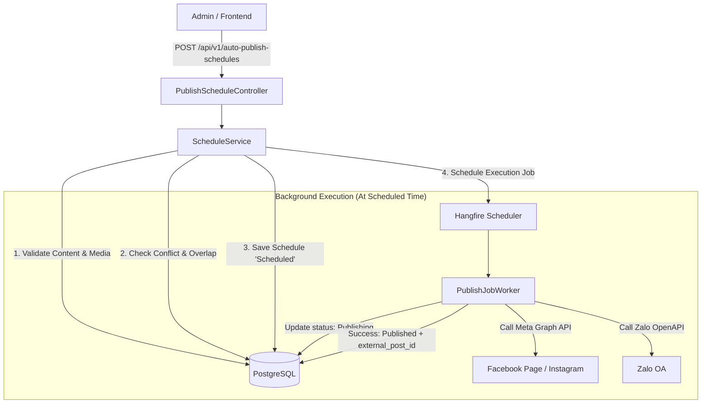
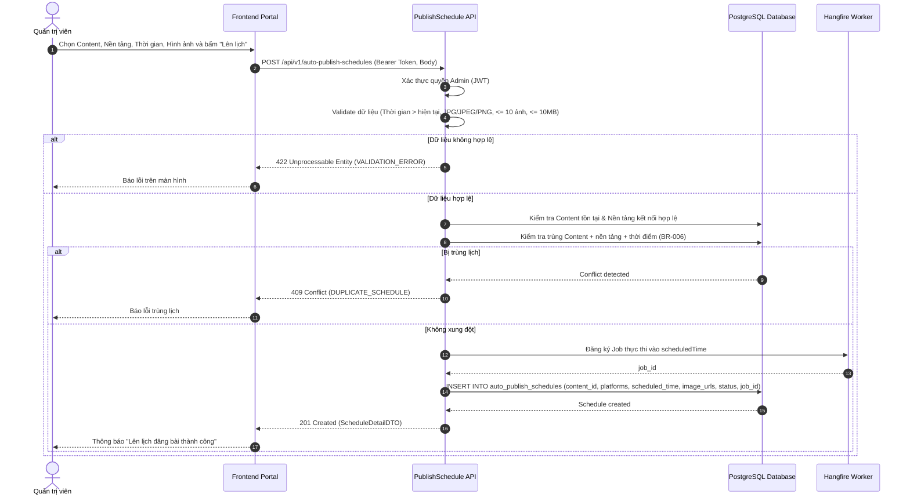
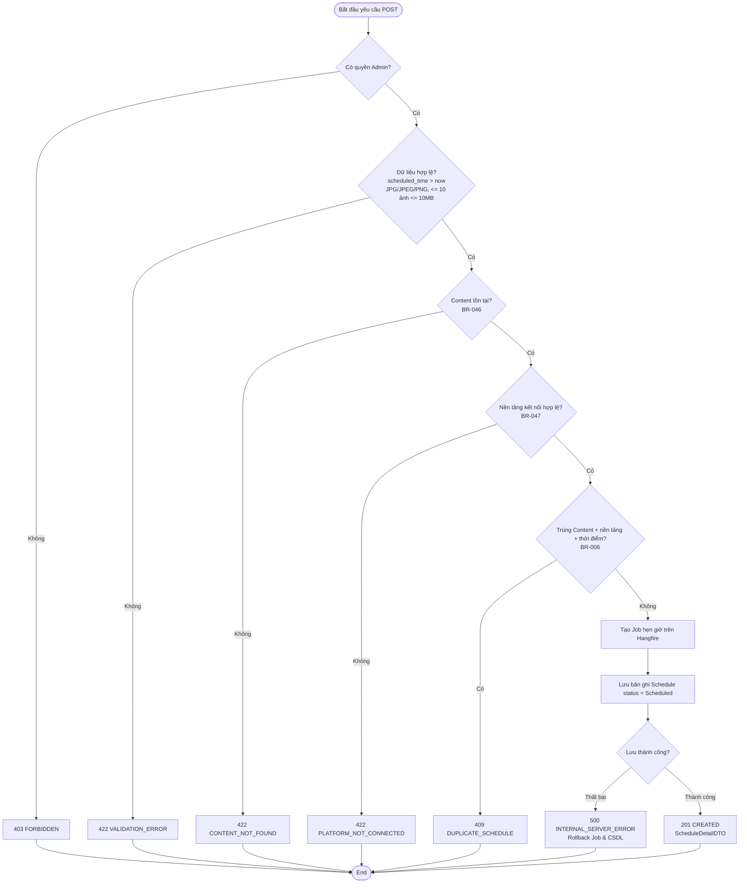
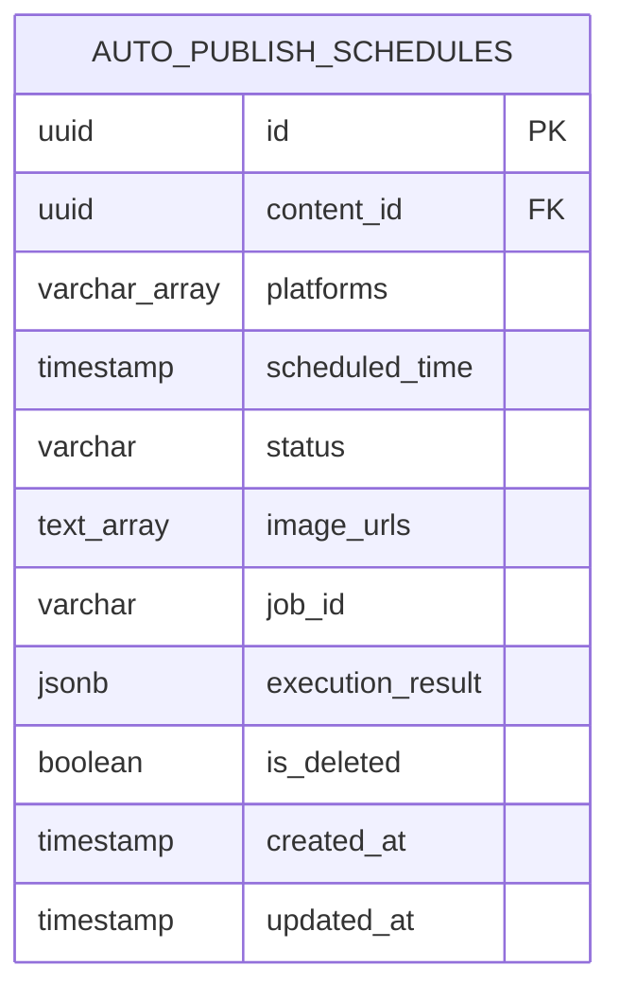

# TDD-002: Lên lịch và tự động đăng bài đa nền tảng

## Document Info

- **Feature**: Lên lịch và tự động đăng bài đa nền tảng
- **Author**: Hồ Hoàng Nam
- **Reviewer**: Tech Lead
- **Status**: In Review
- **Version**: v0
- **Updated At**: 2026-09-10

## Context & Goals

### Problem

Đội ngũ Marketing cần xuất bản nội dung lên nhiều kênh mạng xã hội (Facebook Fanpage, Instagram Business, Zalo Official Account) vào các khung giờ vàng có lượng tương tác cao. Việc đăng bài thủ công tốn nhiều nhân lực, dễ chậm trễ và sai lệch thời điểm. Cần một cơ chế cho phép Quản trị viên lên lịch đăng tự động từ nội dung và hình ảnh đã lưu trữ, và hệ thống tự động đẩy bài qua API các nền tảng khi đến hạn.

### Goals

- Cho phép Admin chọn 1 nội dung (`contentId`) đã lưu và danh sách hình ảnh tương thích: JPG/JPEG/PNG, tối đa 10 ảnh, mỗi ảnh $\le$ 10MB theo [BR-001](../BusinessRules/BR-001.md), [BR-002](../BusinessRules/BR-002.md), [BR-003](../BusinessRules/BR-003.md).
- Cho phép chọn một hoặc nhiều nền tảng xuất bản đích (`facebook`, `instagram`, `zalo` theo [BR-005](../BusinessRules/BR-005.md)).
- Kiểm tra thời gian đăng lớn hơn thời điểm hiện tại theo [BR-004](../BusinessRules/BR-004.md).
- Chặn lịch trùng đồng thời Content, nền tảng và thời điểm theo [BR-006](../BusinessRules/BR-006.md).
- Đăng ký tác vụ nền (Hangfire Background Job) để tự động gọi API các mạng xã hội khi đến giờ hẹn.
- Tự động retry tối đa 3 lần nếu gặp sự cố mạng hoặc lỗi tạm thời từ phía API nền tảng ([BR-049](../BusinessRules/BR-049.md)).

### Non-goals

- Không hỗ trợ đăng bài ngay lập tức không qua hàng đợi trong endpoint này.
- Không chỉnh sửa nội dung bài viết gốc trong lúc lên lịch.
- Không quản lý việc cấp quyền OAuth cho các trang mạng xã hội (được cấu hình trong module cài đặt hệ thống).

## Architecture

* Hệ thống nhận yêu cầu lên lịch từ Admin Frontend và kiểm tra tính hợp lệ của dữ liệu (Content tồn tại, thời gian trong tương lai, ảnh đính kèm $\le$ 10 ảnh và $\le$ 10MB/ảnh).
* Hệ thống kiểm tra kết nối hợp lệ của các nền tảng được chọn và kiểm tra tránh trùng lặp lịch đăng.
* Nếu hợp lệ, hệ thống ghi bản ghi lịch đăng ở trạng thái `Scheduled` và đăng ký tác vụ nền (Hangfire Background Job) theo giờ hẹn.
* Khi đến giờ hẹn, worker tác vụ ngầm tự động gọi API mạng xã hội đối tác tương ứng (Facebook Graph API, Zalo OA OpenAPI).



**Notes**:
- Sử dụng Hangfire để quản lý job thực thi tự động theo múi giờ `Asia/Ho_Chi_Minh`.
- Trạng thái đăng được ghi nhận riêng theo từng nền tảng trong `execution_result` theo BR-048.

## Sequence Diagram

Quản trị viên chọn bài viết, thiết lập thời gian và nền tảng. Hệ thống kiểm tra hợp lệ, chống trùng lặp và kích hoạt tác vụ nền.

| Field | Type | Vai trò trong TDD |
| --- | --- | --- |
| `contentId` | uuid | Khóa ngoại trỏ đến nội dung đã lưu (`generated_posts`). Bắt buộc. |
| `platforms` | string[] | Mảng các nền tảng được chọn (`facebook`, `instagram`, `zalo`). Bắt buộc. |
| `scheduledTime` | timestamp | Thời gian hẹn xuất bản (UTC). Phải lớn hơn thời điểm hiện tại. |
| `imageUrls` | string[] | Mảng URL ảnh đính kèm (0 đến 10 ảnh, định dạng JPG/JPEG/PNG, $\le$ 10MB/ảnh). |



## Activity Diagram



## Data Model



**Notes**:
- `platforms`: Mảng các nền tảng (`facebook`, `instagram`, `zalo`).
- `status`: `Scheduled`, `Publishing`, `Published`, `Failed`, `Cancelled`.
- `execution_result`: Lưu chi tiết kết quả từng nền tảng (`external_post_id`, mã lỗi, số lần retry) theo BR-048.

## Internal API

### Endpoints

- **POST** `/api/v1/auto-publish-schedules` — Tạo mới lịch đăng bài tự động đa nền tảng (Admin).

### Examples

#### POST /api/v1/auto-publish-schedules

##### 1. Tạo lịch đăng bài thành công (201 Created)

**Request**:
```http
POST /api/v1/auto-publish-schedules
Authorization: Bearer <Admin_Token>
Content-Type: application/json

{
  "contentId": "7d9b4b61-22b4-4896-bf1d-0fdbae881a28",
  "platforms": [
    "facebook",
    "instagram"
  ],
  "scheduledTime": "2026-09-10T15:00:00Z",
  "imageUrls": [
    "https://cdn.hoatheomua.vn/images/autumn-rose-01.jpg"
  ]
}
```

**Response 201**:
```json
{
  "value": {
    "id": "f882759f-aa0a-4427-b4c5-978afccd6900",
    "contentId": "7d9b4b61-22b4-4896-bf1d-0fdbae881a28",
    "platforms": [
      "facebook",
      "instagram"
    ],
    "scheduledTime": "2026-09-10T15:00:00Z",
    "status": "Scheduled",
    "imageUrls": [
      "https://cdn.hoatheomua.vn/images/autumn-rose-01.jpg"
    ],
    "createdAt": "2026-09-09T11:00:00Z"
  },
  "isSuccess": true,
  "isFailed": false,
  "error": null,
  "traceId": "0HNOE4G1GRT88:00000001",
  "timestampUtc": "2026-09-09T11:00:00.1234567Z"
}
```

##### 2. Trùng lịch đăng bài trên cùng nền tảng (409 Conflict)

**Request**:
```http
POST /api/v1/auto-publish-schedules
Authorization: Bearer <Admin_Token>
Content-Type: application/json

{
  "contentId": "7d9b4b61-22b4-4896-bf1d-0fdbae881a28",
  "platforms": [
    "facebook"
  ],
  "scheduledTime": "2026-09-10T15:00:00Z",
  "imageUrls": [
    "https://cdn.hoatheomua.vn/images/autumn-rose-01.jpg"
  ]
}
```

**Response 409 (Error)**:
```json
{
  "title": "Conflict",
  "status": 409,
  "detail": "Đã có lịch đăng cùng nội dung trên nền tảng facebook vào thời điểm này.",
  "messageCode": "DUPLICATE_SCHEDULE",
  "errors": {
    "platform": "facebook",
    "scheduledTime": "2026-09-10T15:00:00Z"
  },
  "traceId": "0HNOE4G1GRT88:00000002",
  "timestampUtc": "2026-09-09T11:00:10.0000000Z"
}
```

##### 3. Thời gian hẹn giờ không hợp lệ (422 Unprocessable Entity)

**Request**:
```http
POST /api/v1/auto-publish-schedules
Authorization: Bearer <Admin_Token>
Content-Type: application/json

{
  "contentId": "7d9b4b61-22b4-4896-bf1d-0fdbae881a28",
  "platforms": [
    "facebook"
  ],
  "scheduledTime": "2026-09-01T10:00:00Z",
  "imageUrls": []
}
```

**Response 422 (Error)**:
```json
{
  "title": "Unprocessable Entity",
  "status": 422,
  "detail": "Thời gian hẹn giờ phải diễn ra trong tương lai.",
  "messageCode": "SCHEDULE_TIME_INVALID",
  "errors": [
    {
      "field": "scheduledTime",
      "message": "Thời gian đăng phải lớn hơn thời điểm hiện tại."
    }
  ],
  "traceId": "0HNOE4G1GRT88:00000003",
  "timestampUtc": "2026-09-09T11:00:15.0000000Z"
}
```

### Error Codes

| Code | HTTP | Khi nào xảy ra |
| --- | --- | --- |
| `SCHEDULE_TIME_INVALID` | 422 | Thời gian đăng nhỏ hơn hoặc bằng hiện tại (BR-004). |
| `CONTENT_NOT_FOUND` | 422 | `contentId` không tồn tại hoặc đã bị xóa mềm trong hệ thống (BR-046). |
| `PLATFORM_REQUIRED` | 422 | Danh sách nền tảng rỗng (chưa chọn nền tảng nào) (BR-005). |
| `PLATFORM_NOT_CONNECTED` | 422 | Nền tảng được chọn chưa được kết nối hoặc token hết hạn (BR-047). |
| `MEDIA_LIMIT_EXCEEDED` | 422 | Sai định dạng ảnh, số lượng ảnh vượt quá 10 hoặc file vượt quá 10MB (BR-001, BR-002, BR-003). |
| `DUPLICATE_SCHEDULE` | 409 | Trùng đồng thời Content, Nền tảng và Thời điểm đăng (BR-006). |
| `INTERNAL_SERVER_ERROR` | 500 | Lỗi kết nối cơ sở dữ liệu hoặc lỗi dịch vụ lập lịch nền Hangfire. |

## External API

### Endpoints

- **Meta Graph API**: `POST https://graph.facebook.com/v19.0/{page-id}/feed` — Đăng bài lên Facebook Fanpage.
- **Instagram Graph API**: `POST https://graph.facebook.com/v19.0/{ig-user-id}/media_publish` — Xuất bản bài viết Instagram.
- **Zalo OA OpenAPI**: `POST https://openapi.zalo.me/v2.0/oa/article/create` — Đăng bài viết lên Zalo Official Account.

### Error Handling
- Áp dụng Retry tối đa 3 lần với khoảng cách thời gian giãn cách theo cấp số nhân (Exponential Backoff: 1 phút, 5 phút, 15 phút) đối với các lỗi mạng hoặc mã lỗi `5xx` từ nền tảng ([BR-049](../BusinessRules/BR-049.md)).
- Với các mã lỗi `4xx` (Token hết hạn, quyền bị hủy), ngừng retry và cập nhật trạng thái `Failed` ngay lập tức.

## References

### User Stories

- [STORY-002: Lên lịch và tự động đăng bài](../UserStory/02-ScheduleAndAutoPublishPosts.md)

### Business Rules

- [BR-001: Định dạng file ảnh đính kèm](../BusinessRules/BR-001.md)
- [BR-002: Dung lượng tối đa của ảnh đính kèm](../BusinessRules/BR-002.md)
- [BR-003: Giới hạn số lượng ảnh](../BusinessRules/BR-003.md)
- [BR-004: Thời điểm hẹn giờ đăng bài hợp lệ](../BusinessRules/BR-004.md)
- [BR-005: Bắt buộc chọn nền tảng](../BusinessRules/BR-005.md)
- [BR-006: Kiểm tra trùng lịch đăng bài](../BusinessRules/BR-006.md)
- [BR-046: Nội dung hợp lệ của lịch đăng bài](../BusinessRules/BR-046.md)
- [BR-047: Nền tảng hợp lệ và không trùng trong lịch đăng](../BusinessRules/BR-047.md)
- [BR-048: Trạng thái đăng được ghi nhận riêng theo nền tảng](../BusinessRules/BR-048.md)
- [BR-049: Cơ chế tự động thử lại (Retry) khi đăng bài thất bại](../BusinessRules/BR-049.md)

### Use Cases

### Others

- `HoaTheoMua.Repository.Enum.PlatformType` (`Zalo = 0`, `Facebook = 1`, `Instagram = 2`).

## Change Log
