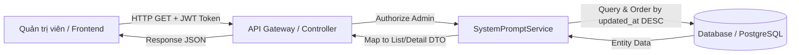
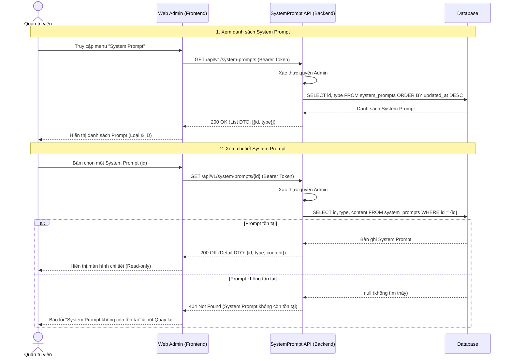
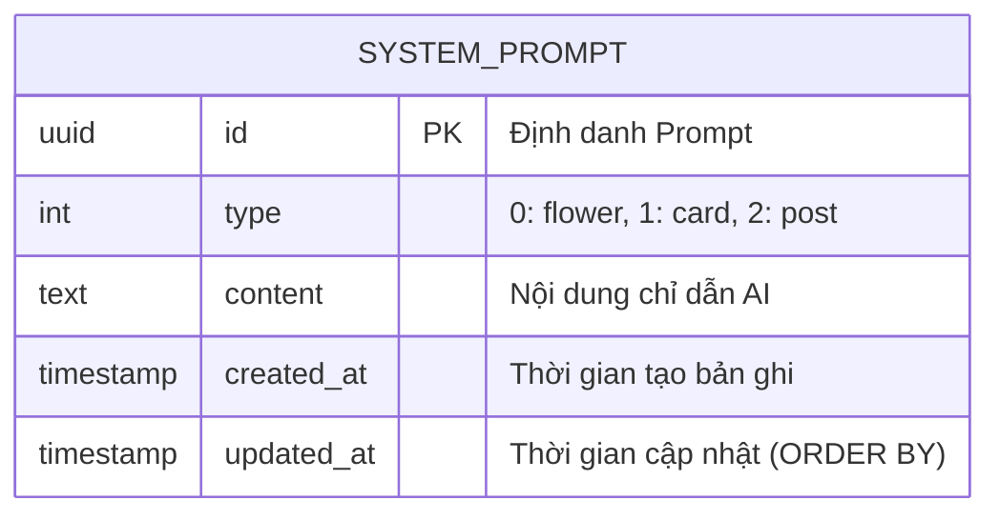

# TDD-003: Xem danh sách và chi tiết System Prompt

## Document Info

- **Doc ID**: TDD-003
- **Feature**: Xem danh sách và chi tiết System Prompt
- **Author**: Phùng Nguyễn Thiên Hào
- **Reviewer**: Tech Lead
- **Status**: In Review
- **Version**: v0
- **Updated At**: 2026-09-09
- **Story liên quan**: [STORY-004](file:///d:/VNZ/document-first-brief/hoa-theo-mua-ai-marketing/UserStory/04-ViewSystemPromptsListAndDetail.md)

---

## Context & Goals

### Problem
Admin cần kiểm tra System Prompt hiện hành cho các nghiệp vụ AI (tạo nội dung hoa, thiệp, bài đăng) mà không được thay đổi nội dung Prompt trong chức năng này.

### Goals
- Cung cấp danh sách System Prompt cho Admin.
- Cung cấp chi tiết đầy đủ nội dung của một System Prompt.
- Hệ thống sắp xếp danh sách theo thời gian cập nhật giảm dần (`updated_at` DESC).
- Không trả `created_at` hoặc `updated_at` trong DTO.

### Non-goals
- Tìm kiếm, lọc, phân trang.
- Tạo, cập nhật, khôi phục hoặc xóa System Prompt.
- Quản lý trạng thái Active/Inactive, phiên bản hoặc lịch sử Prompt (mỗi type chỉ có 1 prompt hiện hành).
- Tự động retry truy vấn database ở tầng backend.

---

## Architecture

Hệ thống nhận yêu cầu xem **danh sách** hoặc **chi tiết System Prompt** và kiểm tra người dùng có phải **Admin** hay không.
- Nếu có quyền, hệ thống lấy dữ liệu tương ứng từ cơ sở dữ liệu.
- Khi xem danh sách, hệ thống chỉ trả các thông tin cần thiết (`id`, `type`) và **không trả nội dung `content`**.
- Nếu xử lý thành công, hệ thống trả dữ liệu về cho người dùng. Nếu có lỗi, hệ thống trả thông báo lỗi phù hợp.



---

## Sequence Diagram

Admin mở danh sách, backend trả các field nhận diện. Khi Admin chọn một dòng, frontend gọi endpoint chi tiết để tải content.



### Data Dictionary

| Field | Type | Vai trò trong TDD |
| --- | --- | --- |
| `id` | `uuid` | Khóa chính, định danh duy nhất, dùng cho endpoint chi tiết. |
| `type` | `system_prompt_types` | Phân loại Prompt (0: Flower, 1: Card, 2: Post); trả trực tiếp trong list/detail DTO. |
| `content` | `text` | Nội dung Prompt; chỉ trả ở endpoint chi tiết. |
| `created_at` | `timestamp` | Gán khi khởi tạo; không dùng để sắp xếp hoặc trả DTO. |
| `updated_at` | `timestamp not null` | Gán khi khởi tạo và mỗi lần cập nhật; là tiêu chí sắp xếp duy nhất, không trả DTO. |

---

## Activity Diagram

```mermaid
flowchart TD
    Start([Bắt đầu]) --> CheckAuth{Có quyền Admin?}
    CheckAuth -- Không --> Err403[Trả về 403 Forbidden]
    CheckAuth -- Có --> RequestType{Loại yêu cầu?}

    %% Danh sách
    RequestType -- Lấy danh sách --> QueryList[Truy vấn System Prompts<br/>ORDER BY updated_at DESC]
    QueryList --> CheckListSuccess{Truy vấn thành công?}
    CheckListSuccess -- Thất bại --> Err500List[Trả về 500 Internal Server Error]
    CheckListSuccess -- Thành công --> ReturnList[Trả về 200 OK<br/>Danh sách DTO {id, type}]

    %% Chi tiết
    RequestType -- Lấy chi tiết --> QueryDetail[Truy vấn Prompt theo ID]
    QueryDetail --> CheckDetailSuccess{Truy vấn thành công?}
    CheckDetailSuccess -- Thất bại --> Err500Detail[Trả về 500 Internal Server Error]
    CheckDetailSuccess -- Thành công --> CheckExists{Prompt tồn tại?}
    CheckExists -- Không tìm thấy --> Err404[Trả về 404 Not Found<br/>System Prompt không còn tồn tại]
    CheckExists -- Tồn tại --> ReturnDetail[Trả về 200 OK<br/>Detail DTO {id, type, content}]

    ReturnList --> End([Kết thúc])
    ReturnDetail --> End
    Err403 --> End
    Err404 --> End
    Err500List --> End
    Err500Detail --> End
```

---

## Data Model



**Notes**:
- Khóa chính là `id` (`UUID`).
- Chỉ mục (Index) khuyến nghị: Index trên cột `updated_at DESC` để tối ưu hóa hiệu năng câu lệnh sắp xếp danh sách.
- Phân loại `type` (Enum / Integer):
  - `0`: Flower (Nội dung hoa)
  - `1`: Card (Nội dung thiệp)
  - `2`: Post (Nội dung bài viết marketing)

---

## Internal API Contract

### Endpoints

#### 1. Lấy danh sách System Prompt
- **Method / Path**: `GET /api/v1/system-prompts`
- **Authorization**: `Bearer Token` (Admin)
- **Mô tả**: Lấy danh sách các System Prompt hiện có, sắp xếp theo thời gian cập nhật mới nhất trước.

**Phản hồi thành công (200 OK)**:
```json
{
  "value": [
    {
      "id": "bd3d8b61-77b4-4896-bf1d-0fdbae881a28",
      "type": 1
    },
    {
      "id": "e442759f-ff0a-4427-b4c5-978afccd69fd",
      "type": 0
    }
  ],
  "isSuccess": true,
  "isFailed": false,
  "error": null,
  "traceId": "0HNOE4G1GRT70:00000003",
  "timestampUtc": "2026-09-09T03:40:10.2839321Z"
}
```

**Danh sách rỗng (200 OK)**:
```json
{
  "value": [],
  "isSuccess": true,
  "isFailed": false,
  "error": null,
  "traceId": "00-example",
  "timestampUtc": "2026-09-04T12:00:00Z"
}
```

**Lỗi hệ thống (500 Internal Server Error)**:
```json
{
  "title": "Internal Server Error",
  "status": 500,
  "detail": "An unexpected error occurred.",
  "messageCode": "INTERNAL_SERVER_ERROR",
  "errors": null,
  "traceId": "00-example",
  "timestampUtc": "2026-09-04T12:00:00Z"
}
```

---

#### 2. Lấy chi tiết System Prompt
- **Method / Path**: `GET /api/v1/system-prompts/{id:guid}`
- **Authorization**: `Bearer Token` (Admin)
- **Mô tả**: Lấy đầy đủ nội dung chi tiết của một System Prompt theo ID.

**Phản hồi thành công (200 OK)**:
```json
{
  "value": {
    "id": "bd3d8b61-77b4-4896-bf1d-0fdbae881a28",
    "type": 1,
    "content": "afadsfasdfasdf asfasfda adsfa asfsad"
  },
  "isSuccess": true,
  "isFailed": false,
  "error": null,
  "traceId": "0HNOE4G1GRT72:00000001",
  "timestampUtc": "2026-09-09T03:42:59.4860516Z"
}
```

**Không tìm thấy Prompt (404 Not Found)**:
```json
{
  "title": "Not Found",
  "status": 404,
  "detail": "System Prompt không còn tồn tại",
  "messageCode": "NOT_FOUND",
  "errors": {
    "detail": "System Prompt không còn tồn tại"
  },
  "traceId": "0HNOE4G1GRT72:00000002",
  "timestampUtc": "2026-09-09T03:43:27.8105036Z"
}
```

**Lỗi hệ thống (500 Internal Server Error)**:
```json
{
  "title": "Internal Server Error",
  "status": 500,
  "detail": "An unexpected error occurred.",
  "messageCode": "INTERNAL_SERVER_ERROR",
  "errors": null,
  "traceId": "00-example",
  "timestampUtc": "2026-09-04T12:00:00Z"
}
```

---

### Quy ước Mã lỗi (Error Code)

| Code | HTTP Status | Khi nào xảy ra |
| --- | --- | --- |
| `NOT_FOUND` | 404 | System Prompt theo ID không tồn tại trong cơ sở dữ liệu. |
| `INTERNAL_SERVER_ERROR` | 500 | Lỗi kết nối CSDL, truy vấn thất bại hoặc lỗi máy chủ ngoài dự kiến. |

---

## References

- **User Story liên quan**: [STORY-004: Xem danh sách và chi tiết System Prompt](file:///d:/VNZ/document-first-brief/hoa-theo-mua-ai-marketing/UserStory/04-ViewSystemPromptsListAndDetail.md)
- **Business Rule liên quan**: [BR-040: Sắp xếp danh sách System Prompt](file:///d:/VNZ/document-first-brief/hoa-theo-mua-ai-marketing/BusinessRules/BR-040.md)
