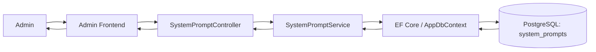
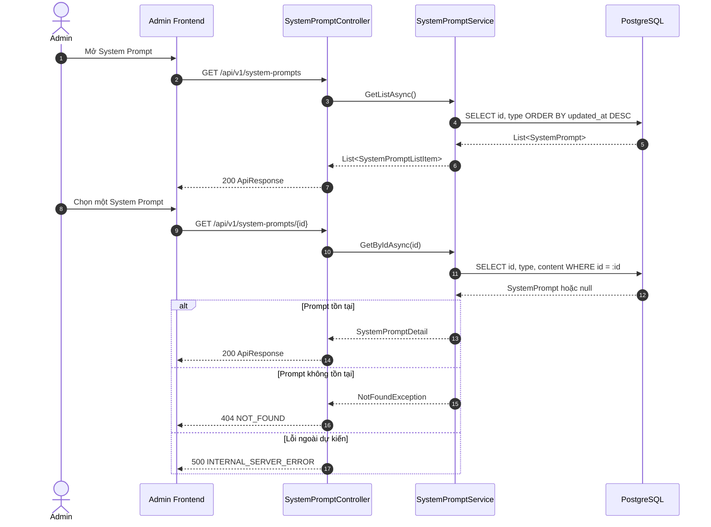
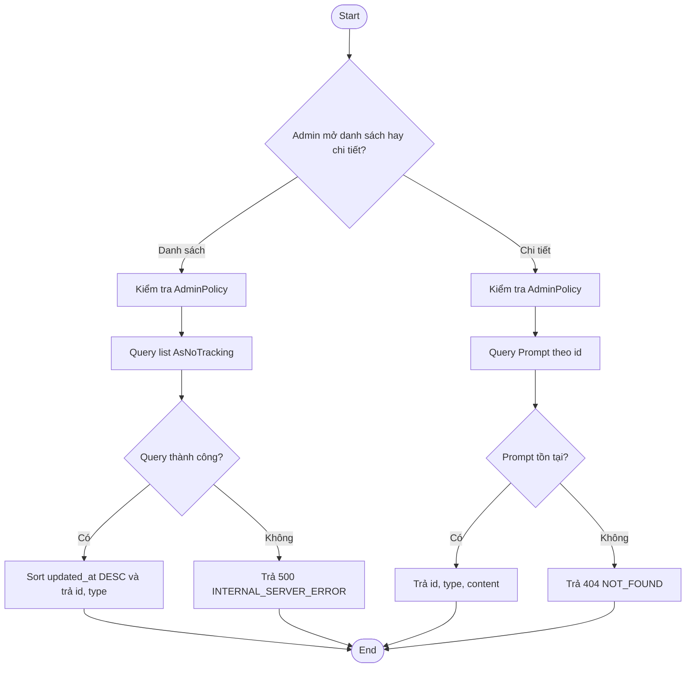
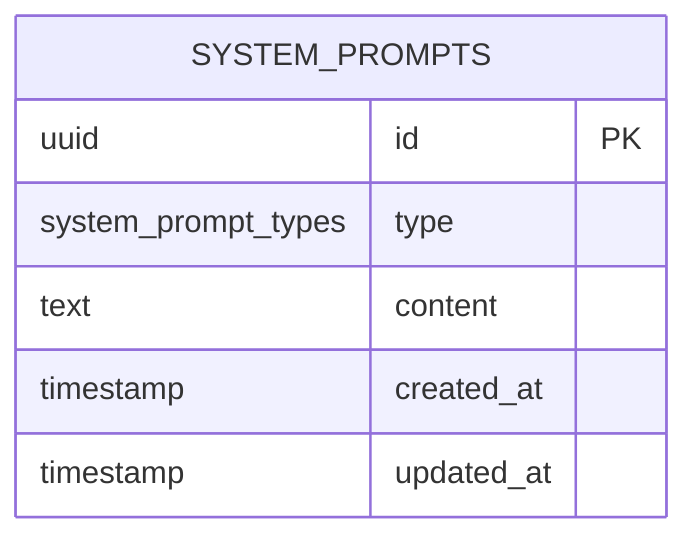

# TDD-003: Xem danh sách và chi tiết System Prompt

## Document Info

- **Feature**: Xem danh sách và chi tiết System Prompt
- **Author**: Phùng Nguyễn Thiên Hào
- **Reviewer**: Tech Lead
- **Status**: In Review
- **Version**: v0
- **Updated At**: 2026-09-09

## Context & Goals

### Problem

Admin cần kiểm tra System Prompt hiện hành cho các nghiệp vụ AI mà không được thay đổi nội dung Prompt trong chức năng này.

### Goals

- Cung cấp danh sách System Prompt cho Admin.
- Cung cấp chi tiết đầy đủ nội dung của một System Prompt.
- Hệ thống sắp xếp danh sách theo thời gian cập nhật giảm dần.
- Không trả createdAt hoặc updatedAt trong DTO.

### Non-goals

- Tìm kiếm, lọc, phân trang.
- Tạo, cập nhật, khôi phục hoặc xóa System Prompt.
- Status Active/Inactive, phiên bản hoặc lịch sử Prompt.
- Tự retry truy vấn database ở backend.

## Architecture

* Hệ thống nhận yêu cầu xem **danh sách** hoặc **chi tiết System Prompt** và kiểm tra người dùng có phải **Admin** hay không.
* Nếu có quyền, hệ thống lấy dữ liệu tương ứng.
* Khi xem danh sách, hệ thống chỉ trả các thông tin cần thiết và **không trả nội dung `content`**.
* Nếu xử lý thành công, hệ thống trả dữ liệu về cho người dùng. Nếu có lỗi, hệ thống trả thông báo lỗi phù hợp.



**Notes**:
- Code EF map trực tiếp entity `SystemPrompt(Id, Type, Content, CreatedAt, UpdatedAt)`.
- Không thêm cache; số lượng System Prompt ít và cố định theo nghiệp vụ.

## Sequence Diagram

Admin mở danh sách, backend trả các field nhận diện. Khi Admin chọn một dòng, frontend gọi endpoint chi tiết để tải content.

| Field | Type | Vai trò trong TDD |
| --- | --- | --- |
| `id` | uuid | Định danh, dùng cho endpoint chi tiết. |
| `type` | system_prompt_types | Phân loại Prompt; trả trực tiếp trong list/detail DTO. |
| `content` | text | Chỉ trả ở endpoint chi tiết. |
| `created_at` | timestamp | Gán khi khởi tạo; không dùng để sắp xếp hoặc trả DTO. |
| `updated_at` | timestamp not null | Gán khi khởi tạo và mỗi lần cập nhật; là tiêu chí sắp xếp duy nhất, không trả DTO. |



## Activity Diagram



## Data Model



**Notes**:
- `type` unique theo enum `HoaTheoMua.Repository.Enum.SystemPromptType` (`Flower = 0`, `Card = 1`, `Post = 2`).
- Không có cột `version`, không tạo bảng lịch sử.

## Internal API

### Endpoints

- **GET** `/api/v1/system-prompts` — Lấy danh sách System Prompt (Admin).
- **GET** `/api/v1/system-prompts/{id:guid}` — Lấy chi tiết một System Prompt.

### Examples

#### GET /api/v1/system-prompts

**Request**:
```http
GET /api/v1/system-prompts
Authorization: Admin
```

*Ghi chú*: `type = 0 => flower`, `type = 1 => card`, `type = 2 => post`

**Response 200 (Lấy danh sách thành công)**:
```json
{
  "value": [
    {
      "id": "bd3d8b61-77b4-4896-bf1d-0fdbae881a28",
      "type": 1
    },
    {
      "id": "e442759f-ff0a-4427-b4c5-978afccd69fd",
      "type": 0
    }
  ],
  "isSuccess": true,
  "isFailed": false,
  "error": null,
  "traceId": "0HNOE4G1GRT70:00000003",
  "timestampUtc": "2026-09-09T03:40:10.2839321Z"
}
```

**Response 200 (Danh sách rỗng)**:
```json
{
  "value": [],
  "isSuccess": true,
  "isFailed": false,
  "error": null,
  "traceId": "00-example",
  "timestampUtc": "2026-09-04T12:00:00Z"
}
```

#### GET /api/v1/system-prompts/{id:guid}

**Request**:
```http
GET /api/v1/system-prompts/550e8400-e29b-41d4-a716-446655440001
Authorization: Admin
```

**Response 200 (Prompt tồn tại)**:
```json
{
  "value": {
    "id": "bd3d8b61-77b4-4896-bf1d-0fdbae881a28",
    "type": 1,
    "content": "afadsfasdfasdf asfasfda adsfa asfsad"
  },
  "isSuccess": true,
  "isFailed": false,
  "error": null,
  "traceId": "0HNOE4G1GRT72:00000001",
  "timestampUtc": "2026-09-09T03:42:59.4860516Z"
}
```

**Error 404 (Prompt không tồn tại)**:
```json
{
  "title": "Not Found",
  "status": 404,
  "detail": "System Prompt không còn tồn tại",
  "messageCode": "NOT_FOUND",
  "errors": {
    "detail": "System Prompt không còn tồn tại"
  },
  "traceId": "0HNOE4G1GRT72:00000002",
  "timestampUtc": "2026-09-09T03:43:27.8105036Z"
}
```

**Error 500 (Lỗi hệ thống khi tải danh sách/chi tiết)**:
```json
{
  "title": "Internal Server Error",
  "status": 500,
  "detail": "An unexpected error occurred.",
  "messageCode": "INTERNAL_SERVER_ERROR",
  "errors": null,
  "traceId": "00-example",
  "timestampUtc": "2026-09-04T12:00:00Z"
}
```

### Error Codes

| Code | HTTP | Khi nào xảy ra |
| --- | --- | --- |
| `NOT_FOUND` | 404 | System Prompt theo id không tồn tại. |
| `INTERNAL_SERVER_ERROR` | 500 | Truy vấn database hoặc lỗi ngoài dự kiến thất bại. |

## References

### User Stories

- [STORY-004: Xem danh sách và chi tiết System Prompt](../UserStory/04-ViewSystemPromptsListAndDetail.md)

### Business Rules

- [BR-040: Sắp xếp danh sách System Prompt](../BusinessRules/BR-040.md)

### Use Cases

### Others

- [TDD-004: Sửa System Prompt](TDD-004-UpdateSystemPrompt.md)
- `HoaTheoMua.Repository.Enum.SystemPromptType` (`Flower = 0`, `Card = 1`, `Post = 2`).

**Ghi chú**:
- Mỗi System Prompt khi được tạo lần đầu sẽ có `created_at` và `updated_at` cùng bằng thời gian tạo.
- Hệ thống sẽ tạo sẵn các System Prompt mặc định vào bảng `SystemPrompt`, vì vậy tất cả System Prompt đều có `updated_at` trước khi được lấy ra trong danh sách.

## Change Log
