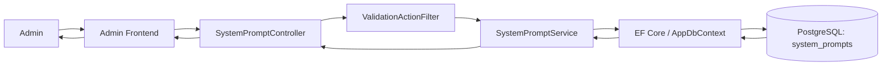
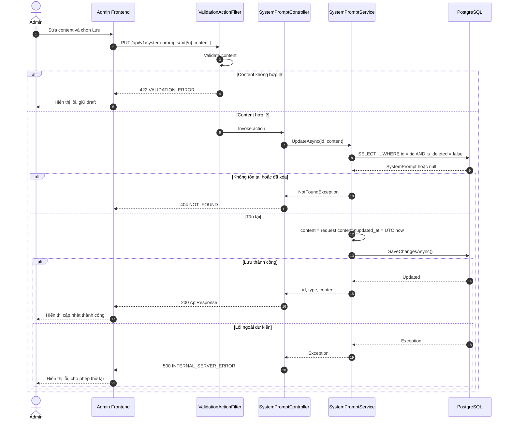
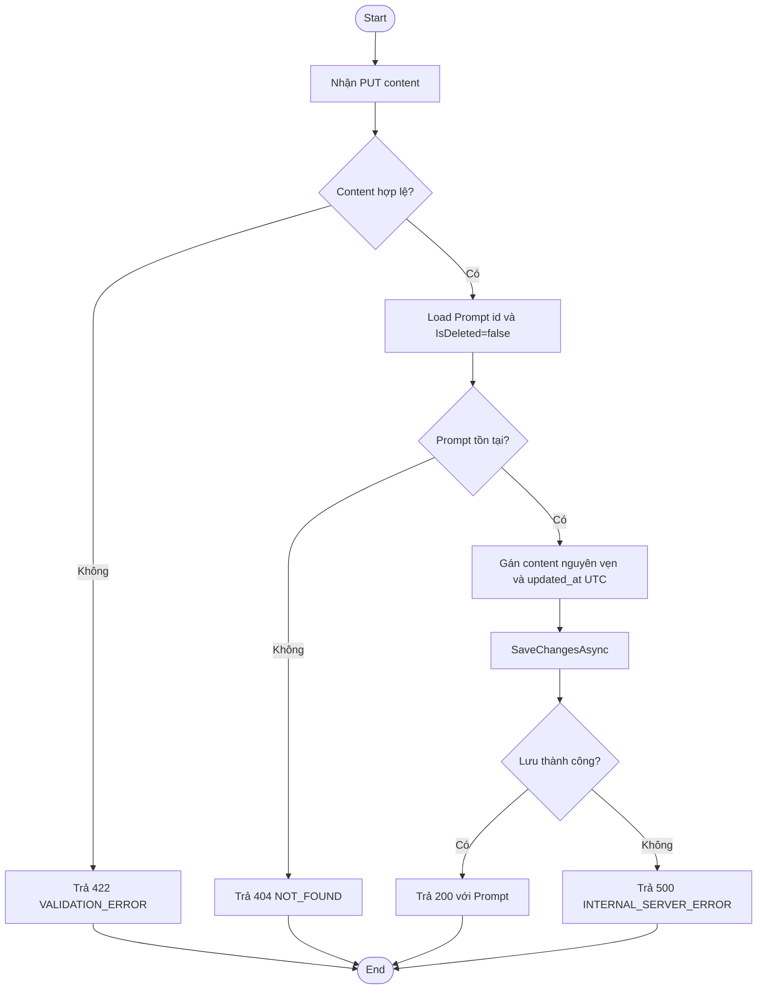
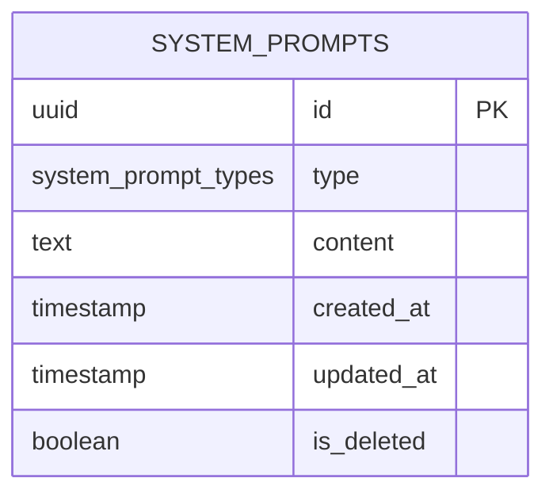

# TDD-004: Sửa System Prompt

## Document Info

- **Feature**: Sửa System Prompt
- **Author**: Phùng Nguyễn Thiên Hào
- **Reviewer**: Tech Lead
- **Status**: In Review
- **Version**: v0
- **Updated At**: 2026-09-10

## Context & Goals

### Problem

Admin cần cập nhật nội dung hiện tại của một System Prompt để những lần AI xử lý sau đó sử dụng nội dung mới. Thao tác không được thay đổi type, không tạo phiên bản hoặc lịch sử.

### Goals

- Cho phép Admin cập nhật duy nhất `content` của System Prompt chưa bị xóa.
- Kiểm tra `content` theo BR-041 và BR-042, nhưng lưu nguyên chuỗi nhận được.
- Cập nhật `updated_at` cùng lần lưu thành công.

### Non-goals

- Preview hoặc gọi AI để chạy thử Prompt.
- Tạo, xóa, đổi type, version, revision, history, restore và audit người cập nhật.
- Optimistic locking, so sánh nội dung mới với nội dung hiện tại, hoặc tự retry database.
- Kiểm tra cú pháp Markdown hoặc tự tối ưu Prompt bằng AI.

## Architecture

* Khi Admin chọn **Lưu**, Frontend gửi yêu cầu cập nhật System Prompt.
* Hệ thống kiểm tra người dùng có quyền Admin hay không.
* Hệ thống kiểm tra nội dung gửi lên có hợp lệ không.
* Hệ thống tìm System Prompt cần cập nhật và đảm bảo Prompt đó vẫn còn tồn tại, chưa bị xóa.
* Nếu hợp lệ, hệ thống cập nhật nội dung mới và lưu thay đổi.



**Notes**:
- Code EF map trực tiếp entity `SystemPrompt(Id, Type, Content, IsDeleted, CreatedAt, UpdatedAt)`.
- Không sử dụng version hay optimistic lock; thao tác ghi đè trực tiếp và cập nhật `updated_at = NOW()`.

## Sequence Diagram

- Frontend chỉ gửi `content`.
- Hệ thống kiểm tra nội dung hợp lệ và System Prompt vẫn còn tồn tại. Nếu hợp lệ, hệ thống lưu nguyên nội dung được gửi lên và cập nhật `updated_at` theo thời gian hiện tại.

| Field | Vai trò | Khi cập nhật |
| --- | --- | --- |
| `id` | Định danh Prompt. | Không đổi. |
| `type` | Phân loại Prompt. | Không đổi. |
| `content` | Nội dung hướng dẫn AI. | Gán đúng chuỗi request. |
| `created_at` | Thời điểm tạo. | Không đổi. |
| `updated_at` | Thời điểm cập nhật gần nhất. | Gán UTC hiện tại. |
| `is_deleted` | Cờ xóa mềm. | Không đổi; phải là `false` để được cập nhật. |



## Activity Diagram



## Data Model



**Notes**:
- `type` theo enum `HoaTheoMua.Repository.Enum.SystemPromptType` (`Flower = 0`, `Card = 1`, `Post = 2`).
- Không có bảng `SystemPromptHistory`, không có cột `version`.

## Internal API

### Endpoints

- **PUT** `/api/v1/system-prompts/{id:guid}` — Cập nhật nội dung hiện tại của một System Prompt (Admin).

### Examples

#### PUT /api/v1/system-prompts/{id:guid}

**Request**:
```http
PUT /api/v1/system-prompts/550e8400-e29b-41d4-a716-446655440001
Authorization: Admin
Content-Type: application/json

{
  "content": "  # Hướng dẫn\n\tGiữ nguyên khoảng trắng đầu dòng.\n"
}
```

*Lưu ý enum*:
`HoaTheoMua.Repository.Enum.SystemPromptType`:
- `Flower = 0`
- `Card = 1`
- `Post = 2`

**Response 200 (Cập nhật thành công)**:
```json
{
  "value": {
    "id": "bd3d8b61-77b4-4896-bf1d-0fdbae881a28",
    "type": 1,
    "content": "Bạn là AI hỗ trợ tạo nội dung.\n\n## Yêu cầu\n- Trả lời bằng tiếng Việt."
  },
  "isSuccess": true,
  "isFailed": false,
  "error": null,
  "traceId": "0HNOE4G1GRT72:00000006",
  "timestampUtc": "2026-09-09T03:46:37.9958822Z"
}
```

**Error 422 (Content không hợp lệ)**:
*(Content rỗng, vượt 20.000 ký tự hoặc chứa control character không được phép)*
```json
{
  "title": "Unprocessable Entity",
  "status": 422,
  "detail": "",
  "messageCode": "VALIDATION_ERROR",
  "errors": [
    {
      "field": "content",
      "message": "Content không được để trống."
    }
  ],
  "traceId": "00-example",
  "timestampUtc": "2026-09-04T12:00:00Z"
}
```

**Error 404 (Prompt không tồn tại hoặc đã bị xóa)**:
```json
{
  "title": "Not Found",
  "status": 404,
  "detail": "System Prompt không tồn tại",
  "messageCode": "NOT_FOUND",
  "errors": null,
  "traceId": "00-example",
  "timestampUtc": "2026-09-04T12:00:00Z"
}
```

**Error 500 (Lỗi hệ thống khi cập nhật)**:
```json
{
  "title": "Internal Server Error",
  "status": 500,
  "detail": "An unexpected error occurred.",
  "messageCode": "INTERNAL_SERVER_ERROR",
  "errors": null,
  "traceId": "00-example",
  "timestampUtc": "2026-09-04T12:00:00Z"
}
```

### Error Codes

| Code | HTTP | Khi nào xảy ra |
| --- | --- | --- |
| `VALIDATION_ERROR` | 422 | `content` thiếu, rỗng, quá giới hạn (1-20.000 ký tự) hoặc có control character không được phép. |
| `NOT_FOUND` | 404 | Không có Prompt theo `id` hoặc `is_deleted = true`. |
| `INTERNAL_SERVER_ERROR` | 500 | Lỗi database/lỗi không dự kiến khi cập nhật. |

## References

### User Stories

- [STORY-005: Sửa System Prompt](../UserStory/05-UpdateSystemPrompt.md)

### Business Rules

- [BR-041: Độ dài System Prompt](../BusinessRules/BR-041.md)
- [BR-042: Định dạng text của System Prompt](../BusinessRules/BR-042.md)

### Use Cases

### Others

- `HoaTheoMua.Repository.Enum.SystemPromptType` (`Flower = 0`, `Card = 1`, `Post = 2`).

**Quy tắc dữ liệu gửi lên**:

| Field | Quy tắc |
| --- | --- |
| `id` | Bắt buộc có trên đường dẫn API. |
| `content` | Bắt buộc có nội dung, không được để trống hoặc chỉ chứa khoảng trắng. |
| `content` | Tối đa 20.000 ký tự. |
| `content` | Không cho phép các ký tự điều khiển đặc biệt, ngoại trừ Tab và xuống dòng. |
| `content` | Chỉ dùng `Trim()` để kiểm tra nội dung có rỗng hay không. Khi lưu, hệ thống giữ nguyên nội dung Frontend gửi lên. |
| Field khác | Không cho phép cập nhật `type`, thời gian tạo/cập nhật, trạng thái xóa hoặc các thông tin khác. |

**Quy tắc nghiệp vụ**:

| Điều kiện | Kết quả |
| --- | --- |
| `content` chỉ có khoảng trắng | Từ chối cập nhật và không lưu dữ liệu (422 `VALIDATION_ERROR`). |
| `content` dài hơn 20.000 ký tự | Từ chối cập nhật và không lưu dữ liệu (422 `VALIDATION_ERROR`). |
| `content` chứa ký tự không được phép | Từ chối cập nhật và không lưu dữ liệu (422 `VALIDATION_ERROR`). |
| `content` hợp lệ và System Prompt còn tồn tại | Lưu nguyên nội dung được gửi lên và cập nhật `updated_at` bằng thời gian hiện tại. |
| `content` giống với nội dung hiện tại | Vẫn thực hiện cập nhật và làm mới `updated_at`. |

## Change Log
