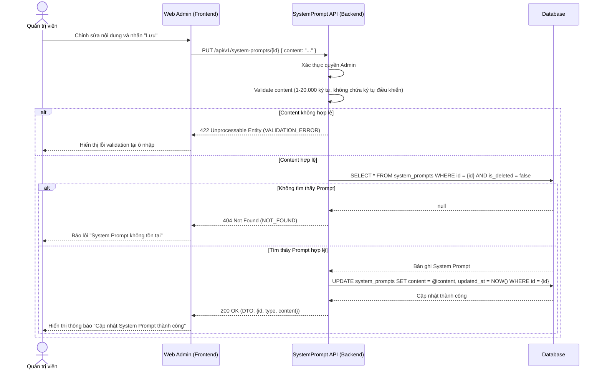
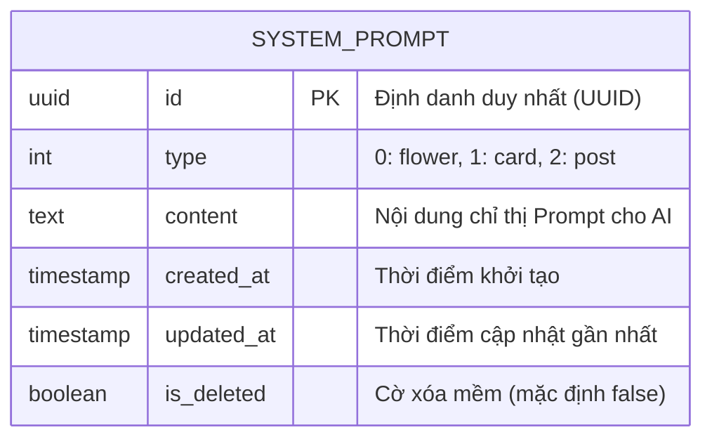

# TDD-004: Sửa System Prompt

## Document Info

- **Doc ID**: TDD-004
- **Feature**: Sửa System Prompt
- **Author**: Phùng Nguyễn Thiên Hào
- **Reviewer**: Tech Lead
- **Status**: In Review
- **Version**: v0
- **Updated At**: 2026-09-09
- **Story liên quan**: [STORY-005](file:///d:/VNZ/document-first-brief/hoa-theo-mua-ai-marketing/UserStory/05-UpdateSystemPrompt.md)

---

## Context & Goals

### Problem
Admin cần cập nhật nội dung hiện tại của một System Prompt để những lần AI xử lý sau đó sử dụng nội dung mới. Thao tác không được thay đổi `type`, không tạo phiên bản hoặc lịch sử.

### Goals
- Cho phép Admin cập nhật duy nhất trường `content` của System Prompt chưa bị xóa (`is_deleted == false`).
- Kiểm tra `content` theo [BR-041](file:///d:/VNZ/document-first-brief/hoa-theo-mua-ai-marketing/BusinessRules/BR-041.md) (độ dài 1 - 20.000 ký tự) và [BR-042](file:///d:/VNZ/document-first-brief/hoa-theo-mua-ai-marketing/BusinessRules/BR-042.md) (không chứa ký tự điều khiển ẩn), nhưng lưu nguyên vẹn chuỗi nhận được từ request.
- Cập nhật trường `updated_at` cùng lần lưu thành công.

### Non-goals
- Preview hoặc gọi AI để chạy thử Prompt bằng dữ liệu mẫu.
- Tạo, xóa, đổi `type`, version, revision, history, restore và audit người cập nhật.
- Optimistic locking, so sánh nội dung mới với nội dung hiện tại, hoặc tự động retry database ở backend.
- Kiểm tra ngữ nghĩa, cú pháp Markdown hoặc tự tối ưu Prompt bằng AI.

---

## Architecture

- Khi Admin chọn **Lưu**, Frontend gửi yêu cầu cập nhật System Prompt đến backend.
- Hệ thống kiểm tra người dùng có quyền **Admin** hay không (Authorization).
- Hệ thống kiểm tra nội dung gửi lên có hợp lệ theo quy định không (Validation).
- Hệ thống tìm System Prompt cần cập nhật và đảm bảo Prompt đó vẫn còn tồn tại, chưa bị xóa mềm (`is_deleted == false`).
- Nếu hợp lệ, hệ thống cập nhật nội dung mới và lưu thay đổi vào cơ sở dữ liệu.

```mermaid
flowchart LR
    Admin[Quản trị viên / Frontend] -->|PUT /api/v1/system-prompts/{id}| API[API Controller]
    API -->|Validate Request Body & Token| Service[SystemPromptService]
    Service -->|Find by ID and is_deleted = false| DB[(Database / PostgreSQL)]
    DB -->|Entity exists| Service
    Service -->|Update content & updated_at| DB
    DB -->|Success| Service
    Service -->|200 OK + Updated DTO| API
    API -->|Response JSON| Admin
```

---

## Sequence Diagram

Frontend chỉ gửi chuỗi `content`. Hệ thống kiểm tra nội dung hợp lệ và System Prompt vẫn còn tồn tại. Nếu hợp lệ, hệ thống lưu nguyên nội dung được gửi lên và cập nhật `updated_at` theo thời gian UTC hiện tại.



### Data Dictionary

| Field | Type | Vai trò | Khi cập nhật |
| --- | --- | --- | --- |
| `id` | `uuid` | Định danh duy nhất của Prompt. | Không đổi. |
| `type` | `system_prompt_types` | Phân loại Prompt (0: Flower, 1: Card, 2: Post). | Không đổi. |
| `content` | `text` | Nội dung hướng dẫn chỉ đạo AI. | Gán đúng chuỗi từ request body. |
| `created_at` | `timestamp` | Thời điểm tạo ban đầu. | Không đổi. |
| `updated_at` | `timestamp not null` | Thời điểm cập nhật gần nhất. | Gán mốc thời gian UTC hiện tại. |
| `is_deleted` | `boolean` | Cờ đánh dấu xóa mềm. | Không đổi; phải là `false` để được phép cập nhật. |

---

## Activity Diagram

```mermaid
flowchart TD
    Start([Bắt đầu yêu cầu PUT]) --> CheckAuth{Có quyền Admin?}
    CheckAuth -- Không --> Err403[Trả về 403 Forbidden]
    CheckAuth -- Có --> ValidateContent{Content hợp lệ?<br/>1 - 20.000 ký tự & không ký tự điều khiển}
    
    ValidateContent -- Không --> Err422[Trả về 422 Unprocessable Entity<br/>VALIDATION_ERROR]
    ValidateContent -- Có --> QueryPrompt[Truy vấn System Prompt theo ID<br/>với is_deleted = false]
    
    QueryPrompt --> CheckExist{Prompt tồn tại?}
    CheckExist -- Không --> Err404[Trả về 404 Not Found<br/>NOT_FOUND]
    CheckExist -- Có --> UpdateDB[Gán content = request.content<br/>Gán updated_at = NOW()<br/>Lưu vào CSDL]
    
    UpdateDB --> CheckDBSuccess{Lưu thành công?}
    CheckDBSuccess -- Thất bại --> Err500[Trả về 500 Internal Server Error<br/>INTERNAL_SERVER_ERROR]
    CheckDBSuccess -- Thành công --> Return200[Trả về 200 OK<br/>Detail DTO {id, type, content}]
    
    Return200 --> End([Kết thúc])
    Err403 --> End
    Err422 --> End
    Err404 --> End
    Err500 --> End
```

---

## Data Model



---

## Internal API Contract

### Endpoints

#### Cập nhật nội dung System Prompt
- **Method / Path**: `PUT /api/v1/system-prompts/{id:guid}`
- **Authorization**: `Bearer Token` (Admin)
- **Mô tả**: Cập nhật nội dung hiện tại của một System Prompt theo ID.

**Yêu cầu thành công (Request)**:
```http
PUT /api/v1/system-prompts/550e8400-e29b-41d4-a716-446655440001
Content-Type: application/json
Authorization: Bearer <Admin_Token>

{
  "content": "  # Hướng dẫn\n\tGiữ nguyên khoảng trắng đầu dòng.\n"
}
```

*Lưu ý: Type: Flower = 0 hoặc 1, Card = 1 hoặc 2, Post = 2 hoặc 3 tùy cấu hình enum.*

**Phản hồi thành công (200 OK)**:
```json
{
  "value": {
    "id": "bd3d8b61-77b4-4896-bf1d-0fdbae881a28",
    "type": 1,
    "content": "Bạn là AI hỗ trợ tạo nội dung.\n\n## Yêu cầu\n- Trả lời bằng tiếng Việt."
  },
  "isSuccess": true,
  "isFailed": false,
  "error": null,
  "traceId": "0HNOE4G1GRT72:00000006",
  "timestampUtc": "2026-09-09T03:46:37.9958822Z"
}
```

**Lỗi Content không hợp lệ (422 Unprocessable Entity)**:
*(Khi content rỗng, chỉ khoảng trắng, vượt quá 20.000 ký tự hoặc chứa ký tự điều khiển không cho phép)*
```json
{
  "title": "Unprocessable Entity",
  "status": 422,
  "detail": "Nội dung System Prompt không hợp lệ.",
  "messageCode": "VALIDATION_ERROR",
  "errors": [
    {
      "field": "content",
      "message": "Content không được để trống."
    }
  ],
  "traceId": "00-example",
  "timestampUtc": "2026-09-04T12:00:00Z"
}
```

**Prompt không tồn tại hoặc đã bị xóa mềm (404 Not Found)**:
```json
{
  "title": "Not Found",
  "status": 404,
  "detail": "System Prompt không tồn tại",
  "messageCode": "NOT_FOUND",
  "errors": null,
  "traceId": "00-example",
  "timestampUtc": "2026-09-04T12:00:00Z"
}
```

**Lỗi hệ thống (500 Internal Server Error)**:
```json
{
  "title": "Internal Server Error",
  "status": 500,
  "detail": "An unexpected error occurred.",
  "messageCode": "INTERNAL_SERVER_ERROR",
  "errors": null,
  "traceId": "00-example",
  "timestampUtc": "2026-09-04T12:00:00Z"
}
```

---

### Quy ước Mã lỗi (Error Code)

| Code | HTTP Status | Khi nào xảy ra |
| --- | --- | --- |
| `VALIDATION_ERROR` | 422 | `content` thiếu, rỗng, quá 20.000 ký tự hoặc có chứa ký tự điều khiển ẩn. |
| `NOT_FOUND` | 404 | Không tìm thấy System Prompt theo `id` hoặc bản ghi có `is_deleted = true`. |
| `INTERNAL_SERVER_ERROR` | 500 | Lỗi kết nối cơ sở dữ liệu hoặc sự cố ngoài dự kiến trong lúc cập nhật. |

---

## References

- **User Story liên quan**: [STORY-005: Sửa System Prompt](file:///d:/VNZ/document-first-brief/hoa-theo-mua-ai-marketing/UserStory/05-UpdateSystemPrompt.md)
- **Business Rules liên quan**:
  - [BR-041: Độ dài System Prompt](file:///d:/VNZ/document-first-brief/hoa-theo-mua-ai-marketing/BusinessRules/BR-041.md)
  - [BR-042: Định dạng text của System Prompt](file:///d:/VNZ/document-first-brief/hoa-theo-mua-ai-marketing/BusinessRules/BR-042.md)
