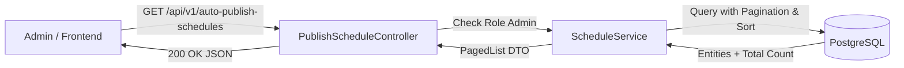
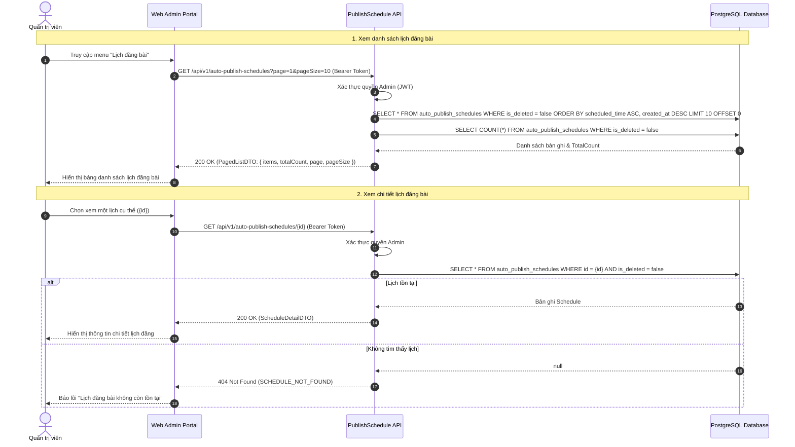
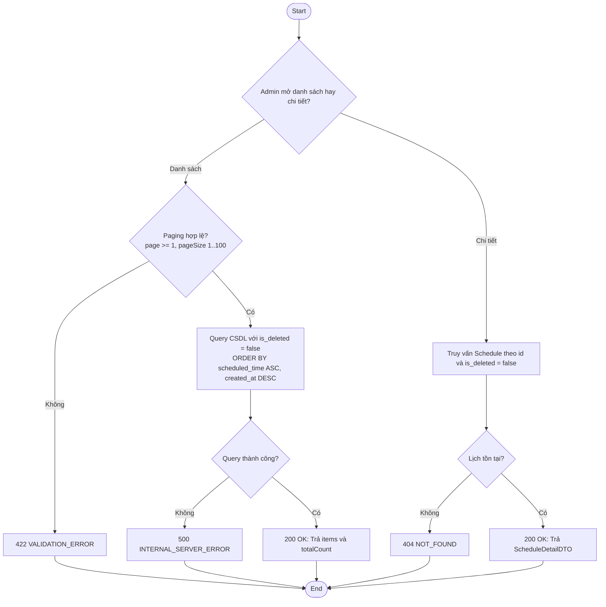
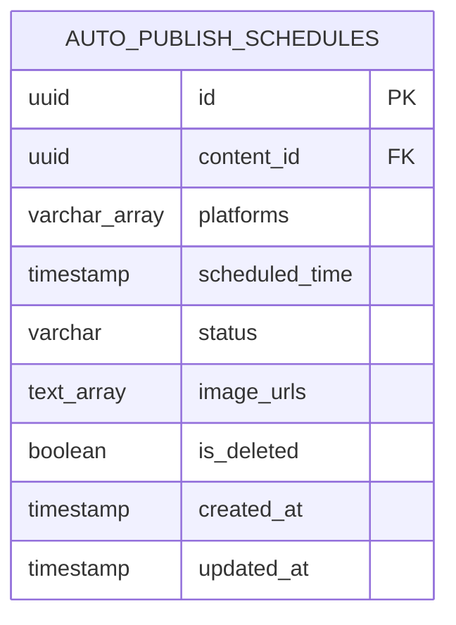

# TDD-014: Xem danh sách và chi tiết lịch đăng bài tự động

## Document Info

- **Feature**: Xem danh sách và chi tiết lịch đăng bài tự động
- **Author**: Hồ Hoàng Nam
- **Reviewer**: Tech Lead
- **Status**: In Review
- **Version**: v0
- **Updated At**: 2026-09-10

## Context & Goals

### Problem

Sau khi các lịch đăng bài được thiết lập cho nhiều nền tảng (Facebook, Instagram, Zalo OA), Quản trị viên cần một màn hình trung tâm để theo dõi lộ trình đăng bài theo thời gian, kiểm tra các lịch sắp chạy và nắm bắt tổng số lượng lịch đã lên kế hoạch.

### Goals

- Cung cấp endpoint lấy danh sách lịch đăng bài theo định dạng bảng, hỗ trợ phân trang (`page`, `pageSize`).
- Sắp xếp mặc định theo thời gian đăng tăng dần (`scheduled_time ASC` theo [BR-007](../BusinessRules/BR-007.md)), các lịch gần nhất trong tương lai xuất hiện trước.
- Khi có nhiều lịch cùng mốc thời gian, áp dụng tiêu chí sắp xếp phụ theo `created_at DESC` để đảm bảo thứ tự hiển thị luôn ổn định ([BR-012](../BusinessRules/BR-012.md)).
- Trả về tổng số lượng lịch chính xác (`totalCount` theo [BR-013](../BusinessRules/BR-013.md)).
- Cung cấp endpoint xem chi tiết đầy đủ thông tin của một lịch đăng bài theo `id`.
- Chuẩn hóa thời gian theo múi giờ hệ thống `Asia/Ho_Chi_Minh` (GMT+7).

### Non-goals

- Không hỗ trợ tìm kiếm toàn văn hay lọc phức tạp theo nội dung trong endpoint này.
- Không thực hiện tạo, sửa hoặc xóa lịch trong chức năng này.
- Không phân loại lịch theo múi giờ khác nhau (tất cả đều chuẩn hóa theo múi giờ Việt Nam).

## Architecture

* Hệ thống nhận yêu cầu xem danh sách hoặc chi tiết lịch đăng bài và xác thực quyền Admin.
* Khi xem danh sách, hệ thống truy vấn bảng `auto_publish_schedules` với điều kiện `is_deleted = false`, sắp xếp `scheduled_time ASC, created_at DESC`, kết hợp phân trang (`Skip/Take`) và đếm `totalCount`.
* Khi xem chi tiết, hệ thống truy vấn đầy đủ thông tin của một lịch theo `id` kèm thông tin tệp ảnh đính kèm và kết quả thực thi (nếu có).



**Notes**:
- Sử dụng `AsNoTracking()` trong EF Core để tối ưu hiệu năng đọc dữ liệu.
- Định dạng mảng `platforms` và `image_urls` được map trực tiếp sang DTO.

## Sequence Diagram

Admin mở danh sách, backend trả các field nhận diện cùng tổng số lượng bản ghi. Khi Admin chọn một dòng, frontend gọi endpoint chi tiết để tải dữ liệu toàn diện.

| Field | Type | Vai trò trong TDD |
| --- | --- | --- |
| `id` | uuid | Khóa chính của lịch đăng bài, dùng cho endpoint chi tiết. |
| `content_id` | uuid | Khóa ngoại trỏ đến bài viết được lên lịch. |
| `platforms` | string[] | Mảng các nền tảng xuất bản (`facebook`, `instagram`, `zalo`). |
| `scheduled_time` | timestamp | Thời điểm hẹn giờ xuất bản (tiêu chí sắp xếp chính ASC). |
| `status` | string | Trạng thái của lịch (`Scheduled`, `Publishing`, `Published`, `Failed`, `Cancelled`). |
| `created_at` | timestamp | Thời điểm tạo lịch (tiêu chí sắp xếp phụ DESC). |



## Activity Diagram



## Data Model



**Notes**:
- `scheduled_time ASC` là tiêu chí sắp xếp chính; `created_at DESC` là tiêu chí sắp xếp phụ.
- Chỉ truy vấn các bản ghi có `is_deleted = false`.

## Internal API

### Endpoints

- **GET** `/api/v1/auto-publish-schedules` — Lấy danh sách lịch đăng bài có phân trang (Admin).
- **GET** `/api/v1/auto-publish-schedules/{id:guid}` — Lấy chi tiết một lịch đăng bài (Admin).

### Examples

#### GET /api/v1/auto-publish-schedules

##### 1. Lấy danh sách lịch thành công (200 OK)

**Request**:
```http
GET /api/v1/auto-publish-schedules?page=1&pageSize=10&status=Scheduled
Authorization: Bearer <Admin_Token>
```

**Response 200**:
```json
{
  "value": {
    "items": [
      {
        "id": "e442759f-ff0a-4427-b4c5-978afccd69fd",
        "contentTitle": "Bộ sưu tập hoa mùa thu 2026",
        "platforms": [
          "facebook",
          "instagram"
        ],
        "scheduledTime": "2026-09-10T09:30:00Z",
        "status": "Scheduled",
        "imageCount": 2,
        "createdAt": "2026-09-09T08:00:00Z"
      },
      {
        "id": "f882759f-aa0a-4427-b4c5-978afccd6900",
        "contentTitle": "Khuyến mãi chào mừng ngày Phụ nữ Việt Nam",
        "platforms": [
          "facebook",
          "zalo"
        ],
        "scheduledTime": "2026-09-12T15:00:00Z",
        "status": "Scheduled",
        "imageCount": 1,
        "createdAt": "2026-09-09T09:00:00Z"
      }
    ],
    "totalCount": 2,
    "page": 1,
    "pageSize": 10,
    "totalPages": 1
  },
  "isSuccess": true,
  "isFailed": false,
  "error": null,
  "traceId": "0HNOE4G1GRT77:00000001",
  "timestampUtc": "2026-09-09T11:15:00.1234567Z"
}
```

##### 2. Danh sách lịch rỗng (200 OK)

**Request**:
```http
GET /api/v1/auto-publish-schedules?page=1&pageSize=10&status=Failed
Authorization: Bearer <Admin_Token>
```

**Response 200**:
```json
{
  "value": {
    "items": [],
    "totalCount": 0,
    "page": 1,
    "pageSize": 10,
    "totalPages": 0
  },
  "isSuccess": true,
  "isFailed": false,
  "error": null,
  "traceId": "0HNOE4G1GRT77:00000002",
  "timestampUtc": "2026-09-09T11:15:10.0000000Z"
}
```

##### 3. Tham số phân trang không hợp lệ (422 Unprocessable Entity)

**Request**:
```http
GET /api/v1/auto-publish-schedules?page=0&pageSize=10
Authorization: Bearer <Admin_Token>
```

**Response 422 (Error)**:
```json
{
  "title": "Unprocessable Entity",
  "status": 422,
  "detail": "Tham số phân trang không hợp lệ.",
  "messageCode": "PAGING_INVALID",
  "errors": [
    {
      "field": "page",
      "message": "Trang phải lớn hơn hoặc bằng 1."
    }
  ],
  "traceId": "0HNOE4G1GRT77:00000005",
  "timestampUtc": "2026-09-09T11:15:15.0000000Z"
}
```

#### GET /api/v1/auto-publish-schedules/{id:guid}

##### 1. Xem chi tiết lịch đăng bài thành công (200 OK)

**Request**:
```http
GET /api/v1/auto-publish-schedules/e442759f-ff0a-4427-b4c5-978afccd69fd
Authorization: Bearer <Admin_Token>
```

**Response 200**:
```json
{
  "value": {
    "id": "e442759f-ff0a-4427-b4c5-978afccd69fd",
    "contentId": "7d9b4b61-22b4-4896-bf1d-0fdbae881a28",
    "contentBody": "Mùa thu sang mang theo hương sắc nồng nàn của những đóa hồng cổ Đà Lạt...",
    "platforms": [
      "facebook",
      "instagram"
    ],
    "scheduledTime": "2026-09-10T09:30:00Z",
    "status": "Scheduled",
    "imageUrls": [
      "https://cdn.hoatheomua.vn/images/autumn-rose-01.jpg",
      "https://cdn.hoatheomua.vn/images/autumn-rose-02.jpg"
    ],
    "executionResult": null,
    "createdAt": "2026-09-09T08:00:00Z",
    "updatedAt": "2026-09-09T10:00:00Z"
  },
  "isSuccess": true,
  "isFailed": false,
  "error": null,
  "traceId": "0HNOE4G1GRT77:00000003",
  "timestampUtc": "2026-09-09T11:15:20.0000000Z"
}
```

##### 2. Không tìm thấy lịch đăng bài (404 Not Found)

**Request**:
```http
GET /api/v1/auto-publish-schedules/00000000-0000-0000-0000-000000000000
Authorization: Bearer <Admin_Token>
```

**Response 404 (Error)**:
```json
{
  "title": "Not Found",
  "status": 404,
  "detail": "Lịch đăng bài không còn tồn tại",
  "messageCode": "SCHEDULE_NOT_FOUND",
  "errors": null,
  "traceId": "0HNOE4G1GRT77:00000004",
  "timestampUtc": "2026-09-09T11:15:30.0000000Z"
}
```

### Error Codes

| Code | HTTP | Khi nào xảy ra |
| --- | --- | --- |
| `SCHEDULE_NOT_FOUND` | 404 | Lịch đăng bài theo `id` không tồn tại trong CSDL hoặc đã bị xóa mềm. |
| `PAGING_INVALID` | 422 | Tham số `page` < 1 hoặc `pageSize` nằm ngoài khoảng 1 - 100. |
| `INTERNAL_SERVER_ERROR` | 500 | Lỗi kết nối CSDL, timeout truy vấn hoặc sự cố máy chủ nội bộ. |

## References

### User Stories

- [STORY-014: Xem lịch đăng bài tự động](../UserStory/14-ViewAutoPublishSchedules.md)

### Business Rules

- [BR-007: Thứ tự sắp xếp theo thời gian đăng tăng dần](../BusinessRules/BR-007.md)
- [BR-012: Sắp xếp phụ khi trùng thời gian đăng](../BusinessRules/BR-012.md)
- [BR-013: Khớp tổng số lượng lịch chính xác](../BusinessRules/BR-013.md)
- [BR-014: Toàn vẹn dữ liệu khi tải danh sách](../BusinessRules/BR-014.md)

### Use Cases

### Others

- `HoaTheoMua.Repository.Enum.PlatformType` (`Zalo = 0`, `Facebook = 1`, `Instagram = 2`).

## Change Log
