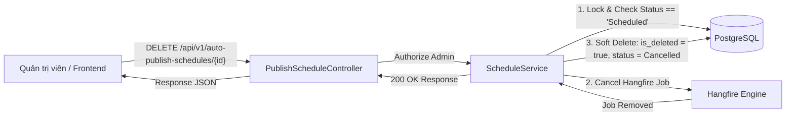
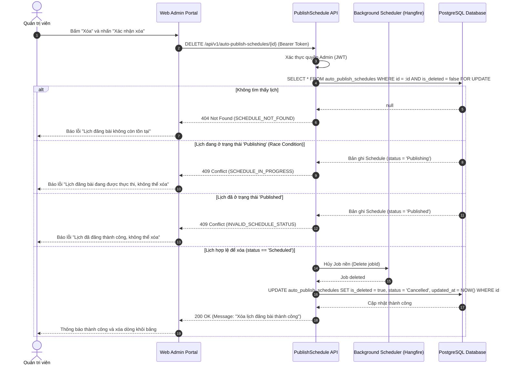
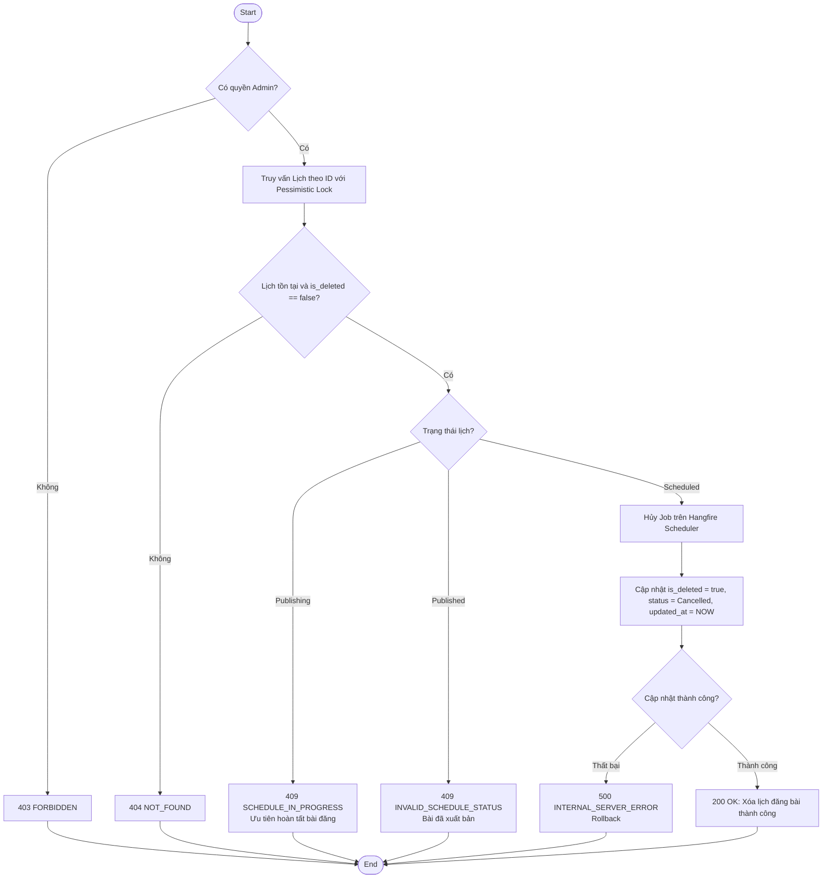
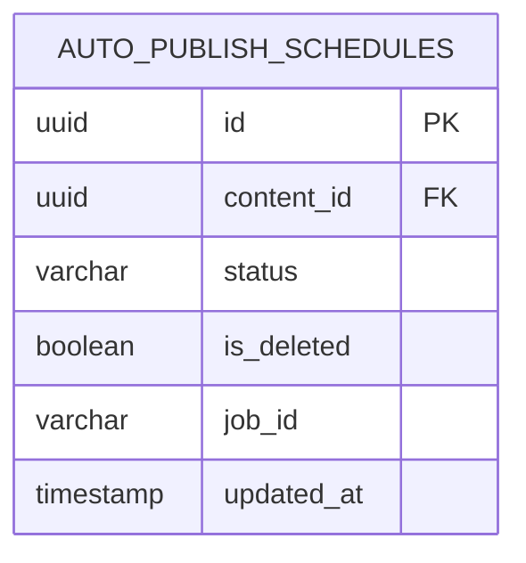

# TDD-015: Xóa lịch đăng bài tự động

## Document Info

- **Feature**: Xóa lịch đăng bài tự động & Hủy Cron Job
- **Author**: Hồ Hoàng Nam
- **Reviewer**: Tech Lead
- **Status**: In Review
- **Version**: v0
- **Updated At**: 2026-09-10

## Context & Goals

### Problem

Khi kế hoạch truyền thông thay đổi hoặc một bài viết không còn phù hợp để xuất bản, Quản trị viên cần hủy lịch đăng bài đã lên nhằm ngăn chặn hệ thống tự động đẩy bài lên mạng xã hội. Thao tác xóa phải đồng thời hủy tác vụ nền (Background Worker / Cron Job) đang chờ thực thi, đồng thời phải xử lý an toàn các tình huống xung đột đồng thời (Race Condition) nếu lịch được bấm xóa đúng lúc Job đang chạy.

### Goals

- Cung cấp endpoint cho phép Quản trị viên xóa một lịch đăng bài theo `id`.
- Kiểm tra điều kiện trạng thái hợp lệ trước khi xóa ([BR-010](../BusinessRules/BR-010.md)): Chỉ được phép xóa khi lịch ở trạng thái **"Đã lên lịch"** (`Scheduled`) và Job chưa bắt đầu chạy.
- Từ chối xóa khi lịch đang ở trạng thái **"Đang xử lý"** (`Publishing`) hoặc **"Đăng thành công"** (`Published`).
- Giải quyết xung đột Race Condition: Nếu Job đã nhận việc và đang gọi API mạng xã hội, hệ thống từ chối lệnh xóa và ưu tiên để bài viết được xuất bản hoàn tất.
- Hủy bỏ tác vụ nền tương ứng trên Hangfire Scheduler ([BR-011](../BusinessRules/BR-011.md)).
- Áp dụng cơ chế xóa mềm (Soft Delete: `is_deleted = true`, `status = Cancelled`) để bảo toàn dữ liệu kiểm toán.

### Non-goals

- Không hỗ trợ xóa các bài viết đã xuất bản thành công trên các nền tảng mạng xã hội bên thứ ba (Facebook, Instagram, Zalo OA).
- Không hoàn lại quota hoặc chỉnh sửa content bài viết gốc khi xóa lịch.

## Architecture

* Hệ thống nhận yêu cầu xóa lịch từ Admin Frontend kèm xác thực quyền Admin.
* `ScheduleService` sử dụng khóa mức bản ghi (`SELECT ... FOR UPDATE`) để đọc và kiểm tra trạng thái lịch hiện tại.
* Nếu `status != 'Scheduled'`, hệ thống từ chối với mã lỗi `409 Conflict`.
* Nếu hợp lệ, hệ thống gọi dịch vụ Hangfire để hủy bỏ tác vụ ngầm đang chờ theo `job_id`.
* Cập nhật bản ghi sang `is_deleted = true`, `status = 'Cancelled'`, `updated_at = NOW()` trong cùng một Transaction.



**Notes**:
- Sử dụng Pessimistic Lock để loại bỏ hoàn toàn race condition giữa lệnh DELETE của Admin và worker Hangfire đang kích hoạt.
- Dữ liệu không bị xóa vật lý (Hard Delete) khỏi database để phục vụ tra cứu nhật ký lịch sử.

## Sequence Diagram

Quản trị viên gửi lệnh xóa lịch đăng bài. Hệ thống kiểm tra quyền, khóa bản ghi kiểm tra trạng thái, hủy Job nền và cập nhật cờ xóa mềm.

| Field | Type | Vai trò trong TDD |
| --- | --- | --- |
| `id` | uuid | Khóa chính của lịch cần xóa, truyền trên URL. |
| `status` | string | Trạng thái hiện tại; chỉ cho phép xóa khi là `Scheduled`. Chuyển thành `Cancelled` sau khi xóa. |
| `is_deleted` | boolean | Cờ xóa mềm; chuyển từ `false` sang `true`. |
| `job_id` | string | Mã Job Hangfire nền cần thu hồi lệnh chạy. |
| `updated_at` | timestamp | Ghi nhận thời điểm xóa lịch. |



## Activity Diagram



## Data Model



**Notes**:
- `status`: Chuyển từ `Scheduled` sang `Cancelled`.
- `is_deleted`: Chuyển từ `false` sang `true`.

## Internal API

### Endpoints

- **DELETE** `/api/v1/auto-publish-schedules/{id:guid}` — Hủy lịch đăng bài và xóa tác vụ nền tương ứng (Admin).

### Examples

#### DELETE /api/v1/auto-publish-schedules/{id:guid}

##### 1. Hủy và xóa lịch thành công (200 OK)

**Request**:
```http
DELETE /api/v1/auto-publish-schedules/e442759f-ff0a-4427-b4c5-978afccd69fd
Authorization: Bearer <Admin_Token>
```

**Response 200**:
```json
{
  "value": {
    "id": "e442759f-ff0a-4427-b4c5-978afccd69fd",
    "status": "Cancelled",
    "isDeleted": true,
    "message": "Xóa lịch đăng bài thành công."
  },
  "isSuccess": true,
  "isFailed": false,
  "error": null,
  "traceId": "0HNOE4G1GRT66:00000001",
  "timestampUtc": "2026-09-09T11:30:00.1234567Z"
}
```

##### 2. Lịch đang thực thi không thể xóa (409 Conflict)

**Request**:
```http
DELETE /api/v1/auto-publish-schedules/e442759f-ff0a-4427-b4c5-978afccd69fd
Authorization: Bearer <Admin_Token>
```

**Response 409 (Error)**:
```json
{
  "title": "Conflict",
  "status": 409,
  "detail": "Lịch đăng bài đang được thực thi, không thể xóa.",
  "messageCode": "SCHEDULE_IN_PROGRESS",
  "errors": {
    "currentStatus": "Publishing"
  },
  "traceId": "0HNOE4G1GRT66:00000002",
  "timestampUtc": "2026-09-09T11:30:10.0000000Z"
}
```

##### 3. Lịch đăng bài không còn tồn tại (404 Not Found)

**Request**:
```http
DELETE /api/v1/auto-publish-schedules/00000000-0000-0000-0000-000000000000
Authorization: Bearer <Admin_Token>
```

**Response 404 (Error)**:
```json
{
  "title": "Not Found",
  "status": 404,
  "detail": "Lịch đăng bài không còn tồn tại.",
  "messageCode": "SCHEDULE_NOT_FOUND",
  "errors": null,
  "traceId": "0HNOE4G1GRT66:00000004",
  "timestampUtc": "2026-09-09T11:30:30.0000000Z"
}
```

### Error Codes

| Code | HTTP | Khi nào xảy ra |
| --- | --- | --- |
| `SCHEDULE_NOT_FOUND` | 404 | Lịch theo `id` không tồn tại trong CSDL hoặc đã bị xóa mềm từ trước. |
| `SCHEDULE_IN_PROGRESS` | 409 | Tác vụ nền đang kích hoạt đăng bài (`Publishing`), ưu tiên giữ tiến trình đăng bài (BR-010). |
| `INVALID_SCHEDULE_STATUS` | 409 | Lịch không ở trạng thái `Scheduled` (đã ở trạng thái `Published` hoặc `Cancelled`) (BR-010). |
| `INTERNAL_SERVER_ERROR` | 500 | Lỗi kết nối CSDL, lỗi hủy Job Hangfire hoặc sự cố máy chủ nội bộ. |

## References

### User Stories

- [STORY-015: Xóa lịch đăng bài tự động](../UserStory/15-DeleteAutoPublishSchedule.md)

### Business Rules

- [BR-010: Trạng thái hợp lệ để xóa lịch đăng](../BusinessRules/BR-010.md)
- [BR-011: Xóa lệnh Cron Job khi xóa lịch đăng](../BusinessRules/BR-011.md)

### Use Cases

### Others

- `HoaTheoMua.Repository.Enum.PlatformType` (`Zalo = 0`, `Facebook = 1`, `Instagram = 2`).

## Change Log
