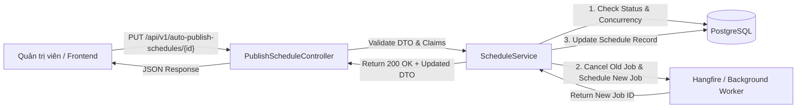
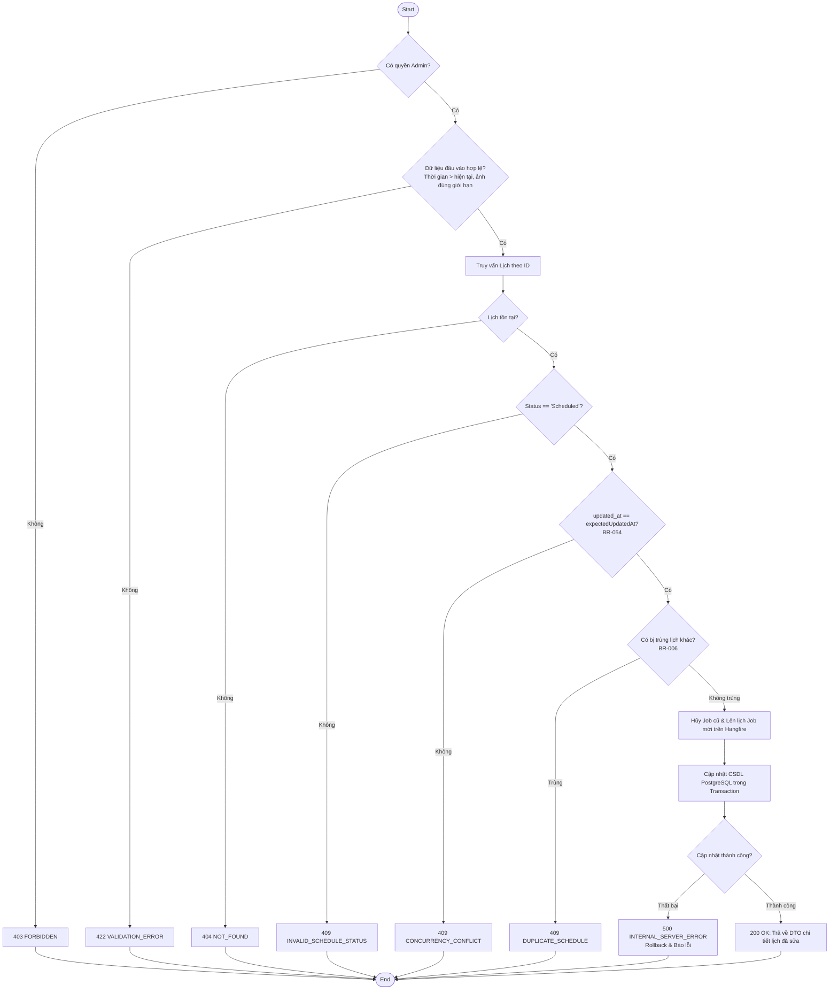
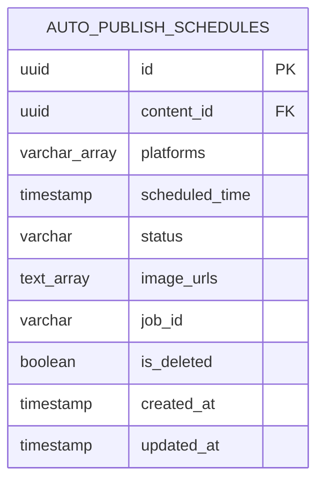

# TDD-016: Sửa lịch đăng bài tự động

## Document Info

- **Feature**: Sửa lịch đăng bài tự động
- **Author**: Hồ Hoàng Nam
- **Reviewer**: Tech Lead
- **Status**: In Review
- **Version**: v0
- **Updated At**: 2026-09-10

## Context & Goals

### Problem

Trong quá trình vận hành truyền thông số, thông tin của một lịch đăng bài đã lên (thời gian đăng, nội dung content, hình ảnh hoặc danh sách nền tảng) có thể cần điều chỉnh để phù hợp với kế hoạch thực tế. Quản trị viên cần cập nhật trực tiếp lịch hiện có mà không phải xóa đi và tạo lại từ đầu, đồng thời hệ thống phải tự động điều phối lại tác vụ nền (Background Worker / Cron Job) tương ứng.

### Goals

- Cho phép Admin cập nhật các trường thông tin của lịch: Content đã lưu, danh sách Nền tảng, Ngày và Giờ đăng, Hình ảnh đính kèm.
- Kiểm tra trạng thái hợp lệ trước khi sửa: Chỉ cho phép sửa khi lịch đang ở trạng thái **"Đã lên lịch"** (`Scheduled`), tuyệt đối chặn khi đang thực thi (`Publishing`) hoặc đã xuất bản (`Published`).
- Kiểm tra dữ liệu sau sửa tiếp tục đáp ứng toàn bộ điều kiện tạo lịch: Content và Media tồn tại, ảnh hợp lệ, nền tảng đang kết nối, thời gian đăng lớn hơn hiện tại ([BR-053](../BusinessRules/BR-053.md)).
- Cơ chế chống trùng lịch ([BR-006](../BusinessRules/BR-006.md)): Không cho phép cập nhật dẫn đến trùng Content, Nền tảng và Thời điểm đăng với lịch khác.
- Tái lập lịch cho Background Worker (Hangfire Scheduler): Hủy Job cũ và tạo Job mới với thời điểm kích hoạt chính xác.
- Cập nhật trường `updated_at` theo thời gian UTC hiện tại.
- Chặn ghi đè nếu `updated_at` khác giá trị Admin đã tải hoặc trạng thái không còn cho phép sửa ([BR-054](../BusinessRules/BR-054.md)).

### Non-goals

- Không chỉnh sửa các bài viết đã xuất bản thành công trên mạng xã hội bên thứ ba (Facebook, Instagram, Zalo OA).
- Không tự động đăng bài ngay lập tức khi Admin nhấn Lưu (nếu muốn đăng ngay, người dùng sử dụng tính năng Đăng ngay).
- Không tự động tạo lại các biến thể ảnh trong chức năng này.

## Architecture

* Hệ thống nhận yêu cầu cập nhật lịch từ Admin Frontend và kiểm tra tính hợp lệ của dữ liệu đầu vào.
* `ScheduleService` kiểm tra bản ghi tồn tại, trạng thái (`status == 'Scheduled'`) và `expectedUpdatedAt` để phát hiện xung đột ghi đè đồng thời.
* Kiểm tra chống trùng lặp lịch đăng và đảm bảo thời gian đăng mới phải diễn ra trong tương lai.
* Hủy Job nền cũ trên Hangfire và đăng ký Job thực thi mới theo giờ hẹn mới.
* Cập nhật bản ghi trong cơ sở dữ liệu PostgreSQL trong cùng một Transaction.



**Notes**:
- Sử dụng Optimistic Locking dựa trên `updated_at` (`expectedUpdatedAt`) để chống xung đột ghi đè giữa các Admin theo BR-054.
- Job nền cũ chỉ bị hủy sau khi Job mới được đăng ký và bản ghi CSDL được cập nhật thành công.

## Sequence Diagram

Quản trị viên chỉnh sửa nội dung/thời gian và bấm Lưu. Hệ thống kiểm tra hợp lệ, chống trùng lịch, tái lập lịch ngầm và lưu CSDL.

| Field | Type | Vai trò trong TDD |
| --- | --- | --- |
| `id` | uuid | Khóa chính của lịch cần sửa, truyền trên URL. |
| `contentId` | uuid | Khóa ngoại bài viết cần đăng. |
| `platforms` | string[] | Mảng các nền tảng (`facebook`, `instagram`, `zalo`). |
| `scheduledTime` | timestamp | Mốc thời gian hẹn đăng mới (phải lớn hơn hiện tại). |
| `imageUrls` | string[] | Mảng URL ảnh đính kèm mới (tối đa 10 ảnh, $\le$ 10MB/ảnh). |
| `expectedUpdatedAt` | timestamp | Dấu mốc thời gian tải dữ liệu để kiểm soát xung đột đồng thời. |

```mermaid
sequenceDiagram
    autonumber
    actor Admin as Quản trị viên
    participant FE as Web Admin (Frontend)
    participant BE as PublishSchedule API
    participant SCHED as Background Scheduler (Hangfire)
    participant DB as PostgreSQL Database

    Admin->>FE: Chỉnh sửa thông tin lịch và bấm "Lưu"
    FE->>BE: PUT /api/v1/auto-publish-schedules/{id} (Bearer Token, Payload + expectedUpdatedAt)
    BE->>BE: Xác thực quyền Admin (JWT)
    BE->>BE: Validate dữ liệu đầu vào (Thời gian > hiện tại, ảnh đúng quy chuẩn)
    alt Dữ liệu đầu vào không hợp lệ
        BE-->>FE: 422 Unprocessable Entity (VALIDATION_ERROR)
        FE-->>Admin: Hiển thị lỗi tương ứng trên form
    else Dữ liệu đầu vào hợp lệ
        BE->>DB: SELECT * FROM auto_publish_schedules WHERE id = :id AND is_deleted = false
        alt Không tìm thấy lịch
            DB-->>BE: null
            BE-->>FE: 404 Not Found (SCHEDULE_NOT_FOUND)
            FE-->>Admin: Báo lỗi "Lịch đăng bài không còn tồn tại"
        else Lịch tồn tại nhưng status != 'Scheduled'
            DB-->>BE: Bản ghi Schedule (status = 'Publishing' hoặc 'Published')
            BE-->>FE: 409 Conflict (INVALID_SCHEDULE_STATUS)
            FE-->>Admin: Báo lỗi "Lịch đang thực thi hoặc đã đăng thành công, không thể sửa"
        else Lịch đã thay đổi từ lần tải gần nhất
            DB-->>BE: updated_at != expectedUpdatedAt
            BE-->>FE: 409 Conflict (CONCURRENCY_CONFLICT)
            FE-->>Admin: Yêu cầu tải lại dữ liệu mới nhất
        else Lịch hợp lệ để sửa
            BE->>DB: Kiểm tra trùng lịch (BR-006)
            alt Trùng lịch khác đang có
                BE-->>FE: 409 Conflict (DUPLICATE_SCHEDULE)
                FE-->>Admin: Báo lỗi trùng lịch và thời điểm
            else Không trùng lịch
                BE->>SCHED: Tạo Job mới theo scheduled_time mới
                SCHED-->>BE: new_job_id
                BE->>DB: UPDATE auto_publish_schedules SET content_id = :contentId, platforms = :platforms, scheduled_time = :scheduledTime, image_urls = :imageUrls, job_id = :new_job_id, updated_at = NOW() WHERE id = :id AND status = 'Scheduled' AND updated_at = :expectedUpdatedAt
                alt Không cập nhật được đúng 1 bản ghi
                    BE->>SCHED: Xóa new_job_id
                    BE-->>FE: 409 Conflict (CONCURRENCY_CONFLICT)
                else Cập nhật thành công
                    BE->>SCHED: Hủy job_id cũ
                    BE-->>FE: 200 OK (ScheduleDetailDTO)
                    FE-->>Admin: Thông báo "Cập nhật lịch đăng bài thành công"
                end
            end
        end
    end
```



## Activity Diagram



## Data Model



**Notes**:
- Cập nhật `updated_at = NOW()` và `job_id = new_job_id`.
- `status` giữ nguyên `Scheduled`.

## Internal API

### Endpoints

- **PUT** `/api/v1/auto-publish-schedules/{id:guid}` — Cập nhật thông tin lịch đăng bài tự động (Admin).

### Examples

#### PUT /api/v1/auto-publish-schedules/{id:guid}

##### 1. Cập nhật lịch đăng bài thành công (200 OK)

**Request**:
```http
PUT /api/v1/auto-publish-schedules/e442759f-ff0a-4427-b4c5-978afccd69fd
Authorization: Bearer <Admin_Token>
Content-Type: application/json

{
  "contentId": "7d9b4b61-22b4-4896-bf1d-0fdbae881a28",
  "platforms": [
    "facebook",
    "instagram"
  ],
  "scheduledTime": "2026-09-10T09:30:00Z",
  "imageUrls": [
    "https://cdn.hoatheomua.vn/images/autumn-rose-01.jpg",
    "https://cdn.hoatheomua.vn/images/autumn-rose-02.jpg"
  ],
  "expectedUpdatedAt": "2026-09-09T10:30:00Z"
}
```

**Response 200**:
```json
{
  "value": {
    "id": "e442759f-ff0a-4427-b4c5-978afccd69fd",
    "contentId": "7d9b4b61-22b4-4896-bf1d-0fdbae881a28",
    "platforms": [
      "facebook",
      "instagram"
    ],
    "scheduledTime": "2026-09-10T09:30:00Z",
    "status": "Scheduled",
    "imageUrls": [
      "https://cdn.hoatheomua.vn/images/autumn-rose-01.jpg",
      "https://cdn.hoatheomua.vn/images/autumn-rose-02.jpg"
    ],
    "updatedAt": "2026-09-09T10:45:00Z"
  },
  "isSuccess": true,
  "isFailed": false,
  "error": null,
  "traceId": "0HNOE4G1GRT99:00000001",
  "timestampUtc": "2026-09-09T10:45:00.1234567Z"
}
```

##### 2. Xung đột phiên bản khi lưu (409 Conflict)

**Request**:
```http
PUT /api/v1/auto-publish-schedules/e442759f-ff0a-4427-b4c5-978afccd69fd
Authorization: Bearer <Admin_Token>
Content-Type: application/json

{
  "contentId": "7d9b4b61-22b4-4896-bf1d-0fdbae881a28",
  "platforms": [
    "facebook"
  ],
  "scheduledTime": "2026-09-10T09:30:00Z",
  "imageUrls": [],
  "expectedUpdatedAt": "2026-09-09T10:00:00Z"
}
```

**Response 409 (Error)**:
```json
{
  "title": "Conflict",
  "status": 409,
  "detail": "Lịch đăng bài đã được cập nhật bởi quản trị viên khác. Vui lòng tải lại dữ liệu mới nhất.",
  "messageCode": "CONCURRENCY_CONFLICT",
  "errors": null,
  "traceId": "0HNOE4G1GRT99:00000005",
  "timestampUtc": "2026-09-09T10:45:25.0000000Z"
}
```

##### 3. Thời gian đăng bài không hợp lệ (422 Unprocessable Entity)

**Request**:
```http
PUT /api/v1/auto-publish-schedules/e442759f-ff0a-4427-b4c5-978afccd69fd
Authorization: Bearer <Admin_Token>
Content-Type: application/json

{
  "contentId": "7d9b4b61-22b4-4896-bf1d-0fdbae881a28",
  "platforms": [
    "facebook"
  ],
  "scheduledTime": "2026-09-01T08:00:00Z",
  "imageUrls": [],
  "expectedUpdatedAt": "2026-09-09T10:30:00Z"
}
```

**Response 422 (Error)**:
```json
{
  "title": "Unprocessable Entity",
  "status": 422,
  "detail": "Thời gian đăng bài phải lớn hơn thời điểm hiện tại.",
  "messageCode": "SCHEDULE_TIME_INVALID",
  "errors": [
    {
      "field": "scheduledTime",
      "message": "Thời gian đăng bài không hợp lệ."
    }
  ],
  "traceId": "0HNOE4G1GRT99:00000004",
  "timestampUtc": "2026-09-09T10:45:30.0000000Z"
}
```

### Error Codes

| Code | HTTP | Khi nào xảy ra |
| --- | --- | --- |
| `SCHEDULE_NOT_FOUND` | 404 | Lịch đăng bài theo ID không tồn tại trong CSDL hoặc đã bị xóa mềm. |
| `INVALID_SCHEDULE_STATUS` | 409 | Lịch không ở trạng thái `Scheduled` (đang chạy `Publishing` hoặc đã `Published`) (BR-008). |
| `DUPLICATE_SCHEDULE` | 409 | Bị trùng đồng thời Content, Nền tảng và Thời điểm đăng với lịch khác đang chờ (BR-006). |
| `CONCURRENCY_CONFLICT` | 409 | Lịch đã thay đổi hoặc không còn được phép sửa kể từ lần tải gần nhất (BR-054). |
| `SCHEDULE_TIME_INVALID` | 422 | Thời gian đăng nhỏ hơn hoặc bằng hiện tại (BR-053). |
| `CONTENT_NOT_FOUND` | 422 | `contentId` không tồn tại trong hệ thống hoặc đã bị xóa mềm. |
| `PLATFORM_NOT_CONNECTED` | 422 | Nền tảng được chọn chưa được cấu hình hoặc mất kết nối xác thực API. |
| `MEDIA_LIMIT_EXCEEDED` | 422 | Ảnh sai định dạng, vượt quá 10 ảnh hoặc vượt 10MB/ảnh (BR-053). |
| `INTERNAL_SERVER_ERROR` | 500 | Lỗi kết nối CSDL, lỗi giao tiếp Hangfire Scheduler hoặc sự cố máy chủ nội bộ. |

## References

### User Stories

- [STORY-016: Sửa lịch đăng bài tự động](../UserStory/16-UpdateAutoPublishSchedule.md)

### Business Rules

- [BR-006: Kiểm tra trùng lịch đăng bài](../BusinessRules/BR-006.md)
- [BR-008: Trạng thái hợp lệ để chỉnh sửa lịch đăng](../BusinessRules/BR-008.md)
- [BR-009: Cập nhật dữ liệu khi sửa lịch đăng](../BusinessRules/BR-009.md)
- [BR-053: Dữ liệu hợp lệ khi sửa lịch đăng](../BusinessRules/BR-053.md)
- [BR-054: Không ghi đè lịch đã thay đổi trong lúc sửa](../BusinessRules/BR-054.md)

### Use Cases

### Others

- `HoaTheoMua.Repository.Enum.PlatformType` (`Zalo = 0`, `Facebook = 1`, `Instagram = 2`).

## Change Log
