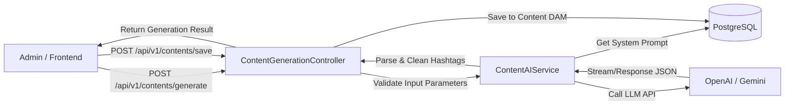
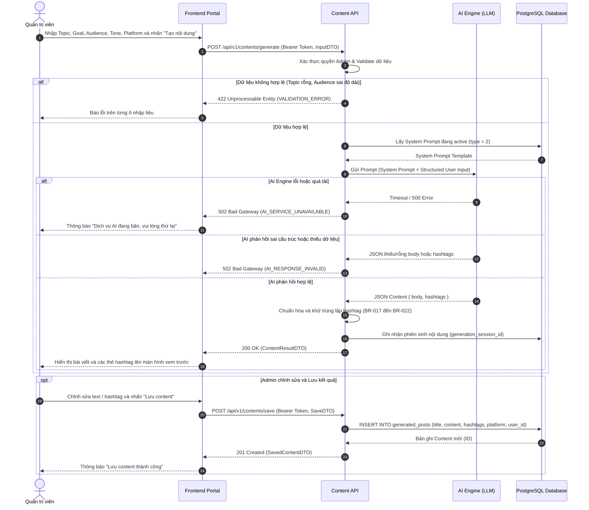
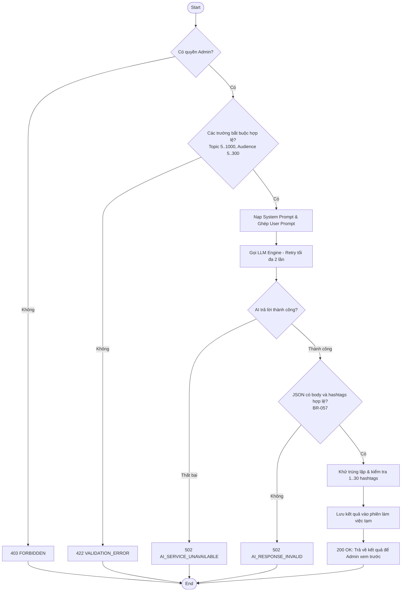
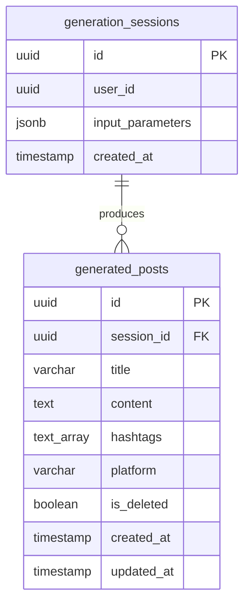

# TDD-017: Tự động viết content và hashtag bằng AI

## Document Info

- **Feature**: Tự động viết content và hashtag bằng AI
- **Author**: Hồ Hoàng Nam
- **Reviewer**: Tech Lead
- **Status**: In Review
- **Version**: v0
- **Updated At**: 2026-09-10

## Context & Goals

### Problem

Quản trị viên cần tạo nhiều nội dung truyền thông cho các chiến dịch bán hoa tươi (mùa lễ, dịp đặc biệt, bộ sưu tập mới) nhưng việc tự viết thủ công tốn nhiều thời gian, khó duy trì văn phong đồng nhất và dễ cạn kiệt ý tưởng hashtag tối ưu SEO mạng xã hội.

### Goals

- Sử dụng mô hình AI (OpenAI GPT-4o / Gemini Pro) để tự động sinh bài viết và bộ hashtag tương thích từ các dữ liệu định hướng của Admin:
  - Chủ đề (Topic): Bắt buộc, 5 - 1.000 ký tự ([BR-015](../BusinessRules/BR-015.md)).
  - Mục tiêu (Goal): Bắt buộc chọn 1 trong các mục tiêu mẫu hoặc nhập mô tả nếu chọn "Khác" ([BR-055](../BusinessRules/BR-055.md)).
  - Đối tượng (Audience): Bắt buộc, 5 - 300 ký tự ([BR-016](../BusinessRules/BR-016.md)).
  - Nền tảng (Platform): Bắt buộc chọn đúng 1 nền tảng ([BR-056](../BusinessRules/BR-056.md)).
  - Giọng văn (Tone): Bắt buộc chọn 1 trong các giọng văn mẫu hoặc nhập mô tả ([BR-055](../BusinessRules/BR-055.md)).
- Chuẩn hóa bộ hashtag đầu ra: Từ 1 đến 30 thẻ ([BR-017](../BusinessRules/BR-017.md)), bắt đầu bằng `#` ([BR-018](../BusinessRules/BR-018.md)), không chứa khoảng trắng ([BR-019](../BusinessRules/BR-019.md)), độ dài 2-50 ký tự ([BR-020](../BusinessRules/BR-020.md)), chỉ chứa chữ/số/gạch dưới ([BR-021](../BusinessRules/BR-021.md)), tự động khử trùng lặp ([BR-022](../BusinessRules/BR-022.md)).
- Quản lý phiên sinh nội dung (Generation Session): Cho phép Admin xem, chỉnh sửa nội dung/hashtag hoặc bấm "Tạo lại" nhiều lần trong cùng phiên làm việc.
- Lưu toàn vẹn nội dung và hashtag được chọn vào kho Content đã lưu trong một transaction ([BR-058](../BusinessRules/BR-058.md)).

### Non-goals

- Không hỗ trợ sinh đồng thời nhiều nền tảng khác nhau trong 1 lần gọi (thuộc phạm vi STORY-024).
- Không tạo ảnh hoặc lập lịch đăng bài tự động trong API này.

## Architecture

* Hệ thống tiếp nhận yêu cầu sinh nội dung từ Admin Frontend và xác thực quyền Admin.
* `ContentAIService` nạp System Prompt loại `post` (`type = 2`) từ bảng `system_prompts`, kết hợp các tham số đầu vào tạo thành User Prompt gửi đến LLM Engine.
* Parse kết quả JSON trả về; kiểm tra tính toàn vẹn (bắt buộc có body và hashtags hợp lệ theo BR-057).
* Khử trùng lặp và chuẩn hóa danh sách hashtag; lưu phiên tạm thời và trả kết quả xem trước cho Admin.
* Khi Admin nhấn Lưu, `ContentLibraryService` lưu bản ghi chính thức vào bảng `generated_posts`.



**Notes**:
- System Prompt được lấy từ bảng `system_prompts` với `type = Post` (giá trị enum `2`).
- Retry tối đa 2 lần khi gặp sự cố mạng hoặc timeout với nhà cung cấp LLM.

## Sequence Diagram

Admin nhập thông số tạo nội dung. Hệ thống nạp Prompt, gọi AI, làm sạch hashtag và cho phép Admin lưu lại.

| Field | Type | Vai trò trong TDD |
| --- | --- | --- |
| `topic` | string | Chủ đề bài viết (5 - 1.000 ký tự). |
| `goal` | string | Mục tiêu truyền thông (Kêu gọi tương tác, Giới thiệu sản phẩm, Khuyến mãi...). |
| `audience` | string | Khách hàng mục tiêu (5 - 300 ký tự). |
| `platform` | string | Nền tảng xuất bản duy nhất (`facebook`, `instagram`, `zalo`). |
| `tone` | string | Giọng văn truyền tải (Lãng mạn, Chuyên nghiệp, Tươi vui...). |
| `notes` | string | Ghi chú bổ sung (tùy chọn). |



## Activity Diagram



## Data Model



**Notes**:
- `platform`: `facebook`, `instagram`, `zalo`.
- `content`: Độ dài từ 1 đến 10.000 ký tự.
- `hashtags`: Mảng từ 1 đến 30 thẻ đã chuẩn hóa.

## Internal API

### Endpoints

- **POST** `/api/v1/contents/generate` — Gọi AI sinh bài viết và bộ hashtag (Admin).
- **POST** `/api/v1/contents/save` — Lưu nội dung đã chọn vào Kho bài viết (Admin).

### Examples

#### POST /api/v1/contents/generate

##### 1. Sinh nội dung thành công (200 OK)

**Request**:
```http
POST /api/v1/contents/generate
Authorization: Bearer <Admin_Token>
Content-Type: application/json

{
  "topic": "Bộ sưu tập hoa hồng đỏ Ecuador mùa thu kèm thông điệp lãng mạn cho các cặp đôi",
  "goal": "Kêu gọi tương tác",
  "goalDescription": null,
  "audience": "Các bạn trẻ và cặp đôi đang yêu nhau độ tuổi 20-35 tại TP.HCM và Hà Nội",
  "platform": "facebook",
  "tone": "Lãng mạn",
  "toneDescription": null,
  "notes": "Nhấn mạnh vẻ đẹp nhung đỏ quý phái và độ bền hoa 7-10 ngày."
}
```

**Response 200**:
```json
{
  "value": {
    "sessionId": "a1b2c3d4-e5f6-4896-bf1d-0fdbae881a28",
    "resultId": "b2c3d4e5-f6a1-4896-bf1d-0fdbae881a28",
    "content": "Một thoáng mùa thu e ấp trong sắc nhung đỏ kiêu kỳ của đóa hồng Ecuador...\n\nTình yêu không cần quá phô trương, chỉ cần những cử chỉ dịu dàng đúng lúc. Bó hoa hồng Ecuador từ Hoa Theo Mùa sẽ thay bạn nói lời yêu thương sâu lắng nhất.\n\n👉 Nhắn tin ngay để chọn mẫu hoa lãng mạn cho người thương bạn nhé!",
    "hashtags": [
      "#HoaTheoMua",
      "#HongEcuador",
      "#HoaTuoiCaoCap",
      "#TinhYeuLangMan",
      "#AutumnVibes"
    ]
  },
  "isSuccess": true,
  "isFailed": false,
  "error": null,
  "traceId": "0HNOE4G1GRT17:00000001",
  "timestampUtc": "2026-09-09T12:00:00.1234567Z"
}
```

##### 2. Lỗi dữ liệu đầu vào không hợp lệ (422 Unprocessable Entity)

**Request**:
```http
POST /api/v1/contents/generate
Authorization: Bearer <Admin_Token>
Content-Type: application/json

{
  "topic": "",
  "goal": "Kêu gọi tương tác",
  "audience": "",
  "platform": "facebook",
  "tone": "Lãng mạn"
}
```

**Response 422 (Error)**:
```json
{
  "title": "Unprocessable Entity",
  "status": 422,
  "detail": "Dữ liệu đầu vào không hợp lệ.",
  "messageCode": "TOPIC_REQUIRED",
  "errors": [
    {
      "field": "topic",
      "message": "Chủ đề bài viết không được để trống và phải từ 5 đến 1.000 ký tự."
    }
  ],
  "traceId": "0HNOE4G1GRT17:00000003",
  "timestampUtc": "2026-09-09T12:00:10.0000000Z"
}
```

#### POST /api/v1/contents/save

##### 1. Lưu bài viết thành công (201 Created)

**Request**:
```http
POST /api/v1/contents/save
Authorization: Bearer <Admin_Token>
Content-Type: application/json

{
  "sessionId": "a1b2c3d4-e5f6-4896-bf1d-0fdbae881a28",
  "resultId": "b2c3d4e5-f6a1-4896-bf1d-0fdbae881a28",
  "title": "Hồng Ecuador Mùa Thu - Lãng Mạn",
  "content": "Một thoáng mùa thu e ấp trong sắc nhung đỏ kiêu kỳ của đóa hồng Ecuador...",
  "hashtags": [
    "#HoaTheoMua",
    "#HongEcuador",
    "#HoaTuoiCaoCap"
  ],
  "platform": "facebook"
}
```

**Response 201**:
```json
{
  "value": {
    "id": "c3d4e5f6-a1b2-4896-bf1d-0fdbae881a28",
    "title": "Hồng Ecuador Mùa Thu - Lãng Mạn",
    "content": "Một thoáng mùa thu e ấp trong sắc nhung đỏ kiêu kỳ của đóa hồng Ecuador...",
    "hashtags": [
      "#HoaTheoMua",
      "#HongEcuador",
      "#HoaTuoiCaoCap"
    ],
    "platform": "facebook",
    "createdAt": "2026-09-09T12:01:00Z"
  },
  "isSuccess": true,
  "isFailed": false,
  "error": null,
  "traceId": "0HNOE4G1GRT17:00000002",
  "timestampUtc": "2026-09-09T12:01:00.1234567Z"
}
```

### Error Codes

| Code | HTTP | Khi nào xảy ra |
| --- | --- | --- |
| `TOPIC_REQUIRED` | 422 | `topic` thiếu, rỗng hoặc độ dài nằm ngoài khoảng 5 - 1.000 ký tự (BR-015). |
| `AUDIENCE_REQUIRED` | 422 | `audience` thiếu, rỗng hoặc độ dài nằm ngoài khoảng 5 - 300 ký tự (BR-016). |
| `PLATFORM_INVALID` | 422 | Nền tảng không nằm trong danh sách hỗ trợ (`facebook`, `instagram`, `zalo`) (BR-056). |
| `CUSTOM_DESCRIPTION_REQUIRED` | 422 | Chọn Goal hoặc Tone là "Khác" nhưng không nhập mô tả hoặc mô tả vượt 200 ký tự (BR-055). |
| `HASHTAG_INVALID` | 422 | Thẻ hashtag không bắt đầu bằng `#`, chứa dấu cách hoặc ký tự đặc biệt không cho phép (BR-018 đến BR-021). |
| `AI_SERVICE_UNAVAILABLE` | 502 | Dịch vụ AI (OpenAI/Gemini) gặp sự cố hoặc timeout. |
| `AI_RESPONSE_INVALID` | 502 | AI trả dữ liệu rỗng, thiếu hashtag hoặc sai cấu trúc (BR-057). |
| `INTERNAL_SERVER_ERROR` | 500 | Lỗi lưu transaction; không tạo Content thiếu nội dung hoặc hashtag (BR-058). |

## External API

### Endpoints

- **OpenAI / Gemini API**: `POST /v1/chat/completions` — Gọi mô hình ngôn ngữ lớn để tạo nội dung tiếp thị và đề xuất hashtag.

### Error Handling
- Áp dụng timeout 30 giây cho mỗi request AI.
- Tự động retry tối đa 2 lần khi gặp lỗi `503 Service Unavailable` hoặc lỗi timeout mạng trước khi trả lỗi `502 Bad Gateway` cho client.

## References

### User Stories

- [STORY-017: Tự động viết content và hashtag](../UserStory/17-AutoGenerateContentAndHashtags.md)

### Business Rules

- [BR-015: Độ dài Chủ đề (Topic) khi sinh content](../BusinessRules/BR-015.md)
- [BR-016: Độ dài Đối tượng (Target Audience)](../BusinessRules/BR-016.md)
- [BR-017: Số lượng Hashtag](../BusinessRules/BR-017.md)
- [BR-018: Ký tự bắt đầu của Hashtag](../BusinessRules/BR-018.md)
- [BR-019: Khoảng trắng trong Hashtag](../BusinessRules/BR-019.md)
- [BR-020: Độ dài của một Hashtag](../BusinessRules/BR-020.md)
- [BR-021: Ký tự cho phép trong Hashtag](../BusinessRules/BR-021.md)
- [BR-022: Khử trùng lặp Hashtag](../BusinessRules/BR-022.md)
- [BR-055: Tùy chọn mục tiêu và giọng văn khi sinh Content](../BusinessRules/BR-055.md)
- [BR-056: Chỉ tạo Content cho một nền tảng hợp lệ](../BusinessRules/BR-056.md)
- [BR-057: Tính toàn vẹn của kết quả tạo Content](../BusinessRules/BR-057.md)
- [BR-058: Lưu toàn vẹn Content đã tạo](../BusinessRules/BR-058.md)

### Use Cases

### Others

- `HoaTheoMua.Repository.Enum.PlatformType` (`Zalo = 0`, `Facebook = 1`, `Instagram = 2`).
- `HoaTheoMua.Repository.Enum.SystemPromptType` (`Post = 2`).

## Change Log
