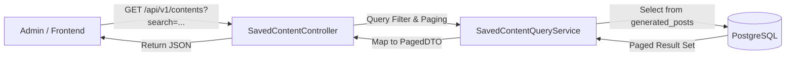
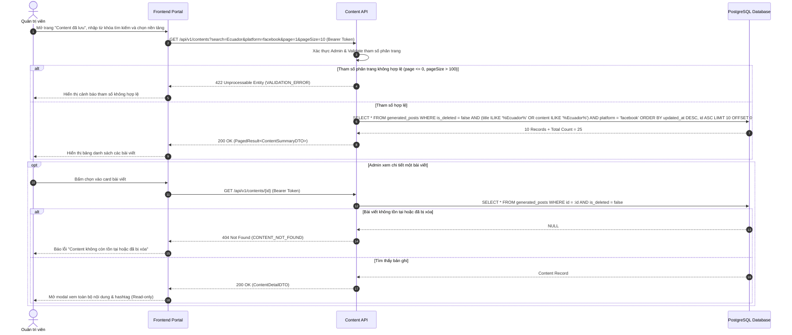
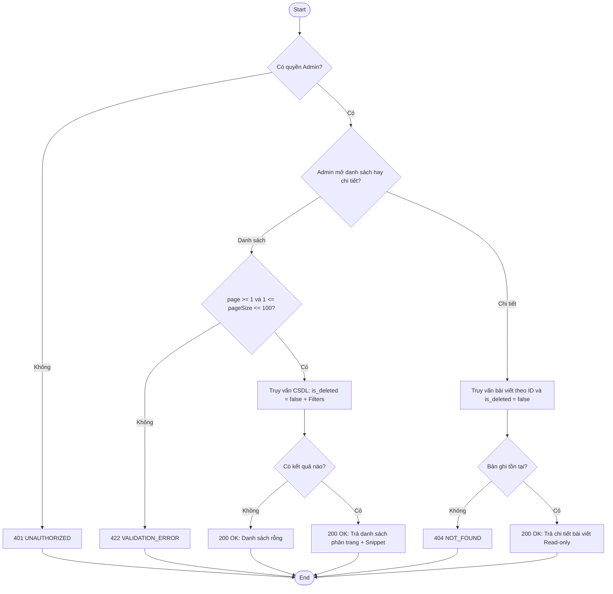
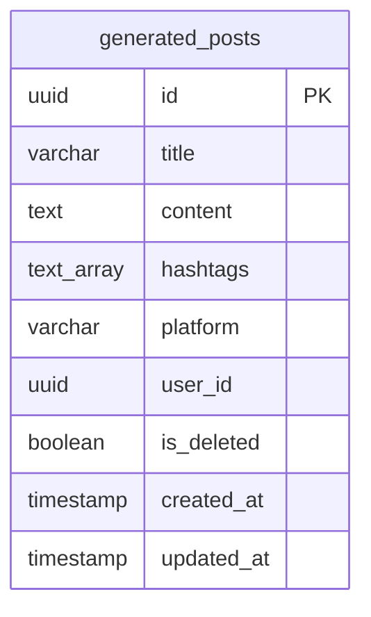

# TDD-018: Xem danh sách và chi tiết content đã lưu

## Document Info

- **Feature**: Xem danh sách và chi tiết content đã lưu
- **Author**: Hồ Hoàng Nam
- **Reviewer**: Tech Lead
- **Status**: In Review
- **Version**: v0
- **Updated At**: 2026-09-10

## Context & Goals

### Problem

Quản trị viên cần tra cứu, tìm kiếm và xem lại các nội dung marketing cùng hashtag đã được sinh ra và lưu trữ trước đó để chuẩn bị cho việc lên lịch đăng bài hoặc tái sử dụng. Cần một giao diện danh sách phân trang tối ưu, tìm kiếm linh hoạt và xem chi tiết an toàn ở chế độ chỉ đọc.

### Goals

- Cung cấp API truy vấn danh sách bài viết đã lưu (`generated_posts`) có hỗ trợ phân trang (`page`, `pageSize`), tìm kiếm theo từ khóa (tiêu đề, nội dung) và lọc theo:
  - Nền tảng: `facebook`, `instagram`, `zalo`.
  - Hashtag: Tìm theo thẻ hashtag ([BR-030](../BusinessRules/BR-030.md), [BR-031](../BusinessRules/BR-031.md)).
  - Thời gian cập nhật: Khoảng ngày bắt đầu (`dateFrom`) đến kết thúc (`dateTo`).
- Sắp xếp mặc định theo `updated_at DESC`, sử dụng tie-breaker `id ASC` để phân trang ổn định ([BR-023](../BusinessRules/BR-023.md)).
- Cung cấp API xem chi tiết 1 bài viết theo ID ở chế độ Read-only: hiển thị tiêu đề, toàn bộ nội dung, mảng hashtag, nền tảng, người tạo, thời gian tạo và cập nhật ([BR-024](../BusinessRules/BR-024.md)).
- Hệ thống chỉ lưu trữ và hiển thị phiên bản hiện tại mới nhất của từng content; không lưu lịch sử các phiên bản cũ (No Version History) ([BR-059](../BusinessRules/BR-059.md)).

### Non-goals

- Không bao gồm các thao tác chỉnh sửa, xóa, lập lịch hoặc đăng bài (thuộc TDD-019, TDD-020, TDD-002).

## Architecture

* Hệ thống nhận yêu cầu xem danh sách hoặc chi tiết content và xác thực quyền Admin.
* `SavedContentQueryService` truy vấn từ bảng `generated_posts` với điều kiện `is_deleted = false` và các điều kiện lọc (nền tảng, từ khóa, hashtag).
* Sắp xếp theo `updated_at DESC, id ASC`, áp dụng phân trang và cắt ngắn `contentSnippet` (150 ký tự) cho DTO danh sách.
* Khi xem chi tiết, hệ thống trả về toàn bộ nội dung văn bản và mảng hashtag đầy đủ ở chế độ chỉ xem.



**Notes**:
- Sử dụng index trên `(is_deleted, updated_at DESC)` để đảm bảo tốc độ query danh sách dưới 200ms.
- Chế độ xem chi tiết là Read-only tuyệt đối.

## Sequence Diagram

Admin mở danh sách, tìm kiếm và lọc nội dung. Khi bấm vào một bài viết, hệ thống hiển thị chi tiết toàn bộ nội dung và hashtag.

| Field | Type | Vai trò trong TDD |
| --- | --- | --- |
| `id` | uuid | Khóa chính của bài viết, dùng cho endpoint chi tiết. |
| `title` | string | Tiêu đề bài viết để nhận diện nhanh trên danh sách. |
| `content` | text | Nội dung bài viết (trả đầy đủ ở chi tiết, cắt snippet ở danh sách). |
| `hashtags` | string[] | Mảng các thẻ hashtag liên kết. |
| `platform` | string | Nền tảng đích (`facebook`, `instagram`, `zalo`). |
| `updated_at` | timestamp | Thời gian cập nhật gần nhất (tiêu chí sắp xếp mặc định DESC). |



## Activity Diagram



## Data Model



**Notes**:
- `is_deleted = false` là điều kiện lọc bắt buộc cho tất cả truy vấn.
- `updated_at DESC, id ASC` là thứ tự sắp xếp mặc định.

## Internal API

### Endpoints

- **GET** `/api/v1/contents` — Lấy danh sách content đã lưu có phân trang và bộ lọc (Admin).
- **GET** `/api/v1/contents/{id:guid}` — Xem chi tiết một content đã lưu ở chế độ chỉ đọc (Admin).

### Examples

#### GET /api/v1/contents

##### 1. Lấy danh sách content thành công (200 OK)

**Request**:
```http
GET /api/v1/contents?search=Ecuador&platform=facebook&page=1&pageSize=10
Authorization: Bearer <Admin_Token>
```

**Response 200**:
```json
{
  "value": {
    "items": [
      {
        "id": "c3d4e5f6-a1b2-4896-bf1d-0fdbae881a28",
        "title": "Hồng Ecuador Mùa Thu - Lãng Mạn",
        "contentSnippet": "Một thoáng mùa thu e ấp trong sắc nhung đỏ kiêu kỳ của đóa hồng Ecuador...",
        "hashtags": [
          "#HoaTheoMua",
          "#HongEcuador",
          "#HoaTuoiCaoCap"
        ],
        "platform": "facebook",
        "createdAt": "2026-09-09T12:01:00Z",
        "updatedAt": "2026-09-09T12:01:00Z"
      }
    ],
    "page": 1,
    "pageSize": 10,
    "totalCount": 1,
    "totalPages": 1,
    "hasNextPage": false,
    "hasPreviousPage": false
  },
  "isSuccess": true,
  "isFailed": false,
  "error": null,
  "traceId": "0HNOE4G1GRT18:00000001",
  "timestampUtc": "2026-09-09T12:15:00.1234567Z"
}
```

##### 2. Danh sách content rỗng (200 OK)

**Request**:
```http
GET /api/v1/contents?search=KhongTonTai&page=1&pageSize=10
Authorization: Bearer <Admin_Token>
```

**Response 200**:
```json
{
  "value": {
    "items": [],
    "page": 1,
    "pageSize": 10,
    "totalCount": 0,
    "totalPages": 0,
    "hasNextPage": false,
    "hasPreviousPage": false
  },
  "isSuccess": true,
  "isFailed": false,
  "error": null,
  "traceId": "00-example",
  "timestampUtc": "2026-09-04T12:00:00Z"
}
```

##### 3. Tham số phân trang không hợp lệ (422 Unprocessable Entity)

**Request**:
```http
GET /api/v1/contents?page=1&pageSize=150
Authorization: Bearer <Admin_Token>
```

**Response 422 (Error)**:
```json
{
  "title": "Unprocessable Entity",
  "status": 422,
  "detail": "Tham số phân trang không hợp lệ.",
  "messageCode": "INVALID_PAGINATION_PARAMETERS",
  "errors": [
    {
      "field": "pageSize",
      "message": "Kích thước trang phải nằm trong khoảng từ 1 đến 100."
    }
  ],
  "traceId": "0HNOE4G1GRT18:00000003",
  "timestampUtc": "2026-09-09T12:15:05.0000000Z"
}
```

#### GET /api/v1/contents/{id:guid}

##### 1. Xem chi tiết bài viết thành công (200 OK)

**Request**:
```http
GET /api/v1/contents/c3d4e5f6-a1b2-4896-bf1d-0fdbae881a28
Authorization: Bearer <Admin_Token>
```

**Response 200**:
```json
{
  "value": {
    "id": "c3d4e5f6-a1b2-4896-bf1d-0fdbae881a28",
    "title": "Hồng Ecuador Mùa Thu - Lãng Mạn",
    "content": "Một thoáng mùa thu e ấp trong sắc nhung đỏ kiêu kỳ của đóa hồng Ecuador...\n\nTình yêu không cần quá phô trương, chỉ cần những cử chỉ dịu dàng đúng lúc. Bó hoa hồng Ecuador từ Hoa Theo Mùa sẽ thay bạn nói lời yêu thương sâu lắng nhất.\n\n👉 Nhắn tin ngay để chọn mẫu hoa lãng mạn cho người thương bạn nhé!",
    "hashtags": [
      "#HoaTheoMua",
      "#HongEcuador",
      "#HoaTuoiCaoCap",
      "#TinhYeuLangMan",
      "#AutumnVibes"
    ],
    "platform": "facebook",
    "createdBy": "Nguyen Anh Quan",
    "createdAt": "2026-09-09T12:01:00Z",
    "updatedAt": "2026-09-09T12:01:00Z"
  },
  "isSuccess": true,
  "isFailed": false,
  "error": null,
  "traceId": "0HNOE4G1GRT18:00000002",
  "timestampUtc": "2026-09-09T12:15:10.1234567Z"
}
```

##### 2. Bài viết không tồn tại (404 Not Found)

**Request**:
```http
GET /api/v1/contents/00000000-0000-0000-0000-000000000000
Authorization: Bearer <Admin_Token>
```

**Response 404 (Error)**:
```json
{
  "title": "Not Found",
  "status": 404,
  "detail": "Content không còn tồn tại hoặc đã bị xóa.",
  "messageCode": "CONTENT_NOT_FOUND",
  "errors": null,
  "traceId": "0HNOE4G1GRT18:00000004",
  "timestampUtc": "2026-09-09T12:15:15.0000000Z"
}
```

### Error Codes

| Code | HTTP | Khi nào xảy ra |
| --- | --- | --- |
| `INVALID_PAGINATION_PARAMETERS` | 422 | `page` < 1 hoặc `pageSize` không nằm trong khoảng 1 - 100. |
| `CONTENT_NOT_FOUND` | 404 | Content ID không tồn tại hoặc đã bị đánh dấu xóa mềm (`is_deleted = true`). |
| `INTERNAL_SERVER_ERROR` | 500 | Sự cố kết nối cơ sở dữ liệu hoặc lỗi hệ thống không xác định. |

## References

### User Stories

- [STORY-018: Xem content đã lưu lại](../UserStory/18-ViewSavedContentListAndDetail.md)

### Business Rules

- [BR-023: Sắp xếp danh sách Content](../BusinessRules/BR-023.md)
- [BR-024: Xem chi tiết Content (Read-only)](../BusinessRules/BR-024.md)
- [BR-030: Lọc Content theo Hashtag](../BusinessRules/BR-030.md)
- [BR-031: Tìm kiếm Content theo từ khóa](../BusinessRules/BR-031.md)
- [BR-059: Không lưu trữ lịch sử phiên bản Content](../BusinessRules/BR-059.md)

### Use Cases

### Others

- `HoaTheoMua.Repository.Enum.PlatformType` (`Zalo = 0`, `Facebook = 1`, `Instagram = 2`).

## Change Log
