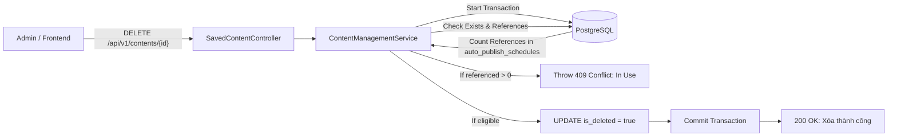
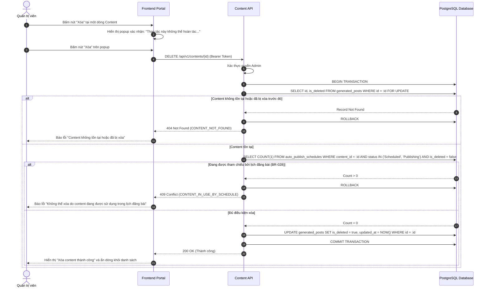
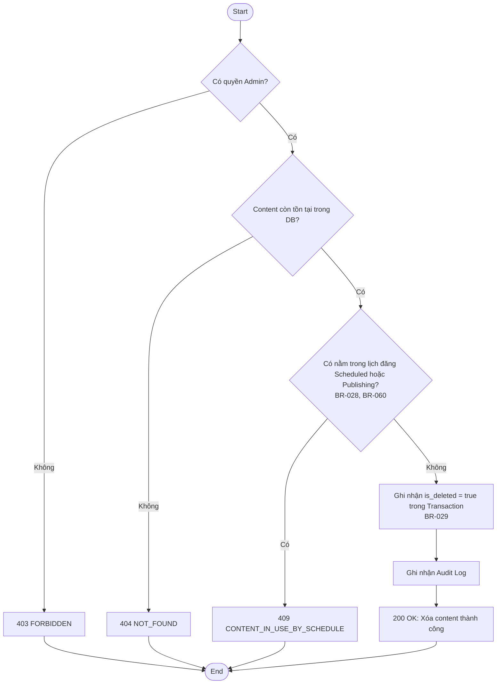
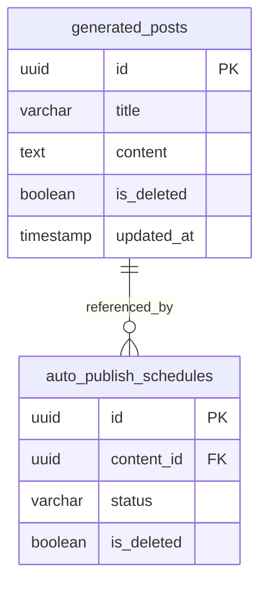

# TDD-019: Xóa content đã lưu lại

## Document Info

- **Feature**: Xóa content đã lưu lại
- **Author**: Hồ Hoàng Nam
- **Reviewer**: Tech Lead
- **Status**: In Review
- **Version**: v0
- **Updated At**: 2026-09-10

## Context & Goals

### Problem

Kho lưu trữ nội dung có thể phát sinh nhiều bài viết nháp, bài thử nghiệm hoặc các content đã lỗi thời không còn nhu cầu sử dụng. Quản trị viên cần xóa bỏ các content này để giữ danh sách gọn gàng và tránh sử dụng nhầm. Tuy nhiên, nếu xóa nhầm bài viết đang được lên lịch đăng tự động, hệ thống sẽ gặp sự cố khi chạy Background Worker.

### Goals

- Cung cấp API xóa content đã lưu cho Quản trị viên.
- **Ràng buộc điều kiện xóa ([BR-028](../BusinessRules/BR-028.md))**:
  - Content chỉ đủ điều kiện xóa khi **KHÔNG** nằm trong bất kỳ bài đăng nào đã được lên lịch (trạng thái `Scheduled` hoặc `Publishing`).
  - Không nằm trong bài đăng nháp hoặc lịch đăng bài chưa thực thi.
- Xóa toàn vẹn dữ liệu Content và các liên kết hashtag trong một Database Transaction thống nhất ([BR-029](../BusinessRules/BR-029.md)).
- Thực hiện cơ chế Double-check kiểm tra lại sự tồn tại và ràng buộc tham chiếu tại thời điểm xác nhận xóa để tránh race condition ([BR-060](../BusinessRules/BR-060.md)).
- Áp dụng xóa mềm (`is_deleted = true`, cập nhật `updated_at = NOW()`).

### Non-goals

- Không hỗ trợ thùng rác (Recycle Bin) khôi phục tự động trong chức năng này.

## Architecture

* Hệ thống nhận yêu cầu xóa content từ Admin Frontend và kiểm tra quyền Admin.
* Mở Database Transaction và kiểm tra sự tồn tại của content (`is_deleted = false`).
* Kiểm tra bảng `auto_publish_schedules`: Đếm số bản ghi có `content_id = :id` và trạng thái thuộc nhóm đang chờ thực thi (`Scheduled`, `Publishing`).
* Nếu có ràng buộc: Hủy bỏ Transaction, trả về `409 Conflict` (`CONTENT_IN_USE_BY_SCHEDULE`).
* Nếu đủ điều kiện: Cập nhật `is_deleted = true`, `updated_at = NOW()`, commit Transaction và ghi nhận Audit Log.



**Notes**:
- Sử dụng Pessimistic Lock (`SELECT ... FOR UPDATE`) để ngăn chặn việc người khác đem content này đi lên lịch trong lúc đang bấm xác nhận xóa.
- Xóa mềm đảm bảo không làm mất dữ liệu lịch sử kiểm toán.

## Sequence Diagram

Admin mở popup xác nhận và bấm Xóa. Hệ thống kiểm tra 2 lớp (Double-check) ràng buộc lịch đăng trước khi thực thi xóa mềm.

| Field | Type | Vai trò trong TDD |
| --- | --- | --- |
| `id` | uuid | Khóa chính của content cần xóa, truyền trên URL. |
| `is_deleted` | boolean | Chuyển từ `false` sang `true` khi xóa mềm thành công. |
| `updated_at` | timestamp | Ghi nhận thời điểm xóa bản ghi. |



## Activity Diagram



## Data Model



**Notes**:
- Ràng buộc toàn vẹn: Không được xóa mềm `generated_posts` nếu còn `auto_publish_schedules` có `status IN ('Scheduled', 'Publishing')` và `is_deleted = false`.

## Internal API

### Endpoints

- **DELETE** `/api/v1/contents/{id:guid}` — Xóa một bài viết đã lưu khỏi danh sách (Admin).

### Examples

#### DELETE /api/v1/contents/{id:guid}

##### 1. Xóa bài viết thành công (200 OK)

**Request**:
```http
DELETE /api/v1/contents/c3d4e5f6-a1b2-4896-bf1d-0fdbae881a28
Authorization: Bearer <Admin_Token>
```

**Response 200**:
```json
{
  "value": {
    "id": "c3d4e5f6-a1b2-4896-bf1d-0fdbae881a28",
    "isDeleted": true,
    "message": "Xóa content thành công."
  },
  "isSuccess": true,
  "isFailed": false,
  "error": null,
  "traceId": "0HNOE4G1GRT19:00000001",
  "timestampUtc": "2026-09-09T12:20:00.1234567Z"
}
```

##### 2. Bài viết đang nằm trong lịch đăng đã lên lịch (409 Conflict)

**Request**:
```http
DELETE /api/v1/contents/c3d4e5f6-a1b2-4896-bf1d-0fdbae881a28
Authorization: Bearer <Admin_Token>
```

**Response 409 (Error)**:
```json
{
  "title": "Conflict",
  "status": 409,
  "detail": "Không thể xóa: Content đang được sử dụng trong lịch đăng bài. Vui lòng hủy lịch đăng trước khi xóa.",
  "messageCode": "CONTENT_IN_USE_BY_SCHEDULE",
  "errors": {
    "scheduleStatus": "Scheduled"
  },
  "traceId": "0HNOE4G1GRT19:00000002",
  "timestampUtc": "2026-09-09T12:20:05.0000000Z"
}
```

##### 3. Bài viết không còn tồn tại (404 Not Found)

**Request**:
```http
DELETE /api/v1/contents/00000000-0000-0000-0000-000000000000
Authorization: Bearer <Admin_Token>
```

**Response 404 (Error)**:
```json
{
  "title": "Not Found",
  "status": 404,
  "detail": "Content không còn tồn tại trong hệ thống.",
  "messageCode": "CONTENT_NOT_FOUND",
  "errors": null,
  "traceId": "0HNOE4G1GRT19:00000003",
  "timestampUtc": "2026-09-09T12:20:10.0000000Z"
}
```

### Error Codes

| Code | HTTP | Khi nào xảy ra |
| --- | --- | --- |
| `CONTENT_NOT_FOUND` | 404 | Bản ghi content không tồn tại hoặc đã bị xóa trước đó. |
| `CONTENT_IN_USE_BY_SCHEDULE` | 409 | Content đang được liên kết với ít nhất 1 bài đăng ở trạng thái `Scheduled` hoặc `Publishing` (BR-028). |
| `INTERNAL_SERVER_ERROR` | 500 | Lỗi kết nối CSDL hoặc sự cố hệ thống trong quá trình thực thi Transaction (BR-029). |

## References

### User Stories

- [STORY-019: Xóa content đã lưu lại](../UserStory/19-DeleteSavedContent.md)

### Business Rules

- [BR-028: Ràng buộc dữ liệu khi xóa Content](../BusinessRules/BR-028.md)
- [BR-029: Xóa toàn vẹn dữ liệu Content](../BusinessRules/BR-029.md)
- [BR-060: Kiểm tra lại và ghi nhận thao tác xóa Content](../BusinessRules/BR-060.md)

### Use Cases

### Others

## Change Log
