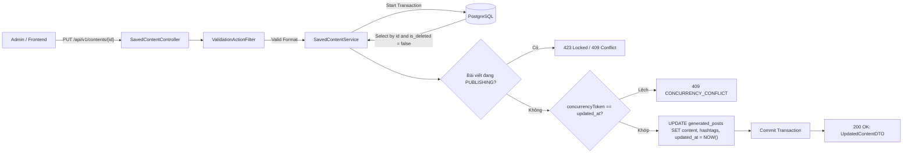
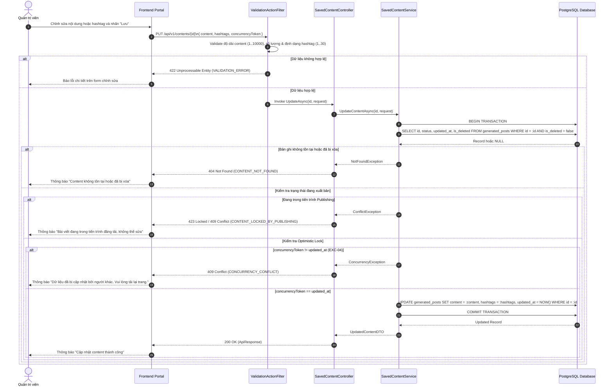
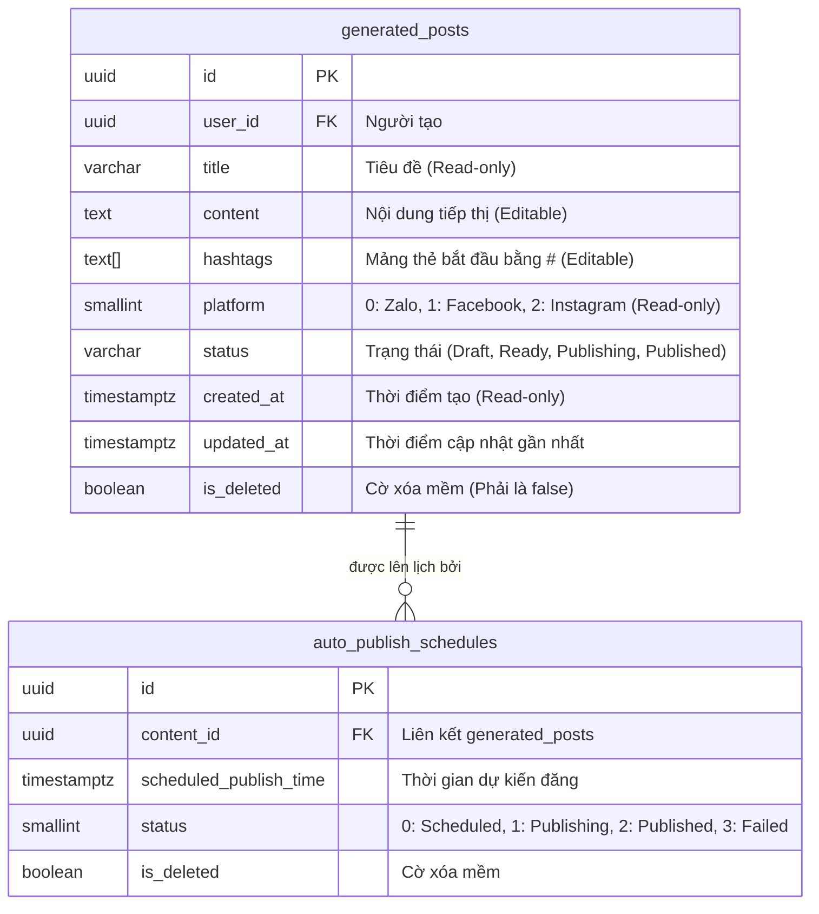

# TDD-020: Sửa content đã lưu lại

## Document Info

- **Feature**: Sửa content đã lưu lại
- **Author**: Hồ Hoàng Nam
- **Reviewer**: Tech Lead
- **Status**: In Review
- **Version**: v0
- **Updated At**: 2026-09-10

## Context & Goals

### Problem

Nội dung marketing hoa tươi sau khi lưu có thể cần chỉnh sửa để bổ sung chương trình khuyến mãi, cập nhật giá hoặc tinh chỉnh hashtag trước khi đem ra xuất bản. Cần một cơ chế chỉnh sửa an toàn, kiểm soát dữ liệu chặt chẽ và ngăn chặn xung đột ghi đè dữ liệu khi nhiều quản trị viên cùng thao tác.

### Goals

- Cho phép Quản trị viên chỉnh sửa nội dung văn bản (`content`) và bộ thẻ hashtag (`hashtags`) của bài viết đã lưu (`generated_posts`).
- **Quy định trường dữ liệu**:
  - `content` (Bắt buộc): Độ dài từ 1 đến 10.000 ký tự sau khi trim khoảng trắng đầu cuối ([BR-025](../BusinessRules/BR-025.md)).
  - `hashtags` (Bắt buộc): Tối thiểu 1 và tối đa 30 hashtag. Mỗi hashtag bắt đầu bằng `#`, dài 2-50 ký tự, không chứa ký tự đặc biệt ngoài `_`, tự động khử trùng lặp (không phân biệt hoa/thường).
- **Trường chỉ đọc ([BR-061](../BusinessRules/BR-061.md))**: `title`, `platform`, `user_id`, `created_at` (giữ nguyên, không cho phép sửa qua API này).
- **Kiểm soát đồng thời (Optimistic Locking - [BR-062](../BusinessRules/BR-062.md))**: Yêu cầu client gửi kèm `concurrencyToken` (giá trị `updatedAt` tại thời điểm tải dữ liệu). Nếu `updated_at` trong CSDL khác với token gửi lên, từ chối cập nhật và trả về mã lỗi `409 Conflict`.
- **Bảo vệ tiến trình xuất bản**: Nếu bài viết đang được sử dụng trong lịch đăng có trạng thái `Publishing`, khóa thao tác chỉnh sửa để tránh xung đột dữ liệu.
- **Tính toàn vẹn giao dịch ([BR-026](../BusinessRules/BR-026.md))**: Cập nhật toàn bộ nội dung, hashtag, `updated_at` trong một Database Transaction duy nhất.

### Non-goals

- Không lưu trữ lịch sử các phiên bản cũ (No Version History).
- Không cho phép đổi nền tảng mục tiêu (`platform`) hoặc tiêu đề (`title`).
- Không hỗ trợ tự động kích hoạt đăng bài ngay tại API này.

## Architecture

* Khi Quản trị viên chọn **Lưu**, Frontend gửi yêu cầu `PUT /api/v1/contents/{id}` kèm token xác thực Admin.
* `ValidationActionFilter` kiểm tra cú pháp: `content` từ 1–10.000 ký tự, `hashtags` từ 1–30 thẻ hợp lệ, `concurrencyToken` đúng chuẩn ISO 8601.
* `SavedContentService` mở Transaction và tải bản ghi `generated_posts` theo `id` với điều kiện `is_deleted = false`.
* Kiểm tra trạng thái liên kết: Kiểm tra xem bài viết có đang nằm trong lịch đăng có trạng thái `Publishing` hay không. Nếu có, từ chối cập nhật.
* So khớp Optimistic Lock: So sánh `concurrencyToken` với `updated_at` của bản ghi trong CSDL. Nếu không khớp, trả về lỗi `409 Conflict`.
* Nếu hợp lệ, cập nhật `content`, `hashtags` và gán `updated_at = NOW()`, sau đó commit Transaction và trả về dữ liệu mới nhất.



**Notes**:
- Không sử dụng version history bảng phụ; cập nhật trực tiếp tại dòng bản ghi `generated_posts`.
- Client bắt buộc phải cung cấp `concurrencyToken` lấy từ endpoint GET chi tiết trước đó để đảm bảo tính an toàn trong môi trường nhiều Admin.

## Sequence Diagram

Quản trị viên chỉnh sửa nội dung/hashtag trên giao diện và bấm Lưu. Hệ thống xác thực dữ liệu, kiểm tra Optimistic Locking và cập nhật nguyên tử.

| Field | Type | Vai trò trong TDD |
| --- | --- | --- |
| `id` | uuid | Khóa chính của content cần sửa, truyền trên URL. |
| `content` | text | Nội dung bài viết (bắt buộc, 1–10.000 ký tự sau khi trim). |
| `hashtags` | string[] | Mảng thẻ hashtag (1–30 thẻ, bắt đầu bằng `#`). |
| `concurrencyToken` | timestamp | Chuỗi thời gian `updatedAt` của lần đọc gần nhất dùng để chống ghi đè. |
| `updated_at` | timestamp | Thời gian cập nhật mới nhất của bản ghi sau khi lưu. |



## Activity Diagram

```mermaid
flowchart TD
    Start([Admin gửi yêu cầu sửa Content]) --> CheckAuth{Có quyền Admin?}
    CheckAuth -- Không --> Err403[403 FORBIDDEN]
    CheckAuth -- Có --> ValidateInput{Validate Content (1..10000)<br/>& Hashtags (1..30)?}
    
    ValidateInput -- Không --> Err422[422 VALIDATION_ERROR]
    ValidateInput -- Có --> FetchRecord[Truy vấn generated_posts theo ID và is_deleted = false]
    
    FetchRecord --> CheckExists{Bản ghi tồn tại?}
    CheckExists -- Không --> Err404[404 CONTENT_NOT_FOUND]
    CheckExists -- Có --> CheckPublishing{Đang trạng thái PUBLISHING?}
    
    CheckPublishing -- Có --> Err423[423 CONTENT_LOCKED_BY_PUBLISHING]
    CheckPublishing -- Không --> CheckToken{concurrencyToken == DB.updated_at?}
    
    CheckToken -- Không --> Err409[409 CONCURRENCY_CONFLICT]
    CheckToken -- Có --> ExecuteUpdate[Cập nhật CSDL trong Transaction duy nhất]
    
    ExecuteUpdate --> Return200[200 OK: Trả về UpdatedContentDTO]
    Return200 --> End([Kết thúc])
    
    Err403 --> End
    Err422 --> End
    Err404 --> End
    Err423 --> End
    Err409 --> End
```

## Data Model



**Notes**:
- Chức năng chỉ cập nhật hai trường `content`, `hashtags` và tự động làm mới `updated_at`.
- Trường `updated_at` đóng vai trò là concurrency token trong cơ chế Optimistic Locking.

## Internal API

### Endpoints

| Method | Endpoint | Quyền | Mô tả |
| --- | --- | --- | --- |
| `PUT` | `/api/v1/contents/{id:guid}` | Admin | Chỉnh sửa nội dung và bộ thẻ hashtag của bài viết đã lưu. |

### Examples

##### 1. Cập nhật content thành công (200 OK)

**Request**:
```http
PUT /api/v1/contents/c3d4e5f6-a1b2-4896-bf1d-0fdbae881a28
Authorization: Bearer <Admin_Token>
Content-Type: application/json

{
  "content": "Một thoáng mùa thu e ấp trong sắc nhung đỏ kiêu kỳ của đóa hồng Ecuador... Tặng kèm thiệp thiết kế riêng khi đặt trước 24h!",
  "hashtags": [
    "#HoaTheoMua",
    "#HongEcuador",
    "#HoaTuoiCaoCap",
    "#UuDaiMuaThu"
  ],
  "concurrencyToken": "2026-09-09T12:01:00.1234567Z"
}
```

**Response 200**:
```json
{
  "value": {
    "id": "c3d4e5f6-a1b2-4896-bf1d-0fdbae881a28",
    "title": "Hồng Ecuador Mùa Thu - Lãng Mạn",
    "content": "Một thoáng mùa thu e ấp trong sắc nhung đỏ kiêu kỳ của đóa hồng Ecuador... Tặng kèm thiệp thiết kế riêng khi đặt trước 24h!",
    "hashtags": [
      "#HoaTheoMua",
      "#HongEcuador",
      "#HoaTuoiCaoCap",
      "#UuDaiMuaThu"
    ],
    "platform": 1,
    "updatedAt": "2026-09-09T12:25:00.1234567Z"
  },
  "isSuccess": true,
  "isFailed": false,
  "error": null,
  "traceId": "0HNOE4G1GRT20:00000001",
  "timestampUtc": "2026-09-09T12:25:00.1234567Z"
}
```

##### 2. Xung đột phiên bản khi lưu (409 Conflict)

**Request**:
```http
PUT /api/v1/contents/c3d4e5f6-a1b2-4896-bf1d-0fdbae881a28
Authorization: Bearer <Admin_Token>
Content-Type: application/json

{
  "content": "Một thoáng mùa thu e ấp trong sắc nhung đỏ kiêu kỳ của đóa hồng Ecuador... Tặng kèm thiệp thiết kế riêng khi đặt trước 24h!",
  "hashtags": [
    "#HoaTheoMua",
    "#HongEcuador"
  ],
  "concurrencyToken": "2026-09-01T10:00:00.0000000Z"
}
```

**Response 409 (Error)**:
```json
{
  "isSuccess": false,
  "isFailed": true,
  "value": null,
  "error": {
    "code": "CONCURRENCY_CONFLICT",
    "message": "Bản ghi đã được cập nhật bởi một quản trị viên khác. Vui lòng tải lại dữ liệu mới nhất trước khi chỉnh sửa."
  },
  "traceId": "0HNOE4G1GRT20:00000002",
  "timestampUtc": "2026-09-09T12:26:10.5123400Z"
}
```

##### 3. Dữ liệu không hợp lệ (422 Unprocessable Entity)

**Request**:
```http
PUT /api/v1/contents/c3d4e5f6-a1b2-4896-bf1d-0fdbae881a28
Authorization: Bearer <Admin_Token>
Content-Type: application/json

{
  "content": "",
  "hashtags": [
    "KhongCoDauThang"
  ],
  "concurrencyToken": "2026-09-09T12:01:00.1234567Z"
}
```

**Response 422 (Error)**:
```json
{
  "isSuccess": false,
  "isFailed": true,
  "value": null,
  "error": {
    "code": "VALIDATION_ERROR",
    "message": "Dữ liệu đầu vào không hợp lệ.",
    "details": [
      {
        "field": "content",
        "message": "Nội dung bài viết không được để trống và phải có độ dài từ 1 đến 10.000 ký tự."
      },
      {
        "field": "hashtags",
        "message": "Mỗi hashtag phải bắt đầu bằng ký tự '#' và không chứa ký tự đặc biệt."
      }
    ]
  },
  "traceId": "0HNOE4G1GRT20:00000003",
  "timestampUtc": "2026-09-09T12:27:00.0000000Z"
}
```

### Error Codes

| Code | HTTP Status | Khi nào xảy ra |
| --- | :---: | --- |
| `UNAUTHORIZED` | 401 | Yêu cầu không có token hoặc token đã hết hạn. |
| `FORBIDDEN` | 403 | Người dùng không có quyền Quản trị viên (Admin). |
| `CONTENT_NOT_FOUND` | 404 | Bản ghi content không tồn tại hoặc đã bị xóa mềm (`is_deleted = true`). |
| `CONCURRENCY_CONFLICT` | 409 | `concurrencyToken` không khớp với `updated_at` hiện thời của bản ghi ([BR-062](../BusinessRules/BR-062.md)). |
| `CONTENT_LOCKED_BY_PUBLISHING` | 423 | Bài viết đang nằm trong tiến trình đăng tải mạng xã hội, tạm thời bị khóa chỉnh sửa. |
| `VALIDATION_ERROR` | 422 | Nội dung rỗng, vượt quá 10.000 ký tự hoặc số lượng/định dạng hashtag không đúng quy tắc ([BR-025](../BusinessRules/BR-025.md)). |
| `INTERNAL_SERVER_ERROR` | 500 | Lỗi kết nối CSDL hoặc lỗi hệ thống ngoài dự kiến ([BR-026](../BusinessRules/BR-026.md)). |

## References

### User Stories

- [STORY-020: Sửa content đã lưu lại](file:///d:/VNZ/document-first-brief/hoa-theo-mua-ai-marketing/UserStory/20-UpdateSavedContent.md)

### Business Rules

- [BR-025: Giới hạn độ dài nội dung Content](file:///d:/VNZ/document-first-brief/hoa-theo-mua-ai-marketing/BusinessRules/BR-025.md)
- [BR-026: Đồng bộ giao dịch khi sửa Content](file:///d:/VNZ/document-first-brief/hoa-theo-mua-ai-marketing/BusinessRules/BR-026.md)
- [BR-061: Phạm vi chỉnh sửa Content](file:///d:/VNZ/document-first-brief/hoa-theo-mua-ai-marketing/BusinessRules/BR-061.md)
- [BR-062: Không ghi đè Content đã thay đổi trong lúc sửa](file:///d:/VNZ/document-first-brief/hoa-theo-mua-ai-marketing/BusinessRules/BR-062.md)

### Use Cases

- Không áp dụng.

### Others

- Enum `HoaTheoMua.Repository.Enum.PlatformType`: `Zalo = 0`, `Facebook = 1`, `Instagram = 2`.

## Change Log

| Phiên bản | Ngày | Tác giả | Tóm tắt thay đổi |
| --- | --- | --- | --- |
| v0 | 2026-09-10 | Hồ Hoàng Nam | Khởi tạo tài liệu thiết kế kỹ thuật Sửa content đã lưu theo chuẩn Document-First. |
