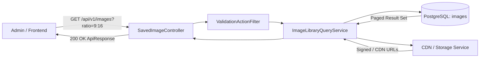
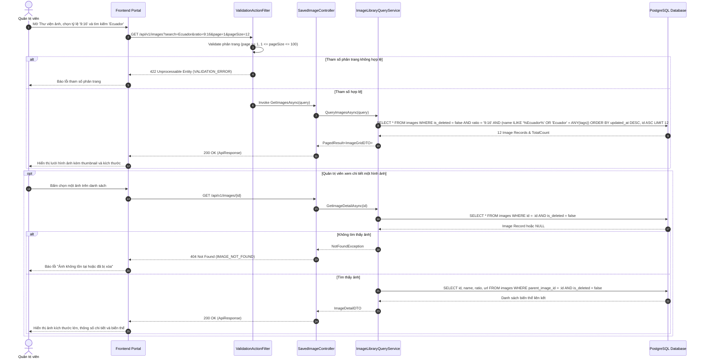
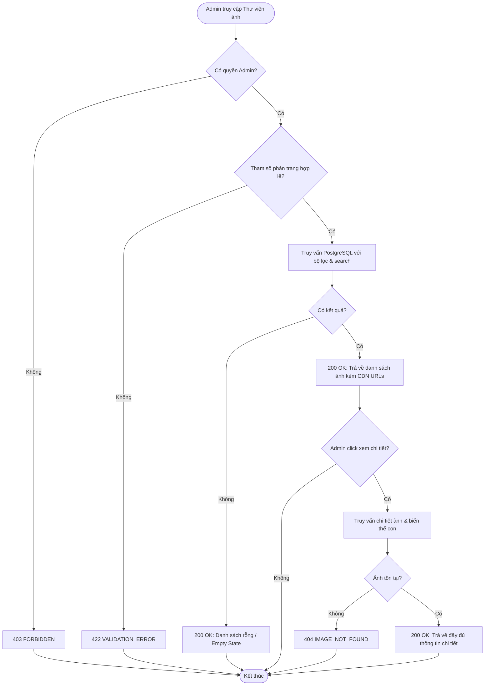
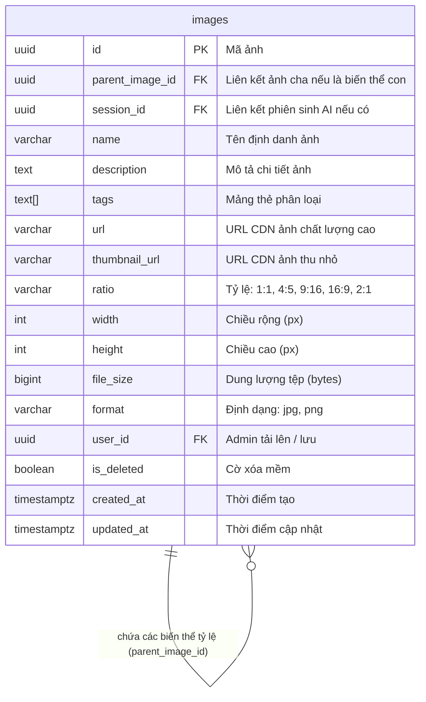

# TDD-021: Xem danh sách và chi tiết ảnh đã lưu

## Document Info

- **Feature**: Xem danh sách và chi tiết ảnh đã lưu
- **Author**: Hồ Hoàng Nam
- **Reviewer**: Tech Lead
- **Status**: In Review
- **Version**: v0
- **Updated At**: 2026-09-10

## Context & Goals

### Problem

Quản trị viên cần tra cứu các hình ảnh trong kho thư viện số (DAM), bao gồm ảnh tải lên thủ công và ảnh do AI sinh tự động theo tỷ lệ ([STORY-003](file:///d:/VNZ/document-first-brief/hoa-theo-mua-ai-marketing/UserStory/03-AutoGenerateMultiRatioImagesFromCore.md)). Giao diện cần hỗ trợ tìm kiếm linh hoạt theo tên, ID, thẻ (tags), lọc theo tỷ lệ khung hình, định dạng tệp và xem ảnh chi tiết ở độ phân giải gốc để lựa chọn ảnh phù hợp khi đăng bài.

### Goals

- Cung cấp API danh sách phân trang hình ảnh (`images`) hỗ trợ hiển thị dạng lưới (Grid) hoặc danh sách:
  - Phân trang: `page` (tối thiểu 1), `pageSize` (mặc định 12, tối đa 100) ([BR-038](../BusinessRules/BR-038.md)).
  - Tìm kiếm: Theo từ khóa `search` (so khớp tên ảnh, mã UUID hoặc thẻ tag) ([BR-063](../BusinessRules/BR-063.md)).
  - Lọc theo tỷ lệ: `1:1`, `4:5`, `9:16`, `16:9`, `2:1`.
  - Lọc theo định dạng: `jpg`, `jpeg`, `png`.
  - Lọc theo thời gian cập nhật: `dateFrom`, `dateTo`.
  - Sắp xếp mặc định: `updated_at DESC, id ASC` ([BR-064](../BusinessRules/BR-064.md)).
- Cung cấp API xem chi tiết hình ảnh:
  - Hiển thị URL ảnh đầy đủ độ phân giải và URL ảnh thu nhỏ (thumbnail).
  - Hiển thị metadata kỹ thuật: Tỷ lệ, kích thước pixel (width x height), dung lượng file, định dạng.
  - Hiển thị thông tin quản trị: Tên ảnh, mô tả, thẻ tags, nguồn gốc tạo, người tạo, ngày tạo, ngày cập nhật.
  - Hiển thị danh sách các biến thể tỷ lệ liên kết (`childVariants`) nếu đây là ảnh gốc.

### Non-goals

- Không bao gồm chỉnh sửa thông tin ảnh hoặc xóa ảnh (thuộc TDD-022, TDD-023).
- Không thực hiện biến đổi kích thước hoặc crop ảnh trực tiếp tại API xem chi tiết.

## Architecture

* `SavedImageController` tiếp nhận yêu cầu lấy danh sách `GET /api/v1/images` và chi tiết `GET /api/v1/images/{id}`.
* `ValidationActionFilter` kiểm tra tính hợp lệ của tham số phân trang (`page >= 1`, `1 <= pageSize <= 100`).
* `ImageLibraryQueryService` thực hiện truy vấn tối ưu trên PostgreSQL với điều kiện `is_deleted = false`.
* Sử dụng CDN Storage Provider để sinh URL ảnh gốc và URL thumbnail tối ưu tốc độ hiển thị cho giao diện quản trị.
* Trả về dữ liệu đóng gói theo chuẩn `ApiResponse<T>`.



**Notes**:
- Bảng `images` được đánh index tổng hợp `(is_deleted, updated_at DESC)` để đảm bảo thời gian phản hồi danh sách dưới 200ms.
- Toàn bộ thao tác xem danh sách và chi tiết là Read-only.

## Sequence Diagram

Quản trị viên mở Thư viện ảnh, thiết lập bộ lọc tỷ lệ và từ khóa tìm kiếm. Sau đó bấm vào một ảnh để xem chi tiết độ phân giải cao và thông số kỹ thuật.

| Field | Type | Vai trò trong TDD |
| --- | --- | --- |
| `id` | uuid | Khóa chính của ảnh trong thư viện. |
| `name` | string | Tên ảnh để nhận diện nhanh trên giao diện. |
| `url` | string | Đường dẫn CDN của ảnh gốc chất lượng cao. |
| `thumbnail_url` | string | Đường dẫn CDN ảnh thu nhỏ dùng cho lưới hiển thị. |
| `ratio` | string | Tỷ lệ khung hình (`1:1`, `4:5`, `9:16`, `16:9`, `2:1`). |
| `width` | int | Chiều rộng ảnh tính theo pixel. |
| `height` | int | Chiều cao ảnh tính theo pixel. |
| `file_size` | bigint | Dung lượng ảnh tính theo byte. |
| `updated_at` | timestamp | Thời gian cập nhật gần nhất (tiêu chí sắp xếp mặc định DESC). |



## Activity Diagram



## Data Model



**Notes**:
- Quản lý quan hệ cha-con (`parent_image_id`) giúp nhóm các ảnh đa tỷ lệ sinh ra từ cùng một ảnh core.
- Xóa mềm đảm bảo không làm gián đoạn bài đăng mạng xã hội đã sử dụng ảnh trước đó.

## Internal API

### Endpoints

| Method | Endpoint | Quyền | Mô tả |
| --- | --- | --- | --- |
| `GET` | `/api/v1/images` | Admin | Lấy danh sách ảnh phân trang kèm bộ lọc và tìm kiếm từ khóa. |
| `GET` | `/api/v1/images/{id:guid}` | Admin | Xem chi tiết một hình ảnh cùng metadata và các biến thể tỷ lệ liên kết. |

### Examples

##### 1. Lấy danh sách ảnh thành công (200 OK)

**Request**:
```http
GET /api/v1/images?ratio=9:16&search=Ecuador&page=1&pageSize=12
Authorization: Bearer <Admin_Token>
```

**Response 200**:
```json
{
  "value": {
    "items": [
      {
        "id": "7a8b9c0d-1e2f-4896-bf1d-0fdbae881a28",
        "name": "Bó Hồng Ecuador Mùa Thu - Story Banner 9:16",
        "thumbnailUrl": "https://cdn.hoatheomua.vn/thumb/session_f1e2d3c4_9_16.jpg",
        "ratio": "9:16",
        "width": 1080,
        "height": 1920,
        "format": "jpg",
        "fileSize": 1845230,
        "tags": ["hong_ecuador", "autumn_vibes"],
        "updatedAt": "2026-09-09T12:11:00.0000000Z"
      }
    ],
    "page": 1,
    "pageSize": 12,
    "totalCount": 1,
    "totalPages": 1,
    "hasNextPage": false,
    "hasPreviousPage": false
  },
  "isSuccess": true,
  "isFailed": false,
  "error": null,
  "traceId": "0HNOE4G1GRT21:00000001",
  "timestampUtc": "2026-09-09T12:30:00.1234567Z"
}
```

##### 2. Xem chi tiết ảnh thành công (200 OK)

**Request**:
```http
GET /api/v1/images/7a8b9c0d-1e2f-4896-bf1d-0fdbae881a28
Authorization: Bearer <Admin_Token>
```

**Response 200**:
```json
{
  "value": {
    "id": "7a8b9c0d-1e2f-4896-bf1d-0fdbae881a28",
    "name": "Bó Hồng Ecuador Mùa Thu - Story Banner 9:16",
    "description": "Ảnh tỷ lệ 9:16 dùng chạy Instagram Story và TikTok mùa thu 2026.",
    "url": "https://cdn.hoatheomua.vn/images/session_f1e2d3c4_9_16.jpg",
    "thumbnailUrl": "https://cdn.hoatheomua.vn/thumb/session_f1e2d3c4_9_16.jpg",
    "ratio": "9:16",
    "width": 1080,
    "height": 1920,
    "format": "jpg",
    "fileSize": 1845230,
    "tags": ["hong_ecuador", "autumn_vibes"],
    "source": "AI_GENERATED",
    "createdBy": "Nguyen Anh Quan",
    "createdAt": "2026-09-09T12:11:00.0000000Z",
    "updatedAt": "2026-09-09T12:11:00.0000000Z",
    "childVariants": []
  },
  "isSuccess": true,
  "isFailed": false,
  "error": null,
  "traceId": "0HNOE4G1GRT21:00000002",
  "timestampUtc": "2026-09-09T12:30:10.1234567Z"
}
```

##### 3. Không tìm thấy ảnh (404 Not Found)

**Request**:
```http
GET /api/v1/images/00000000-0000-0000-0000-000000000000
Authorization: Bearer <Admin_Token>
```

**Response 404 (Error)**:
```json
{
  "isSuccess": false,
  "isFailed": true,
  "value": null,
  "error": {
    "code": "IMAGE_NOT_FOUND",
    "message": "Không tìm thấy hình ảnh tương ứng hoặc ảnh đã bị xóa."
  },
  "traceId": "0HNOE4G1GRT21:00000003",
  "timestampUtc": "2026-09-09T12:30:20.0000000Z"
}
```

### Error Codes

| Code | HTTP Status | Khi nào xảy ra |
| --- | :---: | --- |
| `UNAUTHORIZED` | 401 | Yêu cầu không có token hoặc token đã hết hạn. |
| `FORBIDDEN` | 403 | Người dùng không có quyền Quản trị viên (Admin). |
| `IMAGE_NOT_FOUND` | 404 | Ảnh không tồn tại hoặc đã bị xóa mềm (`is_deleted = true`). |
| `VALIDATION_ERROR` | 422 | `page` < 1 hoặc `pageSize` không nằm trong khoảng 1–100 ([BR-038](../BusinessRules/BR-038.md)). |
| `INTERNAL_SERVER_ERROR` | 500 | Lỗi kết nối CSDL hoặc lỗi hệ thống không xác định. |

## References

### User Stories

- [STORY-021: Xem ảnh đã lưu lại](file:///d:/VNZ/document-first-brief/hoa-theo-mua-ai-marketing/UserStory/21-ViewSavedImagesListAndDetail.md)

### Business Rules

- [BR-038: Phân trang danh sách ảnh](file:///d:/VNZ/document-first-brief/hoa-theo-mua-ai-marketing/BusinessRules/BR-038.md)
- [BR-063: Tìm kiếm ảnh theo từ khóa và thẻ](file:///d:/VNZ/document-first-brief/hoa-theo-mua-ai-marketing/BusinessRules/BR-063.md)
- [BR-064: Thứ tự sắp xếp danh sách ảnh](file:///d:/VNZ/document-first-brief/hoa-theo-mua-ai-marketing/BusinessRules/BR-064.md)

### Use Cases

- Không áp dụng.

### Others

- Lưu trữ hình ảnh: MinIO / AWS S3 kết hợp CloudFront CDN.

## Change Log

| Phiên bản | Ngày | Tác giả | Tóm tắt thay đổi |
| --- | --- | --- | --- |
| v0 | 2026-09-10 | Hồ Hoàng Nam | Khởi tạo tài liệu thiết kế kỹ thuật Xem danh sách và chi tiết ảnh đã lưu theo chuẩn Document-First. |
