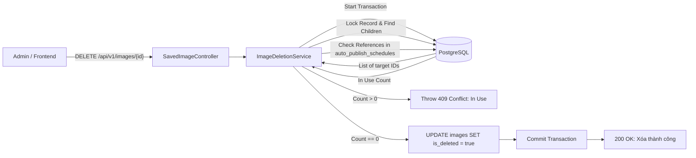
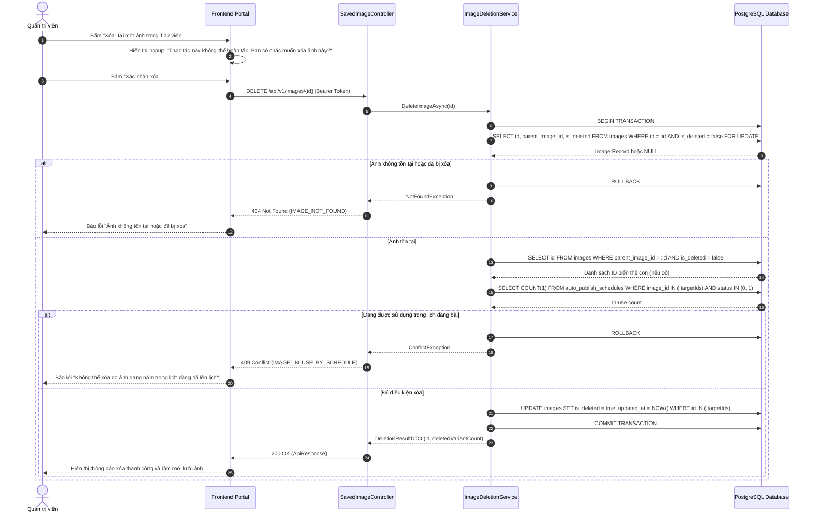
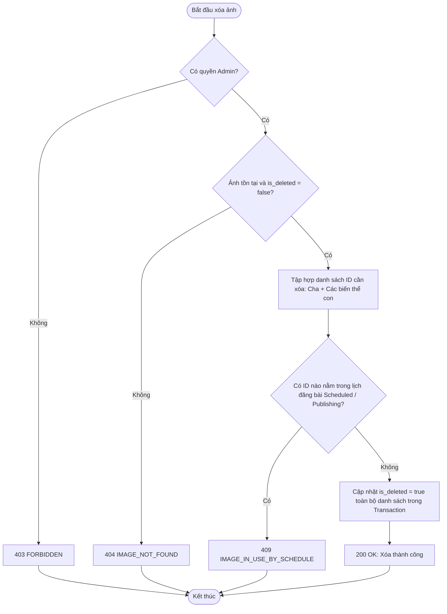
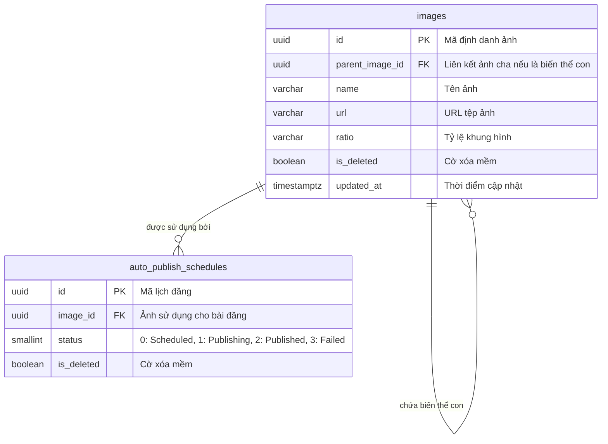

# TDD-022: Xóa ảnh đã lưu lại

## Document Info

- **Feature**: Xóa ảnh đã lưu lại
- **Author**: Hồ Hoàng Nam
- **Reviewer**: Tech Lead
- **Status**: In Review
- **Version**: v0
- **Updated At**: 2026-09-10

## Context & Goals

### Problem

Thư viện hình ảnh có thể chứa nhiều ảnh thừa, ảnh thử nghiệm hoặc phiên bản ảnh không còn giá trị sử dụng. Quản trị viên cần xóa bỏ các ảnh này để dọn dẹp dung lượng và tránh sử dụng nhầm trong các chiến dịch marketing. Tuy nhiên, việc xóa phải quản lý chặt chẽ quan hệ giữa ảnh gốc (Core Image) và các biến thể tỷ lệ (Ratio Variants), đồng thời ngăn chặn xóa ảnh đang được sử dụng trong các bài đăng đã lên lịch tự động.

### Goals

- Cung cấp API xóa hình ảnh đã lưu trong thư viện số cho Quản trị viên.
- **Quy định quan hệ phân cấp cha – con khi xóa ([BR-039](../BusinessRules/BR-039.md))**:
  - **Khi xóa ảnh gốc (Core Image)**: Tự động xóa mềm đồng thời ảnh gốc cùng toàn bộ các biến thể con theo tỷ lệ liên kết với nó (`parent_image_id = :id`) trong cùng một Database Transaction duy nhất.
  - **Khi xóa biến thể con riêng lẻ**: Chỉ xóa mềm riêng biến thể con được chỉ định, ảnh gốc cha và các biến thể anh em khác vẫn được bảo toàn nguyên vẹn.
- **Ràng buộc kiểm tra trước khi xóa ([BR-065](../BusinessRules/BR-065.md))**:
  - Ảnh được chọn và toàn bộ biến thể liên quan (nếu là ảnh cha) đều **KHÔNG** được nằm trong bất kỳ lịch đăng bài nào có trạng thái chờ hoặc đang chạy (`Scheduled`, `Publishing`).
  - Nếu phát hiện bất kỳ ràng buộc đang hoạt động: Chặn thao tác xóa và trả về mã lỗi `409 Conflict`.
- **Cơ chế xóa an toàn (Double-check)**:
  - Kiểm tra lại trạng thái bản ghi tại thời điểm xác nhận xóa bằng Pessimistic Locking (`FOR UPDATE`).
  - Áp dụng xóa mềm (`is_deleted = true`, cập nhật `updated_at = NOW()`).

### Non-goals

- Không hỗ trợ thùng rác hoàn tác tự động cho người dùng cuối trong API này.
- Không xóa vật lý ngay lập tức tệp ảnh trên Object Storage (tệp vật lý được dọn dẹp qua retention job nền sau 30 ngày).

## Architecture

* `SavedImageController` tiếp nhận yêu cầu xóa `DELETE /api/v1/images/{id}` kèm token xác thực Admin.
* `ImageDeletionService` mở Database Transaction và khóa dòng bản ghi bằng `SELECT ... FOR UPDATE`.
* Xác định phạm vi xóa:
  - Nếu là ảnh cha (`parent_image_id IS NULL`): Lấy danh sách gồm ID cha và tất cả ID con có `parent_image_id = :id`.
  - Nếu là ảnh con (`parent_image_id IS NOT NULL`): Chỉ gom duy nhất ID của ảnh con.
* Kiểm tra tham chiếu: Đếm số lượng bản ghi trong `auto_publish_schedules` trỏ tới danh sách ID này với trạng thái `Scheduled` hoặc `Publishing`.
* Nếu số lượng > 0: Rollback Transaction, trả về `409 Conflict` (`IMAGE_IN_USE_BY_SCHEDULE`).
* Nếu hợp lệ: Cập nhật `is_deleted = true`, `updated_at = NOW()` cho toàn bộ ID trong danh sách, commit Transaction và trả về số lượng bản ghi đã xóa.



**Notes**:
- Sử dụng Database Transaction kết hợp khóa dòng bản ghi để chống race condition khi có người khác đem ảnh đi lên lịch đăng bài ngay thời điểm bấm xác nhận xóa.
- Đảm bảo toàn vẹn dữ liệu cho toàn bộ cây quan hệ tỷ lệ của ảnh core.

## Sequence Diagram

Quản trị viên bấm nút Xóa tại một ảnh trong thư viện, xem popup cảnh báo (kèm số lượng biến thể sẽ bị xóa kèm nếu là ảnh gốc) và nhấn Xác nhận xóa.

| Field | Type | Vai trò trong TDD |
| --- | --- | --- |
| `id` | uuid | Khóa chính của ảnh cần xóa, truyền trên URL. |
| `is_deleted` | boolean | Chuyển từ `false` sang `true` khi xóa mềm thành công. |
| `deletedVariantCount` | int | Số lượng biến thể con bị xóa kèm theo nếu xóa ảnh gốc. |
| `updated_at` | timestamp | Thời điểm cập nhật trạng thái xóa của bản ghi. |



## Activity Diagram



## Data Model



**Notes**:
- Xóa mềm ảnh cha sẽ tự động cascade xóa mềm toàn bộ ảnh biến thể con liên kết.
- Bản ghi trong bảng `images` được giữ lại để đảm bảo tính toàn vẹn khóa ngoại với các bài viết lịch sử đã đăng thành công trong quá khứ.

## Internal API

### Endpoints

| Method | Endpoint | Quyền | Mô tả |
| --- | --- | --- | --- |
| `DELETE` | `/api/v1/images/{id:guid}` | Admin | Xóa mềm hình ảnh và các biến thể liên kết khỏi Thư viện ảnh. |

### Examples

##### 1. Xóa ảnh thành công (200 OK)

**Request**:
```http
DELETE /api/v1/images/7a8b9c0d-1e2f-4896-bf1d-0fdbae881a28
Authorization: Bearer <Admin_Token>
```

**Response 200**:
```json
{
  "value": {
    "deletedImageId": "7a8b9c0d-1e2f-4896-bf1d-0fdbae881a28",
    "deletedVariantCount": 2,
    "message": "Xóa ảnh gốc và 2 biến thể tỷ lệ liên kết thành công."
  },
  "isSuccess": true,
  "isFailed": false,
  "error": null,
  "traceId": "0HNOE4G1GRT22:00000001",
  "timestampUtc": "2026-09-09T12:35:00.1234567Z"
}
```

##### 2. Ảnh đang nằm trong lịch đăng đã lên lịch (409 Conflict)

**Request**:
```http
DELETE /api/v1/images/7a8b9c0d-1e2f-4896-bf1d-0fdbae881a28
Authorization: Bearer <Admin_Token>
```

**Response 409 (Error)**:
```json
{
  "isSuccess": false,
  "isFailed": true,
  "value": null,
  "error": {
    "code": "IMAGE_IN_USE_BY_SCHEDULE",
    "message": "Không thể xóa ảnh này vì ảnh (hoặc biến thể của nó) đang được sử dụng trong bài đăng đã lên lịch tự động."
  },
  "traceId": "0HNOE4G1GRT22:00000002",
  "timestampUtc": "2026-09-09T12:35:10.0000000Z"
}
```

##### 3. Ảnh không tồn tại trong hệ thống (404 Not Found)

**Request**:
```http
DELETE /api/v1/images/00000000-0000-0000-0000-000000000000
Authorization: Bearer <Admin_Token>
```

**Response 404 (Error)**:
```json
{
  "isSuccess": false,
  "isFailed": true,
  "value": null,
  "error": {
    "code": "IMAGE_NOT_FOUND",
    "message": "Ảnh không tồn tại trong hệ thống hoặc đã bị xóa trước đó."
  },
  "traceId": "0HNOE4G1GRT22:00000003",
  "timestampUtc": "2026-09-09T12:35:20.0000000Z"
}
```

### Error Codes

| Code | HTTP Status | Khi nào xảy ra |
| --- | :---: | --- |
| `UNAUTHORIZED` | 401 | Yêu cầu không có token hoặc token đã hết hạn. |
| `FORBIDDEN` | 403 | Người dùng không có quyền Quản trị viên (Admin). |
| `IMAGE_NOT_FOUND` | 404 | Ảnh không tồn tại hoặc đã bị xóa mềm (`is_deleted = true`). |
| `IMAGE_IN_USE_BY_SCHEDULE` | 409 | Ảnh hoặc một trong các biến thể tỷ lệ của nó đang được sử dụng trong lịch đăng bài chờ hoặc đang thực thi ([BR-065](../BusinessRules/BR-065.md)). |
| `INTERNAL_SERVER_ERROR` | 500 | Lỗi kết nối CSDL hoặc lỗi hệ thống không xác định trong quá trình xử lý giao dịch. |

## References

### User Stories

- [STORY-022: Xóa ảnh đã lưu lại](file:///d:/VNZ/document-first-brief/hoa-theo-mua-ai-marketing/UserStory/22-DeleteSavedImage.md)

### Business Rules

- [BR-039: Xóa ảnh và biến thể liên quan](file:///d:/VNZ/document-first-brief/hoa-theo-mua-ai-marketing/BusinessRules/BR-039.md)
- [BR-065: Ràng buộc khi xóa ảnh](file:///d:/VNZ/document-first-brief/hoa-theo-mua-ai-marketing/BusinessRules/BR-065.md)

### Use Cases

- Không áp dụng.

### Others

- Cơ chế dọn dẹp vật lý Object Storage: Hangfire Recurring Job chạy 30 ngày sau khi xóa mềm.

## Change Log

| Phiên bản | Ngày | Tác giả | Tóm tắt thay đổi |
| --- | --- | --- | --- |
| v0 | 2026-09-10 | Hồ Hoàng Nam | Khởi tạo tài liệu thiết kế kỹ thuật Xóa ảnh đã lưu lại theo chuẩn Document-First. |
