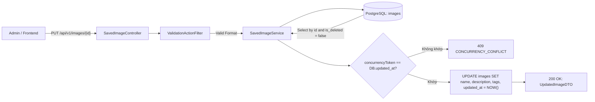
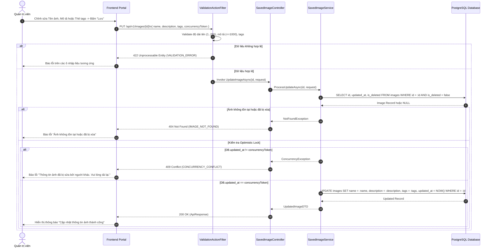
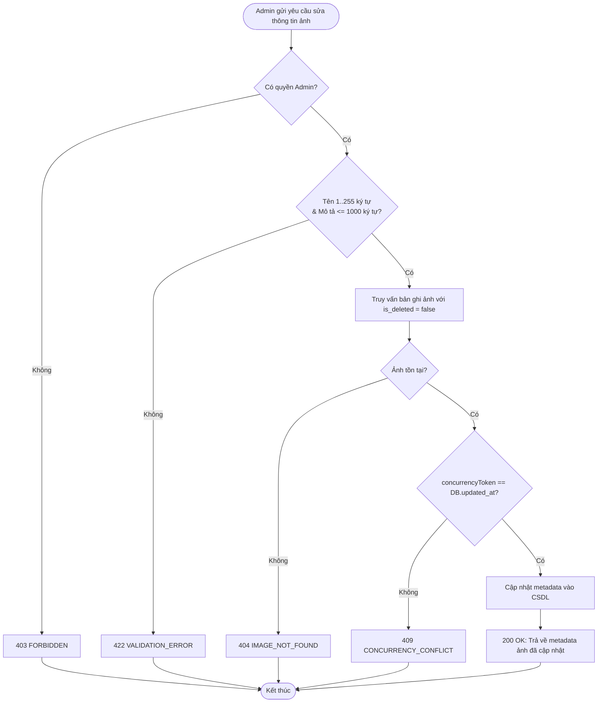
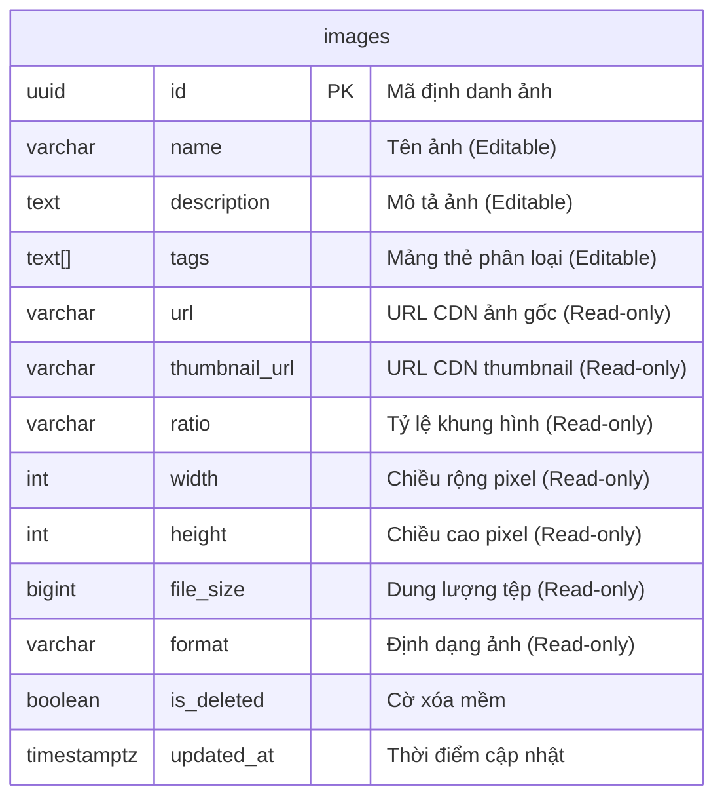

# TDD-023: Sửa ảnh đã lưu lại

## Document Info

- **Feature**: Sửa ảnh đã lưu lại
- **Author**: Hồ Hoàng Nam
- **Reviewer**: Tech Lead
- **Status**: In Review
- **Version**: v0
- **Updated At**: 2026-09-10

## Context & Goals

### Problem

Các hình ảnh được tải lên hoặc sinh tự động bởi Vision AI ([STORY-003](file:///d:/VNZ/document-first-brief/hoa-theo-mua-ai-marketing/UserStory/03-AutoGenerateMultiRatioImagesFromCore.md)) ban đầu chỉ có tên mặc định và chưa có mô tả chi tiết hoặc thẻ phân loại (tags). Quản trị viên cần chỉnh sửa thông tin metadata của ảnh để thuận tiện cho việc tìm kiếm, phân loại và tái sử dụng sau này mà không phải xóa và tạo lại ảnh.

### Goals

- Cho phép Quản trị viên cập nhật thông tin quản trị (Metadata) của hình ảnh đã lưu trong thư viện ([BR-066](../BusinessRules/BR-066.md)):
  - `name` (Bắt buộc): Không được rỗng sau khi trim khoảng trắng, độ dài từ 1 đến 255 ký tự.
  - `description` (Tùy chọn): Mô tả nội dung hình ảnh, tối đa 1.000 ký tự.
  - `tags` (Tùy chọn): Mảng các thẻ từ khóa, mỗi thẻ tối đa 50 ký tự, không chứa khoảng trắng hay ký tự đặc biệt ngoài gạch dưới.
- **Trường chỉ đọc tuyệt đối ([BR-066](../BusinessRules/BR-066.md))**: `id`, `url`, `thumbnail_url`, `ratio`, `width`, `height`, `file_size`, `format`, `user_id`, `created_at` (API tuyệt đối không can thiệp hoặc thay đổi tệp đồ họa gốc).
- **Kiểm soát đồng thời (Optimistic Locking - [BR-067](../BusinessRules/BR-067.md))**: Yêu cầu client gửi kèm `concurrencyToken` (giá trị `updatedAt` tại thời điểm tải dữ liệu). Nếu `updated_at` trong CSDL khác với token gửi lên, từ chối cập nhật và trả về mã lỗi `409 Conflict`.
- Cập nhật `updated_at = NOW()` cùng lần lưu thành công.

### Non-goals

- Không hỗ trợ chỉnh sửa đồ họa, cắt cúp, nén ảnh hay thay đổi tệp hình ảnh trong API này.
- Không cho phép đổi người sở hữu (`user_id`).

## Architecture

* `SavedImageController` tiếp nhận yêu cầu `PUT /api/v1/images/{id}` kèm token xác thực Admin.
* `ValidationActionFilter` kiểm tra quy tắc dữ liệu: `name` từ 1–255 ký tự, `description` <= 1.000 ký tự, định dạng mảng `tags`.
* `SavedImageService` tải bản ghi ảnh từ PostgreSQL theo `id` với điều kiện `is_deleted = false`.
* Kiểm tra Optimistic Lock: So sánh `concurrencyToken` với `updated_at` hiện tại của bản ghi. Nếu có sai lệch, trả về `409 Conflict`.
* Nếu hợp lệ, cập nhật `name`, `description`, `tags` và gán `updated_at = NOW()`, sau đó trả về dữ liệu hình ảnh mới nhất.



**Notes**:
- Thao tác sửa chỉ tác động lên metadata chữ trong CSDL, hoàn toàn không chạm vào tệp ảnh trên Object Storage.
- Giữ nguyên các trường chỉ đọc kỹ thuật để bảo toàn tính toàn vẹn của thư viện ảnh.

## Sequence Diagram

Quản trị viên mở modal chỉnh sửa thông tin ảnh, cập nhật tên/mô tả/thẻ và nhấn "Lưu". Hệ thống kiểm tra Optimistic Locking và cập nhật CSDL.

| Field | Type | Vai trò trong TDD |
| --- | --- | --- |
| `id` | uuid | Khóa chính của ảnh cần sửa, truyền trên URL. |
| `name` | string | Tên ảnh mới (bắt buộc, 1–255 ký tự). |
| `description` | string | Mô tả nội dung ảnh (tùy chọn, tối đa 1.000 ký tự). |
| `tags` | string[] | Mảng thẻ phân loại (mỗi thẻ tối đa 50 ký tự). |
| `concurrencyToken` | timestamp | Chuỗi thời gian `updatedAt` của lần đọc gần nhất dùng chống ghi đè. |
| `updated_at` | timestamp | Thời gian cập nhật mới nhất của bản ghi sau khi lưu. |



## Activity Diagram



## Data Model



**Notes**:
- Chỉ cho phép cập nhật 3 trường: `name`, `description`, `tags`.
- Trường `updated_at` làm nhiệm vụ Concurrency Token để ngăn chặn mất mát dữ liệu do nhiều Admin cùng mở tab sửa.

## Internal API

### Endpoints

| Method | Endpoint | Quyền | Mô tả |
| --- | --- | --- | --- |
| `PUT` | `/api/v1/images/{id:guid}` | Admin | Chỉnh sửa thông tin quản trị (Metadata) của hình ảnh đã lưu. |

### Examples

##### 1. Cập nhật thông tin ảnh thành công (200 OK)

**Request**:
```http
PUT /api/v1/images/7a8b9c0d-1e2f-4896-bf1d-0fdbae881a28
Authorization: Bearer <Admin_Token>
Content-Type: application/json

{
  "name": "Bó Hồng Ecuador Mùa Thu - Bản Banner 9:16 Chính Thức",
  "description": "Ảnh banner Story được chụp và render bằng AI phục vụ chiến dịch Black Friday 2026.",
  "tags": [
    "hong_ecuador",
    "autumn_vibes",
    "black_friday_2026"
  ],
  "concurrencyToken": "2026-09-09T12:11:00.1234567Z"
}
```

**Response 200**:
```json
{
  "value": {
    "id": "7a8b9c0d-1e2f-4896-bf1d-0fdbae881a28",
    "name": "Bó Hồng Ecuador Mùa Thu - Bản Banner 9:16 Chính Thức",
    "description": "Ảnh banner Story được chụp và render bằng AI phục vụ chiến dịch Black Friday 2026.",
    "tags": [
      "hong_ecuador",
      "autumn_vibes",
      "black_friday_2026"
    ],
    "ratio": "9:16",
    "updatedAt": "2026-09-09T12:40:00.1234567Z"
  },
  "isSuccess": true,
  "isFailed": false,
  "error": null,
  "traceId": "0HNOE4G1GRT23:00000001",
  "timestampUtc": "2026-09-09T12:40:00.1234567Z"
}
```

##### 2. Xung đột phiên bản khi lưu (409 Conflict)

**Request**:
```http
PUT /api/v1/images/7a8b9c0d-1e2f-4896-bf1d-0fdbae881a28
Authorization: Bearer <Admin_Token>
Content-Type: application/json

{
  "name": "Bó Hồng Ecuador Mùa Thu - Bản Banner 9:16",
  "description": "Ảnh banner Story cập nhật.",
  "tags": [
    "hong_ecuador"
  ],
  "concurrencyToken": "2026-09-01T10:00:00.0000000Z"
}
```

**Response 409 (Error)**:
```json
{
  "isSuccess": false,
  "isFailed": true,
  "value": null,
  "error": {
    "code": "CONCURRENCY_CONFLICT",
    "message": "Thông tin ảnh đã bị sửa đổi bởi một quản trị viên khác. Vui lòng tải lại trang để nhận dữ liệu mới nhất."
  },
  "traceId": "0HNOE4G1GRT23:00000002",
  "timestampUtc": "2026-09-09T12:40:10.0000000Z"
}
```

##### 3. Tên ảnh rỗng hoặc không hợp lệ (422 Unprocessable Entity)

**Request**:
```http
PUT /api/v1/images/7a8b9c0d-1e2f-4896-bf1d-0fdbae881a28
Authorization: Bearer <Admin_Token>
Content-Type: application/json

{
  "name": "",
  "description": "Mô tả hợp lệ nhưng tên rỗng.",
  "tags": [],
  "concurrencyToken": "2026-09-09T12:11:00.1234567Z"
}
```

**Response 422 (Error)**:
```json
{
  "isSuccess": false,
  "isFailed": true,
  "value": null,
  "error": {
    "code": "VALIDATION_ERROR",
    "message": "Dữ liệu đầu vào không hợp lệ.",
    "details": [
      {
        "field": "name",
        "message": "Tên ảnh không được để trống và phải có độ dài từ 1 đến 255 ký tự."
      }
    ]
  },
  "traceId": "0HNOE4G1GRT23:00000003",
  "timestampUtc": "2026-09-09T12:40:20.0000000Z"
}
```

### Error Codes

| Code | HTTP Status | Khi nào xảy ra |
| --- | :---: | --- |
| `UNAUTHORIZED` | 401 | Yêu cầu không có token hoặc token đã hết hạn. |
| `FORBIDDEN` | 403 | Người dùng không có quyền Quản trị viên (Admin). |
| `IMAGE_NOT_FOUND` | 404 | Ảnh không tồn tại hoặc đã bị xóa mềm (`is_deleted = true`). |
| `CONCURRENCY_CONFLICT` | 409 | `concurrencyToken` không khớp với `updated_at` hiện thời của bản ghi ([BR-067](../BusinessRules/BR-067.md)). |
| `VALIDATION_ERROR` | 422 | Tên ảnh để trống, vượt quá 255 ký tự, hoặc mô tả vượt quá 1.000 ký tự ([BR-066](../BusinessRules/BR-066.md)). |
| `INTERNAL_SERVER_ERROR` | 500 | Lỗi kết nối CSDL hoặc lỗi hệ thống không xác định. |

## References

### User Stories

- [STORY-023: Sửa ảnh đã lưu lại](file:///d:/VNZ/document-first-brief/hoa-theo-mua-ai-marketing/UserStory/23-UpdateSavedImageInfo.md)

### Business Rules

- [BR-066: Phạm vi chỉnh sửa ảnh](file:///d:/VNZ/document-first-brief/hoa-theo-mua-ai-marketing/BusinessRules/BR-066.md)
- [BR-067: Không ghi đè ảnh đã thay đổi trong lúc sửa](file:///d:/VNZ/document-first-brief/hoa-theo-mua-ai-marketing/BusinessRules/BR-067.md)

### Use Cases

- Không áp dụng.

### Others

- Không áp dụng.

## Change Log

| Phiên bản | Ngày | Tác giả | Tóm tắt thay đổi |
| --- | --- | --- | --- |
| v0 | 2026-09-10 | Hồ Hoàng Nam | Khởi tạo tài liệu thiết kế kỹ thuật Sửa thông tin ảnh đã lưu theo chuẩn Document-First. |
