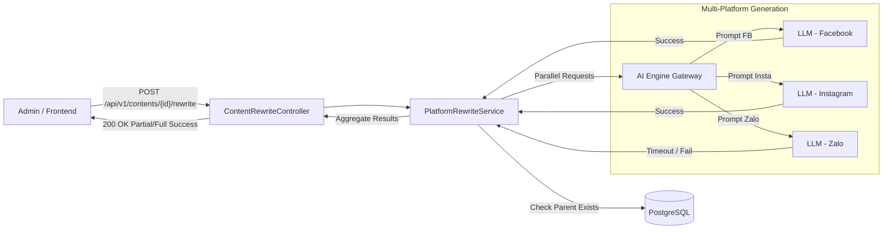
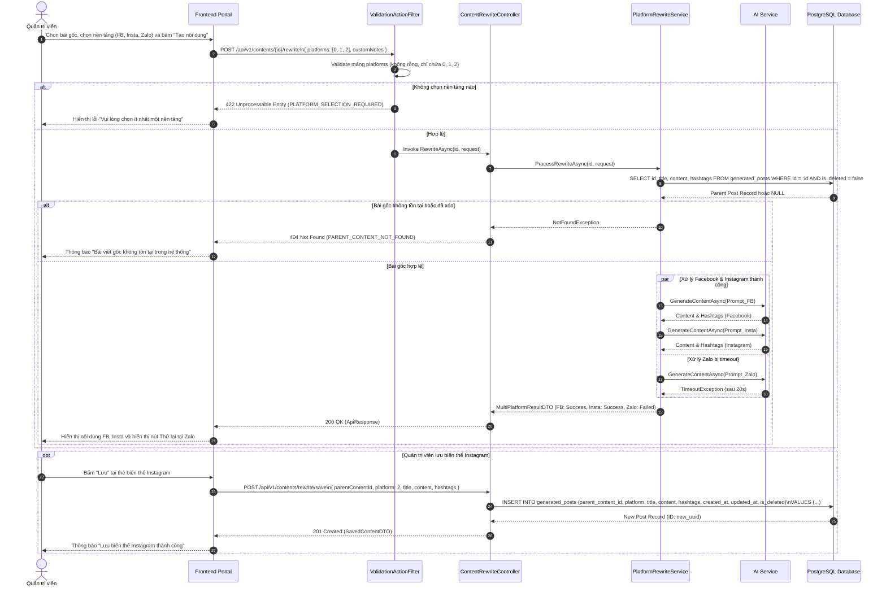
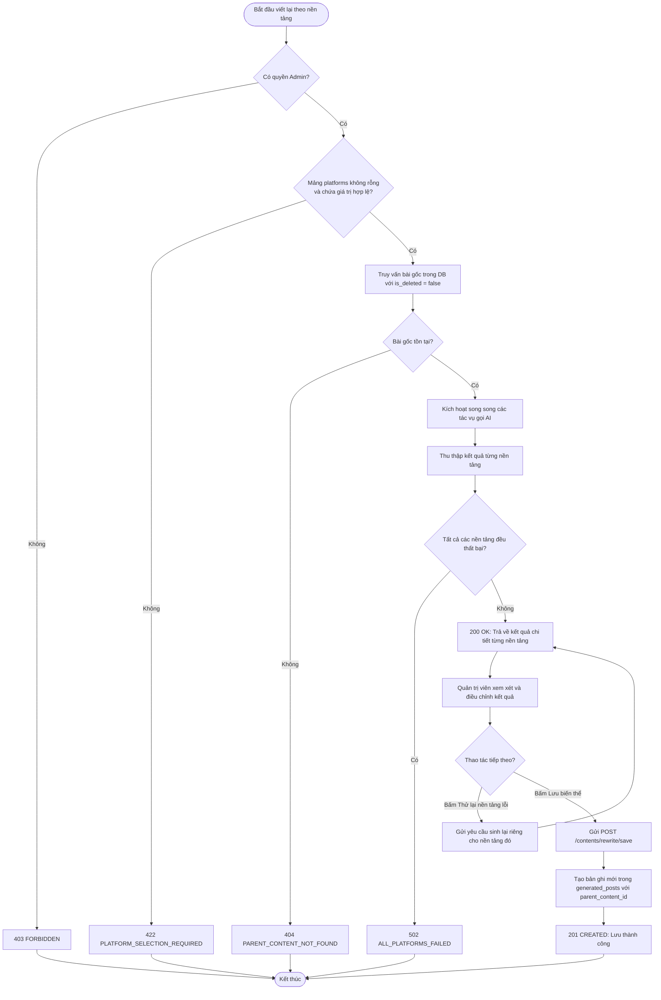
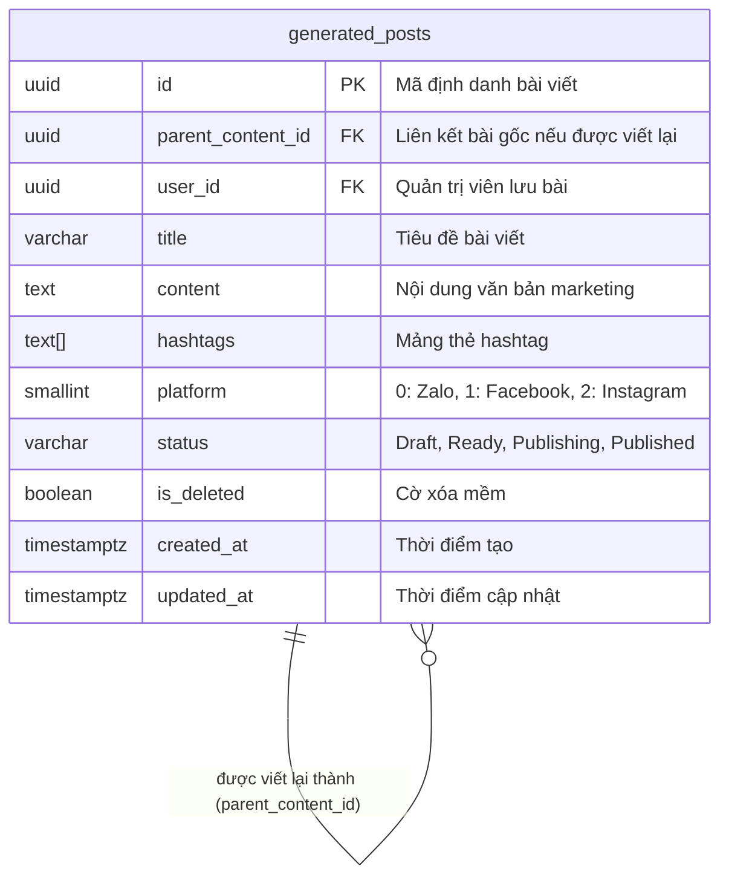

# TDD-024: Tự động viết lại nội dung theo từng nền tảng

## Document Info

- **Feature**: Tự động viết lại nội dung theo từng nền tảng
- **Author**: Hồ Hoàng Nam
- **Reviewer**: Tech Lead
- **Status**: In Review
- **Version**: v0
- **Updated At**: 2026-09-10

## Context & Goals

### Problem

Một bài viết marketing hoa tươi gốc thường cần được truyền tải trên nhiều kênh (Facebook, Instagram, Zalo OA). Mỗi nền tảng có đặc thù văn phong, độ dài tối ưu, thói quen đọc và mật độ hashtag khác nhau. Việc viết lại thủ công từng nền tảng gây tốn thời gian và dễ làm sai lệch thông điệp cốt lõi của chiến dịch.

### Goals

- Cho phép Quản trị viên chọn một bài viết đã lưu (`parent_content_id`) và chọn một hoặc nhiều nền tảng mục tiêu (`facebook`, `instagram`, `zalo`).
- Sử dụng mô hình AI kết hợp System Prompt chuyên biệt để chuyển thể nội dung gốc thành các biến thể phù hợp chuẩn nền tảng ([BR-068](../BusinessRules/BR-068.md), [BR-069](../BusinessRules/BR-069.md)):
  - **Facebook (1)**: Độ dài trung bình, văn phong thân thiện, chú trọng kể chuyện (storytelling) và kêu gọi hành động (CTA), kèm 3–5 hashtag.
  - **Instagram (2)**: Tập trung cảm xúc, thẩm mỹ thị giác, ngắt dòng nhịp nhàng, kèm 10–25 hashtag thịnh hành.
  - **Zalo OA (0)**: Ngắn gọn, súc tích, văn phong chăm sóc khách hàng trang trọng, tập trung vào ưu đãi và hotline đặt hoa, kèm 1–3 hashtag.
- Hỗ trợ cơ chế sinh song song độc lập (Parallel Independent Calls): Khi một nền tảng bị lỗi kết nối hoặc timeout AI, các nền tảng khác vẫn hoàn thành bình thường ([BR-070](../BusinessRules/BR-070.md)).
- Cho phép Quản trị viên xem trước, tinh chỉnh nội dung và danh sách hashtag trước khi quyết định lưu.
- Lưu biến thể thành một bản ghi hoàn toàn mới trong `generated_posts`, gán `parent_content_id` trỏ về bài gốc, tuyệt đối không ghi đè dữ liệu bài gốc ([BR-071](../BusinessRules/BR-071.md)).

### Non-goals

- Không tự động đăng tải bài viết lên mạng xã hội ngay tại chức năng này (thuộc STORY-002).
- Không tự động sinh hình ảnh quảng cáo kèm theo (thuộc STORY-003).
- Không thay đổi nội dung của bài viết gốc.

## Architecture

* `ContentRewriteController` tiếp nhận yêu cầu chuyển thể qua `POST /api/v1/contents/{id}/rewrite` và lưu biến thể qua `POST /api/v1/contents/rewrite/save`.
* `PlatformRewriteService` kiểm tra bài viết gốc trong PostgreSQL (`is_deleted = false`).
* Nạp System Prompt phù hợp từ bảng `system_prompts` (`type = 2: Post`) và thiết lập cấu hình tham số theo từng nền tảng (`PlatformType`).
* Gửi đồng thời các yêu cầu sinh văn bản qua `Task.WhenAll` tới AI Service với cơ chế timeout riêng biệt (20 giây mỗi nền tảng).
* Tổng hợp kết quả trả về cho Client theo từng nền tảng (`SUCCESS` hoặc `FAILED`).
* Khi Quản trị viên bấm lưu biến thể, `SavedContentService` tạo bản ghi mới trong `generated_posts` kèm `parent_content_id`.



**Notes**:
- Mỗi tác vụ sinh nền tảng được bọc trong khối `try/catch` riêng để bảo đảm lỗi ở một nền tảng không làm hỏng kết quả của các nền tảng khác.
- Dữ liệu trả về ở bước rewrite chỉ là bản nháp tạm thời trên giao diện, chỉ được ghi vào CSDL khi người dùng nhấn "Lưu".

## Sequence Diagram

Quản trị viên chọn bài viết gốc, tích chọn các nền tảng muốn chuyển thể và bấm "Tạo nội dung". Sau khi xem xét kết quả, Quản trị viên có thể bấm "Lưu" từng biến thể mong muốn.

| Field | Type | Vai trò trong TDD |
| --- | --- | --- |
| `id` | uuid | Khóa chính của bài viết gốc, truyền trên URL. |
| `platforms` | int[] | Danh sách mã nền tảng mục tiêu (`0: Zalo`, `1: Facebook`, `2: Instagram`). |
| `customNotes` | string | Ghi chú thêm cho AI để điều chỉnh văn phong (tùy chọn). |
| `parent_content_id` | uuid | Khóa ngoại trỏ về bài viết gốc khi lưu biến thể mới. |
| `content` | text | Nội dung marketing đã được chuyển thể cho nền tảng. |
| `hashtags` | string[] | Danh sách hashtag tối ưu riêng cho nền tảng đó. |



## Activity Diagram



## Data Model



**Notes**:
- `parent_content_id` cho phép truy vết nguồn gốc bài viết và phân tích hiệu quả của cùng một thông điệp trên các kênh khác nhau.
- Các biến thể là các thực thể độc lập; việc sửa hoặc xóa bài gốc không làm biến mất biến thể (trừ khi có nghiệp vụ cascade xóa mềm có chủ đích).

## Internal API

### Endpoints

| Method | Endpoint | Quyền | Mô tả |
| --- | --- | --- | --- |
| `POST` | `/api/v1/contents/{id:guid}/rewrite` | Admin | Gọi AI viết lại nội dung từ bài viết gốc cho các nền tảng mục tiêu. |
| `POST` | `/api/v1/contents/rewrite/save` | Admin | Lưu biến thể bài viết đã hoàn thiện thành bản ghi content mới. |

### Examples

##### 1. Viết lại nội dung cho Facebook, Instagram và Zalo (200 OK)

**Request**:
```http
POST /api/v1/contents/c3d4e5f6-a1b2-4896-bf1d-0fdbae881a28/rewrite
Authorization: Bearer <Admin_Token>
Content-Type: application/json

{
  "platforms": [1, 2, 0],
  "customNotes": "Nhấn mạnh chương trình freeship nội thành khi đặt hoa trước 24h."
}
```

**Response 200**:
```json
{
  "value": {
    "parentContentId": "c3d4e5f6-a1b2-4896-bf1d-0fdbae881a28",
    "results": [
      {
        "platform": 1,
        "status": "SUCCESS",
        "content": "Sắc thu dịu dàng tràn ngập từng cánh hoa hồng Ecuador... Tặng kèm thiệp viết tay và Freeship toàn bộ nội thành hôm nay! Đặt ngay!",
        "hashtags": [
          "#HoaTheoMua",
          "#HongEcuador",
          "#FreeshipHoa"
        ],
        "errorMessage": null
      },
      {
        "platform": 2,
        "status": "SUCCESS",
        "content": "Autumn in every petal ✨ Sắc đỏ kiêu sa của đóa hồng Ecuador.\n.\n.\nInbox Hoa Theo Mùa nhận ưu đãi freeship ngay!",
        "hashtags": [
          "#hoatheomua",
          "#flowerlovers",
          "#ecuadorroses",
          "#autumnvibes",
          "#saigonflorist"
        ],
        "errorMessage": null
      },
      {
        "platform": 0,
        "status": "FAILED",
        "content": null,
        "hashtags": [],
        "errorMessage": "AI Engine timeout sau 20s"
      }
    ]
  },
  "isSuccess": true,
  "isFailed": false,
  "error": null,
  "traceId": "0HNOE4G1GRT24:00000001",
  "timestampUtc": "2026-09-09T12:05:00.1234567Z"
}
```

##### 2. Lưu biến thể Instagram thành bài viết mới (201 Created)

**Request**:
```http
POST /api/v1/contents/rewrite/save
Authorization: Bearer <Admin_Token>
Content-Type: application/json

{
  "parentContentId": "c3d4e5f6-a1b2-4896-bf1d-0fdbae881a28",
  "platform": 2,
  "title": "Hồng Ecuador Mùa Thu (Instagram)",
  "content": "Autumn in every petal ✨ Sắc đỏ kiêu sa của đóa hồng Ecuador.\n.\n.\nInbox Hoa Theo Mùa nhận ưu đãi freeship ngay!",
  "hashtags": [
    "#hoatheomua",
    "#flowerlovers",
    "#ecuadorroses",
    "#autumnvibes",
    "#saigonflorist"
  ]
}
```

**Response 201**:
```json
{
  "value": {
    "id": "e5f6a1b2-c3d4-4896-bf1d-0fdbae881a28",
    "parentContentId": "c3d4e5f6-a1b2-4896-bf1d-0fdbae881a28",
    "platform": 2,
    "title": "Hồng Ecuador Mùa Thu (Instagram)",
    "content": "Autumn in every petal ✨ Sắc đỏ kiêu sa của đóa hồng Ecuador.\n.\n.\nInbox Hoa Theo Mùa nhận ưu đãi freeship ngay!",
    "hashtags": [
      "#hoatheomua",
      "#flowerlovers",
      "#ecuadorroses",
      "#autumnvibes",
      "#saigonflorist"
    ],
    "createdAt": "2026-09-09T12:06:00.1234567Z"
  },
  "isSuccess": true,
  "isFailed": false,
  "error": null,
  "traceId": "0HNOE4G1GRT24:00000002",
  "timestampUtc": "2026-09-09T12:06:00.1234567Z"
}
```

##### 3. Thất bại khi không chọn nền tảng nào (422 Unprocessable Entity)

**Request**:
```http
POST /api/v1/contents/c3d4e5f6-a1b2-4896-bf1d-0fdbae881a28/rewrite
Authorization: Bearer <Admin_Token>
Content-Type: application/json

{
  "platforms": [],
  "customNotes": ""
}
```

**Response 422 (Error)**:
```json
{
  "isSuccess": false,
  "isFailed": true,
  "value": null,
  "error": {
    "code": "PLATFORM_SELECTION_REQUIRED",
    "message": "Vui lòng chọn ít nhất một nền tảng mục tiêu để viết lại nội dung."
  },
  "traceId": "0HNOE4G1GRT24:00000003",
  "timestampUtc": "2026-09-09T12:07:00.0000000Z"
}
```

### Error Codes

| Code | HTTP Status | Khi nào xảy ra |
| --- | :---: | --- |
| `UNAUTHORIZED` | 401 | Yêu cầu không có token hoặc token đã hết hạn. |
| `FORBIDDEN` | 403 | Người dùng không có quyền Quản trị viên (Admin). |
| `PARENT_CONTENT_NOT_FOUND` | 404 | Bài viết gốc không tồn tại hoặc đã bị xóa mềm (`is_deleted = true`). |
| `PLATFORM_SELECTION_REQUIRED` | 422 | Danh sách nền tảng rỗng hoặc chứa giá trị không hợp lệ. |
| `ALL_PLATFORMS_FAILED` | 502 | Tất cả các yêu cầu gọi AI cho các nền tảng đều thất bại hoặc timeout. |
| `INTERNAL_SERVER_ERROR` | 500 | Lỗi lưu bản ghi biến thể vào CSDL PostgreSQL. |

## External API

Hệ thống tích hợp LLM Gateway (OpenAI GPT-4o / Google Gemini 1.5 Pro) để thực hiện chuyển thể nội dung.

- **Request**:
  - `model`: Tên mô hình (ví dụ: `gemini-1.5-pro` hoặc `gpt-4o`).
  - `temperature`: 0.7 (độ sáng tạo vừa phải, đảm bảo chuẩn văn phong).
  - `messages`: Bao gồm System Prompt định dạng chuẩn cho từng nền tảng và User Prompt chứa nội dung bài gốc kèm ghi chú của Quản trị viên.
- **Timeout**: Thiết lập 20 giây tối đa cho mỗi tác vụ nền tảng độc lập.

## References

### User Stories

- [STORY-024: Viết lại nội dung theo từng nền tảng](file:///d:/VNZ/document-first-brief/hoa-theo-mua-ai-marketing/UserStory/24-RewriteContentByPlatform.md)

### Business Rules

- [BR-068: Chuyển thể nội dung chuẩn nền tảng](file:///d:/VNZ/document-first-brief/hoa-theo-mua-ai-marketing/BusinessRules/BR-068.md)
- [BR-069: Điều chỉnh bộ hashtag theo nền tảng](file:///d:/VNZ/document-first-brief/hoa-theo-mua-ai-marketing/BusinessRules/BR-069.md)
- [BR-070: Xử lý độc lập đa nền tảng](file:///d:/VNZ/document-first-brief/hoa-theo-mua-ai-marketing/BusinessRules/BR-070.md)
- [BR-071: Bảo toàn bài viết gốc khi lưu biến thể](file:///d:/VNZ/document-first-brief/hoa-theo-mua-ai-marketing/BusinessRules/BR-071.md)

### Use Cases

- Không áp dụng.

### Others

- Enum `HoaTheoMua.Repository.Enum.PlatformType`: `Zalo = 0`, `Facebook = 1`, `Instagram = 2`.
- Enum `HoaTheoMua.Repository.Enum.SystemPromptType`: `Flower = 0`, `Card = 1`, `Post = 2`.

## Change Log

| Phiên bản | Ngày | Tác giả | Tóm tắt thay đổi |
| --- | --- | --- | --- |
| v0 | 2026-09-10 | Hồ Hoàng Nam | Khởi tạo tài liệu thiết kế kỹ thuật Viết lại nội dung theo từng nền tảng theo chuẩn Document-First. |
