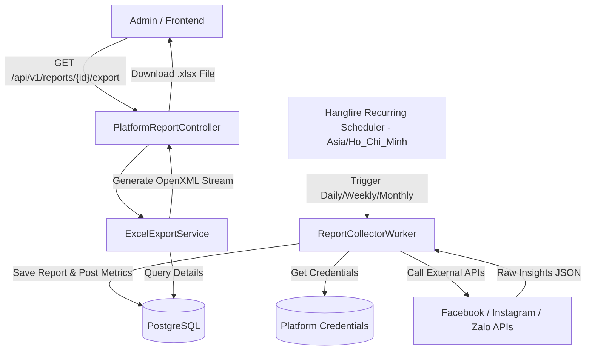
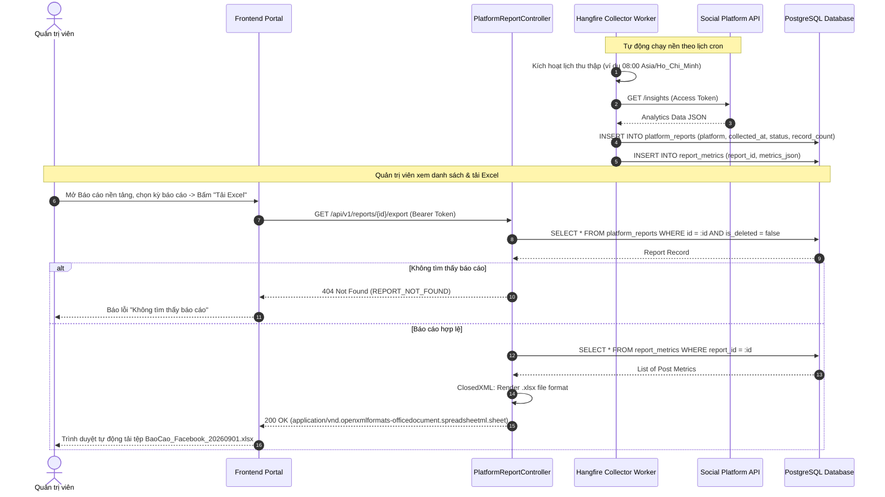
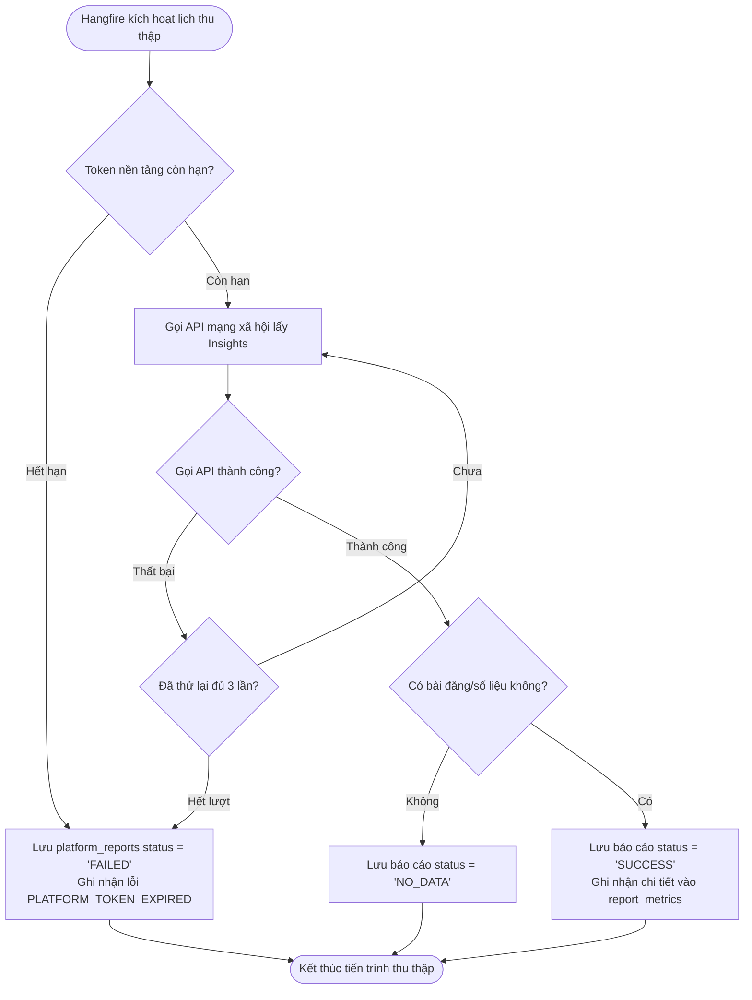
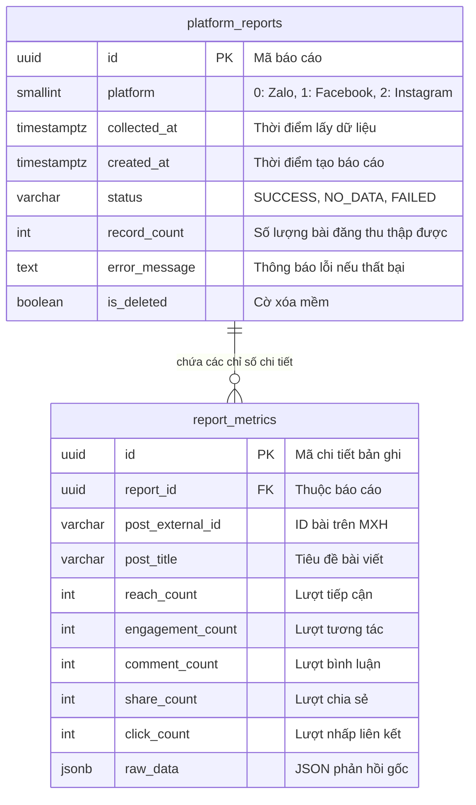

# TDD-025: Thu thập và quản lý báo cáo từ các nền tảng

## Document Info

- **Feature**: Thu thập và quản lý báo cáo từ các nền tảng
- **Author**: Hồ Hoàng Nam
- **Reviewer**: Tech Lead
- **Status**: In Review
- **Version**: v0
- **Updated At**: 2026-09-10

## Context & Goals

### Problem

Để đánh giá hiệu quả tiếp thị của các bài đăng hoa tươi, Quản trị viên phải đăng nhập thủ công vào từng trang quản trị của Facebook Page, Instagram Professional và Zalo OA để xem số liệu tương tác (lượt tiếp cận, tương tác, bình luận, nhấp chuột). Việc này tốn nhiều nhân lực và dễ sai sót. Cần một hệ thống thu thập tự động theo lịch cấu hình linh hoạt và hỗ trợ xuất file Excel (.xlsx) chuẩn hóa để phục vụ báo cáo nội bộ.

### Goals

- Cấu hình lịch thu thập báo cáo độc lập cho từng nền tảng (`facebook`, `instagram`, `zalo`) theo múi giờ `Asia/Ho_Chi_Minh` ([BR-072](../BusinessRules/BR-072.md), [BR-073](../BusinessRules/BR-073.md)):
  - **Hằng ngày**: Chỉ định giờ thực hiện (ví dụ: `08:00`).
  - **Hằng tuần**: Chỉ định thứ trong tuần và giờ (ví dụ: `Thứ Hai`, `09:00`).
  - **Hằng tháng**: Chỉ định ngày trong tháng (1–31) và giờ. Nếu ngày cấu hình không tồn tại trong tháng (ví dụ ngày 31 trong tháng có 30 ngày, hoặc ngày 29/30/31 trong tháng 2 năm thường), hệ thống tự động chạy vào ngày cuối cùng của tháng đó mà không làm thay đổi cấu hình gốc ([BR-074](../BusinessRules/BR-074.md)).
- Tự động gọi API nền tảng bằng Hangfire Recurring Job để thu thập dữ liệu tiếp thị (Reach, Impressions, Engagements, Shares, Comments, Clicks) ([BR-075](../BusinessRules/BR-075.md)).
- Tổng hợp và lưu trữ báo cáo vào bảng `platform_reports` kèm: Nền tảng, thời điểm thu thập, thời điểm tạo, số lượng bản ghi và trạng thái (`SUCCESS`, `NO_DATA`, `FAILED`) ([BR-076](../BusinessRules/BR-076.md)).
- Cung cấp API cho Quản trị viên:
  - Xem danh sách báo cáo có phân trang, lọc theo nền tảng và thời gian ([BR-077](../BusinessRules/BR-077.md)).
  - Xem chi tiết dữ liệu báo cáo ở chế độ Read-only ([BR-078](../BusinessRules/BR-078.md)).
  - Tải file báo cáo định dạng bảng tính **Excel (.xlsx)** ([BR-079](../BusinessRules/BR-079.md)).

### Non-goals

- Không tổng hợp số liệu giữa nhiều nền tảng thành một chỉ số dashboard duy nhất trong tài liệu này.
- Không hiển thị đồ thị biểu đồ trực quan hóa số liệu.
- Không cho phép sửa đổi số liệu thống kê thu thập từ API nền tảng.

## Architecture

* `ReportCollectorWorker` (Hangfire): Chạy định kỳ theo lịch cron (múi giờ `Asia/Ho_Chi_Minh`), đọc Access Token từ bảng cấu hình, gọi API nền tảng tương ứng (Facebook Graph, Instagram Graph, Zalo OA).
* Lưu kết quả vào bảng `platform_reports` và chi tiết các bài viết vào `report_metrics`.
* `PlatformReportController` cung cấp các API đọc danh sách, xem chi tiết và xuất file Excel.
* `ExcelExportService` sử dụng `ClosedXML` để dựng luồng dữ liệu nhị phân chuẩn định dạng `.xlsx` với tiêu đề cột rõ ràng và định dạng số tự động.



**Notes**:
- Tiến trình chạy ngầm Hangfire có chính sách retry tự động tối đa 3 lần nếu gặp sự cố mạng tạm thời từ máy chủ mạng xã hội.
- Dữ liệu chi tiết lưu dạng JSONB linh hoạt để tương thích với các trường chỉ số đặc thù của từng mạng xã hội.

## Sequence Diagram

Worker tự động chạy nền thu thập số liệu vào đầu ngày. Khi Quản trị viên cần báo cáo, họ mở danh sách báo cáo và bấm "Tải Excel (.xlsx)".

| Field | Type | Vai trò trong TDD |
| --- | --- | --- |
| `id` | uuid | Khóa chính của báo cáo thu thập. |
| `platform` | smallint | Nền tảng mạng xã hội (`0: Zalo`, `1: Facebook`, `2: Instagram`). |
| `collected_at` | timestamp | Thời điểm dữ liệu được chốt từ API đối tác. |
| `status` | string | Trạng thái báo cáo (`SUCCESS`, `NO_DATA`, `FAILED`). |
| `record_count` | int | Số lượng bài đăng thu thập được chỉ số. |



## Activity Diagram



## Data Model



**Notes**:
- Báo cáo thu thập tự động là Read-only, không cung cấp API cập nhật số liệu.
- Quản trị viên chỉ có quyền xem danh sách, xem chi tiết, xuất file Excel hoặc xóa báo cáo.

## Internal API

### Endpoints

| Method | Endpoint | Quyền | Mô tả |
| --- | --- | --- | --- |
| `GET` | `/api/v1/reports` | Admin | Lấy danh sách phân trang các báo cáo đã thu thập theo nền tảng và thời gian. |
| `GET` | `/api/v1/reports/{id:guid}` | Admin | Xem chi tiết thông tin và các chỉ số đo lường của một báo cáo. |
| `GET` | `/api/v1/reports/{id:guid}/export` | Admin | Xuất toàn bộ dữ liệu báo cáo ra tệp bảng tính Excel (.xlsx). |

### Examples

##### 1. Lấy danh sách báo cáo thành công (200 OK)

**Request**:
```http
GET /api/v1/reports?platform=1&status=SUCCESS&page=1&pageSize=10
Authorization: Bearer <Admin_Token>
```

**Response 200**:
```json
{
  "value": {
    "items": [
      {
        "id": "e1f2a3b4-c5d6-4896-bf1d-0fdbae881a28",
        "platform": 1,
        "collectedAt": "2026-09-01T08:00:00.0000000Z",
        "createdAt": "2026-09-01T08:00:15.0000000Z",
        "status": "SUCCESS",
        "recordCount": 15,
        "errorMessage": null
      }
    ],
    "page": 1,
    "pageSize": 10,
    "totalCount": 1,
    "totalPages": 1
  },
  "isSuccess": true,
  "isFailed": false,
  "error": null,
  "traceId": "0HNOE4G1GRT25:00000001",
  "timestampUtc": "2026-09-09T12:45:00.1234567Z"
}
```

##### 2. Xem chi tiết một báo cáo thành công (200 OK)

**Request**:
```http
GET /api/v1/reports/e1f2a3b4-c5d6-4896-bf1d-0fdbae881a28
Authorization: Bearer <Admin_Token>
```

**Response 200**:
```json
{
  "value": {
    "id": "e1f2a3b4-c5d6-4896-bf1d-0fdbae881a28",
    "title": "Báo cáo số liệu Facebook Fanpage - Tháng 09/2026",
    "platform": 1,
    "collectedAt": "2026-09-01T08:00:00.0000000Z",
    "createdAt": "2026-09-01T08:00:15.0000000Z",
    "status": "SUCCESS",
    "recordCount": 2,
    "metricsSummary": {
      "totalReach": 45200,
      "totalEngagement": 3150,
      "totalComments": 420,
      "totalShares": 180,
      "totalClicks": 890,
      "averageEngagementRate": 6.97
    },
    "metrics": [
      {
        "id": "a1b2c3d4-e5f6-4896-bf1d-0fdbae881a01",
        "postExternalId": "fb_post_987654321",
        "postTitle": "Bó hồng Ecuador mùa thu ấm áp",
        "reachCount": 25000,
        "engagementCount": 1800,
        "commentCount": 250,
        "shareCount": 100,
        "clickCount": 520,
        "engagementRate": 7.20
      },
      {
        "id": "a1b2c3d4-e5f6-4896-bf1d-0fdbae881a02",
        "postExternalId": "fb_post_987654322",
        "postTitle": "Khai trương chi nhánh hoa tươi mới",
        "reachCount": 20200,
        "engagementCount": 1350,
        "commentCount": 170,
        "shareCount": 80,
        "clickCount": 370,
        "engagementRate": 6.68
      }
    ],
    "exportFileUrl": "https://cdn.hoatheomua.vn/reports/BaoCao_Facebook_20260901.xlsx",
    "errorMessage": null
  },
  "isSuccess": true,
  "isFailed": false,
  "error": null,
  "traceId": "0HNOE4G1GRT25:00000002",
  "timestampUtc": "2026-09-09T12:45:05.1234567Z"
}
```

##### 3. Không tìm thấy báo cáo theo ID (404 Not Found)

**Request**:
```http
GET /api/v1/reports/00000000-0000-0000-0000-000000000000
Authorization: Bearer <Admin_Token>
```

**Response 404 (Error)**:
```json
{
  "isSuccess": false,
  "isFailed": true,
  "value": null,
  "error": {
    "code": "REPORT_NOT_FOUND",
    "message": "Báo cáo theo mã định danh không tồn tại trong hệ thống hoặc đã bị xóa."
  },
  "traceId": "0HNOE4G1GRT25:00000003",
  "timestampUtc": "2026-09-09T12:45:08.0000000Z"
}
```

##### 4. Tải tệp Excel báo cáo thành công (200 OK)

**Request**:
```http
GET /api/v1/reports/e1f2a3b4-c5d6-4896-bf1d-0fdbae881a28/export
Authorization: Bearer <Admin_Token>
```

**Response 200**:
- **Headers**:
  - `Content-Type`: `application/vnd.openxmlformats-officedocument.spreadsheetml.sheet`
  - `Content-Disposition`: `attachment; filename="BaoCao_Facebook_20260901.xlsx"`
- **Body**: Binary Stream của tệp Excel (.xlsx).

##### 5. Báo cáo không có dữ liệu để xuất (422 Unprocessable Entity)

**Request**:
```http
GET /api/v1/reports/e1f2a3b4-c5d6-4896-bf1d-0fdbae881a28/export
Authorization: Bearer <Admin_Token>
```

**Response 422 (Error)**:
```json
{
  "isSuccess": false,
  "isFailed": true,
  "value": null,
  "error": {
    "code": "REPORT_NO_DATA_TO_EXPORT",
    "message": "Báo cáo ở trạng thái không có dữ liệu (NO_DATA) hoặc thu thập thất bại, không thể kết xuất tệp Excel."
  },
  "traceId": "0HNOE4G1GRT25:00000004",
  "timestampUtc": "2026-09-09T12:45:10.0000000Z"
}
```

### Error Codes

| Code | HTTP Status | Khi nào xảy ra |
| --- | :---: | --- |
| `UNAUTHORIZED` | 401 | Yêu cầu không có token hoặc token đã hết hạn. |
| `FORBIDDEN` | 403 | Người dùng không có quyền Quản trị viên (Admin). |
| `REPORT_NOT_FOUND` | 404 | Báo cáo không tồn tại hoặc đã bị xóa mềm (`is_deleted = true`). |
| `REPORT_NO_DATA_TO_EXPORT` | 422 | Báo cáo ở trạng thái `NO_DATA` hoặc `FAILED` ([BR-079](../BusinessRules/BR-079.md)). |
| `PLATFORM_TOKEN_EXPIRED` | 502 | Token truy cập của trang mạng xã hội đã hết hạn trong quá trình worker chạy ngầm. |
| `EXPORT_FAILED` | 500 | Lỗi kết xuất bảng tính Excel trong quá trình xử lý luồng nhị phân. |

## External API

### 1. Meta Graph API (Facebook Page & Instagram Business)
- **Endpoint**: `GET https://graph.facebook.com/v19.0/{page-id}/insights`
- **Metrics**: `page_impressions`, `page_engaged_users`, `page_posts_impressions`, `post_reactions_by_type_total`.
- **Authorization**: Page Access Token dài hạn.

### 2. Zalo Official Account API
- **Endpoint**: `GET https://openapi.zalo.me/v2.0/oa/statistic/article`
- **Headers**: `access_token: <OA_Access_Token>`
- **Metrics**: Lượt xem bài viết, lượt chia sẻ nhật ký, lượt tương tác tin nhắn.

## References

### User Stories

- [STORY-025: Thu thập và quản lý báo cáo từ các nền tảng](file:///d:/VNZ/document-first-brief/hoa-theo-mua-ai-marketing/UserStory/25-CollectAndManagePlatformReports.md)

### Business Rules

- [BR-072: Lịch thu thập độc lập theo nền tảng](file:///d:/VNZ/document-first-brief/hoa-theo-mua-ai-marketing/BusinessRules/BR-072.md)
- [BR-073: Múi giờ thu thập báo cáo](file:///d:/VNZ/document-first-brief/hoa-theo-mua-ai-marketing/BusinessRules/BR-073.md)
- [BR-074: Xử lý ngày cấu hình không tồn tại trong tháng](file:///d:/VNZ/document-first-brief/hoa-theo-mua-ai-marketing/BusinessRules/BR-074.md)
- [BR-075: Các loại lịch thu thập hỗ trợ](file:///d:/VNZ/document-first-brief/hoa-theo-mua-ai-marketing/BusinessRules/BR-075.md)
- [BR-076: Lưu trữ báo cáo đã thu thập](file:///d:/VNZ/document-first-brief/hoa-theo-mua-ai-marketing/BusinessRules/BR-076.md)
- [BR-077: Xem danh sách báo cáo](file:///d:/VNZ/document-first-brief/hoa-theo-mua-ai-marketing/BusinessRules/BR-077.md)
- [BR-078: Xem chi tiết báo cáo](file:///d:/VNZ/document-first-brief/hoa-theo-mua-ai-marketing/BusinessRules/BR-078.md)
- [BR-079: Xuất báo cáo dạng bảng tính](file:///d:/VNZ/document-first-brief/hoa-theo-mua-ai-marketing/BusinessRules/BR-079.md)

### Use Cases

- Không áp dụng.

### Others

- Enum `HoaTheoMua.Repository.Enum.PlatformType`: `Zalo = 0`, `Facebook = 1`, `Instagram = 2`.
- Định dạng xuất tệp: Microsoft Excel (.xlsx) chuẩn OpenXML.

## Change Log

| Phiên bản | Ngày | Tác giả | Tóm tắt thay đổi |
| --- | --- | --- | --- |
| v0 | 2026-09-10 | Hồ Hoàng Nam | Khởi tạo tài liệu thiết kế kỹ thuật Thu thập và quản lý báo cáo từ các nền tảng theo chuẩn Document-First. |
