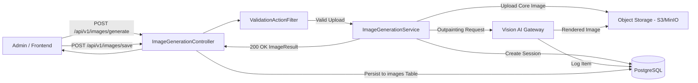
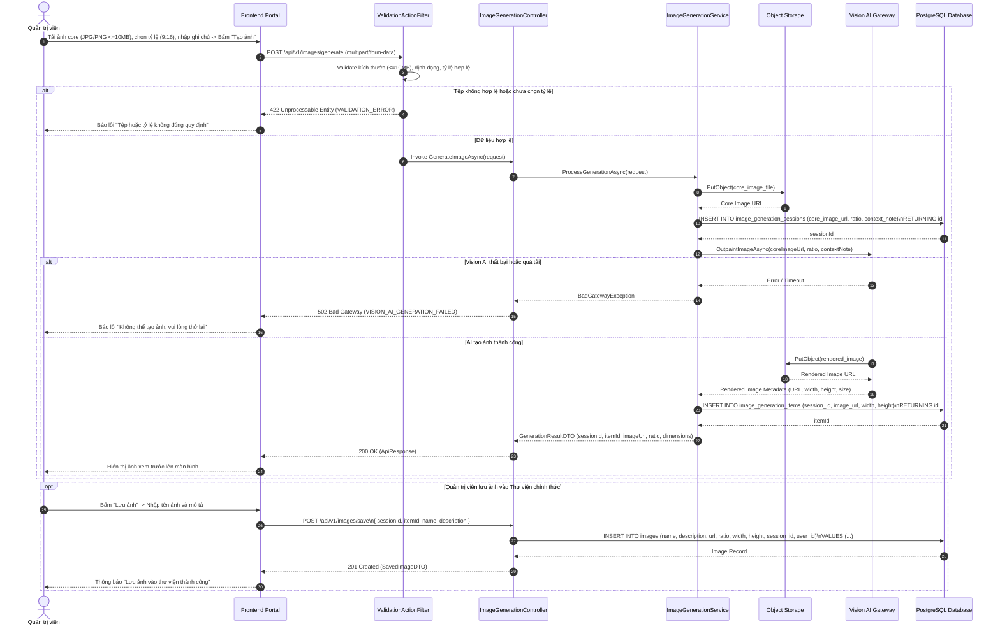
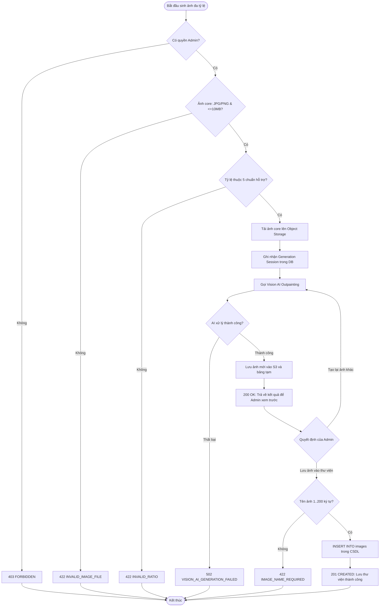
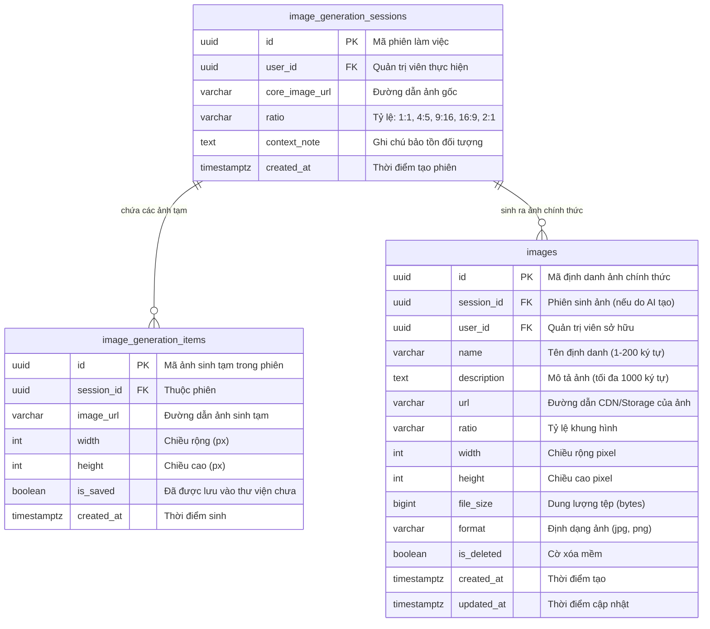

# TDD-026: Tự động sinh ảnh đa tỷ lệ từ ảnh core

## Document Info

- **Feature**: Tự động sinh ảnh đa tỷ lệ từ ảnh core
- **Author**: Hồ Hoàng Nam
- **Reviewer**: Tech Lead
- **Status**: In Review
- **Version**: v0
- **Updated At**: 2026-09-10

## Context & Goals

### Problem

Mỗi nền tảng mạng xã hội yêu cầu định dạng kích thước ảnh khác nhau (Vuông 1:1, Dọc 4:5, Story 9:16, Ngang 16:9, Zalo 2:1). Nếu thiết kế viên phải cắt cúp và vẽ lại nền thủ công cho từng tỷ lệ, chi phí nhân sự và thời gian xử lý rất lớn. Ngoài ra, việc cắt cúp cơ học dễ làm mất các chi tiết quan trọng như sản phẩm hoa, logo thương hiệu hoặc thông điệp chữ.

### Goals

- Tiếp nhận tệp ảnh core tải lên từ Quản trị viên đáp ứng tiêu chuẩn:
  - Định dạng: JPG, JPEG, PNG ([BR-032](../BusinessRules/BR-032.md)).
  - Dung lượng: Tối đa 10 MB ([BR-033](../BusinessRules/BR-033.md)).
- Cho phép chọn 1 trong 5 tỷ lệ chuẩn ([BR-034](../BusinessRules/BR-034.md)):
  - `1:1` (1080x1080 px)
  - `4:5` (1080x1350 px)
  - `9:16` (1080x1920 px)
  - `16:9` (1920x1080 px)
  - `2:1` (1200x600 px)
- Hỗ trợ ghi chú vùng an toàn (tùy chọn) để bảo tồn sản phẩm hoa, logo thương hiệu và thông điệp chữ không bị cắt xén ([BR-035](../BusinessRules/BR-035.md)).
- Sử dụng mô hình Vision AI (Outpainting / Generative Fill) để mở rộng bối cảnh ảnh tự nhiên theo đúng tỷ lệ đích.
- Quản lý phiên sinh ảnh (Generation Session):
  - Cho phép tạo lại nhiều lần trong cùng phiên làm việc.
  - Cho phép chọn lưu 1 hoặc nhiều ảnh ưng ý vào Thư viện ảnh chính thức (`images`).
  - Khi lưu: Bắt buộc nhập tên ảnh từ 1–200 ký tự ([BR-036](../BusinessRules/BR-036.md)), mô tả tùy chọn tối đa 1.000 ký tự ([BR-037](../BusinessRules/BR-037.md)).
  - Lưu đầy đủ metadata: Tỷ lệ, kích thước pixel, dung lượng, định dạng, liên kết phiên ([BR-050](../BusinessRules/BR-050.md), [BR-051](../BusinessRules/BR-051.md)).

### Non-goals

- Không hỗ trợ công cụ chỉnh sửa đồ họa vẽ tay trực tiếp trên trình duyệt.
- Không tự động đăng bài ngay khi lưu ảnh.
- Không tự động chuyển đổi định dạng tệp ảnh gốc.

## Architecture

* `ImageGenerationController` tiếp nhận request tải ảnh core (`POST /api/v1/images/generate`) và lưu ảnh vào thư viện (`POST /api/v1/images/save`).
* `ValidationActionFilter` kiểm tra dung lượng (<=10MB), định dạng (JPG/PNG) và tính hợp lệ của tỷ lệ khung hình.
* `ImageStorageService` lưu tệp ảnh gốc lên Object Storage (MinIO / S3) và sinh URL truy cập an toàn.
* `VisionAIService` gọi mô hình Vision AI Outpainting với ảnh nguồn, tỷ lệ đích và các ràng buộc bảo tồn vùng an toàn.
* Lưu tạm kết quả ảnh vào bảng `image_generation_sessions` và `image_generation_items` để phục vụ xem trước và so sánh.
* Khi Quản trị viên bấm lưu, `ImageLibraryService` chuyển dữ liệu thành bản ghi chính thức trong bảng `images`.



**Notes**:
- Ảnh tạm sinh ra trong phiên làm việc nếu không được lưu vào thư viện sẽ được dọn dẹp định kỳ bởi Background Worker sau 48 giờ.
- Khi người dùng nhấn lưu, ảnh mới được đánh dấu chính thức và không bị xóa dọn dẹp.

## Sequence Diagram

Quản trị viên tải ảnh core lên, chọn tỷ lệ khung hình và nhấn "Tạo ảnh". Hệ thống xử lý AI và trả về ảnh mở rộng để xem trước. Quản trị viên nhập thông tin và lưu ảnh vào thư viện.

| Field | Type | Vai trò trong TDD |
| --- | --- | --- |
| `file` | binary | Tệp ảnh core nguồn tải lên (JPG/PNG <= 10MB). |
| `ratio` | string | Tỷ lệ khung hình đích (`1:1`, `4:5`, `9:16`, `16:9`, `2:1`). |
| `contextNote` | string | Ghi chú hướng dẫn bảo tồn đối tượng quan trọng. |
| `sessionId` | uuid | Mã định danh phiên sinh ảnh tạm thời. |
| `itemId` | uuid | Mã định danh ảnh kết quả được sinh trong phiên. |
| `name` | string | Tên định danh của ảnh khi lưu vào thư viện (1–200 ký tự). |
| `description` | string | Mô tả nội dung ảnh (tùy chọn, tối đa 1.000 ký tự). |



## Activity Diagram



## Data Model



**Notes**:
- Bảng `image_generation_items` lưu toàn bộ lịch sử các lần sinh ảnh trong phiên để người dùng có thể so sánh và chọn bản đẹp nhất.
- Khi lưu vào bảng `images`, bản ghi được bảo toàn vĩnh viễn và liên kết với thư viện ảnh chung.

## Internal API

### Endpoints

| Method | Endpoint | Quyền | Mô tả |
| --- | --- | --- | --- |
| `POST` | `/api/v1/images/generate` | Admin | Tải ảnh core và gọi Vision AI sinh ảnh theo tỷ lệ khung hình chỉ định. |
| `POST` | `/api/v1/images/save` | Admin | Lưu ảnh đã được duyệt trong phiên sinh vào Thư viện ảnh chính thức. |

### Examples

##### 1. Sinh ảnh đa tỷ lệ thành công (200 OK)

**Request**:
```http
POST /api/v1/images/generate
Authorization: Bearer <Admin_Token>
Content-Type: multipart/form-data; boundary=----WebKitFormBoundaryXYZ

------WebKitFormBoundaryXYZ
Content-Disposition: form-data; name="file"; filename="rose_core.jpg"
Content-Type: image/jpeg

<binary data>
------WebKitFormBoundaryXYZ
Content-Disposition: form-data; name="ratio"

9:16
------WebKitFormBoundaryXYZ
Content-Disposition: form-data; name="contextNote"

Bảo tồn lẵng hoa hồng ở giữa và logo Hoa Theo Mùa ở góc trên.
------WebKitFormBoundaryXYZ--
```

**Response 200**:
```json
{
  "value": {
    "sessionId": "f1e2d3c4-b5a6-4896-bf1d-0fdbae881a28",
    "itemId": "a1b2c3d4-e5f6-4896-bf1d-0fdbae881a28",
    "imageUrl": "https://storage.hoatheomua.vn/generated/2026/09/session_f1e2d3c4_9_16.jpg",
    "ratio": "9:16",
    "width": 1080,
    "height": 1920,
    "fileSize": 1845230,
    "format": "jpg"
  },
  "isSuccess": true,
  "isFailed": false,
  "error": null,
  "traceId": "0HNOE4G1GRT26:00000001",
  "timestampUtc": "2026-09-09T12:10:00.1234567Z"
}
```

##### 2. Lưu ảnh được chọn vào Thư viện chính thức (201 Created)

**Request**:
```http
POST /api/v1/images/save
Authorization: Bearer <Admin_Token>
Content-Type: application/json

{
  "sessionId": "f1e2d3c4-b5a6-4896-bf1d-0fdbae881a28",
  "itemId": "a1b2c3d4-e5f6-4896-bf1d-0fdbae881a28",
  "name": "Bó Hồng Ecuador Mùa Thu - Story 9:16",
  "description": "Ảnh tỷ lệ 9:16 dùng chạy Instagram Story và TikTok mùa thu 2026."
}
```

**Response 201**:
```json
{
  "value": {
    "id": "7a8b9c0d-1e2f-4896-bf1d-0fdbae881a28",
    "name": "Bó Hồng Ecuador Mùa Thu - Story 9:16",
    "description": "Ảnh tỷ lệ 9:16 dùng chạy Instagram Story và TikTok mùa thu 2026.",
    "url": "https://storage.hoatheomua.vn/generated/2026/09/session_f1e2d3c4_9_16.jpg",
    "ratio": "9:16",
    "width": 1080,
    "height": 1920,
    "fileSize": 1845230,
    "format": "jpg",
    "createdAt": "2026-09-09T12:11:00.1234567Z"
  },
  "isSuccess": true,
  "isFailed": false,
  "error": null,
  "traceId": "0HNOE4G1GRT26:00000002",
  "timestampUtc": "2026-09-09T12:11:00.1234567Z"
}
```

##### 3. Thất bại do định dạng tệp hoặc dung lượng không hợp lệ (422 Unprocessable Entity)

**Request**:
```http
POST /api/v1/images/generate
Authorization: Bearer <Admin_Token>
Content-Type: multipart/form-data; boundary=----WebKitFormBoundaryXYZ

------WebKitFormBoundaryXYZ
Content-Disposition: form-data; name="file"; filename="invalid_doc.pdf"
Content-Type: application/pdf

<binary data>
------WebKitFormBoundaryXYZ
Content-Disposition: form-data; name="ratio"

9:16
------WebKitFormBoundaryXYZ--
```

**Response 422 (Error)**:
```json
{
  "isSuccess": false,
  "isFailed": true,
  "value": null,
  "error": {
    "code": "INVALID_IMAGE_FILE",
    "message": "Tệp ảnh không hợp lệ. Chỉ chấp nhận định dạng JPG, JPEG, PNG với dung lượng tối đa 10 MB."
  },
  "traceId": "0HNOE4G1GRT26:00000003",
  "timestampUtc": "2026-09-09T12:12:00.0000000Z"
}
```

### Error Codes

| Code | HTTP Status | Khi nào xảy ra |
| --- | :---: | --- |
| `UNAUTHORIZED` | 401 | Yêu cầu không có token hoặc token đã hết hạn. |
| `FORBIDDEN` | 403 | Người dùng không có quyền Quản trị viên (Admin). |
| `INVALID_IMAGE_FILE` | 422 | Tệp rỗng, sai định dạng (không phải JPG/JPEG/PNG) hoặc dung lượng vượt quá 10MB ([BR-032](../BusinessRules/BR-032.md), [BR-033](../BusinessRules/BR-033.md)). |
| `RATIO_REQUIRED` | 422 | Chưa chọn tỷ lệ hoặc tỷ lệ không nằm trong danh sách hỗ trợ (`1:1`, `4:5`, `9:16`, `16:9`, `2:1`) ([BR-034](../BusinessRules/BR-034.md)). |
| `IMAGE_NAME_REQUIRED` | 422 | Tên ảnh khi lưu rỗng hoặc vượt quá 200 ký tự ([BR-036](../BusinessRules/BR-036.md)). |
| `DESCRIPTION_TOO_LONG` | 422 | Mô tả ảnh vượt quá 1.000 ký tự ([BR-037](../BusinessRules/BR-037.md)). |
| `VISION_AI_GENERATION_FAILED` | 502 | Mô hình Vision AI lỗi kết nối, quá tải hoặc không thể hoàn tất mở rộng khung hình. |
| `INTERNAL_SERVER_ERROR` | 500 | Lỗi kết nối lưu trữ Object Storage hoặc CSDL PostgreSQL. |

## External API

Hệ thống tích hợp mô hình Vision AI Outpainting (như Flux Fill / Stable Diffusion XL Inpainting) thông qua Vision AI Gateway.

- **Request**:
  - `image_url`: Đường dẫn công khai hoặc pre-signed URL của ảnh core.
  - `target_ratio`: Chuỗi tỷ lệ đích (`1:1`, `4:5`, `9:16`, `16:9`, `2:1`).
  - `prompt`: Văn bản mô tả mở rộng hậu cảnh đồng điệu với hoa tươi.
  - `preserve_zone`: Tọa độ vùng trung tâm cần giữ nguyên vẹn chi tiết hoa và logo thương hiệu.
- **Timeout**: Thiết lập tối đa 45 giây cho tác vụ sinh hình ảnh độ phân giải cao.

## References

### User Stories

- [STORY-003: Tự động sinh ảnh đa tỷ lệ từ ảnh core](file:///d:/VNZ/document-first-brief/hoa-theo-mua-ai-marketing/UserStory/03-AutoGenerateMultiRatioImagesFromCore.md)

### Business Rules

- [BR-032: Định dạng ảnh Core đầu vào](file:///d:/VNZ/document-first-brief/hoa-theo-mua-ai-marketing/BusinessRules/BR-032.md)
- [BR-033: Giới hạn dung lượng ảnh Core](file:///d:/VNZ/document-first-brief/hoa-theo-mua-ai-marketing/BusinessRules/BR-033.md)
- [BR-034: Danh mục tỷ lệ khung hình hỗ trợ](file:///d:/VNZ/document-first-brief/hoa-theo-mua-ai-marketing/BusinessRules/BR-034.md)
- [BR-035: Bảo tồn đối tượng trong vùng an toàn](file:///d:/VNZ/document-first-brief/hoa-theo-mua-ai-marketing/BusinessRules/BR-035.md)
- [BR-036: Quy tắc đặt tên ảnh khi lưu](file:///d:/VNZ/document-first-brief/hoa-theo-mua-ai-marketing/BusinessRules/BR-036.md)
- [BR-037: Giới hạn mô tả ảnh](file:///d:/VNZ/document-first-brief/hoa-theo-mua-ai-marketing/BusinessRules/BR-037.md)
- [BR-050: Metadata bắt buộc khi lưu ảnh](file:///d:/VNZ/document-first-brief/hoa-theo-mua-ai-marketing/BusinessRules/BR-050.md)
- [BR-051: Liên kết ảnh với phiên làm việc](file:///d:/VNZ/document-first-brief/hoa-theo-mua-ai-marketing/BusinessRules/BR-051.md)

### Use Cases

- Không áp dụng.

### Others

- Lưu trữ Object Storage: S3 / MinIO Storage Bucket.

## Change Log

| Phiên bản | Ngày | Tác giả | Tóm tắt thay đổi |
| --- | --- | --- | --- |
| v0 | 2026-09-10 | Hồ Hoàng Nam | Khởi tạo tài liệu thiết kế kỹ thuật Sinh ảnh đa tỷ lệ từ ảnh core theo chuẩn Document-First. |
