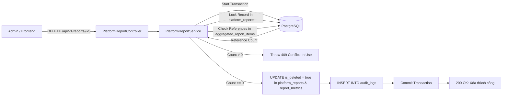
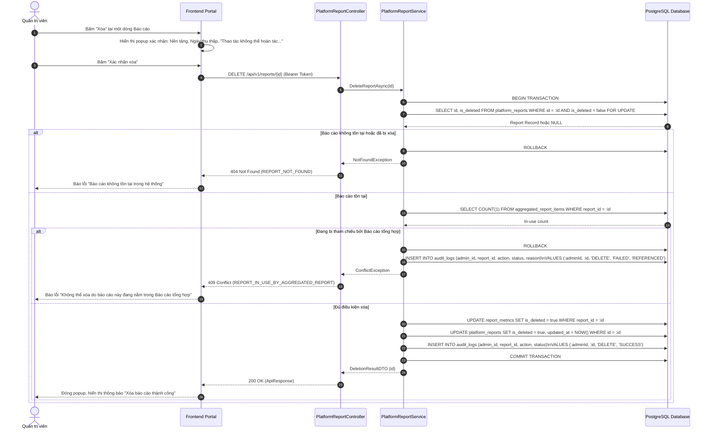
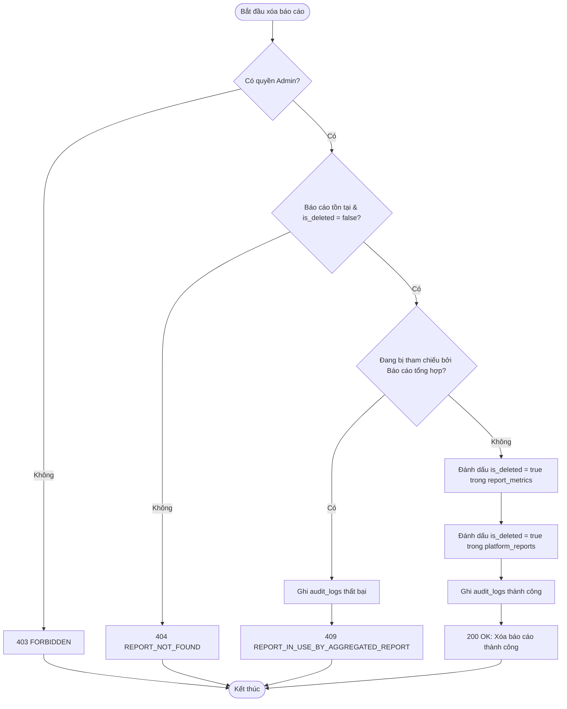
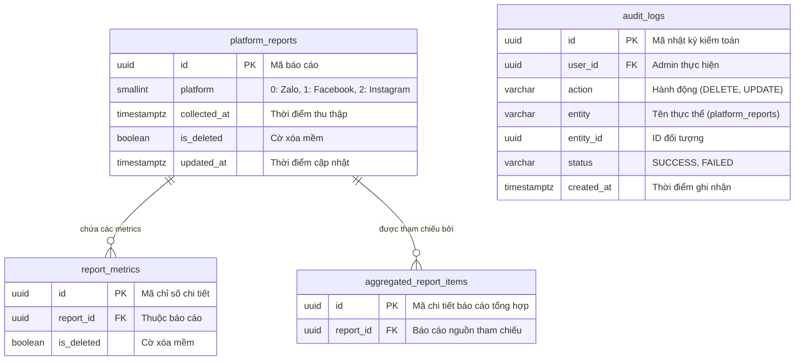

# TDD-027: Xóa báo cáo đã lưu

## Document Info

- **Feature**: Xóa báo cáo đã lưu
- **Author**: Hồ Hoàng Nam
- **Reviewer**: Tech Lead
- **Status**: In Review
- **Version**: v0
- **Updated At**: 2026-09-10

## Context & Goals

### Problem

Hệ thống thu thập báo cáo định kỳ sinh ra nhiều bản ghi dữ liệu theo thời gian. Quản trị viên cần xóa các báo cáo lỗi thời, báo cáo thử nghiệm hoặc dữ liệu không còn giá trị để giảm tải dung lượng lưu trữ và tránh nhầm lẫn khi tra cứu. Tuy nhiên, việc xóa phải kiểm tra nghiêm ngặt tính toàn vẹn để không làm hỏng các báo cáo tổng hợp đang tham chiếu đến báo cáo này.

### Goals

- Cung cấp API cho phép Quản trị viên xóa một báo cáo nền tảng đã lưu.
- **Ràng buộc điều kiện xóa ([BR-080](../BusinessRules/BR-080.md))**:
  - Báo cáo phải tồn tại trong CSDL và chưa bị xóa trước đó.
  - Báo cáo **TUYỆT ĐỐI KHÔNG ĐƯỢC** bị tham chiếu bởi báo cáo tổng hợp (`aggregated_reports`) hoặc bất kỳ dữ liệu nghiệp vụ nào khác.
  - Nếu phát hiện bị tham chiếu: Hệ thống từ chối xóa và trả về mã lỗi `409 Conflict`.
- **Cơ chế xóa toàn vẹn ([BR-081](../BusinessRules/BR-081.md))**:
  - Thực hiện Double-check trước khi thực thi xóa.
  - Xóa mềm báo cáo (`is_deleted = true`, `updated_at = NOW()`) và các chỉ số liên kết `report_metrics` trong một Database Transaction thống nhất.
  - Ghi nhận độc lập vào bảng nhật ký kiểm toán `audit_logs` (ID Quản trị viên, ID báo cáo, thời gian, kết quả thao tác).
- **Bảo toàn dữ liệu bên ngoài**:
  - Tuyệt đối không can thiệp hoặc thay đổi dữ liệu trên mạng xã hội Facebook, Instagram, Zalo OA.
  - Không làm ảnh hưởng đến cấu hình kết nối hay Token của nền tảng.

### Non-goals

- Không hỗ trợ khôi phục sau khi đã xác nhận xóa thành công trong chức năng này.
- Không xóa số liệu trên các kênh mạng xã hội thực tế.

## Architecture

* `PlatformReportController` tiếp nhận yêu cầu `DELETE /api/v1/reports/{id}` kèm token xác thực Admin.
* `PlatformReportService` mở Database Transaction và khóa dòng bản ghi bằng `SELECT ... FOR UPDATE`.
* Kiểm tra sự tồn tại của báo cáo trong bảng `platform_reports` (`is_deleted = false`).
* Kiểm tra ràng buộc tham chiếu: Đếm số bản ghi trong bảng `aggregated_report_items` có `report_id = :id`.
* Nếu số bản ghi > 0: Rollback Transaction, ghi log thất bại và trả về lỗi `409 Conflict` (`REPORT_IN_USE_BY_AGGREGATED_REPORT`).
* Nếu hợp lệ: Cập nhật `is_deleted = true`, `updated_at = NOW()` cho `platform_reports` và các dòng chi tiết `report_metrics`, ghi nhận vào `audit_logs`, commit Transaction và trả về kết quả thành công.



**Notes**:
- Sử dụng Pessimistic Locking để tránh tình trạng báo cáo đang được người khác đem đi tổng hợp đúng lúc bấm nút xóa.
- Áp dụng xóa mềm để bảo toàn tính kiểm toán của hệ thống.

## Sequence Diagram

Quản trị viên mở popup xác nhận xóa báo cáo (kèm thông tin tên nền tảng và ngày thu thập) và nhấn Xác nhận xóa. Hệ thống kiểm tra ràng buộc và thực thi xóa an toàn.

| Field | Type | Vai trò trong TDD |
| --- | --- | --- |
| `id` | uuid | Khóa chính của báo cáo cần xóa, truyền trên URL. |
| `is_deleted` | boolean | Chuyển từ `false` sang `true` khi xóa mềm thành công. |
| `updated_at` | timestamp | Ghi nhận thời điểm xóa bản ghi. |



## Activity Diagram



## Data Model



**Notes**:
- Xóa mềm đồng thời báo cáo cha và toàn bộ bản ghi con trong `report_metrics`.
- Ghi nhật ký vào `audit_logs` ngay cả khi thao tác bị từ chối do xung đột tham chiếu để phục vụ công tác rà soát bảo mật.

## Internal API

### Endpoints

| Method | Endpoint | Quyền | Mô tả |
| --- | --- | --- | --- |
| `DELETE` | `/api/v1/reports/{id:guid}` | Admin | Xóa mềm báo cáo nền tảng và các dữ liệu chi tiết liên kết khỏi hệ thống. |

### Examples

##### 1. Xóa báo cáo thành công (200 OK)

**Request**:
```http
DELETE /api/v1/reports/e1f2a3b4-c5d6-4896-bf1d-0fdbae881a28
Authorization: Bearer <Admin_Token>
```

**Response 200**:
```json
{
  "value": {
    "deletedReportId": "e1f2a3b4-c5d6-4896-bf1d-0fdbae881a28",
    "message": "Xóa báo cáo và dữ liệu chi tiết thành công."
  },
  "isSuccess": true,
  "isFailed": false,
  "error": null,
  "traceId": "0HNOE4G1GRT27:00000001",
  "timestampUtc": "2026-09-09T12:50:00.1234567Z"
}
```

##### 2. Báo cáo đang nằm trong Báo cáo tổng hợp (409 Conflict)

**Request**:
```http
DELETE /api/v1/reports/e1f2a3b4-c5d6-4896-bf1d-0fdbae881a28
Authorization: Bearer <Admin_Token>
```

**Response 409 (Error)**:
```json
{
  "isSuccess": false,
  "isFailed": true,
  "value": null,
  "error": {
    "code": "REPORT_IN_USE_BY_AGGREGATED_REPORT",
    "message": "Không thể xóa báo cáo này do đang được sử dụng trong ít nhất một Báo cáo tổng hợp đa nền tảng."
  },
  "traceId": "0HNOE4G1GRT27:00000002",
  "timestampUtc": "2026-09-09T12:50:10.0000000Z"
}
```

##### 3. Báo cáo không tồn tại trong hệ thống (404 Not Found)

**Request**:
```http
DELETE /api/v1/reports/00000000-0000-0000-0000-000000000000
Authorization: Bearer <Admin_Token>
```

**Response 404 (Error)**:
```json
{
  "isSuccess": false,
  "isFailed": true,
  "value": null,
  "error": {
    "code": "REPORT_NOT_FOUND",
    "message": "Báo cáo không tồn tại trong hệ thống hoặc đã bị xóa trước đó."
  },
  "traceId": "0HNOE4G1GRT27:00000003",
  "timestampUtc": "2026-09-09T12:50:20.0000000Z"
}
```

### Error Codes

| Code | HTTP Status | Khi nào xảy ra |
| --- | :---: | --- |
| `UNAUTHORIZED` | 401 | Yêu cầu không có token hoặc token đã hết hạn. |
| `FORBIDDEN` | 403 | Người dùng không có quyền Quản trị viên (Admin). |
| `REPORT_NOT_FOUND` | 404 | Báo cáo không tồn tại hoặc đã bị xóa mềm (`is_deleted = true`). |
| `REPORT_IN_USE_BY_AGGREGATED_REPORT` | 409 | Báo cáo đang được tham chiếu bởi ít nhất một Báo cáo tổng hợp ([BR-080](../BusinessRules/BR-080.md)). |
| `INTERNAL_SERVER_ERROR` | 500 | Lỗi kết nối CSDL hoặc lỗi hệ thống không xác định trong quá trình thực thi Transaction ([BR-081](../BusinessRules/BR-081.md)). |

## References

### User Stories

- [STORY-027: Xóa báo cáo đã lưu](file:///d:/VNZ/document-first-brief/hoa-theo-mua-ai-marketing/UserStory/27-DeleteSavedReport.md)

### Business Rules

- [BR-080: Ràng buộc khi xóa báo cáo](file:///d:/VNZ/document-first-brief/hoa-theo-mua-ai-marketing/BusinessRules/BR-080.md)
- [BR-081: Xóa báo cáo toàn vẹn](file:///d:/VNZ/document-first-brief/hoa-theo-mua-ai-marketing/BusinessRules/BR-081.md)

### Use Cases

- Không áp dụng.

### Others

- Enum `HoaTheoMua.Repository.Enum.PlatformType`: `Zalo = 0`, `Facebook = 1`, `Instagram = 2`.

## Change Log

| Phiên bản | Ngày | Tác giả | Tóm tắt thay đổi |
| --- | --- | --- | --- |
| v0 | 2026-09-10 | Hồ Hoàng Nam | Khởi tạo tài liệu thiết kế kỹ thuật Xóa báo cáo đã lưu theo chuẩn Document-First. |
