# Hướng Dẫn & Giải Thích Chi Tiết Toàn Bộ User Stories — HTM_Marketing_AI

> **Dự án**: Hoa Theo Mùa (`hoa-theo-mua-ai-marketing`)  
> **Phân hệ**: `HTM_Marketing_AI` (Marketing & Social Media Automation Subsystem)  
> **Tài liệu**: Hướng dẫn & Diễn giải nghiệp vụ User Stories (User Stories Explanation Guide)  
> **Phiên bản**: v1.0  
> **Ngày cập nhật**: 09/09/2026  
> **Phương pháp tiếp cận**: Document-First, Behavior-Driven Development (BDD Acceptance Criteria)  

---

## 📑 MỤC LỤC

1. [Tổng quan Luồng Vận Hành Của Marketer](#1-tổng-quan-luồng-vận-hành-của-marketer)
2. [Ma Trận Tra Cứu 19 User Stories](#2-ma-trận-tra-cứu-19-user-stories)
3. [Giải Thích Chi Tiết Từng Nhóm User Stories](#3-giải-thích-chi-tiết-từng-nhóm-user-stories)
   - [3.1. Nhóm 1: Quản trị Cấu hình & System Prompt (Định hình bộ não AI)](#31-nhóm-1-quản-trị-cấu-hình--system-prompt-định-hình-bộ-não-ai)
   - [3.2. Nhóm 2: Sáng tạo Nội dung AI (AI Copywriting)](#32-nhóm-2-sáng-tạo-nội-dung-ai-ai-copywriting)
   - [3.3. Nhóm 3: Xử lý Đồ họa Vision AI Đa tỷ lệ (Smart Crop & Outpainting)](#33-nhóm-3-xử-lý-đồ-họa-vision-ai-đa-tỷ-lệ-smart-crop--outpainting)
   - [3.4. Nhóm 4: Quản trị Kho Tư liệu Số (Digital Asset Management - DAM)](#34-nhóm-4-quản-trị-kho-tư-liệu-số-digital-asset-management---dam)
   - [3.5. Nhóm 5: Lập lịch & Tự động Đăng bài Đa kênh (Auto Publishing)](#35-nhóm-5-lập-lịch--tự-động-đăng-bài-đa-kênh-auto-publishing)
   - [3.6. Nhóm 6: Đo lường & Báo cáo Đa nền tảng (Social Analytics & Reporting)](#36-nhóm-6-đo-lường--báo-cáo-đa-nền-tảng-social-analytics--reporting)
4. [Mối Quan Hệ Dữ Liệu Giữa Các User Stories](#4-mối-quan-hệ-dữ-liệu-giữa-các-user-stories)

---

## 1. TỔNG QUAN LUỒNG VẬN HÀNH CỦA MARKETER

Phân hệ **HTM_Marketing_AI** mô phỏng trọn vẹn và tự động hóa toàn bộ vòng đời tác nghiệp truyền thông số của một Marketer tại chuỗi hoa tươi **Hoa Theo Mùa**:

```mermaid
flowchart LR
    subgraph Step1["Bước 1: Thiết lập"]
        US04[STORY-004: Xem Prompt]
        US05[STORY-005: Sửa Prompt]
    end

    subgraph Step2["Bước 2: Sáng tạo"]
        US17[STORY-017: Viết bài & Hashtag AI]
        US24[STORY-024: Viết lại theo Kênh]
        US03[STORY-003: Sinh 5 Tỷ lệ Ảnh AI]
    end

    subgraph Step3["Bước 3: Quản trị Kho"]
        US18[STORY-018..020: Quản lý Content]
        US21[STORY-021..023: Quản lý Ảnh]
    end

    subgraph Step4["Bước 4: Xuất bản"]
        US02[STORY-002: Lên lịch Đăng đa kênh]
        US14[STORY-014..016: Quản lý Lịch]
    end

    subgraph Step5["Bước 5: Đo lường"]
        US25[STORY-025: Báo cáo & Xuất XLSX]
        US27[STORY-027: Xóa Báo cáo cũ]
    end

    Step1 --> Step2 --> Step3 --> Step4 --> Step5
```



---

## 2. MA TRẬN TRA CỨU 19 USER STORIES

| Mã Story | Tên User Story | Nhóm chức năng | File đặc tả chi tiết | Sprint | Độ ưu tiên |
| :--- | :--- | :--- | :--- | :---: | :---: |
| **STORY-002** | Lên lịch và tự động đăng bài đa nền tảng | Auto Publishing | [`02-ScheduleAndAutoPublishPosts.md`](file:///d:/VNZ/document-first-brief/hoa-theo-mua-ai-marketing/UserStory/02-ScheduleAndAutoPublishPosts.md) | S1 | **Must** |
| **STORY-003** | Tự động sinh ảnh đa tỷ lệ từ ảnh core | Vision AI | [`03-AutoGenerateMultiRatioImagesFromCore.md`](file:///d:/VNZ/document-first-brief/hoa-theo-mua-ai-marketing/UserStory/03-AutoGenerateMultiRatioImagesFromCore.md) | S1 | **Must** |
| **STORY-004** | Xem danh sách và chi tiết System Prompt | System Prompt | [`04-ViewSystemPromptsListAndDetail.md`](file:///d:/VNZ/document-first-brief/hoa-theo-mua-ai-marketing/UserStory/04-ViewSystemPromptsListAndDetail.md) | S1 | **Must** |
| **STORY-005** | Sửa System Prompt & Quản lý phiên bản | System Prompt | [`05-UpdateSystemPrompt.md`](file:///d:/VNZ/document-first-brief/hoa-theo-mua-ai-marketing/UserStory/05-UpdateSystemPrompt.md) | S1 | **Must** |
| **STORY-006** | Xóa System Prompt không còn sử dụng | System Prompt | [`06-DeleteSystemPrompt.md`](file:///d:/VNZ/document-first-brief/hoa-theo-mua-ai-marketing/UserStory/06-DeleteSystemPrompt.md) | S1 | Won't |
| **STORY-012** | Tìm kiếm System Prompt theo tên/mã | System Prompt | [`12-SearchSystemPrompts.md`](file:///d:/VNZ/document-first-brief/hoa-theo-mua-ai-marketing/UserStory/12-SearchSystemPrompts.md) | S1 | Won't |
| **STORY-013** | Lọc System Prompt theo trạng thái | System Prompt | [`13-FilterSystemPrompts.md`](file:///d:/VNZ/document-first-brief/hoa-theo-mua-ai-marketing/UserStory/13-FilterSystemPrompts.md) | S1 | Won't |
| **STORY-014** | Xem danh sách và chi tiết lịch đăng bài | Auto Publishing | [`14-ViewAutoPublishSchedules.md`](file:///d:/VNZ/document-first-brief/hoa-theo-mua-ai-marketing/UserStory/14-ViewAutoPublishSchedules.md) | S1 | **Must** |
| **STORY-015** | Xóa lịch đăng bài tự động & hủy Cron Job | Auto Publishing | [`15-DeleteAutoPublishSchedule.md`](file:///d:/VNZ/document-first-brief/hoa-theo-mua-ai-marketing/UserStory/15-DeleteAutoPublishSchedule.md) | S1 | **Must** |
| **STORY-016** | Cập nhật thông tin lịch đăng bài tự động | Auto Publishing | [`16-UpdateAutoPublishSchedule.md`](file:///d:/VNZ/document-first-brief/hoa-theo-mua-ai-marketing/UserStory/16-UpdateAutoPublishSchedule.md) | S1 | **Must** |
| **STORY-017** | Tự động viết content và hashtag bằng AI | AI Copywriting | [`17-AutoGenerateContentAndHashtags.md`](file:///d:/VNZ/document-first-brief/hoa-theo-mua-ai-marketing/UserStory/17-AutoGenerateContentAndHashtags.md) | S1 | **Must** |
| **STORY-018** | Xem danh sách, tìm kiếm & chi tiết content | Content DAM | [`18-ViewSavedContentListAndDetail.md`](file:///d:/VNZ/document-first-brief/hoa-theo-mua-ai-marketing/UserStory/18-ViewSavedContentListAndDetail.md) | S1 | **Must** |
| **STORY-019** | Xóa an toàn content đã lưu lại | Content DAM | [`19-DeleteSavedContent.md`](file:///d:/VNZ/document-first-brief/hoa-theo-mua-ai-marketing/UserStory/19-DeleteSavedContent.md) | S1 | **Must** |
| **STORY-020** | Chỉnh sửa content và danh sách hashtag | Content DAM | [`20-UpdateSavedContent.md`](file:///d:/VNZ/document-first-brief/hoa-theo-mua-ai-marketing/UserStory/20-UpdateSavedContent.md) | S1 | **Must** |
| **STORY-021** | Xem danh sách, tìm kiếm & chi tiết ảnh | Image DAM | [`21-ViewSavedImagesListAndDetail.md`](file:///d:/VNZ/document-first-brief/hoa-theo-mua-ai-marketing/UserStory/21-ViewSavedImagesListAndDetail.md) | S1 | **Must** |
| **STORY-022** | Xóa ảnh đã lưu & Cascade Delete biến thể con | Image DAM | [`22-DeleteSavedImage.md`](file:///d:/VNZ/document-first-brief/hoa-theo-mua-ai-marketing/UserStory/22-DeleteSavedImage.md) | S1 | **Must** |
| **STORY-023** | Sửa metadata ảnh (tên, mô tả, thẻ tags) | Image DAM | [`23-UpdateSavedImageInfo.md`](file:///d:/VNZ/document-first-brief/hoa-theo-mua-ai-marketing/UserStory/23-UpdateSavedImageInfo.md) | S1 | **Must** |
| **STORY-024** | Tự động viết lại nội dung theo từng nền tảng | AI Copywriting | [`24-RewriteContentByPlatform.md`](file:///d:/VNZ/document-first-brief/hoa-theo-mua-ai-marketing/UserStory/24-RewriteContentByPlatform.md) | S1 | **Must** |
| **STORY-025** | Thu thập & quản lý báo cáo từ các nền tảng | Analytics | [`25-CollectAndManagePlatformReports.md`](file:///d:/VNZ/document-first-brief/hoa-theo-mua-ai-marketing/UserStory/25-CollectAndManagePlatformReports.md) | S1 | **Must** |
| **STORY-027** | Xóa báo cáo đã lưu không còn cần thiết | Analytics | [`27-DeleteSavedReport.md`](file:///d:/VNZ/document-first-brief/hoa-theo-mua-ai-marketing/UserStory/27-DeleteSavedReport.md) | S1 | **Must** |

---

## 3. GIẢI THÍCH CHI TIẾT TỪNG NHÓM USER STORIES

### 3.1. Nhóm 1: Quản trị Cấu hình & System Prompt (Định hình bộ não AI)
> **Vai trò**: Quản trị viên (Admin)  
> **Mục tiêu**: Thiết lập và tinh chỉnh "tính cách" của AI, quy định giọng văn thương hiệu Hoa Theo Mùa, các từ ngữ khuyến khích hoặc bị cấm mà không cần can thiệp mã nguồn.

#### 1. [STORY-004: Xem danh sách và chi tiết System Prompt](file:///d:/VNZ/document-first-brief/hoa-theo-mua-ai-marketing/UserStory/04-ViewSystemPromptsListAndDetail.md)
* **Ý nghĩa nghiệp vụ**: Cung cấp màn hình hiển thị danh sách các System Prompt hiện có trong hệ thống CSDL trung tâm (`system_prompts`).
* **Đặc điểm**:
  * Hiển thị phân loại: `post` (cho Marketing Copywriting), `flower` (cho Mẫu hoa AI), `card` (cho Thiệp AI).
  * Cho phép bấm vào xem chi tiết toàn văn chỉ dẫn, ngày tạo, phiên bản hiện hành.
* **Quy tắc**: Chỉ người dùng có quyền Quản trị viên (Admin) mới được phép xem danh sách này.

#### 2. [STORY-005: Sửa System Prompt & Quản lý phiên bản](file:///d:/VNZ/document-first-brief/hoa-theo-mua-ai-marketing/UserStory/05-UpdateSystemPrompt.md)
* **Ý nghĩa nghiệp vụ**: Cho phép Admin cập nhật nội dung chỉ dẫn AI khi muốn thay đổi chiến lược truyền thông (ví dụ: chuyển đổi từ văn phong trang trọng sang lãng mạn, bổ sung câu khẩu hiệu theo mùa Tết).
* **Ràng buộc quan trọng**:
  * **Độ dài**: Bắt buộc từ **1 đến 20.000 ký tự** ([BR-041](file:///d:/VNZ/document-first-brief/hoa-theo-mua-ai-marketing/BusinessRules/BR-041.md)). Không được để trống.
  * **Tự động tăng phiên bản**: Mỗi lần lưu thành công, hệ thống tự động tăng `version = version + 1` và ghi nhận lịch sử thay đổi ([BR-042](file:///d:/VNZ/document-first-brief/hoa-theo-mua-ai-marketing/BusinessRules/BR-042.md)).
  * **Không ảnh hưởng quá khứ**: Các bài viết đã sinh ra trước đó vẫn giữ nguyên snapshot của prompt cũ trong `post_histories.metadata`.

*(Ghi chú: STORY-006 xóa prompt, STORY-012 tìm kiếm, STORY-013 lọc thuộc phạm vi Won't của Sprint 1 để đảm bảo tính ổn định của cấu hình lõi).*

---

### 3.2. Nhóm 2: Sáng tạo Nội dung AI (AI Copywriting)
> **Vai trò**: Quản trị viên / Biên tập viên Marketing  
> **Mục tiêu**: Tạo ra nội dung bài viết và bộ hashtag hoàn chỉnh trong vài giây, đồng thời viết lại tối ưu hóa theo đặc thù từng mạng xã hội.

#### 1. [STORY-017: Tự động viết content và hashtag bằng AI](file:///d:/VNZ/document-first-brief/hoa-theo-mua-ai-marketing/UserStory/17-AutoGenerateContentAndHashtags.md)
* **Ý nghĩa nghiệp vụ**: Giải phóng sức lao động sáng tạo cho Marketer. Chỉ cần nhập ý tưởng sơ khai, AI sẽ soạn thảo bài đăng Facebook/Instagram chuẩn chỉ.
* **Đầu vào (Input)**:
  * **Chủ đề (Topic)**: Bắt buộc, từ 5 đến 1.000 ký tự ([BR-015](file:///d:/VNZ/document-first-brief/hoa-theo-mua-ai-marketing/BusinessRules/BR-015.md)). Ví dụ: *"Giới thiệu bó hoa Tulip hồng phong cách Hàn Quốc cho ngày 20/10"*.
  * **Mục tiêu truyền thông**: Bán hàng, Tăng tương tác, Nhận diện thương hiệu, Tri ân.
  * **Đối tượng độc giả**: Giới trẻ, Doanh nhân, Cặp đôi, Gia đình.
  * **Giọng văn**: Lãng mạn, Thanh lịch, Năng động, Hài hước, Trang trọng.
* **Đầu ra (Output)**:
  * 01 Bài viết hoàn chỉnh có độ dài từ 1 đến 10.000 ký tự ([BR-020](file:///d:/VNZ/document-first-brief/hoa-theo-mua-ai-marketing/BusinessRules/BR-020.md)).
  * Bộ **1 đến 30 hashtag** ([BR-017](file:///d:/VNZ/document-first-brief/hoa-theo-mua-ai-marketing/BusinessRules/BR-017.md)): Định dạng chuẩn bắt đầu bằng `#`, không dấu cách, không ký tự lạ, dài 2–50 ký tự/tag ([BR-018](file:///d:/VNZ/document-first-brief/hoa-theo-mua-ai-marketing/BusinessRules/BR-018.md)).
* **Thao tác**: Sau khi xem bản xem trước, Marketer có thể bấm *Lưu bài viết*, *Sao chép* hoặc *Tạo lại bản khác*.

#### 2. [STORY-024: Tự động viết lại nội dung theo từng nền tảng](file:///d:/VNZ/document-first-brief/hoa-theo-mua-ai-marketing/UserStory/24-RewriteContentByPlatform.md)
* **Ý nghĩa nghiệp vụ**: Giải quyết vấn đề một nội dung đăng dàn trải lên mọi kênh sẽ làm giảm tương tác. AI sẽ "may đo" bài viết gốc theo đúng văn hóa từng mạng xã hội.
* **Quy chuẩn thích ứng (`platform_standards`)**:
  * **Facebook**: Cần câu mở đầu (hook) giật tít thu hút, thân bài chia ý rõ ràng, lời kêu gọi hành động (CTA) cụ thể, kèm 3–5 hashtag.
  * **Instagram**: Rút gọn văn bản, câu chữ giàu tính thị giác/cảm xúc, chia đoạn thoáng, đặt 10–20 hashtag ở chân bài để tăng tìm kiếm tự nhiên.
  * **Zalo OA**: Văn phong trang trọng, súc tích, tập trung thông tin khuyến mãi/chính sách và số hotline đặt hàng, hạn chế hashtag.
* **Cơ chế**: Chọn 1 bài gốc và tick chọn 1 hoặc nhiều nền tảng -> AI sinh ra các bản ghi phái sinh độc lập và tự động lưu vết `parent_content_id` ([BR-070](file:///d:/VNZ/document-first-brief/hoa-theo-mua-ai-marketing/BusinessRules/BR-070.md)).

---

### 3.3. Nhóm 3: Xử lý Đồ họa Vision AI Đa tỷ lệ (Smart Crop & Outpainting)
> **Vai trò**: Quản trị viên Marketing / Designer  
> **Mục tiêu**: Chuẩn hóa hình ảnh sản phẩm cho tất cả các vị trí hiển thị trên mạng xã hội một cách tự động.

#### [STORY-003: Tự động sinh ảnh đa tỷ lệ từ ảnh Core](file:///d:/VNZ/document-first-brief/hoa-theo-mua-ai-marketing/UserStory/03-AutoGenerateMultiRatioImagesFromCore.md)
* **Ý nghĩa nghiệp vụ**: Thông thường khi chụp ảnh một bình hoa, ảnh chỉ có 1 tỷ lệ duy nhất. Đăng lên Story (9:16) sẽ bị viền đen hoặc cắt đầu; đăng lên Feed (1:1) sẽ bị co méo. Vision AI sẽ tự động mở rộng không gian nền (Outpainting) để tạo đủ 5 tỷ lệ chuẩn.
* **Đầu vào (Core Image)**:
  * Ảnh gốc đạt chuẩn: JPG, PNG, WEBP; dung lượng tối đa 15MB; kích thước tối thiểu 1024x1024px ([BR-032](file:///d:/VNZ/document-first-brief/hoa-theo-mua-ai-marketing/BusinessRules/BR-032.md)).
* **Bộ 5 tỷ lệ bắt buộc sinh ra ([BR-034](file:///d:/VNZ/document-first-brief/hoa-theo-mua-ai-marketing/BusinessRules/BR-034.md))**:
  1. `1:1` (Vuông - 1080x1080): Feed Facebook, Instagram, Zalo.
  2. `4:5` (Dọc Portrait - 1080x1350): Tối ưu diện tích hiển thị lướt feed trên smartphone.
  3. `9:16` (Dọc Story/Reels - 1080x1920): Story và video ngắn toàn màn hình.
  4. `16:9` (Ngang Landscape - 1920x1080): Ảnh cover, banner bài viết ngang.
  5. `2:1` (Header/Link Preview - 1200x600): Ảnh xem trước khi chia sẻ link hoặc header website.
* **Quy tắc Vùng an toàn (Safe Zone - [BR-035](file:///d:/VNZ/document-first-brief/hoa-theo-mua-ai-marketing/BusinessRules/BR-035.md))**:
  * Trọng tâm bình hoa/bó hoa và logo thương hiệu phải nằm trọn trong vùng an toàn trung tâm, không bị biến dạng, không bị mờ nhòe hay cắt lẹm cánh hoa.

---

### 3.4. Nhóm 4: Quản trị Kho Tư liệu Số (Digital Asset Management - DAM)
> **Vai trò**: Quản trị viên Marketing  
> **Mục tiêu**: Quản lý tập trung tài nguyên bài viết và hình ảnh, bảo vệ dữ liệu chống xóa nhầm khi đang có lịch đăng.

#### Quản lý Bài viết (Content DAM):
* [**STORY-018: Xem danh sách, tìm kiếm & chi tiết content đã lưu**](file:///d:/VNZ/document-first-brief/hoa-theo-mua-ai-marketing/UserStory/18-ViewSavedContentListAndDetail.md):
  * Hiển thị danh sách phân trang (10, 20, 50 bản ghi).
  * Hỗ trợ tìm kiếm toàn văn theo từ khóa trong tiêu đề/nội dung, lọc theo nền tảng (`Facebook`, `Instagram`, `Zalo OA`) và khoảng ngày tạo.
* [**STORY-020: Chỉnh sửa content và danh sách hashtag**](file:///d:/VNZ/document-first-brief/hoa-theo-mua-ai-marketing/UserStory/20-UpdateSavedContent.md):
  * Cho phép Admin tinh chỉnh văn bản, thêm/bớt hashtag thủ công trước khi xuất bản.
  * Giới hạn chỉnh sửa vẫn tuân thủ 1–10.000 ký tự và tối đa 30 hashtag.
* [**STORY-019: Xóa an toàn content đã lưu**](file:///d:/VNZ/document-first-brief/hoa-theo-mua-ai-marketing/UserStory/19-DeleteSavedContent.md):
  * Sử dụng cơ chế **xóa mềm** (`is_deleted = true`).
  * **Cơ chế bảo vệ (Dependency Check - [BR-028](file:///d:/VNZ/document-first-brief/hoa-theo-mua-ai-marketing/BusinessRules/BR-028.md))**: Nếu bài viết đang được gắn vào một lịch đăng bài ở trạng thái `Scheduled` (chờ đăng), hệ thống sẽ **từ chối xóa** để bảo vệ tính toàn vẹn của lịch đăng.

#### Quản lý Hình ảnh (Image DAM):
* [**STORY-021: Xem danh sách, tìm kiếm & chi tiết ảnh đã lưu**](file:///d:/VNZ/document-first-brief/hoa-theo-mua-ai-marketing/UserStory/21-ViewSavedImagesListAndDetail.md):
  * Xem ảnh Core cùng toàn bộ 5 ảnh tỷ lệ con của nó; xem metadata kích thước, dung lượng, ngày tạo.
* [**STORY-023: Cập nhật metadata ảnh**](file:///d:/VNZ/document-first-brief/hoa-theo-mua-ai-marketing/UserStory/23-UpdateSavedImageInfo.md):
  * Cho phép đặt tên ảnh gợi nhớ, viết mô tả và gắn tối đa 20 thẻ tags (ví dụ: `#lan_ho_diep`, `#khuyen_mai`) để phục vụ lọc nhanh ([BR-067](file:///d:/VNZ/document-first-brief/hoa-theo-mua-ai-marketing/BusinessRules/BR-067.md)).
* [**STORY-022: Xóa ảnh đã lưu & Cascade Delete biến thể con**](file:///d:/VNZ/document-first-brief/hoa-theo-mua-ai-marketing/UserStory/22-DeleteSavedImage.md):
  * **Xóa phân tầng (Cascade Delete - [BR-039](file:///d:/VNZ/document-first-brief/hoa-theo-mua-ai-marketing/BusinessRules/BR-039.md))**: Khi xóa ảnh Core, hệ thống tự động dọn dẹp toàn bộ 5 biến thể con trên CSDL và S3 Storage.
  * Tương tự content, nếu ảnh đang nằm trong lịch đăng bài chưa thực thi, hệ thống sẽ **chặn xóa** ([BR-039](file:///d:/VNZ/document-first-brief/hoa-theo-mua-ai-marketing/BusinessRules/BR-039.md)).

---

### 3.5. Nhóm 5: Lập lịch & Tự động Đăng bài Đa kênh (Auto Publishing)
> **Vai trò**: Quản trị viên Marketing  
> **Mục tiêu**: Lên kế hoạch xuất bản bài viết tự động đúng khung giờ vàng tương tác cao trên các nền tảng mạng xã hội mà không cần trực page.

#### 1. [STORY-002: Lên lịch và tự động đăng bài đa nền tảng](file:///d:/VNZ/document-first-brief/hoa-theo-mua-ai-marketing/UserStory/02-ScheduleAndAutoPublishPosts.md)
* **Ý nghĩa nghiệp vụ**: Cốt lõi của việc tự động hóa. Marketer chuẩn bị nội dung, chọn ảnh phù hợp, chọn giờ đăng và để hệ thống tự xử lý.
* **Quy trình thiết lập**:
  1. Chọn 1 content từ kho lưu trữ.
  2. Chọn 1 hoặc nhiều hình ảnh (hệ thống tự động gợi ý tỷ lệ tương thích với nền tảng đã chọn: ví dụ Instagram gợi ý 1:1 hoặc 4:5).
  3. Chọn nền tảng đăng: `Facebook Page`, `Instagram Business`, `Zalo Official Account`.
  4. Chọn thời gian xuất bản: Định dạng ISO-8601 theo giờ Việt Nam (`Asia/Ho_Chi_Minh` / UTC+7).
* **Ràng buộc thời gian ([BR-001](file:///d:/VNZ/document-first-brief/hoa-theo-mua-ai-marketing/BusinessRules/BR-001.md))**: Thời gian lên lịch phải cách thời điểm hiện tại **tối thiểu 5 phút**.
* **Cơ chế chống trùng lịch (Overlap Prevention - [BR-004](file:///d:/VNZ/document-first-brief/hoa-theo-mua-ai-marketing/BusinessRules/BR-004.md))**:
  * Trên cùng một kênh, hai bài đăng phải cách nhau **ít nhất 15 phút**. Nếu người dùng chọn giờ quá gần một bài đã lên lịch trước đó, hệ thống sẽ báo lỗi và gợi ý giờ khác.
* **Cơ chế thực thi**:
  * Background Job (Hangfire/Quartz.NET) kích hoạt đúng giờ.
  * Gọi API mạng xã hội để đăng bài. Nếu lỗi mạng hoặc timeout, hệ thống tự động thử lại tối đa 3 lần (sau 1 phút, 5 phút, 15 phút) ([BR-049](file:///d:/VNZ/document-first-brief/hoa-theo-mua-ai-marketing/BusinessRules/BR-049.md)).

#### 2. [STORY-014: Xem danh sách và chi tiết lịch đăng bài](file:///d:/VNZ/document-first-brief/hoa-theo-mua-ai-marketing/UserStory/14-ViewAutoPublishSchedules.md)
* **Ý nghĩa nghiệp vụ**: Theo dõi tiến độ đăng bài dưới dạng danh sách hoặc lịch biểu (Calendar view).
* **Trạng thái theo dõi**: `Scheduled` (Đã lên lịch), `Publishing` (Đang đăng), `Published` (Đã đăng thành công kèm link xem bài viết trực tiếp), `Failed` (Lỗi kèm thông báo nguyên nhân), `Cancelled` (Đã hủy).

#### 3. [STORY-016: Cập nhật thông tin lịch đăng bài tự động](file:///d:/VNZ/document-first-brief/hoa-theo-mua-ai-marketing/UserStory/16-UpdateAutoPublishSchedule.md)
* **Ý nghĩa nghiệp vụ**: Cho phép dời lịch, đổi bài viết hoặc đổi ảnh trước giờ phát sóng.
* **Ràng buộc**: Vẫn kiểm tra quy tắc cách hiện tại $\ge$ 5 phút và chống trùng lịch $\ge$ 15 phút.

#### 4. [STORY-015: Xóa lịch đăng bài tự động & hủy Cron Job](file:///d:/VNZ/document-first-brief/hoa-theo-mua-ai-marketing/UserStory/15-DeleteAutoPublishSchedule.md)
* **Ý nghĩa nghiệp vụ**: Khi có sự cố đột xuất hoặc muốn hủy chiến dịch, Admin có thể hủy lịch. Hệ thống sẽ tự động gỡ bỏ job đang chờ trong hàng đợi nền.

---

### 3.6. Nhóm 6: Đo lường & Báo cáo Đa nền tảng (Social Analytics & Reporting)
> **Vai trò**: Quản trị viên / Trưởng phòng Marketing  
> **Mục tiêu**: Đánh giá hiệu quả truyền thông, xem bài viết nào có tương tác cao và xuất báo cáo dữ liệu định kỳ gửi ban lãnh đạo.

#### 1. [STORY-025: Thu thập và quản lý báo cáo từ các nền tảng](file:///d:/VNZ/document-first-brief/hoa-theo-mua-ai-marketing/UserStory/25-CollectAndManagePlatformReports.md)
* **Ý nghĩa nghiệp vụ**: Tự động hóa hoàn toàn khâu tổng hợp số liệu mà không cần nhân viên phải mở từng trang mạng xã hội để đếm like/share thủ công.
* **Cơ chế thu thập tự động ([BR-073](file:///d:/VNZ/document-first-brief/hoa-theo-mua-ai-marketing/BusinessRules/BR-073.md))**:
  * Đúng **00:00 hằng ngày** (giờ Việt Nam), tiến trình nền tự động kết nối Graph API / OpenAPI để quét các bài đăng trong 30 ngày gần nhất.
* **Bộ chỉ số đo lường chuẩn hóa**:
  * `Reach`: Số tài khoản duy nhất tiếp cận bài viết.
  * `Impressions`: Tổng số lần bài viết hiển thị trên màn hình người dùng.
  * `Engagements`: Tổng tương tác (Thích, Thả tim, Chia sẻ, Bình luận).
  * `Clicks`: Lượt click vào link mua hoa hoặc click phóng to ảnh.
  * `Engagement Rate (%)`: Tỷ lệ tương tác tự động tính: `(Engagements / Reach) * 100` ([BR-076](file:///d:/VNZ/document-first-brief/hoa-theo-mua-ai-marketing/BusinessRules/BR-076.md)).
* **Xuất Báo cáo Excel (.XLSX)**:
  * Cho phép bấm "Xuất báo cáo" theo tuần, tháng hoặc khoảng ngày tự chọn.
  * File `.XLSX` được thiết kế chuẩn nhận diện thương hiệu Hoa Theo Mùa, chia làm 2 Sheet:
    * *Sheet 1: Dashboard tổng quan* (Biểu đồ tương tác, tổng Reach, tổng Click).
    * *Sheet 2: Chi tiết bài viết* (Link bài, kênh đăng, ngày đăng, từng chỉ số cụ thể).

#### 2. [STORY-027: Xóa báo cáo đã lưu](file:///d:/VNZ/document-first-brief/hoa-theo-mua-ai-marketing/UserStory/27-DeleteSavedReport.md)
* **Ý nghĩa nghiệp vụ**: Cho phép dọn dẹp các bản báo cáo xuất tạm thời hoặc báo cáo cũ không còn giá trị tham chiếu.
* **Tính toàn vẹn**: Việc xóa báo cáo chỉ xóa bản ghi lưu trữ bảng tính tổng hợp, **tuyệt đối không làm mất** dữ liệu bài viết gốc hay lịch sử đăng bài ([BR-080](file:///d:/VNZ/document-first-brief/hoa-theo-mua-ai-marketing/BusinessRules/BR-080.md), [BR-081](file:///d:/VNZ/document-first-brief/hoa-theo-mua-ai-marketing/BusinessRules/BR-081.md)).

---

## 4. MỐI QUAN HỆ DỮ LIỆU GIỮA CÁC USER STORIES

Sơ đồ thể hiện cách dữ liệu luân chuyển và thừa hưởng giữa các User Stories trong hệ thống:

```text
[STORY-004 / 005: System Prompt]
      │
      ▼ (cung cấp văn phong AI)
[STORY-017: Viết bài & Hashtag AI] ───(lưu vào kho)───► [STORY-018..020: Quản trị Content DAM]
      │                                                               │
      ▼ (chuyển đổi kênh)                                              │
[STORY-024: Viết lại theo Kênh]    ───(lưu vào kho)───┘               │
                                                                      ▼
[STORY-003: Sinh 5 Tỷ lệ Ảnh]      ───(lưu vào kho)───► [STORY-021..023: Quản trị Image DAM]
                                                                      │
                                                                      ▼
                                                       [STORY-002: Lập lịch Đăng đa kênh]
                                                                      │
                                                                      ▼
                                                       [STORY-014..016: Quản lý Lịch & Job]
                                                                      │
                                                                      ▼
                                                       [STORY-025: Thu thập Số liệu & Báo cáo]
                                                                      │
                                                                      ▼
                                                       [STORY-027: Dọn dẹp Báo cáo cũ]
```
