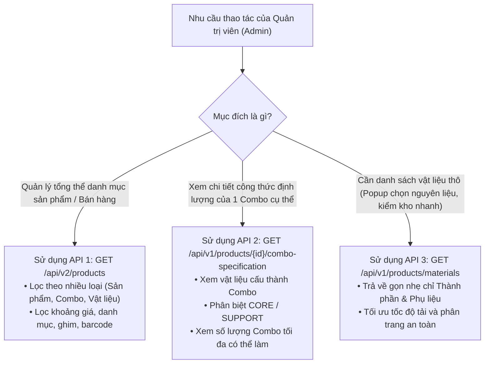

# Danh Sách & Chức Năng Các API Đã Triển Khai — Hoa Theo Mùa

---

## 📌 Bảng Tổng Quan Các API

| STT | HTTP Method | Endpoint | Hàm Xử lý trong Service | Request DTO | Response DTO | Tài liệu Kỹ thuật (TDD / Story) | Chức năng chính |
| :---: | :---: | :--- | :--- | :--- | :--- | :---: | :--- |
| **1** | `GET` | `/api/v2/products` | `GetLocalProductsV2` | `LocalProductQueryRequest` | `BasePaginationResponse` <br>(chứa `ProductDetailResponse`) | [TDD-010](file:///d:/VNZ/document-first-brief/hoatheomua/TDD/MaterialManagement/TDD-010.md)<br>([STORY-002](file:///d:/VNZ/document-first-brief/hoatheomua/UserStory/MaterialManagement/02-ViewSearchMaterialsList.md), [STORY-012](file:///d:/VNZ/document-first-brief/hoatheomua/UserStory/MaterialManagement/12-InventoryAndSellabilityAlerts.md)) | Xem, tìm kiếm và lọc đa tiêu chí danh sách sản phẩm / nguyên vật liệu từ Local Database. |
| **2** | `GET` | `/api/v1/products/{id}/combo-specification` | `GetComboSpecificationAsync` | `Guid id` (Path Parameter) | `ComboSpecificationResponse`<br>(chứa `MaterialItemResponse`) | [TDD-011](file:///d:/VNZ/document-first-brief/hoatheomua/TDD/MaterialManagement/TDD-011.md)<br>([STORY-006](file:///d:/VNZ/document-first-brief/hoatheomua/UserStory/MaterialManagement/06-ViewComboFormula.md)) | Xem chi tiết công thức định lượng của Combo hoa, phân loại vai trò và tính số lượng có thể bán. |
| **3** | `GET` | `/api/v1/products/materials` | `GetMaterialsAsync` | `GetMaterialsRequest` | `BasePaginationResponse`<br>(chứa `MaterialResponse`) | [TestCase_Templates_GetMaterials](file:///d:/VNZ/document-first-brief/hoatheomua/UnitTest/MaterialManagement/TestCase_Templates_GetMaterials.md)<br>([STORY-002](file:///d:/VNZ/document-first-brief/hoatheomua/UserStory/MaterialManagement/02-ViewSearchMaterialsList.md), [STORY-006](file:///d:/VNZ/document-first-brief/hoatheomua/UserStory/MaterialManagement/06-ViewComboFormula.md)) | Lấy danh sách rút gọn các nguyên vật liệu thô (Thành phần hoa & Phụ liệu) để chọn làm công thức hoặc quản lý kho. |

---

## 🔍 Chi Tiết Từng API

---

### 1. API Xem & Lọc Danh Sách Sản Phẩm V2

* **HTTP Method:** `GET`
* **Endpoint:** `/api/v2/products`
* **Hàm Service:** `GetLocalProductsV2(Request.LocalProductQueryRequest request)`
* **Controller:** `ProductController`

#### 🎯 Mục đích & Ngữ cảnh
Cung cấp API tìm kiếm và phân loại sản phẩm tổng thể từ cơ sở dữ liệu nội bộ (Local Database). Cho phép Quản trị viên (Admin) lọc riêng nguyên vật liệu thô, sản phẩm combo hoa, hoặc sản phẩm thông thường, kết hợp với các bộ lọc giá, danh mục và phân trang.

#### 📥 Tham số Request (Query Parameters):
| Tham số | Kiểu dữ liệu | Mặc định | Mô tả |
| :--- | :--- | :---: | :--- |
| `pageIndex` | `int` | `1` | Số thứ tự trang hiện tại ($\ge 1$). |
| `pageSize` | `int` | `10` | Số lượng sản phẩm mỗi trang ($1 \le \text{pageSize} \le 100$). |
| `search` | `string?` | `null` | Từ khóa tìm kiếm theo: Tên sản phẩm (`ProductName`), Mã vạch (`Barcode`), Mã nhanh (`NhanhProductId`). |
| `productType` | `string?` | `null` | Bộ lọc phân loại sản phẩm:<br>• `"thành phần"` / `"components"` / `"2"`: Lọc nguyên vật liệu thô.<br>• `"combo"` / `"1"`: Lọc sản phẩm Combo hoa.<br>• `"sản phẩm"` / `"product"` / `"3"`: Lọc sản phẩm đơn lẻ thông thường. |
| `priceFrom` | `decimal?` | `null` | Lọc sản phẩm có giá bán $\ge$ `priceFrom`. |
| `priceTo` | `decimal?` | `null` | Lọc sản phẩm có giá bán $\le$ `priceTo`. |
| `categoryIds` | `List<Guid>?` | `null` | Danh sách ID danh mục sản phẩm. |
| `isPin` | `bool?` | `null` | Lọc theo trạng thái ghim lên đầu (`true`/`false`). |
| `sortBy` | `List<string>?` | `["-createdAt"]` | Tiêu chí sắp xếp (`price`, `-price`, `name`, `-name`, `createdAt`, `-createdAt`). |

#### ⚙️ Thuật toán & Logic Cốt lõi:
1. **Lọc dữ liệu cơ bản:** Chỉ lấy các sản phẩm chưa bị xóa mềm (`!IsDeleted`) và là sản phẩm độc lập/sản phẩm cha (`ParentProductId == null || ParentProductId == ""`).
2. **Xử lý nhãn vật liệu (`productType = "thành phần"`):** Sử dụng `EF.Functions.Like(x.ProductLabel, "%thành phần%")` để nhận diện nguyên vật liệu không phân biệt chữ hoa/chữ thường.
3. **Tối ưu hóa hiệu năng:** Sử dụng `AsNoTracking()`, thực hiện đếm `CountAsync()` trước khi phân trang bằng `.Skip().Take()`.

#### 📤 Response Mẫu (200 OK):
```json
{
  "value": {
    "items": [
      {
        "id": "2066d62d-c314-4ee0-bbbd-90865e3779a6",
        "barcode": "2000214269499",
        "productCode": "VL_HH_DO",
        "productName": "Hoa Hồng Đỏ Cành Đà Lạt",
        "unit": "cành",
        "price": 12000,
        "availableForSale": 150,
        "productLabel": "thành phần, hoa tươi",
        "coverImage": "https://pos.nvncdn.com/281991-126981/ps/20251229_0yynbkmHKI.jpeg"
      }
    ],
    "pageIndex": 1,
    "pageSize": 10,
    "totalItems": 6,
    "totalPages": 1
  },
  "isSuccess": true,
  "error": "Lấy danh sách sản phẩm thành công"
}
```

---

### 2. API Xem Công Thức Định Lượng Combo Hoa

* **HTTP Method:** `GET`
* **Endpoint:** `/api/v1/products/{id}/combo-specification`
* **Hàm Service:** `GetComboSpecificationAsync(Guid id)`
* **Controller:** `ProductController`

#### 🎯 Mục đích & Ngữ cảnh
Xem chi tiết các nguyên vật liệu cấu thành nên một Combo hoa (bó hoa, lẵng hoa hoàn thiện). Tự động phân tách vai trò của vật liệu và tính toán khả năng lắp ráp tối đa dựa trên số lượng tồn kho khả dụng hiện tại.

#### 📥 Tham số Request (Path Parameter):
| Tham số | Kiểu dữ liệu | Bắt buộc | Mô tả |
| :--- | :--- | :---: | :--- |
| `id` | `Guid` | **Có** | ID của sản phẩm Combo hoa cần xem công thức định lượng. |

#### ⚙️ Thuật toán & Logic Cốt lõi:
1. **Kiểm tra Combo:** Kiểm tra sự tồn tại của Combo (`p.Id == id && !p.IsDeleted`). Nếu không tìm thấy $\rightarrow$ Ném ngoại lệ `NotFoundException` (404).
2. **Truy vấn danh sách định lượng:** Join bảng `ComboSpecification` với bảng `Product (Mat)`, chỉ lấy các bản ghi đang active (`c.IsActive`) và vật liệu chưa bị xóa (`!c.Mat.IsDeleted`).
3. **Tính toán khả năng cung ứng cho từng dòng:**
   $$\text{MaxComboPossible} = \lfloor \frac{\text{AvailableForSale}}{\text{QuantityPerCombo}} \rfloor$$
4. **Sắp xếp theo vai trò (`Role`):** Sử dụng `.OrderBy(x => x.Role)` để đưa phụ liệu (`Role = false / SUPPORT`) và chính liệu (`Role = true / CORE`) vào đúng vị trí hiển thị.
5. **Combo chưa có công thức:** Trả về HTTP 200 với danh sách `materials = []` mà không bị crash hệ thống.

#### 📤 Response Mẫu (200 OK):
```json
{
  "value": {
    "subId": "2066d62d-c314-4ee0-bbbd-90865e3779a6",
    "productCode": "HB_JBK_2026",
    "productName": "Hồng Julibee Bó Kiểu Mặt Xinh_2026",
    "materials": [
      {
        "materialId": "4933640",
        "materialName": "Giấy gói hoa Hàn Quốc",
        "role": false,
        "quantityPerCombo": 2,
        "unit": "Tờ",
        "availableForSale": 30,
        "maxComboPossible": 15
      },
      {
        "materialId": "4933642",
        "materialName": "Hoa hồng Julibee",
        "role": true,
        "quantityPerCombo": 10,
        "unit": "Cành",
        "availableForSale": 50,
        "maxComboPossible": 5
      }
    ]
  },
  "isSuccess": true,
  "error": "Tải công thức combo hoa thành công"
}
```

---

### 3. API Lấy Danh Sách Nguyên Vật Liệu Rút Gọn

* **HTTP Method:** `GET`
* **Endpoint:** `/api/v1/products/materials`
* **Hàm Service:** `GetMaterialsAsync(Request.GetMaterialsRequest request)`
* **Controller:** `ProductController`

#### 🎯 Mục đích & Ngữ cảnh
Cung cấp danh sách nguyên vật liệu thô với cấu trúc DTO rút gọn, chuyên biệt phục vụ cho Quản trị viên khi mở popup chọn nguyên liệu để thêm vào công thức Combo hoặc kiểm tra nhanh kho vật liệu.

#### 📥 Tham số Request (Query Parameters):
| Tham số | Kiểu dữ liệu | Mặc định | Mô tả |
| :--- | :--- | :---: | :--- |
| `PageIndex` | `int` | `1` | Chỉ số trang (tự động đưa về `1` nếu $\le 0$). |
| `PageSize` | `int` | `20` | Số lượng phần tử mỗi trang (tự động đưa về `10` nếu $\le 0$, giới hạn tối đa `100`). |
| `ProductLabel` | `string?` | `null` | Nhãn nguyên liệu cần lọc cụ thể (ví dụ: `"Thành phần"`, `"Phụ liệu"`). |
| `Search` | `string?` | `null` | Từ khóa tìm kiếm theo Tên sản phẩm (`ProductName`) hoặc Mã quản lý (`ProductCode`), không phân biệt hoa thường. |

#### ⚙️ Thuật toán & Logic Cốt lõi:
1. **Chuẩn hóa phân trang tự động:** 
   ```csharp
   request.PageIndex = request.PageIndex <= 0 ? 1 : request.PageIndex;
   request.PageSize = request.PageSize <= 0 ? 10 : Math.Min(request.PageSize, 100);
   ```
2. **Logic Lọc Nhãn Thông Minh:**
   * **Nếu truyền `ProductLabel`:** Lọc chính xác theo nhãn chuẩn hóa chữ thường:
     `p.ProductLabel!.ToLower() == normalizedLabel`
   * **Nếu KHÔNG truyền `ProductLabel`:** Mặc định lấy cả 2 nhóm nguyên vật liệu thô:
     `p.ProductLabel!.ToLower() == "thành phần" || p.ProductLabel!.ToLower() == "phụ liệu"`
3. **Ánh xạ DTO tinh gọn:** Trả về `MaterialResponse` gồm: `MaterialId`, `MaterialCode`, `MaterialName`, `Unit`, `AvailableForSale`, `CoverImage`, `ProductLabel`.

#### 📤 Response Mẫu (200 OK):
```json
{
  "value": {
    "items": [
      {
        "materialId": "2066d62d-c314-4ee0-bbbd-90865e3779a6",
        "materialCode": "VL_HH_DO",
        "materialName": "Hoa Hồng Đỏ Cành Đà Lạt",
        "unit": "cành",
        "availableForSale": 150.0,
        "coverImage": "https://pos.nvncdn.com/281991-126981/ps/20251229_0yynbkmHKI.jpeg",
        "productLabel": "thành phần, hoa tươi"
      },
      {
        "materialId": "3fa85f64-5717-4562-b3fc-2c963f66afa6",
        "materialCode": "PL_GG_HQ",
        "materialName": "Giấy gói hoa Hàn Quốc",
        "unit": "Tờ",
        "availableForSale": 30.0,
        "coverImage": "https://pos.nvncdn.com/giay-goi.jpg",
        "productLabel": "phụ liệu"
      }
    ],
    "pageIndex": 1,
    "pageSize": 10,
    "totalCount": 2
  },
  "isSuccess": true,
  "error": "Lấy danh sách thành công"
}
```

---

## ⚖️ Ma Trận Phân Biệt & Khi Nào Sử Dụng API Nào?


