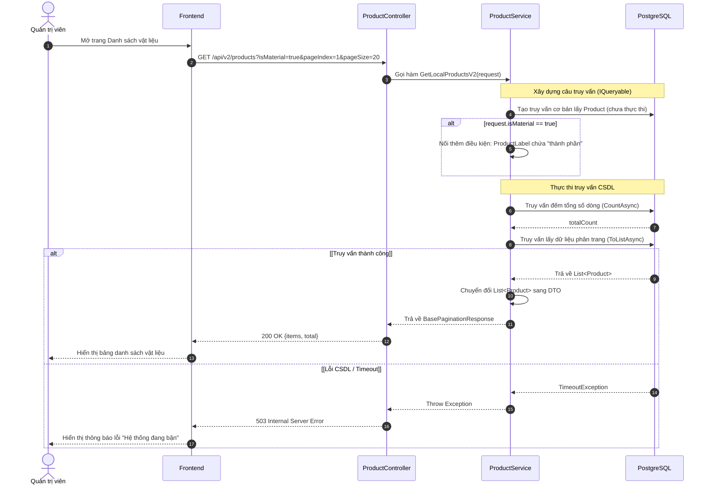

# Tài liệu Kỹ thuật (Sequence Diagram & TDD) - US002

Tài liệu này bao gồm các Sequence Diagram và mã nguồn dự kiến (TDD) sẽ được lập trình trong project backend (`hoatheomua-be`) để đáp ứng chức năng trong US002.

---

## 1. US002: Lọc sản phẩm là Vật Liệu (Label chứa "thành phần")

**Mô tả ngắn:** Xem, tìm kiếm và filter theo sản phẩm có nhãn là vật liệu.

### Bối cảnh (Context)
Trong hệ thống của HoaTheoMua, danh mục sản phẩm đang lưu trữ chung giữa thành phẩm bán ra (Combo, bó hoa hoàn thiện) và các nguyên vật liệu thô (hoa tươi lẻ, giấy gói, phụ kiện). Việc không có công cụ phân tách rõ ràng khiến Quản trị viên (Admin) gặp khó khăn, mất nhiều thời gian khi chỉ muốn tra cứu tồn kho nguyên liệu, hoặc khi cần chọn vật liệu để tạo cấu hình định lượng (công thức) cho các sản phẩm Combo.

### Mục tiêu (Objectives)
*   **Phân loại tự động:** Hệ thống có khả năng nhận diện các sản phẩm đóng vai trò là "Nguyên vật liệu" thông qua thuộc tính `ProductLabel` (có chứa từ khóa "thành phần").
*   **Tối ưu quản lý:** Cung cấp API (hỗ trợ tham số `isMaterial`) để Frontend có thể filter, xem và tìm kiếm độc lập danh sách chỉ chứa các vật liệu.
*   **Tiền đề mở rộng:** Tạo ra nguồn dữ liệu đầu vào chuẩn xác, sẵn sàng phục vụ cho chức năng Thiết lập công thức định lượng Combo (US006) và quản lý tồn kho nguyên liệu sau này.

### 1.1. Sequence Diagram



### 1.2. TDD - Bổ sung Parameter vào Request
Sửa đổi file `HoaTheoMua.Service/Product/Request.cs` để nhận biến `isMaterial` từ query URL.

```csharp
public class LocalProductQueryRequest
{
    // ... các field cũ
    public bool? isPin { get; set; }
    
    // [THÊM MỚI] Dùng để lọc vật liệu
    public bool? isMaterial { get; set; }
}
```

### 1.3. TDD - Kịch bản Unit Test (Test-Driven)
Thêm vào file `HoaTheoMua.Service.Test/ProductTest/LocalProductSearchV2Test.cs`:

```csharp
    #region TDD - US002: Lọc sản phẩm là Vật Liệu (isMaterial)

    [Fact]
    public async Task GetLocalProductsV2_FilterByIsMaterialTrue_ReturnsOnlyMaterials()
    {
        // 1. Arrange: Chuẩn bị DB giả lập
        using var dbContext = CreateInMemoryDbContext();
        var service = CreateService(dbContext);

        var p1 = new ProductEntity { Id = Guid.NewGuid(), ProductName = "Hoa hồng", ProductLabel = "thành phần, hoa tươi", Position = 1, IsDeleted = false };
        var p2 = new ProductEntity { Id = Guid.NewGuid(), ProductName = "Giấy gói", ProductLabel = "phụ kiện, Thành PHẦN", Position = 2, IsDeleted = false }; // Test case-insensitive
        var p3 = new ProductEntity { Id = Guid.NewGuid(), ProductName = "Combo 1", ProductLabel = "combo", Position = 3, IsDeleted = false };
        var p4 = new ProductEntity { Id = Guid.NewGuid(), ProductName = "Không label", ProductLabel = null, Position = 4, IsDeleted = false };

        await dbContext.Products.AddRangeAsync(p1, p2, p3, p4);
        await dbContext.SaveChangesAsync();

        // 2. Act: Gọi hàm lấy danh sách với cờ isMaterial = true
        var result = await service.GetLocalProductsV2(new Request.LocalProductQueryRequest
        {
            isMaterial = true
        });

        var items = result.Value.Items.Cast<Response.ProductDetailResponse>().ToList();

        // 3. Assert: Kiểm tra chỉ 2 vật liệu được trả về và không phân biệt chữ hoa/thường
        Assert.Equal(2, items.Count);
        Assert.Contains("Hoa hồng", items.Select(x => x.ProductName));
        Assert.Contains("Giấy gói", items.Select(x => x.ProductName));
        Assert.DoesNotContain("Combo 1", items.Select(x => x.ProductName));
        Assert.DoesNotContain("Không label", items.Select(x => x.ProductName));
        
        // Assert phân trang
        Assert.Equal(2, result.Value.TotalItem);
    }

    [Fact]
    public async Task GetLocalProductsV2_FilterByIsMaterialFalseOrNull_ReturnsAllProducts()
    {
        // 1. Arrange
        using var dbContext = CreateInMemoryDbContext();
        var service = CreateService(dbContext);

        var p1 = new ProductEntity { Id = Guid.NewGuid(), ProductName = "Hoa hồng", ProductLabel = "thành phần, hoa tươi", Position = 1, IsDeleted = false };
        var p2 = new ProductEntity { Id = Guid.NewGuid(), ProductName = "Combo 1", ProductLabel = "combo", Position = 2, IsDeleted = false };

        await dbContext.Products.AddRangeAsync(p1, p2);
        await dbContext.SaveChangesAsync();

        // 2. Act: Gọi hàm với isMaterial = false
        var resultFalse = await service.GetLocalProductsV2(new Request.LocalProductQueryRequest
        {
            isMaterial = false
        });
        
        // 3. Act: Gọi hàm với isMaterial = null
        var resultNull = await service.GetLocalProductsV2(new Request.LocalProductQueryRequest
        {
            isMaterial = null
        });

        // 4. Assert: Phải trả về đủ 2 sản phẩm
        Assert.Equal(2, resultFalse.Value.Items.Count);
        Assert.Equal(2, resultNull.Value.Items.Count);
    }

    [Fact]
    public async Task GetLocalProductsV2_FilterByIsMaterialTrue_WithCategory()
    {
        // 1. Arrange
        using var dbContext = CreateInMemoryDbContext();
        var service = CreateService(dbContext);

        var category = new CategoryProductEntity
        {
            Id = Guid.NewGuid(),
            Name = "Vật liệu",
            Type = CategoryProductType.Fix,
            IsActive = true,
            IsDeleted = false
        };
        var p1 = new ProductEntity { Id = Guid.NewGuid(), ProductName = "Lá bạch đàn", ProductLabel = "thành phần", Position = 1, IsDeleted = false };
        var p2 = new ProductEntity { Id = Guid.NewGuid(), ProductName = "Giấy báo", ProductLabel = "thành phần", Position = 2, IsDeleted = false };
        var p3 = new ProductEntity { Id = Guid.NewGuid(), ProductName = "Băng keo", ProductLabel = "phụ liệu", Position = 3, IsDeleted = false };

        await dbContext.CategoryProducts.AddAsync(category);
        await dbContext.Products.AddRangeAsync(p1, p2, p3);
        
        // Chỉ Lá bạch đàn và Băng keo nằm trong category này
        await dbContext.CategoryProductDetails.AddRangeAsync(
            new CategoryProductDetail { Id = Guid.NewGuid(), CategoryProductId = category.Id, ProductId = p1.Id, IsPin = false, Position = 10, IsDeleted = false },
            new CategoryProductDetail { Id = Guid.NewGuid(), CategoryProductId = category.Id, ProductId = p3.Id, IsPin = false, Position = 20, IsDeleted = false });
            
        await dbContext.SaveChangesAsync();

        // 2. Act: Truy vấn category "Vật liệu" VÀ isMaterial = true
        var result = await service.GetLocalProductsV2(new Request.LocalProductQueryRequest
        {
            categoryIds = new List<Guid> { category.Id },
            isMaterial = true
        });

        var items = result.Value.Items.Cast<Response.ProductDetailResponse>().ToList();
        
        // 3. Assert: Phải chỉ trả về p1 (Lá bạch đàn), vì nó vừa thuộc category vừa là thành phần.
        // p2 là thành phần nhưng KHÔNG thuộc category -> Loại
        // p3 thuộc category nhưng KHÔNG là thành phần -> Loại
        Assert.Single(items);
        Assert.Equal("Lá bạch đàn", items[0].ProductName);
    }
    #endregion
```

### 1.4. TDD - Triển khai Logic thực tế
Cập nhật hàm `GetLocalProductsV2` trong `HoaTheoMua.Service/Product/Service.cs` để test pass:

```csharp
// Logic lọc vật liệu
if (request.isMaterial.HasValue && request.isMaterial.Value)
{
    query = query.Where(x => x.ProductLabel != null && x.ProductLabel.ToLower().Contains("thành phần"));
}
```

---

### 1.5. API Contract

**Endpoint:** `GET /api/v2/products`

**Description:** Lấy danh sách sản phẩm (có hỗ trợ lọc vật liệu).

**Query Parameters:**

| Parameter | Type | Required | Description |
| :--- | :--- | :--- | :--- |
| `pageIndex` | int | No | Trang hiện tại (Mặc định 1) |
| `pageSize` | int | No | Số lượng trên 1 trang (Mặc định 20) |
| `categoryIds` | array | No | Danh sách ID danh mục |
| `isPin` | boolean | No | Lọc sản phẩm ghim |
| **`isMaterial`** | **boolean** | **No** | **`true` để lọc các sản phẩm là Vật Liệu (Label chứa "thành phần"). Nếu `false` hoặc bỏ trống, hệ thống không lọc điều kiện này.** |

**Response (200 OK):**

```json
{
  "code": 200,
  "message": "Thành công",
  "value": {
    "totalItem": 100,
    "items": [
      {
        "id": "3fa85f64-5717-4562-b3fc-2c963f66afa6",
        "productName": "Hoa hồng",
        "productLabel": "thành phần, hoa tươi",
        "price": 10000,
        "isPin": false,
        "position": 1
      }
    ]
  }
}
```

### 1.6. Danh sách Mã lỗi (Error Codes)

| Mã lỗi (Code) | HTTP Status | Khi nào xảy ra |
| :--- | :--- | :--- |
| `INVALID_PARAMETER` | 400 | Truyền tham số không hợp lệ (VD: pageIndex sai format, categoryIds không phải mảng) |
| `UNAUTHORIZED` | 401 | Người dùng chưa đăng nhập, token hết hạn hoặc không có quyền gọi API này |
| `SERVER_BUSY` | 503 | Hệ thống đang bận, lỗi kết nối hoặc truy vấn CSDL quá lâu (timeout) |
